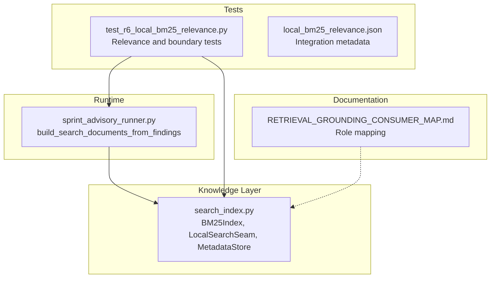
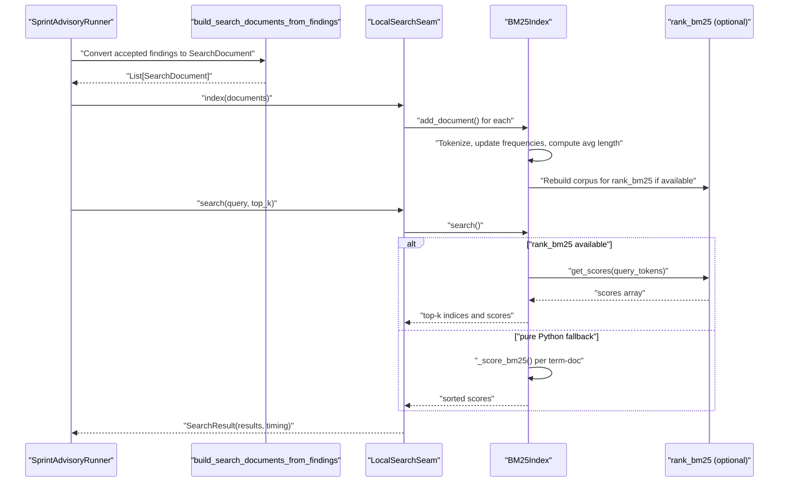
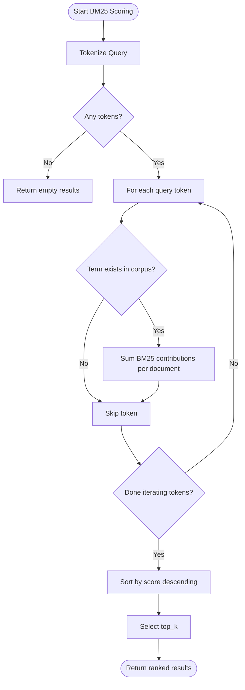
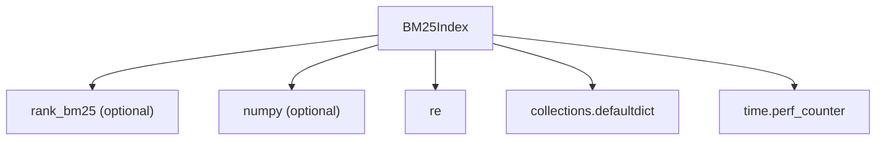

# BM25 Sparse Retrieval Index

<cite>
**Referenced Files in This Document**
- [search_index.py](file://knowledge/search_index.py)
- [search_index.py.bak_R6_LOCAL_BM25_RELEVANCE](file://knowledge/search_index.py.bak_R6_LOCAL_BM25_RELEVANCE)
- [test_r6_local_bm25_relevance.py](file://tests/r6_local_bm25_relevance/test_r6_local_bm25_relevance.py)
- [local_bm25_relevance.json](file://tests/r6_local_bm25_relevance/local_bm25_relevance.json)
- [sprint_advisory_runner.py](file://runtime/sprint_advisory_runner.py)
- [RETRIEVAL_GROUNDING_CONSUMER_MAP.md](file://knowledge/RETRIEVAL_GROUNDING_CONSUMER_MAP.md)
</cite>

## Table of Contents
1. [Introduction](#introduction)
2. [Project Structure](#project-structure)
3. [Core Components](#core-components)
4. [Architecture Overview](#architecture-overview)
5. [Detailed Component Analysis](#detailed-component-analysis)
6. [Dependency Analysis](#dependency-analysis)
7. [Performance Considerations](#performance-considerations)
8. [Troubleshooting Guide](#troubleshooting-guide)
9. [Conclusion](#conclusion)

## Introduction
This document provides comprehensive technical documentation for the BM25 sparse retrieval index implementation used for local, advisory-only search over accepted findings. It explains the BM25Okapi algorithm with tunable parameters k1 and b, the tokenization strategy, document frequency tracking, and average document length calculation. It details the dual implementation approach using the rank_bm25 library for performance optimization with a pure Python fallback, the MAX_BM25_DOCUMENTS limit for memory safety, the document addition workflow, and the search ranking mechanism. It also covers examples of BM25 scoring calculations, query processing, and integration with hybrid retrieval systems within the broader knowledge layer.

## Project Structure
The BM25 implementation resides in the knowledge layer and integrates with runtime advisory orchestration:

- BM25 index and search facade: knowledge/search_index.py
- Advisory integration and document conversion: runtime/sprint_advisory_runner.py
- Test suite validating behavior and compliance: tests/r6_local_bm25_relevance/*
- Architectural role mapping for retrieval modules: knowledge/RETRIEVAL_GROUNDING_CONSUMER_MAP.md

**Diagram sources**
- [search_index.py:1-227](file://knowledge/search_index.py#L1-L227)
- [sprint_advisory_runner.py:50-95](file://runtime/sprint_advisory_runner.py#L50-L95)
- [test_r6_local_bm25_relevance.py:1-407](file://tests/r6_local_bm25_relevance/test_r6_local_bm25_relevance.py#L1-L407)
- [local_bm25_relevance.json:1-55](file://tests/r6_local_bm25_relevance/local_bm25_relevance.json#L1-L55)
- [RETRIEVAL_GROUNDING_CONSUMER_MAP.md:1-315](file://knowledge/RETRIEVAL_GROUNDING_CONSUMER_MAP.md#L1-L315)

**Section sources**
- [search_index.py:1-227](file://knowledge/search_index.py#L1-L227)
- [sprint_advisory_runner.py:50-95](file://runtime/sprint_advisory_runner.py#L50-L95)
- [test_r6_local_bm25_relevance.py:1-407](file://tests/r6_local_bm25_relevance/test_r6_local_bm25_relevance.py#L1-L407)
- [local_bm25_relevance.json:1-55](file://tests/r6_local_bm25_relevance/local_bm25_relevance.json#L1-L55)
- [RETRIEVAL_GROUNDING_CONSUMER_MAP.md:1-315](file://knowledge/RETRIEVAL_GROUNDING_CONSUMER_MAP.md#L1-L315)

## Core Components
- BM25Index: Implements BM25Okapi scoring with configurable k1 and b, tokenization, document frequency tracking, average document length computation, and dual-mode search using rank_bm25 or pure Python fallback.
- LocalSearchSeam: Facade combining BM25Index and MetadataStore, providing index and search APIs with timing and bounded result limits.
- MetadataStore: Lightweight dictionary-backed store for URL-to-metadata mapping.
- SearchDocument/SearchResult: Data carriers for indexed documents and search results with timing metadata.

Key characteristics:
- Tokenization: Lowercase alphabetic token extraction using regular expressions.
- Scoring: BM25Okapi with shifted IDF and term-frequency normalization controlled by k1 and b.
- Memory safety: MAX_BM25_DOCUMENTS bounds corpus growth.
- Performance: rank_bm25 availability triggers optimized path; otherwise uses pure Python implementation.
- Integration: Seam for advisory-only search over accepted findings without persistent writes.

**Section sources**
- [search_index.py:34-151](file://knowledge/search_index.py#L34-L151)
- [search_index.py:179-227](file://knowledge/search_index.py#L179-L227)

## Architecture Overview
The BM25 index sits within the knowledge layer and is invoked by the runtime advisory system to provide local, fail-soft search over accepted findings.

**Diagram sources**
- [sprint_advisory_runner.py:50-95](file://runtime/sprint_advisory_runner.py#L50-L95)
- [search_index.py:179-227](file://knowledge/search_index.py#L179-L227)
- [search_index.py:121-150](file://knowledge/search_index.py#L121-L150)

## Detailed Component Analysis

### BM25Okapi Algorithm and Parameters
- Algorithm: Implements BM25Okapi with:
  - Term-frequency normalization controlled by k1 and b.
  - Document frequency-based IDF with a positive shift to ensure positivity.
  - Saturation behavior via the denominator that grows with document length relative to average document length.
- Parameters:
  - k1: Controls term frequency saturation; higher values increase saturation.
  - b: Controls the effect of document length normalization; typical values around 0.75.
- Scoring function: Applies BM25Okapi per term-document pair and aggregates scores across query terms.

Implementation highlights:
- Tokenization uses alphabetic word extraction and lowercasing.
- IDF uses a shifted variant to guarantee positive contributions.
- Average document length is recomputed incrementally upon document addition.
- Dual implementation: rank_bm25.get_scores() for speed; pure Python loop for correctness and portability.

**Section sources**
- [search_index.py:63-86](file://knowledge/search_index.py#L63-L86)
- [search_index.py:121-150](file://knowledge/search_index.py#L121-L150)

### Tokenization Strategy
- Pattern: Extracts sequences of alphabetic characters using a regular expression.
- Normalization: Converts tokens to lowercase to improve matching robustness.
- Usage: Applied to both document content during indexing and query during search.

**Section sources**
- [search_index.py:63-65](file://knowledge/search_index.py#L63-L65)

### Document Frequency Tracking and Average Length Calculation
- Document frequency (df): Tracks how many documents contain each term; used in IDF computation.
- Term-document frequency (tf): Stores per-term frequency for each document index.
- Document lengths: Maintains a list of tokenized lengths for each document.
- Average document length: Recomputed as total tokens divided by number of documents.

These structures enable efficient BM25 scoring and ensure consistent normalization across documents.

**Section sources**
- [search_index.py:47-51](file://knowledge/search_index.py#L47-L51)
- [search_index.py:98-114](file://knowledge/search_index.py#L98-L114)

### Dual Implementation Approach
- rank_bm25 path: If available, rebuilds the corpus tokenizer and uses BM25Okapi.get_scores() for vectorized scoring.
- Pure Python fallback: Iterates over query tokens and term-document frequencies, computing BM25 scores manually and aggregating per-document totals.

This design ensures performance when rank_bm25 is installed while maintaining correctness and portability otherwise.

**Section sources**
- [search_index.py:54-61](file://knowledge/search_index.py#L54-L61)
- [search_index.py:130-150](file://knowledge/search_index.py#L130-L150)

### MAX_BM25_DOCUMENTS Limit and Memory Safety
- Limit: The index silently drops new documents once the maximum capacity is reached.
- Rationale: Prevents unbounded growth of internal structures (term-document frequency maps, document lists, and average length computations).
- Behavior: add_document() checks capacity before insertion and logs a debug message when exceeded.

**Section sources**
- [search_index.py:41](file://knowledge/search_index.py#L41)
- [search_index.py:92-96](file://knowledge/search_index.py#L92-L96)

### Document Addition Workflow
- Tokenization: Content is tokenized and length recorded.
- Frequency updates: Term-document frequency increments and document frequency increments for each unique term.
- Corpus statistics: Total document count and average length are updated.
- rank_bm25 reinitialization: If enabled, the corpus is rebuilt to reflect the new document.

This workflow ensures that BM25 statistics remain consistent with the current corpus.

**Section sources**
- [search_index.py:92-119](file://knowledge/search_index.py#L92-L119)

### Search Ranking Mechanism
- Query processing: Query is tokenized using the same pattern as documents.
- Score computation:
  - rank_bm25 path: Uses vectorized get_scores() and sorts top-k results.
  - Fallback path: Sums BM25 scores across query terms for each document.
- Result shaping: Returns pairs of (document index, score) sorted by score descending, truncated to top_k.

**Section sources**
- [search_index.py:121-150](file://knowledge/search_index.py#L121-L150)

### Integration with Hybrid Retrieval Systems
- Role separation: The BM25 index is part of the grounding authority (rag_engine) alongside vector search; it is not an identity store (lancedb_store) nor a compression layer (pq_index).
- Consumer mapping: The BM25 index supports advisory-only search without persistent writes, aligning with the retrieval grounding consumer matrix.
- Hybrid retrieval: BM25 complements vector-based retrieval in hybrid engines, providing lexical matching strength.

**Section sources**
- [RETRIEVAL_GROUNDING_CONSUMER_MAP.md:27-36](file://knowledge/RETRIEVAL_GROUNDING_CONSUMER_MAP.md#L27-L36)
- [RETRIEVAL_GROUNDING_CONSUMER_MAP.md:160-194](file://knowledge/RETRIEVAL_GROUNDING_CONSUMER_MAP.md#L160-L194)

### Example Scenarios and Workflows

#### BM25 Scoring Calculation Example
- Input: A query token appears in multiple documents with varying term frequencies.
- Process:
  - Compute IDF using document frequency and shifted variant.
  - For each document containing the token, compute the BM25 term contribution using k1 and b normalization.
  - Aggregate per-document scores across query tokens.
- Output: Ranked list of (document index, score) pairs.

**Diagram sources**
- [search_index.py:141-149](file://knowledge/search_index.py#L141-L149)
- [search_index.py:67-85](file://knowledge/search_index.py#L67-L85)

#### Query Processing Example
- Input: A natural language query string.
- Process:
  - Tokenize query using the same pattern as documents.
  - Retrieve candidate documents containing any query token.
  - Compute BM25 scores using either rank_bm25 or pure Python path.
- Output: Search results with attached metadata and timing.

**Section sources**
- [search_index.py:126-135](file://knowledge/search_index.py#L126-L135)
- [search_index.py:206-227](file://knowledge/search_index.py#L206-L227)

#### Advisory Integration Example
- Input: Accepted findings from the sprint pipeline.
- Process:
  - Convert findings to SearchDocument records with deduplication by URL and bounded by MAX_INDEXED_FINDINGS.
  - Index documents via LocalSearchSeam.
  - Perform search with timing measurement and bounded top_k.
- Output: Advisory outcome with local search metrics and top results.

**Section sources**
- [sprint_advisory_runner.py:50-95](file://runtime/sprint_advisory_runner.py#L50-L95)
- [search_index.py:179-227](file://knowledge/search_index.py#L179-L227)
- [test_r6_local_bm25_relevance.py:61-123](file://tests/r6_local_bm25_relevance/test_r6_local_bm25_relevance.py#L61-L123)

## Dependency Analysis
The BM25 index depends on:
- rank_bm25 (optional): Enables vectorized scoring for improved performance.
- numpy (when using rank_bm25): Required for sorting top-k results.
- Standard library modules: re, defaultdict, perf_counter.

**Diagram sources**
- [search_index.py:54-61](file://knowledge/search_index.py#L54-L61)
- [search_index.py:132-135](file://knowledge/search_index.py#L132-L135)

**Section sources**
- [search_index.py:54-61](file://knowledge/search_index.py#L54-L61)
- [search_index.py:132-135](file://knowledge/search_index.py#L132-L135)

## Performance Considerations
- rank_bm25 path: Preferable when available for faster scoring; triggers corpus rebuild on each document addition.
- Pure Python fallback: Ensures correctness and portability; scales linearly with query tokens and unique term-document pairs.
- Memory safety: MAX_BM25_DOCUMENTS prevents unbounded memory growth; consider tuning based on available resources.
- Tokenization overhead: Regex-based tokenization is lightweight but can be optimized further if needed.
- Incremental statistics: Average document length and document frequencies are updated incrementally, minimizing recomputation costs.

[No sources needed since this section provides general guidance]

## Troubleshooting Guide
Common issues and resolutions:
- rank_bm25 not installed: The system automatically falls back to pure Python scoring. Verify that search still works and consider installing rank_bm25 for performance.
- Empty results: Ensure query tokens are produced by tokenization; empty queries or queries with no matches return empty results.
- Capacity exceeded: If indexing stops accepting new documents, review MAX_BM25_DOCUMENTS and consider increasing it or clearing the index.
- Timing and result limits: LocalSearchSeam measures search duration and enforces MAX_RESULT_SET; adjust top_k accordingly.

Validation references:
- Tests confirm fail-soft behavior, bounded results, and advisory-only operation without persistent writes or network calls.

**Section sources**
- [test_r6_local_bm25_relevance.py:128-141](file://tests/r6_local_bm25_relevance/test_r6_local_bm25_relevance.py#L128-L141)
- [test_r6_local_bm25_relevance.py:268-284](file://tests/r6_local_bm25_relevance/test_r6_local_bm25_relevance.py#L268-L284)
- [test_r6_local_bm25_relevance.py:297-323](file://tests/r6_local_bm25_relevance/test_r6_local_bm25_relevance.py#L297-L323)

## Conclusion
The BM25 sparse retrieval index provides a robust, memory-safe, and performant local search solution integrated into the advisory pipeline. Its dual implementation approach ensures optimal performance when rank_bm25 is available while maintaining correctness and portability through a pure Python fallback. The implementation adheres to strict architectural boundaries, supporting hybrid retrieval systems without introducing new storage authorities or persistent writes.