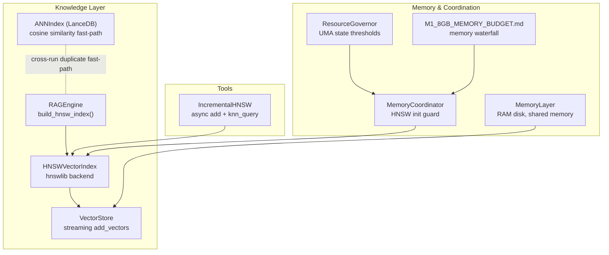
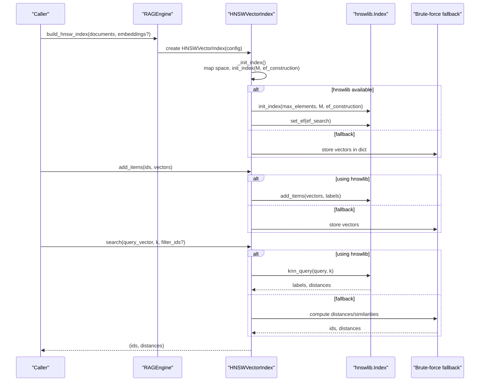
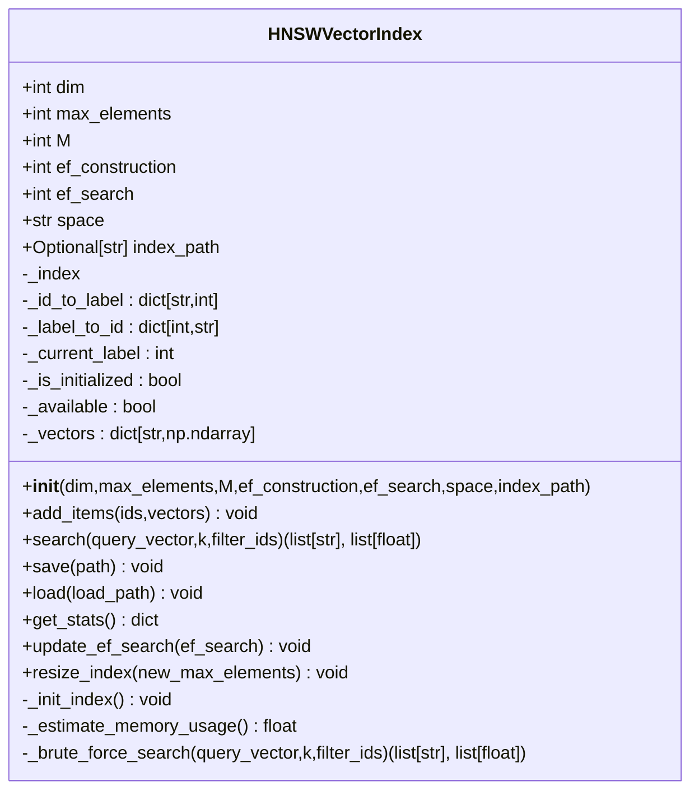
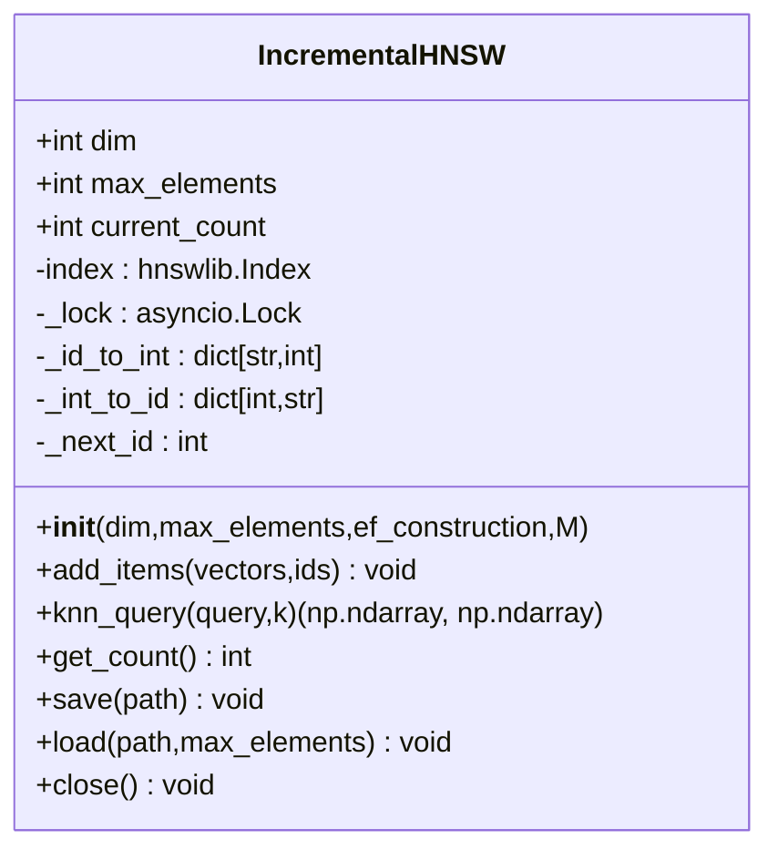
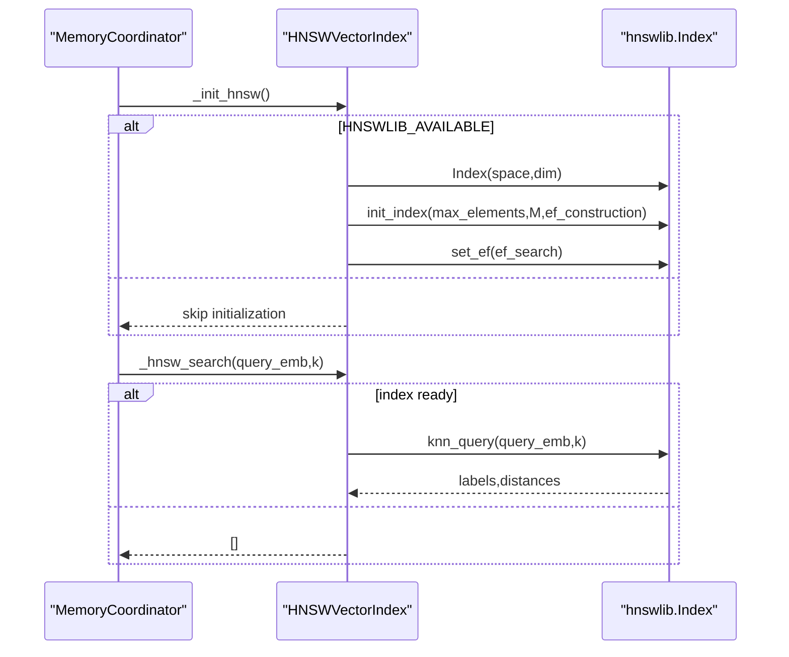
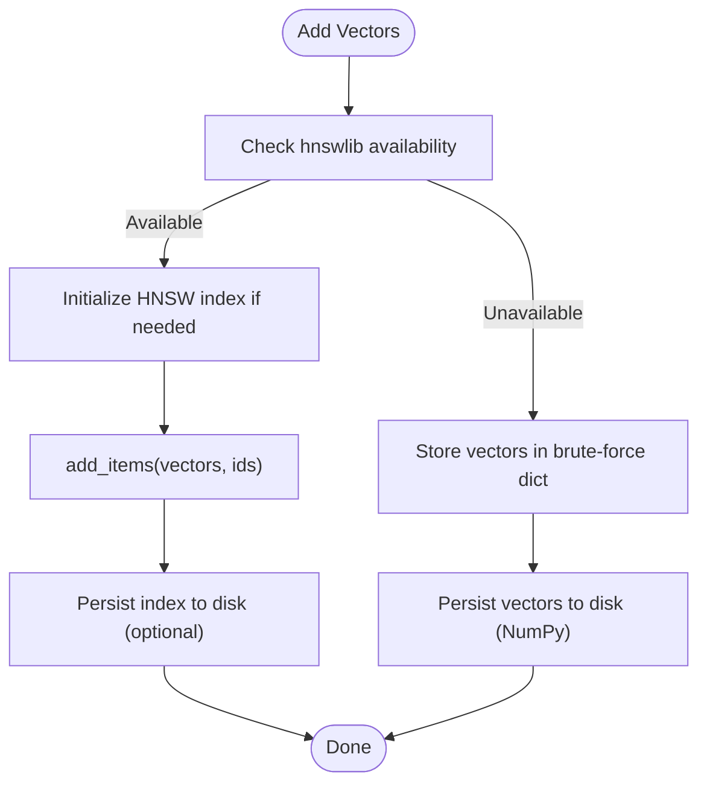
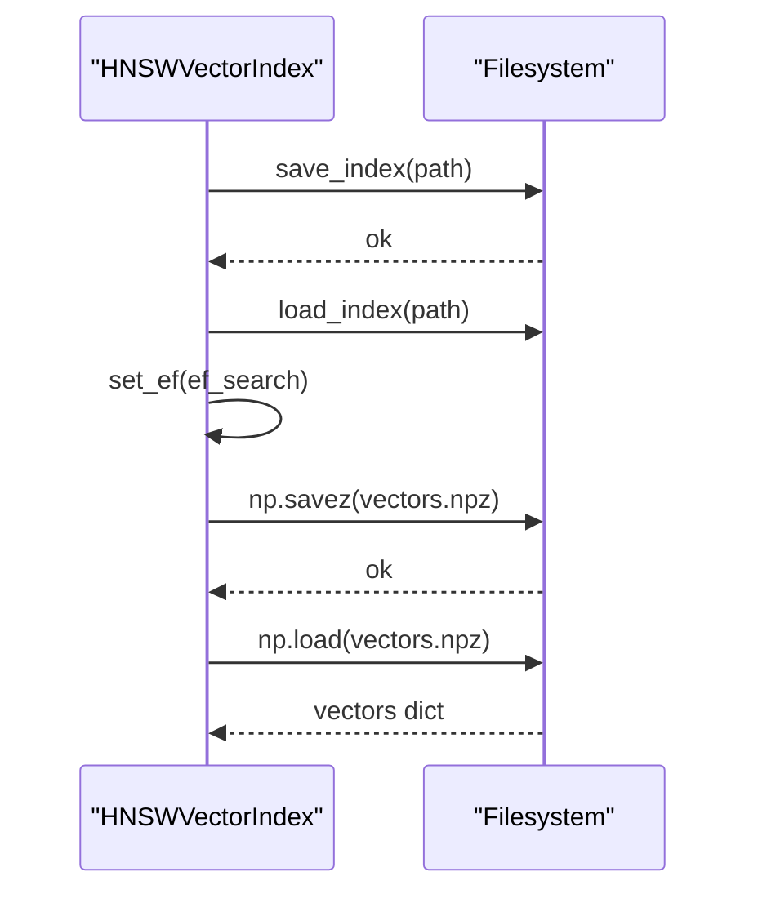
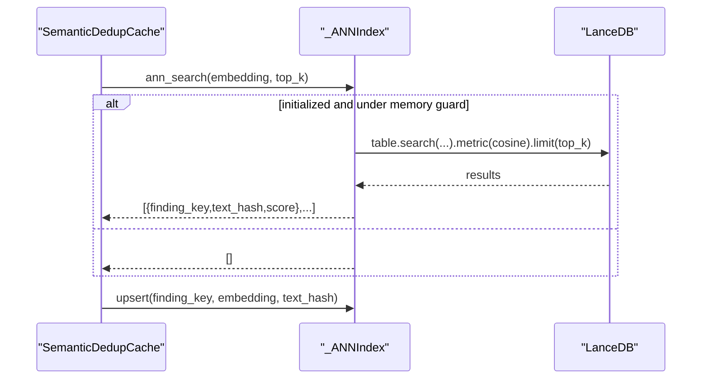
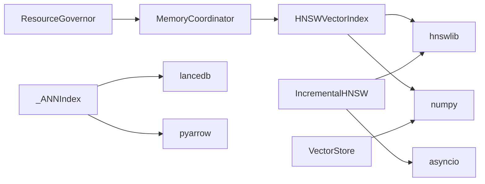

# HNSW Vector Search Index

<cite>
**Referenced Files in This Document**
- [rag_engine.py](file://knowledge/rag_engine.py)
- [hnsw_builder.py](file://tools/hnsw_builder.py)
- [M1_8GB_MEMORY_BUDGET.md](file://M1_8GB_MEMORY_BUDGET.md)
- [memory_coordinator.py](file://coordinators/memory_coordinator.py)
- [vector_store.py](file://knowledge/vector_store.py)
- [ann_index.py](file://knowledge/ann_index.py)
- [memory_layer.py](file://layers/memory_layer.py)
- [resource_governor.py](file://core/resource_governor.py)
</cite>

## Table of Contents
1. [Introduction](#introduction)
2. [Project Structure](#project-structure)
3. [Core Components](#core-components)
4. [Architecture Overview](#architecture-overview)
5. [Detailed Component Analysis](#detailed-component-analysis)
6. [Dependency Analysis](#dependency-analysis)
7. [Performance Considerations](#performance-considerations)
8. [Troubleshooting Guide](#troubleshooting-guide)
9. [Conclusion](#conclusion)

## Introduction
This document explains the Hierarchical Navigable Small World (HNSW) vector search index implementation in the project. It covers the integration with the hnswlib C++ backend, index initialization parameters (M, ef_construction, ef_search), memory optimization strategies, dual-mode operation with HNSW for fast approximate search and brute-force fallback, vector addition and batch operations, persistent storage with metadata preservation, search algorithms, distance metrics (cosine, L2, inner product), and performance characteristics. It also includes configuration guidelines for M1 8GB memory constraints, index resizing, and optimization techniques for large-scale vector retrieval.

## Project Structure
The HNSW vector search functionality spans several modules:
- A primary HNSW vector index class that integrates with hnswlib and provides a dual-mode search (HNSW or brute-force fallback).
- An incremental HNSW builder for thread-safe, async-friendly batch operations.
- Memory and resource management utilities tailored for M1 8GB constraints.
- Supporting vector storage and ANN fast-path components for cross-run duplicate detection.

**Diagram sources**
- [rag_engine.py:1090-1123](file://knowledge/rag_engine.py#L1090-L1123)
- [rag_engine.py:207-302](file://knowledge/rag_engine.py#L207-L302)
- [hnsw_builder.py:22-124](file://tools/hnsw_builder.py#L22-L124)
- [memory_coordinator.py:2417-2445](file://coordinators/memory_coordinator.py#L2417-L2445)
- [vector_store.py:155-197](file://knowledge/vector_store.py#L155-L197)
- [ann_index.py:1-381](file://knowledge/ann_index.py#L1-L381)
- [M1_8GB_MEMORY_BUDGET.md:1-136](file://M1_8GB_MEMORY_BUDGET.md#L1-L136)

**Section sources**
- [rag_engine.py:1090-1123](file://knowledge/rag_engine.py#L1090-L1123)
- [hnsw_builder.py:22-124](file://tools/hnsw_builder.py#L22-L124)
- [memory_coordinator.py:2417-2445](file://coordinators/memory_coordinator.py#L2417-L2445)
- [vector_store.py:155-197](file://knowledge/vector_store.py#L155-L197)
- [ann_index.py:1-381](file://knowledge/ann_index.py#L1-L381)
- [M1_8GB_MEMORY_BUDGET.md:1-136](file://M1_8GB_MEMORY_BUDGET.md#L1-L136)

## Core Components
- HNSWVectorIndex: A wrapper around hnswlib providing approximate nearest neighbor search with dual-mode operation (HNSW or brute-force fallback), persistent storage, and parameter tuning.
- IncrementalHNSW: An async-friendly incremental HNSW index supporting thread-safe add and query operations with ID mapping.
- Memory-aware initialization: Guarded HNSW initialization and search using memory coordinator and resource governor thresholds.
- VectorStore: Streaming batch insertion of vectors with M1 8GB safety caps.
- ANN fast-path: LanceDB-based ANN cosine similarity index for cross-run duplicate detection.

Key responsibilities:
- Index initialization with configurable parameters and space selection.
- Dual-mode search with automatic fallback to brute-force when hnswlib is unavailable.
- Persistent storage of index and brute-force vectors with load/save routines.
- Runtime parameter tuning (ef_search) and index resizing.
- Memory estimation and M1 8GB budget alignment.

**Section sources**
- [rag_engine.py:207-302](file://knowledge/rag_engine.py#L207-L302)
- [rag_engine.py:356-443](file://knowledge/rag_engine.py#L356-L443)
- [rag_engine.py:576-642](file://knowledge/rag_engine.py#L576-L642)
- [hnsw_builder.py:22-124](file://tools/hnsw_builder.py#L22-L124)
- [memory_coordinator.py:2417-2445](file://coordinators/memory_coordinator.py#L2417-L2445)
- [vector_store.py:155-197](file://knowledge/vector_store.py#L155-L197)
- [ann_index.py:1-381](file://knowledge/ann_index.py#L1-L381)

## Architecture Overview
The HNSW vector search architecture integrates approximate nearest neighbor search with robust fallback, memory-conscious initialization, and persistent storage. The RAG engine coordinates building and using the HNSW index, while the memory layer and resource governor enforce M1 8GB constraints.

**Diagram sources**
- [rag_engine.py:1090-1123](file://knowledge/rag_engine.py#L1090-L1123)
- [rag_engine.py:273-302](file://knowledge/rag_engine.py#L273-L302)
- [rag_engine.py:341-354](file://knowledge/rag_engine.py#L341-L354)
- [rag_engine.py:356-443](file://knowledge/rag_engine.py#L356-L443)

## Detailed Component Analysis

### HNSWVectorIndex: Approximate Nearest Neighbor Search
- Purpose: Provide fast approximate nearest neighbor search using hnswlib with a graceful brute-force fallback.
- Initialization parameters:
  - dim: Vector dimension.
  - max_elements: Upper bound on the number of vectors the index can hold.
  - M: Number of bi-directional links per node; higher improves recall but increases memory.
  - ef_construction: Size of dynamic candidate list during index construction; higher builds better graphs.
  - ef_search: Size of dynamic candidate list during search; higher improves recall at the cost of latency.
  - space: Distance metric; supports "cosine", "l2", "ip", and "euclidean" mapped to hnswlib spaces.
  - index_path: Optional path for persistent index storage.
- Dual-mode operation:
  - If hnswlib is importable, initializes hnswlib.Index and uses it for add and search.
  - If unavailable, stores vectors in an in-memory dict and performs brute-force search.
- Search algorithm:
  - For HNSW: calls knn_query and maps internal integer labels back to string IDs.
  - For brute-force: computes distances/similarities across candidate vectors filtered by filter_ids.
- Distance metrics:
  - Cosine: uses dot product normalized by norms; converts similarity to distance.
  - L2/Euclidean: uses Euclidean distance.
  - Inner Product: uses negative dot product for ascending sort semantics.
- Persistence:
  - Save/load index to/from disk when using hnswlib.
  - Load brute-force vectors from a NumPy archive when hnswlib is unavailable.
- Memory estimation:
  - Estimates memory usage in MB for both HNSW and brute-force modes.
- Runtime tuning:
  - update_ef_search adjusts ef_search dynamically.
  - resize_index resizes the index when needed.

**Diagram sources**
- [rag_engine.py:207-302](file://knowledge/rag_engine.py#L207-L302)
- [rag_engine.py:356-443](file://knowledge/rag_engine.py#L356-L443)
- [rag_engine.py:576-642](file://knowledge/rag_engine.py#L576-L642)

**Section sources**
- [rag_engine.py:207-302](file://knowledge/rag_engine.py#L207-L302)
- [rag_engine.py:356-443](file://knowledge/rag_engine.py#L356-L443)
- [rag_engine.py:576-642](file://knowledge/rag_engine.py#L576-L642)

### IncrementalHNSW: Async Batch Operations
- Purpose: Provide thread-safe, async-friendly incremental HNSW with ID mapping and persistence.
- Key features:
  - Async lock for add and query to prevent race conditions.
  - Maintains bidirectional mapping between string IDs and internal integer labels.
  - Supports saving/loading index to disk.
  - Validates batch additions against max_elements.

**Diagram sources**
- [hnsw_builder.py:22-124](file://tools/hnsw_builder.py#L22-L124)

**Section sources**
- [hnsw_builder.py:22-124](file://tools/hnsw_builder.py#L22-L124)

### Memory-Aware HNSW Initialization and Search
- Guarded initialization: The memory coordinator attempts to initialize HNSW only when hnswlib is available and safe to do so.
- Search path: If the index is unavailable, search returns empty results gracefully.

**Diagram sources**
- [memory_coordinator.py:2417-2445](file://coordinators/memory_coordinator.py#L2417-L2445)
- [rag_engine.py:273-302](file://knowledge/rag_engine.py#L273-L302)

**Section sources**
- [memory_coordinator.py:2417-2445](file://coordinators/memory_coordinator.py#L2417-L2445)
- [rag_engine.py:273-302](file://knowledge/rag_engine.py#L273-L302)

### Vector Addition and Batch Operations
- Streaming batch insert: VectorStore supports streaming batch addition with a capped batch size to reduce M1 8GB peak RSS during embedding phases.
- IncrementalHNSW: Provides async add_items with ID mapping and hard limit checks.

**Diagram sources**
- [rag_engine.py:341-354](file://knowledge/rag_engine.py#L341-L354)
- [vector_store.py:155-197](file://knowledge/vector_store.py#L155-L197)
- [hnsw_builder.py:52-77](file://tools/hnsw_builder.py#L52-L77)

**Section sources**
- [rag_engine.py:341-354](file://knowledge/rag_engine.py#L341-L354)
- [vector_store.py:155-197](file://knowledge/vector_store.py#L155-L197)
- [hnsw_builder.py:52-77](file://tools/hnsw_builder.py#L52-L77)

### Persistent Storage and Metadata Preservation
- HNSW persistence: Save/load the hnswlib index to/from disk; set ef_search after load.
- Brute-force persistence: Save/load vectors using NumPy archives; supports loading into memory.
- Metadata preservation: While the HNSW index itself preserves IDs, the RAG engine maintains a document map for metadata association during retrieval.

**Diagram sources**
- [rag_engine.py:553-574](file://knowledge/rag_engine.py#L553-L574)

**Section sources**
- [rag_engine.py:553-574](file://knowledge/rag_engine.py#L553-L574)

### ANN Fast-Path for Cross-Run Duplicate Detection
- Purpose: Provide a fast-path cosine similarity ANN search for cross-run duplicate detection using LanceDB.
- Safety: Memory guard checks RSS threshold before initialization; bounded table size with LRU-style eviction.
- Integration: Used alongside semantic dedup cache to accelerate duplicate detection.

**Diagram sources**
- [ann_index.py:140-181](file://knowledge/ann_index.py#L140-L181)
- [ann_index.py:183-220](file://knowledge/ann_index.py#L183-L220)

**Section sources**
- [ann_index.py:1-381](file://knowledge/ann_index.py#L1-L381)

## Dependency Analysis
- HNSWVectorIndex depends on hnswlib for approximate search and on NumPy for vector operations.
- IncrementalHNSW depends on hnswlib and asyncio for thread-safe operations.
- MemoryCoordinator and ResourceGovernor coordinate memory-aware initialization and runtime decisions.
- VectorStore integrates with PyArrow and NumPy for efficient batch operations.
- ANN fast-path depends on LanceDB and PyArrow.

**Diagram sources**
- [rag_engine.py:207-302](file://knowledge/rag_engine.py#L207-L302)
- [hnsw_builder.py:14-19](file://tools/hnsw_builder.py#L14-L19)
- [memory_coordinator.py:2417-2445](file://coordinators/memory_coordinator.py#L2417-L2445)
- [resource_governor.py:314-347](file://core/resource_governor.py#L314-L347)
- [vector_store.py:155-197](file://knowledge/vector_store.py#L155-L197)
- [ann_index.py:105-138](file://knowledge/ann_index.py#L105-L138)

**Section sources**
- [rag_engine.py:207-302](file://knowledge/rag_engine.py#L207-L302)
- [hnsw_builder.py:14-19](file://tools/hnsw_builder.py#L14-L19)
- [memory_coordinator.py:2417-2445](file://coordinators/memory_coordinator.py#L2417-L2445)
- [resource_governor.py:314-347](file://core/resource_governor.py#L314-L347)
- [vector_store.py:155-197](file://knowledge/vector_store.py#L155-L197)
- [ann_index.py:105-138](file://knowledge/ann_index.py#L105-L138)

## Performance Considerations
- Index parameters:
  - M controls graph connectivity; larger M improves recall but increases memory usage.
  - ef_construction affects build quality; higher values produce better graphs at the cost of longer build times.
  - ef_search trades off recall and latency; higher values improve recall but increase query time.
- Distance metrics:
  - Cosine: suitable for normalized embeddings; converts similarity to distance.
  - L2/Euclidean: sensitive to magnitude; good for raw embeddings.
  - Inner Product: useful for positive similarity; negated for ascending sort.
- Memory footprint:
  - HNSW: approximately 4 bytes per dimension per vector plus index overhead (~2x vector memory).
  - Brute-force: stores vectors in memory; memory usage scales linearly with number of vectors and dimensionality.
- M1 8GB constraints:
  - Use max_elements to bound index size.
  - Monitor RSS and enter I/O-only mode when approaching memory thresholds.
  - Utilize RAM disk for temporary storage and shared memory for zero-copy data sharing.
  - Stream vector batches to reduce peak RSS during embedding and ingestion.
- ANN fast-path:
  - Pre-warm the ANN index to reduce cold-start latency.
  - Keep the table bounded and periodically evict oldest entries.

[No sources needed since this section provides general guidance]

## Troubleshooting Guide
- hnswlib import failure:
  - Symptom: Warning about missing hnswlib; fallback to brute-force.
  - Action: Install hnswlib or ensure it is available in the environment.
- Initialization failures:
  - Symptom: Error during HNSW initialization; fallback disabled.
  - Action: Verify space mapping and parameters; check available memory.
- Search returns empty:
  - Symptom: Empty results from HNSW search.
  - Action: Confirm index is initialized and ef_search is set; verify query vector shape and space.
- Out-of-memory during ingestion:
  - Symptom: RSS near 5GB threshold; potential compression or swapping.
  - Action: Reduce max_elements, enable I/O-only mode, stream batches, and use RAM disk.
- Persistent load failures:
  - Symptom: Failed to load index or vectors.
  - Action: Verify file paths and permissions; ensure index_path exists and is writable.

**Section sources**
- [rag_engine.py:260-269](file://knowledge/rag_engine.py#L260-L269)
- [rag_engine.py:300-302](file://knowledge/rag_engine.py#L300-L302)
- [rag_engine.py:560-574](file://knowledge/rag_engine.py#L560-L574)
- [M1_8GB_MEMORY_BUDGET.md:1-136](file://M1_8GB_MEMORY_BUDGET.md#L1-L136)
- [resource_governor.py:314-347](file://core/resource_governor.py#L314-L347)

## Conclusion
The HNSW vector search index provides a robust, memory-conscious solution for large-scale approximate nearest neighbor search. Its dual-mode operation ensures reliability by falling back to brute-force when hnswlib is unavailable. With careful configuration of index parameters, persistent storage, and M1 8GB memory constraints, it delivers fast retrieval and scalable performance. The integration with streaming vector operations, memory coordination, and an ANN fast-path further enhances practical usability for real-world applications.