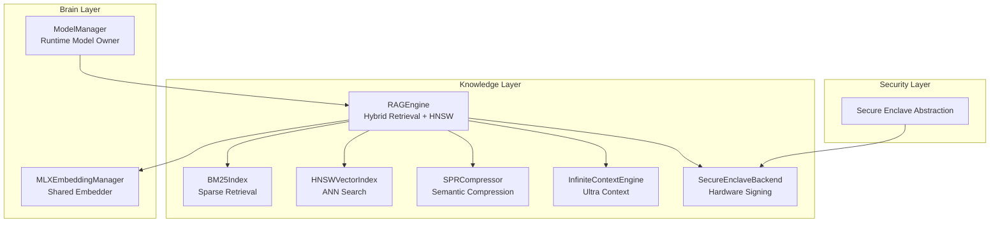
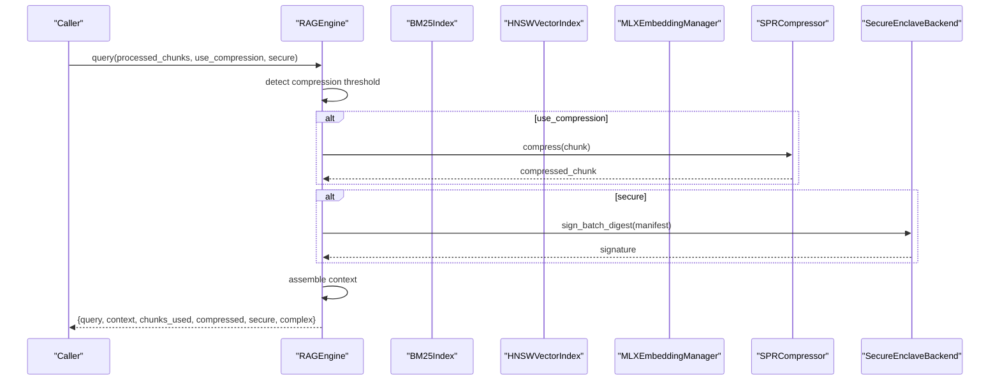
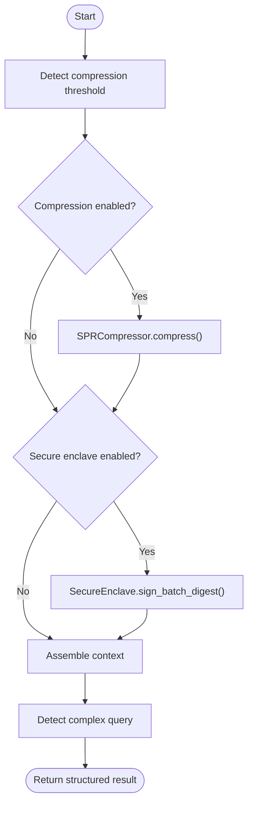
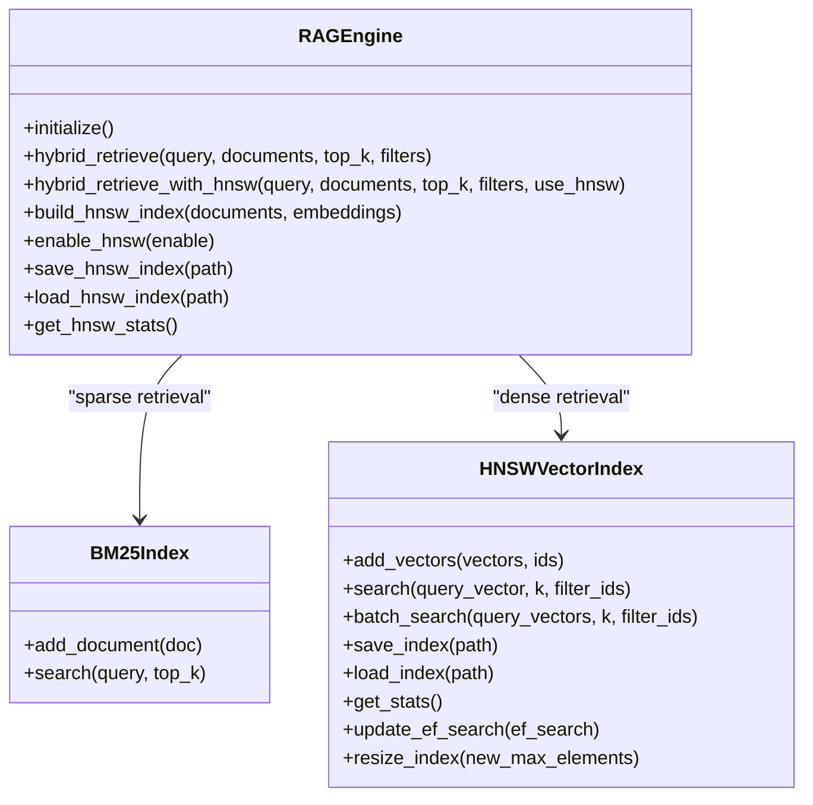
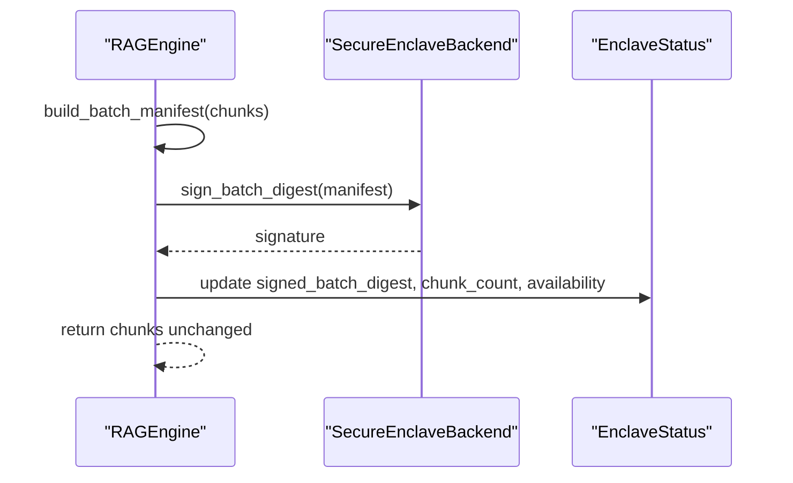
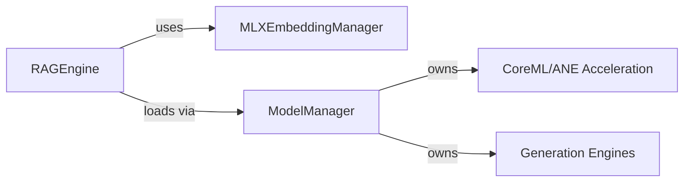
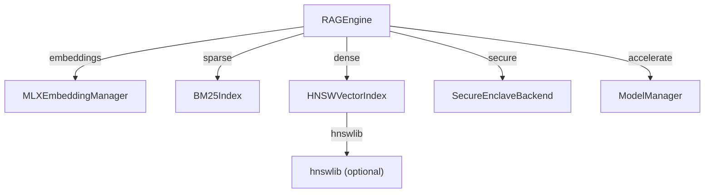

# RAG Engine Architecture

<cite>
**Referenced Files in This Document**
- [rag_engine.py](file://knowledge/rag_engine.py)
- [graph_rag.py](file://knowledge/graph_rag.py)
- [secure_enclave.py](file://security/secure_enclave.py)
- [model_manager.py](file://brain/model_manager.py)
- [model_lifecycle.py](file://brain/model_lifecycle.py)
- [model_phase_facts.py](file://brain/model_phase_facts.py)
- [synthesis_runner.py](file://brain/synthesis_runner.py)
- [__init__.py](file://knowledge/__init__.py)
</cite>

## Table of Contents
1. [Introduction](#introduction)
2. [Project Structure](#project-structure)
3. [Core Components](#core-components)
4. [Architecture Overview](#architecture-overview)
5. [Detailed Component Analysis](#detailed-component-analysis)
6. [Dependency Analysis](#dependency-analysis)
7. [Performance Considerations](#performance-considerations)
8. [Troubleshooting Guide](#troubleshooting-guide)
9. [Conclusion](#conclusion)

## Introduction
This document describes the Retrieval-Augmented Generation (RAG) Engine architecture, focusing on the 6-stage pipeline: Query → Retrieval → Rerank → Compress → Generate → Validate. It explains the grounding authority role, ultra context integration, SPR compression capabilities, and secure enclave functionality. It also documents the RAGConfig class with all configuration options, including hybrid retrieval weights, chunking parameters, and HNSW vector search settings. Finally, it clarifies the relationship between the RAG engine and other components such as embedding managers and model lifecycle owners, including initialization patterns, lazy loading mechanisms, and CoreML/ANE acceleration integration.

## Project Structure
The RAG engine resides in the knowledge layer alongside complementary orchestration components:
- RAG engine and supporting indices (BM25, HNSW)
- Graph-based reasoning orchestrator
- Secure enclave integration
- Model lifecycle management for embedding and generation

**Diagram sources**
- [rag_engine.py:665-723](file://knowledge/rag_engine.py#L665-L723)
- [graph_rag.py:93-126](file://knowledge/graph_rag.py#L93-L126)
- [secure_enclave.py:152-196](file://security/secure_enclave.py#L152-L196)
- [model_manager.py:178-271](file://brain/model_manager.py#L178-L271)

**Section sources**
- [__init__.py:1-189](file://knowledge/__init__.py#L1-L189)

## Core Components
This section documents the primary building blocks of the RAG engine and related systems.

- RAGConfig: Central configuration for hybrid retrieval, chunking, and HNSW vector search.
- RAGEngine: Orchestrates the 6-stage pipeline with lazy-loading of optional components.
- BM25Index: Sparse retrieval engine for BM25-based fusion.
- HNSWVectorIndex: Hierarchical Navigable Small World index for fast ANN search.
- SecureEnclaveBackend: Hardware-backed signing and attestation for batched context.
- ModelManager: Canonical owner of model lifecycles, embedding providers, and CoreML/ANE acceleration.

**Section sources**
- [rag_engine.py:66-92](file://knowledge/rag_engine.py#L66-L92)
- [rag_engine.py:665-723](file://knowledge/rag_engine.py#L665-L723)
- [rag_engine.py:116-205](file://knowledge/rag_engine.py#L116-L205)
- [rag_engine.py:207-643](file://knowledge/rag_engine.py#L207-L643)
- [secure_enclave.py:152-196](file://security/secure_enclave.py#L152-L196)
- [model_manager.py:178-271](file://brain/model_manager.py#L178-L271)

## Architecture Overview
The RAG engine acts as a grounding authority, coordinating retrieval, compression, secure processing, and context assembly without owning identity stores, embedding computation, or model execution. It integrates optional ultra-context, SPR compression, and secure enclave signing. Hybrid retrieval combines dense (vector) and sparse (BM25) signals, with HNSW enabling scalable ANN search. CoreML/ANE acceleration is integrated via the model lifecycle owner.

**Diagram sources**
- [rag_engine.py:818-845](file://knowledge/rag_engine.py#L818-L845)
- [rag_engine.py:847-904](file://knowledge/rag_engine.py#L847-L904)
- [secure_enclave.py:126-149](file://security/secure_enclave.py#L126-L149)

## Detailed Component Analysis

### RAGConfig: Configuration Options
RAGConfig defines all tunable parameters for the engine:
- Ultra context and compression toggles, compression threshold, and token budget
- Hybrid retrieval: enable/disable, dense/sparse weights, BM25 parameters (k1, b), chunk size, overlap
- HNSW vector search: enable/disable, dimension, capacity, graph parameters (M, ef_construction, ef_search), persistence path, distance metric

These settings govern retrieval quality, memory usage, and performance characteristics.

**Section sources**
- [rag_engine.py:66-92](file://knowledge/rag_engine.py#L66-L92)

### RAGEngine: 6-Stage Pipeline
The engine orchestrates the following stages:
1. Query: Accepts processed chunks, optional compression, and secure processing flags.
2. Retrieval: Hybrid dense (vector) and sparse (BM25) retrieval, with optional HNSW acceleration.
3. Rerank: Weighted fusion of dense and sparse scores.
4. Compress: Optional SPR compression for long contexts.
5. Generate: Assembles context and detects complex queries for Tree of Thoughts.
6. Validate: Returns structured results with metadata.

Key behaviors:
- Lazy initialization of ultra context, SPR compressor, secure enclave, and CoreML/ANE embedder.
- Embedding generation via FastEmbed cache, MLXEmbeddingManager fallback, or deterministic hashing.
- HNSW index build/search with persistence and dynamic resizing.
- Secure enclave batch attestation without mutating chunk content.

**Diagram sources**
- [rag_engine.py:818-845](file://knowledge/rag_engine.py#L818-L845)
- [rag_engine.py:847-904](file://knowledge/rag_engine.py#L847-L904)
- [secure_enclave.py:126-149](file://security/secure_enclave.py#L126-L149)

**Section sources**
- [rag_engine.py:818-904](file://knowledge/rag_engine.py#L818-L904)

### Hybrid Retrieval and HNSW Integration
The engine supports two retrieval modes:
- Standard hybrid retrieval: BM25 sparse + cosine similarity dense, fused by configurable weights.
- HNSW-assisted hybrid retrieval: Dense retrieval accelerated by HNSW, with BM25 sparse as a secondary signal.

HNSW configuration includes dimensionality, capacity, graph connectivity, and search quality controls. The index supports persistence and dynamic resizing.

**Diagram sources**
- [rag_engine.py:916-1008](file://knowledge/rag_engine.py#L916-L1008)
- [rag_engine.py:1245-1347](file://knowledge/rag_engine.py#L1245-L1347)
- [rag_engine.py:1092-1166](file://knowledge/rag_engine.py#L1092-L1166)
- [rag_engine.py:207-643](file://knowledge/rag_engine.py#L207-L643)

**Section sources**
- [rag_engine.py:916-1008](file://knowledge/rag_engine.py#L916-L1008)
- [rag_engine.py:1245-1347](file://knowledge/rag_engine.py#L1245-L1347)
- [rag_engine.py:1092-1166](file://knowledge/rag_engine.py#L1092-L1166)
- [rag_engine.py:207-643](file://knowledge/rag_engine.py#L207-L643)

### Secure Enclave Functionality
The secure enclave provides hardware-backed attestation for batched context without modifying content. The engine builds a canonical batch manifest and requests a single signature over the batch digest, updating telemetry status accordingly.

**Diagram sources**
- [rag_engine.py:863-904](file://knowledge/rag_engine.py#L863-L904)
- [secure_enclave.py:126-149](file://security/secure_enclave.py#L126-L149)
- [secure_enclave.py:152-196](file://security/secure_enclave.py#L152-L196)

**Section sources**
- [rag_engine.py:863-904](file://knowledge/rag_engine.py#L863-L904)
- [secure_enclave.py:126-149](file://security/secure_enclave.py#L126-L149)
- [secure_enclave.py:152-196](file://security/secure_enclave.py#L152-L196)

### Relationship to Embedding Managers and Model Lifecycle Owners
The RAG engine is a grounding authority and does not own:
- Identity/entity resolution (handled elsewhere)
- Embedding computation (managed by MLXEmbeddingManager singleton)
- Model lifecycle (managed by ModelManager)

Initialization patterns:
- RAGEngine lazily initializes ultra context, SPR compressor, secure enclave, and CoreML/ANE embedder.
- CoreML/ANE integration is mediated through ModelManager, which owns model acquisition, conversion, and runtime lifecycle.

**Diagram sources**
- [rag_engine.py:707-762](file://knowledge/rag_engine.py#L707-L762)
- [model_manager.py:178-271](file://brain/model_manager.py#L178-L271)
- [model_manager.py:428-441](file://brain/model_manager.py#L428-L441)

**Section sources**
- [rag_engine.py:707-762](file://knowledge/rag_engine.py#L707-L762)
- [model_manager.py:178-271](file://brain/model_manager.py#L178-L271)
- [model_manager.py:428-441](file://brain/model_manager.py#L428-L441)

### CoreML/ANE Acceleration Integration
CoreML/ANE acceleration is integrated via ModelManager:
- CoreML model path is checked and loaded if available.
- A compatibility seam allows RAGEngine to access the CoreML embedder without direct ownership.
- Conversion routines and accuracy testing are managed centrally.

**Section sources**
- [model_manager.py:120-124](file://brain/model_manager.py#L120-L124)
- [model_manager.py:428-441](file://brain/model_manager.py#L428-L441)
- [rag_engine.py:725-762](file://knowledge/rag_engine.py#L725-L762)

### SPR Compression Capabilities
SPR compression reduces context size while preserving semantic fidelity. The engine automatically applies compression when the number of chunks exceeds a configured threshold.

**Section sources**
- [rag_engine.py:847-861](file://knowledge/rag_engine.py#L847-L861)
- [rag_engine.py:66-92](file://knowledge/rag_engine.py#L66-L92)

### Ultra Context Integration
Ultra context enables handling extended contexts beyond standard limits. The engine initializes an ultra context engine when enabled.

**Section sources**
- [rag_engine.py:764-771](file://knowledge/rag_engine.py#L764-L771)

### GraphRAGOrchestrator: Multi-Hop Reasoning
While distinct from the RAG engine, GraphRAGOrchestrator complements it by performing multi-hop reasoning over a knowledge graph, using shared embedding managers and applying path scoring and contradiction detection.

**Section sources**
- [graph_rag.py:93-126](file://knowledge/graph_rag.py#L93-L126)
- [graph_rag.py:128-149](file://knowledge/graph_rag.py#L128-L149)

## Dependency Analysis
The RAG engine maintains loose coupling with external systems:
- Embedding generation uses a cached FastEmbed instance with MLXEmbeddingManager fallback.
- HNSW relies on hnswlib when available, with a brute-force fallback.
- Secure enclave is abstracted behind a fail-soft backend.
- CoreML/ANE acceleration is mediated by ModelManager.

**Diagram sources**
- [rag_engine.py:1010-1058](file://knowledge/rag_engine.py#L1010-L1058)
- [rag_engine.py:260-269](file://knowledge/rag_engine.py#L260-L269)
- [secure_enclave.py:152-196](file://security/secure_enclave.py#L152-L196)
- [model_manager.py:428-441](file://brain/model_manager.py#L428-L441)

**Section sources**
- [rag_engine.py:1010-1058](file://knowledge/rag_engine.py#L1010-L1058)
- [rag_engine.py:260-269](file://knowledge/rag_engine.py#L260-L269)
- [secure_enclave.py:152-196](file://security/secure_enclave.py#L152-L196)
- [model_manager.py:428-441](file://brain/model_manager.py#L428-L441)

## Performance Considerations
- HNSW configuration trades off recall and speed via ef_search and graph parameters.
- BM25 ranking can be accelerated using the rank_bm25 library when available.
- Embedding caching via FastEmbed reduces repeated model loads.
- SPR compression reduces context size for long queries.
- Memory guards and model lifecycle management ensure stability on constrained devices.

[No sources needed since this section provides general guidance]

## Troubleshooting Guide
Common issues and mitigations:
- HNSW initialization failures: The engine falls back to brute-force search and logs errors.
- Secure enclave unavailability: The engine continues without mutation, updating status to reflect availability.
- CoreML/ANE loading failures: The engine gracefully falls back to MLX-based embeddings.
- Memory pressure during model loads: ModelManager enforces admission gates and memory cleanup.

**Section sources**
- [rag_engine.py:260-303](file://knowledge/rag_engine.py#L260-L303)
- [rag_engine.py:880-901](file://knowledge/rag_engine.py#L880-L901)
- [model_manager.py:365-425](file://brain/model_manager.py#L365-L425)

## Conclusion
The RAG engine provides a robust, modular, and extensible foundation for retrieval-augmented generation. Its grounding authority role ensures it coordinates retrieval, compression, and secure processing without owning core model or embedding responsibilities. Through hybrid retrieval, HNSW acceleration, SPR compression, and secure enclave attestation, it balances performance, security, and scalability. Integration with ModelManager and shared embedding managers ensures efficient resource utilization and maintainable lifecycle management.