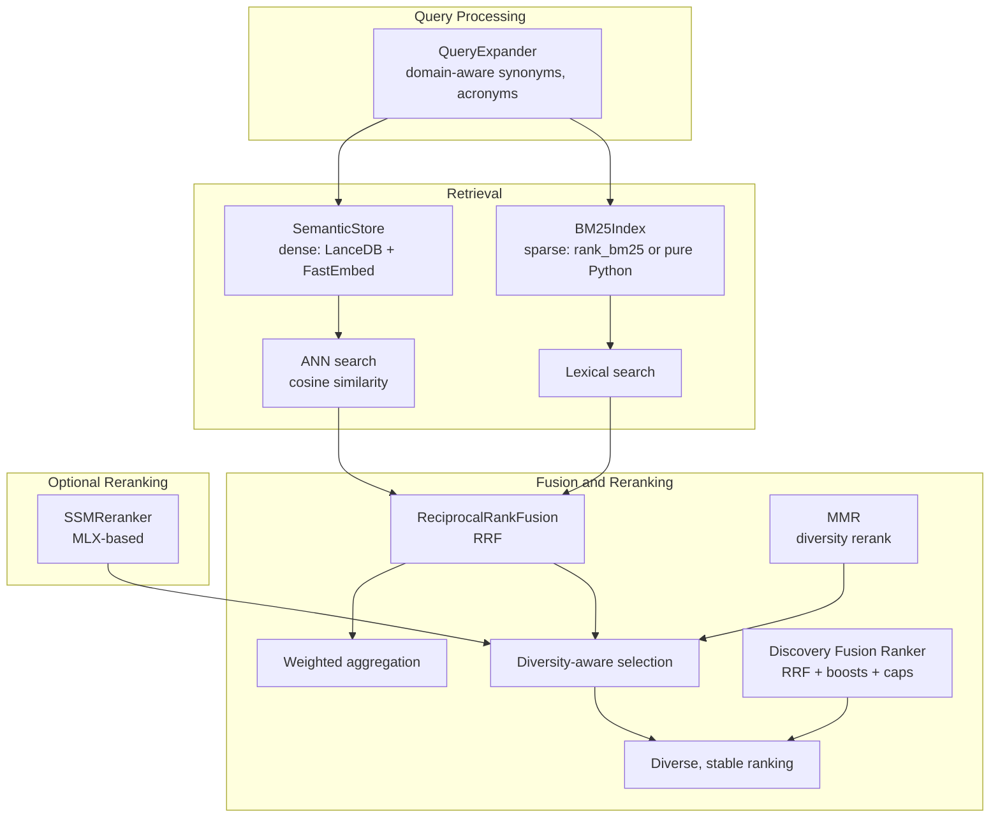
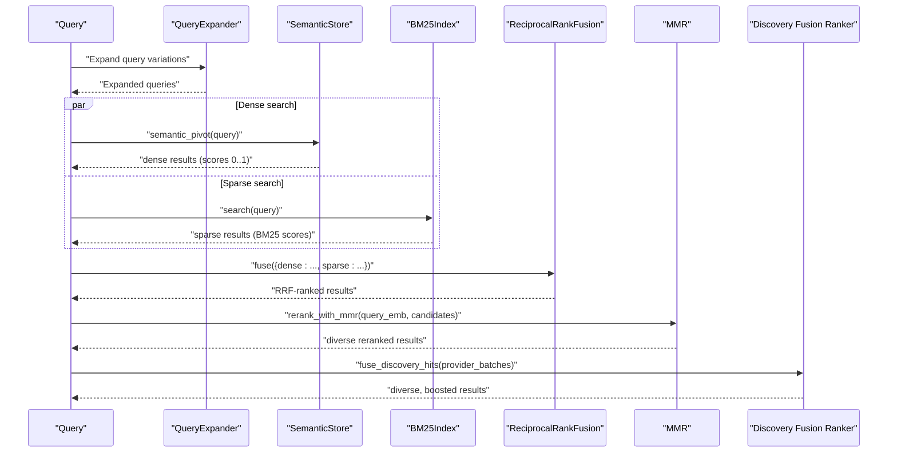
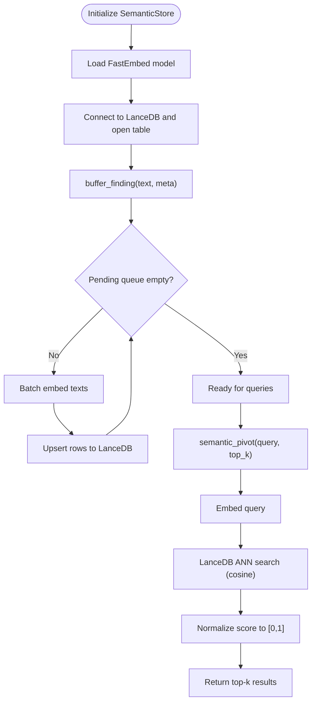
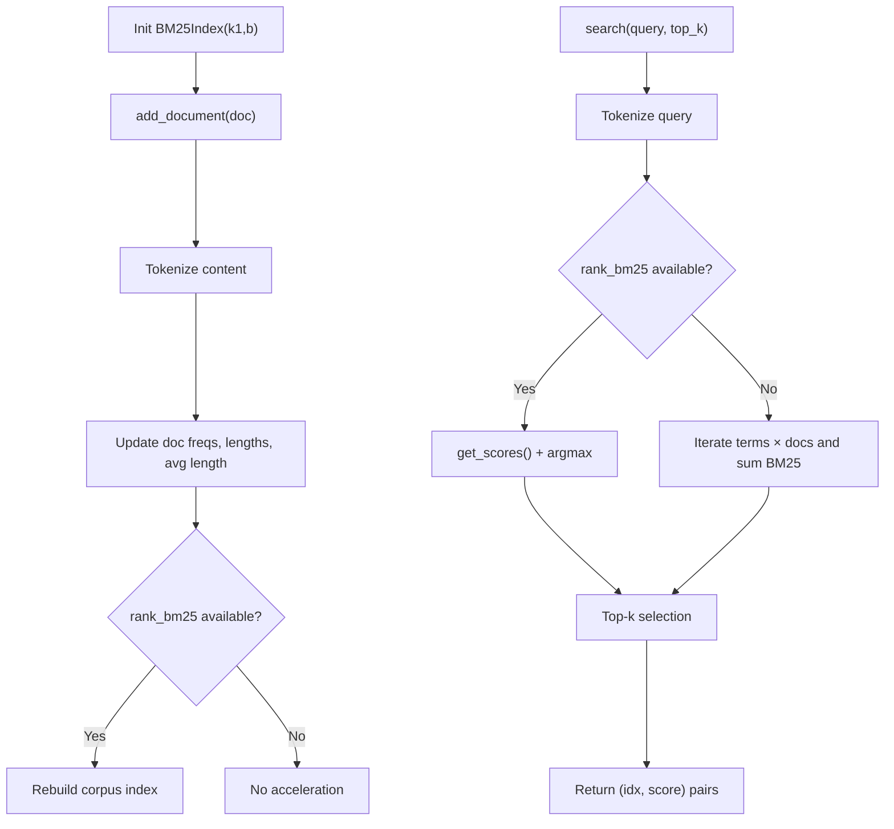
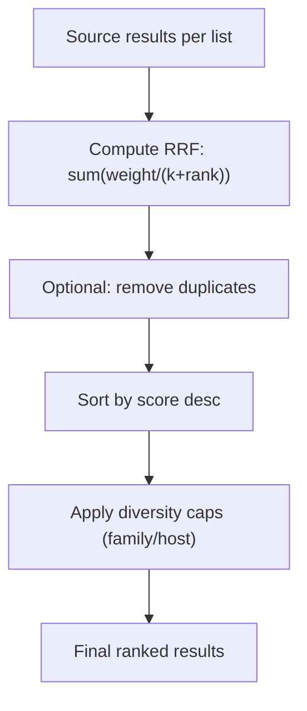
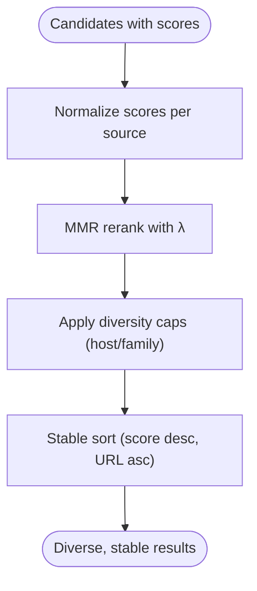
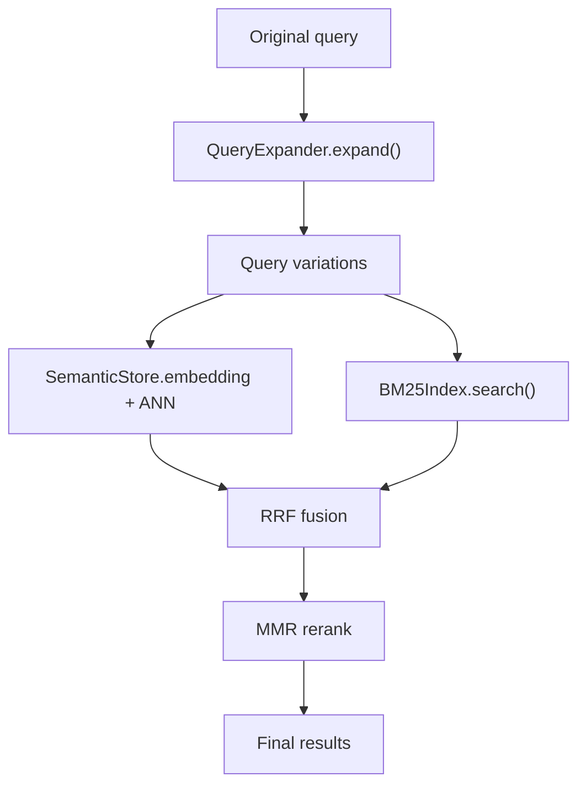
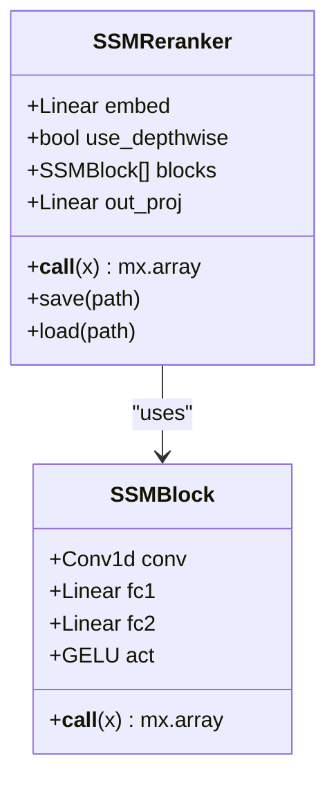
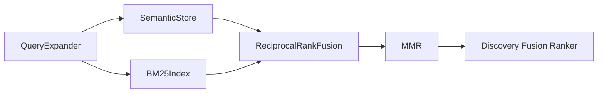

# Search Algorithms and Ranking

<cite>
**Referenced Files in This Document**
- [semantic_store.py](file://knowledge/semantic_store.py)
- [search_index.py](file://knowledge/search_index.py)
- [ranking.py](file://utils/ranking.py)
- [mmr.py](file://context_optimization/mmr.py)
- [fusion_ranker.py](file://discovery/fusion_ranker.py)
- [ssm_reranker.py](file://prefetch/ssm_reranker.py)
- [test_r6_local_bm25_relevance.py](file://tests/r6_local_bm25_relevance/test_r6_local_bm25_relevance.py)
- [query_expansion.py](file://utils/query_expansion.py)
</cite>

## Table of Contents
1. [Introduction](#introduction)
2. [Project Structure](#project-structure)
3. [Core Components](#core-components)
4. [Architecture Overview](#architecture-overview)
5. [Detailed Component Analysis](#detailed-component-analysis)
6. [Dependency Analysis](#dependency-analysis)
7. [Performance Considerations](#performance-considerations)
8. [Troubleshooting Guide](#troubleshooting-guide)
9. [Conclusion](#conclusion)

## Introduction
This document explains the search algorithms and ranking mechanisms used in semantic retrieval across the system. It covers:
- Hybrid search combining dense vector similarity and sparse lexical matching (BM25)
- Fusion strategies for combining different score types and balancing dense/sparse components
- Relevance scoring normalization and diversity-aware reranking
- Context window management and chunking strategies
- Query processing workflows and similarity computation methods
- Performance optimization techniques
- Examples of search result ranking, diversity scoring, and quality assessment mechanisms

## Project Structure
The search and ranking functionality spans several modules:
- Dense semantic retrieval: LanceDB-backed ANN search with cosine similarity
- Sparse lexical retrieval: BM25 over indexed documents
- Fusion and reranking: Reciprocal Rank Fusion (RRF), Maximal Marginal Relevance (MMR), and discovery fusion
- Query expansion: Domain-aware query variations
- Optional reranking: SSM-based reranker (MLX-dependent)

**Diagram sources**
- [semantic_store.py:220-266](file://knowledge/semantic_store.py#L220-L266)
- [search_index.py:121-150](file://knowledge/search_index.py#L121-L150)
- [ranking.py:59-232](file://utils/ranking.py#L59-L232)
- [mmr.py:25-108](file://context_optimization/mmr.py#L25-L108)
- [fusion_ranker.py:50-121](file://discovery/fusion_ranker.py#L50-L121)
- [query_expansion.py:34-267](file://utils/query_expansion.py#L34-L267)
- [ssm_reranker.py:49-108](file://prefetch/ssm_reranker.py#L49-L108)

**Section sources**
- [semantic_store.py:1-301](file://knowledge/semantic_store.py#L1-L301)
- [search_index.py:1-227](file://knowledge/search_index.py#L1-L227)
- [ranking.py:1-343](file://utils/ranking.py#L1-L343)
- [mmr.py:1-156](file://context_optimization/mmr.py#L1-L156)
- [fusion_ranker.py:1-340](file://discovery/fusion_ranker.py#L1-L340)
- [query_expansion.py:1-940](file://utils/query_expansion.py#L1-L940)
- [ssm_reranker.py:1-128](file://prefetch/ssm_reranker.py#L1-L128)

## Core Components
- Dense semantic retrieval via SemanticStore:
  - Uses FastEmbed BAAI/bge-small-en-v1.5 (dimension 384)
  - LanceDB table “findings_v1” with vector column and metadata
  - ANN search with cosine similarity; scores normalized to [0, 1]
- Sparse lexical retrieval via BM25Index:
  - Tokenization and BM25 scoring with k1=1.5, b=0.75
  - Optional rank_bm25 acceleration; fallback pure Python implementation
  - Index capped at 50,000 documents
- Fusion and reranking:
  - Reciprocal Rank Fusion (RRF) with k=60
  - Weighted score aggregation and duplicate removal
  - Maximal Marginal Relevance (MMR) for diversity-aware reranking
  - Discovery fusion ranker with URL normalization, RRF, score boosts, and diversity caps
- Query expansion:
  - Domain-aware synonym expansion, acronym expansion, permutations, and pluralization
- Optional reranking:
  - SSM-based reranker (MLX-dependent) with depthwise convolution benchmarking

**Section sources**
- [semantic_store.py:42-301](file://knowledge/semantic_store.py#L42-L301)
- [search_index.py:34-227](file://knowledge/search_index.py#L34-L227)
- [ranking.py:59-343](file://utils/ranking.py#L59-L343)
- [mmr.py:25-156](file://context_optimization/mmr.py#L25-L156)
- [fusion_ranker.py:50-340](file://discovery/fusion_ranker.py#L50-L340)
- [query_expansion.py:34-334](file://utils/query_expansion.py#L34-L334)
- [ssm_reranker.py:49-128](file://prefetch/ssm_reranker.py#L49-L128)

## Architecture Overview
The hybrid search architecture integrates dense and sparse retrieval with robust fusion and reranking:

**Diagram sources**
- [semantic_store.py:220-266](file://knowledge/semantic_store.py#L220-L266)
- [search_index.py:121-150](file://knowledge/search_index.py#L121-L150)
- [ranking.py:171-232](file://utils/ranking.py#L171-L232)
- [mmr.py:111-156](file://context_optimization/mmr.py#L111-L156)
- [fusion_ranker.py:50-121](file://discovery/fusion_ranker.py#L50-L121)
- [query_expansion.py:223-267](file://utils/query_expansion.py#L223-L267)

## Detailed Component Analysis

### Dense Semantic Retrieval (SemanticStore)
- Embedding model: FastEmbed BAAI/bge-small-en-v1.5 (384-dim)
- Storage: LanceDB table “findings_v1” with vector, text, and metadata fields
- Similarity: cosine (LanceDB internally computes cosine distance; scores normalized to [0, 1])
- Workflow:
  - Buffer findings (bounded pending queue)
  - Batch embed and upsert
  - Query-time embedding and ANN search with limit(top_k)

**Diagram sources**
- [semantic_store.py:80-117](file://knowledge/semantic_store.py#L80-L117)
- [semantic_store.py:158-214](file://knowledge/semantic_store.py#L158-L214)
- [semantic_store.py:220-266](file://knowledge/semantic_store.py#L220-L266)

**Section sources**
- [semantic_store.py:42-301](file://knowledge/semantic_store.py#L42-L301)

### Sparse Lexical Retrieval (BM25Index)
- Tokenization: alphabetic words only
- Scoring: BM25 with k1=1.5, b=0.75
- Acceleration: rank_bm25 if available; fallback to pure Python
- Index bounds: maximum 50,000 documents
- Search returns (doc_idx, score) pairs; metadata attached by LocalSearchSeam

**Diagram sources**
- [search_index.py:34-151](file://knowledge/search_index.py#L34-L151)

**Section sources**
- [search_index.py:34-227](file://knowledge/search_index.py#L34-L227)

### Fusion Strategies and Weight Balancing
- Reciprocal Rank Fusion (RRF):
  - Formula: sum over all lists of weight[source] / (k + rank)
  - Default k=60; optional per-source weights
  - Deduplication by URL or normalized content similarity
- Weighted score aggregation:
  - Weighted average, max, min score across sources
- Diversity-aware reranking:
  - MMR selects top-k candidates balancing relevance and diversity
  - Lambda parameter controls trade-off
- Discovery fusion:
  - URL-normalized dedup
  - RRF over provider ranks plus score boosts (historical continuity, archive novelty, exact query/title overlap, IOC/domain match)
  - Diversity caps: max 50% from one source family, max 3 per host
  - Deterministic stable sort (score desc, URL asc)

**Diagram sources**
- [ranking.py:171-232](file://utils/ranking.py#L171-L232)
- [ranking.py:284-321](file://utils/ranking.py#L284-L321)
- [fusion_ranker.py:50-121](file://discovery/fusion_ranker.py#L50-L121)

**Section sources**
- [ranking.py:59-343](file://utils/ranking.py#L59-L343)
- [fusion_ranker.py:50-340](file://discovery/fusion_ranker.py#L50-L340)

### Diversity Scoring and Relevance Normalization
- Relevance normalization:
  - Dense: cosine similarity normalized to [0, 1]
  - Sparse: BM25 scores from BM25Index (non-negative sums)
- Diversity scoring:
  - MMR: argmax over candidates of [λ · sim(q,d) − (1−λ) · max_{d'∈S} sim(d,d')]
  - Discovery fusion: URL normalization, per-host and source-family caps
- Quality assessment:
  - Duplicate removal thresholds and URL deduplication
  - Deterministic tiebreaking for stability

**Diagram sources**
- [mmr.py:25-108](file://context_optimization/mmr.py#L25-L108)
- [fusion_ranker.py:207-269](file://discovery/fusion_ranker.py#L207-L269)

**Section sources**
- [semantic_store.py:258-261](file://knowledge/semantic_store.py#L258-L261)
- [search_index.py:67-85](file://knowledge/search_index.py#L67-L85)
- [mmr.py:25-108](file://context_optimization/mmr.py#L25-L108)
- [fusion_ranker.py:207-269](file://discovery/fusion_ranker.py#L207-L269)

### Query Processing Workflows and Context Window Management
- Query expansion:
  - Domain-aware synonyms, acronym expansion, permutations, pluralization
  - Limits on max variations and strategy depth
- Context window management:
  - Text truncation to model’s token limits during embedding
  - Indexing bounds to prevent unbounded growth
  - Top-k and result set caps to bound memory and latency

**Diagram sources**
- [query_expansion.py:223-267](file://utils/query_expansion.py#L223-L267)
- [semantic_store.py:134-144](file://knowledge/semantic_store.py#L134-L144)
- [search_index.py:186-227](file://knowledge/search_index.py#L186-L227)
- [ranking.py:171-232](file://utils/ranking.py#L171-L232)
- [mmr.py:111-156](file://context_optimization/mmr.py#L111-L156)

**Section sources**
- [query_expansion.py:34-334](file://utils/query_expansion.py#L34-L334)
- [semantic_store.py:134-144](file://knowledge/semantic_store.py#L134-L144)
- [search_index.py:186-227](file://knowledge/search_index.py#L186-L227)

### Optional Reranking with SSM-based Model
- SSMReranker: lightweight state-space model with optional depthwise convolution benchmarking
- Fast path selection based on measured performance
- Requires MLX; stubs provided when unavailable

**Diagram sources**
- [ssm_reranker.py:27-108](file://prefetch/ssm_reranker.py#L27-L108)

**Section sources**
- [ssm_reranker.py:1-128](file://prefetch/ssm_reranker.py#L1-L128)

## Dependency Analysis
- Dense retrieval depends on:
  - FastEmbed for embeddings
  - LanceDB for vector storage and ANN search
- Sparse retrieval depends on:
  - rank_bm25 (optional) or pure Python BM25 implementation
  - Tokenization and statistics maintained in-memory
- Fusion and reranking depend on:
  - RRF utilities and MMR routines
  - Discovery fusion ranker for provider-level diversity
- Query expansion is independent and domain-aware

**Diagram sources**
- [query_expansion.py:223-267](file://utils/query_expansion.py#L223-L267)
- [semantic_store.py:220-266](file://knowledge/semantic_store.py#L220-L266)
- [search_index.py:121-150](file://knowledge/search_index.py#L121-L150)
- [ranking.py:171-232](file://utils/ranking.py#L171-L232)
- [mmr.py:111-156](file://context_optimization/mmr.py#L111-L156)
- [fusion_ranker.py:50-121](file://discovery/fusion_ranker.py#L50-L121)

**Section sources**
- [ranking.py:59-232](file://utils/ranking.py#L59-L232)
- [mmr.py:25-108](file://context_optimization/mmr.py#L25-L108)
- [fusion_ranker.py:50-121](file://discovery/fusion_ranker.py#L50-L121)

## Performance Considerations
- Dense retrieval:
  - Batch embedding to amortize overhead
  - Bounded pending buffer to prevent memory pressure
  - Async I/O offloading via CPU executor
- Sparse retrieval:
  - rank_bm25 acceleration when available
  - Index cap to control memory and indexing time
- Fusion and reranking:
  - O(n) complexity for RRF; dedup optimized with precomputed token sets
  - MMR vectorized computation for relevance and diversity
- Query expansion:
  - Controlled number of variations to limit downstream cost

[No sources needed since this section provides general guidance]

## Troubleshooting Guide
- Empty or missing results:
  - Verify query is non-empty and properly tokenized
  - Confirm index population and bounds
- Unexpected scores:
  - Dense scores normalized to [0,1]; sparse scores are BM25 sums
  - Check RRF k and source weights
- Stability and determinism:
  - Discovery fusion uses deterministic tiebreaks (score desc, URL asc)
- Integration checks:
  - Local BM25 tests confirm no network or MLX imports in advisory path
  - Seam enforces MAX_RESULT_SET and fail-soft behavior

**Section sources**
- [test_r6_local_bm25_relevance.py:146-204](file://tests/r6_local_bm25_relevance/test_r6_local_bm25_relevance.py#L146-L204)
- [test_r6_local_bm25_relevance.py:297-347](file://tests/r6_local_bm25_relevance/test_r6_local_bm25_relevance.py#L297-L347)
- [search_index.py:186-227](file://knowledge/search_index.py#L186-L227)
- [fusion_ranker.py:105-121](file://discovery/fusion_ranker.py#L105-L121)

## Conclusion
The system implements a robust hybrid search pipeline:
- Dense semantic retrieval with cosine similarity and LanceDB
- Sparse lexical retrieval with BM25 and optional acceleration
- Fusion via RRF with optional weighting and deduplication
- Diversity-aware reranking using MMR and discovery fusion with strict diversity caps
- Query expansion tailored to domain contexts
- Optional MLX-based reranking for advanced scenarios

These components work together to deliver high-quality, diverse, and stable search results under performance constraints.