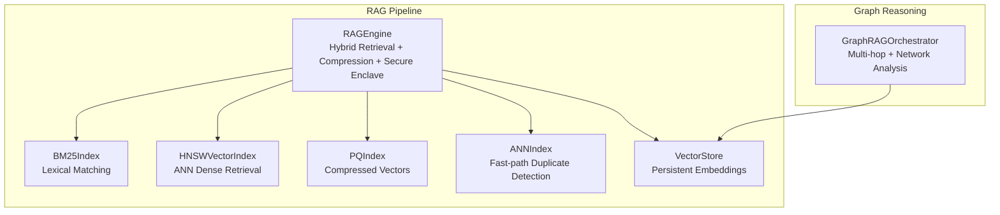
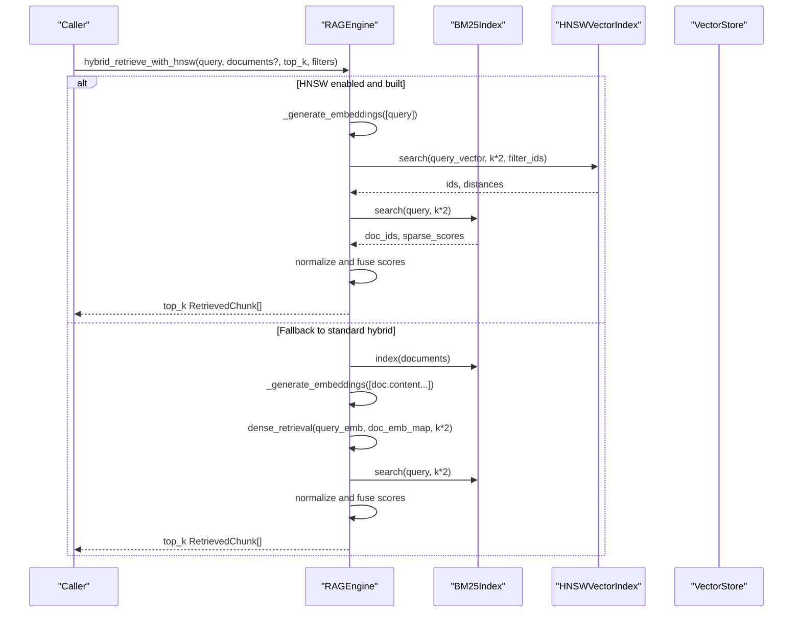
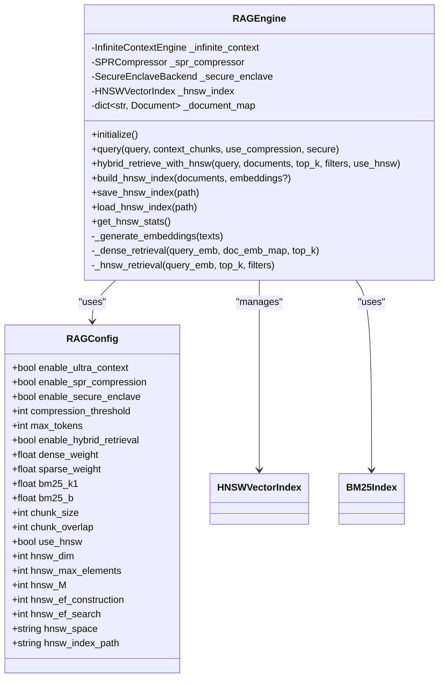
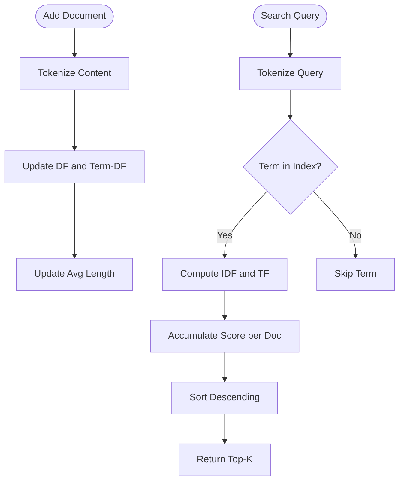
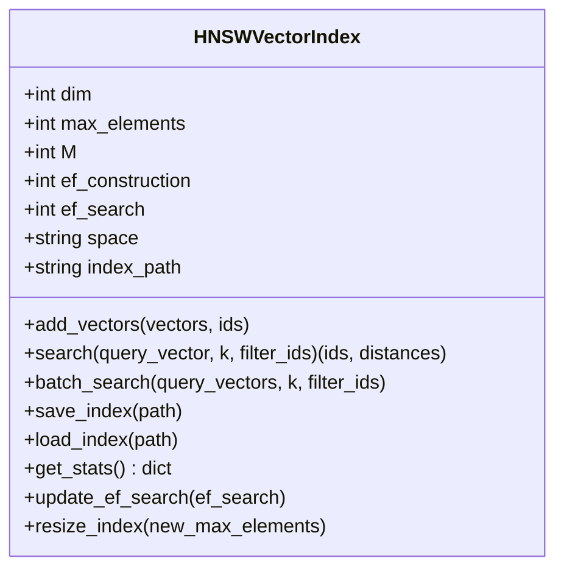
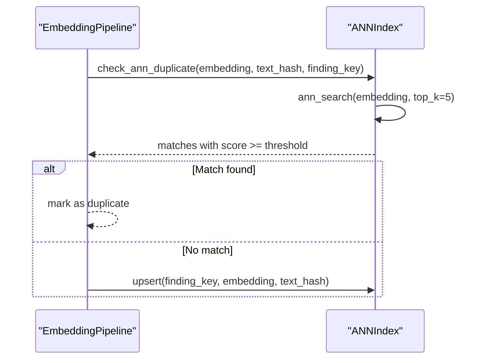
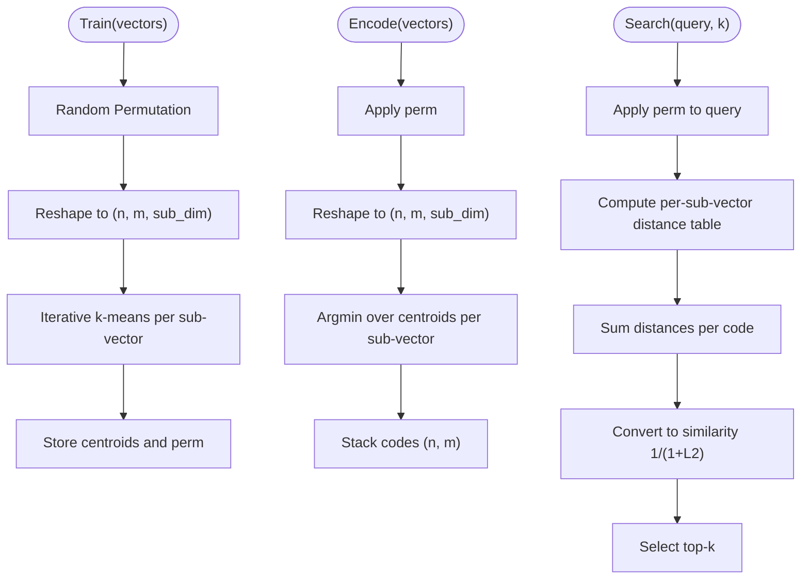
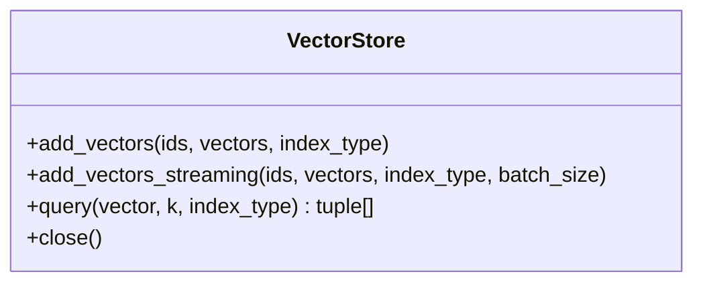
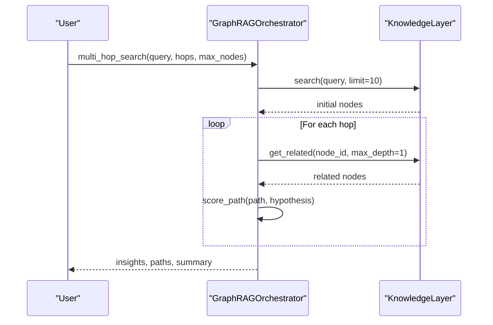
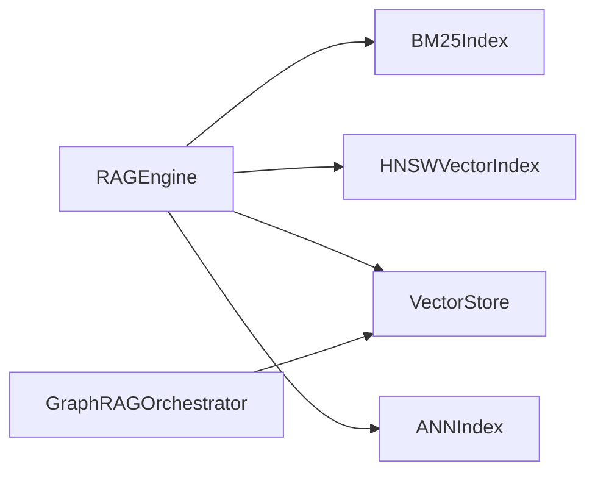

# Semantic Search and Retrieval

<cite>
**Referenced Files in This Document**
- [rag_engine.py](file://knowledge/rag_engine.py)
- [ann_index.py](file://knowledge/ann_index.py)
- [pq_index.py](file://knowledge/pq_index.py)
- [search_index.py](file://knowledge/search_index.py)
- [vector_store.py](file://knowledge/vector_store.py)
- [hnsw_builder.py](file://tools/hnsw_builder.py)
- [semantic_store.py](file://knowledge/semantic_store.py)
- [graph_rag.py](file://knowledge/graph_rag.py)
</cite>

## Table of Contents
1. [Introduction](#introduction)
2. [Project Structure](#project-structure)
3. [Core Components](#core-components)
4. [Architecture Overview](#architecture-overview)
5. [Detailed Component Analysis](#detailed-component-analysis)
6. [Dependency Analysis](#dependency-analysis)
7. [Performance Considerations](#performance-considerations)
8. [Troubleshooting Guide](#troubleshooting-guide)
9. [Conclusion](#conclusion)
10. [Appendices](#appendices)

## Introduction
This document explains the semantic search and retrieval system with a focus on the Retrieval-Augmented Generation (RAG) engine. It covers document chunking, BM25 lexical indexing, HNSW vector indexing, Approximate Nearest Neighbor (ANN) acceleration, and Product Quantization (PQ) compression. It also describes hybrid search workflows, ranking mechanisms, relevance scoring, configuration options, and performance optimization techniques.

## Project Structure
The semantic retrieval stack is organized around modular components:
- RAG Engine: orchestrates hybrid retrieval, compression, and grounding
- BM25 Index: lexical matching over documents
- HNSW Vector Index: dense vector search with configurable parameters
- ANN Index (LanceDB): fast-path ANN for cross-run duplicate detection
- PQ Index: compressed vector representation for memory savings
- Vector Store (LanceDB): persistent embedding storage
- GraphRAG Orchestrator: multi-hop reasoning over a knowledge graph

**Diagram sources**
- [rag_engine.py:665-1707](file://knowledge/rag_engine.py#L665-L1707)
- [search_index.py:34-151](file://knowledge/search_index.py#L34-L151)
- [ann_index.py:51-295](file://knowledge/ann_index.py#L51-L295)
- [pq_index.py:29-274](file://knowledge/pq_index.py#L29-L274)
- [vector_store.py:44-308](file://knowledge/vector_store.py#L44-L308)
- [graph_rag.py:93-880](file://knowledge/graph_rag.py#L93-L880)

**Section sources**
- [rag_engine.py:1-1707](file://knowledge/rag_engine.py#L1-L1707)
- [search_index.py:1-227](file://knowledge/search_index.py#L1-L227)
- [ann_index.py:1-381](file://knowledge/ann_index.py#L1-L381)
- [pq_index.py:1-274](file://knowledge/pq_index.py#L1-L274)
- [vector_store.py:1-308](file://knowledge/vector_store.py#L1-L308)
- [hnsw_builder.py:1-124](file://tools/hnsw_builder.py#L1-L124)
- [semantic_store.py:1-301](file://knowledge/semantic_store.py#L1-L301)
- [graph_rag.py:1-2591](file://knowledge/graph_rag.py#L1-L2591)

## Core Components
- RAGEngine: Implements hybrid retrieval (dense HNSW + sparse BM25), optional SPR compression, Secure Enclave attestation, and CoreML/MLX embedding selection.
- BM25Index: In-memory BM25 indexer with optional rank_bm25 acceleration and bounded capacity.
- HNSWVectorIndex: HNSW-based ANN index with persistence, configurable parameters, and brute-force fallback.
- ANNIndex: LanceDB-backed ANN index for fast cross-run duplicate detection.
- PQIndex: Product Quantization compressor for embedding vectors with OPQ preprocessing.
- VectorStore: LanceDB-backed persistent vector store for text and image embeddings.
- GraphRAGOrchestrator: Multi-hop reasoning over a knowledge graph with centrality, community detection, and contradiction analysis.

**Section sources**
- [rag_engine.py:665-1707](file://knowledge/rag_engine.py#L665-L1707)
- [search_index.py:34-151](file://knowledge/search_index.py#L34-L151)
- [ann_index.py:51-295](file://knowledge/ann_index.py#L51-L295)
- [pq_index.py:29-274](file://knowledge/pq_index.py#L29-L274)
- [vector_store.py:44-308](file://knowledge/vector_store.py#L44-L308)
- [graph_rag.py:93-880](file://knowledge/graph_rag.py#L93-L880)

## Architecture Overview
The RAG engine integrates lexical and dense retrieval:
- Lexical retrieval: BM25 over document chunks
- Dense retrieval: HNSW over embeddings
- Fusion: weighted combination of BM25 and cosine similarity scores
- Compression: optional SPR compression for long contexts
- Security: optional Secure Enclave batch attestation
- Persistence: VectorStore for embeddings; HNSW metadata for document mapping

**Diagram sources**
- [rag_engine.py:1245-1347](file://knowledge/rag_engine.py#L1245-L1347)
- [rag_engine.py:916-1008](file://knowledge/rag_engine.py#L916-L1008)
- [rag_engine.py:1060-1081](file://knowledge/rag_engine.py#L1060-L1081)

**Section sources**
- [rag_engine.py:916-1347](file://knowledge/rag_engine.py#L916-L1347)

## Detailed Component Analysis

### RAGEngine: Hybrid Retrieval, Compression, and Secure Enclave
- Configuration: RAGConfig controls hybrid retrieval weights, BM25 parameters, chunking, HNSW parameters, and compression thresholds.
- Hybrid retrieval: BM25 sparse retrieval plus dense HNSW retrieval with fused scores.
- Embedding generation: FastEmbed (BAAI/bge-small-en-v1.5) with MLX fallback and deterministic fallback.
- Compression: SPR compressor for reducing chunk count when exceeding threshold.
- Secure Enclave: Batch attestation via signed digest without mutating content.
- HNSW integration: Build/load index, search with filters, and save/load document mapping.

**Diagram sources**
- [rag_engine.py:66-114](file://knowledge/rag_engine.py#L66-L114)
- [rag_engine.py:665-1707](file://knowledge/rag_engine.py#L665-L1707)

**Section sources**
- [rag_engine.py:66-114](file://knowledge/rag_engine.py#L66-L114)
- [rag_engine.py:707-798](file://knowledge/rag_engine.py#L707-L798)
- [rag_engine.py:916-1347](file://knowledge/rag_engine.py#L916-L1347)
- [rag_engine.py:1010-1058](file://knowledge/rag_engine.py#L1010-L1058)

### BM25 Index: Lexical Matching
- Tokenization: alphabetic word extraction.
- Statistics: document frequency, term-document frequencies, average document length.
- Scoring: BM25 formula with optional rank_bm25 acceleration.
- Capacity: bounded to prevent unbounded growth.

**Diagram sources**
- [search_index.py:67-85](file://knowledge/search_index.py#L67-L85)
- [search_index.py:121-150](file://knowledge/search_index.py#L121-L150)

**Section sources**
- [search_index.py:34-151](file://knowledge/search_index.py#L34-L151)

### HNSW Vector Index: ANN Dense Retrieval
- Parameters: dimension, max elements, M (links), ef_construction, ef_search, space (cosine/l2/ip), optional persistence.
- Storage: hnswlib-backed index with metadata mapping; brute-force fallback if unavailable.
- Search: converts distances to similarity depending on space; supports filtering by IDs.
- Persistence: save/load index and metadata; estimate memory usage.

**Diagram sources**
- [rag_engine.py:207-642](file://knowledge/rag_engine.py#L207-L642)

**Section sources**
- [rag_engine.py:207-642](file://knowledge/rag_engine.py#L207-L642)

### ANN Index (LanceDB): Fast Cross-Run Duplicate Detection
- Purpose: sub-10ms ANN cosine similarity search for semantic deduplication across runs.
- Constraints: bounded capacity, memory guard, fail-open behavior.
- Operations: init, search, upsert, prewarm, close.

**Diagram sources**
- [ann_index.py:326-370](file://knowledge/ann_index.py#L326-L370)

**Section sources**
- [ann_index.py:51-295](file://knowledge/ann_index.py#L51-L295)
- [ann_index.py:326-370](file://knowledge/ann_index.py#L326-L370)

### PQ Index: Compressed Vector Storage
- Training: OPQ preprocessing and k-means on sub-vectors; stores permutations and centroids.
- Encoding: quantizes vectors to uint8 codes per sub-vector.
- Search: reconstructs distance table, sums per-code distances, converts to similarity (1/(1+L2)).
- Persistence: save/load centroids, codes, permutation, and IDs.

**Diagram sources**
- [pq_index.py:64-114](file://knowledge/pq_index.py#L64-L114)
- [pq_index.py:116-142](file://knowledge/pq_index.py#L116-L142)
- [pq_index.py:164-221](file://knowledge/pq_index.py#L164-L221)

**Section sources**
- [pq_index.py:29-274](file://knowledge/pq_index.py#L29-L274)

### Vector Store: Persistent Embedding Storage
- Indices: separate tables for text (256d) and image (1024d) embeddings.
- Operations: add_vectors, streaming add, query with cosine similarity, close.
- Concurrency: streaming batch insert to reduce memory spikes.

**Diagram sources**
- [vector_store.py:122-277](file://knowledge/vector_store.py#L122-L277)

**Section sources**
- [vector_store.py:44-308](file://knowledge/vector_store.py#L44-L308)

### GraphRAG Orchestrator: Multi-Hop Reasoning
- Multi-hop traversal over a knowledge graph with path evidence.
- Scoring: path length, node relevance to hypothesis, node credibility.
- Analytics: centrality, community detection, contradiction detection, timeline analysis.

**Diagram sources**
- [graph_rag.py:246-420](file://knowledge/graph_rag.py#L246-L420)

**Section sources**
- [graph_rag.py:93-880](file://knowledge/graph_rag.py#L93-L880)

## Dependency Analysis
- RAGEngine depends on BM25Index for sparse retrieval and HNSWVectorIndex for dense retrieval.
- Embedding generation is delegated to FastEmbed with MLX fallback; deterministic fallback ensures reproducibility.
- VectorStore persists embeddings; HNSW metadata maps IDs to documents.
- ANNIndex complements semantic deduplication with LanceDB-backed ANN.
- GraphRAGOrchestrator consumes VectorStore and knowledge graph nodes for reasoning.

**Diagram sources**
- [rag_engine.py:916-1347](file://knowledge/rag_engine.py#L916-L1347)
- [ann_index.py:308-370](file://knowledge/ann_index.py#L308-L370)
- [vector_store.py:297-308](file://knowledge/vector_store.py#L297-L308)
- [graph_rag.py:113-126](file://knowledge/graph_rag.py#L113-L126)

**Section sources**
- [rag_engine.py:916-1347](file://knowledge/rag_engine.py#L916-L1347)
- [ann_index.py:308-370](file://knowledge/ann_index.py#L308-L370)
- [vector_store.py:297-308](file://knowledge/vector_store.py#L297-L308)
- [graph_rag.py:113-126](file://knowledge/graph_rag.py#L113-L126)

## Performance Considerations
- HNSW tuning:
  - Increase ef_construction for higher recall during index building.
  - Adjust ef_search for search-time quality/speed tradeoff.
  - Choose space metric based on downstream similarity semantics (cosine recommended for normalized embeddings).
  - Resize index dynamically when scaling out.
- BM25 tuning:
  - k1 balances term saturation; b controls length normalization.
  - rank_bm25 acceleration improves latency for large corpora.
- ANN (LanceDB):
  - Memory guard prevents heavy initialization under memory pressure.
  - Pre-warming reduces cold-start latency.
- PQ:
  - 12× memory reduction at 8 bytes per vector; maintain 1/(1+L2) similarity consistency with cosine.
- VectorStore:
  - Streaming batch insert reduces peak RSS during ingestion.
- GraphRAG:
  - Limits on queue length, visited nodes, and expansion per node ensure bounded memory.

[No sources needed since this section provides general guidance]

## Troubleshooting Guide
- HNSW initialization failures:
  - hnswlib unavailable triggers brute-force fallback; verify installation and memory constraints.
  - Index load failures: confirm metadata and binary files exist and are readable.
- Embedding generation:
  - FastEmbed import errors: install fastembed or rely on MLX fallback.
  - Deterministic fallback ensures reproducibility when hashing is required.
- ANN index:
  - Fail-open behavior: on any error, duplicate checks return non-duplicate; upsert is best-effort.
  - Memory guard disables initialization above threshold.
- VectorStore:
  - Missing LanceDB: install lancedb; ensure write permissions to configured directory.
  - Dimension mismatches: verify embedding dimension matches expected text/image dimensions.
- GraphRAG:
  - KnowledgeLayer connectivity: ensure backend is reachable and nodes are populated.
  - Thread pool usage: avoid nested event loops in worker threads.

**Section sources**
- [rag_engine.py:260-303](file://knowledge/rag_engine.py#L260-L303)
- [rag_engine.py:1017-1058](file://knowledge/rag_engine.py#L1017-L1058)
- [ann_index.py:82-139](file://knowledge/ann_index.py#L82-L139)
- [ann_index.py:348-370](file://knowledge/ann_index.py#L348-L370)
- [vector_store.py:115-120](file://knowledge/vector_store.py#L115-L120)
- [vector_store.py:148-153](file://knowledge/vector_store.py#L148-L153)
- [graph_rag.py:422-440](file://knowledge/graph_rag.py#L422-L440)

## Conclusion
The semantic search and retrieval system combines lexical and dense retrieval with hybrid fusion, optional compression, and secure attestation. HNSW provides scalable ANN search, PQ enables memory-efficient vector storage, and LanceDB-backed ANN accelerates cross-run deduplication. The RAG engine’s configuration allows tuning for speed, recall, and memory usage, while GraphRAG extends reasoning beyond isolated retrieval.

[No sources needed since this section summarizes without analyzing specific files]

## Appendices

### Configuration Options
- RAGConfig:
  - Hybrid retrieval toggles and weights
  - BM25 parameters (k1, b)
  - Chunking parameters (size, overlap)
  - HNSW parameters (dim, max_elements, M, ef_construction, ef_search, space, index_path)
- VectorStore:
  - Index types: text (256d), image (1024d)
  - Streaming batch size for ingestion
- PQIndex:
  - d (dimension), m (number of sub-vectors), k (centroids per sub-vector), n_iter (training iterations)

**Section sources**
- [rag_engine.py:66-92](file://knowledge/rag_engine.py#L66-L92)
- [vector_store.py:36-41](file://knowledge/vector_store.py#L36-L41)
- [pq_index.py:39-52](file://knowledge/pq_index.py#L39-L52)

### Example Workflows
- Semantic search query:
  - Generate query embedding
  - HNSW search with filters
  - BM25 sparse retrieval
  - Weighted fusion and top-k selection
- Hybrid search (BM25 + HNSW):
  - Build BM25 index over documents
  - Generate embeddings and optionally build HNSW
  - Combine scores and return ranked chunks
- Retrieval result ranking:
  - Normalize BM25 scores to [0,1]
  - Fuse with cosine similarity from HNSW
  - Sort by final score

**Section sources**
- [rag_engine.py:1245-1347](file://knowledge/rag_engine.py#L1245-L1347)
- [rag_engine.py:916-1008](file://knowledge/rag_engine.py#L916-L1008)
- [rag_engine.py:1281-1347](file://knowledge/rag_engine.py#L1281-L1347)