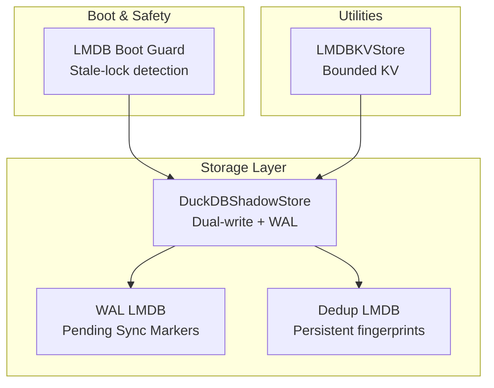
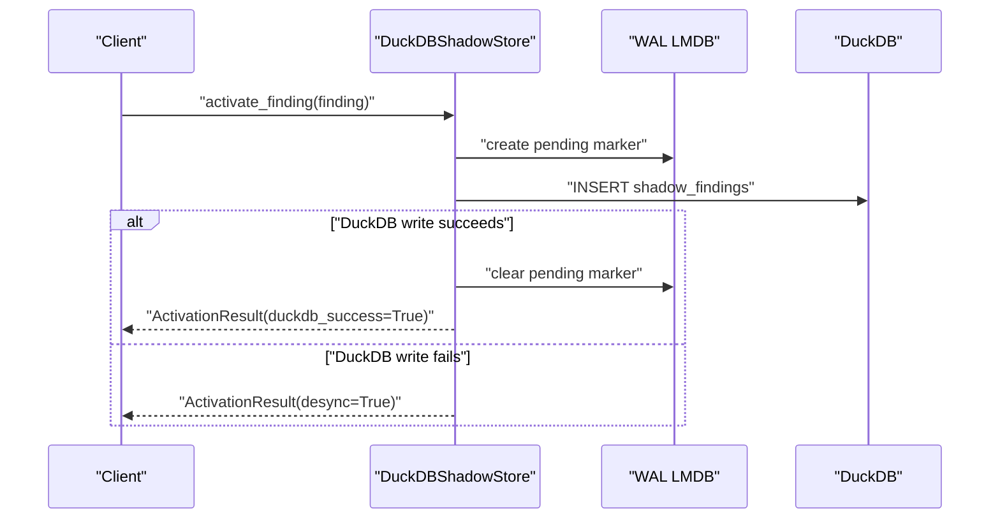
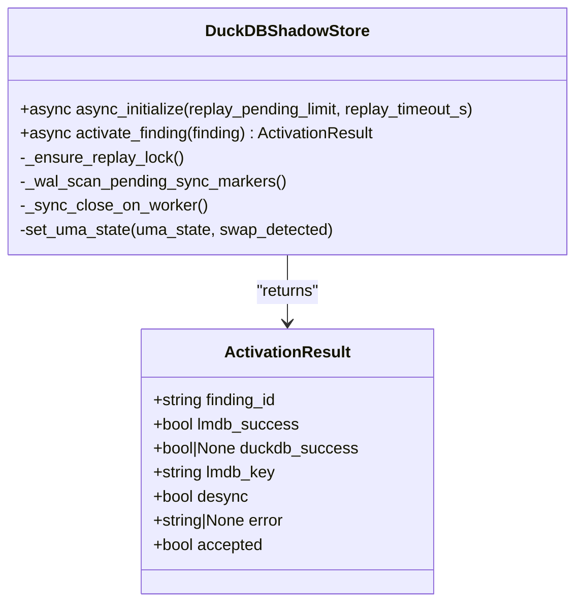
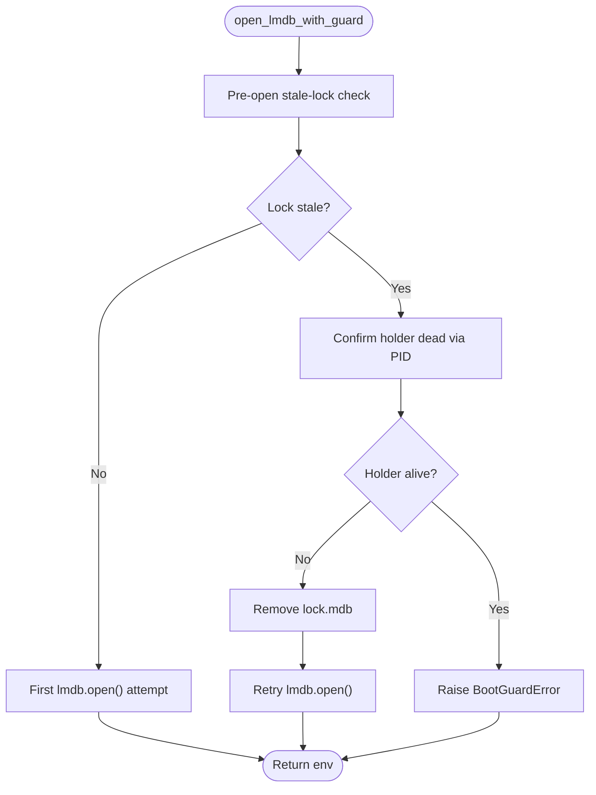
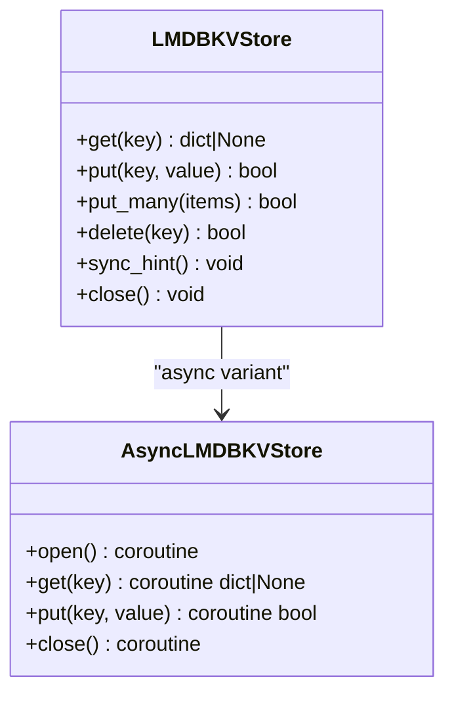
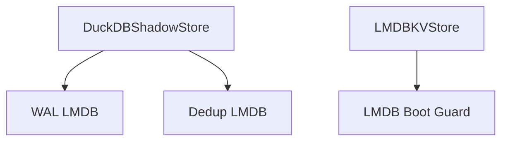

# Atomic Storage Mechanism

<cite>
**Referenced Files in This Document**
- [duckdb_store.py](file://knowledge/duckdb_store.py)
- [lmdb_boot_guard.py](file://knowledge/lmdb_boot_guard.py)
- [lmdb_kv.py](file://tools/lmdb_kv.py)
- [atomic_storage.py](file://knowledge/atomic_storage.py)
- [legacy_atomic_storage.py](file://legacy/atomic_storage.py)
- [persistent_layer.py](file://knowledge/persistent_layer.py)
- [evidence_chain.py](file://knowledge/evidence_chain.py)
</cite>

## Table of Contents
1. [Introduction](#introduction)
2. [Project Structure](#project-structure)
3. [Core Components](#core-components)
4. [Architecture Overview](#architecture-overview)
5. [Detailed Component Analysis](#detailed-component-analysis)
6. [Dependency Analysis](#dependency-analysis)
7. [Performance Considerations](#performance-considerations)
8. [Troubleshooting Guide](#troubleshooting-guide)
9. [Conclusion](#conclusion)
10. [Appendices](#appendices)

## Introduction
This document describes the atomic storage mechanism designed for high-throughput write operations and transactional integrity. The system implements a dual-write strategy synchronizing DuckDB (primary analytics store) with LMDB (write-ahead log and WAL) to guarantee durability and recoverability. It covers write-ahead logging, transaction management, consistency guarantees, desync detection and resolution, replay functionality for pending operations, error handling strategies, configuration options, and performance characteristics.

## Project Structure
The atomic storage spans several modules:
- DuckDB sidecar with async-safe design and integrated LMDB WAL
- LMDB boot guard for safe stale-lock detection and recovery
- LMDB key-value store optimized for bounded, high-throughput operations
- Legacy atomic storage (deprecated) and stubs for backward compatibility
- Evidence chain tracking for reasoning lineage and corroboration

**Diagram sources**
- [duckdb_store.py:643-791](file://knowledge/duckdb_store.py#L643-L791)
- [lmdb_boot_guard.py:167-224](file://knowledge/lmdb_boot_guard.py#L167-L224)
- [lmdb_kv.py:55-116](file://tools/lmdb_kv.py#L55-L116)

**Section sources**
- [duckdb_store.py:643-791](file://knowledge/duckdb_store.py#L643-L791)
- [lmdb_boot_guard.py:167-224](file://knowledge/lmdb_boot_guard.py#L167-L224)
- [lmdb_kv.py:55-116](file://tools/lmdb_kv.py#L55-L116)

## Core Components
- DuckDBShadowStore: Asynchronous, thread-affine DuckDB sidecar with dual-write to DuckDB and LMDB WAL. Implements replay of pending operations at startup and maintains consistency via LMDB markers.
- LMDB Boot Guard: Detects stale LMDB locks and cleans them safely before opening environments.
- LMDBKVStore: Bounded, zero-copy key-value store using LMDB and orjson, optimized for M1 constraints.
- Legacy Atomic Storage: Deprecated JSON-based knowledge graph with sharding and LMDB migration path.
- Evidence Chain: Tracks reasoning lineage and corroboration across processing steps.

**Section sources**
- [duckdb_store.py:643-791](file://knowledge/duckdb_store.py#L643-L791)
- [lmdb_boot_guard.py:167-224](file://knowledge/lmdb_boot_guard.py#L167-L224)
- [lmdb_kv.py:55-116](file://tools/lmdb_kv.py#L55-L116)
- [atomic_storage.py:1-25](file://knowledge/atomic_storage.py#L1-L25)
- [legacy_atomic_storage.py:1-11](file://legacy/atomic_storage.py#L1-L11)
- [evidence_chain.py:1-50](file://knowledge/evidence_chain.py#L1-L50)

## Architecture Overview
The atomic storage architecture centers on a dual-write pipeline:
- Writes originate as activation records in DuckDBShadowStore.
- Each write is preceded by an LMDB WAL marker creation and followed by a DuckDB INSERT.
- If DuckDB write fails, the system flags a desync and persists a pending marker for later replay.
- At startup, the system scans pending markers and replays missed writes with cooperative yielding to avoid event loop starvation.

**Diagram sources**
- [duckdb_store.py:97-145](file://knowledge/duckdb_store.py#L97-L145)
- [duckdb_store.py:2420-2430](file://knowledge/duckdb_store.py#L2420-L2430)

**Section sources**
- [duckdb_store.py:97-145](file://knowledge/duckdb_store.py#L97-L145)
- [duckdb_store.py:2420-2430](file://knowledge/duckdb_store.py#L2420-L2430)

## Detailed Component Analysis

### DuckDBShadowStore: Dual-Write Pipeline and Consistency
- Thread-affine design: All DuckDB operations run on a dedicated single-worker ThreadPoolExecutor. Connections are created inside the worker thread to maintain thread affinity.
- Dual-write model: For each activation, the store first writes a pending marker to WAL LMDB, then performs the DuckDB INSERT. On success, it clears the pending marker; on failure, it flags a desync.
- Startup replay: During async_initialize, the store scans pending markers, deduplicates by finding_id, and replays writes with bounded limits and timeout. Cooperative yields are used to avoid event loop starvation.
- Quality gates: Pre-storage quality checks (entropy, deduplication) reduce write volume and improve data quality.
- UMA-aware runtime settings: DuckDB memory limits and thread counts adapt to system memory pressure.

**Diagram sources**
- [duckdb_store.py:643-791](file://knowledge/duckdb_store.py#L643-L791)
- [duckdb_store.py:97-145](file://knowledge/duckdb_store.py#L97-L145)

**Section sources**
- [duckdb_store.py:643-791](file://knowledge/duckdb_store.py#L643-L791)
- [duckdb_store.py:2420-2430](file://knowledge/duckdb_store.py#L2420-L2430)
- [duckdb_store.py:5805-5837](file://knowledge/duckdb_store.py#L5805-L5837)

### LMDB Boot Guard: Safe Environment Initialization
- Stale-lock detection: Determines whether an LMDB lock is stale by attempting to read the holder PID from the lock file header and verifying liveness via os.kill(pid, 0).
- Age-based fallback: If the PID cannot be determined, the lock is considered stale if older than a threshold.
- Fail-soft cleanup: Lock removal is performed only when the holder is confirmed dead; otherwise, the function returns a reason without raising an error.
- Integration: The guard wraps lmdb.open with pre-open stale-lock checks and a single retry after confirmed-dead cleanup.

**Diagram sources**
- [lmdb_boot_guard.py:167-224](file://knowledge/lmdb_boot_guard.py#L167-L224)

**Section sources**
- [lmdb_boot_guard.py:81-117](file://knowledge/lmdb_boot_guard.py#L81-L117)
- [lmdb_boot_guard.py:132-165](file://knowledge/lmdb_boot_guard.py#L132-L165)
- [lmdb_boot_guard.py:167-224](file://knowledge/lmdb_boot_guard.py#L167-L224)

### LMDBKVStore: Bounded, Zero-Copy Key-Value Store
- Zero-copy reads: Uses buffers=True for memoryview-backed reads and orjson for fast serialization/deserialization.
- Batching: put_many writes items in batches capped by LMDB_WRITE_BATCH_SIZE, with fallback to single transactions on failure.
- Bounded storage: Enforces a maximum number of keys to prevent unbounded growth.
- Async support: Provides AsyncLMDBKVStore with aiolmdb fallback to ThreadPoolExecutor.

**Diagram sources**
- [lmdb_kv.py:55-116](file://tools/lmdb_kv.py#L55-L116)
- [lmdb_kv.py:259-361](file://tools/lmdb_kv.py#L259-L361)

**Section sources**
- [lmdb_kv.py:55-116](file://tools/lmdb_kv.py#L55-L116)
- [lmdb_kv.py:165-210](file://tools/lmdb_kv.py#L165-L210)
- [lmdb_kv.py:259-361](file://tools/lmdb_kv.py#L259-L361)

### Legacy Atomic Storage: Deprecated JSON-Based Knowledge Graph
- Sharded JSON storage with LRU cache and atomic file operations.
- Optional LMDB backend for migration and persistence.
- Deprecated in favor of DuckDBShadowStore for high-throughput, transactional analytics storage.

**Section sources**
- [legacy_atomic_storage.py:1-11](file://legacy/atomic_storage.py#L1-L11)
- [legacy_atomic_storage.py:153-230](file://legacy/atomic_storage.py#L153-L230)

### Evidence Chain: Reasoning Lineage Tracking
- Tracks processing steps from raw finding to conclusions, enabling corroboration analysis.
- Serialized into payload_text/envelope for lightweight persistence without new storage paths.
- Supports corroboration level computation across source families.

**Section sources**
- [evidence_chain.py:1-50](file://knowledge/evidence_chain.py#L1-L50)
- [evidence_chain.py:566-747](file://knowledge/evidence_chain.py#L566-L747)

## Dependency Analysis
- DuckDBShadowStore depends on LMDB for WAL and deduplication, and optionally on external graph backends for IOC ingestion.
- LMDB Boot Guard is used by LMDBKVStore and other LMDB-dependent components to ensure safe environment initialization.
- Legacy atomic storage provides migration hooks to LMDB for backward compatibility.

**Diagram sources**
- [duckdb_store.py:643-791](file://knowledge/duckdb_store.py#L643-L791)
- [lmdb_boot_guard.py:167-224](file://knowledge/lmdb_boot_guard.py#L167-L224)
- [lmdb_kv.py:55-116](file://tools/lmdb_kv.py#L55-L116)

**Section sources**
- [duckdb_store.py:643-791](file://knowledge/duckdb_store.py#L643-L791)
- [lmdb_boot_guard.py:167-224](file://knowledge/lmdb_boot_guard.py#L167-L224)
- [lmdb_kv.py:55-116](file://tools/lmdb_kv.py#L55-L116)

## Performance Considerations
- Thread-affinity and single-worker executor: DuckDB operations run on a dedicated worker thread to avoid cross-thread contention and simplify locking.
- UMA-aware runtime settings: DuckDB memory limits and thread counts scale down under memory pressure to prevent OOM conditions.
- Bounded storage: LMDBKVStore enforces max keys and batched writes to control memory footprint.
- Zero-copy reads: LMDBKVStore uses memoryview-backed reads to minimize CPU overhead.
- Cooperative yielding: Replay routines yield to the event loop to prevent stalls during long-running operations.
- Read-ahead tuning: LMDB is configured with readahead=False to reduce Metal page cache pollution on M1 systems.

[No sources needed since this section provides general guidance]

## Troubleshooting Guide
- Boot guard failures: If a live lock holder is detected, BootGuardError is raised. Investigate the reported PID and resolve conflicts before retrying.
- Stale lock cleanup: The boot guard recommends removal only when the holder is confirmed dead; otherwise, it logs reasons and avoids unsafe deletions.
- Replay timeouts: If replay exceeds the configured timeout, pending operations are not guaranteed to complete. Adjust replay_pending_limit and replay_timeout_s accordingly.
- Desync handling: When DuckDB writes fail, the system flags desync and leaves a pending marker. Monitor ActivationResult.desync and ReplayResult.deadlettered to track problematic entries.
- Quality rejections: Track rejected findings via quality rejection ledger and counters to diagnose quality gate issues.

**Section sources**
- [lmdb_boot_guard.py:119-165](file://knowledge/lmdb_boot_guard.py#L119-L165)
- [duckdb_store.py:2420-2430](file://knowledge/duckdb_store.py#L2420-L2430)
- [duckdb_store.py:5805-5837](file://knowledge/duckdb_store.py#L5805-L5837)

## Conclusion
The atomic storage mechanism combines DuckDB’s analytical strengths with LMDB’s reliability to deliver high-throughput, transactionally consistent writes. The dual-write strategy, combined with WAL-based desync detection and replay, ensures durability and recoverability. Boot guard safety, bounded storage, and UMA-aware runtime settings provide robustness and performance on constrained hardware.

[No sources needed since this section summarizes without analyzing specific files]

## Appendices

### Configuration Options
- DuckDB runtime settings:
  - GHOST_DUCKDB_MEMORY: Base memory limit for DuckDB.
  - GHOST_DUCKDB_MAX_TEMP: Maximum temp directory size for DuckDB spill.
- Replay controls:
  - replay_pending_limit: Maximum number of pending markers to replay during startup.
  - replay_timeout_s: Wall-time budget for replay operations.
- LMDB boot guard:
  - Lock age threshold: Used when holder PID cannot be determined.
- LMDBKVStore:
  - map_size: Maximum database size in bytes.
  - max_keys: Maximum number of keys to prevent unbounded growth.
  - LMDB_WRITE_BATCH_SIZE: Hard cap for batched writes.

**Section sources**
- [duckdb_store.py:428-488](file://knowledge/duckdb_store.py#L428-L488)
- [duckdb_store.py:2420-2430](file://knowledge/duckdb_store.py#L2420-L2430)
- [lmdb_boot_guard.py:31-34](file://knowledge/lmdb_boot_guard.py#L31-L34)
- [lmdb_kv.py:50-53](file://tools/lmdb_kv.py#L50-L53)

### Example Workflows
- Atomic write operation:
  - Create a pending marker in WAL LMDB.
  - Insert the finding into DuckDB.
  - Clear the pending marker on success; otherwise, flag desync.
- Transaction rollback:
  - Not applicable for DuckDBShadowStore; use replay to reconcile pending operations.
- Recovery workflow:
  - Scan pending markers at startup.
  - Deduplicate by finding_id.
  - Replay writes with bounded limits and timeout.
  - Verify writes by read-back and clear markers on success.

**Section sources**
- [duckdb_store.py:97-145](file://knowledge/duckdb_store.py#L97-L145)
- [duckdb_store.py:2420-2430](file://knowledge/duckdb_store.py#L2420-L2430)
- [duckdb_store.py:5805-5837](file://knowledge/duckdb_store.py#L5805-L5837)