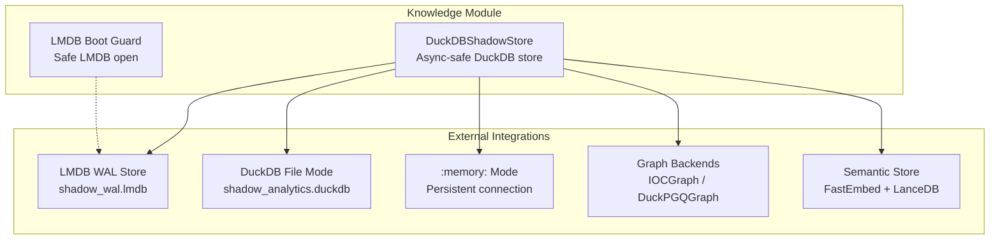
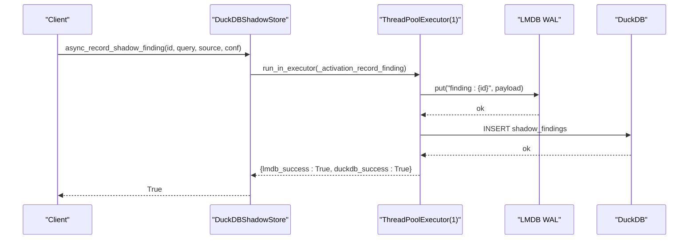
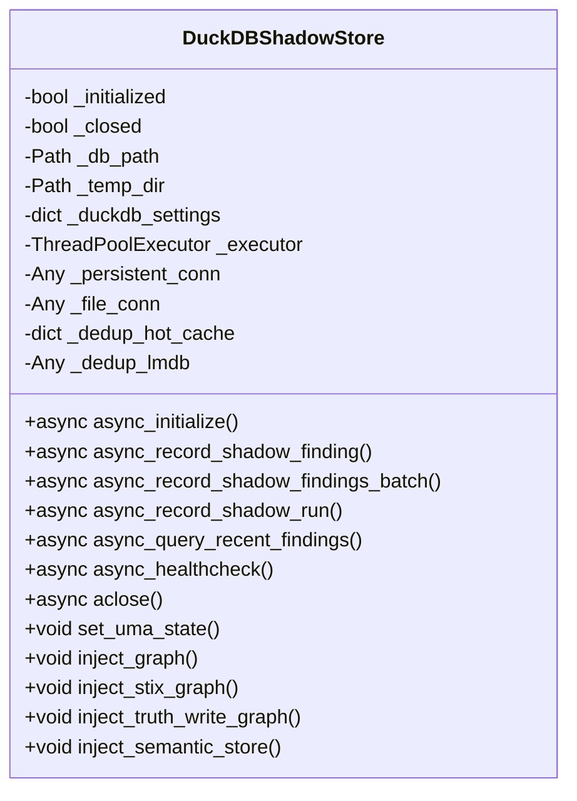
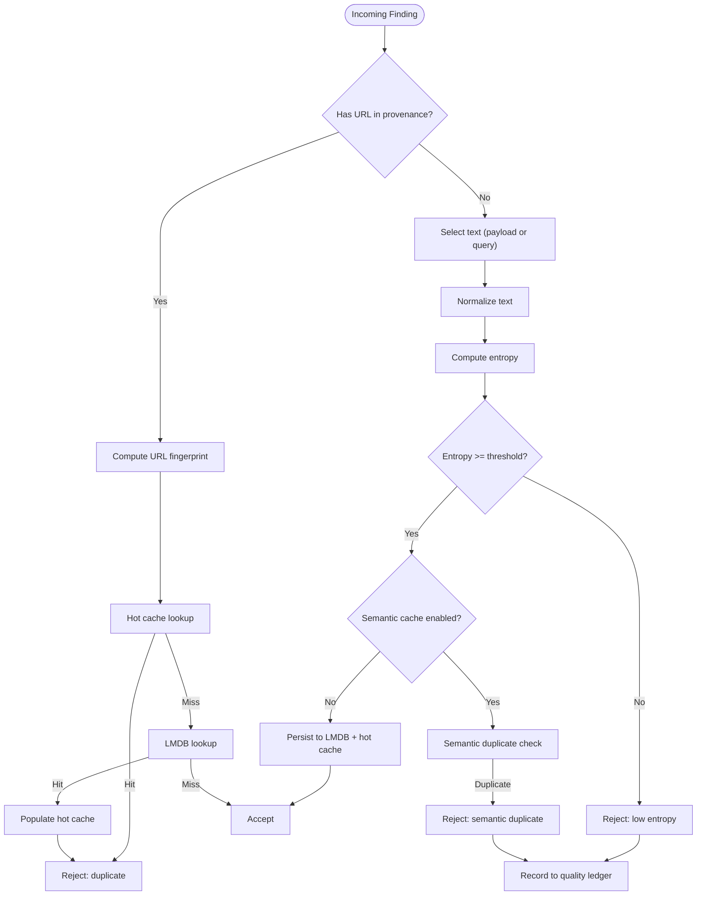
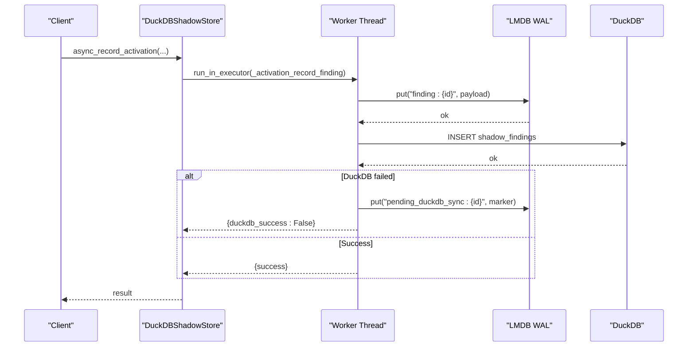
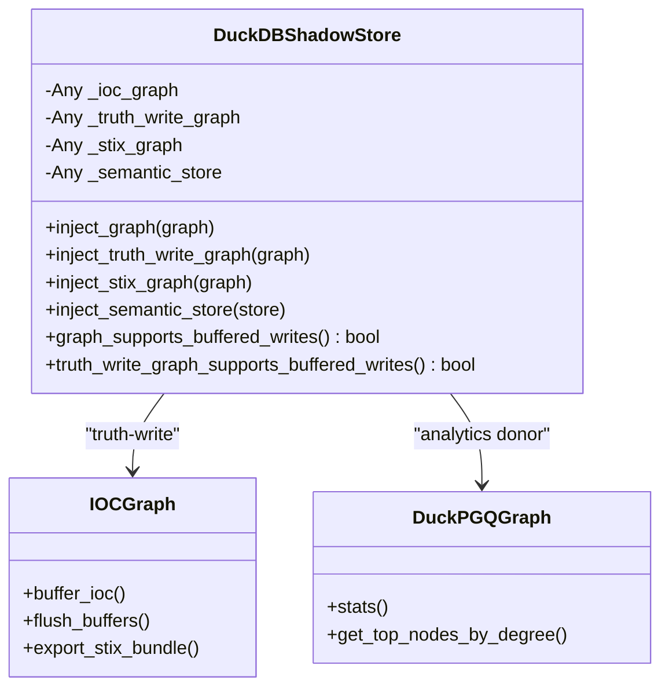
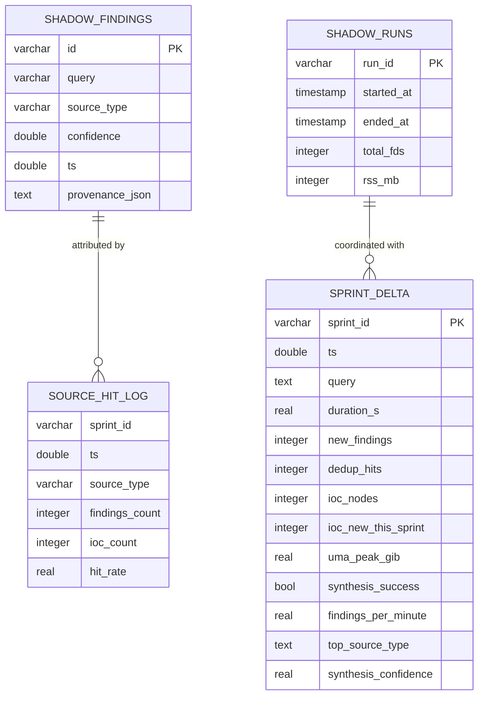
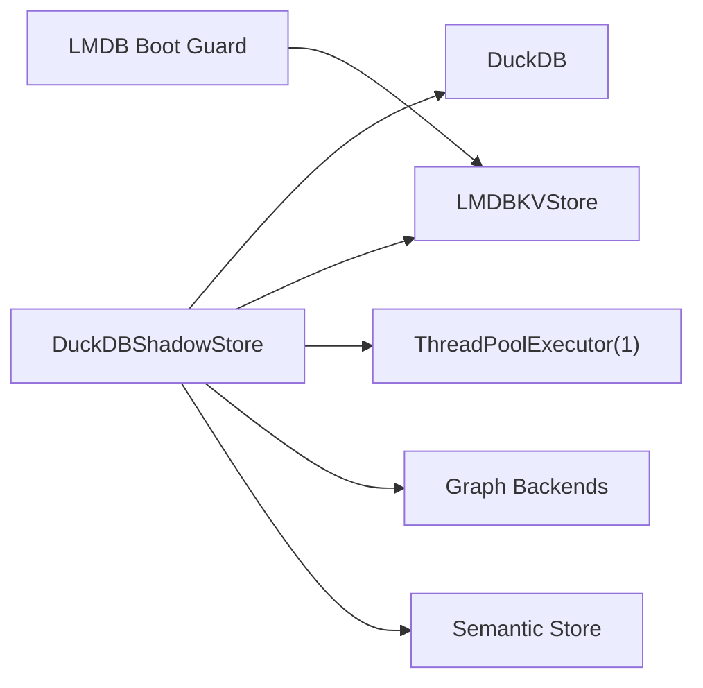

# DuckDB Storage System

<cite>
**Referenced Files in This Document**
- [duckdb_store.py](file://knowledge/duckdb_store.py)
- [lmdb_boot_guard.py](file://knowledge/lmdb_boot_guard.py)
</cite>

## Table of Contents
1. [Introduction](#introduction)
2. [Project Structure](#project-structure)
3. [Core Components](#core-components)
4. [Architecture Overview](#architecture-overview)
5. [Detailed Component Analysis](#detailed-component-analysis)
6. [Dependency Analysis](#dependency-analysis)
7. [Performance Considerations](#performance-considerations)
8. [Troubleshooting Guide](#troubleshooting-guide)
9. [Conclusion](#conclusion)

## Introduction
This document describes the DuckDB storage system implementation used as the canonical store for sprint-level facts and analytics. The system centers on the DuckDBShadowStore class, which provides:
- Async-safe operations using a single-threaded worker pool
- RAMDISK-first operational mode with graceful degradation
- Three-tier facts hierarchy (sprint facts, shadow findings, graph components)
- Quality gating and deduplication with persistent LMDB backing
- Integration with external graph systems and semantic stores

The implementation emphasizes thread-affinity, memory-conscious runtime settings, and robust recovery via WAL-first ingestion.

## Project Structure
The DuckDB storage system lives primarily in the knowledge module:
- DuckDBShadowStore: main storage class with async APIs, quality gating, and deduplication
- LMDB boot guard: safe LMDB initialization with stale-lock detection

**Diagram sources**
- [duckdb_store.py](file://knowledge/duckdb_store.py)
- [lmdb_boot_guard.py](file://knowledge/lmdb_boot_guard.py)

**Section sources**
- [duckdb_store.py](file://knowledge/duckdb_store.py)

## Core Components
- DuckDBShadowStore: Async-safe storage with thread-affine connections, batch operations, health checks, and lifecycle management
- Quality gating and deduplication: entropy checks, URL-first fingerprints, hot-cache + persistent LMDB dedup
- WAL-first activation: LMDB WAL followed by DuckDB, with recovery markers and dead-lettering
- Graph integration: capability-checked injection for truth-write, analytics, and STIX export
- Semantic buffering: background embedding and indexing for findings

Key async API surface:
- async_initialize(replay_pending_limit, replay_timeout_s)
- async_record_shadow_finding / async_record_shadow_findings_batch
- async_record_shadow_run
- async_query_recent_findings
- async_healthcheck
- aclose()

**Section sources**
- [duckdb_store.py](file://knowledge/duckdb_store.py)

## Architecture Overview
The system separates concerns across three layers:
- Facts layer (DuckDB): canonical sprint metrics and findings
- Activation layer (WAL-first): durable ingestion with recovery
- Integration layer (Graph/Semantic): optional enrichment and truth-write

**Diagram sources**
- [duckdb_store.py](file://knowledge/duckdb_store.py)

## Detailed Component Analysis

### DuckDBShadowStore Class
Async-safe design with thread-affine connections:
- Single-threaded worker pool (ThreadPoolExecutor with 1 worker)
- Connections created inside the worker thread (thread-affine)
- All public async methods use run_in_executor to avoid event-loop blocking
- Two operational modes:
  - File mode: persistent file DB + RAMDISK temp directory
  - Memory mode: :memory: with a persistent connection

UMA-aware runtime settings:
- Resolved at connection init based on uma_state and swap detection
- Memory limit, threads, and safe_mode adjusted conservatively for M1 8GB UMA

Health and lifecycle:
- async_healthcheck performs a zero-cost query
- aclose() is idempotent and resets boot barriers
- async_initialize supports bounded startup replay

**Diagram sources**
- [duckdb_store.py](file://knowledge/duckdb_store.py)

**Section sources**
- [duckdb_store.py](file://knowledge/duckdb_store.py)

### Quality Gating and Deduplication
Quality assessment pipeline:
- URL-first fingerprinting when available; otherwise text-based BLAKE2b
- Hot-cache lookup (bounded) then persistent LMDB authority
- Short-string bypass with semantic dedup cache when available
- Entropy threshold filtering for low-information content
- Failure-isolation: quality gate failures are fail-open

Deduplication mechanisms:
- Hot cache: bounded in-memory cache keyed by fingerprint
- Persistent LMDB: namespace "dedup:{fingerprint}" → finding_id
- Quality rejection ledger: bounded record of rejections for diagnosis

**Diagram sources**
- [duckdb_store.py](file://knowledge/duckdb_store.py)

**Section sources**
- [duckdb_store.py](file://knowledge/duckdb_store.py)

### WAL-First Activation and Recovery
Activation workflow:
- LMDB WAL first: writing finding payload to shadow_wal.lmdb
- DuckDB second: inserting into shadow_findings
- Partial failure: write pending-sync marker for later replay
- Dead-lettering: after max retries, move marker to dead-letter namespace

Startup replay:
- Bounded replay of pending markers during async_initialize
- Boot barrier prevents writes until replay completes or times out

**Diagram sources**
- [duckdb_store.py](file://knowledge/duckdb_store.py)

**Section sources**
- [duckdb_store.py](file://knowledge/duckdb_store.py)

### Graph Integration
The store supports multiple graph backends with capability checks:
- Truth-write graph: requires buffer_ioc and flush_buffers (IOCGraph)
- Analytics graph: donor backend (DuckPGQGraph) for read-only operations
- STIX graph: export_stix_bundle capability (IOCGraph)

**Diagram sources**
- [duckdb_store.py](file://knowledge/duckdb_store.py)

**Section sources**
- [duckdb_store.py](file://knowledge/duckdb_store.py)

### Three-Tier Facts Hierarchy
Tier 1 (DuckDB, durable):
- sprint_delta: per-sprint metrics (duration, findings, dedup hits, ioc nodes, synthesis metrics)
- sprint_scorecard: aggregated scores (findings_per_minute, ioc_density, semantic_novelty)
- source_hit_log: per-sprint source attribution (hit rates)

Tier 2 (DuckDB, durable):
- shadow_findings: finding-level records with provenance and payload
- shadow_runs: run-level metadata

Tier 3 (Injected):
- IOCGraph: truth graph for IOC storage
- SemanticStore: ANN semantic search

**Diagram sources**
- [duckdb_store.py](file://knowledge/duckdb_store.py)

**Section sources**
- [duckdb_store.py](file://knowledge/duckdb_store.py)

## Dependency Analysis
- DuckDBShadowStore depends on DuckDB (imported lazily) and LMDB (via LMDBKVStore)
- Uses ThreadPoolExecutor for thread-affine operations
- Integrates with external systems via capability checks (graphs, semantic store)
- Boot guard ensures safe LMDB initialization with stale-lock detection

**Diagram sources**
- [duckdb_store.py](file://knowledge/duckdb_store.py)
- [lmdb_boot_guard.py](file://knowledge/lmdb_boot_guard.py)

**Section sources**
- [duckdb_store.py](file://knowledge/duckdb_store.py)
- [lmdb_boot_guard.py](file://knowledge/lmdb_boot_guard.py)

## Performance Considerations
- RAMDISK-first mode: file DB with temp directory on RAMDISK for improved I/O throughput
- Memory-conscious runtime: conservative memory_limit and threads for M1 8GB UMA
- Batch operations: chunked inserts with explicit transactions for throughput
- Streaming queries: async_query_arrow_batches for large result sets
- Background tasks: graph ingest and semantic buffering run fire-and-forget to avoid blocking

## Troubleshooting Guide
Common operational checks:
- Health: async_healthcheck returns True when queries succeed
- Pending markers: pending_marker_count indicates outstanding recovery work
- Dead-letter markers: deadletter_marker_count tracks failed recovery attempts
- Invariants: invariant_validate verifies memory limits and temp directory placement

Recovery procedures:
- Startup replay: async_initialize supports bounded replay of pending markers
- Manual replay: async_replay_all_pending_duckdb_sync processes markers in chunks
- Shutdown: aclose() gracefully closes connections, graphs, and stores

Operational safeguards:
- Boot guard: open_lmdb_with_guard prevents unsafe stale-lock scenarios
- UMA-aware settings: set_uma_state adjusts runtime parameters dynamically

**Section sources**
- [duckdb_store.py](file://knowledge/duckdb_store.py)
- [lmdb_boot_guard.py](file://knowledge/lmdb_boot_guard.py)

## Conclusion
The DuckDB storage system provides a robust, async-safe foundation for sprint analytics with:
- Thread-affine connections and a single-threaded worker pool
- RAMDISK-first operational mode with graceful degradation
- Comprehensive quality gating and persistent deduplication
- Integration hooks for graph and semantic systems
- Operational resilience via WAL-first ingestion and recovery

This design is optimized for constrained environments (e.g., M1 8GB UMA) while maintaining durability and performance for sustained research operations.