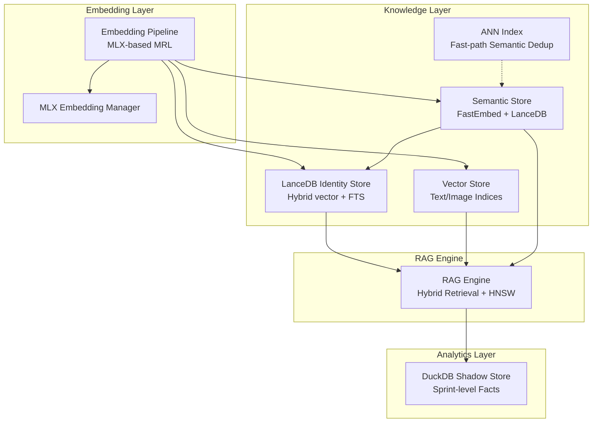
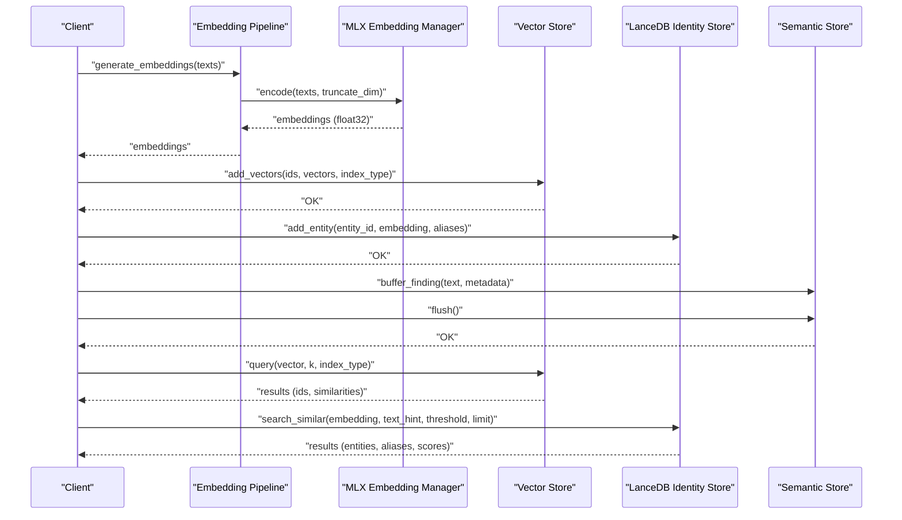
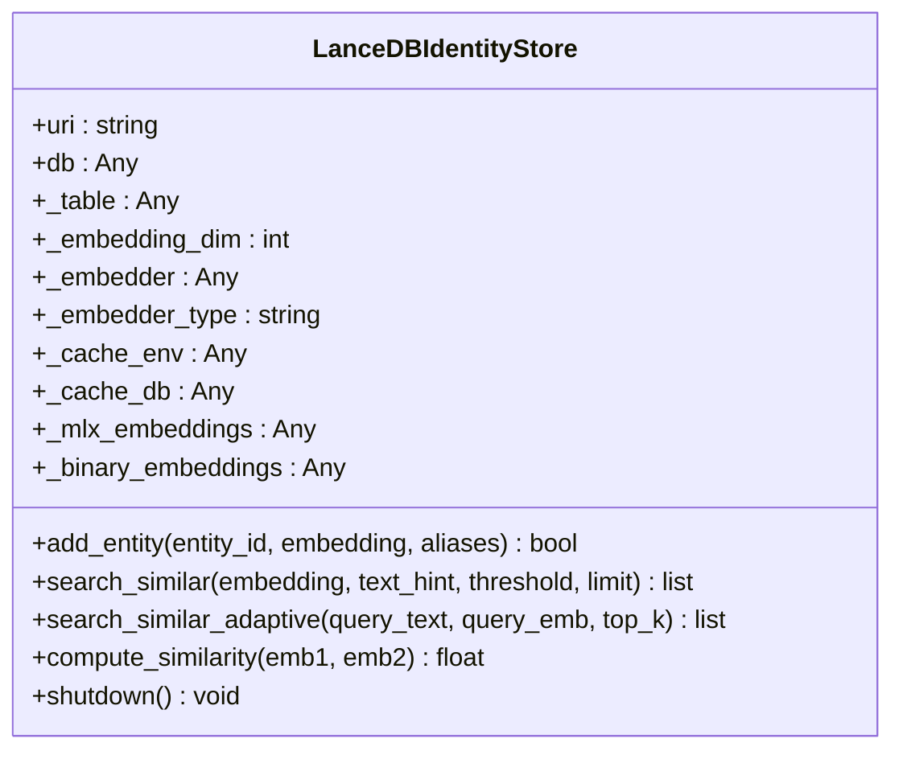
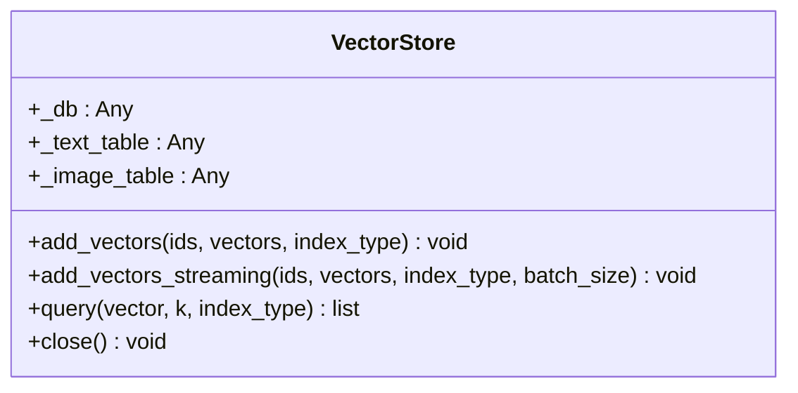
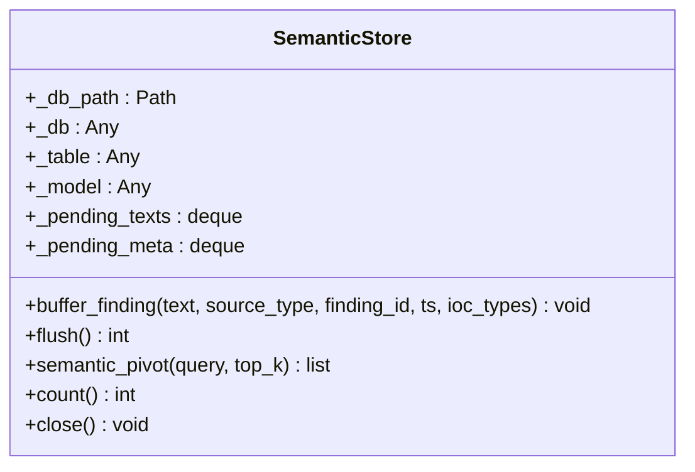
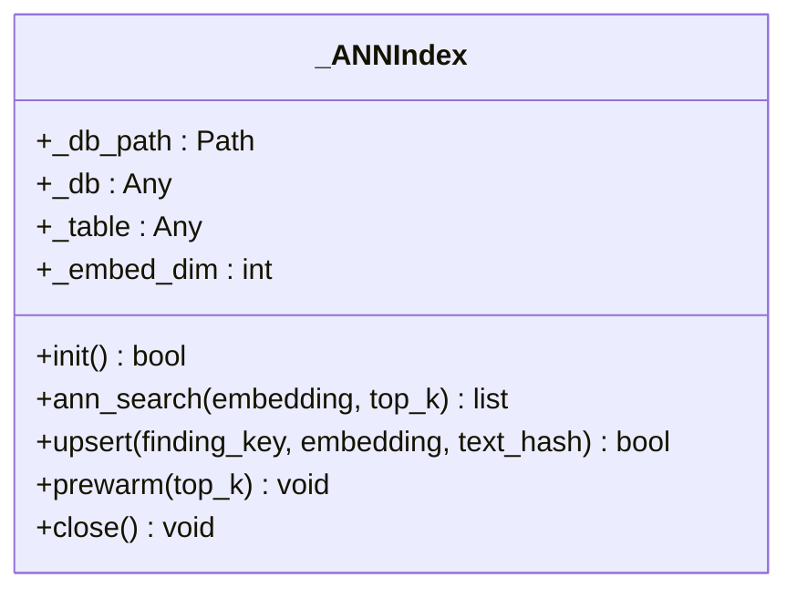
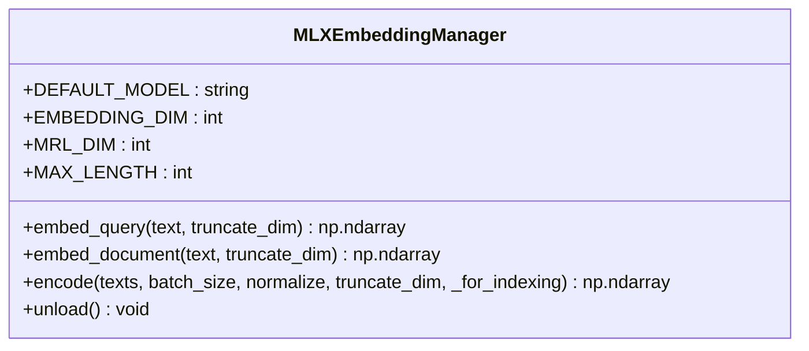
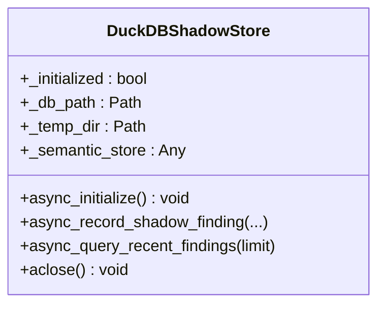
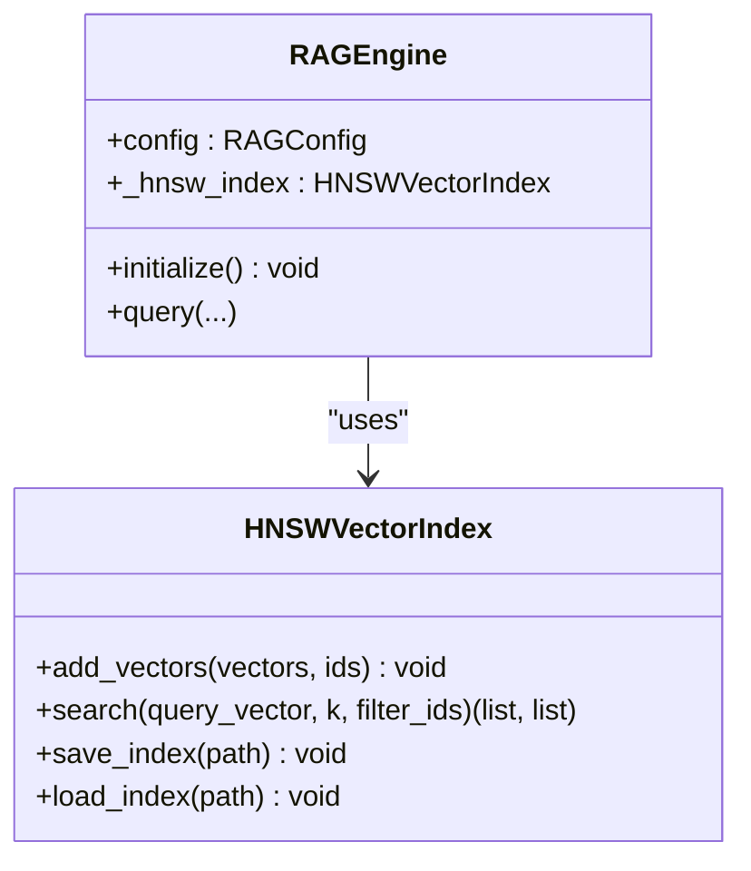
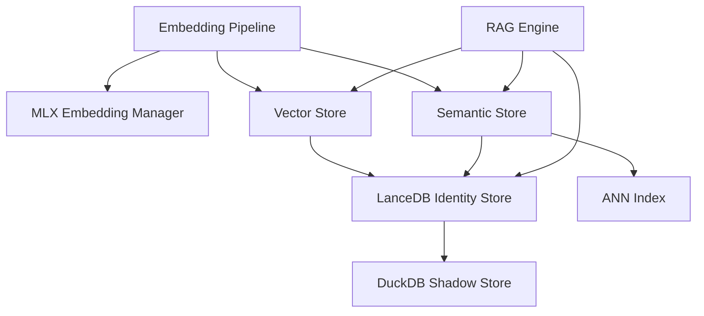

# LanceDB Vector Store

<cite>
**Referenced Files in This Document**
- [lancedb_store.py](file://knowledge/lancedb_store.py)
- [vector_store.py](file://knowledge/vector_store.py)
- [semantic_store.py](file://knowledge/semantic_store.py)
- [duckdb_store.py](file://knowledge/duckdb_store.py)
- [ann_index.py](file://knowledge/ann_index.py)
- [embedding_pipeline.py](file://embedding_pipeline.py)
- [mlx_embeddings.py](file://core/mlx_embeddings.py)
- [rag_engine.py](file://knowledge/rag_engine.py)
</cite>

## Table of Contents
1. [Introduction](#introduction)
2. [Project Structure](#project-structure)
3. [Core Components](#core-components)
4. [Architecture Overview](#architecture-overview)
5. [Detailed Component Analysis](#detailed-component-analysis)
6. [Dependency Analysis](#dependency-analysis)
7. [Performance Considerations](#performance-considerations)
8. [Troubleshooting Guide](#troubleshooting-guide)
9. [Conclusion](#conclusion)
10. [Appendices](#appendices)

## Introduction
This document describes the LanceDB vector store implementation used for semantic similarity search and embedding management within the knowledge management system. It covers the vector store architecture, embedding dimension configuration, ANN search capabilities, integration with FastEmbed for efficient text embeddings, and the semantic search workflow. It also details table schemas, index creation strategies, query optimization techniques, configuration options, and examples of embedding generation, vector insertion, similarity searches, and batch operations. Finally, it explains the relationship with DuckDB for hybrid analytics and the overall semantic search pipeline.

## Project Structure
The LanceDB vector store ecosystem spans several modules:
- Identity and entity resolution with hybrid vector + FTS search
- Primary vector storage with separate indices for text and images
- Semantic store leveraging FastEmbed + LanceDB for ANN semantic search
- DuckDB analytics sidecar for hybrid search scenarios
- ANN fast-path for semantic deduplication
- Embedding pipeline and MLX-based embedder for high-performance inference

**Diagram sources**
- [lancedb_store.py:113-1334](file://knowledge/lancedb_store.py#L113-L1334)
- [vector_store.py:44-308](file://knowledge/vector_store.py#L44-L308)
- [semantic_store.py:42-301](file://knowledge/semantic_store.py#L42-L301)
- [ann_index.py:51-381](file://knowledge/ann_index.py#L51-L381)
- [embedding_pipeline.py:1-748](file://embedding_pipeline.py#L1-L748)
- [mlx_embeddings.py:79-593](file://core/mlx_embeddings.py#L79-L593)
- [rag_engine.py:665-800](file://knowledge/rag_engine.py#L665-L800)

**Section sources**
- [lancedb_store.py:1-1334](file://knowledge/lancedb_store.py#L1-L1334)
- [vector_store.py:1-308](file://knowledge/vector_store.py#L1-L308)
- [semantic_store.py:1-301](file://knowledge/semantic_store.py#L1-L301)
- [duckdb_store.py:1-800](file://knowledge/duckdb_store.py#L1-L800)
- [ann_index.py:1-381](file://knowledge/ann_index.py#L1-L381)
- [embedding_pipeline.py:1-748](file://embedding_pipeline.py#L1-L748)
- [mlx_embeddings.py:1-593](file://core/mlx_embeddings.py#L1-L593)
- [rag_engine.py:1-800](file://knowledge/rag_engine.py#L1-L800)

## Core Components
- LanceDB Identity Store: Provides hybrid vector + FTS search for entity resolution, with adaptive reranking, binary prefilter, and MLX acceleration.
- Vector Store: Separate LanceDB indices for text (256d MRL) and image (1024d) embeddings with streaming batch insertion and cosine similarity queries.
- Semantic Store: FastEmbed-based semantic search over findings with LanceDB ANN index and cosine similarity.
- DuckDB Shadow Store: Analytics sidecar for sprint-level facts and derived analytics, integrating with semantic stores.
- ANN Index: Fast-path ANN index layered over SemanticDedupCache for sub-10ms duplicate detection.
- Embedding Pipeline and MLX Embedding Manager: High-performance MLX-based embeddings with MRL truncation and memory-aware batching.

**Section sources**
- [lancedb_store.py:113-1334](file://knowledge/lancedb_store.py#L113-L1334)
- [vector_store.py:44-308](file://knowledge/vector_store.py#L44-L308)
- [semantic_store.py:42-301](file://knowledge/semantic_store.py#L42-L301)
- [duckdb_store.py:643-800](file://knowledge/duckdb_store.py#L643-L800)
- [ann_index.py:51-381](file://knowledge/ann_index.py#L51-L381)
- [embedding_pipeline.py:271-453](file://embedding_pipeline.py#L271-L453)
- [mlx_embeddings.py:79-593](file://core/mlx_embeddings.py#L79-L593)

## Architecture Overview
The vector store architecture integrates multiple layers:
- Embedding generation via MLX-based embedders with MRL truncation to 256d for text and 384d for FastEmbed models.
- Vector storage in LanceDB tables with schema-defined dimensions and optional FTS indices.
- Hybrid search combining vector similarity and full-text search, with adaptive reranking and diversity filtering.
- Analytics integration with DuckDB for sprint-level insights and cross-store relationships.

**Diagram sources**
- [embedding_pipeline.py:271-453](file://embedding_pipeline.py#L271-L453)
- [mlx_embeddings.py:236-334](file://core/mlx_embeddings.py#L236-L334)
- [vector_store.py:122-277](file://knowledge/vector_store.py#L122-L277)
- [lancedb_store.py:1061-1193](file://knowledge/lancedb_store.py#L1061-L1193)
- [semantic_store.py:158-266](file://knowledge/semantic_store.py#L158-L266)

## Detailed Component Analysis

### LanceDB Identity Store
The identity store provides hybrid vector + FTS search for entity resolution with:
- Table schema supporting id, embedding (768d), aliases, timestamps.
- FTS index creation for alias matching when available.
- Adaptive reranking with ColBERT/FlashRank/MLX based on thermal and memory conditions.
- Binary prefilter using sign-based signatures for fast initial filtering.
- MLX acceleration for similarity computation and optional usearch index for large-scale scans.

Key capabilities:
- Entity addition with embedding and alias lists.
- Similarity search with optional text hints and threshold filtering.
- Hybrid search path selection based on FTS availability.
- Memory-aware caching with LMDB, eviction, and telemetry.

**Diagram sources**
- [lancedb_store.py:113-1334](file://knowledge/lancedb_store.py#L113-L1334)

**Section sources**
- [lancedb_store.py:1015-1334](file://knowledge/lancedb_store.py#L1015-L1334)

### Vector Store (Text/Image Indices)
The Vector Store manages separate LanceDB indices:
- Text index: 256d MRL embeddings (ModernBERT).
- Image index: 1024d embeddings.
- Schema enforcement and dimension validation.
- Streaming batch insertion to reduce peak memory on M1 8GB systems.
- Cosine similarity queries with distance-to-similarity conversion.

**Diagram sources**
- [vector_store.py:44-308](file://knowledge/vector_store.py#L44-L308)

**Section sources**
- [vector_store.py:62-291](file://knowledge/vector_store.py#L62-L291)

### Semantic Store (FastEmbed + LanceDB)
The Semantic Store performs ANN semantic search over findings:
- FastEmbed BAAI/bge-small-en-v1.5 model (384d).
- Buffered ingestion with bounded pending queue.
- Batch embedding and LanceDB upsert with PyArrow schema.
- ANN search with cosine metric and similarity score conversion.

**Diagram sources**
- [semantic_store.py:42-301](file://knowledge/semantic_store.py#L42-L301)

**Section sources**
- [semantic_store.py:80-282](file://knowledge/semantic_store.py#L80-L282)

### ANN Index (Fast-path Semantic Dedup)
The ANN index provides sub-10ms duplicate detection:
- 256d float32 embeddings.
- Bounded table with LRU-style eviction.
- Pre-warming to reduce cold-start latency.
- Fail-open behavior on initialization or query failures.

**Diagram sources**
- [ann_index.py:51-381](file://knowledge/ann_index.py#L51-L381)

**Section sources**
- [ann_index.py:91-281](file://knowledge/ann_index.py#L91-L281)

### Embedding Pipeline and MLX Embedding Manager
The embedding pipeline and MLX manager provide:
- MLX-based ModernBERT embeddings with MRL truncation (256d).
- Memory-aware batching with UMA and RSS guards.
- Asynchronous wrappers for embedding generation and query/document encoding.
- Task-aware embedding with prefixes for retrieval quality.

**Diagram sources**
- [mlx_embeddings.py:79-593](file://core/mlx_embeddings.py#L79-L593)

**Section sources**
- [embedding_pipeline.py:271-453](file://embedding_pipeline.py#L271-L453)
- [mlx_embeddings.py:159-334](file://core/mlx_embeddings.py#L159-L334)

### DuckDB Shadow Store (Hybrid Analytics)
The DuckDB Shadow Store acts as the canonical analytics authority:
- Tiered schemas for sprint facts, shadow findings, and derived analytics.
- Async-safe operations with thread-affine connections.
- Integration hooks for semantic stores and graph backends.
- Quality gates and deduplication tracking.

**Diagram sources**
- [duckdb_store.py:643-800](file://knowledge/duckdb_store.py#L643-L800)

**Section sources**
- [duckdb_store.py:643-800](file://knowledge/duckdb_store.py#L643-L800)

### RAG Engine Integration
The RAG Engine coordinates hybrid retrieval and grounding:
- Dense (HNSW) and sparse (BM25) fusion.
- HNSW vector search with configurable parameters.
- SPR compression and ultra-context handling.
- Integration with semantic stores and identity stores for grounding.

**Diagram sources**
- [rag_engine.py:665-800](file://knowledge/rag_engine.py#L665-L800)

**Section sources**
- [rag_engine.py:685-800](file://knowledge/rag_engine.py#L685-L800)

## Dependency Analysis
Key dependencies and relationships:
- Embedding Pipeline depends on MLX Embedding Manager for inference.
- Vector Store and Semantic Store depend on LanceDB for persistence and ANN search.
- LanceDB Identity Store integrates with DuckDB Shadow Store for analytics.
- ANN Index complements Semantic Store for fast duplicate detection.
- RAG Engine consumes Vector Store and Semantic Store for retrieval and grounding.

**Diagram sources**
- [embedding_pipeline.py:220-228](file://embedding_pipeline.py#L220-L228)
- [mlx_embeddings.py:452-475](file://core/mlx_embeddings.py#L452-L475)
- [vector_store.py:62-121](file://knowledge/vector_store.py#L62-L121)
- [semantic_store.py:80-117](file://knowledge/semantic_store.py#L80-L117)
- [lancedb_store.py:1015-1060](file://knowledge/lancedb_store.py#L1015-L1060)
- [ann_index.py:91-138](file://knowledge/ann_index.py#L91-L138)
- [duckdb_store.py:779-784](file://knowledge/duckdb_store.py#L779-L784)
- [rag_engine.py:685-723](file://knowledge/rag_engine.py#L685-L723)

**Section sources**
- [embedding_pipeline.py:220-228](file://embedding_pipeline.py#L220-L228)
- [vector_store.py:62-121](file://knowledge/vector_store.py#L62-L121)
- [semantic_store.py:80-117](file://knowledge/semantic_store.py#L80-L117)
- [lancedb_store.py:1015-1060](file://knowledge/lancedb_store.py#L1015-L1060)
- [ann_index.py:91-138](file://knowledge/ann_index.py#L91-L138)
- [duckdb_store.py:779-784](file://knowledge/duckdb_store.py#L779-L784)
- [rag_engine.py:685-723](file://knowledge/rag_engine.py#L685-L723)

## Performance Considerations
- Memory pressure guards: UMA-aware batching, RSS thresholds, and combined Metal + RSS checks to prevent OOM on M1 8GB systems.
- Adaptive batch sizing: Environment variables allow overriding batch sizes with safety caps.
- Indexing strategies: Separate text (256d) and image (1024d) indices with streaming batch insertion to reduce peak memory.
- ANN acceleration: Binary prefilter, MLX similarity compilation, and optional usearch index for large-scale scans.
- Caching and eviction: LMDB-based embedding cache with LRU-style eviction and telemetry for cache bounds.
- Hybrid search: Query-type detection (FTS, vector, hybrid) to balance accuracy and speed.

[No sources needed since this section provides general guidance]

## Troubleshooting Guide
Common issues and resolutions:
- Embedding model not available: Ensure MLX and mlx-embeddings are installed; the manager raises runtime errors if unavailable.
- Memory pressure during embedding: Adjust HLEDAC_MLX_EMBED_BATCH and HLEDAC_ALLOW_LARGE_MLX_BATCH; monitor UMA and RSS thresholds.
- LanceDB initialization failures: Verify LanceDB installation and permissions; check database path existence.
- Index build failures: Low memory (<1.5GB) skips index builds; ensure sufficient RAM before forcing rebuild.
- Cache eviction and telemetry: Monitor cache usage ratios and eviction counts; adjust cache size via environment variables.
- DuckDB runtime settings: Memory limits and thread counts adapt to UMA pressure; validate settings via health checks.

**Section sources**
- [mlx_embeddings.py:107-110](file://core/mlx_embeddings.py#L107-L110)
- [embedding_pipeline.py:560-646](file://embedding_pipeline.py#L560-L646)
- [vector_store.py:115-120](file://knowledge/vector_store.py#L115-L120)
- [lancedb_store.py:442-466](file://knowledge/lancedb_store.py#L442-L466)
- [lancedb_store.py:936-985](file://knowledge/lancedb_store.py#L936-L985)
- [duckdb_store.py:436-488](file://knowledge/duckdb_store.py#L436-L488)

## Conclusion
The LanceDB vector store implementation provides a robust, memory-efficient foundation for semantic similarity search and embedding management. Through integrated embedding pipelines, hybrid search strategies, and analytics-sidecar integration, it supports scalable knowledge management workflows. The modular design enables performance tuning, adaptive reranking, and seamless hybrid retrieval across text and image modalities.

[No sources needed since this section summarizes without analyzing specific files]

## Appendices

### Configuration Options
- LanceDB cache size: Environment variables for cache limits and large overrides.
- Embedding batch size: Override via environment variables with safety caps.
- DuckDB runtime settings: Memory limits and thread counts adapt to UMA pressure.

**Section sources**
- [lancedb_store.py:85-106](file://knowledge/lancedb_store.py#L85-L106)
- [embedding_pipeline.py:67-125](file://embedding_pipeline.py#L67-L125)
- [duckdb_store.py:436-488](file://knowledge/duckdb_store.py#L436-L488)

### Example Workflows
- Embedding generation: Use the embedding pipeline to generate 256d MRL embeddings asynchronously.
- Vector insertion: Insert vectors into the text or image index with streaming batch support.
- Similarity search: Query vectors with cosine similarity and threshold filtering.
- Hybrid search: Combine vector and FTS search with adaptive reranking.
- Semantic search: Buffer and flush findings, then perform ANN search with FastEmbed.

**Section sources**
- [embedding_pipeline.py:455-491](file://embedding_pipeline.py#L455-L491)
- [vector_store.py:179-210](file://knowledge/vector_store.py#L179-L210)
- [lancedb_store.py:1108-1193](file://knowledge/lancedb_store.py#L1108-L1193)
- [semantic_store.py:158-266](file://knowledge/semantic_store.py#L158-L266)