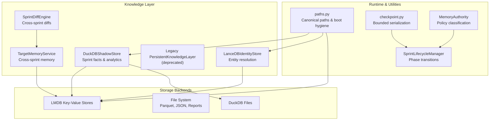
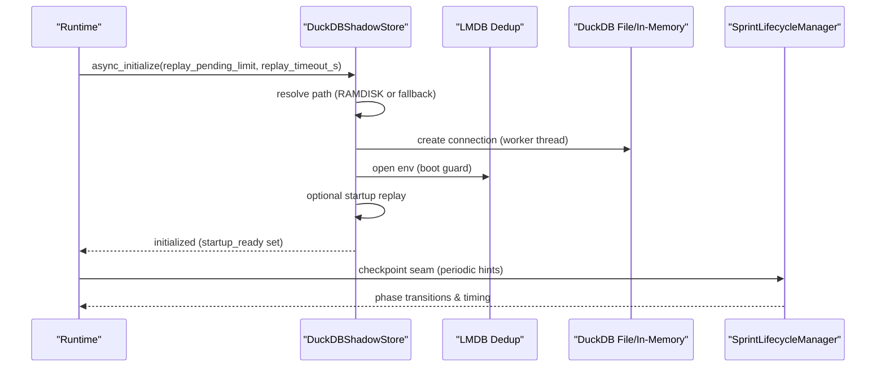
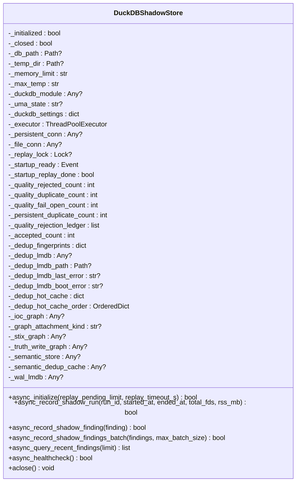
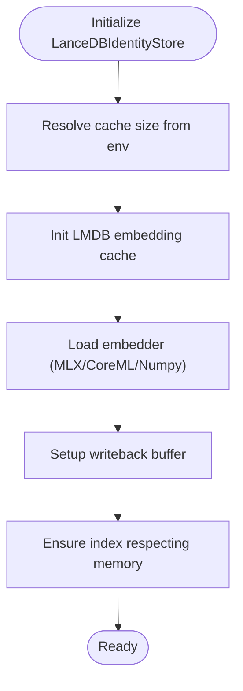
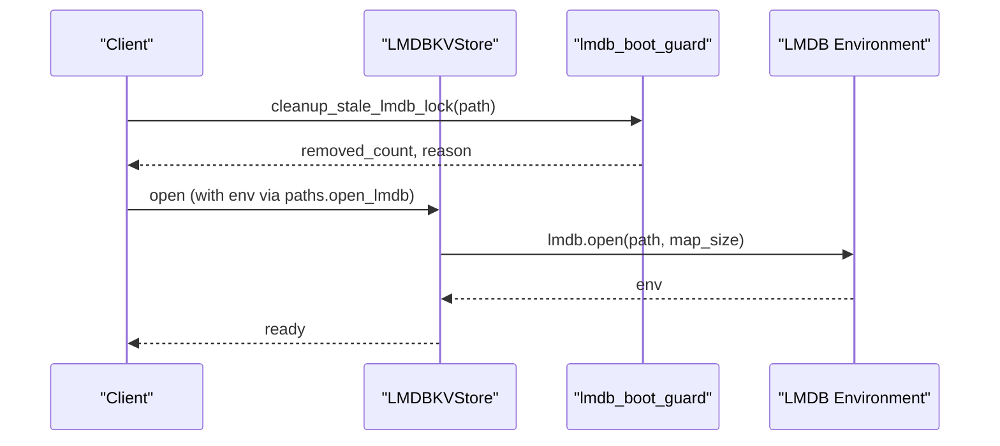
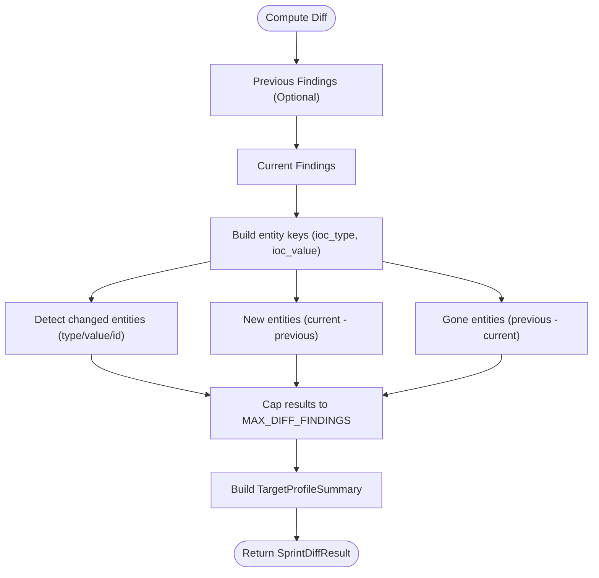
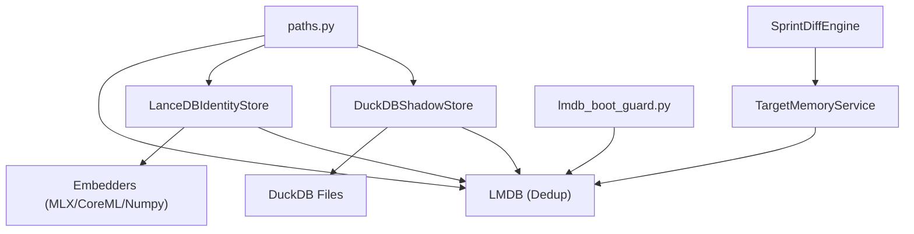

# Persistent Layer Architecture

<cite>
**Referenced Files in This Document**
- [persistent_layer.py](file://hledac/universal/knowledge/persistent_layer.py)
- [legacy/persistent_layer.py](file://hledac/universal/legacy/persistent_layer.py)
- [duckdb_store.py](file://hledac/universal/knowledge/duckdb_store.py)
- [lancedb_store.py](file://hledac/universal/knowledge/lancedb_store.py)
- [lmdb_kv.py](file://hledac/universal/tools/lmdb_kv.py)
- [lmdb_boot_guard.py](file://hledac/universal/knowledge/lmdb_boot_guard.py)
- [paths.py](file://hledac/universal/paths.py)
- [target_memory.py](file://hledac/universal/knowledge/target_memory.py)
- [sprint_diff_engine.py](file://hledac/universal/knowledge/sprint_diff_engine.py)
- [checkpoint.py](file://hledac/universal/tools/checkpoint.py)
- [sprint_lifecycle.py](file://hledac/universal/runtime/sprint_lifecycle.py)
- [memory_authority.py](file://hledac/universal/runtime/memory_authority.py)
- [atomic_storage.py](file://hledac/universal/knowledge/atomic_storage.py)
- [evidence_log.py](file://hledac/universal/evidence_log.py)
</cite>

## Table of Contents
1. [Introduction](#introduction)
2. [Project Structure](#project-structure)
3. [Core Components](#core-components)
4. [Architecture Overview](#architecture-overview)
5. [Detailed Component Analysis](#detailed-component-analysis)
6. [Dependency Analysis](#dependency-analysis)
7. [Performance Considerations](#performance-considerations)
8. [Troubleshooting Guide](#troubleshooting-guide)
9. [Conclusion](#conclusion)

## Introduction
This document describes the persistent layer architecture responsible for cross-sprint data persistence and state management. It covers design principles for data lifecycle management, state serialization, cross-sprint data continuity, and integration with multiple storage backends (DuckDB, LMDB, file systems). It also documents the state management system including checkpointing, data migration, and backup/restore operations, along with configuration options for persistence strategies, retention policies, and storage optimization. Finally, it explains the relationship with the broader knowledge management system and the role of the persistent layer in maintaining research continuity across multiple sprints.

## Project Structure
The persistent layer spans several modules within the knowledge and runtime domains:
- DuckDB-backed canonical stores for sprint-level facts and analytics
- LMDB-based key-value stores for ephemeral and persistent state
- Legacy graph storage (deprecated) for historical continuity
- Cross-sprint memory services for target profiles and diffs
- Path management and boot hygiene utilities for safe storage initialization
- Lifecycle and checkpointing utilities for recovery and resumption

**Diagram sources**
- [duckdb_store.py:643-791](file://hledac/universal/knowledge/duckdb_store.py#L643-L791)
- [lancedb_store.py:113-231](file://hledac/universal/knowledge/lancedb_store.py#L113-L231)
- [legacy/persistent_layer.py:674-762](file://hledac/universal/legacy/persistent_layer.py#L674-L762)
- [target_memory.py:56-346](file://hledac/universal/knowledge/target_memory.py#L56-L346)
- [sprint_diff_engine.py:59-339](file://hledac/universal/knowledge/sprint_diff_engine.py#L59-L339)
- [paths.py:1-591](file://hledac/universal/paths.py#L1-L591)
- [checkpoint.py:1-87](file://hledac/universal/tools/checkpoint.py#L1-L87)
- [sprint_lifecycle.py:55-216](file://hledac/universal/runtime/sprint_lifecycle.py#L55-L216)
- [memory_authority.py:35-129](file://hledac/universal/runtime/memory_authority.py#L35-L129)

**Section sources**
- [duckdb_store.py:1-800](file://hledac/universal/knowledge/duckdb_store.py#L1-L800)
- [lancedb_store.py:1-800](file://hledac/universal/knowledge/lancedb_store.py#L1-L800)
- [paths.py:1-591](file://hledac/universal/paths.py#L1-L591)

## Core Components
- DuckDBShadowStore: Async-safe DuckDB sidecar with RAMDISK-first and degraded mode, providing canonical storage for sprint-level facts and analytics. It manages persistent deduplication with LMDB, quality gates, and replay mechanisms for WAL desynchronization.
- LanceDBIdentityStore: Entity resolution store with hybrid search, embedding cache, and memory-aware operations for M1 8GB constraints.
- LMDB Key-Value Stores: Bounded, zero-copy KV stores for ephemeral and persistent state with async support and boot hygiene.
- TargetMemoryService: Bounded cross-sprint memory with RAM guard and drift reasoning for target profiles.
- SprintDiffEngine: Pure-python cross-sprint diff and target profiling logic.
- Path Management: Canonical path resolution, LMDB boot guard, and safe initialization routines.
- Lifecycle & Checkpointing: Sprint lifecycle state machine and bounded checkpoint utilities for recovery.

**Section sources**
- [duckdb_store.py:643-791](file://hledac/universal/knowledge/duckdb_store.py#L643-L791)
- [lancedb_store.py:113-231](file://hledac/universal/knowledge/lancedb_store.py#L113-L231)
- [lmdb_kv.py:55-257](file://hledac/universal/tools/lmdb_kv.py#L55-L257)
- [target_memory.py:56-346](file://hledac/universal/knowledge/target_memory.py#L56-L346)
- [sprint_diff_engine.py:59-339](file://hledac/universal/knowledge/sprint_diff_engine.py#L59-L339)
- [paths.py:174-256](file://hledac/universal/paths.py#L174-L256)
- [checkpoint.py:1-87](file://hledac/universal/tools/checkpoint.py#L1-L87)

## Architecture Overview
The persistent layer follows a layered design:
- Abstraction: DuckDBShadowStore and LanceDBIdentityStore provide unified async APIs for analytics and entity resolution.
- Storage Backends: DuckDB for durable analytics, LMDB for bounded KV operations, and file system for artifacts and reports.
- Cross-Sprint Continuity: TargetMemoryService and SprintDiffEngine maintain continuity across sprints with bounded memory and deterministic diffs.
- Boot Hygiene: paths.py and lmdb_boot_guard.py ensure safe initialization and lock recovery.
- Recovery: checkpoint utilities and lifecycle manager enable recovery and resumption.

**Diagram sources**
- [duckdb_store.py:2420-2461](file://hledac/universal/knowledge/duckdb_store.py#L2420-L2461)
- [paths.py:207-256](file://hledac/universal/paths.py#L207-L256)
- [sprint_lifecycle.py:55-216](file://hledac/universal/runtime/sprint_lifecycle.py#L55-L216)

**Section sources**
- [duckdb_store.py:643-791](file://hledac/universal/knowledge/duckdb_store.py#L643-L791)
- [paths.py:174-256](file://hledac/universal/paths.py#L174-L256)
- [sprint_lifecycle.py:55-216](file://hledac/universal/runtime/sprint_lifecycle.py#L55-L216)

## Detailed Component Analysis

### DuckDBShadowStore
- Purpose: Canonical store for sprint-level facts and derived analytics with async-safe operations.
- Design Principles:
  - Deferred DuckDB import and lazy initialization.
  - RAMDISK-first mode with fallback to in-memory with persistent connection.
  - Single-worker ThreadPoolExecutor with thread-affine connections.
  - Persistent deduplication with LMDB and hot-cache.
  - Quality gates with entropy and duplicate detection.
  - Startup replay barrier for WAL-DuckDB desync recovery.
- Async API Surface: async_initialize, async_record_shadow_run, async_record_shadow_finding, async_record_shadow_findings_batch, async_query_recent_findings, async_healthcheck, aclose.
- Configuration Options:
  - GHOST_DUCKDB_MEMORY and GHOST_DUCKDB_MAX_TEMP environment variables.
  - UMA-aware runtime settings resolution.
  - Batch sizing (max_batch_size=500) and thread pool tuning.

**Diagram sources**
- [duckdb_store.py:643-791](file://hledac/universal/knowledge/duckdb_store.py#L643-L791)

**Section sources**
- [duckdb_store.py:1-800](file://hledac/universal/knowledge/duckdb_store.py#L1-L800)
- [duckdb_store.py:2420-2461](file://hledac/universal/knowledge/duckdb_store.py#L2420-L2461)

### LanceDBIdentityStore
- Purpose: Entity resolution with hybrid vector + FTS search, bounded storage, and memory-aware operations.
- Design Principles:
  - Bounded cache with float16 quantization and eviction.
  - Writeback buffer with async flushing.
  - MLX acceleration with fallback to numpy.
  - Binary embeddings for fast prefiltering.
  - Adaptive reranking and diversity filtering.
- Configuration Options:
  - HLEDAC_LANCEDB_CACHE_MB environment variable with hard cap.
  - M1-safe defaults and large override guard.

**Diagram sources**
- [lancedb_store.py:113-231](file://hledac/universal/knowledge/lancedb_store.py#L113-L231)

**Section sources**
- [lancedb_store.py:1-800](file://hledac/universal/knowledge/lancedb_store.py#L1-L800)

### LMDB Key-Value Stores
- LMDBKVStore: Zero-copy KV store with orjson serialization, bounded storage, and async support via ThreadPoolExecutor.
- AsyncLMDBKVStore: Optional aiolmdb-backed async store with fallback to synchronous operations.
- Boot Guard: Strict stale-lock detection and safe cleanup before LMDB open.

**Diagram sources**
- [lmdb_kv.py:55-257](file://hledac/universal/tools/lmdb_kv.py#L55-L257)
- [lmdb_boot_guard.py:167-224](file://hledac/universal/knowledge/lmdb_boot_guard.py#L167-L224)
- [paths.py:207-256](file://hledac/universal/paths.py#L207-L256)

**Section sources**
- [lmdb_kv.py:1-361](file://hledac/universal/tools/lmdb_kv.py#L1-L361)
- [lmdb_boot_guard.py:1-224](file://hledac/universal/knowledge/lmdb_boot_guard.py#L1-L224)
- [paths.py:174-256](file://hledac/universal/paths.py#L174-L256)

### Cross-Sprint Memory and Diff
- TargetMemoryService: Bounded cross-sprint memory with RAM guard, drift reasoning, and JSON size bounds.
- SprintDiffEngine: Pure-python diff logic computing new/disappeared/changed entities and building target profiles with velocity and entity summaries.

**Diagram sources**
- [sprint_diff_engine.py:64-171](file://hledac/universal/knowledge/sprint_diff_engine.py#L64-L171)
- [target_memory.py:246-332](file://hledac/universal/knowledge/target_memory.py#L246-L332)

**Section sources**
- [target_memory.py:1-346](file://hledac/universal/knowledge/target_memory.py#L1-L346)
- [sprint_diff_engine.py:1-339](file://hledac/universal/knowledge/sprint_diff_engine.py#L1-L339)

### Path Management and Boot Hygiene
- Canonical path resolution with RAMDISK selection, fallback, and XDG-style runtime directories.
- LMDB boot guard with strict stale-lock detection and single-retry recovery.
- Safe initialization helpers for LMDB and socket cleanup.

**Section sources**
- [paths.py:1-591](file://hledac/universal/paths.py#L1-L591)
- [lmdb_boot_guard.py:1-224](file://hledac/universal/knowledge/lmdb_boot_guard.py#L1-L224)

### Legacy Persistent Layer
- Deprecated legacy graph storage using KuzuDB and JSON fallback, with temporal metadata rings and ring-buffer management.
- Provides compatibility wrappers for cached context and cache type enumeration.

**Section sources**
- [legacy/persistent_layer.py:1-800](file://hledac/universal/legacy/persistent_layer.py#L1-L800)
- [persistent_layer.py:1-26](file://hledac/universal/knowledge/persistent_layer.py#L1-L26)

## Dependency Analysis
The persistent layer exhibits clear separation of concerns:
- DuckDBShadowStore depends on DuckDB (deferred import), LMDB for dedup, and async execution model.
- LanceDBIdentityStore depends on LMDB for embedding cache, optional MLX/CoreML/Numpy embedders, and memory budgeting.
- Cross-sprint services depend on bounded memory and deterministic diff logic.
- Path management and boot guard provide foundational reliability for storage initialization.

**Diagram sources**
- [duckdb_store.py:643-791](file://hledac/universal/knowledge/duckdb_store.py#L643-L791)
- [lancedb_store.py:113-231](file://hledac/universal/knowledge/lancedb_store.py#L113-L231)
- [target_memory.py:56-346](file://hledac/universal/knowledge/target_memory.py#L56-L346)
- [sprint_diff_engine.py:59-339](file://hledac/universal/knowledge/sprint_diff_engine.py#L59-L339)
- [paths.py:174-256](file://hledac/universal/paths.py#L174-L256)
- [lmdb_boot_guard.py:167-224](file://hledac/universal/knowledge/lmdb_boot_guard.py#L167-L224)

**Section sources**
- [duckdb_store.py:1-800](file://hledac/universal/knowledge/duckdb_store.py#L1-L800)
- [lancedb_store.py:1-800](file://hledac/universal/knowledge/lancedb_store.py#L1-L800)
- [target_memory.py:1-346](file://hledac/universal/knowledge/target_memory.py#L1-L346)
- [sprint_diff_engine.py:1-339](file://hledac/universal/knowledge/sprint_diff_engine.py#L1-L339)
- [paths.py:1-591](file://hledac/universal/paths.py#L1-L591)
- [lmdb_boot_guard.py:1-224](file://hledac/universal/knowledge/lmdb_boot_guard.py#L1-L224)

## Performance Considerations
- DuckDB runtime settings are UMA-aware with conservative defaults for M1 8GB UMA to minimize memory footprint.
- LMDB cache sizes are configurable and bounded to prevent unbounded growth; eviction and writeback buffers mitigate memory pressure.
- LanceDB uses float16 quantization and binary embeddings for fast prefiltering; adaptive index building respects available memory.
- Async execution model avoids blocking the event loop; single-worker thread affinity for DuckDB connections.
- Bounded collections and size limits in checkpointing and cross-sprint memory prevent DoS vectors.

[No sources needed since this section provides general guidance]

## Troubleshooting Guide
Common issues and remedies:
- DuckDB LockError or startup replay failures: Use async_initialize with bounded replay parameters; ensure boot guard cleanup succeeds.
- LMDB stale locks: Use lmdb_boot_guard to detect and safely remove stale locks; confirm process liveness before cleanup.
- Memory pressure during embedding: LanceDB and TargetMemoryService include RAM guards; reduce cache sizes or disable accelerators.
- Recovery and resumption: Use checkpoint utilities and lifecycle manager to serialize state and resume from checkpoints.

**Section sources**
- [duckdb_store.py:2420-2461](file://hledac/universal/knowledge/duckdb_store.py#L2420-L2461)
- [lmdb_boot_guard.py:167-224](file://hledac/universal/knowledge/lmdb_boot_guard.py#L167-L224)
- [checkpoint.py:1-87](file://hledac/universal/tools/checkpoint.py#L1-L87)
- [sprint_lifecycle.py:55-216](file://hledac/universal/runtime/sprint_lifecycle.py#L55-L216)

## Conclusion
The persistent layer architecture provides a robust, memory-conscious foundation for cross-sprint data persistence and state management. By integrating DuckDB, LMDB, and file-system storage with careful boot hygiene, async execution, and bounded memory usage, it ensures continuity, reliability, and performance across research sprints. The design balances durability and speed while offering clear recovery and migration pathways through checkpointing, replay, and canonical path management.