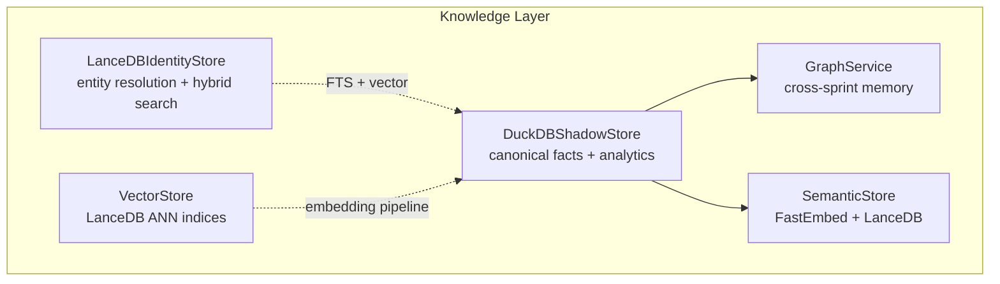
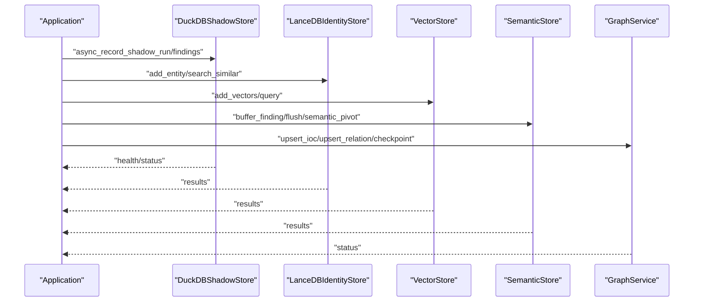
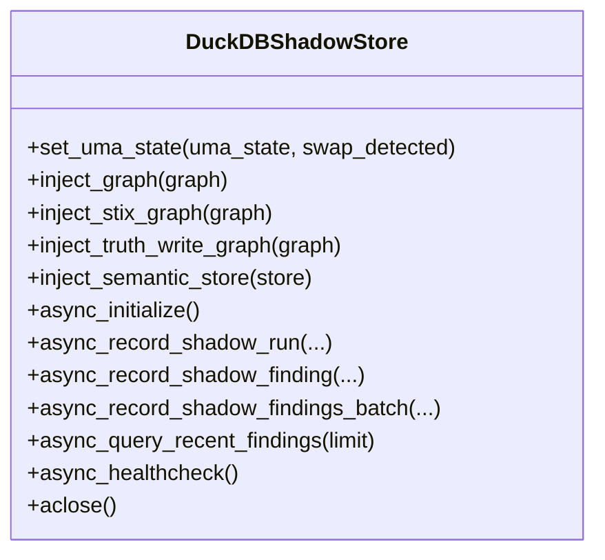
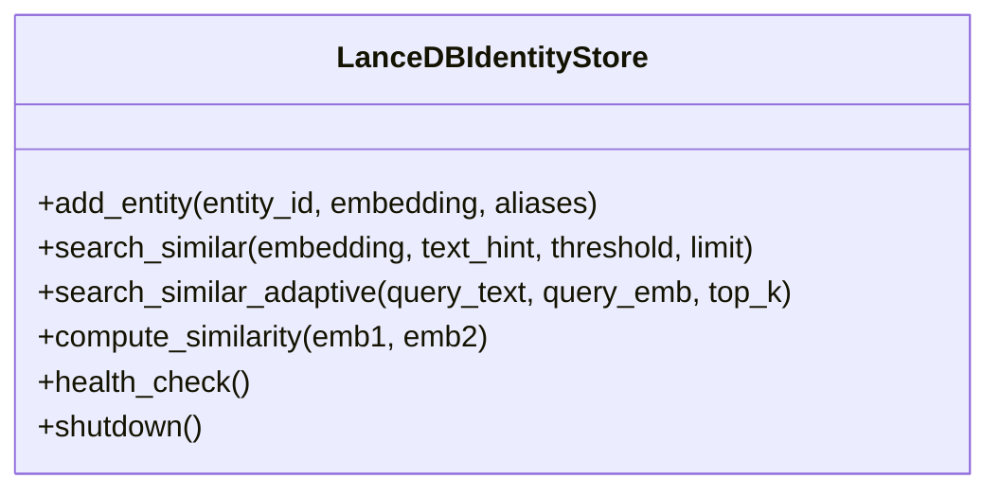
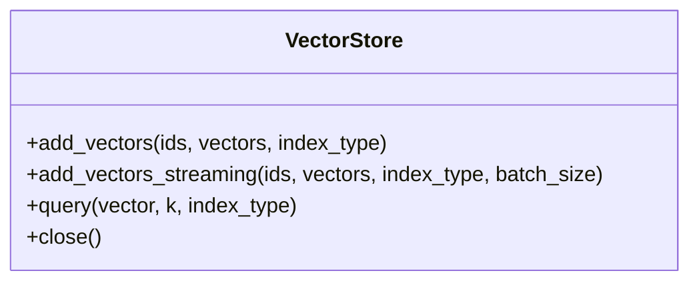
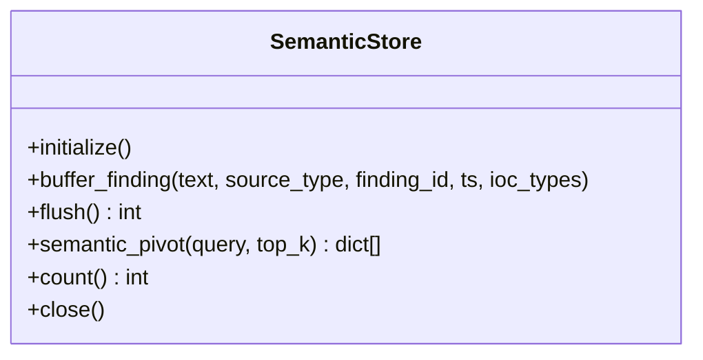
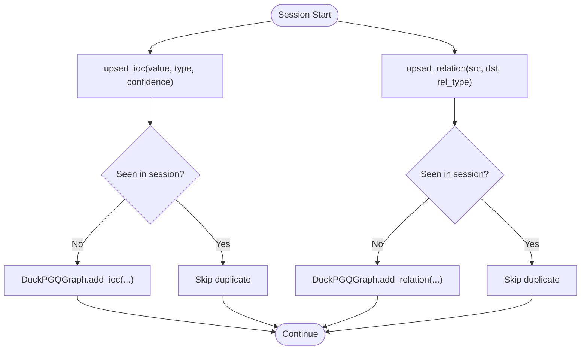
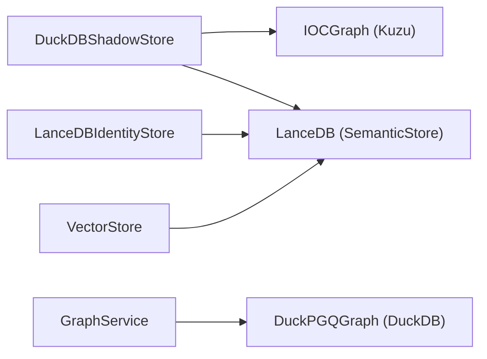

# Storage Backends

<cite>
**Referenced Files in This Document**
- [duckdb_store.py](file://hledac/universal/knowledge/duckdb_store.py)
- [lancedb_store.py](file://hledac/universal/knowledge/lancedb_store.py)
- [vector_store.py](file://hledac/universal/knowledge/vector_store.py)
- [semantic_store.py](file://hledac/universal/knowledge/semantic_store.py)
- [atomic_storage.py](file://hledac/universal/knowledge/atomic_storage.py)
- [persistent_layer.py](file://hledac/universal/knowledge/persistent_layer.py)
- [graph_service.py](file://hledac/universal/knowledge/graph_service.py)
</cite>

## Table of Contents
1. [Introduction](#introduction)
2. [Project Structure](#project-structure)
3. [Core Components](#core-components)
4. [Architecture Overview](#architecture-overview)
5. [Detailed Component Analysis](#detailed-component-analysis)
6. [Dependency Analysis](#dependency-analysis)
7. [Performance Considerations](#performance-considerations)
8. [Troubleshooting Guide](#troubleshooting-guide)
9. [Conclusion](#conclusion)
10. [Appendices](#appendices)

## Introduction
This document describes the storage backends used by Hledac Universal’s knowledge layer. It focuses on:
- DuckDB-based persistent storage for canonical sprint facts and analytics
- LanceDB-backed vector stores for semantic search and identity resolution
- Atomic storage mechanisms for high-throughput writes
- Cross-sprint persistence and graph memory services
- Configuration, performance tuning, and migration guidance

The goal is to help both developers and operators understand how data is structured, indexed, queried, and maintained across backends, and how to operate them safely under memory-constrained environments.

## Project Structure
The storage backends are implemented as cohesive modules within the knowledge package:
- DuckDB-backed canonical store for sprint-level facts and analytics
- LanceDB-backed identity store for entity resolution and hybrid search
- LanceDB-backed vector store for embedding-driven retrieval
- Semantic store for batch embedding and ANN search of findings
- Legacy atomic storage and persistent layer modules (deprecated)
- Graph service for cross-sprint entity memory and DuckDB graph integration

**Diagram sources**
- [duckdb_store.py](file://hledac/universal/knowledge/duckdb_store.py)
- [lancedb_store.py](file://hledac/universal/knowledge/lancedb_store.py)
- [vector_store.py](file://hledac/universal/knowledge/vector_store.py)
- [semantic_store.py](file://hledac/universal/knowledge/semantic_store.py)
- [graph_service.py](file://hledac/universal/knowledge/graph_service.py)

**Section sources**
- [duckdb_store.py](file://hledac/universal/knowledge/duckdb_store.py)
- [lancedb_store.py](file://hledac/universal/knowledge/lancedb_store.py)
- [vector_store.py](file://hledac/universal/knowledge/vector_store.py)
- [semantic_store.py](file://hledac/universal/knowledge/semantic_store.py)
- [graph_service.py](file://hledac/universal/knowledge/graph_service.py)

## Core Components
- DuckDBShadowStore: Canonical, durable store for sprint facts, shadow findings, and analytics tables. Supports UMA-aware runtime settings, thread-affine operations, and graph/semantic integrations.
- LanceDBIdentityStore: Entity identity store with hybrid search (vector + FTS), embedding cache, and adaptive reranking.
- VectorStore: Singleton LanceDB-backed vector store with separate text and image indices, streaming batch ingestion, and cosine similarity queries.
- SemanticStore: Batch embedding and ANN search of findings using FastEmbed and LanceDB.
- GraphService: Cross-sprint memory backed by DuckPGQGraph (DuckDB), providing idempotent upserts and bounded analytics.

**Section sources**
- [duckdb_store.py](file://hledac/universal/knowledge/duckdb_store.py)
- [lancedb_store.py](file://hledac/universal/knowledge/lancedb_store.py)
- [vector_store.py](file://hledac/universal/knowledge/vector_store.py)
- [semantic_store.py](file://hledac/universal/knowledge/semantic_store.py)
- [graph_service.py](file://hledac/universal/knowledge/graph_service.py)

## Architecture Overview
The storage architecture separates concerns:
- Canonical facts and analytics: DuckDBShadowStore
- Entity resolution and hybrid search: LanceDBIdentityStore
- General-purpose vector search: VectorStore
- Finding embeddings and semantic pivots: SemanticStore
- Cross-sprint entity memory: GraphService

**Diagram sources**
- [duckdb_store.py](file://hledac/universal/knowledge/duckdb_store.py)
- [lancedb_store.py](file://hledac/universal/knowledge/lancedb_store.py)
- [vector_store.py](file://hledac/universal/knowledge/vector_store.py)
- [semantic_store.py](file://hledac/universal/knowledge/semantic_store.py)
- [graph_service.py](file://hledac/universal/knowledge/graph_service.py)

## Detailed Component Analysis

### DuckDBShadowStore
- Purpose: Canonical store for sprint-level facts, shadow findings, and analytics tables.
- Modes:
  - File mode: persistent database with temp directory on RAMDISK for spill
  - Memory mode: in-memory with a single persistent connection
- UMA-aware runtime: dynamically adjusts memory limit, threads, and safe mode based on system pressure.
- Async API: all public methods run in a single-thread worker via run_in_executor.
- Schema: includes tables for shadow findings, runs, sprint deltas, scorecards, episodes, targets, hypotheses, and target memory.
- Graph integration: supports injecting IOCGraph (Kuzu) and STIX graphs for truth and synthesis contexts.
- Quality gating: in-memory and persistent deduplication, quality decision ledger, and replay mechanisms.

**Diagram sources**
- [duckdb_store.py](file://hledac/universal/knowledge/duckdb_store.py)

**Section sources**
- [duckdb_store.py](file://hledac/universal/knowledge/duckdb_store.py)

### LanceDBIdentityStore
- Purpose: Entity identity store with hybrid vector + FTS search.
- Features:
  - Embedding cache with LMDB (float16 quantization), writeback buffer, and eviction.
  - Adaptive reranking (ColBERT, FlashRank, MLX).
  - Binary prefilter for fast candidate screening.
  - MMR diversity filtering.
  - Memory-aware index creation and maintenance.
- Embedding pipeline: supports MLXEmbeddingManager, CoreML, and numpy fallback.
- Health checks and telemetry for cache usage and eviction.

**Diagram sources**
- [lancedb_store.py](file://hledac/universal/knowledge/lancedb_store.py)

**Section sources**
- [lancedb_store.py](file://hledac/universal/knowledge/lancedb_store.py)

### VectorStore
- Purpose: Primary LanceDB-backed vector storage for embedding pipeline.
- Indices: separate tables for text (256d MRL) and image (1024d) embeddings.
- Streaming ingestion: chunked adds with yields to reduce peak memory.
- Query: cosine similarity search via LanceDB.

**Diagram sources**
- [vector_store.py](file://hledac/universal/knowledge/vector_store.py)

**Section sources**
- [vector_store.py](file://hledac/universal/knowledge/vector_store.py)

### SemanticStore
- Purpose: Batch embedding and ANN search of findings for semantic pivots.
- Lifecycle: initialize (load FastEmbed model, open LanceDB), buffer findings, flush (batch embed + LanceDB append), semantic_pivot (ANN search), close.
- Bounded buffer: prevents unbounded growth under memory pressure.

**Diagram sources**
- [semantic_store.py](file://hledac/universal/knowledge/semantic_store.py)

**Section sources**
- [semantic_store.py](file://hledac/universal/knowledge/semantic_store.py)

### GraphService
- Purpose: Cross-sprint entity memory backed by DuckPGQGraph (DuckDB).
- Operations: idempotent upserts for IOCs and relations, history lookup, graph stats, checkpoint, and bounded analytics summary.

**Diagram sources**
- [graph_service.py](file://hledac/universal/knowledge/graph_service.py)

**Section sources**
- [graph_service.py](file://hledac/universal/knowledge/graph_service.py)

### Legacy Atomic Storage and Persistent Layer
- AtomicJSONKnowledgeGraph: deprecated JSON-based knowledge graph with sharding and LMDB fallback.
- PersistentKnowledgeLayer: deprecated KuzuDB + Model2Vec layer with HNSW/PQ indices and multi-level context cache.

These modules are marked deprecated and superseded by DuckDBShadowStore and related components.

**Section sources**
- [atomic_storage.py](file://hledac/universal/knowledge/atomic_storage.py)
- [persistent_layer.py](file://hledac/universal/knowledge/persistent_layer.py)

## Dependency Analysis
- DuckDBShadowStore depends on DuckDB (imported lazily), integrates with IOCGraph (Kuzu) for truth writes, and coordinates with SemanticStore for finding embeddings.
- LanceDBIdentityStore depends on LanceDB, optional FTS, and embedders (MLX/CoreML/numpy fallback).
- VectorStore depends on LanceDB and PyArrow for schema and data conversion.
- SemanticStore depends on FastEmbed and LanceDB for embeddings and ANN search.
- GraphService depends on DuckPGQGraph (DuckDB) for cross-sprint entity memory.

**Diagram sources**
- [duckdb_store.py](file://hledac/universal/knowledge/duckdb_store.py)
- [lancedb_store.py](file://hledac/universal/knowledge/lancedb_store.py)
- [vector_store.py](file://hledac/universal/knowledge/vector_store.py)
- [semantic_store.py](file://hledac/universal/knowledge/semantic_store.py)
- [graph_service.py](file://hledac/universal/knowledge/graph_service.py)

**Section sources**
- [duckdb_store.py](file://hledac/universal/knowledge/duckdb_store.py)
- [lancedb_store.py](file://hledac/universal/knowledge/lancedb_store.py)
- [vector_store.py](file://hledac/universal/knowledge/vector_store.py)
- [semantic_store.py](file://hledac/universal/knowledge/semantic_store.py)
- [graph_service.py](file://hledac/universal/knowledge/graph_service.py)

## Performance Considerations
- DuckDB runtime tuning:
  - Environment variables for memory and temp limits
  - UMA-aware settings adjust threads and safe mode under memory pressure
  - Preserve insertion order disabled to reduce overhead
- LanceDB cache:
  - LMDB-backed embedding cache with float16 quantization and writeback buffer
  - Eviction threshold and periodic maintenance to prevent map exhaustion
  - Adaptive reranking and binary prefilter to reduce latency
- Vector ingestion:
  - Streaming batch adds to reduce peak RSS during embedding phases
  - Separate indices for text and image embeddings
- Cross-sprint memory:
  - In-memory idempotency sets prevent duplicate upserts within a sprint
  - DuckPGQGraph checkpoint to persist WAL periodically

[No sources needed since this section provides general guidance]

## Troubleshooting Guide
- DuckDBShadowStore
  - Health checks and replay controls for pending sync markers
  - UMA state updates to adjust runtime settings dynamically
  - Schema migrations for backward compatibility
- LanceDBIdentityStore
  - Health checks for embedder, cache, and index readiness
  - Cache telemetry and eviction logs
  - Graceful fallbacks when FTS is unavailable
- VectorStore
  - Dimension mismatches and invalid index types
  - Lazy initialization failures and missing LanceDB installation
- SemanticStore
  - Pending buffer caps and dropped items under pressure
  - Model loading and table creation errors
- GraphService
  - DuckPGQGraph initialization failures and session-level idempotency resets

**Section sources**
- [duckdb_store.py](file://hledac/universal/knowledge/duckdb_store.py)
- [lancedb_store.py](file://hledac/universal/knowledge/lancedb_store.py)
- [vector_store.py](file://hledac/universal/knowledge/vector_store.py)
- [semantic_store.py](file://hledac/universal/knowledge/semantic_store.py)
- [graph_service.py](file://hledac/universal/knowledge/graph_service.py)

## Conclusion
Hledac Universal employs a layered storage strategy:
- DuckDBShadowStore for canonical, durable analytics
- LanceDB for entity resolution and general vector search
- Dedicated vector and semantic stores for embedding pipelines
- DuckPGQGraph-backed GraphService for cross-sprint entity memory

This design balances performance, memory efficiency, and operational safety across constrained environments.

[No sources needed since this section summarizes without analyzing specific files]

## Appendices

### Configuration Options and Environment Variables
- DuckDBShadowStore
  - GHOST_DUCKDB_MEMORY: memory limit for DuckDB
  - GHOST_DUCKDB_MAX_TEMP: max temp directory size
  - UMA state: WARN/CRITICAL/EMERGENCY to adjust runtime settings
- LanceDBIdentityStore
  - HLEDAC_LANCEDB_CACHE_MB: embedding cache size in MB
  - HLEDAC_ALLOW_LARGE_LANCEDB_CACHE: enable larger cache override
- VectorStore
  - LanceDB root directory under user home for text and image indices
- SemanticStore
  - LanceDB path under user home for findings table

**Section sources**
- [duckdb_store.py](file://hledac/universal/knowledge/duckdb_store.py)
- [lancedb_store.py](file://hledac/universal/knowledge/lancedb_store.py)
- [vector_store.py](file://hledac/universal/knowledge/vector_store.py)
- [semantic_store.py](file://hledac/universal/knowledge/semantic_store.py)

### Example Workflows

- DuckDB initialization and ingestion
  - Initialize store, record runs and findings, query recent findings, and health-check
  - Paths: [DuckDBShadowStore.async_initialize](file://hledac/universal/knowledge/duckdb_store.py), [DuckDBShadowStore.async_record_shadow_run](file://hledac/universal/knowledge/duckdb_store.py), [DuckDBShadowStore.async_record_shadow_findings_batch](file://hledac/universal/knowledge/duckdb_store.py), [DuckDBShadowStore.async_query_recent_findings](file://hledac/universal/knowledge/duckdb_store.py), [DuckDBShadowStore.async_healthcheck](file://hledac/universal/knowledge/duckdb_store.py)

- LanceDB identity store
  - Add entity, search similar with hybrid or vector-only depending on FTS availability, compute similarity
  - Paths: [LanceDBIdentityStore.add_entity](file://hledac/universal/knowledge/lancedb_store.py), [LanceDBIdentityStore.search_similar](file://hledac/universal/knowledge/lancedb_store.py), [LanceDBIdentityStore.compute_similarity](file://hledac/universal/knowledge/lancedb_store.py)

- Vector store
  - Add vectors to text or image index, stream large batches, query with cosine similarity
  - Paths: [VectorStore.add_vectors](file://hledac/universal/knowledge/vector_store.py), [VectorStore.add_vectors_streaming](file://hledac/universal/knowledge/vector_store.py), [VectorStore.query](file://hledac/universal/knowledge/vector_store.py)

- Semantic store
  - Buffer findings, flush to LanceDB, perform semantic pivot search
  - Paths: [SemanticStore.buffer_finding](file://hledac/universal/knowledge/semantic_store.py), [SemanticStore.flush](file://hledac/universal/knowledge/semantic_store.py), [SemanticStore.semantic_pivot](file://hledac/universal/knowledge/semantic_store.py)

- Graph service
  - Upsert IOCs and relations idempotently, query history, checkpoint, and reset session
  - Paths: [GraphService.upsert_ioc](file://hledac/universal/knowledge/graph_service.py), [GraphService.upsert_relation](file://hledac/universal/knowledge/graph_service.py), [GraphService.find_entity_history](file://hledac/universal/knowledge/graph_service.py), [GraphService.checkpoint](file://hledac/universal/knowledge/graph_service.py), [GraphService.reset_session](file://hledac/universal/knowledge/graph_service.py)

### Migration Procedures
- From legacy atomic storage to DuckDBShadowStore
  - Replace AtomicJSONKnowledgeGraph usage with DuckDBShadowStore
  - Migrate JSON shards to DuckDB tables via schema and replay mechanisms
  - Validate schema migrations and quality gates remain intact
  - Paths: [atomic_storage.py](file://hledac/universal/knowledge/atomic_storage.py), [duckdb_store.py](file://hledac/universal/knowledge/duckdb_store.py)

- From legacy persistent layer to DuckDBShadowStore + GraphService
  - Replace KuzuDB + Model2Vec with DuckDBShadowStore for canonical facts
  - Use GraphService for cross-sprint entity memory backed by DuckPGQGraph
  - Retain LanceDB for identity and vector needs
  - Paths: [persistent_layer.py](file://hledac/universal/knowledge/persistent_layer.py), [graph_service.py](file://hledac/universal/knowledge/graph_service.py)

**Section sources**
- [atomic_storage.py](file://hledac/universal/knowledge/atomic_storage.py)
- [persistent_layer.py](file://hledac/universal/knowledge/persistent_layer.py)
- [duckdb_store.py](file://hledac/universal/knowledge/duckdb_store.py)
- [graph_service.py](file://hledac/universal/knowledge/graph_service.py)