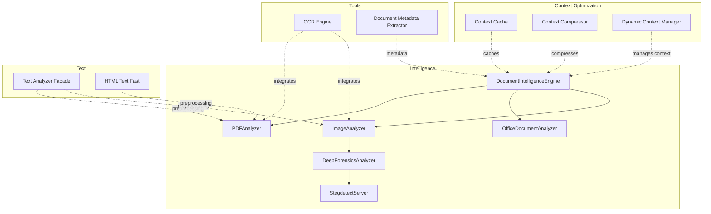
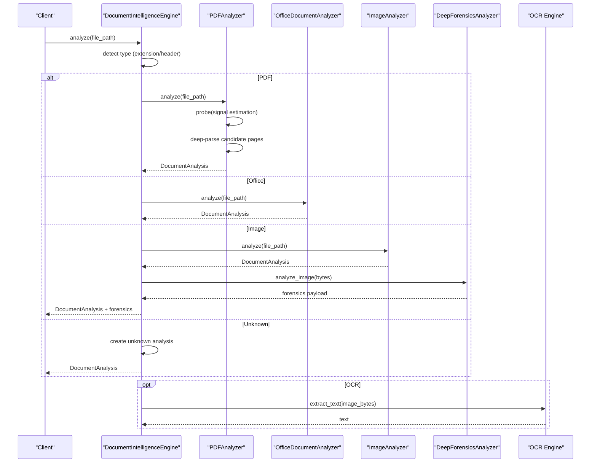
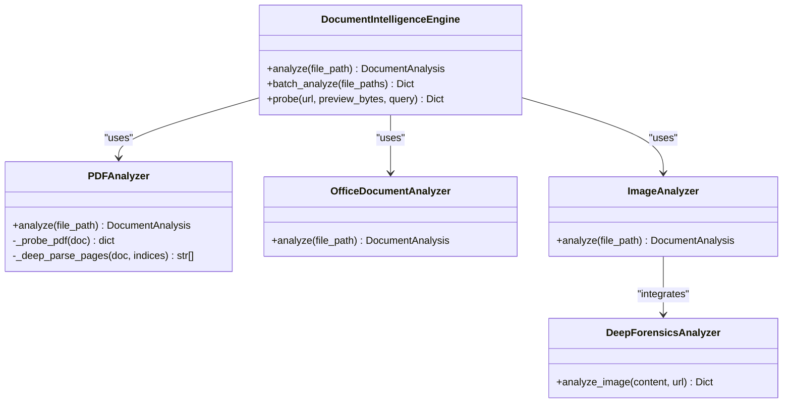
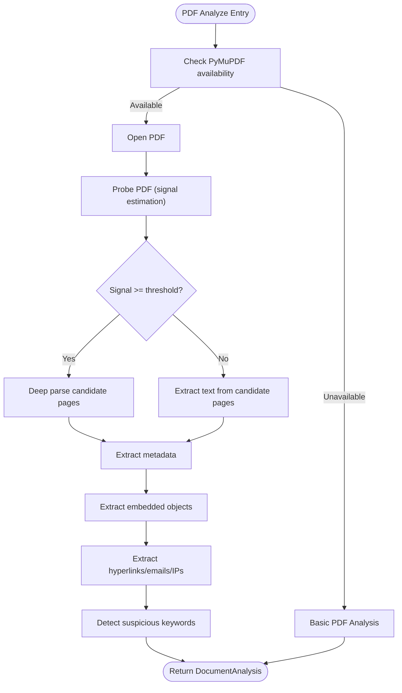
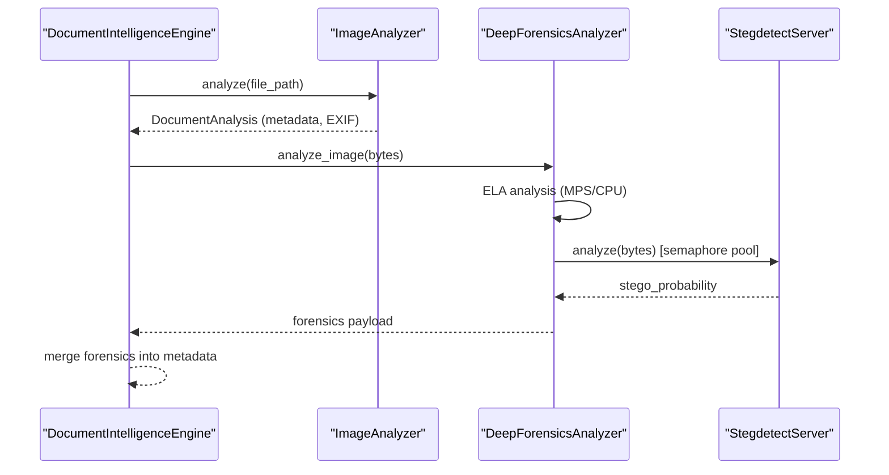
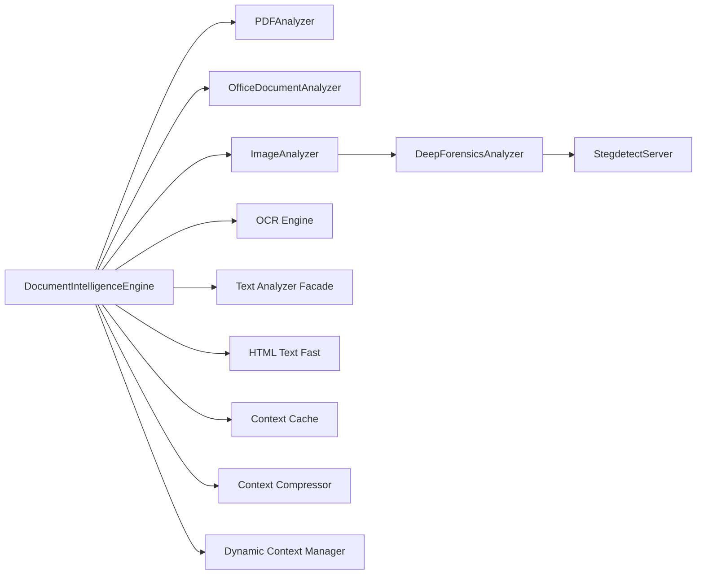

# Document Extraction

<cite>
**Referenced Files in This Document**
- [document_intelligence.py](file://hledac/universal/intelligence/document_intelligence.py)
- [ocr_engine.py](file://hledac/universal/tools/ocr_engine.py)
- [document_metadata_extractor.py](file://hledac/universal/tools/document_metadata_extractor.py)
- [text_analyzer_facade.py](file://hledac/universal/text/text_analyzer_facade.py)
- [html_text_fast.py](file://hledac/universal/utils/html_text_fast.py)
- [context_cache.py](file://hledac/universal/context_optimization/context_cache.py)
- [context_compressor.py](file://hledac/universal/context_optimization/context_compressor.py)
- [dynamic_context_manager.py](file://hledac/universal/context_optimization/dynamic_context_manager.py)
</cite>

## Table of Contents
1. [Introduction](#introduction)
2. [Project Structure](#project-structure)
3. [Core Components](#core-components)
4. [Architecture Overview](#architecture-overview)
5. [Detailed Component Analysis](#detailed-component-analysis)
6. [Dependency Analysis](#dependency-analysis)
7. [Performance Considerations](#performance-considerations)
8. [Troubleshooting Guide](#troubleshooting-guide)
9. [Conclusion](#conclusion)
10. [Appendices](#appendices)

## Introduction
This document explains the document extraction capabilities in Hledac Universal’s multi-modal processing system. It focuses on the DocumentExtractor implementation, PDF and image text extraction workflows, OCR integration, supported file formats, extraction quality controls, memory management for large documents, the text extraction pipeline, page processing limits, payload construction, configuration options, and performance optimization strategies. It also covers accuracy validation approaches and integration patterns for different document types.

## Project Structure
The document extraction system spans several modules:
- Intelligence: Core document analysis engine and analyzers for PDF, Office, and images
- Tools: OCR engine and metadata extraction utilities
- Text: Text analysis facade and HTML text extraction helpers
- Context Optimization: Caching, compression, and dynamic context management for efficient processing

**Diagram sources**
- [document_intelligence.py:1306-1406](file://hledac/universal/intelligence/document_intelligence.py#L1306-L1406)
- [ocr_engine.py](file://hledac/universal/tools/ocr_engine.py)
- [document_metadata_extractor.py](file://hledac/universal/tools/document_metadata_extractor.py)
- [text_analyzer_facade.py](file://hledac/universal/text/text_analyzer_facade.py)
- [html_text_fast.py](file://hledac/universal/utils/html_text_fast.py)
- [context_cache.py](file://hledac/universal/context_optimization/context_cache.py)
- [context_compressor.py](file://hledac/universal/context_optimization/context_compressor.py)
- [dynamic_context_manager.py](file://hledac/universal/context_optimization/dynamic_context_manager.py)

**Section sources**
- [document_intelligence.py:1306-1406](file://hledac/universal/intelligence/document_intelligence.py#L1306-L1406)

## Core Components
- DocumentIntelligenceEngine: Unified entry point for document analysis across PDF, Office, and image formats; supports progressive parsing and optional semantic scoring
- PDFAnalyzer: Progressive PDF text extraction with signal estimation, candidate page selection, and embedded object extraction
- OfficeDocumentAnalyzer: OOXML and legacy OLE analysis for Microsoft and OpenDocument formats
- ImageAnalyzer: EXIF and GPS extraction; integrates with DeepForensicsAnalyzer for ELA and steganalysis
- DeepForensicsAnalyzer: Forensic image analysis with ELA scoring and steganography detection via StegdetectServer
- OCR Engine: Optional OCR integration for images and scanned PDFs
- Text Analyzer Facade and HTML Text Fast: Preprocessing utilities for text normalization and extraction
- Context Optimization: Caches, compressors, and dynamic context managers to reduce memory and latency

**Section sources**
- [document_intelligence.py:1306-1406](file://hledac/universal/intelligence/document_intelligence.py#L1306-L1406)
- [document_intelligence.py:259-351](file://hledac/universal/intelligence/document_intelligence.py#L259-L351)
- [document_intelligence.py:601-769](file://hledac/universal/intelligence/document_intelligence.py#L601-L769)
- [document_intelligence.py:771-955](file://hledac/universal/intelligence/document_intelligence.py#L771-L955)
- [document_intelligence.py:958-1085](file://hledac/universal/intelligence/document_intelligence.py#L958-L1085)
- [document_intelligence.py:1186-1275](file://hledac/universal/intelligence/document_intelligence.py#L1186-L1275)
- [text_analyzer_facade.py](file://hledac/universal/text/text_analyzer_facade.py)
- [html_text_fast.py](file://hledac/universal/utils/html_text_fast.py)
- [context_cache.py](file://hledac/universal/context_optimization/context_cache.py)
- [context_compressor.py](file://hledac/universal/context_optimization/context_compressor.py)
- [dynamic_context_manager.py](file://hledac/universal/context_optimization/dynamic_context_manager.py)

## Architecture Overview
The extraction pipeline follows a layered approach:
- Type detection and routing
- Progressive probing for value and content richness
- Text extraction (native APIs or OCR)
- Metadata and embedded object extraction
- Forensics for images
- Payload construction and optional semantic scoring

**Diagram sources**
- [document_intelligence.py:1320-1394](file://hledac/universal/intelligence/document_intelligence.py#L1320-L1394)
- [document_intelligence.py:278-351](file://hledac/universal/intelligence/document_intelligence.py#L278-L351)
- [document_intelligence.py:606-769](file://hledac/universal/intelligence/document_intelligence.py#L606-L769)
- [document_intelligence.py:778-955](file://hledac/universal/intelligence/document_intelligence.py#L778-L955)
- [document_intelligence.py:1032-1085](file://hledac/universal/intelligence/document_intelligence.py#L1032-L1085)

## Detailed Component Analysis

### DocumentIntelligenceEngine
- Routes analysis by file extension or magic-byte detection
- Progressive parsing: estimates signal score and selects top pages for deep parsing
- Optional semantic scoring for relevance estimation
- Forensics integration for images
- Batch analysis support

**Diagram sources**
- [document_intelligence.py:1306-1406](file://hledac/universal/intelligence/document_intelligence.py#L1306-L1406)
- [document_intelligence.py:259-351](file://hledac/universal/intelligence/document_intelligence.py#L259-L351)
- [document_intelligence.py:601-769](file://hledac/universal/intelligence/document_intelligence.py#L601-L769)
- [document_intelligence.py:771-955](file://hledac/universal/intelligence/document_intelligence.py#L771-L955)
- [document_intelligence.py:958-1085](file://hledac/universal/intelligence/document_intelligence.py#L958-L1085)

**Section sources**
- [document_intelligence.py:1320-1394](file://hledac/universal/intelligence/document_intelligence.py#L1320-L1394)
- [document_intelligence.py:1411-1461](file://hledac/universal/intelligence/document_intelligence.py#L1411-L1461)

### PDFAnalyzer
- Progressive parsing: samples pages to estimate signal score and selects top pages for deep parse
- Extracts metadata, embedded objects, hyperlinks, emails, IPs, and suspicious indicators
- Fallback to basic analysis if PyMuPDF is unavailable

**Diagram sources**
- [document_intelligence.py:278-351](file://hledac/universal/intelligence/document_intelligence.py#L278-L351)
- [document_intelligence.py:352-446](file://hledac/universal/intelligence/document_intelligence.py#L352-L446)
- [document_intelligence.py:509-551](file://hledac/universal/intelligence/document_intelligence.py#L509-L551)
- [document_intelligence.py:553-599](file://hledac/universal/intelligence/document_intelligence.py#L553-L599)

**Section sources**
- [document_intelligence.py:278-351](file://hledac/universal/intelligence/document_intelligence.py#L278-L351)
- [document_intelligence.py:352-446](file://hledac/universal/intelligence/document_intelligence.py#L352-L446)
- [document_intelligence.py:509-551](file://hledac/universal/intelligence/document_intelligence.py#L509-L551)
- [document_intelligence.py:553-599](file://hledac/universal/intelligence/document_intelligence.py#L553-L599)

### OfficeDocumentAnalyzer
- Detects OOXML vs legacy OLE formats
- Extracts core properties, comments, hyperlinks, and embedded media
- Handles ZIP-based Office formats

**Section sources**
- [document_intelligence.py:606-769](file://hledac/universal/intelligence/document_intelligence.py#L606-L769)

### ImageAnalyzer and DeepForensicsAnalyzer
- ImageAnalyzer extracts EXIF and GPS metadata
- DeepForensicsAnalyzer performs ELA analysis and steganography detection
- Uses MPS acceleration when available, with CPU fallback and GPU cache management
- StegdetectServer maintains a pool of worker processes for concurrent analysis

**Diagram sources**
- [document_intelligence.py:778-955](file://hledac/universal/intelligence/document_intelligence.py#L778-L955)
- [document_intelligence.py:1032-1085](file://hledac/universal/intelligence/document_intelligence.py#L1032-L1085)
- [document_intelligence.py:1186-1275](file://hledac/universal/intelligence/document_intelligence.py#L1186-L1275)

**Section sources**
- [document_intelligence.py:778-955](file://hledac/universal/intelligence/document_intelligence.py#L778-L955)
- [document_intelligence.py:958-1085](file://hledac/universal/intelligence/document_intelligence.py#L958-L1085)
- [document_intelligence.py:1186-1275](file://hledac/universal/intelligence/document_intelligence.py#L1186-L1275)

### OCR Integration
- OCR Engine module provides optional OCR extraction for images and scanned PDFs
- Integrates with the extraction pipeline to augment text extraction when native extraction is insufficient
- Supports asynchronous execution and process pooling for throughput

**Section sources**
- [ocr_engine.py](file://hledac/universal/tools/ocr_engine.py)

### Text Extraction Pipeline and Preprocessing
- Text Analyzer Facade normalizes and prepares text for downstream processing
- HTML Text Fast extracts clean text from HTML content
- These utilities support preprocessing before OCR or native extraction

**Section sources**
- [text_analyzer_facade.py](file://hledac/universal/text/text_analyzer_facade.py)
- [html_text_fast.py](file://hledac/universal/utils/html_text_fast.py)

### Payload Construction
- DocumentAnalysis aggregates metadata, embedded objects, hyperlinks, emails, IPs, comments, revisions, hidden text, suspicious indicators, and EXIF data
- Forensics payload is merged into raw_metadata for images

**Section sources**
- [document_intelligence.py:245-257](file://hledac/universal/intelligence/document_intelligence.py#L245-L257)
- [document_intelligence.py:1339-1362](file://hledac/universal/intelligence/document_intelligence.py#L1339-L1362)

## Dependency Analysis
Key dependencies and coupling:
- DocumentIntelligenceEngine depends on analyzers and optional forensics
- PDFAnalyzer depends on PyMuPDF; OfficeDocumentAnalyzer depends on zipfile and internal XML parsing
- ImageAnalyzer depends on Pillow; DeepForensicsAnalyzer depends on MPS/Torch and StegdetectServer
- OCR Engine is decoupled and integrated at runtime
- Context optimization modules reduce memory and improve throughput

**Diagram sources**
- [document_intelligence.py:1306-1406](file://hledac/universal/intelligence/document_intelligence.py#L1306-L1406)
- [document_intelligence.py:958-1085](file://hledac/universal/intelligence/document_intelligence.py#L958-L1085)
- [document_intelligence.py:1186-1275](file://hledac/universal/intelligence/document_intelligence.py#L1186-L1275)
- [text_analyzer_facade.py](file://hledac/universal/text/text_analyzer_facade.py)
- [html_text_fast.py](file://hledac/universal/utils/html_text_fast.py)
- [context_cache.py](file://hledac/universal/context_optimization/context_cache.py)
- [context_compressor.py](file://hledac/universal/context_optimization/context_compressor.py)
- [dynamic_context_manager.py](file://hledac/universal/context_optimization/dynamic_context_manager.py)

**Section sources**
- [document_intelligence.py:1306-1406](file://hledac/universal/intelligence/document_intelligence.py#L1306-L1406)

## Performance Considerations
- Progressive parsing: PDFAnalyzer probes content to avoid deep parsing for low-signal documents
- Page processing limits: Top N candidate pages are processed for deep parsing; sampling reduces overhead
- Memory management:
  - MPS acceleration with GPU cache clearing and size limits for images
  - StegdetectServer uses a semaphore pool to cap concurrent analysis
  - Context optimization modules (cache, compressor, dynamic manager) reduce memory footprint
- MLX long-context analyzer:
  - Streaming chunking with overlap preserves context while controlling memory
  - Estimates optimal chunk size based on available RAM to stay under thresholds
- Async orchestration: Forensics and OCR use async execution to maximize throughput

**Section sources**
- [document_intelligence.py:352-446](file://hledac/universal/intelligence/document_intelligence.py#L352-L446)
- [document_intelligence.py:1115-1148](file://hledac/universal/intelligence/document_intelligence.py#L1115-L1148)
- [document_intelligence.py:1186-1275](file://hledac/universal/intelligence/document_intelligence.py#L1186-L1275)
- [document_intelligence.py:1722-1732](file://hledac/universal/intelligence/document_intelligence.py#L1722-L1732)
- [context_cache.py](file://hledac/universal/context_optimization/context_cache.py)
- [context_compressor.py](file://hledac/universal/context_optimization/context_compressor.py)
- [dynamic_context_manager.py](file://hledac/universal/context_optimization/dynamic_context_manager.py)

## Troubleshooting Guide
Common issues and resolutions:
- Missing optional dependencies:
  - PyMuPDF: Fallback to basic PDF analysis
  - Pillow: Basic image analysis without EXIF/GPS
  - MPS/Torch: CPU fallback for ELA; GPU cache cleared on error
- Stegdetect compilation failures: Engine ensures binary presence and logs warnings
- Large images causing OOM: Automatic resizing to a maximum dimension before MPS processing
- Unknown file types: Engine creates a minimal analysis with hashes and extension

**Section sources**
- [document_intelligence.py:56-72](file://hledac/universal/intelligence/document_intelligence.py#L56-72)
- [document_intelligence.py:1092-1148](file://hledac/universal/intelligence/document_intelligence.py#L1092-L1148)
- [document_intelligence.py:1197-1222](file://hledac/universal/intelligence/document_intelligence.py#L1197-L1222)
- [document_intelligence.py:1115-1120](file://hledac/universal/intelligence/document_intelligence.py#L1115-L1120)
- [document_intelligence.py:1376-1394](file://hledac/universal/intelligence/document_intelligence.py#L1376-L1394)

## Conclusion
Hledac Universal’s document extraction system combines progressive parsing, native extraction, and optional OCR to deliver robust multi-modal processing. It emphasizes performance and memory efficiency through MPS acceleration, semaphore pools, and context optimization. The modular design allows seamless integration of OCR and forensics, while the payload construction ensures rich metadata and artifact extraction for OSINT research.

## Appendices

### Supported File Formats
- PDF: Full metadata, text, embedded objects, hyperlinks, emails, IPs, suspicious indicators
- Microsoft Office: DOCX/XLSX/PPTX (OOXML), legacy OLE formats
- OpenDocument: ODT/ODS
- Images: JPG/JPEG, PNG, TIFF, TIF, GIF, BMP, WebP with EXIF/GPS and forensics

**Section sources**
- [document_intelligence.py:115-126](file://hledac/universal/intelligence/document_intelligence.py#L115-L126)
- [document_intelligence.py:1332-1337](file://hledac/universal/intelligence/document_intelligence.py#L1332-L1337)

### Extraction Quality Controls
- Signal-based progressive parsing for PDFs
- Suspicious keyword detection with Aho-Corasick fallback
- Forensics scoring (ELA, steganalysis) for images
- Semantic scoring for relevance when query and MLX are available

**Section sources**
- [document_intelligence.py:300-307](file://hledac/universal/intelligence/document_intelligence.py#L300-L307)
- [document_intelligence.py:553-567](file://hledac/universal/intelligence/document_intelligence.py#L553-L567)
- [document_intelligence.py:1032-1085](file://hledac/universal/intelligence/document_intelligence.py#L1032-L1085)
- [document_intelligence.py:1444-1456](file://hledac/universal/intelligence/document_intelligence.py#L1444-L1456)

### Memory Management for Large Documents
- MLX long-context analyzer estimates chunk sizes to stay below memory thresholds
- MPS ELA analysis resizes large images and clears GPU cache after processing
- StegdetectServer pools worker processes with semaphores to bound resource usage

**Section sources**
- [document_intelligence.py:1722-1732](file://hledac/universal/intelligence/document_intelligence.py#L1722-L1732)
- [document_intelligence.py:1115-1148](file://hledac/universal/intelligence/document_intelligence.py#L1115-L1148)
- [document_intelligence.py:1186-1275](file://hledac/universal/intelligence/document_intelligence.py#L1186-L1275)

### Configuration Options
- Page processing limits: Top N candidate pages selected for deep parsing
- Text length caps: Preview chunks split into paragraph-sized segments
- Extraction quality settings: Signal threshold, suspicious keyword sets, semantic scoring toggle
- File size limits: Automatic image resizing for MPS ELA; context optimization modules manage memory

Note: Specific numeric defaults are embedded in the implementation and can be adjusted by modifying the analyzer classes and context optimization parameters.

**Section sources**
- [document_intelligence.py:362-410](file://hledac/universal/intelligence/document_intelligence.py#L362-L410)
- [document_intelligence.py:1564-1598](file://hledac/universal/intelligence/document_intelligence.py#L1564-L1598)
- [document_intelligence.py:1115-1120](file://hledac/universal/intelligence/document_intelligence.py#L1115-L1120)
- [context_cache.py](file://hledac/universal/context_optimization/context_cache.py)
- [context_compressor.py](file://hledac/universal/context_optimization/context_compressor.py)
- [dynamic_context_manager.py](file://hledac/universal/context_optimization/dynamic_context_manager.py)

### Examples of Document Processing Workflows
- PDF scanning: Progressive probing → candidate page deep parse → metadata + artifacts extraction
- Office document: OOXML/ZIP inspection → core properties + embedded media extraction
- Image forensics: Metadata extraction → ELA scoring → steganalysis (when applicable)
- OCR augmentation: Native extraction first; fallback to OCR for low-text or scanned content

**Section sources**
- [document_intelligence.py:278-351](file://hledac/universal/intelligence/document_intelligence.py#L278-L351)
- [document_intelligence.py:606-769](file://hledac/universal/intelligence/document_intelligence.py#L606-L769)
- [document_intelligence.py:778-955](file://hledac/universal/intelligence/document_intelligence.py#L778-L955)
- [document_intelligence.py:1032-1085](file://hledac/universal/intelligence/document_intelligence.py#L1032-L1085)

### Custom Extraction Rules and Integration Patterns
- Suspicious keyword detection: Configurable keyword list with Aho-Corasick integration
- Semantic relevance scoring: Optional blending of heuristic and semantic scores
- Forensics flags: ELA and steganalysis probabilities propagate into metadata
- OCR pipeline: Optional integration with image and PDF analyzers for augmented text extraction

**Section sources**
- [document_intelligence.py:272-276](file://hledac/universal/intelligence/document_intelligence.py#L272-L276)
- [document_intelligence.py:553-567](file://hledac/universal/intelligence/document_intelligence.py#L553-L567)
- [document_intelligence.py:1444-1461](file://hledac/universal/intelligence/document_intelligence.py#L1444-L1461)
- [document_intelligence.py:1032-1085](file://hledac/universal/intelligence/document_intelligence.py#L1032-L1085)

### Accuracy Validation Approaches
- ELA probability for anomaly detection
- Steganalysis probability for hidden content
- Suspicious keyword coverage for sensitive content identification
- Semantic similarity for relevance validation when queries are provided

**Section sources**
- [document_intelligence.py:1056-1085](file://hledac/universal/intelligence/document_intelligence.py#L1056-L1085)
- [document_intelligence.py:1075-1083](file://hledac/universal/intelligence/document_intelligence.py#L1075-L1083)
- [document_intelligence.py:1463-1499](file://hledac/universal/intelligence/document_intelligence.py#L1463-L1499)
- [document_intelligence.py:1501-1548](file://hledac/universal/intelligence/document_intelligence.py#L1501-L1548)