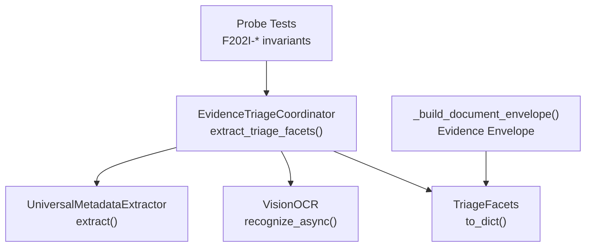
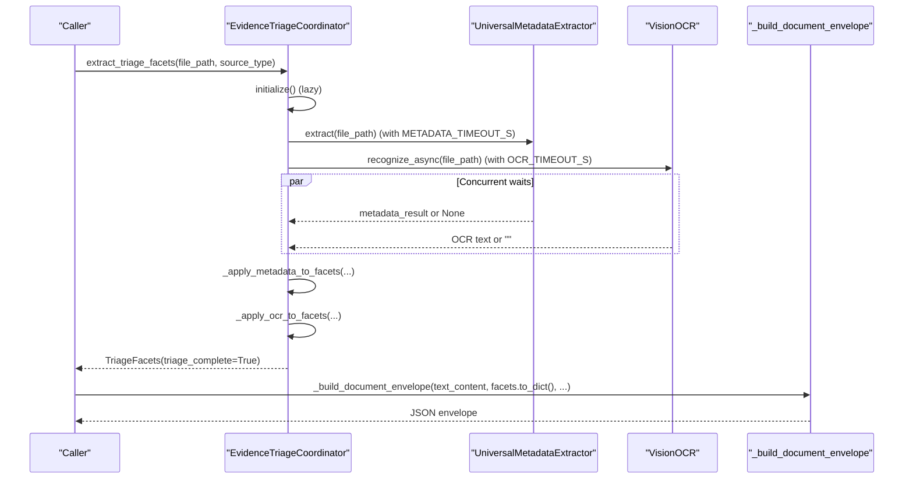
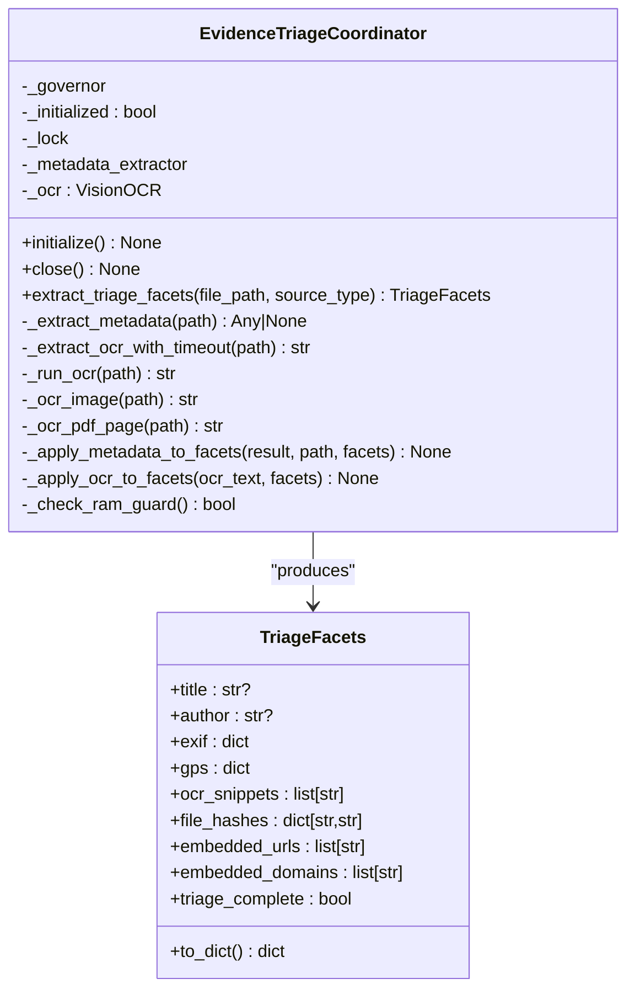
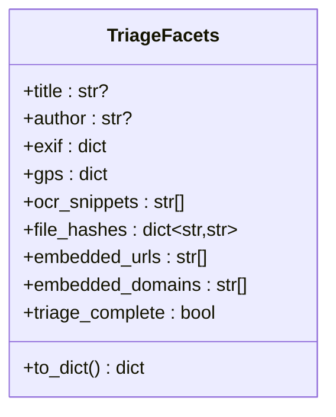
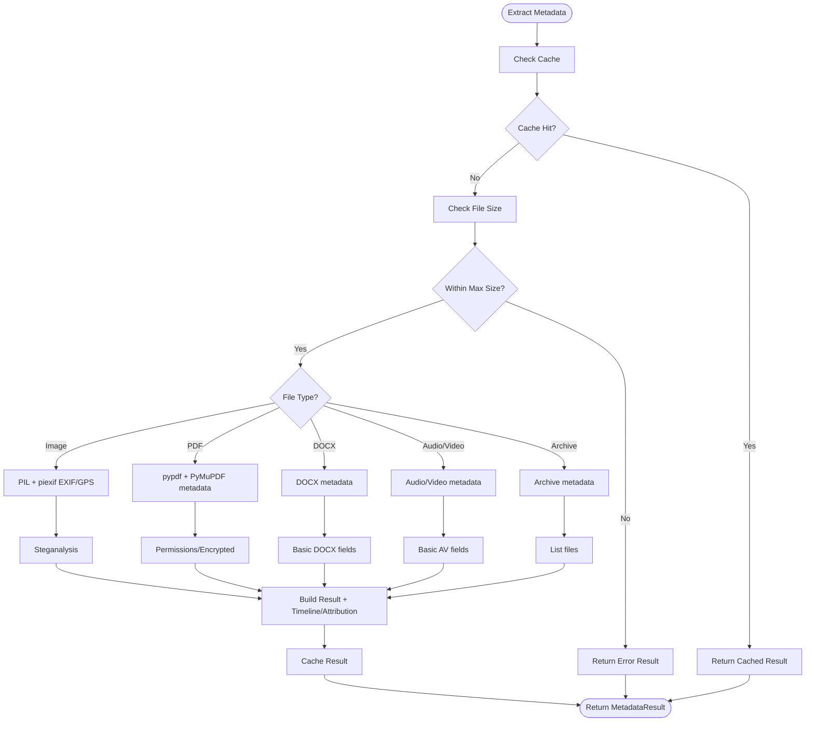
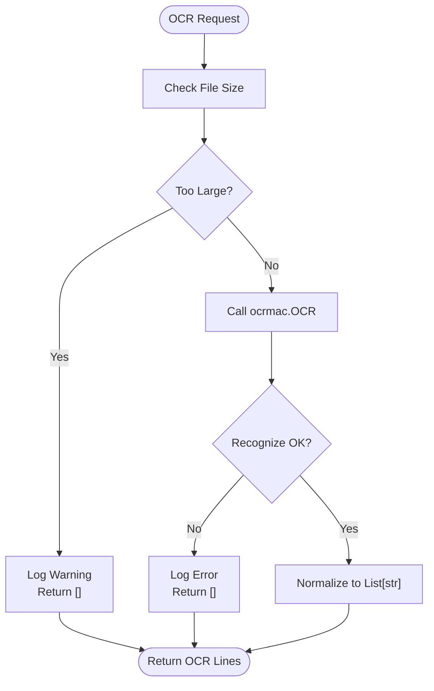
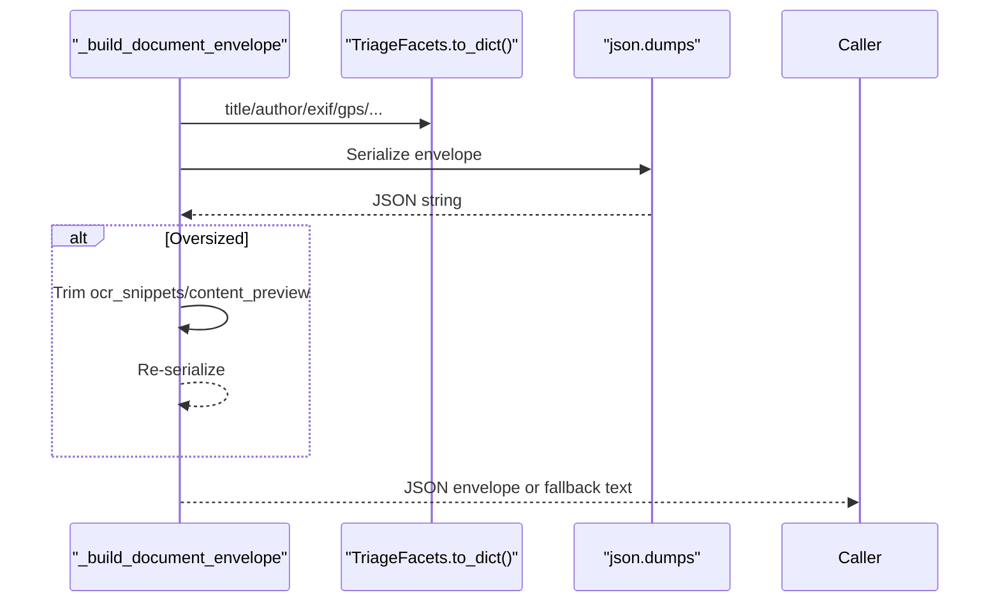
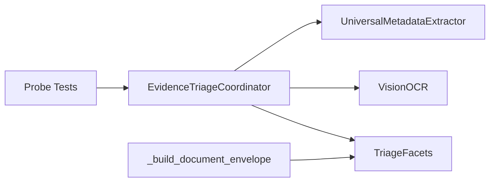

# Evidence Triage

<cite>
**Referenced Files in This Document**
- [evidence_triage.py](file://hledac/universal/multimodal/evidence_triage.py)
- [metadata_extractor.py](file://hledac/universal/forensics/metadata_extractor.py)
- [ocr_engine.py](file://hledac/universal/tools/ocr_engine.py)
- [analyzer.py](file://hledac/universal/multimodal/analyzer.py)
- [test_multimodal_evidence_triage.py](file://hledac/universal/tests/probe_f202i/test_multimodal_evidence_triage.py)
- [REAL_ARCHITECTURE.md](file://hledac/universal/REAL_ARCHITECTURE.md)
</cite>

## Table of Contents
1. [Introduction](#introduction)
2. [Project Structure](#project-structure)
3. [Core Components](#core-components)
4. [Architecture Overview](#architecture-overview)
5. [Detailed Component Analysis](#detailed-component-analysis)
6. [Dependency Analysis](#dependency-analysis)
7. [Performance Considerations](#performance-considerations)
8. [Troubleshooting Guide](#troubleshooting-guide)
9. [Conclusion](#conclusion)

## Introduction
Evidence Triage is a bounded, fail-safe triage system for multi-modal artifacts in Hledac Universal's research pipeline. It extracts curated metadata and OCR-derived signals from PDFs and images to construct a compact triage envelope included in the evidence envelope for document findings. The system emphasizes safety, boundedness, and resilience against resource pressure and malformed inputs.

Key capabilities:
- Bounded triage facets: title/author, EXIF/GPS, OCR snippets, file hashes, embedded URLs/domains
- Fail-safe extraction with timeouts and guards
- Integration with the broader evidence envelope and research orchestration

## Project Structure
The Evidence Triage system spans three primary modules:
- Evidence triage coordinator: orchestrates extraction and applies results to triage facets
- Forensics metadata extractor: robust universal metadata extraction with caching and streaming
- OCR engine: macOS Vision-based OCR with strict bounds and error handling

**Diagram sources**
- [evidence_triage.py:214-287](file://hledac/universal/multimodal/evidence_triage.py#L214-L287)
- [metadata_extractor.py:795-931](file://hledac/universal/forensics/metadata_extractor.py#L795-L931)
- [ocr_engine.py:108-118](file://hledac/universal/tools/ocr_engine.py#L108-L118)
- [analyzer.py:151-215](file://hledac/universal/multimodal/analyzer.py#L151-L215)
- [test_multimodal_evidence_triage.py:1-552](file://hledac/universal/tests/probe_f202i/test_multimodal_evidence_triage.py#L1-L552)

**Section sources**
- [evidence_triage.py:1-17](file://hledac/universal/multimodal/evidence_triage.py#L1-L17)
- [metadata_extractor.py:1-22](file://hledac/universal/forensics/metadata_extractor.py#L1-L22)
- [ocr_engine.py:1-6](file://hledac/universal/tools/ocr_engine.py#L1-L6)
- [analyzer.py:151-215](file://hledac/universal/multimodal/analyzer.py#L151-L215)

## Core Components
- EvidenceTriageCoordinator: orchestrates triage extraction, applies results to TriageFacets, and ensures fail-safe operation with timeouts and guards
- TriageFacets: bounded dataclass capturing triage signals with safe defaults and serialization
- UniversalMetadataExtractor: robust, configurable extractor supporting images, PDFs, DOCX, audio/video, and archives with caching and streaming
- VisionOCR: macOS Vision-based OCR with strict size bounds and error handling
- Evidence envelope builder: integrates triage facets into the canonical evidence envelope

**Section sources**
- [evidence_triage.py:96-138](file://hledac/universal/multimodal/evidence_triage.py#L96-L138)
- [evidence_triage.py:142-287](file://hledac/universal/multimodal/evidence_triage.py#L142-L287)
- [metadata_extractor.py:447-490](file://hledac/universal/forensics/metadata_extractor.py#L447-L490)
- [ocr_engine.py:18-118](file://hledac/universal/tools/ocr_engine.py#L18-L118)
- [analyzer.py:151-215](file://hledac/universal/multimodal/analyzer.py#L151-L215)

## Architecture Overview
The triage pipeline runs concurrently for metadata and OCR extraction, bounded by timeouts and file size. Results are merged into TriageFacets and serialized into the evidence envelope.

**Diagram sources**
- [evidence_triage.py:214-287](file://hledac/universal/multimodal/evidence_triage.py#L214-L287)
- [evidence_triage.py:289-319](file://hledac/universal/multimodal/evidence_triage.py#L289-L319)
- [evidence_triage.py:320-361](file://hledac/universal/multimodal/evidence_triage.py#L320-L361)
- [evidence_triage.py:423-440](file://hledac/universal/multimodal/evidence_triage.py#L423-L440)
- [analyzer.py:151-215](file://hledac/universal/multimodal/analyzer.py#L151-L215)

## Detailed Component Analysis

### EvidenceTriageCoordinator
Responsibilities:
- Lazy initialization of the metadata extractor
- Concurrent metadata and OCR extraction with bounded timeouts
- RAM and file-size guards
- Application of extraction results to TriageFacets
- Fail-safe behavior: returns partial facets on any failure

Key behaviors:
- Concurrency: metadata and OCR tasks run concurrently and are awaited together with a combined timeout
- Guards: file size threshold and RAM governor checks
- Extraction: metadata via UniversalMetadataExtractor, OCR via VisionOCR
- Application: transforms extraction results into TriageFacets and normalizes OCR text

**Diagram sources**
- [evidence_triage.py:142-287](file://hledac/universal/multimodal/evidence_triage.py#L142-L287)
- [evidence_triage.py:96-138](file://hledac/universal/multimodal/evidence_triage.py#L96-L138)

**Section sources**
- [evidence_triage.py:142-213](file://hledac/universal/multimodal/evidence_triage.py#L142-L213)
- [evidence_triage.py:214-287](file://hledac/universal/multimodal/evidence_triage.py#L214-L287)
- [evidence_triage.py:289-361](file://hledac/universal/multimodal/evidence_triage.py#L289-L361)
- [evidence_triage.py:423-440](file://hledac/universal/multimodal/evidence_triage.py#L423-L440)

### TriageFacets
Structure and guarantees:
- Safe defaults for all fields
- Bounded collections: OCR snippets and URL/domain hits
- Serialization to dict for envelope inclusion

**Diagram sources**
- [evidence_triage.py:96-138](file://hledac/universal/multimodal/evidence_triage.py#L96-L138)

**Section sources**
- [evidence_triage.py:96-138](file://hledac/universal/multimodal/evidence_triage.py#L96-L138)

### Metadata Extraction Pipeline
UniversalMetadataExtractor supports:
- Images: EXIF, GPS, camera/lens info, steganalysis, optional VLM captions/tags
- PDFs: title/author/subject, creators, producer, dates, version, encryption, permissions, embedded files
- DOCX: authorship and editing metadata
- Audio/Video: codec, duration, bitrate, channels, sample rate (where enabled)
- Archives: file counts, sizes, compression ratios, encrypted status
- Generic: hashes, entropy, filesystem stats

Caching and streaming:
- SQLite cache with eviction policy
- Partial hashing and streaming for large files
- Semaphore-controlled concurrency

**Diagram sources**
- [metadata_extractor.py:795-931](file://hledac/universal/forensics/metadata_extractor.py#L795-L931)
- [metadata_extractor.py:846-917](file://hledac/universal/forensics/metadata_extractor.py#L846-L917)
- [metadata_extractor.py:1023-1165](file://hledac/universal/forensics/metadata_extractor.py#L1023-L1165)
- [metadata_extractor.py:1184-1315](file://hledac/universal/forensics/metadata_extractor.py#L1184-L1315)

**Section sources**
- [metadata_extractor.py:613-704](file://hledac/universal/forensics/metadata_extractor.py#L613-L704)
- [metadata_extractor.py:795-931](file://hledac/universal/forensics/metadata_extractor.py#L795-L931)
- [metadata_extractor.py:1023-1165](file://hledac/universal/forensics/metadata_extractor.py#L1023-L1165)
- [metadata_extractor.py:1184-1315](file://hledac/universal/forensics/metadata_extractor.py#L1184-L1315)

### OCR Pipeline
VisionOCR provides:
- Size guard (fail-safe)
- Import-time and runtime error handling
- Async wrapper around Vision framework

**Diagram sources**
- [ocr_engine.py:28-118](file://hledac/universal/tools/ocr_engine.py#L28-L118)

**Section sources**
- [ocr_engine.py:18-118](file://hledac/universal/tools/ocr_engine.py#L18-L118)

### Evidence Envelope Construction
The envelope integrates triage facets with canonical finding structure and enforces size bounds.

**Diagram sources**
- [analyzer.py:151-215](file://hledac/universal/multimodal/analyzer.py#L151-L215)

**Section sources**
- [analyzer.py:151-215](file://hledac/universal/multimodal/analyzer.py#L151-L215)

## Dependency Analysis
- EvidenceTriageCoordinator depends on:
  - UniversalMetadataExtractor for metadata and EXIF/GPS
  - VisionOCR for OCR text
  - TriageFacets for structured output
- Analyzer integrates triage facets into the evidence envelope
- Tests validate invariants and integration points

**Diagram sources**
- [evidence_triage.py:142-287](file://hledac/universal/multimodal/evidence_triage.py#L142-L287)
- [analyzer.py:151-215](file://hledac/universal/multimodal/analyzer.py#L151-L215)
- [test_multimodal_evidence_triage.py:1-552](file://hledac/universal/tests/probe_f202i/test_multimodal_evidence_triage.py#L1-L552)

**Section sources**
- [evidence_triage.py:142-287](file://hledac/universal/multimodal/evidence_triage.py#L142-L287)
- [analyzer.py:151-215](file://hledac/universal/multimodal/analyzer.py#L151-L215)
- [test_multimodal_evidence_triage.py:1-552](file://hledac/universal/tests/probe_f202i/test_multimodal_evidence_triage.py#L1-L552)

## Performance Considerations
- Concurrency: metadata and OCR extraction run concurrently with a combined timeout to reduce latency
- Boundedness: strict caps on OCR snippets, URLs/domains, and character counts
- Resource guards: RAM governor checks and file size limits prevent resource exhaustion
- Streaming and caching: UniversalMetadataExtractor streams large files and caches results to minimize repeated work
- OCR size guard: prevents oversized images from being processed by the Vision framework

Recommendations:
- Monitor RAM usage via governor hooks during triage
- Tune OCR and metadata timeouts for target environments
- Prefer caching-enabled deployments to reduce repeated extraction costs

[No sources needed since this section provides general guidance]

## Troubleshooting Guide
Common issues and mitigations:
- Missing metadata extractor: lazy initialization logs and continues with partial facets
- OCR failures: VisionOCR handles import errors and runtime exceptions gracefully
- Timeout handling: extraction tasks are wrapped with timeouts and fail-safe returns
- Oversized files: skipped with debug logs and empty facets
- RAM pressure: triage blocked when governor indicates critical/emergency states

Validation references:
- Probe tests confirm fail-safe behavior, bounds, and integration points
- Architecture docs describe envelope construction and sidecar integration

**Section sources**
- [evidence_triage.py:174-200](file://hledac/universal/multimodal/evidence_triage.py#L174-L200)
- [evidence_triage.py:289-319](file://hledac/universal/multimodal/evidence_triage.py#L289-L319)
- [evidence_triage.py:320-361](file://hledac/universal/multimodal/evidence_triage.py#L320-L361)
- [test_multimodal_evidence_triage.py:277-336](file://hledac/universal/tests/probe_f202i/test_multimodal_evidence_triage.py#L277-L336)
- [REAL_ARCHITECTURE.md:1538-1554](file://hledac/universal/REAL_ARCHITECTURE.md#L1538-L1554)

## Conclusion
Evidence Triage delivers a robust, bounded triage pipeline that extracts curated metadata and OCR signals from PDFs and images. Its fail-safe design, resource guards, and integration with the evidence envelope make it suitable for production research workflows. The system’s emphasis on concurrency, caching, and streaming ensures scalability while maintaining reliability under diverse conditions.