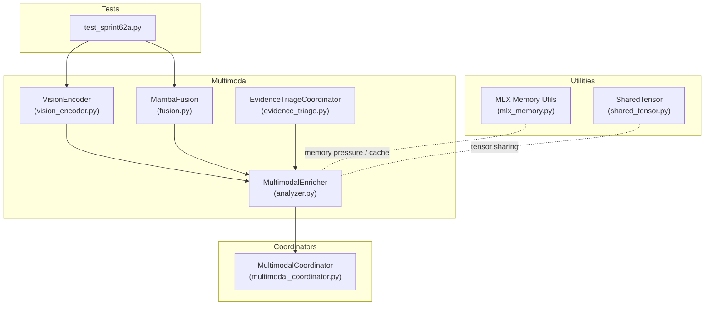
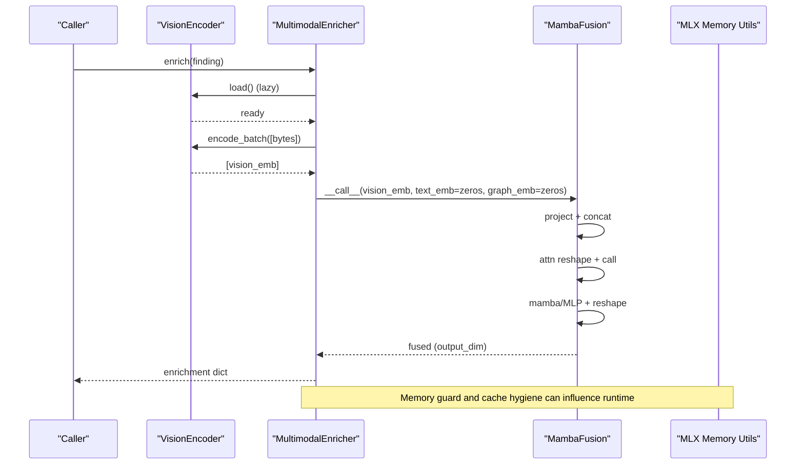
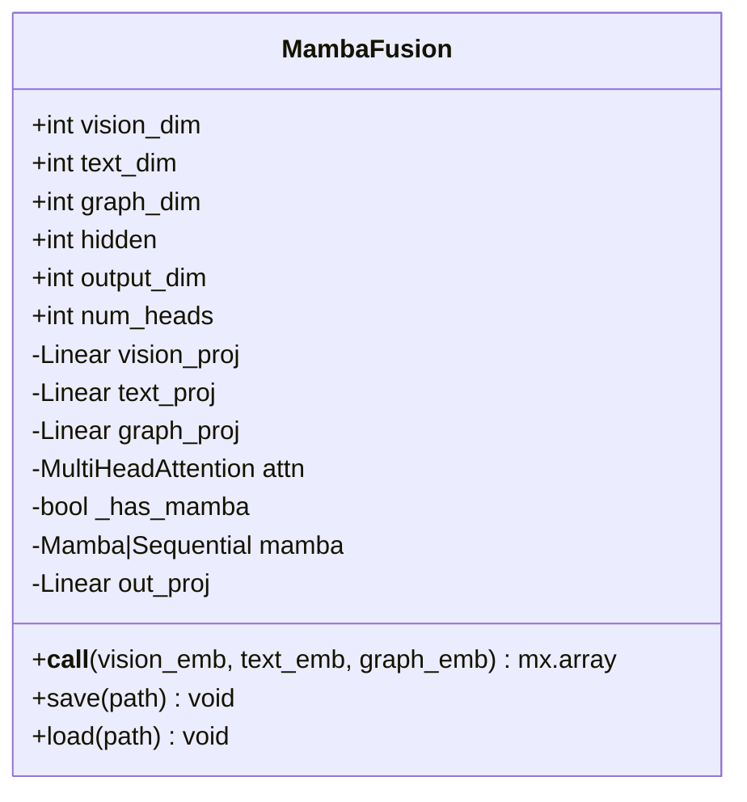
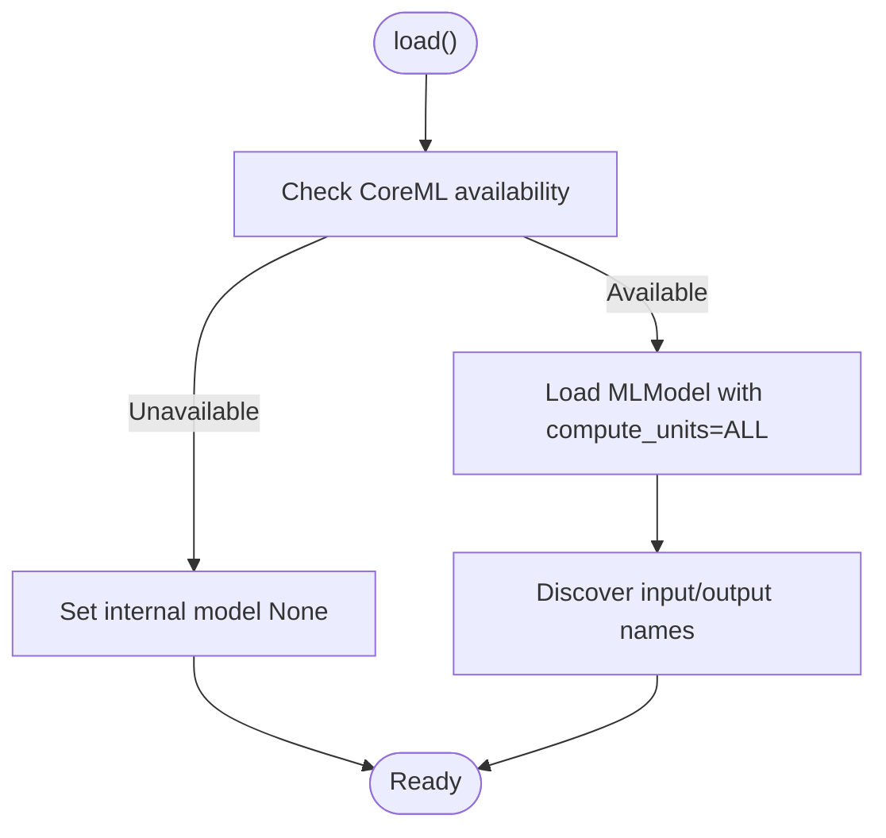
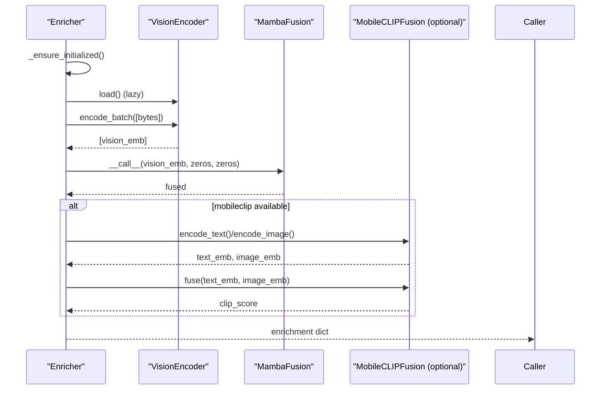
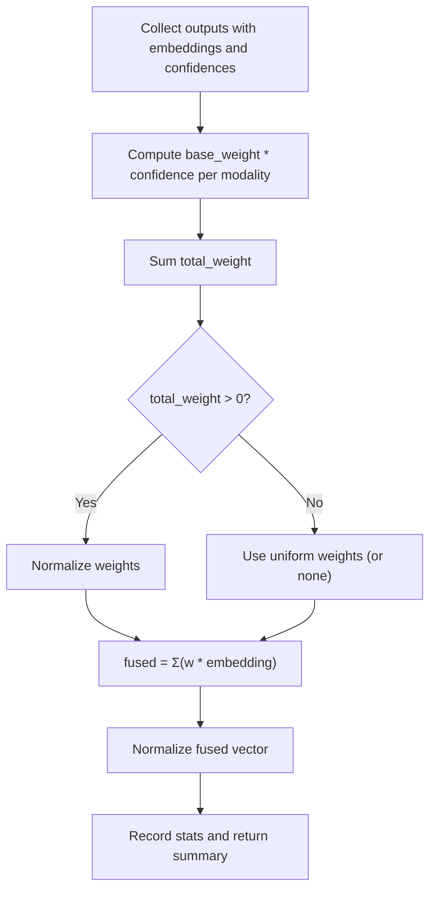
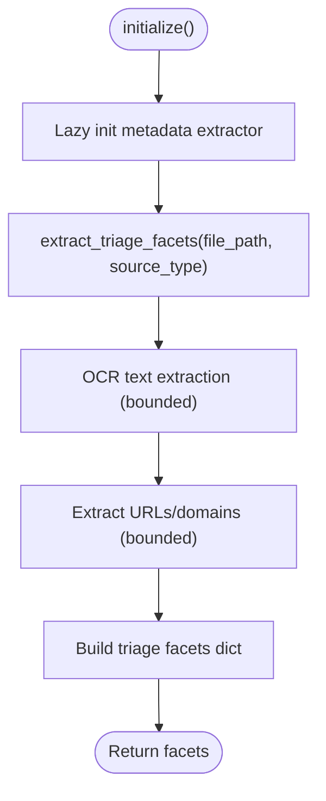
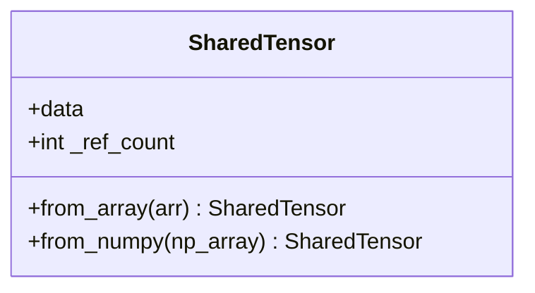
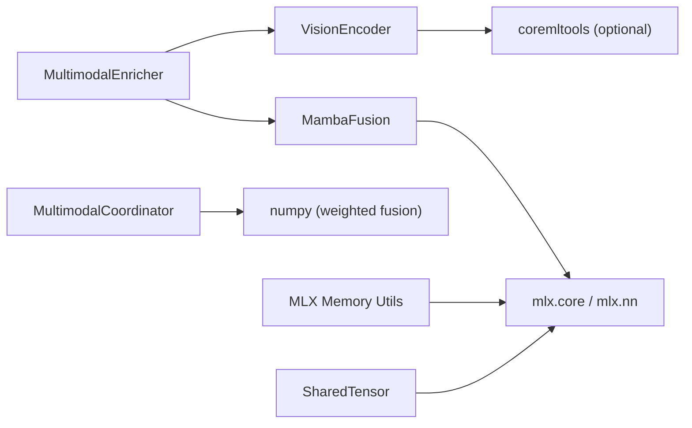

# Fusion Algorithms

<cite>
**Referenced Files in This Document**
- [fusion.py](file://hledac/universal/multimodal/fusion.py)
- [vision_encoder.py](file://hledac/universal/multimodal/vision_encoder.py)
- [analyzer.py](file://hledac/universal/multimodal/analyzer.py)
- [multimodal_coordinator.py](file://hledac/universal/coordinators/multimodal_coordinator.py)
- [evidence_triage.py](file://hledac/universal/multimodal/evidence_triage.py)
- [mlx_memory.py](file://hledac/universal/utils/mlx_memory.py)
- [shared_tensor.py](file://hledac/universal/utils/shared_tensor.py)
- [test_sprint62a.py](file://hledac/universal/tests/test_sprint62a.py)
</cite>

## Table of Contents
1. [Introduction](#introduction)
2. [Project Structure](#project-structure)
3. [Core Components](#core-components)
4. [Architecture Overview](#architecture-overview)
5. [Detailed Component Analysis](#detailed-component-analysis)
6. [Dependency Analysis](#dependency-analysis)
7. [Performance Considerations](#performance-considerations)
8. [Troubleshooting Guide](#troubleshooting-guide)
9. [Conclusion](#conclusion)
10. [Appendices](#appendices)

## Introduction
This document explains the fusion algorithms in Hledac Universal’s multi-modal processing system. It focuses on the MambaFusion architecture that combines vision, text, and graph embeddings into a unified representation, cross-modal embedding fusion techniques, and Apple MLX-based optimizations. It also covers memory-efficient processing, configuration options, and practical guidance for integrating and tuning fusion workflows on Apple Silicon.

## Project Structure
The fusion-related logic spans several modules:
- Multimodal fusion and vision encoder live under multimodal/.
- A higher-level multimodal coordinator orchestrates cross-modal fusion and weighted aggregation.
- Utilities support MLX memory hygiene and shared tensor abstractions.
- Tests validate forward passes and basic integration.

**Diagram sources**
- [fusion.py:23-93](file://hledac/universal/multimodal/fusion.py#L23-L93)
- [vision_encoder.py:22-88](file://hledac/universal/multimodal/vision_encoder.py#L22-L88)
- [analyzer.py:217-532](file://hledac/universal/multimodal/analyzer.py#L217-L532)
- [multimodal_coordinator.py:574-645](file://hledac/universal/coordinators/multimodal_coordinator.py#L574-L645)
- [evidence_triage.py:142-200](file://hledac/universal/multimodal/evidence_triage.py#L142-L200)
- [mlx_memory.py:1-332](file://hledac/universal/utils/mlx_memory.py#L1-L332)
- [shared_tensor.py:17-53](file://hledac/universal/utils/shared_tensor.py#L17-L53)
- [test_sprint62a.py:30-36](file://hledac/universal/tests/test_sprint62a.py#L30-L36)

**Section sources**
- [fusion.py:1-142](file://hledac/universal/multimodal/fusion.py#L1-L142)
- [vision_encoder.py:1-89](file://hledac/universal/multimodal/vision_encoder.py#L1-L89)
- [analyzer.py:1-876](file://hledac/universal/multimodal/analyzer.py#L1-L876)
- [multimodal_coordinator.py:1-896](file://hledac/universal/coordinators/multimodal_coordinator.py#L1-L896)
- [evidence_triage.py:1-468](file://hledac/universal/multimodal/evidence_triage.py#L1-L468)
- [mlx_memory.py:1-332](file://hledac/universal/utils/mlx_memory.py#L1-L332)
- [shared_tensor.py:1-53](file://hledac/universal/utils/shared_tensor.py#L1-L53)
- [test_sprint62a.py:1-36](file://hledac/universal/tests/test_sprint62a.py#L1-L36)

## Core Components
- MambaFusion: Concatenates projections of vision, text, and graph embeddings, applies attention, optionally Mamba or MLP, and projects to a compact output embedding.
- VisionEncoder: CoreML-based encoder with a CI-safe dummy fallback and batched encoding.
- MultimodalEnricher: Orchestrates vision encoding and fusion, with optional mobileclip similarity and robust fail-soft behavior.
- MultimodalCoordinator: Weighted fusion across modalities with confidence-aware normalization.
- EvidenceTriageCoordinator: Extracts bounded triage facets from documents/images for enriched payloads.
- MLX Memory Utilities: Lazy MLX initialization, cache management, and memory pressure reporting.
- SharedTensor: Wrapper for sharing MLX arrays across tasks.

**Section sources**
- [fusion.py:23-93](file://hledac/universal/multimodal/fusion.py#L23-L93)
- [vision_encoder.py:22-88](file://hledac/universal/multimodal/vision_encoder.py#L22-L88)
- [analyzer.py:217-532](file://hledac/universal/multimodal/analyzer.py#L217-L532)
- [multimodal_coordinator.py:574-645](file://hledac/universal/coordinators/multimodal_coordinator.py#L574-L645)
- [evidence_triage.py:142-200](file://hledac/universal/multimodal/evidence_triage.py#L142-L200)
- [mlx_memory.py:54-246](file://hledac/universal/utils/mlx_memory.py#L54-L246)
- [shared_tensor.py:17-53](file://hledac/universal/utils/shared_tensor.py#L17-L53)

## Architecture Overview
The fusion pipeline integrates vision, text, and graph embeddings into a unified representation. Vision embeddings are produced by VisionEncoder (CoreML or dummy). Text and graph embeddings are synthesized for fusion when not directly available. Attention and optional Mamba/MLP transform the concatenated embedding, followed by projection to the output dimension.

**Diagram sources**
- [analyzer.py:303-405](file://hledac/universal/multimodal/analyzer.py#L303-L405)
- [vision_encoder.py:46-88](file://hledac/universal/multimodal/vision_encoder.py#L46-L88)
- [fusion.py:68-83](file://hledac/universal/multimodal/fusion.py#L68-L83)
- [mlx_memory.py:77-105](file://hledac/universal/utils/mlx_memory.py#L77-L105)

## Detailed Component Analysis

### MambaFusion
MambaFusion performs cross-modal embedding fusion with:
- Projection heads for vision, text, and graph embeddings.
- Concatenation into a single sequence for attention.
- Robust attention invocation supporting variable return types.
- Optional Mamba block with fallback MLP.
- Output projection to a compact embedding.

Key behaviors:
- Attention expects batch/time shape; the implementation reshapes inputs accordingly.
- Tuple-safe handling for attention outputs.
- Optional Mamba initialization with fallback to MLP if unavailable or fails.
- Output is flattened and projected to output_dim.

**Diagram sources**
- [fusion.py:23-93](file://hledac/universal/multimodal/fusion.py#L23-L93)

**Section sources**
- [fusion.py:23-93](file://hledac/universal/multimodal/fusion.py#L23-L93)

### VisionEncoder
VisionEncoder provides:
- Lazy CoreML loading with ANE best-effort.
- CI-safe dummy mode when CoreML is unavailable.
- Batched encoding with configurable batch size and embedding dimension.
- Quantization note for 4-bit quantization (best-effort, not enforced).

**Diagram sources**
- [vision_encoder.py:46-75](file://hledac/universal/multimodal/vision_encoder.py#L46-L75)

**Section sources**
- [vision_encoder.py:22-88](file://hledac/universal/multimodal/vision_encoder.py#L22-L88)

### MultimodalEnricher
MultimodalEnricher orchestrates:
- Lazy initialization of VisionEncoder and MambaFusion.
- File path extraction from finding payload_text.
- Vision embedding generation and fusion.
- Optional mobileclip similarity when available.
- Fail-soft behavior and JSON-serializable outputs.

**Diagram sources**
- [analyzer.py:256-290](file://hledac/universal/multimodal/analyzer.py#L256-L290)
- [analyzer.py:303-405](file://hledac/universal/multimodal/analyzer.py#L303-L405)
- [fusion.py:68-83](file://hledac/universal/multimodal/fusion.py#L68-L83)
- [fusion.py:95-142](file://hledac/universal/multimodal/fusion.py#L95-L142)

**Section sources**
- [analyzer.py:217-532](file://hledac/universal/multimodal/analyzer.py#L217-L532)

### MultimodalCoordinator (Weighted Fusion)
The coordinator computes modality-specific weights based on base weights and confidence, normalizes, and forms a weighted average of embeddings. It supports normalization of the fused vector and maintains statistics.

**Diagram sources**
- [multimodal_coordinator.py:574-645](file://hledac/universal/coordinators/multimodal_coordinator.py#L574-L645)

**Section sources**
- [multimodal_coordinator.py:574-645](file://hledac/universal/coordinators/multimodal_coordinator.py#L574-L645)

### EvidenceTriageCoordinator
Extracts bounded triage facets (title/author, EXIF/GPS, OCR snippets, file hashes, embedded URLs/domains) with timeouts and bounds. Integrates with document extraction to produce enriched payloads.

**Diagram sources**
- [evidence_triage.py:174-200](file://hledac/universal/multimodal/evidence_triage.py#L174-L200)
- [evidence_triage.py:142-200](file://hledac/universal/multimodal/evidence_triage.py#L142-L200)

**Section sources**
- [evidence_triage.py:142-200](file://hledac/universal/multimodal/evidence_triage.py#L142-L200)

### MLX Memory Utilities and SharedTensor
- MLX Memory Utils: Lazy MLX import, cache clearing, memory pressure calculation, and stream context helpers.
- SharedTensor: Wrapper around MLX arrays to facilitate passing references across tasks (zero-copy pending Metal buffer support).

**Diagram sources**
- [shared_tensor.py:17-53](file://hledac/universal/utils/shared_tensor.py#L17-L53)

**Section sources**
- [mlx_memory.py:54-246](file://hledac/universal/utils/mlx_memory.py#L54-L246)
- [shared_tensor.py:17-53](file://hledac/universal/utils/shared_tensor.py#L17-L53)

## Dependency Analysis
- MambaFusion depends on MLX for tensors and neural network primitives.
- VisionEncoder optionally depends on CoreML; otherwise operates in dummy mode.
- MultimodalEnricher composes VisionEncoder and MambaFusion, with optional MobileCLIP fusion.
- MultimodalCoordinator provides a separate weighted fusion path for arbitrary modalities.
- MLX Memory Utils and SharedTensor support memory-conscious operations.

**Diagram sources**
- [fusion.py:5-7](file://hledac/universal/multimodal/fusion.py#L5-L7)
- [vision_encoder.py:12-19](file://hledac/universal/multimodal/vision_encoder.py#L12-L19)
- [analyzer.py:275-288](file://hledac/universal/multimodal/analyzer.py#L275-L288)
- [multimodal_coordinator.py:29-37](file://hledac/universal/coordinators/multimodal_coordinator.py#L29-L37)
- [mlx_memory.py:54-74](file://hledac/universal/utils/mlx_memory.py#L54-L74)
- [shared_tensor.py:31-38](file://hledac/universal/utils/shared_tensor.py#L31-L38)

**Section sources**
- [fusion.py:1-142](file://hledac/universal/multimodal/fusion.py#L1-L142)
- [vision_encoder.py:1-89](file://hledac/universal/multimodal/vision_encoder.py#L1-L89)
- [analyzer.py:1-876](file://hledac/universal/multimodal/analyzer.py#L1-L876)
- [multimodal_coordinator.py:1-896](file://hledac/universal/coordinators/multimodal_coordinator.py#L1-L896)
- [mlx_memory.py:1-332](file://hledac/universal/utils/mlx_memory.py#L1-L332)
- [shared_tensor.py:1-53](file://hledac/universal/utils/shared_tensor.py#L1-L53)

## Performance Considerations
- Memory pressure and cache hygiene:
  - Use MLX Memory Utils to monitor active/peak/cache memory and clear caches when needed.
  - Configure cache/memory limits for M1 8GB environments.
- Lazy initialization:
  - MLX is imported lazily; defer heavy operations until first use.
- Batched vision encoding:
  - Tune batch size to balance throughput and memory footprint.
- Attention and Mamba:
  - Flash attention is attempted; fallback MLP is provided when Mamba is unavailable.
- Normalization:
  - L2-normalize embeddings to maintain stable magnitudes and improve downstream similarity.

Practical tips:
- Periodically clear MLX cache and evaluate tensors to reduce fragmentation.
- Prefer smaller output_dim for downstream tasks to reduce memory and compute.
- Use confidence-aware weighting to emphasize reliable modalities.

[No sources needed since this section provides general guidance]

## Troubleshooting Guide
Common issues and mitigations:
- MLX not available:
  - Lazy import prevents startup failures; operations will degrade gracefully.
- CoreML unavailable:
  - VisionEncoder falls back to dummy embeddings; ensure batch sizes remain reasonable.
- OOM or memory pressure:
  - Use MLX Memory Utils to check pressure and clear cache.
  - Reduce batch size or output_dim; consider disabling Mamba and rely on MLP.
- Fusion shape mismatches:
  - Ensure input embeddings match configured dimensions; verify projections align with hidden/output_dim.
- Confidence-weighted fusion yields poor results:
  - Adjust base fusion weights and confidence scaling; validate modality-specific reliability.

**Section sources**
- [mlx_memory.py:77-105](file://hledac/universal/utils/mlx_memory.py#L77-L105)
- [vision_encoder.py:46-75](file://hledac/universal/multimodal/vision_encoder.py#L46-L75)
- [fusion.py:49-64](file://hledac/universal/multimodal/fusion.py#L49-L64)
- [multimodal_coordinator.py:611-623](file://hledac/universal/coordinators/multimodal_coordinator.py#L611-L623)

## Conclusion
Hledac Universal’s fusion algorithms combine vision, text, and graph embeddings using a robust MLX-based MambaFusion module. The system emphasizes memory efficiency, fail-soft behavior, and Apple Silicon optimizations. MultimodalEnricher and MultimodalCoordinator provide complementary pathways for vision-centric enrichment and cross-modal weighted fusion, respectively. With careful configuration and memory hygiene, the fusion pipeline scales across diverse modalities while remaining resilient under constrained conditions.

[No sources needed since this section summarizes without analyzing specific files]

## Appendices

### Configuration Options
- MambaFusion
  - vision_dim: Input dimension for vision embeddings.
  - text_dim: Input dimension for text embeddings.
  - graph_dim: Input dimension for graph embeddings.
  - hidden: Hidden projection dimension before concatenation and attention.
  - output_dim: Output fused embedding dimension.
  - num_heads: Number of attention heads.
- VisionEncoder
  - embedding_dim: Output embedding dimension.
  - batch_size: Batch size for encode_batch.
  - quant_4bit: Best-effort flag for quantization (not enforced).
- MultimodalEnricher
  - embedding_dim: Vision embedding dimension.
  - batch_size: Vision batch size.
- MultimodalCoordinator
  - fusion_weights: Base weights per modality.
  - embedding_dim: Dimension of fused embeddings.

**Section sources**
- [fusion.py:32-40](file://hledac/universal/multimodal/fusion.py#L32-L40)
- [vision_encoder.py:28-40](file://hledac/universal/multimodal/vision_encoder.py#L28-L40)
- [analyzer.py:233-250](file://hledac/universal/multimodal/analyzer.py#L233-L250)
- [multimodal_coordinator.py:42-52](file://hledac/universal/coordinators/multimodal_coordinator.py#L42-L52)

### Examples and Workflows
- Basic fusion forward pass:
  - Instantiate MambaFusion with appropriate dimensions.
  - Provide mx.array inputs for vision, text, and graph embeddings.
  - Call the module to obtain a fused embedding.
- Vision-centric enrichment:
  - Initialize MultimodalEnricher.
  - Provide a finding with a supported file path in payload_text.
  - Run enrich(); store the returned dict in LMDB keyed by finding_id.
- Weighted fusion across modalities:
  - Use MultimodalCoordinator to fuse multiple modalities with confidence-aware weights.

**Section sources**
- [test_sprint62a.py:30-36](file://hledac/universal/tests/test_sprint62a.py#L30-L36)
- [analyzer.py:303-405](file://hledac/universal/multimodal/analyzer.py#L303-L405)
- [multimodal_coordinator.py:574-645](file://hledac/universal/coordinators/multimodal_coordinator.py#L574-L645)

### Computational Complexity and Accuracy Notes
- Complexity:
  - Concatenation and linear projections scale linearly with embedding dimensions.
  - Attention complexity is cubic in sequence length; here sequence length is 1 after reshape, so effectively constant.
  - Mamba/MLP adds constant-time nonlinearities.
- Accuracy:
  - Using zeros for text/graph embeddings in the current pipeline is a placeholder; accuracy improves with real embeddings.
  - Confidence-aware weighting helps mitigate unreliable modalities.
  - Normalization reduces sensitivity to magnitude drift.

[No sources needed since this section provides general guidance]