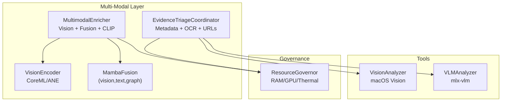
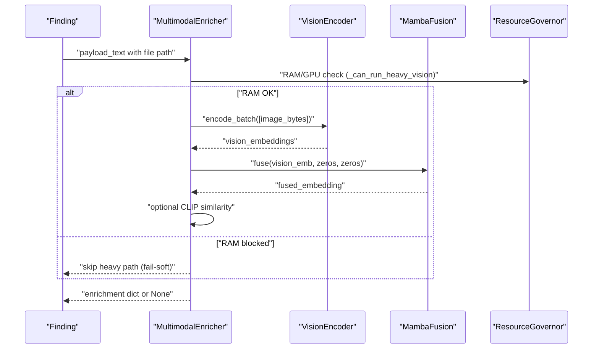
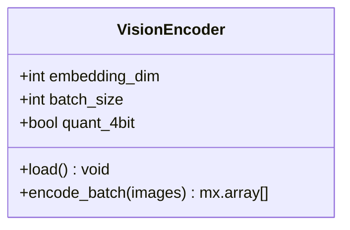
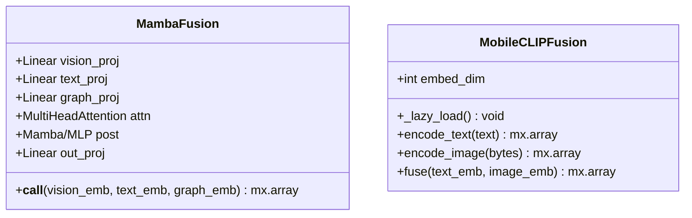
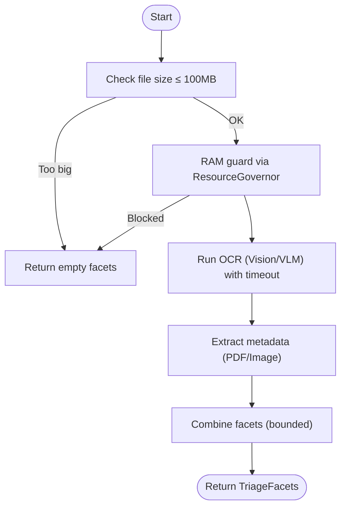
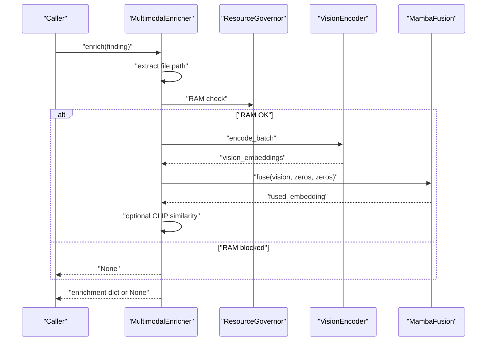
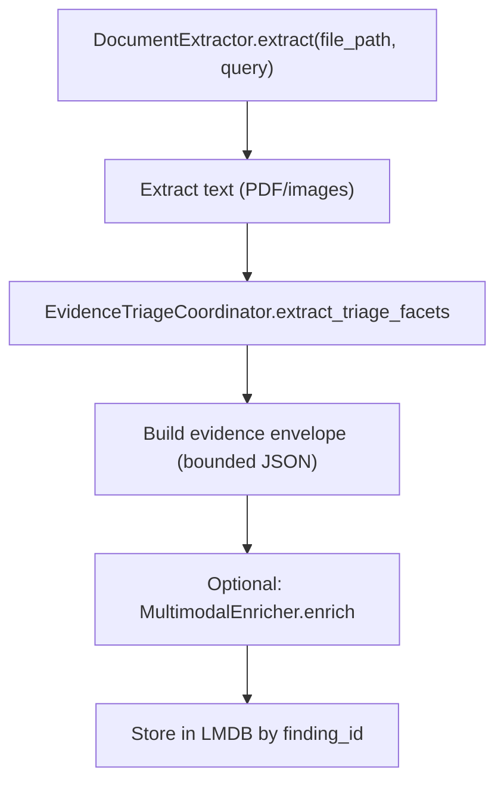
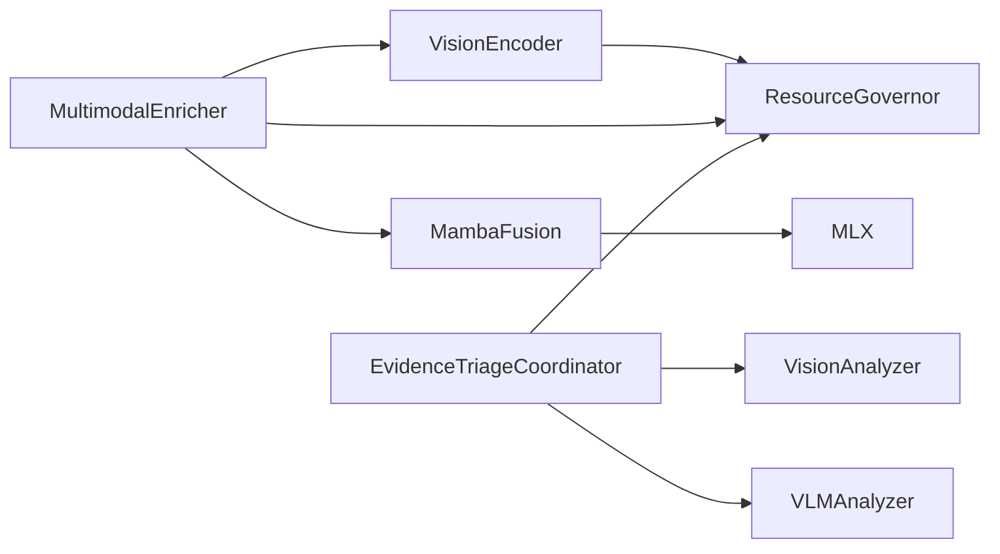

# Multi-Modal Processing

<cite>
**Referenced Files in This Document**
- [multimodal/analyzer.py](file://hledac/universal/multimodal/analyzer.py)
- [multimodal/evidence_triage.py](file://hledac/universal/multimodal/evidence_triage.py)
- [multimodal/fusion.py](file://hledac/universal/multimodal/fusion.py)
- [multimodal/vision_encoder.py](file://hledac/universal/multimodal/vision_encoder.py)
- [core/resource_governor.py](file://hledac/universal/core/resource_governor.py)
- [tools/vision_analyzer.py](file://hledac/universal/tools/vision_analyzer.py)
- [tools/vlm_analyzer.py](file://hledac/universal/tools/vlm_analyzer.py)
- [tests/test_multimodal_analyzer.py](file://hledac/universal/tests/test_multimodal_analyzer.py)
</cite>

## Table of Contents
1. [Introduction](#introduction)
2. [Project Structure](#project-structure)
3. [Core Components](#core-components)
4. [Architecture Overview](#architecture-overview)
5. [Detailed Component Analysis](#detailed-component-analysis)
6. [Dependency Analysis](#dependency-analysis)
7. [Performance Considerations](#performance-considerations)
8. [Troubleshooting Guide](#troubleshooting-guide)
9. [Conclusion](#conclusion)
10. [Appendices](#appendices)

## Introduction
This document explains Hledac Universal’s multi-modal processing capabilities with a focus on:
- Vision analysis algorithms and encoders
- Text extraction and triage workflows
- Fusion of modalities into unified embeddings
- Evidence triage and bounded faceted extraction
- Real-time and memory-safe execution via resource governance
- Configuration options, performance tuning, and accuracy considerations
- Examples of multi-modal analysis workflows and output interpretation

The system is designed for M1 8GB environments with strict memory and thermal safeguards, fail-soft behavior, and optional optional modules (e.g., CLIP similarity, VLM) to preserve stability.

## Project Structure
The multi-modal stack centers on four modules:
- Vision encoder: produces image embeddings (CoreML/ANE fallback)
- Fusion: combines (vision, text, graph) into a fused embedding
- Evidence triage: extracts bounded metadata, OCR snippets, and URL/domain hits
- Analyzer: orchestrates document extraction, triage, and optional enrichment

**Diagram sources**
- [multimodal/analyzer.py:217-406](file://hledac/universal/multimodal/analyzer.py#L217-L406)
- [multimodal/fusion.py:23-84](file://hledac/universal/multimodal/fusion.py#L23-L84)
- [multimodal/vision_encoder.py:22-89](file://hledac/universal/multimodal/vision_encoder.py#L22-L89)
- [multimodal/evidence_triage.py:142-288](file://hledac/universal/multimodal/evidence_triage.py#L142-L288)
- [core/resource_governor.py:200-308](file://hledac/universal/core/resource_governor.py#L200-L308)

**Section sources**
- [multimodal/analyzer.py:1-800](file://hledac/universal/multimodal/analyzer.py#L1-L800)
- [multimodal/evidence_triage.py:1-468](file://hledac/universal/multimodal/evidence_triage.py#L1-L468)
- [multimodal/fusion.py:1-142](file://hledac/universal/multimodal/fusion.py#L1-L142)
- [multimodal/vision_encoder.py:1-89](file://hledac/universal/multimodal/vision_encoder.py#L1-L89)
- [core/resource_governor.py:1-668](file://hledac/universal/core/resource_governor.py#L1-L668)

## Core Components
- VisionEncoder: CoreML-based image encoder with ANE fallback; supports batched encoding and resource-governed reservations.
- MambaFusion: Modular fusion combining vision, text, and graph embeddings with optional Mamba or MLP post-processing.
- EvidenceTriageCoordinator: Bounded extraction of metadata, OCR snippets, and URL/domain hits with timeouts and RAM guards.
- MultimodalEnricher: Orchestration of vision encoding, fusion, optional CLIP similarity, and safe storage via LMDB.
- Tools: macOS Vision and mlx-vlm analyzers for optional advanced OCR and image understanding.

Key configuration knobs:
- VisionEncoder: embedding_dim, batch_size, quant_4bit (best-effort)
- MambaFusion: vision/text/graph dimensions, hidden/output dims, attention heads
- EvidenceTriageCoordinator: timeouts, max snippet/url counts, file size caps
- MultimodalEnricher: embedding_dim, batch_size, concurrency limits

**Section sources**
- [multimodal/vision_encoder.py:22-89](file://hledac/universal/multimodal/vision_encoder.py#L22-L89)
- [multimodal/fusion.py:23-93](file://hledac/universal/multimodal/fusion.py#L23-L93)
- [multimodal/evidence_triage.py:32-51](file://hledac/universal/multimodal/evidence_triage.py#L32-L51)
- [multimodal/analyzer.py:233-294](file://hledac/universal/multimodal/analyzer.py#L233-L294)

## Architecture Overview
End-to-end multi-modal enrichment pipeline:

**Diagram sources**
- [multimodal/analyzer.py:303-406](file://hledac/universal/multimodal/analyzer.py#L303-L406)
- [multimodal/vision_encoder.py:76-89](file://hledac/universal/multimodal/vision_encoder.py#L76-L89)
- [multimodal/fusion.py:68-84](file://hledac/universal/multimodal/fusion.py#L68-L84)
- [core/resource_governor.py:286-308](file://hledac/universal/core/resource_governor.py#L286-L308)

## Detailed Component Analysis

### VisionEncoder
- Purpose: Produce stable image embeddings with CoreML/ANE acceleration; falls back to random vectors when unavailable.
- Batch processing: encode_batch supports batching to reduce overhead.
- Resource governance: reserves RAM and GPU capacity before loading the model and during batch inference.
- Quantization: optional 4-bit quantization note; not enforced in CI.

**Diagram sources**
- [multimodal/vision_encoder.py:22-89](file://hledac/universal/multimodal/vision_encoder.py#L22-L89)

**Section sources**
- [multimodal/vision_encoder.py:22-89](file://hledac/universal/multimodal/vision_encoder.py#L22-L89)
- [core/resource_governor.py:286-308](file://hledac/universal/core/resource_governor.py#L286-L308)

### Fusion: MambaFusion and MobileCLIPFusion
- MambaFusion: Projects each modality to a shared hidden space, concatenates, applies attention, then Mamba or MLP, and projects to output dimension. Includes robustness for varying MLX versions.
- MobileCLIPFusion: Optional text-image similarity wrapper with lazy loading and async locks.

**Diagram sources**
- [multimodal/fusion.py:23-93](file://hledac/universal/multimodal/fusion.py#L23-L93)
- [multimodal/fusion.py:95-142](file://hledac/universal/multimodal/fusion.py#L95-L142)

**Section sources**
- [multimodal/fusion.py:23-93](file://hledac/universal/multimodal/fusion.py#L23-L93)
- [multimodal/fusion.py:95-142](file://hledac/universal/multimodal/fusion.py#L95-L142)

### EvidenceTriageCoordinator
- Extracts bounded triage facets: title/author, EXIF/GPS, OCR snippets, file hashes, embedded URLs/domains.
- Uses macOS Vision for OCR and optional mlx-vlm for deeper understanding.
- Enforces timeouts and RAM guards to prevent resource exhaustion.

**Diagram sources**
- [multimodal/evidence_triage.py:214-288](file://hledac/universal/multimodal/evidence_triage.py#L214-L288)

**Section sources**
- [multimodal/evidence_triage.py:142-288](file://hledac/universal/multimodal/evidence_triage.py#L142-L288)
- [tools/vision_analyzer.py:29-129](file://hledac/universal/tools/vision_analyzer.py#L29-L129)
- [tools/vlm_analyzer.py:28-164](file://hledac/universal/tools/vlm_analyzer.py#L28-L164)

### MultimodalEnricher
- Orchestrates:
  - File path extraction from payload_text
  - VisionEncoder for image/pdf → embedding
  - MambaFusion for (vision, text, graph) fusion
  - Optional CLIP similarity (mobileclip) when available
- Fail-soft: all operations catch exceptions and return None without crashing.
- Concurrency and RAM guard: semaphore limits concurrent operations; governor checks prevent OOM.

**Diagram sources**
- [multimodal/analyzer.py:303-406](file://hledac/universal/multimodal/analyzer.py#L303-L406)
- [multimodal/vision_encoder.py:76-89](file://hledac/universal/multimodal/vision_encoder.py#L76-L89)
- [multimodal/fusion.py:68-84](file://hledac/universal/multimodal/fusion.py#L68-L84)
- [core/resource_governor.py:286-308](file://hledac/universal/core/resource_governor.py#L286-L308)

**Section sources**
- [multimodal/analyzer.py:217-406](file://hledac/universal/multimodal/analyzer.py#L217-L406)
- [core/resource_governor.py:286-308](file://hledac/universal/core/resource_governor.py#L286-L308)

### Document Extraction and Enrichment Workflow
- DocumentExtractor supports PDF and images; extracts text, computes metadata, and builds a bounded evidence envelope with triage facets.
- EvidenceTriageCoordinator is invoked to extract triage facets and URL/domain hits.
- MultimodalEnricher optionally adds vision and fused embeddings plus CLIP similarity.

**Diagram sources**
- [multimodal/analyzer.py:580-767](file://hledac/universal/multimodal/analyzer.py#L580-L767)
- [multimodal/evidence_triage.py:214-288](file://hledac/universal/multimodal/evidence_triage.py#L214-L288)

**Section sources**
- [multimodal/analyzer.py:580-767](file://hledac/universal/multimodal/analyzer.py#L580-L767)
- [multimodal/evidence_triage.py:142-288](file://hledac/universal/multimodal/evidence_triage.py#L142-L288)

## Dependency Analysis
- VisionEncoder depends on CoreML and ResourceGovernor for safe loading and inference.
- MambaFusion depends on MLX; includes fallbacks for Mamba availability.
- MultimodalEnricher depends on VisionEncoder, MambaFusion, optional mobileclip, and ResourceGovernor.
- EvidenceTriageCoordinator depends on macOS Vision and optional mlx-vlm; uses ResourceGovernor for RAM checks.
- Tools modules (VisionAnalyzer, VLMAnalyzer) are optional and integrated where applicable.

**Diagram sources**
- [multimodal/vision_encoder.py:46-65](file://hledac/universal/multimodal/vision_encoder.py#L46-L65)
- [multimodal/fusion.py:5-8](file://hledac/universal/multimodal/fusion.py#L5-L8)
- [multimodal/analyzer.py:256-290](file://hledac/universal/multimodal/analyzer.py#L256-L290)
- [multimodal/evidence_triage.py:174-189](file://hledac/universal/multimodal/evidence_triage.py#L174-L189)
- [tools/vision_analyzer.py:19-27](file://hledac/universal/tools/vision_analyzer.py#L19-L27)
- [tools/vlm_analyzer.py:19-26](file://hledac/universal/tools/vlm_analyzer.py#L19-L26)

**Section sources**
- [multimodal/vision_encoder.py:1-89](file://hledac/universal/multimodal/vision_encoder.py#L1-L89)
- [multimodal/fusion.py:1-142](file://hledac/universal/multimodal/fusion.py#L1-L142)
- [multimodal/analyzer.py:1-800](file://hledac/universal/multimodal/analyzer.py#L1-L800)
- [multimodal/evidence_triage.py:1-468](file://hledac/universal/multimodal/evidence_triage.py#L1-L468)
- [tools/vision_analyzer.py:1-129](file://hledac/universal/tools/vision_analyzer.py#L1-L129)
- [tools/vlm_analyzer.py:1-164](file://hledac/universal/tools/vlm_analyzer.py#L1-L164)

## Performance Considerations
- Memory budgeting:
  - ResourceGovernor enforces RAM/GPU/thermal budgets and hysteresis to avoid thrashing.
  - VisionEncoder reserves ~200 MB for model load and per-batch reservations.
- Concurrency:
  - MultimodalEnricher limits concurrent operations to 3; DocumentExtractor to 4 for M1 8GB safety.
- Timeouts:
  - EvidenceTriageCoordinator enforces OCR and metadata timeouts to bound latency.
- Optional modules:
  - mobileclip and mlx-vlm are optional and lazy-loaded to minimize startup footprint.
- Output sizes:
  - Fusion output dimension is configurable; default 128 for compact downstream storage.

[No sources needed since this section provides general guidance]

## Troubleshooting Guide
Common issues and mitigations:
- VisionEncoder fails to load CoreML:
  - Behavior: Runs in dummy mode and returns random embeddings.
  - Mitigation: Install CoreML-compatible model and ensure ANE availability.
- RAM pressure blocks heavy vision path:
  - Symptom: MultimodalEnricher returns None for heavy path.
  - Mitigation: Reduce batch size, lower embedding dimensions, or increase high-water mark.
- OCR/VLM timeouts:
  - Symptom: Empty OCR snippets or degraded descriptions.
  - Mitigation: Increase OCR/Metadata timeouts or disable VLM.
- LMDB or enrichment failures:
  - Symptom: Exceptions swallowed; no enrichment stored.
  - Mitigation: Verify LMDB path and permissions; check governor state.

**Section sources**
- [multimodal/analyzer.py:350-406](file://hledac/universal/multimodal/analyzer.py#L350-L406)
- [multimodal/evidence_triage.py:256-288](file://hledac/universal/multimodal/evidence_triage.py#L256-L288)
- [core/resource_governor.py:314-372](file://hledac/universal/core/resource_governor.py#L314-L372)

## Conclusion
Hledac Universal’s multi-modal stack delivers robust, memory-safe, and fail-soft processing for images and documents. It integrates vision encoders, optional advanced OCR/VLM, bounded triage extraction, and fusion into unified embeddings. ResourceGovernor ensures stability on constrained hardware, while optional modules can be enabled as needed. The design emphasizes reliability, bounded resource usage, and real-time readiness.

[No sources needed since this section summarizes without analyzing specific files]

## Appendices

### Configuration Options
- VisionEncoder
  - embedding_dim: embedding size (default 1280)
  - batch_size: batch inference size
  - quant_4bit: best-effort note (not enforced)
- MambaFusion
  - vision_dim, text_dim, graph_dim: input projections
  - hidden, output_dim: fusion dimensions
  - num_heads: attention heads
- EvidenceTriageCoordinator
  - METADATA_TIMEOUT_S, OCR_TIMEOUT_S: per-file timeouts
  - MAX_FILE_SIZE_FOR_TRIAGE: 100 MB cap
  - MAX_OCR_SNIPPETS, MAX_URL_HITS: bounded collections
- MultimodalEnricher
  - embedding_dim, batch_size: vision encoder settings
  - Concurrency: semaphore limits (3 for multimodal batch, 4 for document batch)

**Section sources**
- [multimodal/vision_encoder.py:28-41](file://hledac/universal/multimodal/vision_encoder.py#L28-L41)
- [multimodal/fusion.py:32-40](file://hledac/universal/multimodal/fusion.py#L32-L40)
- [multimodal/evidence_triage.py:34-51](file://hledac/universal/multimodal/evidence_triage.py#L34-L51)
- [multimodal/analyzer.py:236-249](file://hledac/universal/multimodal/analyzer.py#L236-L249)

### Accuracy and Quality Considerations
- VisionEncoder fallback: Random embeddings ensure continuity but degrade accuracy; install CoreML model for production.
- OCR quality: macOS Vision accuracy varies by image quality; consider disabling VLM if unreliable.
- Fusion accuracy: Depends on projection dimensions and attention; tune hidden/output_dim for downstream retrieval.
- Triage facets: Bounded limits prevent memory blow-ups; adjust caps if needed for specific use-cases.

**Section sources**
- [multimodal/vision_encoder.py:48-56](file://hledac/universal/multimodal/vision_encoder.py#L48-L56)
- [multimodal/evidence_triage.py:34-51](file://hledac/universal/multimodal/evidence_triage.py#L34-L51)

### Example Workflows
- Multi-modal enrichment:
  - Extract file path from payload_text
  - Encode image/pdf to vision embedding
  - Fuse with zeros for text/graph
  - Optionally compute CLIP similarity
  - Store results in LMDB keyed by finding_id
- Document triage:
  - Extract text and metadata
  - Run OCR with timeout
  - Detect URLs/domains
  - Build bounded evidence envelope

**Section sources**
- [multimodal/analyzer.py:303-406](file://hledac/universal/multimodal/analyzer.py#L303-L406)
- [multimodal/evidence_triage.py:214-288](file://hledac/universal/multimodal/evidence_triage.py#L214-L288)

### Custom Modality Integration
- Add new modalities by extending fusion logic in MambaFusion and updating MultimodalEnricher to accept and fuse new embeddings.
- Respect ResourceGovernor reservations and timeouts to maintain stability.
- Keep integrations optional and lazy-loaded to avoid impacting cold-start performance.

**Section sources**
- [multimodal/fusion.py:68-84](file://hledac/universal/multimodal/fusion.py#L68-L84)
- [multimodal/analyzer.py:275-289](file://hledac/universal/multimodal/analyzer.py#L275-L289)

### Output Interpretation
- Enrichment dict keys:
  - vision_embedding: list of floats or None
  - fused_embedding: list of floats or None
  - clip_score: float in [0,1] or None
  - file_path: resolved path or None
  - enrichment_available: True if any embedding produced
- Evidence envelope:
  - audit_reason, evidence_pointers, signal_facets, suggested_pivots
  - triage: title, author, exif, gps, ocr_snippets, file_hashes, embedded_urls, embedded_domains
  - content_preview: truncated text preview

**Section sources**
- [multimodal/analyzer.py:341-405](file://hledac/universal/multimodal/analyzer.py#L341-L405)
- [multimodal/analyzer.py:151-215](file://hledac/universal/multimodal/analyzer.py#L151-L215)

### Computational Requirements and Real-Time Processing
- CPU/GPU/ANE: CoreML/ANE acceleration recommended; fallback available.
- Memory: ResourceGovernor enforces high-water marks; adjust for workload.
- Latency: Timeouts and bounded facets ensure predictable latency; reduce batch size for stricter SLAs.
- Testing: Unit tests validate fail-soft behavior, concurrency limits, and governor interactions.

**Section sources**
- [core/resource_governor.py:204-285](file://hledac/universal/core/resource_governor.py#L204-L285)
- [tests/test_multimodal_analyzer.py:196-212](file://hledac/universal/tests/test_multimodal_analyzer.py#L196-L212)
- [tests/test_multimodal_analyzer.py:234-288](file://hledac/universal/tests/test_multimodal_analyzer.py#L234-L288)