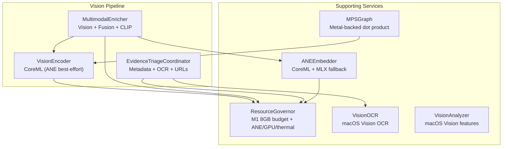
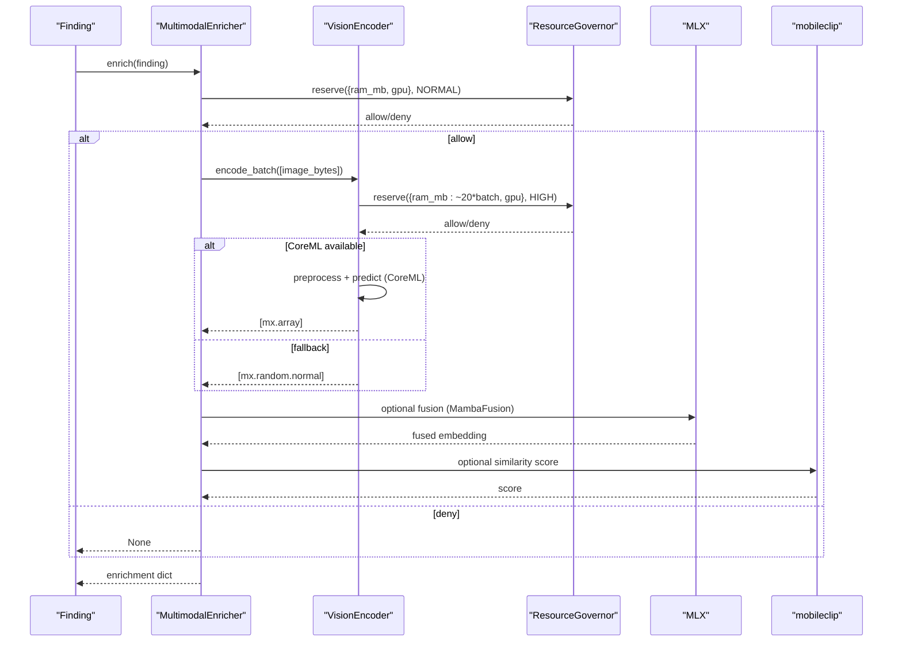
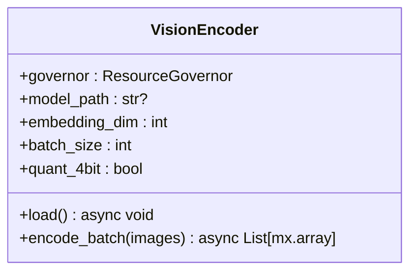
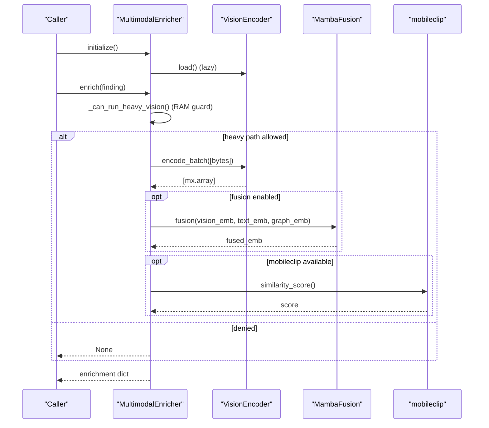
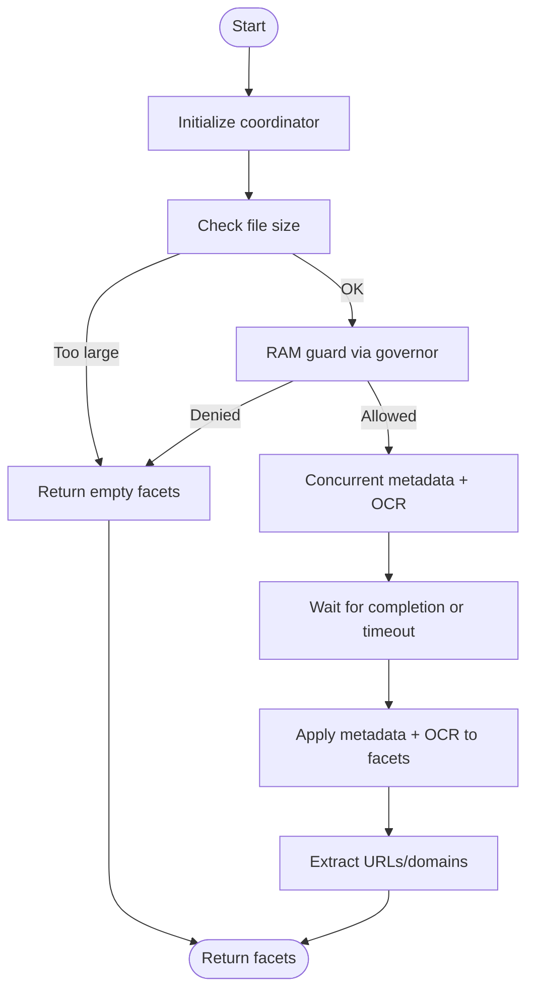
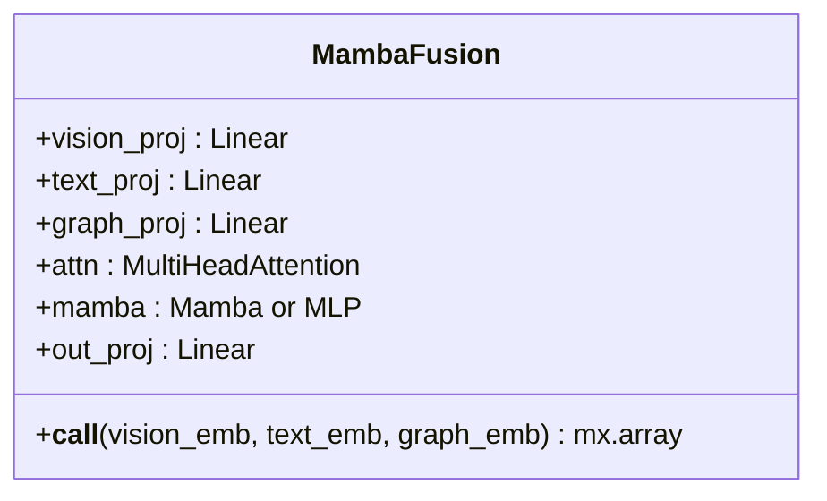
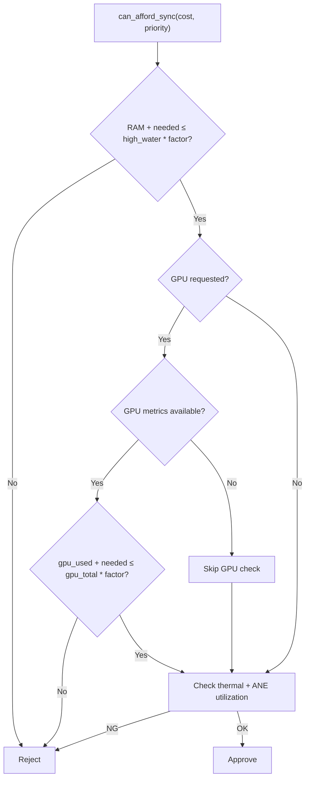
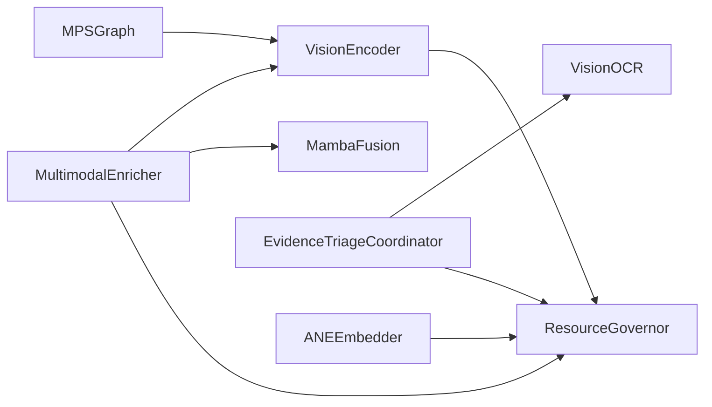

# Vision Analysis

<cite>
**Referenced Files in This Document**
- [vision_encoder.py](file://multimodal/vision_encoder.py)
- [analyzer.py](file://multimodal/analyzer.py)
- [fusion.py](file://multimodal/fusion.py)
- [evidence_triage.py](file://multimodal/evidence_triage.py)
- [resource_governor.py](file://core/resource_governor.py)
- [M1_8GB_MEMORY_BUDGET.md](file://M1_8GB_MEMORY_BUDGET.md)
- [ocr_engine.py](file://tools/ocr_engine.py)
- [vision_analyzer.py](file://tools/vision_analyzer.py)
- [ane_embedder.py](file://brain/ane_embedder.py)
- [mps_graph.py](file://utils/mps_graph.py)
- [memory_layer.py](file://layers/memory_layer.py)
- [memory_coordinator.py](file://coordinators/memory_coordinator.py)
- [memory_pressure_broker.py](file://orchestrator/memory_pressure_broker.py)
</cite>

## Table of Contents
1. [Introduction](#introduction)
2. [Project Structure](#project-structure)
3. [Core Components](#core-components)
4. [Architecture Overview](#architecture-overview)
5. [Detailed Component Analysis](#detailed-component-analysis)
6. [Dependency Analysis](#dependency-analysis)
7. [Performance Considerations](#performance-considerations)
8. [Troubleshooting Guide](#troubleshooting-guide)
9. [Conclusion](#conclusion)
10. [Appendices](#appendices)

## Introduction
This document explains the vision analysis capabilities in Hledac Universal’s multi-modal processing system. It focuses on the VisionEncoder implementation, CoreML-based image processing, and Apple Silicon optimization techniques. It covers the image preprocessing pipeline, embedding generation algorithms, batch processing, fallback mechanisms for different image formats, memory management strategies for M1 8GB constraints, and performance optimization. It also documents configuration options, example workflows, custom encoder integration, and output interpretation.

## Project Structure
The vision analysis stack is organized around:
- VisionEncoder: CoreML-based image encoder with CI-safe fallback and batch support
- MultimodalEnricher: orchestrates VisionEncoder, optional fusion, and optional CLIP similarity
- EvidenceTriageCoordinator: extracts triage facets (metadata, OCR, URLs/domains) from artifacts
- ResourceGovernor: enforces M1 8GB memory constraints and ANE/GPU/thermal guards
- Supporting utilities: OCR engine, Vision analyzer, ANE embedder, MPS graph helpers

**Diagram sources**
- [vision_encoder.py:22-88](file://multimodal/vision_encoder.py#L22-L88)
- [analyzer.py:217-532](file://multimodal/analyzer.py#L217-L532)
- [evidence_triage.py:142-287](file://multimodal/evidence_triage.py#L142-L287)
- [resource_governor.py:200-307](file://core/resource_governor.py#L200-L307)
- [ocr_engine.py:18-118](file://tools/ocr_engine.py#L18-L118)
- [vision_analyzer.py:29-118](file://tools/vision_analyzer.py#L29-L118)
- [ane_embedder.py:199-344](file://brain/ane_embedder.py#L199-L344)
- [mps_graph.py:56-90](file://utils/mps_graph.py#L56-L90)

**Section sources**
- [vision_encoder.py:22-88](file://multimodal/vision_encoder.py#L22-L88)
- [analyzer.py:217-532](file://multimodal/analyzer.py#L217-L532)
- [evidence_triage.py:142-287](file://multimodal/evidence_triage.py#L142-L287)
- [resource_governor.py:200-307](file://core/resource_governor.py#L200-L307)

## Core Components
- VisionEncoder: CoreML-based encoder with CI-safe dummy fallback, batched encoding, and optional quantization note. It reserves GPU/ANE resources via ResourceGovernor.
- MultimodalEnricher: orchestrates VisionEncoder, optional MambaFusion, optional mobileclip similarity, and document triage. It enforces RAM guards and concurrency limits.
- EvidenceTriageCoordinator: extracts metadata, OCR snippets, and embedded URLs/domains with timeouts and bounds.
- ResourceGovernor: central policy for M1 8GB memory, ANE/GPU/thermal constraints, and async reservations.
- Supporting utilities: VisionOCR (macOS Vision), VisionAnalyzer (Vision framework), ANEEmbedder (CoreML + MLX fallback), MPSGraph (Metal-backed math).

**Section sources**
- [vision_encoder.py:22-88](file://multimodal/vision_encoder.py#L22-L88)
- [analyzer.py:217-532](file://multimodal/analyzer.py#L217-L532)
- [evidence_triage.py:142-287](file://multimodal/evidence_triage.py#L142-L287)
- [resource_governor.py:200-307](file://core/resource_governor.py#L200-L307)
- [ocr_engine.py:18-118](file://tools/ocr_engine.py#L18-L118)
- [vision_analyzer.py:29-118](file://tools/vision_analyzer.py#L29-L118)
- [ane_embedder.py:199-344](file://brain/ane_embedder.py#L199-L344)
- [mps_graph.py:56-90](file://utils/mps_graph.py#L56-L90)

## Architecture Overview
The vision pipeline integrates CoreML and MLX for Apple Silicon optimization. VisionEncoder loads a CoreML model (best-effort ANE/CPU/GPU) and produces embeddings. MultimodalEnricher coordinates VisionEncoder, optional fusion, and optional CLIP similarity. EvidenceTriageCoordinator extracts triage facets from artifacts. ResourceGovernor enforces M1 8GB memory budgets and guards.

**Diagram sources**
- [analyzer.py:303-405](file://multimodal/analyzer.py#L303-L405)
- [vision_encoder.py:46-88](file://multimodal/vision_encoder.py#L46-L88)
- [resource_governor.py:286-307](file://core/resource_governor.py#L286-L307)

## Detailed Component Analysis

### VisionEncoder
- Purpose: CoreML Vision encoder with CI-safe dummy fallback and batched encoding.
- CoreML best-effort: loads model with compute_units=ALL (ANE/CPU/GPU).
- Batched encoding: encode_batch(images) returns list of mx.array embeddings.
- Dummy fallback: when CoreML unavailable or model_path missing, returns random embeddings with fixed dimension.
- Resource guard: reserves RAM and GPU during load and encode.

**Diagram sources**
- [vision_encoder.py:22-88](file://multimodal/vision_encoder.py#L22-L88)

**Section sources**
- [vision_encoder.py:22-88](file://multimodal/vision_encoder.py#L22-L88)

### MultimodalEnricher
- Purpose: orchestrate multimodal enrichment for CanonicalFindings.
- VisionEncoder: optional, CoreML or dummy fallback.
- MambaFusion: optional MLX fusion of (vision, text, graph) embeddings.
- mobileclip: optional text-image similarity when available.
- RAM guard: checks governor state and reserves memory before heavy paths.
- Concurrency: semaphore-based batch enrichment for M1 8GB safety.

**Diagram sources**
- [analyzer.py:217-532](file://multimodal/analyzer.py#L217-L532)

**Section sources**
- [analyzer.py:217-532](file://multimodal/analyzer.py#L217-L532)

### EvidenceTriageCoordinator
- Purpose: extract triage facets from PDF/image artifacts.
- Metadata extraction: title/author, EXIF, GPS via forensics metadata extractor.
- OCR: macOS Vision via VisionOCR with timeouts and bounds.
- URL/domain extraction: bounded lists from OCR text.
- RAM guard: checks governor state before processing.

**Diagram sources**
- [evidence_triage.py:142-287](file://multimodal/evidence_triage.py#L142-L287)

**Section sources**
- [evidence_triage.py:142-287](file://multimodal/evidence_triage.py#L142-L287)

### MambaFusion
- Purpose: fuse vision, text, and graph embeddings into a compact representation.
- Projections: linear projections for each modality.
- Attention: MultiHeadAttention with tuple-safe handling.
- Optional Mamba: fallback MLP if Mamba not available.
- Output projection: maps fused representation to output_dim.

**Diagram sources**
- [fusion.py:23-93](file://multimodal/fusion.py#L23-L93)

**Section sources**
- [fusion.py:23-93](file://multimodal/fusion.py#L23-L93)

### ResourceGovernor (M1 8GB Memory Management)
- Purpose: enforce M1 8GB memory constraints and ANE/GPU/thermal guards.
- Priority-based reservations: CRITICAL/HIGH/NORMAL/LOW with tolerance factors.
- GPU/ANE/thermal checks: guards against device overload.
- Async reservation: context manager for safe resource usage.

**Diagram sources**
- [resource_governor.py:229-284](file://core/resource_governor.py#L229-L284)

**Section sources**
- [resource_governor.py:229-284](file://core/resource_governor.py#L229-L284)

### Supporting Utilities
- VisionOCR: macOS Vision OCR with size bounds and fail-safe handling.
- VisionAnalyzer: macOS Vision features (OCR, barcode, face, feature prints).
- ANEEmbedder: CoreML ANE path with MLX fallback and hash fallback.
- MPSGraph: Metal-backed dot product with fallback.

**Section sources**
- [ocr_engine.py:18-118](file://tools/ocr_engine.py#L18-L118)
- [vision_analyzer.py:29-118](file://tools/vision_analyzer.py#L29-L118)
- [ane_embedder.py:199-344](file://brain/ane_embedder.py#L199-L344)
- [mps_graph.py:56-90](file://utils/mps_graph.py#L56-L90)

## Dependency Analysis
- VisionEncoder depends on ResourceGovernor for reservations and CoreML availability.
- MultimodalEnricher composes VisionEncoder, MambaFusion, and optional mobileclip.
- EvidenceTriageCoordinator depends on VisionOCR and forensics metadata extractor.
- ResourceGovernor governs all heavy operations and provides async reservations.
- Memory management layers coordinate with ResourceGovernor and memory pressure broker.

**Diagram sources**
- [vision_encoder.py:46-88](file://multimodal/vision_encoder.py#L46-L88)
- [analyzer.py:217-532](file://multimodal/analyzer.py#L217-L532)
- [evidence_triage.py:142-287](file://multimodal/evidence_triage.py#L142-L287)
- [resource_governor.py:286-307](file://core/resource_governor.py#L286-L307)
- [ane_embedder.py:199-344](file://brain/ane_embedder.py#L199-L344)
- [mps_graph.py:56-90](file://utils/mps_graph.py#L56-L90)

**Section sources**
- [vision_encoder.py:46-88](file://multimodal/vision_encoder.py#L46-L88)
- [analyzer.py:217-532](file://multimodal/analyzer.py#L217-L532)
- [evidence_triage.py:142-287](file://multimodal/evidence_triage.py#L142-L287)
- [resource_governor.py:286-307](file://core/resource_governor.py#L286-L307)

## Performance Considerations
- CoreML best-effort ANE acceleration: VisionEncoder sets compute_units=ALL to leverage ANE/CPU/GPU.
- MLX fusion: MambaFusion uses attention and optional Mamba with tuple-safe handling.
- Metal-backed math: MPSGraph provides Metal-accelerated dot products with fallback.
- M1 8GB budget: ResourceGovernor enforces RAM and GPU budgets; ANEEmbedder and VisionEncoder reserve resources.
- Concurrency limits: MultimodalEnricher uses semaphores to limit concurrent operations on M1 8GB.
- Memory pressure broker: Detects memory pressure and adjusts admission states.

[No sources needed since this section provides general guidance]

## Troubleshooting Guide
- CoreML unavailable: VisionEncoder logs a warning and runs in dummy mode, returning random embeddings.
- No model path: VisionEncoder falls back to dummy mode.
- RAM guard denied: MultimodalEnricher skips heavy vision path and returns None.
- OCR failures: VisionOCR logs warnings and returns empty results; EvidenceTriageCoordinator continues with partial facets.
- Thermal/GPU guards: ResourceGovernor rejects operations when GPU temperature or ANE utilization exceeds thresholds.

**Section sources**
- [vision_encoder.py:46-88](file://multimodal/vision_encoder.py#L46-L88)
- [analyzer.py:350-440](file://multimodal/analyzer.py#L350-L440)
- [ocr_engine.py:28-118](file://tools/ocr_engine.py#L28-L118)
- [resource_governor.py:240-284](file://core/resource_governor.py#L240-L284)

## Conclusion
Hledac Universal’s vision analysis system combines CoreML-based VisionEncoder with MLX fusion and optional CLIP similarity, all guarded by ResourceGovernor for M1 8GB constraints. The system provides CI-safe fallbacks, batch processing, and robust error handling. Memory management layers and pressure brokers ensure stability under constrained conditions.

[No sources needed since this section summarizes without analyzing specific files]

## Appendices

### Configuration Options
- VisionEncoder
  - embedding_dim: embedding dimension (default 1280)
  - batch_size: batch size for encode_batch (default 4)
  - quant_4bit: best-effort note; no hard dependency
- MultimodalEnricher
  - embedding_dim: forwarded to VisionEncoder (default 1280)
  - batch_size: forwarded to VisionEncoder (default 4)
- EvidenceTriageCoordinator
  - MAX_URL_HITS: max embedded URLs/domains (default 20)
  - MAX_OCR_SNIPPETS: max OCR snippets (default 10)
  - MAX_OCR_CHARS: max OCR characters (default 5000)
  - METADATA_TIMEOUT_S: metadata extraction timeout (default 30.0)
  - OCR_TIMEOUT_S: OCR timeout (default 30.0)
  - MAX_FILE_SIZE_FOR_TRIAGE: triage file size limit (default 100MB)

**Section sources**
- [vision_encoder.py:28-40](file://multimodal/vision_encoder.py#L28-L40)
- [analyzer.py:233-249](file://multimodal/analyzer.py#L233-L249)
- [evidence_triage.py:32-51](file://multimodal/evidence_triage.py#L32-L51)

### Example Workflows
- Vision-only enrichment:
  - Initialize MultimodalEnricher with ResourceGovernor
  - Call enrich(finding) to produce vision_embedding
- Vision + fusion:
  - Ensure MambaFusion is available
  - Call enrich(finding) to produce fused_embedding
- Document triage:
  - Use EvidenceTriageCoordinator to extract metadata, OCR, and URLs
  - Build evidence envelope with triage facets

**Section sources**
- [analyzer.py:303-405](file://multimodal/analyzer.py#L303-L405)
- [evidence_triage.py:214-287](file://multimodal/evidence_triage.py#L214-L287)

### Custom Encoder Integration
- VisionEncoder: subclass ResourceGovernor.reserve and implement CoreML model loading; handle IO names discovery and batching.
- MambaFusion: extend with custom projections or attention variants; ensure tuple-safe attention handling.
- ANEEmbedder: provide MLX fallback or hash fallback; integrate with ResourceGovernor for memory checks.

**Section sources**
- [vision_encoder.py:46-88](file://multimodal/vision_encoder.py#L46-L88)
- [fusion.py:23-93](file://multimodal/fusion.py#L23-L93)
- [ane_embedder.py:199-344](file://brain/ane_embedder.py#L199-L344)

### Output Interpretation
- vision_embedding: normalized vector of configured embedding_dim
- fused_embedding: compact fused vector from MambaFusion
- clip_score: optional similarity score (0.0–1.0) when mobileclip is available
- enrichment_available: True if any module produced data

**Section sources**
- [analyzer.py:341-405](file://multimodal/analyzer.py#L341-L405)

### Computational Requirements and Memory Usage Patterns
- M1 8GB calibrated thresholds and memory waterfall are documented in M1_8GB_MEMORY_BUDGET.md.
- ResourceGovernor evaluates UMA state and hysteresis-based I/O-only mode.
- MemoryLayer, MemoryCoordinator, and MemoryPressureBroker coordinate memory pressure and admission states.

**Section sources**
- [M1_8GB_MEMORY_BUDGET.md:1-136](file://M1_8GB_MEMORY_BUDGET.md#L1-L136)
- [resource_governor.py:314-372](file://core/resource_governor.py#L314-L372)
- [memory_layer.py:1-38](file://layers/memory_layer.py#L1-L38)
- [memory_coordinator.py:711-749](file://coordinators/memory_coordinator.py#L711-L749)
- [memory_pressure_broker.py:41-89](file://orchestrator/memory_pressure_broker.py#L41-L89)