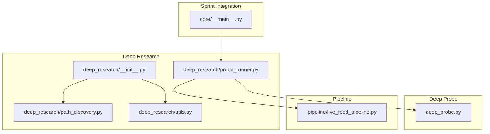
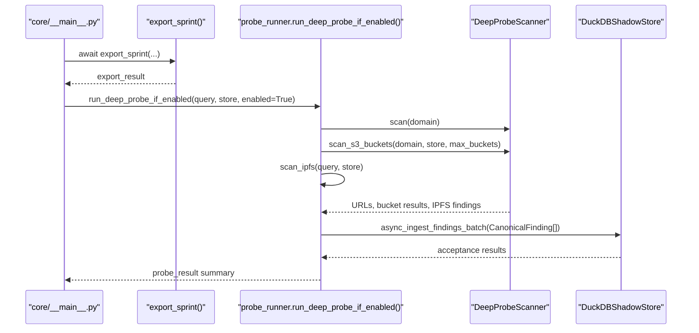
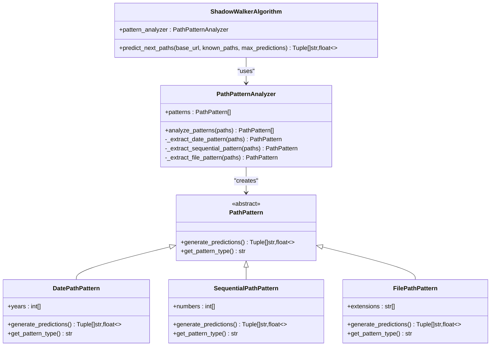
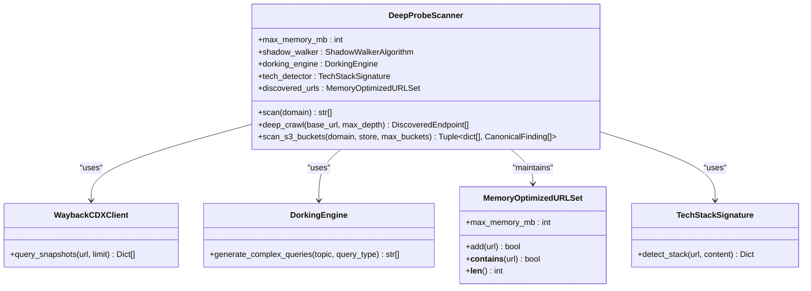
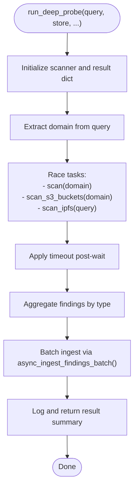
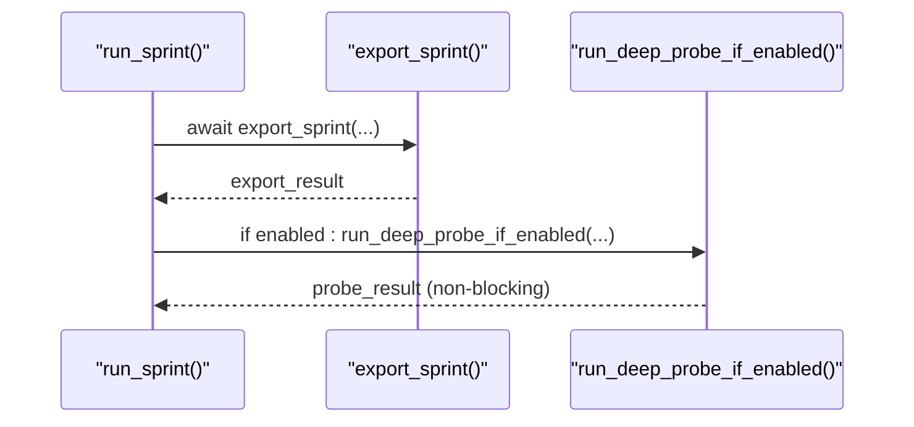
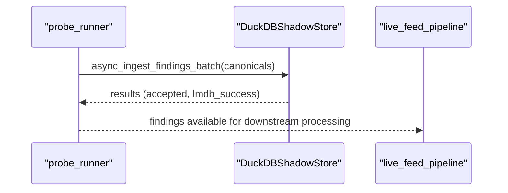
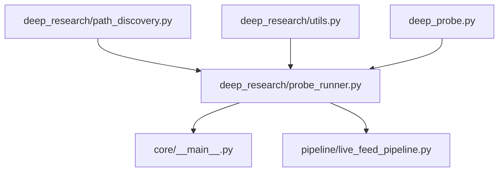

# Deep Research Probes

<cite>
**Referenced Files in This Document**
- [deep_research/__init__.py](file://deep_research/__init__.py)
- [deep_research/probe_runner.py](file://deep_research/probe_runner.py)
- [deep_research/path_discovery.py](file://deep_research/path_discovery.py)
- [deep_research/utils.py](file://deep_research/utils.py)
- [deep_probe.py](file://deep_probe.py)
- [core/__main__.py](file://core/__main__.py)
- [pipeline/live_feed_pipeline.py](file://pipeline/live_feed_pipeline.py)
- [tests/test_deep_probe_runner.py](file://tests/test_deep_probe_runner.py)
</cite>

## Table of Contents
1. [Introduction](#introduction)
2. [Project Structure](#project-structure)
3. [Core Components](#core-components)
4. [Architecture Overview](#architecture-overview)
5. [Detailed Component Analysis](#detailed-component-analysis)
6. [Dependency Analysis](#dependency-analysis)
7. [Performance Considerations](#performance-considerations)
8. [Troubleshooting Guide](#troubleshooting-guide)
9. [Conclusion](#conclusion)

## Introduction
This document describes the Deep Research Probes system, which extends the Hledac Universal Platform with advanced deep crawling, hidden path discovery, and post-sprint research capabilities. It covers:
- Probe execution architecture and post-sprint orchestration
- Path discovery mechanisms powered by the Shadow Walker algorithm
- Research workflow coordination with the broader pipeline system
- Probe runner implementation, execution optimization, and resource management
- Integration with the sprint lifecycle and canonical persistence
- Examples of probe configuration, custom probe development, and execution monitoring
- Relationship between probes and pipeline systems, performance considerations, and troubleshooting techniques

## Project Structure
The Deep Research Probes system spans several modules:
- Deep Research core: path discovery, utilities, and probe runner
- Deep Probe scanner: integrated deep crawling, dorking, and cloud storage discovery
- Sprint integration: post-sprint execution coordinated by the canonical sprint owner
- Pipeline integration: canonical persistence via DuckDB shadow store

**Diagram sources**
- [deep_research/__init__.py:12-31](file://deep_research/__init__.py#L12-L31)
- [deep_research/probe_runner.py:51-196](file://deep_research/probe_runner.py#L51-L196)
- [deep_research/path_discovery.py:144-182](file://deep_research/path_discovery.py#L144-L182)
- [deep_research/utils.py:18-373](file://deep_research/utils.py#L18-L373)
- [deep_probe.py:555-816](file://deep_probe.py#L555-L816)
- [core/__main__.py:1793-1805](file://core/__main__.py#L1793-L1805)
- [pipeline/live_feed_pipeline.py:2207-2229](file://pipeline/live_feed_pipeline.py#L2207-L2229)

**Section sources**
- [deep_research/__init__.py:12-52](file://deep_research/__init__.py#L12-L52)
- [deep_research/probe_runner.py:51-196](file://deep_research/probe_runner.py#L51-L196)
- [deep_research/path_discovery.py:144-182](file://deep_research/path_discovery.py#L144-L182)
- [deep_research/utils.py:18-373](file://deep_research/utils.py#L18-L373)
- [deep_probe.py:555-816](file://deep_probe.py#L555-L816)
- [core/__main__.py:1793-1805](file://core/__main__.py#L1793-L1805)
- [pipeline/live_feed_pipeline.py:2207-2229](file://pipeline/live_feed_pipeline.py#L2207-L2229)

## Core Components
- Path Discovery: Implements the Shadow Walker algorithm and pattern analyzers to predict hidden paths and generate candidate URLs.
- Deep Probe Scanner: Integrates dorking, Wayback CDX, and path prediction to discover endpoints and scan cloud storage for open buckets.
- Probe Runner: Orchestrates post-sprint research, races discovery, S3 scanning, and IPFS search under bounded constraints, and persists findings via canonical ingestion.
- Utilities: Provides link rot detection, content harvesting, and text cleaning for research workflows.

Key responsibilities:
- Shadow Walker prediction and pattern analysis
- Bounded execution with timeouts and depth limits
- Fail-safe external calls and canonical persistence
- Integration with the sprint lifecycle and pipeline

**Section sources**
- [deep_research/path_discovery.py:144-182](file://deep_research/path_discovery.py#L144-L182)
- [deep_probe.py:555-816](file://deep_probe.py#L555-L816)
- [deep_research/probe_runner.py:51-196](file://deep_research/probe_runner.py#L51-L196)
- [deep_research/utils.py:29-186](file://deep_research/utils.py#L29-L186)

## Architecture Overview
The Deep Research Probes system executes as a post-sprint, non-blocking activity. The canonical sprint owner coordinates export completion, then triggers the probe runner to execute discovery, S3 scanning, and IPFS search concurrently. Results are normalized to CanonicalFinding instances and persisted via the DuckDB shadow store’s canonical batch ingestion path.

**Diagram sources**
- [core/__main__.py:1793-1805](file://core/__main__.py#L1793-L1805)
- [deep_research/probe_runner.py:51-196](file://deep_research/probe_runner.py#L51-L196)
- [deep_probe.py:741-816](file://deep_probe.py#L741-L816)
- [pipeline/live_feed_pipeline.py:2207-2229](file://pipeline/live_feed_pipeline.py#L2207-L2229)

**Section sources**
- [core/__main__.py:1793-1805](file://core/__main__.py#L1793-L1805)
- [deep_research/probe_runner.py:51-196](file://deep_research/probe_runner.py#L51-L196)
- [deep_probe.py:741-816](file://deep_probe.py#L741-L816)
- [pipeline/live_feed_pipeline.py:2207-2229](file://pipeline/live_feed_pipeline.py#L2207-L2229)

## Detailed Component Analysis

### Path Discovery and Shadow Walker Algorithm
The path discovery module implements:
- Pattern analyzers for date-based, sequential, and file-type patterns
- A Shadow Walker algorithm that predicts next paths from known paths
- Prediction ranking and de-duplication

**Diagram sources**
- [deep_research/path_discovery.py:17-182](file://deep_research/path_discovery.py#L17-L182)

**Section sources**
- [deep_research/path_discovery.py:17-182](file://deep_research/path_discovery.py#L17-L182)

### Deep Probe Scanner and Cloud Storage Discovery
The Deep Probe Scanner integrates:
- Wayback CDX client with circuit breaker protection
- Dorking engine for generating complex search queries
- Memory-optimized URL sets to bound memory usage
- S3/GCS/Azure bucket scanning with concurrency limits
- IPFS search via multiple APIs with canonical finding generation

**Diagram sources**
- [deep_probe.py:491-554](file://deep_probe.py#L491-L554)
- [deep_probe.py:83-200](file://deep_probe.py#L83-L200)
- [deep_probe.py:555-740](file://deep_probe.py#L555-L740)
- [deep_probe.py:741-816](file://deep_probe.py#L741-L816)

**Section sources**
- [deep_probe.py:491-554](file://deep_probe.py#L491-L554)
- [deep_probe.py:83-200](file://deep_probe.py#L83-L200)
- [deep_probe.py:555-740](file://deep_probe.py#L555-L740)
- [deep_probe.py:741-816](file://deep_probe.py#L741-L816)

### Probe Runner Implementation and Execution Optimization
The probe runner orchestrates bounded, fail-safe execution:
- Bounded constants for timeout, depth, and bucket scan limits
- Concurrent execution of discovery, S3 scanning, and IPFS search
- Canonical finding normalization and batch ingestion
- Post-sprint, non-blocking execution after export

**Diagram sources**
- [deep_research/probe_runner.py:51-196](file://deep_research/probe_runner.py#L51-L196)

**Section sources**
- [deep_research/probe_runner.py:51-196](file://deep_research/probe_runner.py#L51-L196)

### Research Workflow Coordination with the Sprint Lifecycle
The canonical sprint owner coordinates:
- Export completion
- Conditional deep probe execution post-export
- Non-blocking behavior to avoid delaying sprint completion

**Diagram sources**
- [core/__main__.py:1793-1805](file://core/__main__.py#L1793-L1805)

**Section sources**
- [core/__main__.py:1793-1805](file://core/__main__.py#L1793-L1805)

### Integration with the Pipeline System
Findings are persisted via the DuckDB shadow store’s canonical batch ingestion path, ensuring quality gating and storage tracking.

**Diagram sources**
- [deep_research/probe_runner.py:169-182](file://deep_research/probe_runner.py#L169-L182)
- [pipeline/live_feed_pipeline.py:2207-2229](file://pipeline/live_feed_pipeline.py#L2207-L2229)

**Section sources**
- [deep_research/probe_runner.py:169-182](file://deep_research/probe_runner.py#L169-L182)
- [pipeline/live_feed_pipeline.py:2207-2229](file://pipeline/live_feed_pipeline.py#L2207-L2229)

### Examples and Best Practices

- Running the deep probe post-sprint:
  - Use the CLI flag to enable post-sprint research after export completes.
  - The runner enforces bounded runtime and depth, and persists findings via canonical ingestion.

- Custom probe development:
  - Extend the Deep Probe Scanner with new discovery strategies or integrate additional APIs.
  - Normalize results to CanonicalFinding for consistent persistence and downstream processing.

- Execution monitoring:
  - Observe probe logs for completion summaries and error capture.
  - Validate canonical ingestion acceptance and storage success.

**Section sources**
- [core/__main__.py:1956-1959](file://core/__main__.py#L1956-L1959)
- [deep_research/probe_runner.py:51-196](file://deep_research/probe_runner.py#L51-L196)
- [tests/test_deep_probe_runner.py:204-266](file://tests/test_deep_probe_runner.py#L204-L266)

## Dependency Analysis
The probe system exhibits clear separation of concerns:
- Path discovery depends on pattern analyzers and URL utilities
- Deep Probe Scanner depends on external clients (Wayback, cloud providers) and internal utilities
- Probe Runner depends on the Deep Probe Scanner and DuckDB shadow store
- Sprint integration depends on the probe runner and export pipeline

**Diagram sources**
- [deep_research/path_discovery.py:144-182](file://deep_research/path_discovery.py#L144-L182)
- [deep_research/probe_runner.py:51-196](file://deep_research/probe_runner.py#L51-L196)
- [deep_probe.py:555-816](file://deep_probe.py#L555-L816)
- [core/__main__.py:1793-1805](file://core/__main__.py#L1793-L1805)
- [pipeline/live_feed_pipeline.py:2207-2229](file://pipeline/live_feed_pipeline.py#L2207-L2229)

**Section sources**
- [deep_research/probe_runner.py:51-196](file://deep_research/probe_runner.py#L51-L196)
- [deep_probe.py:555-816](file://deep_probe.py#L555-L816)
- [core/__main__.py:1793-1805](file://core/__main__.py#L1793-L1805)
- [pipeline/live_feed_pipeline.py:2207-2229](file://pipeline/live_feed_pipeline.py#L2207-L2229)

## Performance Considerations
- Bounded execution: The probe runner enforces hard caps on runtime, crawl depth, and bucket scans to prevent resource exhaustion.
- Concurrency control: S3 scanning uses a semaphore to limit concurrent requests; IPFS search caps results and memory usage.
- Memory management: The Deep Probe Scanner uses a memory-optimized URL set to bound memory growth.
- Canonical ingestion: Batch ingestion ensures efficient persistence and quality gating.
- Circuit breaker protection: Wayback CDX queries are protected by circuit breakers to avoid overload.

[No sources needed since this section provides general guidance]

## Troubleshooting Guide
Common issues and resolutions:
- Export blocked by probe: The probe runs post-export and is non-blocking; verify the source order and logs.
- Canonical ingestion failures: Inspect acceptance and storage flags returned by batch ingestion.
- External API errors: The probe runner wraps external calls and logs exceptions; review logs for error details.
- Timeout exceeded: The probe applies a bounded timeout; adjust parameters if needed for specific targets.

Validation references:
- Post-sprint execution order and non-blocking behavior
- Canonical ingestion acceptance and storage tracking
- Error logging and exception handling

**Section sources**
- [tests/test_deep_probe_runner.py:204-266](file://tests/test_deep_probe_runner.py#L204-L266)
- [deep_research/probe_runner.py:169-182](file://deep_research/probe_runner.py#L169-L182)
- [core/__main__.py:1793-1805](file://core/__main__.py#L1793-L1805)

## Conclusion
The Deep Research Probes system provides robust, bounded, and fail-safe deep crawling and hidden content discovery. It integrates seamlessly with the sprint lifecycle and pipeline, ensuring canonical persistence and non-blocking post-sprint execution. By leveraging the Shadow Walker algorithm, pattern analyzers, and cloud storage scanning, it enhances research workflows with scalable and monitored capabilities.