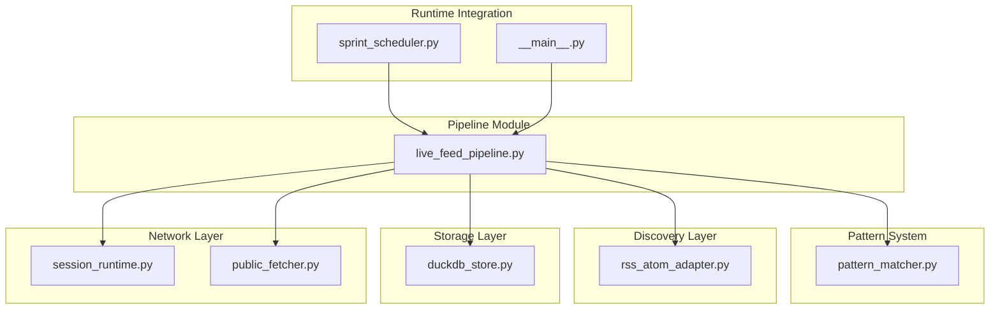
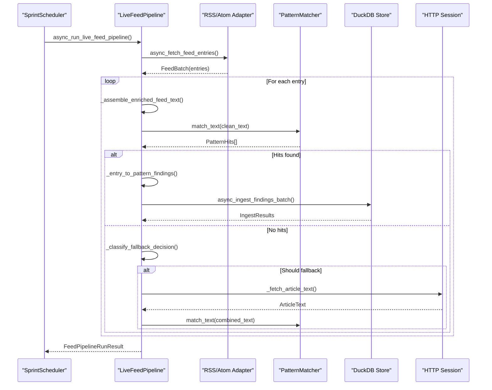
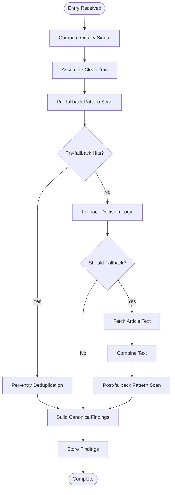
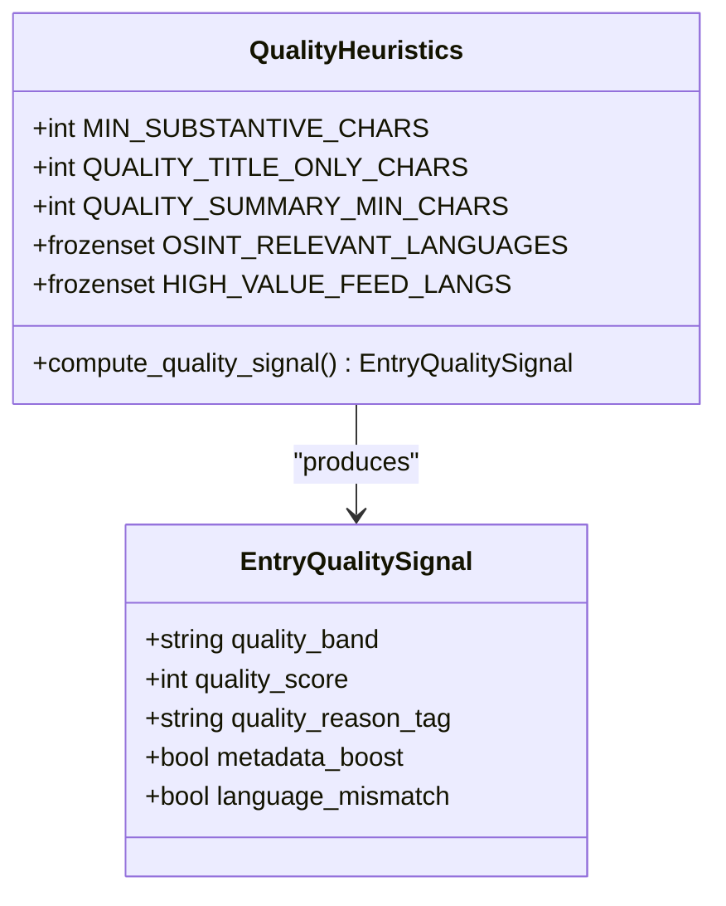
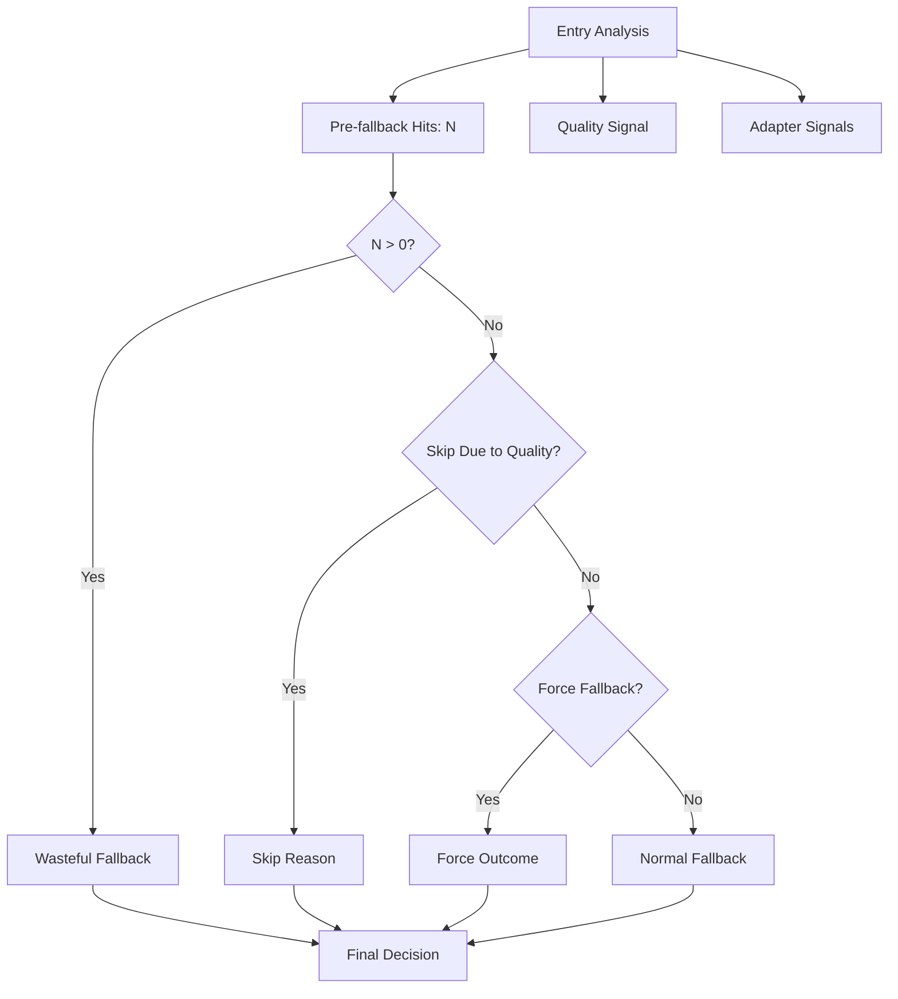
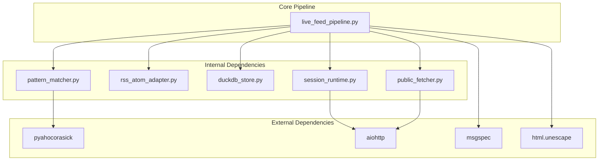

# Live Feed Pipeline

<cite>
**Referenced Files in This Document**
- [live_feed_pipeline.py](file://pipeline/live_feed_pipeline.py)
- [pattern_matcher.py](file://patterns/pattern_matcher.py)
- [rss_atom_adapter.py](file://discovery/rss_atom_adapter.py)
- [duckdb_store.py](file://knowledge/duckdb_store.py)
- [session_runtime.py](file://network/session_runtime.py)
- [public_fetcher.py](file://fetching/public_fetcher.py)
- [sprint_scheduler.py](file://runtime/sprint_scheduler.py)
- [__main__.py](file://__main__.py)
</cite>

## Table of Contents
1. [Introduction](#introduction)
2. [Project Structure](#project-structure)
3. [Core Components](#core-components)
4. [Architecture Overview](#architecture-overview)
5. [Detailed Component Analysis](#detailed-component-analysis)
6. [Dependency Analysis](#dependency-analysis)
7. [Performance Considerations](#performance-considerations)
8. [Troubleshooting Guide](#troubleshooting-guide)
9. [Conclusion](#conclusion)

## Introduction
The Live Feed Pipeline is a passive RSS/Atom feed processing system designed to generate pattern-matched findings without LLM involvement. It operates as a pure pattern-backing pipeline that ingests feed URLs, normalizes entries, extracts and enriches text, performs pattern scanning, applies deduplication, and stores findings. The pipeline emphasizes determinism, quality signaling, and economic decision-making to guide scheduling and resource allocation.

Key characteristics:
- Passive-only operation with no autonomous orchestration or LLM involvement
- PatternMatcher-driven scanning with configurable pattern registries
- Quality signal computation for routing and observability
- Fallback decision logic to determine when article enrichment is beneficial
- Economic analysis to guide feed branch scheduling and budget allocation
- Comprehensive observability and diagnostics for zero-signal scenarios

## Project Structure
The Live Feed Pipeline resides in the pipeline module and integrates with several supporting systems:



**Diagram sources**
- [live_feed_pipeline.py:1754-2385](file://pipeline/live_feed_pipeline.py#L1754-L2385)
- [pattern_matcher.py:619-740](file://patterns/pattern_matcher.py#L619-L740)
- [rss_atom_adapter.py](file://discovery/rss_atom_adapter.py)
- [duckdb_store.py](file://knowledge/duckdb_store.py)
- [session_runtime.py](file://network/session_runtime.py)
- [public_fetcher.py](file://fetching/public_fetcher.py)
- [sprint_scheduler.py:477-480](file://runtime/sprint_scheduler.py#L477-L480)
- [__main__.py:1574-1660](file://__main__.py#L1574-L1660)

**Section sources**
- [live_feed_pipeline.py:1-29](file://pipeline/live_feed_pipeline.py#L1-L29)
- [live_feed_pipeline.py:1754-2385](file://pipeline/live_feed_pipeline.py#L1754-L2385)

## Core Components
The Live Feed Pipeline consists of several core components that work together to process RSS/Atom feeds:

### Entry Quality Signal System
The pipeline computes lightweight quality signals for each entry using metadata heuristics:
- Text substance assessment (minimum character thresholds)
- Metadata boost detection (author, feed title, language alignment)
- Language mismatch detection against OSINT-relevant languages
- Adapter quality score integration for spam/downgrade mitigation

### Pattern Matching Engine
Powered by the PatternMatcher singleton with pyahocorasick backend:
- Configurable pattern registries with bootstrap defaults
- Case-insensitive literal matching with word-boundary support
- Regex post-processing for structured entity extraction
- High-precision IOC coverage for OSINT use cases

### Fallback Decision Logic
Structured decision-making system that evaluates when article fallback is beneficial:
- Pre-fallback hits analysis
- Quality signal assessment
- Adapter-derived priorities
- Forced fallback scenarios for metadata/content mismatches
- Economic value tracking (useful vs waste)

### Economic Analysis Framework
Comprehensive economic evaluation for feed branch scheduling:
- Yield ratios between feed-native and fallback sources
- Waste rate calculations
- Confidence scoring with adapter adjustments
- Next-action recommendations
- Budget optimization guidance

**Section sources**
- [live_feed_pipeline.py:78-193](file://pipeline/live_feed_pipeline.py#L78-L193)
- [live_feed_pipeline.py:1217-1228](file://pipeline/live_feed_pipeline.py#L1217-L1228)
- [live_feed_pipeline.py:322-487](file://pipeline/live_feed_pipeline.py#L322-L487)
- [live_feed_pipeline.py:538-693](file://pipeline/live_feed_pipeline.py#L538-L693)

## Architecture Overview
The Live Feed Pipeline follows a structured processing flow from feed ingestion to finding storage:



**Diagram sources**
- [live_feed_pipeline.py:1754-2385](file://pipeline/live_feed_pipeline.py#L1754-L2385)
- [rss_atom_adapter.py](file://discovery/rss_atom_adapter.py)
- [pattern_matcher.py:643-740](file://patterns/pattern_matcher.py#L643-L740)
- [duckdb_store.py](file://knowledge/duckdb_store.py)

## Detailed Component Analysis

### Entry Processing Pipeline
The core entry processing involves multiple stages of text assembly and pattern matching:



**Diagram sources**
- [live_feed_pipeline.py:1513-1734](file://pipeline/live_feed_pipeline.py#L1513-L1734)
- [live_feed_pipeline.py:1601-1683](file://pipeline/live_feed_pipeline.py#L1601-L1683)

### Quality Signal Computation
The quality signal system uses multiple heuristics to assess entry quality:



**Diagram sources**
- [live_feed_pipeline.py:78-193](file://pipeline/live_feed_pipeline.py#L78-L193)

### Fallback Decision System
The fallback decision logic evaluates multiple factors to determine enrichment value:



**Diagram sources**
- [live_feed_pipeline.py:341-487](file://pipeline/live_feed_pipeline.py#L341-L487)

### Economic Analysis Framework
The pipeline tracks economic metrics to guide scheduling decisions:

```mermaid
graph TB
subgraph "Feed Economics Metrics"
RichFeed[Feed-native Findings]
FallbackFindings[Fallback Findings]
UsefulFallback[Useful Fallback Count]
WasteFallback[Waste Fallback Count]
end
subgraph "Calculations"
YieldRatio[Rich/Total Yield Ratio]
ValueRatio[Useful/(Useful+Waste)]
Confidence[Confidence Score]
NextAction[Next Action Recommendation]
end
RichFeed --> YieldRatio
FallbackFindings --> YieldRatio
UsefulFallback --> ValueRatio
WasteFallback --> ValueRatio
YieldRatio --> Confidence
ValueRatio --> Confidence
Confidence --> NextAction
```

**Diagram sources**
- [live_feed_pipeline.py:538-693](file://pipeline/live_feed_pipeline.py#L538-L693)
- [live_feed_pipeline.py:696-723](file://pipeline/live_feed_pipeline.py#L696-L723)

**Section sources**
- [live_feed_pipeline.py:1513-1734](file://pipeline/live_feed_pipeline.py#L1513-L1734)
- [live_feed_pipeline.py:341-487](file://pipeline/live_feed_pipeline.py#L341-L487)
- [live_feed_pipeline.py:538-723](file://pipeline/live_feed_pipeline.py#L538-L723)

## Dependency Analysis
The Live Feed Pipeline has well-defined dependencies that support its passive operation:



**Diagram sources**
- [live_feed_pipeline.py:31-48](file://pipeline/live_feed_pipeline.py#L31-L48)
- [pattern_matcher.py:17-31](file://patterns/pattern_matcher.py#L17-L31)
- [session_runtime.py](file://network/session_runtime.py)

### Integration Points
The pipeline integrates with several system components:

- **PatternMatcher**: Central pattern matching engine with configurable registries
- **RSS/Atom Adapter**: Feed discovery and fetching layer
- **DuckDB Store**: Persistent storage for findings
- **Session Runtime**: HTTP client management for article fallback
- **Public Fetcher**: Character encoding and decoding utilities

**Section sources**
- [live_feed_pipeline.py:1211-1211](file://pipeline/live_feed_pipeline.py#L1211-L1211)
- [live_feed_pipeline.py:1447-1454](file://pipeline/live_feed_pipeline.py#L1447-L1454)
- [live_feed_pipeline.py:2197-2203](file://pipeline/live_feed_pipeline.py#L2197-L2203)

## Performance Considerations
The Live Feed Pipeline implements several performance optimizations:

### Concurrency Control
- Bounded pattern scanning concurrency (default: 4 tasks)
- Semaphore-based pattern offloading
- Async I/O for network operations
- Timeout management for all external operations

### Memory Management
- Hard caps on processed text sizes
- Bounded sample captures for observability
- Efficient deduplication using sets and frozen sets
- Memory-safe HTML processing with defensive fallbacks

### Processing Optimizations
- Lazy pattern matcher building
- Case-insensitive matching with single text normalization
- Word-boundary enforcement for precise matching
- Structured entity extraction via regex post-processing

**Section sources**
- [live_feed_pipeline.py:54-56](file://pipeline/live_feed_pipeline.py#L54-L56)
- [live_feed_pipeline.py:209-214](file://pipeline/live_feed_pipeline.py#L209-L214)
- [live_feed_pipeline.py:1236-1255](file://pipeline/live_feed_pipeline.py#L1236-L1255)
- [pattern_matcher.py:788-800](file://patterns/pattern_matcher.py#L788-L800)

## Troubleshooting Guide

### Common Issues and Resolutions

#### Zero Signal Scenarios
The pipeline provides comprehensive diagnostics for zero-signal runs:
- **Empty Registry**: No patterns configured in PatternMatcher
- **Empty Fetch**: No entries received from adapter
- **Content Empty**: Assembled text was empty despite substantive metadata
- **No Pattern Hits**: Content present but no pattern matches found
- **Findings Build Loss**: Hits found but filtered by per-entry dedup

#### Error Handling Patterns
The pipeline implements fail-soft error handling:
- UMA emergency state detection and graceful abort
- Granular error categorization for upstream failures
- Partial result preservation during storage exceptions
- Timeout handling with structured error reporting

#### Performance Issues
Common performance bottlenecks and solutions:
- **High Memory Usage**: Adjust MAX_FEED_TEXT_CHARS and sample limits
- **Slow Pattern Matching**: Optimize pattern registry size and complexity
- **Network Latency**: Tune timeouts and fallback strategies
- **Storage Backpressure**: Monitor DuckDB ingestion rates and adjust concurrency

**Section sources**
- [live_feed_pipeline.py:490-533](file://pipeline/live_feed_pipeline.py#L490-L533)
- [live_feed_pipeline.py:1741-1749](file://pipeline/live_feed_pipeline.py#L1741-L1749)
- [live_feed_pipeline.py:1832-1888](file://pipeline/live_feed_pipeline.py#L1832-L1888)

## Conclusion
The Live Feed Pipeline represents a robust, efficient system for passive RSS/Atom feed processing. Its design emphasizes determinism, quality signaling, and economic decision-making while maintaining strict separation from LLM-based approaches. The pipeline's comprehensive observability, structured fallback logic, and economic analysis provide operators with actionable insights for feed scheduling and resource allocation.

Key strengths include:
- Pure pattern-matching approach with configurable registries
- Comprehensive quality and economic analysis
- Structured fallback decision logic
- Robust error handling and diagnostics
- Efficient memory and concurrency management

The system is well-suited for continuous monitoring of security-focused feeds while providing the flexibility to adapt pattern registries and economic parameters based on operational requirements.