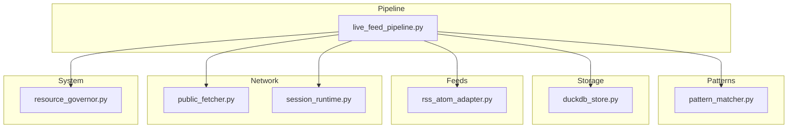
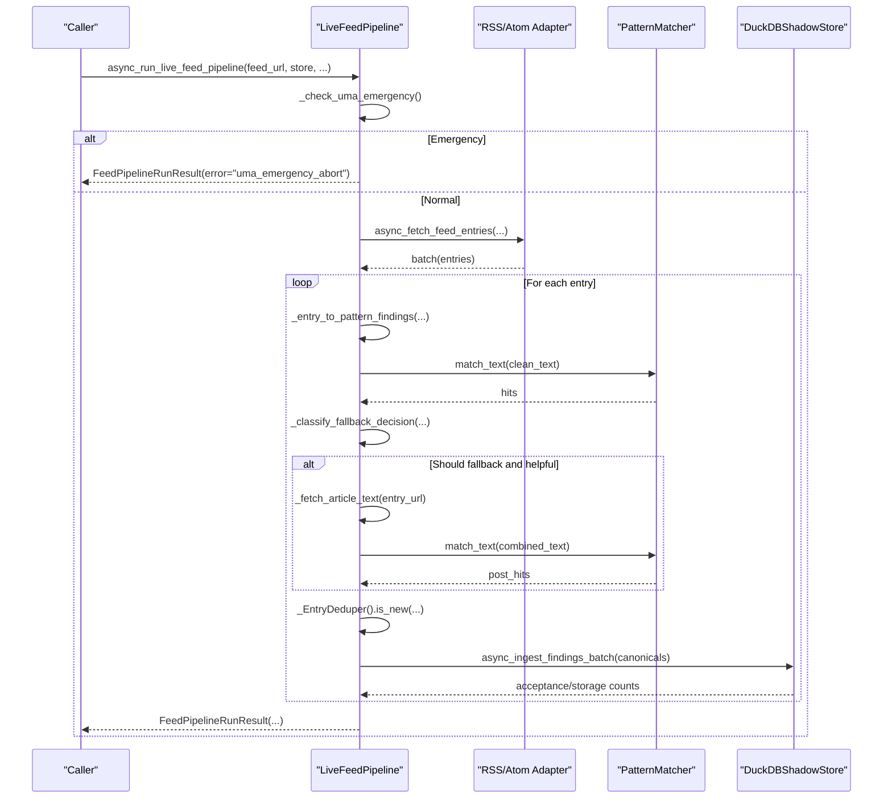
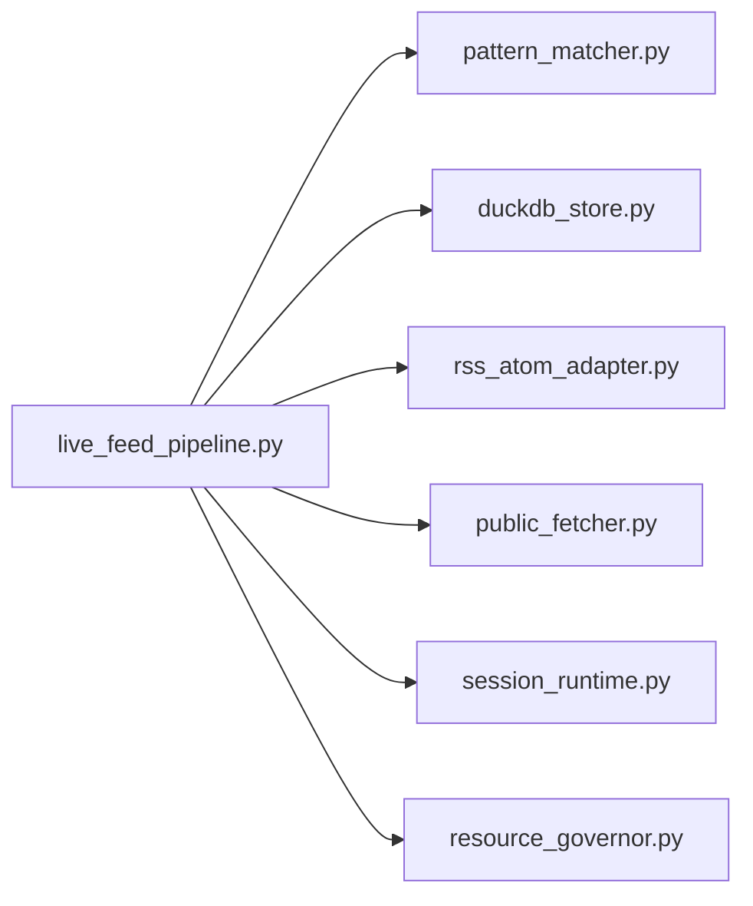

# Live Feed Pipeline

<cite>
**Referenced Files in This Document**
- [live_feed_pipeline.py](file://pipeline/live_feed_pipeline.py)
- [pattern_matcher.py](file://patterns/pattern_matcher.py)
- [duckdb_store.py](file://knowledge/duckdb_store.py)
- [rss_atom_adapter.py](file://discovery/rss_atom_adapter.py)
- [public_fetcher.py](file://fetching/public_fetcher.py)
- [resource_governor.py](file://core/resource_governor.py)
- [session_runtime.py](file://network/session_runtime.py)
</cite>

## Table of Contents
1. [Introduction](#introduction)
2. [Project Structure](#project-structure)
3. [Core Components](#core-components)
4. [Architecture Overview](#architecture-overview)
5. [Detailed Component Analysis](#detailed-component-analysis)
6. [Dependency Analysis](#dependency-analysis)
7. [Performance Considerations](#performance-considerations)
8. [Troubleshooting Guide](#troubleshooting-guide)
9. [Conclusion](#conclusion)
10. [Appendices](#appendices)

## Introduction
The Live Feed Pipeline system processes RSS/Atom feeds to discover OSINT findings through pattern matching. It ingests feed URLs, normalizes entries, converts HTML to text safely, scans for structured patterns, and stores canonical findings. The pipeline emphasizes determinism, metadata-aware quality routing, bounded concurrency, and economic analysis to guide next actions.

## Project Structure
The Live Feed Pipeline centers around a single module orchestrating feed ingestion, text processing, pattern scanning, and storage. Supporting components include:
- PatternMatcher: AHO-Corasick-based pattern registry and scanner
- DuckDBShadowStore: Canonical storage for findings with quality gating
- RSS/Atom adapter: Fetches and parses feed entries
- Public fetcher: Provides fallback decoding utilities
- Resource governor: UMA integration for emergency aborts
- Session runtime: HTTP client for article fallback

**Diagram sources**
- [live_feed_pipeline.py:1767-2399](file://pipeline/live_feed_pipeline.py#L1767-L2399)
- [pattern_matcher.py:619-800](file://patterns/pattern_matcher.py#L619-L800)
- [duckdb_store.py:643-800](file://knowledge/duckdb_store.py#L643-L800)
- [rss_atom_adapter.py](file://discovery/rss_atom_adapter.py)
- [public_fetcher.py](file://fetching/public_fetcher.py)
- [resource_governor.py](file://core/resource_governor.py)
- [session_runtime.py](file://network/session_runtime.py)

**Section sources**
- [live_feed_pipeline.py:1-299](file://pipeline/live_feed_pipeline.py#L1-L299)
- [pattern_matcher.py:1-80](file://patterns/pattern_matcher.py#L1-L80)
- [duckdb_store.py:1-80](file://knowledge/duckdb_store.py#L1-L80)

## Core Components
- Feed ingestion and parsing: Fetches entries from RSS/Atom sources with timeout and byte limits.
- Text normalization: Strips HTML safely, unescapes entities, and builds enriched text prioritizing rich content.
- Pattern scanning: Offloads AHO-Corasick scanning to threads with bounded concurrency.
- Quality routing: Computes lightweight entry quality signals for metadata-aware routing.
- Fallback decision: Structured classification of article fallback necessity and outcomes.
- Economic analysis: Tracks feed-native vs fallback yields, waste ratios, and next-action recommendations.
- Deduplication: Per-run and per-entry deduplication strategies.
- Storage integration: Quality-gated ingestion into DuckDBShadowStore with acceptance and storage counters.

**Section sources**
- [live_feed_pipeline.py:58-310](file://pipeline/live_feed_pipeline.py#L58-L310)
- [live_feed_pipeline.py:880-1081](file://pipeline/live_feed_pipeline.py#L880-L1081)
- [live_feed_pipeline.py:1244-1268](file://pipeline/live_feed_pipeline.py#L1244-L1268)
- [live_feed_pipeline.py:318-488](file://pipeline/live_feed_pipeline.py#L318-L488)
- [live_feed_pipeline.py:535-723](file://pipeline/live_feed_pipeline.py#L535-L723)
- [live_feed_pipeline.py:1199-1241](file://pipeline/live_feed_pipeline.py#L1199-L1241)
- [live_feed_pipeline.py:1767-2399](file://pipeline/live_feed_pipeline.py#L1767-L2399)
- [duckdb_store.py:148-224](file://knowledge/duckdb_store.py#L148-L224)

## Architecture Overview
The pipeline follows a deterministic, fail-soft design:
- UMA emergency check at run start
- Fetch entries from feed source
- For each entry: assemble text → scan patterns → classify fallback → enrich if needed → deduplicate → store
- Aggregate observability and economic metrics

**Diagram sources**
- [live_feed_pipeline.py:1767-2399](file://pipeline/live_feed_pipeline.py#L1767-L2399)
- [rss_atom_adapter.py](file://discovery/rss_atom_adapter.py)
- [pattern_matcher.py:643-740](file://patterns/pattern_matcher.py#L643-L740)
- [duckdb_store.py:643-800](file://knowledge/duckdb_store.py#L643-L800)

## Detailed Component Analysis

### Feed URL Ingestion and Entry Normalization
- Fetches up to a bounded number of entries with timeout and byte limits.
- Parses feed metadata (title, summary, rich content, author, language).
- Computes entry quality signals before text assembly to guide routing and fallback decisions.

Key behaviors:
- Granular upstream blocker classification from adapter errors.
- Per-run dedup by entry_url to avoid reprocessing.
- Deterministic timestamp handling.

**Section sources**
- [live_feed_pipeline.py:1820-1946](file://pipeline/live_feed_pipeline.py#L1820-L1946)
- [live_feed_pipeline.py:1948-2021](file://pipeline/live_feed_pipeline.py#L1948-L2021)
- [live_feed_pipeline.py:1166-1174](file://pipeline/live_feed_pipeline.py#L1166-L1174)

### HTML-to-Text Conversion with Word-Boundary Safety
- Strips script/style blocks first, then tags, normalizes whitespace, and unescapes entities after tag removal.
- Rich content conversion optionally uses markdownify when available, falling back to tag stripping.
- Minimum substantive thresholds ensure only meaningful content is used for pattern scanning.

Safety invariants:
- Order: remove script/style → strip tags → normalize whitespace → unescape.
- Rich content minimum length prevents noise from tiny HTML fragments.

**Section sources**
- [live_feed_pipeline.py:880-951](file://pipeline/live_feed_pipeline.py#L880-L951)
- [live_feed_pipeline.py:953-1004](file://pipeline/live_feed_pipeline.py#L953-L1004)
- [live_feed_pipeline.py:1006-1081](file://pipeline/live_feed_pipeline.py#L1006-L1081)

### Pattern Scanning Architecture
- Uses AHO-Corasick automaton with case-insensitive matching and optional word-boundary enforcement.
- Registry is bootstrapped with OSINT-focused literals and extended with structured regex post-processing.
- Scanning is offloaded to threads with a shared semaphore limiting concurrent tasks.

Concurrency control:
- Global semaphore with bounded tasks to prevent resource exhaustion.
- Fail-soft handling of pattern matcher failures.

**Section sources**
- [pattern_matcher.py:619-800](file://patterns/pattern_matcher.py#L619-L800)
- [live_feed_pipeline.py:1244-1268](file://pipeline/live_feed_pipeline.py#L1244-L1268)

### Entry Quality Signal Computation
- Computes a 0–100 quality score based on text length, metadata presence, and language alignment.
- Downgrades quality for adapter-detected spam/low-quality content.
- Produces a quality band and reason tags for observability.

Routing implications:
- Metadata boosts and language match increase perceived value.
- Adapter quality score influences final band to avoid cascading downgrades.

**Section sources**
- [live_feed_pipeline.py:78-194](file://pipeline/live_feed_pipeline.py#L78-L194)

### Metadata-Aware Routing and Fallback Decision Classification
- Structured fallback decision consolidates multiple heuristics into a single classification.
- Decision tree considers pre-fallback hits, quality, adapter signals, and metadata/content mismatch.
- Tracks whether fallback was forced, wasteful, helpful, or skipped.

Fallback outcomes:
- Forced fallback due to metadata/content mismatch.
- Helpful fallback producing new findings.
- Wasteful fallback when feed-native already had hits.
- Skipping fallback for high-quality assembled text.

**Section sources**
- [live_feed_pipeline.py:322-488](file://pipeline/live_feed_pipeline.py#L322-L488)

### Bounded Concurrency Pattern Offloading Mechanism
- Shared semaphore limits concurrent pattern scans to a fixed number.
- Offloads scanning to threads using asyncio.to_thread with fail-soft error propagation.
- Prevents CPU-bound overload while maintaining responsiveness.

**Section sources**
- [live_feed_pipeline.py:206-214](file://pipeline/live_feed_pipeline.py#L206-L214)
- [live_feed_pipeline.py:1248-1268](file://pipeline/live_feed_pipeline.py#L1248-L1268)

### Deduplication Strategies
- Per-run dedup by entry_url to avoid reprocessing the same entry across runs.
- Per-entry dedup by (label, pattern, value) to preserve first occurrence.
- Aggregated counters track findings lost to dedup for diagnosis.

**Section sources**
- [live_feed_pipeline.py:1199-1241](file://pipeline/live_feed_pipeline.py#L1199-L1241)
- [live_feed_pipeline.py:2137-2139](file://pipeline/live_feed_pipeline.py#L2137-L2139)

### Storage Integration
- Finds are mapped to CanonicalFinding and ingested via DuckDBShadowStore.
- Acceptance and storage are tracked separately: accepted reflects quality-gated pass, stored reflects successful DuckDB write.
- Quality gates include entropy checks and persistent duplicate detection.

**Section sources**
- [live_feed_pipeline.py:2207-2247](file://pipeline/live_feed_pipeline.py#L2207-L2247)
- [duckdb_store.py:148-224](file://knowledge/duckdb_store.py#L148-L224)

### Economic Analysis Features
- Feed branch evaluation tracks whether feed-native or fallback produced findings.
- Measures waste ratios, value ratios, and squandered high-usefulness entries.
- Computes next action recommendations and confidence annotations.
- Provides dict-style verdicts with actionable signals for scheduler/exporter.

**Section sources**
- [live_feed_pipeline.py:535-723](file://pipeline/live_feed_pipeline.py#L535-L723)
- [live_feed_pipeline.py:725-775](file://pipeline/live_feed_pipeline.py#L725-L775)
- [live_feed_pipeline.py:2329-2396](file://pipeline/live_feed_pipeline.py#L2329-L2396)

## Dependency Analysis
The pipeline exhibits clear layering:
- Control plane: live_feed_pipeline orchestrates steps and aggregates results.
- Pattern intelligence: pattern_matcher provides the scanning engine.
- Storage: duckdb_store manages canonical ingestion and quality gating.
- Network/runtime: session_runtime supplies HTTP client for fallback.
- System integration: resource_governor provides UMA state for fail-soft aborts.

**Diagram sources**
- [live_feed_pipeline.py:1767-2399](file://pipeline/live_feed_pipeline.py#L1767-L2399)
- [pattern_matcher.py:619-800](file://patterns/pattern_matcher.py#L619-L800)
- [duckdb_store.py:643-800](file://knowledge/duckdb_store.py#L643-L800)
- [rss_atom_adapter.py](file://discovery/rss_atom_adapter.py)
- [public_fetcher.py](file://fetching/public_fetcher.py)
- [session_runtime.py](file://network/session_runtime.py)
- [resource_governor.py](file://core/resource_governor.py)

**Section sources**
- [live_feed_pipeline.py:1767-2399](file://pipeline/live_feed_pipeline.py#L1767-L2399)
- [pattern_matcher.py:619-800](file://patterns/pattern_matcher.py#L619-L800)
- [duckdb_store.py:643-800](file://knowledge/duckdb_store.py#L643-L800)

## Performance Considerations
- Concurrency: Limit pattern scanning threads to balance throughput and resource usage.
- Text caps: Enforce maximum assembled text length to bound memory and scanning time.
- Decoding: Use efficient decoding with replacement counting to maintain charset truth.
- Quality gates: Early filtering reduces downstream processing overhead.
- Observability: Sample captures and counters enable targeted optimization.

[No sources needed since this section provides general guidance]

## Troubleshooting Guide
Common issues and handling patterns:
- UMA emergency abort: Pipeline returns with error indicating emergency state.
- Fetch errors: Granular classification of upstream blockers (XML parse, content type, redirect, DNS, connection, robots, HTTP errors).
- Pattern scan failures: Fail-soft with runtime error propagation.
- Store exceptions: Partial acceptance and storage counts preserved; error recorded for diagnosis.
- Zero-signal scenarios: Signal-stage diagnosis distinguishes empty fetch, content empty, no pattern hits, findings build loss, and empty registry.

**Section sources**
- [live_feed_pipeline.py:1804-1818](file://pipeline/live_feed_pipeline.py#L1804-L1818)
- [live_feed_pipeline.py:1844-1900](file://pipeline/live_feed_pipeline.py#L1844-L1900)
- [live_feed_pipeline.py:1844-1946](file://pipeline/live_feed_pipeline.py#L1844-L1946)
- [live_feed_pipeline.py:1703-1704](file://pipeline/live_feed_pipeline.py#L1703-L1704)
- [live_feed_pipeline.py:2233-2240](file://pipeline/live_feed_pipeline.py#L2233-L2240)
- [live_feed_pipeline.py:498-532](file://pipeline/live_feed_pipeline.py#L498-L532)

## Conclusion
The Live Feed Pipeline provides a robust, deterministic, and observable system for discovering OSINT findings from RSS/Atom feeds. Its metadata-aware quality routing, structured fallback decisions, bounded concurrency, and economic analysis enable efficient and informed scheduling. Integration with DuckDBShadowStore ensures quality-gated, persistent storage with comprehensive observability.

[No sources needed since this section summarizes without analyzing specific files]

## Appendices

### Configuration Options
- Feed processing limits:
  - max_entries: Upper bound for entries processed per run
  - timeout_s: Feed fetch timeout
  - max_bytes: Maximum bytes to fetch
- Pattern task concurrency:
  - MAX_FEED_PATTERN_TASKS: Semaphore limit for concurrent pattern scans
- Quality thresholds:
  - MIN_SUBSTANTIVE_CHARS: Minimum text length for substantive content
  - QUALITY_TITLE_ONLY_CHARS: Threshold for title-only quality
  - QUALITY_SUMMARY_MIN_CHARS: Minimum summary length for quality
  - MIN_ARTICLE_FALLBACK_CHARS: Threshold for triggering article fallback
  - MAX_FEED_TEXT_CHARS: Cap on assembled text length
  - FEED_PAYLOAD_CONTEXT_CHARS: Radius for payload context extraction

**Section sources**
- [live_feed_pipeline.py:54-56](file://pipeline/live_feed_pipeline.py#L54-L56)
- [live_feed_pipeline.py:63-69](file://pipeline/live_feed_pipeline.py#L63-L69)
- [live_feed_pipeline.py:1367-1374](file://pipeline/live_feed_pipeline.py#L1367-L1374)
- [live_feed_pipeline.py:54-56](file://pipeline/live_feed_pipeline.py#L54-L56)
- [live_feed_pipeline.py:1275-1316](file://pipeline/live_feed_pipeline.py#L1275-L1316)

### Example Execution Flow
- Initialize pipeline with feed URL and optional store.
- Fetch entries from adapter with bounded parameters.
- For each entry: assemble text, scan patterns, classify fallback, enrich if helpful, deduplicate, and store.
- Aggregate observability and economic metrics.

**Section sources**
- [live_feed_pipeline.py:1767-2399](file://pipeline/live_feed_pipeline.py#L1767-L2399)

### Error Handling Patterns
- UMA emergency: Abort run early with error.
- Fetch-level errors: Classify blockers and propagate root cause.
- Pattern scan failures: Raise runtime error with context.
- Store exceptions: Preserve partial acceptance/storage counts and record error.

**Section sources**
- [live_feed_pipeline.py:1804-1818](file://pipeline/live_feed_pipeline.py#L1804-L1818)
- [live_feed_pipeline.py:1844-1900](file://pipeline/live_feed_pipeline.py#L1844-L1900)
- [live_feed_pipeline.py:1703-1704](file://pipeline/live_feed_pipeline.py#L1703-L1704)
- [live_feed_pipeline.py:2233-2240](file://pipeline/live_feed_pipeline.py#L2233-L2240)

### Performance Optimization Techniques
- Tune MAX_FEED_PATTERN_TASKS to match available CPU cores.
- Monitor assembled text lengths and adjust MAX_FEED_TEXT_CHARS.
- Use adapter signals to reduce fallback attempts on high-quality entries.
- Leverage sample captures to focus optimization on high-yield entries.

[No sources needed since this section provides general guidance]