# Live Public Pipeline

<cite>
**Referenced Files in This Document**
- [live_public_pipeline.py](file://pipeline/live_public_pipeline.py)
- [live_feed_pipeline.py](file://pipeline/live_feed_pipeline.py)
- [duckduckgo_adapter.py](file://discovery/duckduckgo_adapter.py)
- [public_fetcher.py](file://fetching/public_fetcher.py)
- [pattern_matcher.py](file://patterns/pattern_matcher.py)
- [duckdb_store.py](file://knowledge/duckdb_store.py)
- [sprint_scheduler.py](file://runtime/sprint_scheduler.py)
- [live_measurement_next_action.py](file://benchmarks/live_measurement_next_action.py)
- [live_result_sanity.py](file://tools/live_result_sanity.py)
- [research_quality_score.py](file://tools/research_quality_score.py)
- [monitoring_coordinator.py](file://coordinators/monitoring_coordinator.py)
</cite>

## Table of Contents
1. [Introduction](#introduction)
2. [Project Structure](#project-structure)
3. [Core Components](#core-components)
4. [Architecture Overview](#architecture-overview)
5. [Detailed Component Analysis](#detailed-component-analysis)
6. [Dependency Analysis](#dependency-analysis)
7. [Performance Considerations](#performance-considerations)
8. [Troubleshooting Guide](#troubleshooting-guide)
9. [Conclusion](#conclusion)
10. [Appendices](#appendices)

## Introduction
The Live Public Pipeline is a passive, pattern-driven OSINT acquisition system that discovers public web content, fetches and parses HTML, enriches text with discovery metadata, scans for structured indicators using a high-performance pattern matcher, builds canonical findings, and stores them in a durable analytics store. It operates without LLMs, agents, or new storage schemas, emphasizing lightweight heuristics, bounded concurrency, and strict observability. It integrates with the broader research workflow by complementing the feed pipeline and informing scheduling decisions.

## Project Structure
The Live Public Pipeline is organized around a single module that orchestrates discovery, fetching, parsing, pattern scanning, quality control, and storage. Supporting modules provide discovery adapters, fetchers, pattern matching, and storage.

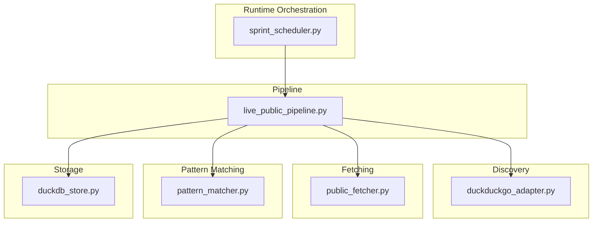

**Diagram sources**
- [live_public_pipeline.py:1-120](file://pipeline/live_public_pipeline.py#L1-L120)
- [duckduckgo_adapter.py:1-120](file://discovery/duckduckgo_adapter.py#L1-L120)
- [public_fetcher.py:1-120](file://fetching/public_fetcher.py#L1-L120)
- [pattern_matcher.py:1-120](file://patterns/pattern_matcher.py#L1-L120)
- [duckdb_store.py:1-120](file://knowledge/duckdb_store.py#L1-L120)
- [sprint_scheduler.py:3935-3950](file://runtime/sprint_scheduler.py#L3935-L3950)

**Section sources**
- [live_public_pipeline.py:1-120](file://pipeline/live_public_pipeline.py#L1-L120)
- [sprint_scheduler.py:3935-3950](file://runtime/sprint_scheduler.py#L3935-L3950)

## Core Components
- Discovery integration: DuckDuckGo adapter provides discovery results with typed DTOs and error classification.
- Fetching: Public fetcher performs passive, bounded HTTP fetching with optional Tor/I2P/stealth and JS renderer fallback.
- Content processing: HTML-to-text extraction with lightweight parser, metadata enrichment, and bounded text caps.
- Pattern matching: High-throughput Aho–Corasick matcher with configurable registry and offloaded scanning.
- Quality control: Heuristics-based page quality scoring, adaptive fetch budgets, and pre-fetch gates.
- Deduplication: Deterministic finding IDs and per-run deduplication strategies.
- Storage: Canonical findings recorded into DuckDB shadow store with durability and async APIs.
- Observability: Extensive telemetry on discovery, fetch, acceptance, and terminal outcomes.

**Section sources**
- [live_public_pipeline.py:451-643](file://pipeline/live_public_pipeline.py#L451-L643)
- [duckduckgo_adapter.py:59-120](file://discovery/duckduckgo_adapter.py#L59-L120)
- [public_fetcher.py:155-200](file://fetching/public_fetcher.py#L155-L200)
- [pattern_matcher.py:52-70](file://patterns/pattern_matcher.py#L52-L70)
- [duckdb_store.py:148-200](file://knowledge/duckdb_store.py#L148-L200)

## Architecture Overview
The pipeline follows a staged flow: discovery → fetch → parse → enrich → pattern scan → canonical finding → storage. Each stage is instrumented with telemetry and quality gates to prevent waste of compute and memory.

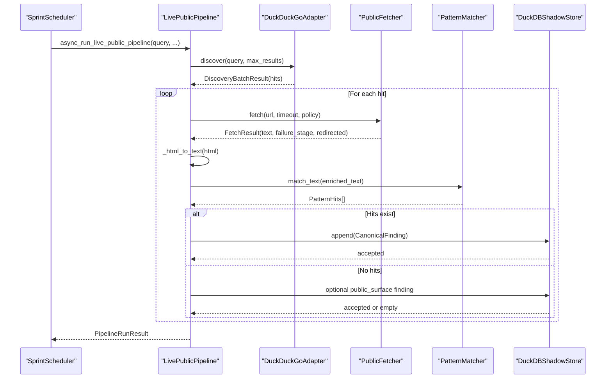

**Diagram sources**
- [sprint_scheduler.py:3935-3950](file://runtime/sprint_scheduler.py#L3935-L3950)
- [live_public_pipeline.py:1211-1604](file://pipeline/live_public_pipeline.py#L1211-L1604)
- [duckduckgo_adapter.py:87-120](file://discovery/duckduckgo_adapter.py#L87-L120)
- [public_fetcher.py:1-120](file://fetching/public_fetcher.py#L1-L120)
- [pattern_matcher.py:643-740](file://patterns/pattern_matcher.py#L643-L740)
- [duckdb_store.py:148-200](file://knowledge/duckdb_store.py#L148-L200)

## Detailed Component Analysis

### Discovery Integration (DuckDuckGo)
- Provides typed DTOs for hits and batch results.
- Classifies discovery errors into taxonomy categories for observability.
- Supports provider status telemetry and fallback triggers.

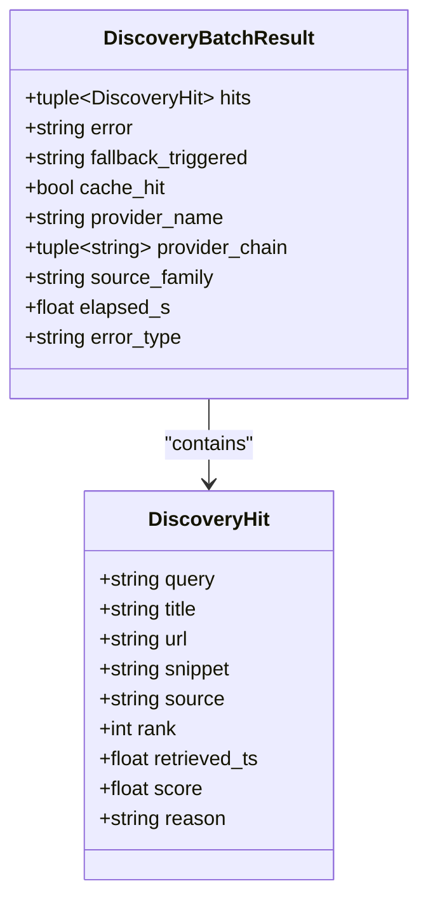

**Diagram sources**
- [duckduckgo_adapter.py:59-120](file://discovery/duckduckgo_adapter.py#L59-L120)

**Section sources**
- [duckduckgo_adapter.py:127-197](file://discovery/duckduckgo_adapter.py#L127-L197)

### Fetching and Transport Policies
- Passive, bounded fetch with optional Tor/I2P/stealth and JS renderer fallback.
- Adaptive fetch policy computed from URL class and discovery signals.
- Telemetry on transport usage and fallbacks.

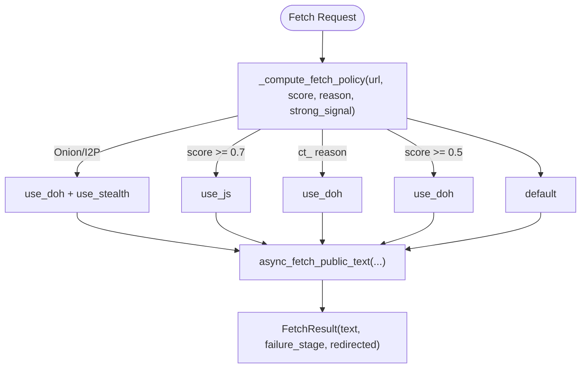

**Diagram sources**
- [live_public_pipeline.py:306-336](file://pipeline/live_public_pipeline.py#L306-L336)
- [public_fetcher.py:1-120](file://fetching/public_fetcher.py#L1-L120)

**Section sources**
- [live_public_pipeline.py:306-336](file://pipeline/live_public_pipeline.py#L306-L336)
- [public_fetcher.py:99-146](file://fetching/public_fetcher.py#L99-L146)

### Content Processing and Enrichment
- HTML-to-text extraction using a lightweight parser with defensive fallback.
- Metadata enrichment by prepending title/snippet to extracted text.
- Hard caps on text sizes to remain M1-safe.

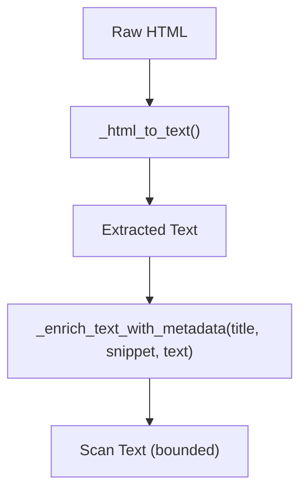

**Diagram sources**
- [live_public_pipeline.py:701-761](file://pipeline/live_public_pipeline.py#L701-L761)
- [live_public_pipeline.py:809-847](file://pipeline/live_public_pipeline.py#L809-L847)

**Section sources**
- [live_public_pipeline.py:701-761](file://pipeline/live_public_pipeline.py#L701-L761)
- [live_public_pipeline.py:809-847](file://pipeline/live_public_pipeline.py#L809-L847)

### Pattern Matching Integration
- Singleton matcher with configurable registry and Aho–Corasick backend.
- Scanning offloaded to thread executor with bounded concurrency.
- Deterministic finding IDs constructed from pipeline inputs.

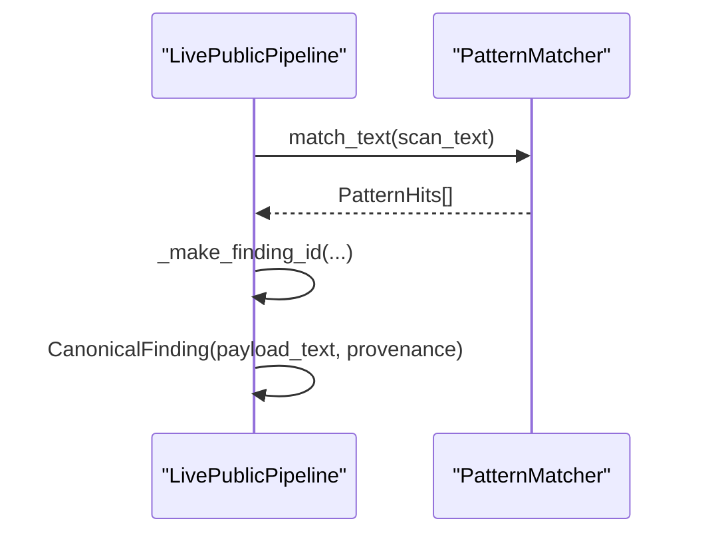

**Diagram sources**
- [pattern_matcher.py:619-740](file://patterns/pattern_matcher.py#L619-L740)
- [live_public_pipeline.py:1073-1204](file://pipeline/live_public_pipeline.py#L1073-L1204)

**Section sources**
- [pattern_matcher.py:619-740](file://patterns/pattern_matcher.py#L619-L740)
- [live_public_pipeline.py:1073-1204](file://pipeline/live_public_pipeline.py#L1073-L1204)

### Quality Control and Adaptive Budgets
- Heuristic-based page quality scoring with pre-fetch gates.
- Adaptive fetch budget multipliers based on discovery signals.
- Early skip for weak pages to conserve resources.

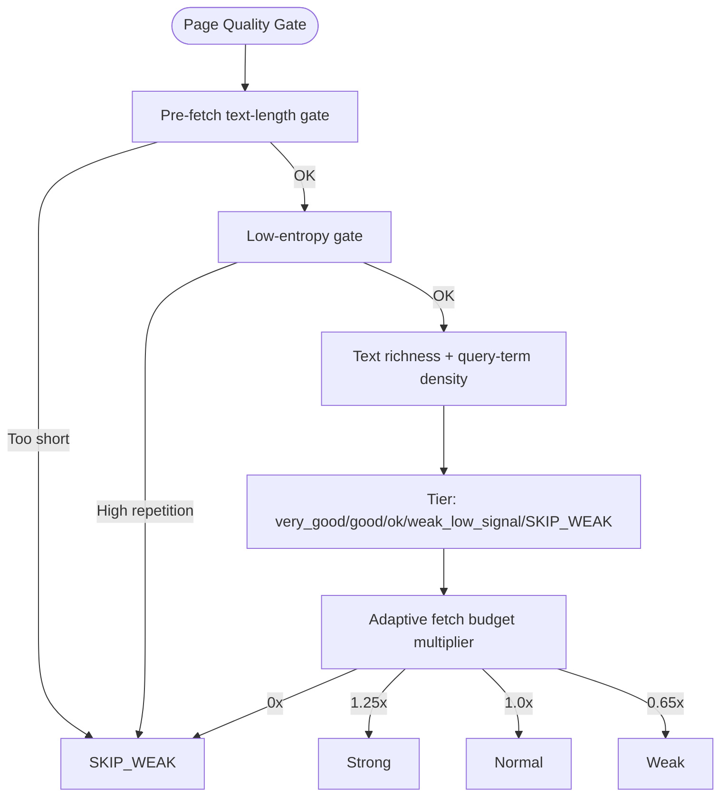

**Diagram sources**
- [live_public_pipeline.py:857-956](file://pipeline/live_public_pipeline.py#L857-L956)
- [live_public_pipeline.py:1234-1258](file://pipeline/live_public_pipeline.py#L1234-L1258)

**Section sources**
- [live_public_pipeline.py:857-956](file://pipeline/live_public_pipeline.py#L857-L956)
- [live_public_pipeline.py:1234-1258](file://pipeline/live_public_pipeline.py#L1234-L1258)

### Deduplication Strategies
- Deterministic finding IDs via SHA-256 over query, URL, label, pattern, and value.
- Public-surface findings use a separate ID scheme for content-only pages.
- Per-run deduplication ensures canonical findings are stored once.

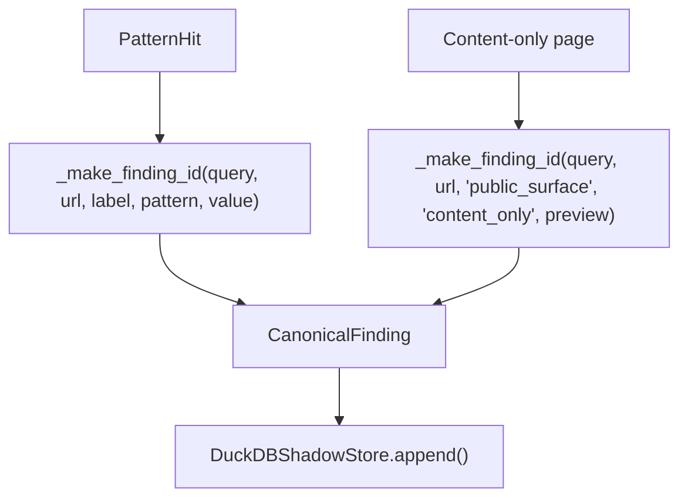

**Diagram sources**
- [live_public_pipeline.py:767-776](file://pipeline/live_public_pipeline.py#L767-L776)
- [live_public_pipeline.py:1136-1157](file://pipeline/live_public_pipeline.py#L1136-L1157)
- [duckdb_store.py:148-200](file://knowledge/duckdb_store.py#L148-L200)

**Section sources**
- [live_public_pipeline.py:767-776](file://pipeline/live_public_pipeline.py#L767-L776)
- [live_public_pipeline.py:1136-1157](file://pipeline/live_public_pipeline.py#L1136-L1157)
- [duckdb_store.py:148-200](file://knowledge/duckdb_store.py#L148-L200)

### Storage Coordination
- DuckDB shadow store provides async APIs for recording findings and run metadata.
- Batch insertion with chunking and thread-affine connections.
- CanonicalFinding DTO defines minimal required fields and optional payload.

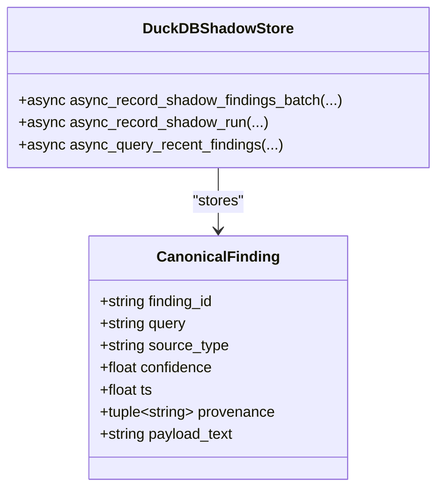

**Diagram sources**
- [duckdb_store.py:148-200](file://knowledge/duckdb_store.py#L148-L200)

**Section sources**
- [duckdb_store.py:1-120](file://knowledge/duckdb_store.py#L1-L120)
- [duckdb_store.py:148-200](file://knowledge/duckdb_store.py#L148-L200)

### Relationship Between Public and Feed Pipelines
- Public pipeline focuses on discovery-driven web pages with pattern scanning and public-surface findings.
- Feed pipeline focuses on RSS/Atom entries with entry-level quality signals and optional article fallback.
- Both pipelines share pattern matching and storage primitives, enabling complementary roles in research workflows.

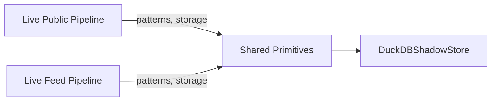

**Diagram sources**
- [live_public_pipeline.py:1-20](file://pipeline/live_public_pipeline.py#L1-L20)
- [live_feed_pipeline.py:1-30](file://pipeline/live_feed_pipeline.py#L1-L30)

**Section sources**
- [live_public_pipeline.py:1-20](file://pipeline/live_public_pipeline.py#L1-L20)
- [live_feed_pipeline.py:1-30](file://pipeline/live_feed_pipeline.py#L1-L30)

## Dependency Analysis
The Live Public Pipeline depends on discovery, fetching, pattern matching, and storage modules. Runtime orchestration coordinates pipeline execution and propagates telemetry.

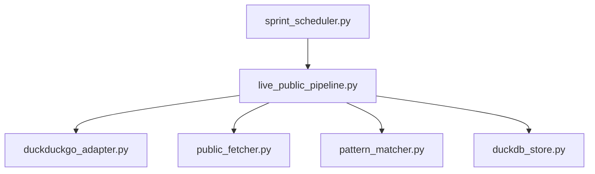

**Diagram sources**
- [live_public_pipeline.py:1-120](file://pipeline/live_public_pipeline.py#L1-L120)
- [sprint_scheduler.py:3935-3950](file://runtime/sprint_scheduler.py#L3935-L3950)

**Section sources**
- [live_public_pipeline.py:1-120](file://pipeline/live_public_pipeline.py#L1-L120)
- [sprint_scheduler.py:3935-3950](file://runtime/sprint_scheduler.py#L3935-L3950)

## Performance Considerations
- Concurrency: Pattern scanning offloaded to thread executor; fetch concurrency controlled via semaphores.
- Memory: Hard caps on extracted text and metadata; bounded payload sizes; pre-fetch text-length gate.
- Transport: Adaptive fetch budgets reduce wasted I/O on low-signal pages; JS renderer fallback used judiciously.
- Storage: Batched writes with chunking; thread-affine DB connections minimize contention.

[No sources needed since this section provides general guidance]

## Troubleshooting Guide
Common issues and diagnostic approaches:
- Discovery failures: Use discovery error taxonomy to identify timeouts, rate limits, or provider exceptions.
- Fetch timeouts or errors: Inspect failure stages and transport telemetry; adjust fetch timeouts or policies.
- Low-quality pages: Review quality tiers and pre-fetch gates; consider adjusting thresholds.
- Storage rejections: Validate CanonicalFinding fields and payload sizes; confirm DuckDB availability.
- Research quality gates: Ensure quality gate is not zeroed and counts are preserved for feed-only scenarios.

**Section sources**
- [duckduckgo_adapter.py:127-197](file://discovery/duckduckgo_adapter.py#L127-L197)
- [public_fetcher.py:1-120](file://fetching/public_fetcher.py#L1-L120)
- [live_public_pipeline.py:857-956](file://pipeline/live_public_pipeline.py#L857-L956)
- [duckdb_store.py:1-120](file://knowledge/duckdb_store.py#L1-L120)
- [live_result_sanity.py:638-656](file://tools/live_result_sanity.py#L638-L656)
- [research_quality_score.py:67-72](file://tools/research_quality_score.py#L67-L72)

## Conclusion
The Live Public Pipeline provides a robust, observability-rich system for passive discovery and pattern-driven extraction from public web sources. Its quality gates, adaptive budgets, and bounded concurrency ensure efficient resource utilization, while shared primitives enable seamless integration with feed pipelines and broader research workflows.

[No sources needed since this section summarizes without analyzing specific files]

## Appendices

### Pipeline Configuration Options
- Discovery: max_results, timeout, provider selection and status telemetry.
- Fetching: timeouts, concurrency, policy flags (use_js, use_doh, use_stealth), Tor/I2P sessions.
- Pattern matching: registry configuration, bootstrap patterns, offloading semaphore.
- Storage: batch sizes, async APIs, canonical finding schema.
- Runtime: orchestration parameters, scheduling timeouts, and telemetry propagation.

**Section sources**
- [live_public_pipeline.py:1-120](file://pipeline/live_public_pipeline.py#L1-L120)
- [duckduckgo_adapter.py:46-52](file://discovery/duckduckgo_adapter.py#L46-L52)
- [public_fetcher.py:155-200](file://fetching/public_fetcher.py#L155-L200)
- [pattern_matcher.py:619-641](file://patterns/pattern_matcher.py#L619-L641)
- [duckdb_store.py:1-120](file://knowledge/duckdb_store.py#L1-L120)
- [sprint_scheduler.py:3935-3950](file://runtime/sprint_scheduler.py#L3935-L3950)

### Examples

- Executing the public pipeline in a scheduled run:
  - The scheduler invokes the pipeline with shaped query, bounded results, and timeouts, capturing telemetry for downstream analysis.

  **Section sources**
  - [sprint_scheduler.py:3935-3950](file://runtime/sprint_scheduler.py#L3935-L3950)

- Custom source integration:
  - Discovery adapters expose typed DTOs and error taxonomy; integrate new providers by implementing compatible interfaces and updating provider selection logic.

  **Section sources**
  - [duckduckgo_adapter.py:59-120](file://discovery/duckduckgo_adapter.py#L59-L120)

- Error handling patterns:
  - Discovery errors are classified; fetch failures record failure stages; quality gates produce terminal reasons; storage rejections are surfaced in run results.

  **Section sources**
  - [duckduckgo_adapter.py:127-197](file://discovery/duckduckgo_adapter.py#L127-L197)
  - [public_fetcher.py:1-120](file://fetching/public_fetcher.py#L1-L120)
  - [live_public_pipeline.py:1211-1604](file://pipeline/live_public_pipeline.py#L1211-L1604)

- Monitoring capabilities:
  - Monitoring coordinator routes decisions to advanced, watchdog, or performance backends; pipeline telemetry supports KPI derivation and next-action recommendations.

  **Section sources**
  - [monitoring_coordinator.py:321-366](file://coordinators/monitoring_coordinator.py#L321-L366)
  - [live_measurement_next_action.py:169-187](file://benchmarks/live_measurement_next_action.py#L169-L187)