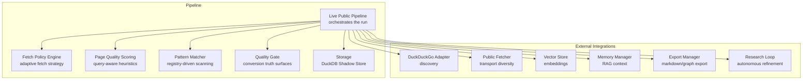
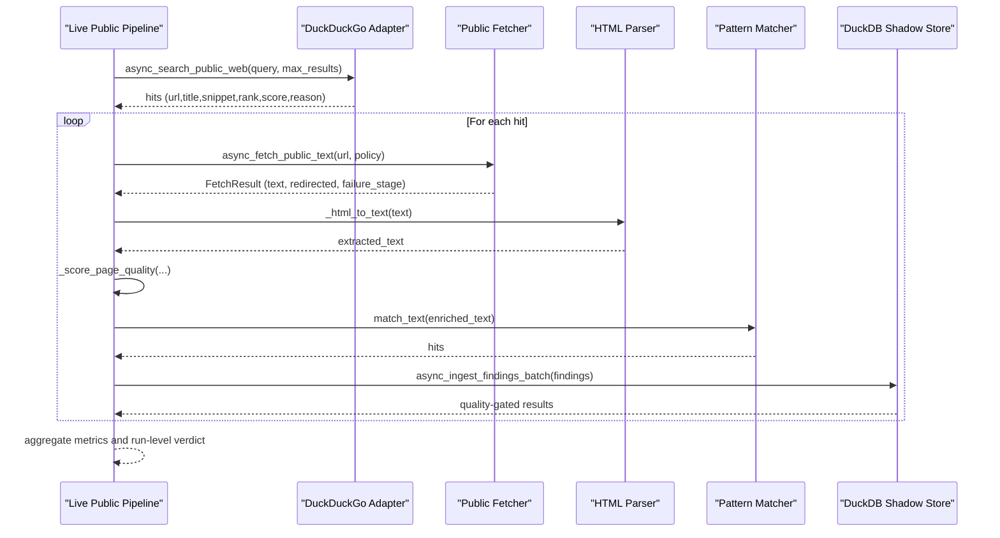
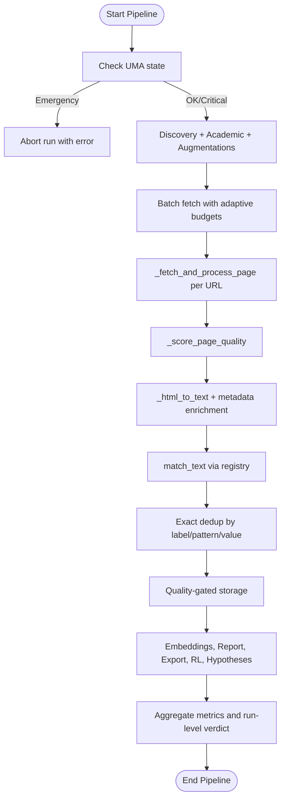
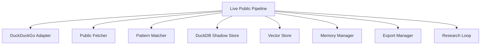

# Live Public Pipeline

<cite>
**Referenced Files in This Document**
- [live_public_pipeline.py](file://pipeline/live_public_pipeline.py)
- [public_fetcher.py](file://fetching/public_fetcher.py)
- [pattern_matcher.py](file://patterns/pattern_matcher.py)
- [duckdb_store.py](file://knowledge/duckdb_store.py)
- [duckduckgo_adapter.py](file://discovery/duckduckgo_adapter.py)
- [ct_log_scanner.py](file://network/ct_log_scanner.py)
- [commoncrawl_adapter.py](file://tools/commoncrawl_adapter.py)
- [stealth_session.py](file://stealth/stealth_session.py)
- [transport_resolver.py](file://transport/transport_resolver.py)
- [httpx_client.py](file://transport/httpx_client.py)
- [curl_cffi_transport.py](file://transport/curl_cffi_transport.py)
- [curl_cffi_fetch.py](file://transport/curl_cffi_fetch.py)
- [session_runtime.py](file://network/session_runtime.py)
- [resource_governor.py](file://core/resource_governor.py)
- [embedding_pipeline.py](file://embedding_pipeline.py)
- [brain/model_manager.py](file://brain/model_manager.py)
- [vector_store.py](file://knowledge/vector_store.py)
- [export_manager.py](file://export/export_manager.py)
- [research_loop.py](file://loops/research_loop.py)
- [memory_manager.py](file://memory/memory_manager.py)
- [graph_manager.py](file://graph/graph_manager.py)
- [pastebin_monitor.py](file://intelligence/pastebin_monitor.py)
- [github_secret_scanner.py](file://intelligence/github_secret_scanner.py)
- [academic_discovery.py](file://intelligence/academic_discovery.py)
- [layers/temporal_signal_layer.py](file://layers/temporal_signal_layer.py)
- [tot_integration.py](file://tot_integration.py)
</cite>

## Table of Contents
1. [Introduction](#introduction)
2. [Project Structure](#project-structure)
3. [Core Components](#core-components)
4. [Architecture Overview](#architecture-overview)
5. [Detailed Component Analysis](#detailed-component-analysis)
6. [Dependency Analysis](#dependency-analysis)
7. [Performance Considerations](#performance-considerations)
8. [Troubleshooting Guide](#troubleshooting-guide)
9. [Conclusion](#conclusion)

## Introduction
The Live Public Pipeline is a high-throughput, memory-conscious OSINT pipeline designed to process public web content at scale. It orchestrates discovery, fetching, content extraction, pattern matching, quality gating, and storage while maintaining strict separation of concerns and fail-safe behavior. The pipeline emphasizes:
- Lightweight HTML-to-text conversion using a custom parser
- Query-aware page quality scoring to prioritize valuable content
- Pattern matching via a dedicated matcher registry
- Quality gates that differentiate false positives, structural waste, and conversion failures
- Optional report generation, vector indexing, and research loop integration
- Robust error handling, memory management, and performance optimization

## Project Structure
The Live Public Pipeline lives in the pipeline module and integrates with several subsystems:
- Discovery: DuckDuckGo adapter for passive web search
- Fetching: Public fetcher with transport diversity (aiohttp, HTTP/2, curl_cffi, stealth)
- Extraction: HTML-to-text conversion with metadata enrichment
- Matching: Pattern registry for IOC and entity detection
- Storage: DuckDB-backed shadow store for findings
- Optional integrations: Vector store, memory manager, export, research loop, and temporal layers

**Diagram sources**
- [live_public_pipeline.py:1876-2944](file://pipeline/live_public_pipeline.py#L1876-L2944)
- [public_fetcher.py:654-1424](file://fetching/public_fetcher.py#L654-L1424)
- [pattern_matcher.py](file://patterns/pattern_matcher.py)
- [duckdb_store.py](file://knowledge/duckdb_store.py)

**Section sources**
- [live_public_pipeline.py:1876-2944](file://pipeline/live_public_pipeline.py#L1876-L2944)

## Core Components
- Live Public Pipeline: Orchestrates discovery, fetch, extract, match, store, and optional report generation. Implements adaptive fetch budgets, quality gates, and comprehensive observability.
- Public Fetcher: Provides robust, transport-diverse fetching with Tor/I2P support, stealth mode, DoH resolution, and circuit breaker integration.
- Pattern Matcher: Registry-backed matcher that scans extracted text for configured patterns and labels.
- DuckDB Shadow Store: Asynchronous ingestion and retrieval of findings with quality gating feedback.
- Quality Scoring: Query-aware heuristics to classify page value and guide fetch prioritization.
- Report Generation: Optional OSINT report creation using Hermes engine with vector search and MMR reranking.
- Memory Manager: Persistent RAG history for iterative refinement.
- Vector Store: Embedding storage for findings and page text to enable semantic search.

**Section sources**
- [live_public_pipeline.py:1876-2944](file://pipeline/live_public_pipeline.py#L1876-L2944)
- [public_fetcher.py:654-1424](file://fetching/public_fetcher.py#L654-L1424)
- [pattern_matcher.py](file://patterns/pattern_matcher.py)
- [duckdb_store.py](file://knowledge/duckdb_store.py)

## Architecture Overview
The pipeline follows a staged, asynchronous workflow:
1. Discovery: Passive web search yields candidate URLs with scores and reasons.
2. Fetch Policy: Adaptive policy selects transport and capabilities based on URL class and discovery signals.
3. Fetch: Transport-diverse fetching with retries, size caps, and access-path truth.
4. Extract: Lightweight HTML parser converts pages to text; metadata is prepended for richer scanning context.
5. Quality Score: Query-aware heuristics determine value tier and guide further processing.
6. Pattern Scan: Registry-driven matching produces findings with context windows.
7. Deduplication: Exact deduplication per label/pattern/value.
8. Storage: Quality-gated ingestion with acceptance and persistence feedback.
9. Optional: Embeddings, report generation, export, and research loop.

**Diagram sources**
- [live_public_pipeline.py:1876-2944](file://pipeline/live_public_pipeline.py#L1876-L2944)
- [public_fetcher.py:654-1424](file://fetching/public_fetcher.py#L654-L1424)
- [pattern_matcher.py](file://patterns/pattern_matcher.py)
- [duckdb_store.py](file://knowledge/duckdb_store.py)

## Detailed Component Analysis

### Live Public Pipeline Orchestration
- Entry point: async_run_live_public_pipeline(query, store, max_results, fetch_timeout_s, fetch_max_bytes, fetch_concurrency, hermes_engine, graph, memory_manager, session_id, vector_store, run_loop, rl_steps, enqueue_hypothesis_pivot)
- Key responsibilities:
  - UMA governance: respects emergency/critical states to throttle concurrency
  - Discovery orchestration: integrates DuckDuckGo and optional academic discovery
  - Augmentation: CT subdomain injection, CommonCrawl archive injection, Onion discovery scraping
  - Batch processing: per-page fetch-and-process with adaptive budgets and quality gates
  - Aggregation: comprehensive run-level metrics, public branch verdict, and zero-hit evidence
  - Optional: report generation, embeddings, export, research loop, hypothesis synthesis

**Diagram sources**
- [live_public_pipeline.py:1876-2944](file://pipeline/live_public_pipeline.py#L1876-L2944)

**Section sources**
- [live_public_pipeline.py:1876-2944](file://pipeline/live_public_pipeline.py#L1876-L2944)

### Fetch Policy Engine
- Purpose: Select optimal transport and capabilities based on URL class and discovery signals.
- Rules:
  - Very strong discovery score or strong signal → JS-capable fetch
  - Darknet URLs (.onion/.i2p/.b32.i2p) → Tor-like policy (DoH + stealth)
  - Discovery reason indicates certificate transparency → DoH
  - Moderate discovery score → DoH
  - Otherwise → default (plain fetch)
- Implementation: _compute_fetch_policy with bounded logic and no external calls.

**Section sources**
- [live_public_pipeline.py:136-167](file://pipeline/live_public_pipeline.py#L136-L167)

### HTML-to-Text Conversion and Metadata Enrichment
- Lightweight HTML parser extracts text from body-level tags, normalizes whitespace, and collapses runs of whitespace.
- Metadata enrichment: Prepends title and snippet to extracted text to improve pattern scanning recall without external dependencies.
- Hard caps: MAX_EXTRACTED_TEXT_CHARS and MAX_METADATA_PREPEND_CHARS ensure memory safety.

**Section sources**
- [live_public_pipeline.py:304-451](file://pipeline/live_public_pipeline.py#L304-L451)

### Page Quality Scoring
- Compositional heuristics:
  - Query-term density in title/snippet
  - URL structural depth
  - Text richness (avg word length and word count)
  - Discovery signal strength and reason
  - Rank bonus for top-5 results
- Early skip gates:
  - Pre-fetch text-length gate to avoid thin pages
  - Low-entropy gate to detect repetitive placeholders
- Output tiers: SKIP_WEAK, weak_low_signal, ok, good, very_good

**Section sources**
- [live_public_pipeline.py:460-559](file://pipeline/live_public_pipeline.py#L460-L559)

### Pattern Matching Workflow
- Registry-driven scanning: Uses a singleton matcher registry to scan enriched text for configured patterns.
- Context extraction: Extracts bounded context windows around hits for findings.
- Finding construction: Builds CanonicalFinding with deterministic IDs, source type, confidence, and provenance.

**Section sources**
- [live_public_pipeline.py:665-720](file://pipeline/live_public_pipeline.py#L665-L720)
- [pattern_matcher.py](file://patterns/pattern_matcher.py)

### Quality Gate and Usable Value Derivation
- Derives usable_signal, value_tier, resolution_reason, discovery_false_positive, waste_category, and structural_quality from existing page data.
- Distinguishes between structural waste (thin/dead content), signalless waste (no discovery signal), false positives (legitimate discovery but no conversion), and error-induced waste.
- Provides conversion truth surfaces for deeper diagnostics.

**Section sources**
- [live_public_pipeline.py:567-658](file://pipeline/live_public_pipeline.py#L567-L658)

### Storage Integration and Embeddings
- DuckDB Shadow Store ingestion: Acceptance and persistence feedback drive metrics and downstream decisions.
- Per-finding embeddings: Generated after quality gate using model manager lifecycle for memory discipline.
- Page text embeddings: Stored separately for semantic search and RAG context.
- Vector store integration: Adds vectors with proper dtype and shape handling.

**Section sources**
- [live_public_pipeline.py:1074-1225](file://pipeline/live_public_pipeline.py#L1074-L1225)
- [duckdb_store.py](file://knowledge/duckdb_store.py)

### Report Generation and RAG Enhancement
- Optional OSINT report generation using Hermes engine with vector search, MMR reranking, and RRF fusion.
- RAG context: Builds context from top pages and fused candidates, routes to appropriate model via MoE router.
- Report storage: Stores generated report as a CanonicalFinding with source_type='report'.

**Section sources**
- [live_public_pipeline.py:1310-1527](file://pipeline/live_public_pipeline.py#L1310-L1527)

### Research Loop Integration
- Optional autonomous refinement loop that iteratively improves findings and rewards.
- Stores RL results and maintains session history for reproducible iterations.

**Section sources**
- [live_public_pipeline.py:2628-2712](file://pipeline/live_public_pipeline.py#L2628-L2712)
- [research_loop.py](file://loops/research_loop.py)

### Hypothesis Generation and ToT Evaluation
- Generates hypotheses from real stored findings and evaluates via Tree-of-Thought (ToT) with bounded concurrency and timeouts.
- Enqueues pivots for scheduler-driven exploration.

**Section sources**
- [live_public_pipeline.py:2777-2872](file://pipeline/live_public_pipeline.py#L2777-L2872)
- [tot_integration.py](file://tot_integration.py)

### Discovery and Augmentation
- DuckDuckGo discovery: Passive web search with hits ordered by relevance.
- Academic discovery: Optional integration with academic search APIs.
- CT subdomain injection: Synthesizes high-confidence discovery hits for domain queries.
- CommonCrawl archive injection: Adds historical URLs for domain-like queries.
- Onion discovery: Scrapes .onion URLs via Tor with circuit breaker and failure limits.

**Section sources**
- [live_public_pipeline.py:1535-1873](file://pipeline/live_public_pipeline.py#L1535-L1873)
- [duckduckgo_adapter.py](file://discovery/duckduckgo_adapter.py)
- [ct_log_scanner.py](file://network/ct_log_scanner.py)
- [commoncrawl_adapter.py](file://tools/commoncrawl_adapter.py)

## Dependency Analysis
The pipeline integrates with multiple subsystems through well-defined seams and patch points:
- Discovery seam: _ASYNC_DISCOVERY_SEARCH patched to duckduckgo_adapter.async_search_public_web
- Fetch seam: _ASYNC_FETCH_PUBLIC_TEXT patched to public_fetcher.async_fetch_public_text
- Matcher seam: _SYNC_MATCH_TEXT patched to patterns.pattern_matcher.match_text
- CT scanner seam: _CT_SCANNER_GET_SUBDOMAINS patched to network.ct_log_scanner
- Graph seam: _add_pattern_hits_to_graph streams entities to graph manager

**Diagram sources**
- [live_public_pipeline.py:1266-1297](file://pipeline/live_public_pipeline.py#L1266-L1297)
- [public_fetcher.py:654-1424](file://fetching/public_fetcher.py#L654-L1424)
- [pattern_matcher.py](file://patterns/pattern_matcher.py)
- [duckdb_store.py](file://knowledge/duckdb_store.py)

**Section sources**
- [live_public_pipeline.py:1266-1297](file://pipeline/live_public_pipeline.py#L1266-L1297)

## Performance Considerations
- Concurrency control: Semaphore-based batching with UMA-aware throttling to prevent resource exhaustion.
- Adaptive fetch budgets: Multipliers adjust per-page timeouts based on discovery signals to prioritize promising pages.
- Memory management:
  - Hard caps on extracted text and metadata to bound memory usage.
  - Early skip gates (text length and entropy) to avoid expensive processing.
  - Thread executor offloading for CPU-intensive tasks (HTML parsing, pattern matching).
- Transport diversity: HTTP/2, curl_cffi, stealth, and Tor lanes with fallbacks and counters for observability.
- Model lifecycle discipline: Embedding generation wrapped in model manager lifecycle to manage GPU/MPS memory.
- Backpressure: Lightweight memory checks to slow down clearnet requests when RSS exceeds thresholds.

**Section sources**
- [live_public_pipeline.py:750-807](file://pipeline/live_public_pipeline.py#L750-L807)
- [public_fetcher.py:1082-1089](file://fetching/public_fetcher.py#L1082-L1089)
- [embedding_pipeline.py](file://embedding_pipeline.py)
- [brain/model_manager.py](file://brain/model_manager.py)

## Troubleshooting Guide
Common failure modes and diagnostics:
- Discovery blockers:
  - Backend error with no fallback: public_discovery_blocker indicates primary backend failure.
  - Fallback state mapping: primary_failed_fallback_succeeded/failed mapped to public_discovery_fallback_state.
- Fetch accessibility blockers:
  - Connection/TLS/HTTP failures: public_fetch_accessibility_blocker indicates network-level issues.
  - Dominant failure mode aggregation considers discovery blocker, accessibility blocker, redirect-induced non-content, and waste categories.
- Zero-hit evidence:
  - zero_hit_accessible_fetch_count tracks pages fetched with zero matches.
  - zero_hit_quality_reason_counts and zero_hit_title_samples provide structured summaries for gate review.
- Backend degradation:
  - backend_degraded flag detects when fetch errors dominate output, decoupling backend failures from weak content.
- Error handling:
  - Fail-soft across storage, embeddings, report generation, export, and optional integrations.
  - CancelledError propagation to avoid swallowing cancellations.

Operational tips:
- Monitor public_branch_verdict for actionable insights (next action, confidence note, temporal hints).
- Use zero_hit_summary to identify systemic issues (signalless, false positive, redirect-induced non-content).
- Inspect failure_stage and network_error_kind for precise failure classification.

**Section sources**
- [live_public_pipeline.py:2507-2603](file://pipeline/live_public_pipeline.py#L2507-L2603)

## Conclusion
The Live Public Pipeline provides a robust, memory-conscious, and highly observable framework for processing public web content. By combining adaptive fetch policies, query-aware quality scoring, registry-driven pattern matching, and quality-gated storage, it achieves strong value density while maintaining resilience against network and content variability. Optional integrations for reporting, embeddings, export, research loops, and hypothesis synthesis enable iterative refinement and comprehensive OSINT workflows.