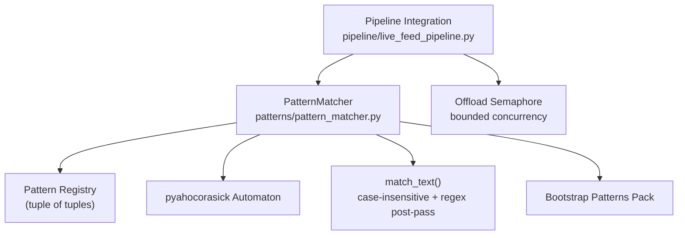
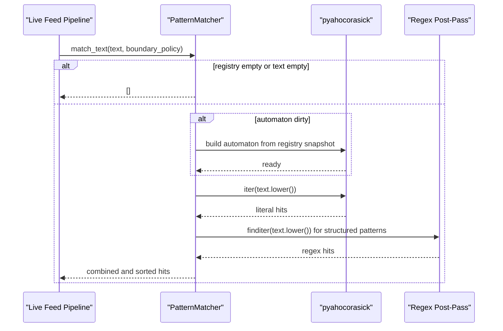
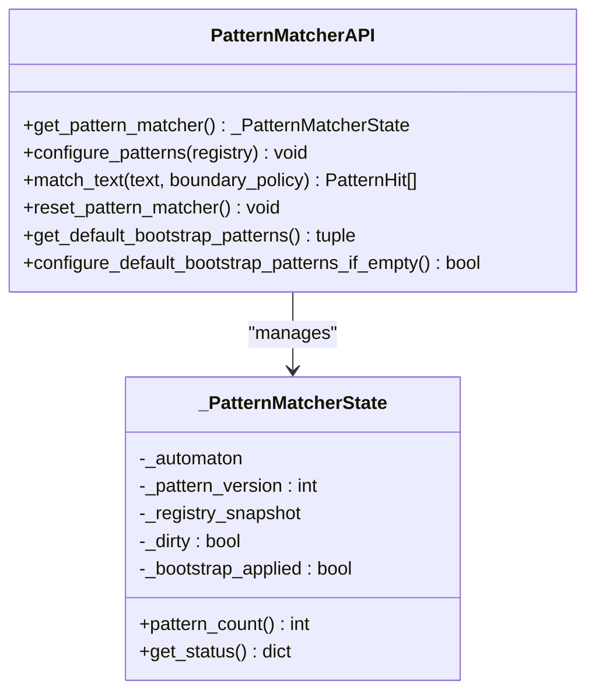
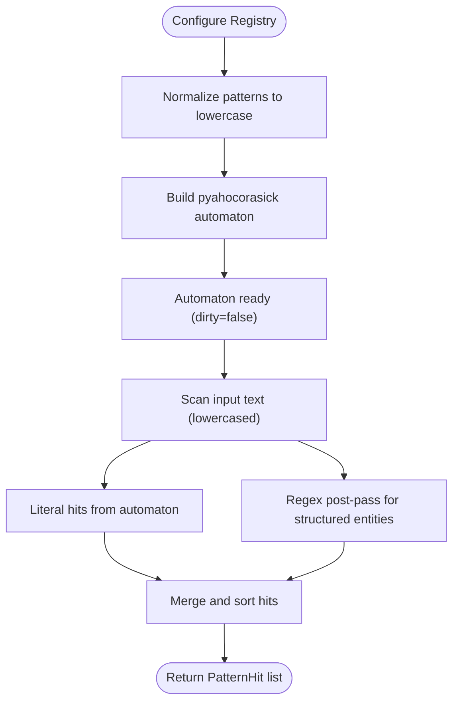
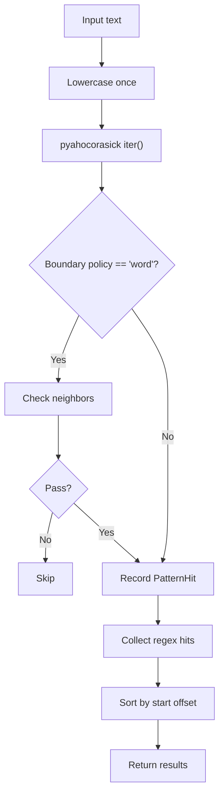
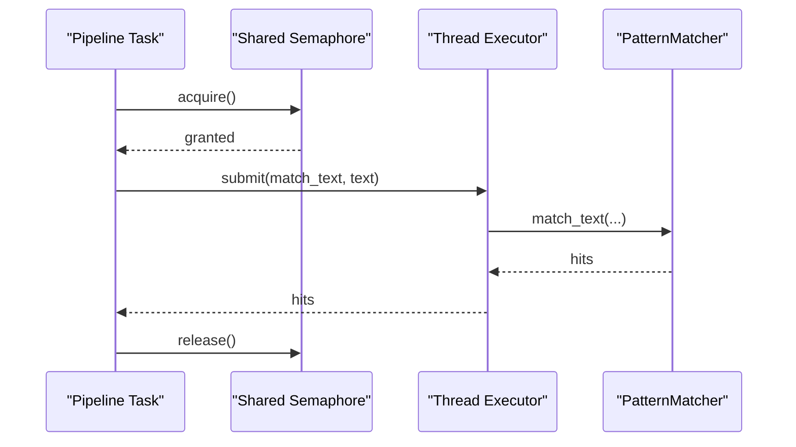
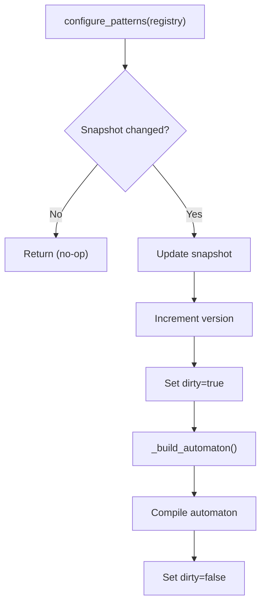
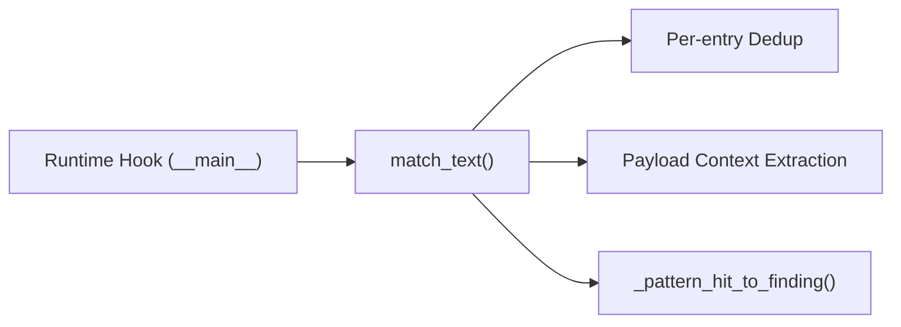
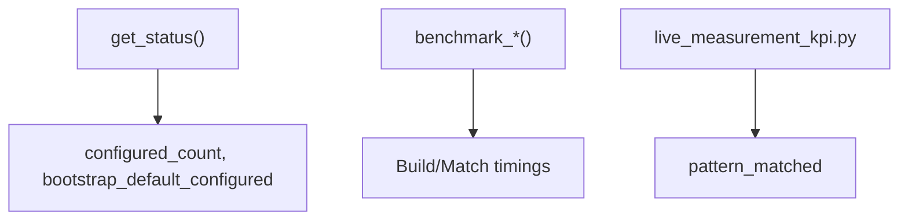
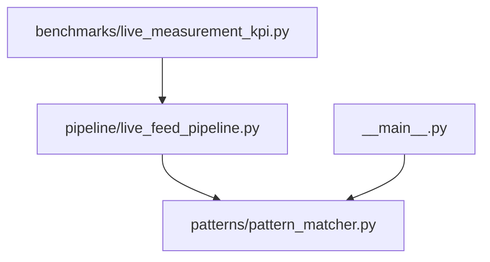

# Pattern Matching System

<cite>
**Referenced Files in This Document**
- [pattern_matcher.py](file://patterns/pattern_matcher.py)
- [live_feed_pipeline.py](file://pipeline/live_feed_pipeline.py)
- [__main__.py](file://__main__.py)
- [live_measurement_kpi.py](file://benchmarks/live_measurement_kpi.py)
</cite>

## Table of Contents
1. [Introduction](#introduction)
2. [Project Structure](#project-structure)
3. [Core Components](#core-components)
4. [Architecture Overview](#architecture-overview)
5. [Detailed Component Analysis](#detailed-component-analysis)
6. [Dependency Analysis](#dependency-analysis)
7. [Performance Considerations](#performance-considerations)
8. [Troubleshooting Guide](#troubleshooting-guide)
9. [Conclusion](#conclusion)
10. [Appendices](#appendices)

## Introduction
This document describes the Pattern Matching System that powers OSINT and security intelligence workflows. It explains the pattern registry architecture, pattern definition syntax, matching algorithms, case-insensitive behavior, pattern offloading mechanisms, concurrency controls, validation and compilation workflows, and integration with pipeline systems. It also covers performance optimization techniques, debugging capabilities, and maintenance best practices.

## Project Structure
The Pattern Matching System is centered in the patterns module and integrates with the pipeline layer for live feeds. Key elements:
- Pattern registry and matching logic in patterns/pattern_matcher.py
- Pipeline integration and offloading in pipeline/live_feed_pipeline.py
- Runtime orchestration hooks in __main__.py
- KPI telemetry that tracks pattern-matched events in benchmarks/live_measurement_kpi.py

**Diagram sources**
- [pattern_matcher.py:619-800](file://patterns/pattern_matcher.py#L619-L800)
- [live_feed_pipeline.py:1222-1267](file://pipeline/live_feed_pipeline.py#L1222-L1267)

**Section sources**
- [pattern_matcher.py:1-839](file://patterns/pattern_matcher.py#L1-L839)
- [live_feed_pipeline.py:1222-1267](file://pipeline/live_feed_pipeline.py#L1222-L1267)

## Core Components
- PatternHit: Immutable named tuple representing a single match with pattern, offsets, matched value, and label.
- Pattern registry: Tuple of (pattern, label) pairs. Internally normalized to lowercase for case-insensitive matching.
- pyahocorasick automaton: Compiled finite-state automaton built lazily on first use.
- match_text(): Performs case-insensitive scanning with optional word-boundary enforcement and augments results with high-precision regex post-processing.
- extract_structured_entities(): Produces a pipeline-friendly list of entities combining automaton and regex results.
- Concurrency offload: Pattern scans are offloaded to a thread executor with a shared semaphore to bound concurrency.
- Bootstrap patterns: Predefined OSINT-focused literal pack with metadata.

Key responsibilities:
- Validation: Registry updates are idempotent; duplicates are ignored; version increments on changes.
- Compilation: Automaton is built lazily from the registry snapshot.
- Execution: Single-pass automaton scan plus a second pass of high-precision regexes.

**Section sources**
- [pattern_matcher.py:52-69](file://patterns/pattern_matcher.py#L52-L69)
- [pattern_matcher.py:627-740](file://patterns/pattern_matcher.py#L627-L740)
- [pattern_matcher.py:788-800](file://patterns/pattern_matcher.py#L788-L800)

## Architecture Overview
The system uses a singleton state holder to manage the automaton and registry snapshot. The pipeline imports match_text directly and offloads work to a thread pool with a shared semaphore. Telemetry tracks pattern-matched outcomes.

**Diagram sources**
- [pattern_matcher.py:643-740](file://patterns/pattern_matcher.py#L643-L740)
- [live_feed_pipeline.py:1248-1267](file://pipeline/live_feed_pipeline.py#L1248-L1267)

**Section sources**
- [pattern_matcher.py:619-800](file://patterns/pattern_matcher.py#L619-L800)
- [live_feed_pipeline.py:1248-1267](file://pipeline/live_feed_pipeline.py#L1248-L1267)

## Detailed Component Analysis

### Pattern Registry and State Management
- Singleton state holds:
  - Automaton instance
  - Current registry snapshot (frozenset of (pattern, label))
  - Dirty flag indicating whether the automaton needs rebuilding
  - Pattern version for tracking changes
  - Bootstrap-applied flag
- Public APIs:
  - configure_patterns(): Updates registry and increments version; marks dirty.
  - get_pattern_matcher(): Returns singleton state without forcing build.
  - reset_pattern_matcher(): Resets to pristine state for testing.
  - get_default_bootstrap_patterns(): Returns default OSINT pack.
  - configure_default_bootstrap_patterns_if_empty(): Applies defaults if registry is empty.

**Diagram sources**
- [pattern_matcher.py:583-611](file://patterns/pattern_matcher.py#L583-L611)
- [pattern_matcher.py:619-786](file://patterns/pattern_matcher.py#L619-L786)

**Section sources**
- [pattern_matcher.py:583-611](file://patterns/pattern_matcher.py#L583-L611)
- [pattern_matcher.py:619-786](file://patterns/pattern_matcher.py#L619-L786)

### Pattern Definition Syntax and Metadata
- Registry syntax: Tuple of two-element tuples (pattern, label).
- Case-insensitivity: Patterns are normalized to lowercase during automaton construction; input text is lowercased once for scanning.
- Word boundary enforcement: Optional boundary_policy "word" filters matches based on adjacent character classification.
- Bootstrap pack: Predefined OSINT literals with layered metadata (layer, source_vocab, mitre_tactic).
- Structured entity extraction: Regex-based post-pass for precise identifiers (e.g., CVE, GHSA, hashes, addresses).

**Diagram sources**
- [pattern_matcher.py:788-800](file://patterns/pattern_matcher.py#L788-L800)
- [pattern_matcher.py:643-740](file://patterns/pattern_matcher.py#L643-L740)

**Section sources**
- [pattern_matcher.py:81-239](file://patterns/pattern_matcher.py#L81-L239)
- [pattern_matcher.py:246-396](file://patterns/pattern_matcher.py#L246-L396)
- [pattern_matcher.py:643-740](file://patterns/pattern_matcher.py#L643-L740)

### Matching Algorithms and Case-Insensitive Implementation
- Case-insensitive matching:
  - Text lowercased once per call.
  - Automaton stores lowercase patterns; match positions mapped back to original offsets and values.
- Word boundary enforcement:
  - Optional policy checks non-alnum neighbors around match spans.
- Regex post-processing:
  - Runs after automaton scan to augment with structured entities.
  - Uses compiled regexes for performance and precision.
- Sorting:
  - Results sorted by start offset.

**Diagram sources**
- [pattern_matcher.py:643-740](file://patterns/pattern_matcher.py#L643-L740)

**Section sources**
- [pattern_matcher.py:643-740](file://patterns/pattern_matcher.py#L643-L740)

### Pattern Offloading Mechanisms and Concurrency Controls
- Offloading: Pattern scans are executed in a thread executor via a dedicated offload helper.
- Bounded concurrency: Shared semaphore limits concurrent pattern scans to protect CPU and memory.
- Fail-soft: Exceptions from the matcher surface as RuntimeError to prevent pipeline stalls.

**Diagram sources**
- [live_feed_pipeline.py:1248-1267](file://pipeline/live_feed_pipeline.py#L1248-L1267)

**Section sources**
- [live_feed_pipeline.py:1248-1267](file://pipeline/live_feed_pipeline.py#L1248-L1267)

### Validation, Compilation, and Execution Workflows
- Validation:
  - configure_patterns() ignores identical snapshots.
  - Version increments on changes; dirty flag ensures rebuild on next use.
- Compilation:
  - _build_automaton() constructs automaton from registry snapshot and marks as clean.
- Execution:
  - match_text() performs lazy build, scans, and merges regex results.

**Diagram sources**
- [pattern_matcher.py:627-641](file://patterns/pattern_matcher.py#L627-L641)
- [pattern_matcher.py:788-800](file://patterns/pattern_matcher.py#L788-L800)

**Section sources**
- [pattern_matcher.py:627-641](file://patterns/pattern_matcher.py#L627-L641)
- [pattern_matcher.py:788-800](file://patterns/pattern_matcher.py#L788-L800)

### Integration with Pipeline Systems
- Direct import of match_text in the pipeline module.
- Per-entry deduplication keyed by (label, pattern, value) to preserve first occurrence.
- Payload context extraction around hits for downstream enrichment.
- Runtime hook ensures patterns are configured before live validation.

**Diagram sources**
- [live_feed_pipeline.py:1222-1360](file://pipeline/live_feed_pipeline.py#L1222-L1360)
- [__main__.py:1488-1513](file://__main__.py#L1488-L1513)

**Section sources**
- [live_feed_pipeline.py:1222-1360](file://pipeline/live_feed_pipeline.py#L1222-L1360)
- [__main__.py:1488-1513](file://__main__.py#L1488-L1513)

### Pattern Debugging Capabilities and Telemetry
- Status reporting: pattern_count(), get_status() expose configured counts, bootstrap flags, and version.
- Benchmark helpers: benchmark_build() and benchmark_match() enable offline performance measurement.
- Telemetry: KPI counters track pattern_matched events for live measurements.

**Diagram sources**
- [pattern_matcher.py:599-608](file://patterns/pattern_matcher.py#L599-L608)
- [pattern_matcher.py:807-838](file://patterns/pattern_matcher.py#L807-L838)
- [live_measurement_kpi.py:639-647](file://benchmarks/live_measurement_kpi.py#L639-L647)

**Section sources**
- [pattern_matcher.py:599-608](file://patterns/pattern_matcher.py#L599-L608)
- [pattern_matcher.py:807-838](file://patterns/pattern_matcher.py#L807-L838)
- [live_measurement_kpi.py:639-647](file://benchmarks/live_measurement_kpi.py#L639-L647)

## Dependency Analysis
- Internal dependencies:
  - patterns/pattern_matcher.py depends on pyahocorasick and Python stdlib.
  - pipeline/live_feed_pipeline.py depends on patterns/pattern_matcher.py for matching.
  - __main__.py depends on patterns/pattern_matcher.py for runtime status and bootstrap gating.
- External integration:
  - Telemetry in benchmarks/live_measurement_kpi.py consumes pattern-matched metrics.

**Diagram sources**
- [pattern_matcher.py:1-17](file://patterns/pattern_matcher.py#L1-L17)
- [live_feed_pipeline.py:1222-1223](file://pipeline/live_feed_pipeline.py#L1222-L1223)
- [__main__.py:1497-1502](file://__main__.py#L1497-L1502)
- [live_measurement_kpi.py:639-647](file://benchmarks/live_measurement_kpi.py#L639-L647)

**Section sources**
- [pattern_matcher.py:1-17](file://patterns/pattern_matcher.py#L1-L17)
- [live_feed_pipeline.py:1222-1223](file://pipeline/live_feed_pipeline.py#L1222-L1223)
- [__main__.py:1497-1502](file://__main__.py#L1497-L1502)
- [live_measurement_kpi.py:639-647](file://benchmarks/live_measurement_kpi.py#L639-L647)

## Performance Considerations
- Lazy automaton build: Avoids upfront cost until first match_text() call.
- Lowercase normalization: Applied once per call to reduce overhead.
- Compiled regexes: Reused across calls for structured entity extraction.
- Bounded concurrency: Shared semaphore prevents oversubscription of CPU and memory.
- Memory bounds: extract_structured_entities caps entries per call to keep memory bounded.
- Benchmark helpers: Use benchmark_build() and benchmark_match() to measure and tune performance.

[No sources needed since this section provides general guidance]

## Troubleshooting Guide
Common issues and remedies:
- No matches despite expected content:
  - Verify registry is not empty; consider applying bootstrap patterns if needed.
  - Check boundary_policy setting if word boundaries are undesired.
- Slow performance:
  - Use benchmark_build() and benchmark_match() to profile.
  - Reduce registry size or split into smaller batches.
- Memory pressure:
  - Monitor with get_status() and adjust concurrency via the shared semaphore.
- Runtime availability:
  - Use get_pattern_matcher().get_status() to confirm configuration and bootstrap state.

**Section sources**
- [pattern_matcher.py:599-608](file://patterns/pattern_matcher.py#L599-L608)
- [pattern_matcher.py:807-838](file://patterns/pattern_matcher.py#L807-L838)
- [live_feed_pipeline.py:1248-1267](file://pipeline/live_feed_pipeline.py#L1248-L1267)

## Conclusion
The Pattern Matching System combines a compact, case-insensitive literal matcher backed by pyahocorasick with a high-precision regex post-pass for structured entities. Its singleton state, lazy build, and bounded-concurrency offloading enable robust, scalable operation within the pipeline. The system’s status reporting, benchmarking, and telemetry support ongoing maintenance and optimization.

[No sources needed since this section summarizes without analyzing specific files]

## Appendices

### Example Workflows

- Pattern creation and registry management:
  - Define a registry as a tuple of (pattern, label) pairs.
  - Apply via configure_patterns(); inspect status via get_status().
  - Optionally apply bootstrap pack via configure_default_bootstrap_patterns_if_empty().

- Running matches:
  - Call match_text(text, boundary_policy="word"|"none").
  - Offload via _async_scan_feed_text() in the pipeline for concurrency control.

- Performance optimization:
  - Measure build and match costs with benchmark_build() and benchmark_match().
  - Tune registry size and boundary_policy to balance recall and speed.

**Section sources**
- [pattern_matcher.py:627-786](file://patterns/pattern_matcher.py#L627-L786)
- [pattern_matcher.py:807-838](file://patterns/pattern_matcher.py#L807-L838)
- [live_feed_pipeline.py:1248-1267](file://pipeline/live_feed_pipeline.py#L1248-L1267)