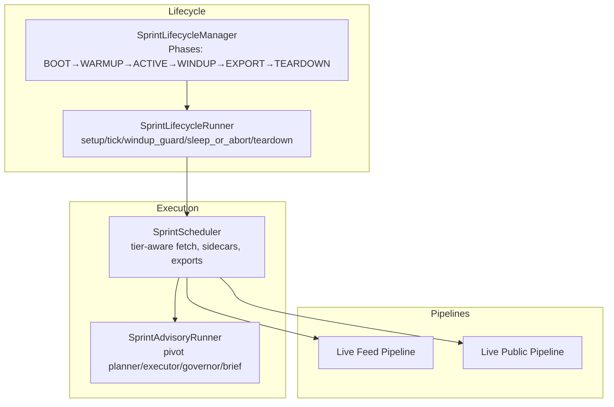
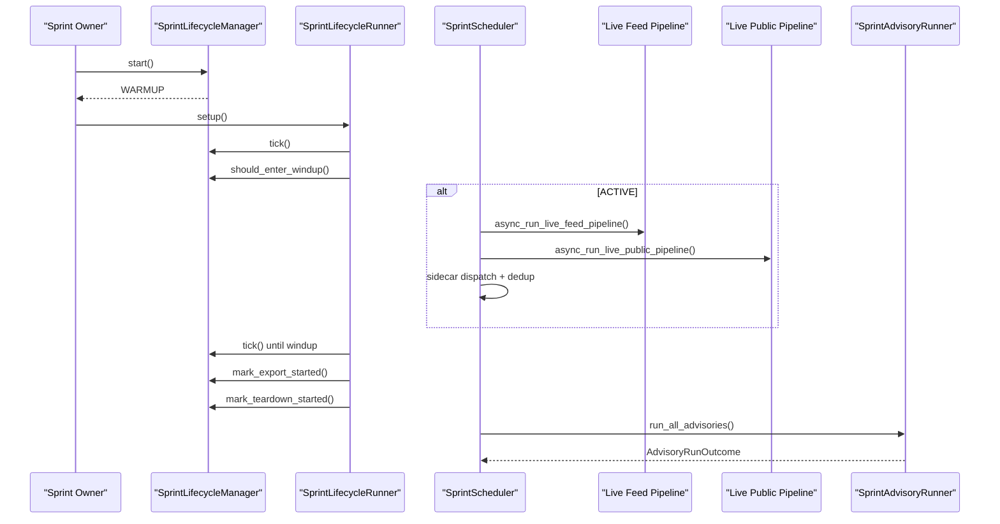
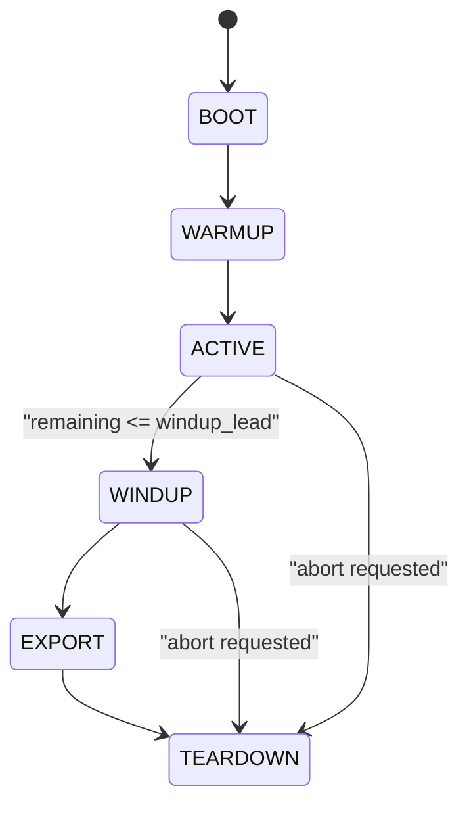
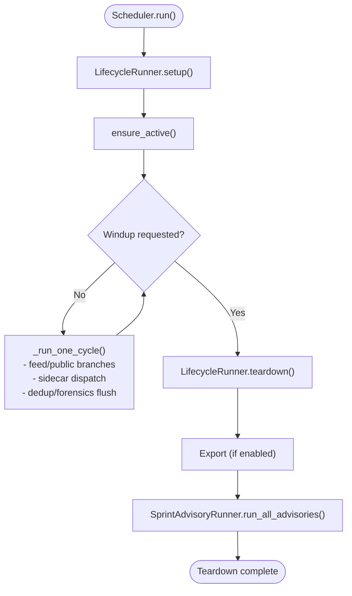
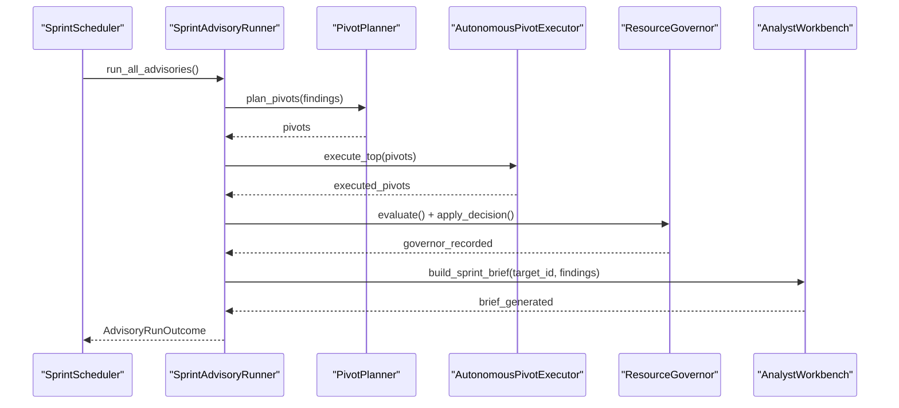
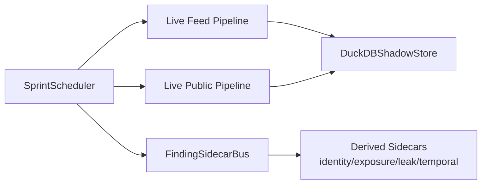
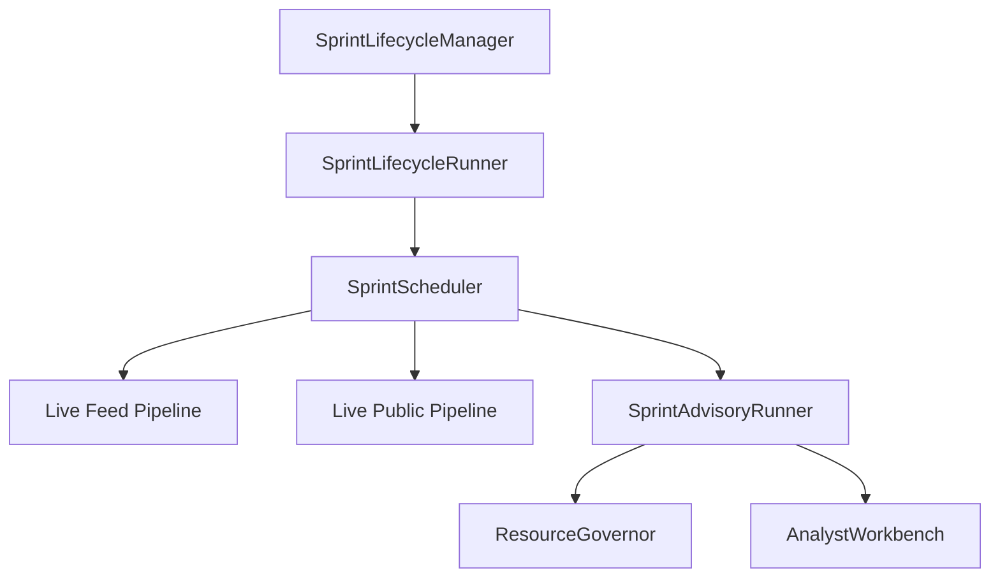

# Pipeline Orchestration

<cite>
**Referenced Files in This Document**
- [sprint_scheduler.py](file://runtime/sprint_scheduler.py)
- [sprint_advisory_runner.py](file://runtime/sprint_advisory_runner.py)
- [sprint_lifecycle.py](file://runtime/sprint_lifecycle.py)
- [sprint_lifecycle_runner.py](file://runtime/sprint_lifecycle_runner.py)
- [live_feed_pipeline.py](file://pipeline/live_feed_pipeline.py)
- [live_public_pipeline.py](file://pipeline/live_public_pipeline.py)
- [global_scheduler.py](file://orchestrator/global_scheduler.py)
- [test_sprint_8bk.py](file://tests/probe_8bk/test_sprint_8bk.py)
- [test_shadow_consumer_seam.py](file://tests/probe_8vm/test_shadow_consumer_seam.py)
- [REAL_ARCHITECTURE.md](file://REAL_ARCHITECTURE.md)
</cite>

## Table of Contents
1. [Introduction](#introduction)
2. [Project Structure](#project-structure)
3. [Core Components](#core-components)
4. [Architecture Overview](#architecture-overview)
5. [Detailed Component Analysis](#detailed-component-analysis)
6. [Dependency Analysis](#dependency-analysis)
7. [Performance Considerations](#performance-considerations)
8. [Troubleshooting Guide](#troubleshooting-guide)
9. [Conclusion](#conclusion)

## Introduction
This document explains the pipeline orchestration subsystem that coordinates research lifecycles, schedules execution, manages resources, and performs post-processing advisory functions. It covers:
- How different pipeline types (live feed and live public) integrate with the lifecycle
- The sprint scheduler’s role in timing, resource allocation, and cross-pipeline communication
- The sprint lifecycle phases (warmup, active processing, windup) and how the scheduler coordinates them
- The advisory runner’s post-processing insights and recommendations
- Configuration options for scheduling, lifecycle management, and advisory functions
- Practical examples of pipeline coordination and resource management
- Common orchestration challenges, error recovery, and performance optimization strategies

## Project Structure
The orchestration subsystem centers on runtime components that manage the sprint lifecycle and coordinate pipeline execution. Key modules:
- Lifecycle management: [sprint_lifecycle.py](file://runtime/sprint_lifecycle.py), [sprint_lifecycle_runner.py](file://runtime/sprint_lifecycle_runner.py)
- Execution scheduler: [sprint_scheduler.py](file://runtime/sprint_scheduler.py)
- Advisory post-processing: [sprint_advisory_runner.py](file://runtime/sprint_advisory_runner.py)
- Pipelines: [live_feed_pipeline.py](file://pipeline/live_feed_pipeline.py), [live_public_pipeline.py](file://pipeline/live_public_pipeline.py)
- Global priority scheduling (external to sprints): [global_scheduler.py](file://orchestrator/global_scheduler.py)
- Tests and architecture docs: [test_sprint_8bk.py](file://tests/probe_8bk/test_sprint_8bk.py), [test_shadow_consumer_seam.py](file://tests/probe_8vm/test_shadow_consumer_seam.py), [REAL_ARCHITECTURE.md](file://REAL_ARCHITECTURE.md)

**Diagram sources**
- [sprint_lifecycle.py:54-280](file://runtime/sprint_lifecycle.py#L54-L280)
- [sprint_lifecycle_runner.py:38-193](file://runtime/sprint_lifecycle_runner.py#L38-L193)
- [sprint_scheduler.py:568-730](file://runtime/sprint_scheduler.py#L568-L730)
- [sprint_advisory_runner.py:76-155](file://runtime/sprint_advisory_runner.py#L76-L155)
- [live_feed_pipeline.py:1-120](file://pipeline/live_feed_pipeline.py#L1-L120)
- [live_public_pipeline.py:1-120](file://pipeline/live_public_pipeline.py#L1-L120)

**Section sources**
- [sprint_lifecycle.py:1-200](file://runtime/sprint_lifecycle.py#L1-L200)
- [sprint_lifecycle_runner.py:1-120](file://runtime/sprint_lifecycle_runner.py#L1-L120)
- [sprint_scheduler.py:568-730](file://runtime/sprint_scheduler.py#L568-L730)
- [sprint_advisory_runner.py:1-120](file://runtime/sprint_advisory_runner.py#L1-L120)
- [live_feed_pipeline.py:1-120](file://pipeline/live_feed_pipeline.py#L1-L120)
- [live_public_pipeline.py:1-120](file://pipeline/live_public_pipeline.py#L1-L120)

## Core Components
- SprintLifecycleManager: Defines lifecycle phases, timing, and transitions. It is the canonical authority for phase progression and wind-down triggers.
- SprintLifecycleRunner: Encapsulates lifecycle orchestration logic (setup, tick, windup guard, sleep with tick, teardown).
- SprintScheduler: Tier-aware scheduler that runs bounded feed/public cycles under the lifecycle. It coordinates pipeline execution, sidecars, exports, and advisory hooks.
- SprintAdvisoryRunner: Executes advisory steps after windup/export: pivot planning, pivot execution, resource governor evaluation, and analyst brief generation.
- Live Feed Pipeline and Live Public Pipeline: Two pipeline types that produce findings and feed into the lifecycle and scheduler.

Key responsibilities and invariants:
- Lifecycle is authoritative for time and phase transitions; scheduler respects wind-down and abort signals.
- Scheduler does not execute tools or own lifecycle transitions; it delegates lifecycle control to the lifecycle manager.
- Advisory runner is diagnostic-only in shadow modes and fail-soft across steps.

**Section sources**
- [sprint_lifecycle.py:54-280](file://runtime/sprint_lifecycle.py#L54-L280)
- [sprint_lifecycle_runner.py:38-193](file://runtime/sprint_lifecycle_runner.py#L38-L193)
- [sprint_scheduler.py:568-620](file://runtime/sprint_scheduler.py#L568-L620)
- [sprint_advisory_runner.py:76-155](file://runtime/sprint_advisory_runner.py#L76-L155)

## Architecture Overview
The runtime orchestrates a 30-minute sprint with strict timing and phase gates. The scheduler runs bounded cycles, respecting lifecycle wind-down and abort conditions. After windup/export, the advisory runner provides post-processing insights.

**Diagram sources**
- [sprint_lifecycle.py:82-178](file://runtime/sprint_lifecycle.py#L82-L178)
- [sprint_lifecycle_runner.py:55-180](file://runtime/sprint_lifecycle_runner.py#L55-L180)
- [sprint_scheduler.py:568-730](file://runtime/sprint_scheduler.py#L568-L730)
- [sprint_advisory_runner.py:120-155](file://runtime/sprint_advisory_runner.py#L120-L155)
- [live_feed_pipeline.py:232-310](file://pipeline/live_feed_pipeline.py#L232-L310)
- [live_public_pipeline.py:198-271](file://pipeline/live_public_pipeline.py#L198-L271)

## Detailed Component Analysis

### Sprint Lifecycle Management
- Phases: BOOT → WARMUP → ACTIVE → WINDUP → EXPORT → TEARDOWN
- Timing: Uses monotonic time; wind-down guard triggers when remaining time ≤ windup lead
- Authority: Transition rules enforce monotonic progression; abort shortcut allows immediate TEARDOWN
- Tool mode recommendations: panic/prune/normal based on remaining time and thermal state

**Diagram sources**
- [sprint_lifecycle.py:21-49](file://runtime/sprint_lifecycle.py#L21-L49)
- [sprint_lifecycle.py:110-146](file://runtime/sprint_lifecycle.py#L110-L146)

**Section sources**
- [sprint_lifecycle.py:54-280](file://runtime/sprint_lifecycle.py#L54-L280)

### Sprint Lifecycle Runner
- Responsibilities: setup (start), ensure ACTIVE transition, periodic tick, windup guard, sleep with tick, teardown, partial export signaling
- Best-effort operations: transitions and teardown are resilient to transient failures

**Section sources**
- [sprint_lifecycle_runner.py:38-193](file://runtime/sprint_lifecycle_runner.py#L38-L193)

### Sprint Scheduler
- Tier-aware execution: SURFACE → STRUCTURED_TI → DEEP → ARCHIVE → OTHER
- Configuration: duration, wind-up lead, sleep between cycles, parallelism, aggressive mode, timeouts, export settings
- Execution model: bounded cycles under lifecycle; respects wind-down and abort; maintains in-sprint dedup and per-source counters
- Cross-pipeline communication: lazy imports for pipelines and exporters; sidecar bus for derived findings; correlation and hypothesis caches
- Shadow pre-decision: diagnostic-only consumption with caching

**Diagram sources**
- [sprint_scheduler.py:568-730](file://runtime/sprint_scheduler.py#L568-L730)
- [sprint_lifecycle_runner.py:55-180](file://runtime/sprint_lifecycle_runner.py#L55-L180)
- [sprint_advisory_runner.py:120-155](file://runtime/sprint_advisory_runner.py#L120-L155)

**Section sources**
- [sprint_scheduler.py:267-433](file://runtime/sprint_scheduler.py#L267-L433)
- [sprint_scheduler.py:568-730](file://runtime/sprint_scheduler.py#L568-L730)
- [test_shadow_consumer_seam.py:44-95](file://tests/probe_8vm/test_shadow_consumer_seam.py#L44-L95)

### Advisory Runner
- Steps (order is explicit and tested):
  1) Pivot planner: plan pivots from accepted findings
  2) Pivot executor: execute top pivots via autonomous executor
  3) Resource governor: evaluate and apply concurrency hints; track peak RSS and skipped sidecars
  4) Analyst brief: generate sprint brief using canonical target_id
- Fail-soft: each step is fail-soft; CancelledError re-raised; no new persistent writes

**Diagram sources**
- [REAL_ARCHITECTURE.md:2764-2991](file://REAL_ARCHITECTURE.md#L2764-L2991)
- [sprint_advisory_runner.py:120-442](file://runtime/sprint_advisory_runner.py#L120-L442)

**Section sources**
- [sprint_advisory_runner.py:76-155](file://runtime/sprint_advisory_runner.py#L76-L155)
- [REAL_ARCHITECTURE.md:2764-2991](file://REAL_ARCHITECTURE.md#L2764-L2991)

### Pipeline Types and Coordination
- Live Feed Pipeline: RSS/Atom feeds → normalized entries → pattern scan → findings → storage; provides run-level signals (signal stage, confidence, winning source breakdown)
- Live Public Pipeline: discovery → fetch → lightweight extraction → pattern scan → quality gate → findings → storage; provides run-level signals (usable value, conversion efficiency, backend degradation)
- Scheduler integrates both pipelines, coordinating per-source tier budgets, parallelism, and export hooks.

**Diagram sources**
- [live_feed_pipeline.py:232-310](file://pipeline/live_feed_pipeline.py#L232-L310)
- [live_public_pipeline.py:198-271](file://pipeline/live_public_pipeline.py#L198-L271)
- [sprint_scheduler.py:568-730](file://runtime/sprint_scheduler.py#L568-L730)

**Section sources**
- [live_feed_pipeline.py:1-120](file://pipeline/live_feed_pipeline.py#L1-L120)
- [live_public_pipeline.py:1-120](file://pipeline/live_public_pipeline.py#L1-L120)

### Configuration Options
- SprintSchedulerConfig:
  - sprint_duration_s, windup_lead_s, cycle_sleep_s, max_cycles, max_parallel_sources
  - stop_on_first_accepted, export_enabled, export_dir
  - max_entries_per_cycle, aggressive_mode, aggressive_branch_timeout_s, branch_timeout_budget_s
  - partial_export_findings_interval, source_tier_map
- Pipeline-level signals:
  - Live Feed Pipeline: signal_stage, feed_confidence_score, winning_source_breakdown
  - Live Public Pipeline: public_branch_verdict, backend_degraded, usable_findings_ratio

**Section sources**
- [sprint_scheduler.py:267-298](file://runtime/sprint_scheduler.py#L267-L298)
- [live_feed_pipeline.py:232-310](file://pipeline/live_feed_pipeline.py#L232-L310)
- [live_public_pipeline.py:198-271](file://pipeline/live_public_pipeline.py#L198-L271)

## Dependency Analysis
- Lifecycle ownership: SprintLifecycleManager is the canonical authority; SprintLifecycleRunner delegates lifecycle operations to it.
- Scheduler ownership: SprintScheduler orchestrates execution, sidecars, exports, and advisory; it does not own lifecycle transitions.
- Advisory ownership: SprintAdvisoryRunner is owned by scheduler but runs advisory steps independently.
- Pipeline ownership: Pipelines are owned by scheduler; they do not own lifecycle or scheduling.

**Diagram sources**
- [sprint_lifecycle.py:54-280](file://runtime/sprint_lifecycle.py#L54-L280)
- [sprint_lifecycle_runner.py:38-193](file://runtime/sprint_lifecycle_runner.py#L38-L193)
- [sprint_scheduler.py:568-730](file://runtime/sprint_scheduler.py#L568-L730)
- [sprint_advisory_runner.py:76-155](file://runtime/sprint_advisory_runner.py#L76-L155)

**Section sources**
- [sprint_lifecycle.py:54-280](file://runtime/sprint_lifecycle.py#L54-L280)
- [sprint_lifecycle_runner.py:38-193](file://runtime/sprint_lifecycle_runner.py#L38-L193)
- [sprint_scheduler.py:568-730](file://runtime/sprint_scheduler.py#L568-L730)
- [sprint_advisory_runner.py:76-155](file://runtime/sprint_advisory_runner.py#L76-L155)

## Performance Considerations
- Concurrency and batching:
  - Shared semaphores and bounded concurrency for pattern scanning and sidecars
  - Adaptive fetch budgets and tier-based prioritization reduce wasted I/O
- Memory and resource governance:
  - Peak RSS tracking and sidecar skipping to respect mission budget
  - Advisory step is RAM-guarded; heavy operations are skipped when RSS exceeds thresholds
- Timing and responsiveness:
  - Short sleep steps with periodic lifecycle ticks enable prompt wind-down detection
  - Adaptive timeouts and EMA latency tracking improve robustness under variable network conditions
- Export and partial reporting:
  - Partial export intervals and diagnostic-only shadow paths reduce overhead in read-only modes

[No sources needed since this section provides general guidance]

## Troubleshooting Guide
Common orchestration challenges and remedies:
- Wind-down not triggering:
  - Verify lifecycle windup lead and remaining time calculations
  - Ensure lifecycle runner’s tick and should_enter_windup are invoked regularly
- Aborts and terminal states:
  - Confirm abort requests propagate to lifecycle and teardown proceeds to TEARDOWN
- Shadow pre-decision consumption:
  - In scheduler_shadow mode, consume_shadow_pre_decision() returns None when no lifecycle adapter is present; caching prevents recomputation
- Export and teardown:
  - EXPORT must follow WINDUP; TEARDOWN follows EXPORT or WINDUP (abort)
- Advisory failures:
  - Advisory steps are fail-soft; CancelledError is re-raised; investigate individual step logs for planner/executor/governor/brief

**Section sources**
- [sprint_lifecycle.py:148-178](file://runtime/sprint_lifecycle.py#L148-L178)
- [sprint_lifecycle_runner.py:162-180](file://runtime/sprint_lifecycle_runner.py#L162-L180)
- [test_sprint_8bk.py:92-127](file://tests/probe_8bk/test_sprint_8bk.py#L92-L127)
- [test_shadow_consumer_seam.py:44-95](file://tests/probe_8vm/test_shadow_consumer_seam.py#L44-L95)
- [sprint_advisory_runner.py:151-154](file://runtime/sprint_advisory_runner.py#L151-L154)

## Conclusion
The pipeline orchestration subsystem cleanly separates lifecycle authority from execution responsibility. The sprint scheduler coordinates pipeline execution, resource allocation, and cross-pipeline communication while respecting lifecycle timing and abort conditions. The advisory runner provides diagnostic insights and recommendations after windup/export. With configurable budgets, tier-aware prioritization, and fail-soft advisory steps, the system supports robust, scalable research workflows across diverse pipeline types.