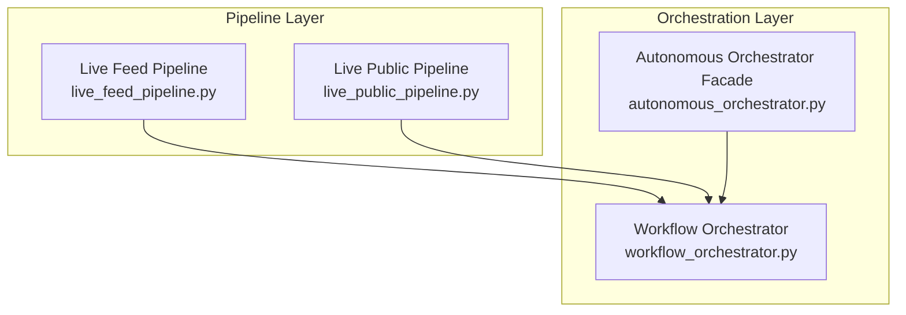
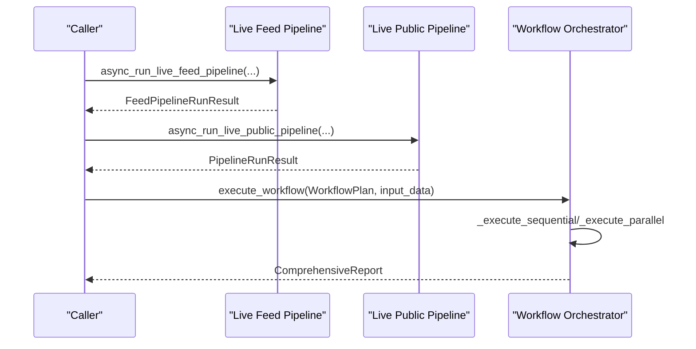
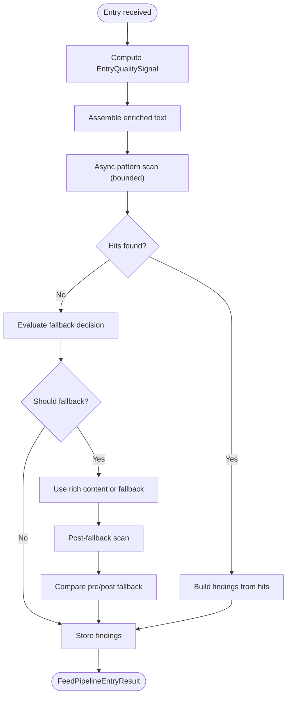
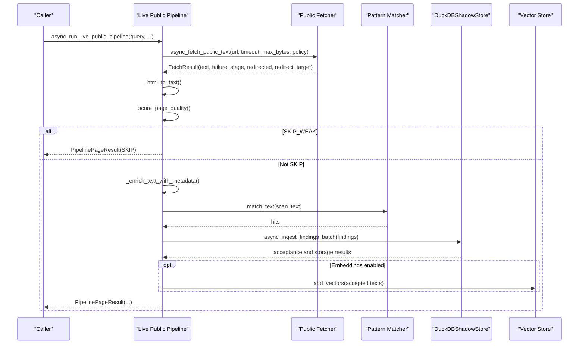
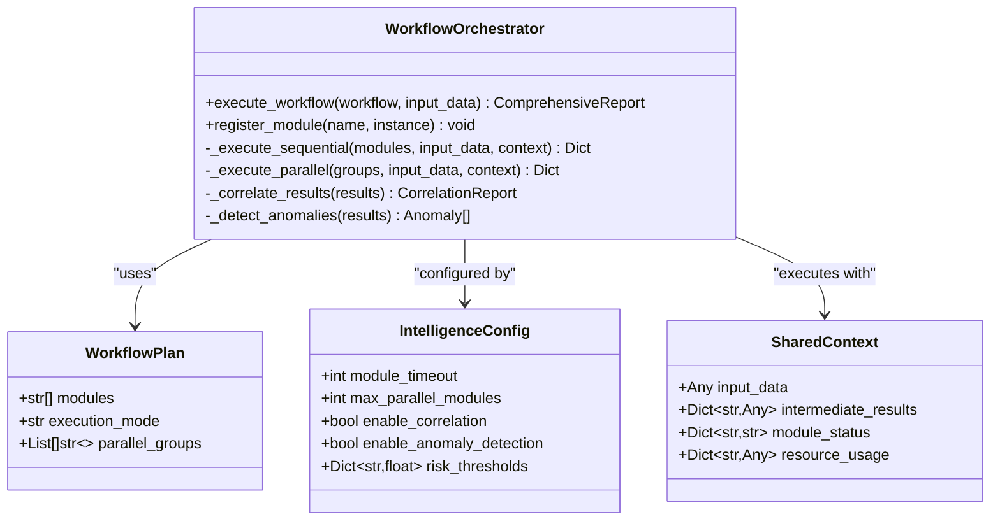
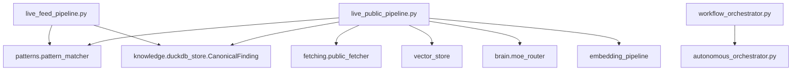

# Pipeline System

<cite>
**Referenced Files in This Document**
- [live_feed_pipeline.py](file://pipeline/live_feed_pipeline.py)
- [live_public_pipeline.py](file://pipeline/live_public_pipeline.py)
- [workflow_orchestrator.py](file://intelligence/workflow_orchestrator.py)
- [autonomous_orchestrator.py](file://autonomous_orchestrator.py)
- [__init__.py](file://pipeline/__init__.py)
</cite>

## Table of Contents
1. [Introduction](#introduction)
2. [Project Structure](#project-structure)
3. [Core Components](#core-components)
4. [Architecture Overview](#architecture-overview)
5. [Detailed Component Analysis](#detailed-component-analysis)
6. [Dependency Analysis](#dependency-analysis)
7. [Performance Considerations](#performance-considerations)
8. [Troubleshooting Guide](#troubleshooting-guide)
9. [Conclusion](#conclusion)

## Introduction
This document describes the pipeline system subsystem, focusing on three key areas:
- Live feed pipeline: RSS/Atom feed ingestion, quality gating, pattern scanning, and findings generation.
- Live public pipeline: discovery, fetching, HTML extraction, pattern scanning, and storage of findings.
- Pipeline orchestration: workflow orchestration across modules and integration points.

It explains implementation details, invocation relationships, interfaces, domain models, usage patterns, configuration options, parameters, return values, and relationships with other components. Practical examples are referenced from the actual codebase.

## Project Structure
The pipeline system resides under the pipeline package and integrates with broader intelligence and orchestration layers:
- pipeline/live_feed_pipeline.py: Feed-native pipeline with quality signals, fallback decisions, and economic verdicts.
- pipeline/live_public_pipeline.py: Public search pipeline with adaptive fetch policy, quality scoring, and report generation.
- intelligence/workflow_orchestrator.py: Multi-module workflow orchestration for cross-module correlation and reporting.
- pipeline/__init__.py: Pipeline module marker.
- autonomous_orchestrator.py: Facade for legacy orchestration (contextual to higher-level runtime).

**Diagram sources**
- [live_feed_pipeline.py:1-2653](file://pipeline/live_feed_pipeline.py#L1-L2653)
- [live_public_pipeline.py:1-2997](file://pipeline/live_public_pipeline.py#L1-L2997)
- [workflow_orchestrator.py:1-1849](file://intelligence/workflow_orchestrator.py#L1-L1849)
- [autonomous_orchestrator.py:1-272](file://autonomous_orchestrator.py#L1-L272)

**Section sources**
- [__init__.py:1-2](file://pipeline/__init__.py#L1-L2)
- [live_feed_pipeline.py:1-2653](file://pipeline/live_feed_pipeline.py#L1-L2653)
- [live_public_pipeline.py:1-2997](file://pipeline/live_public_pipeline.py#L1-L2997)
- [workflow_orchestrator.py:1-1849](file://intelligence/workflow_orchestrator.py#L1-L1849)
- [autonomous_orchestrator.py:1-272](file://autonomous_orchestrator.py#L1-L272)

## Core Components
- Live Feed Pipeline
  - Purpose: Assemble feed-native text, compute quality signals, scan patterns, decide fallback, and produce findings.
  - Key elements: Entry quality signal, fallback decision classification, enriched text assembly, pattern scanning, per-run/per-entry deduplication, and economic verdicts.
  - Interfaces: async_run_live_feed_pipeline (public API), FeedPipelineEntryResult, FeedPipelineRunResult, DTOs for diagnostics and economics.

- Live Public Pipeline
  - Purpose: Discover public pages, adaptively fetch, extract HTML, enrich with metadata, scan patterns, store findings, and optionally generate reports.
  - Key elements: Adaptive fetch policy, pre-fetch quality gates, per-page usable-value computation, pattern scanning, storage integration, and report generation.
  - Interfaces: async_run_live_public_pipeline (public API), PipelinePageResult, PipelineRunResult, FetchPolicy, and report generation helpers.

- Workflow Orchestrator
  - Purpose: Coordinate multi-module analysis, correlate findings, detect anomalies, and produce comprehensive reports.
  - Key elements: WorkflowPlan, SharedContext, CorrelationReport, Anomaly, Finding, and execution modes (sequential/parallel).
  - Interfaces: execute_workflow, register_module, and module execution helpers.

**Section sources**
- [live_feed_pipeline.py:1-2653](file://pipeline/live_feed_pipeline.py#L1-L2653)
- [live_public_pipeline.py:1-2997](file://pipeline/live_public_pipeline.py#L1-L2997)
- [workflow_orchestrator.py:1-1849](file://intelligence/workflow_orchestrator.py#L1-L1849)

## Architecture Overview
The pipeline system is composed of:
- Feed pipeline: feed ingestion → quality signal → pattern scan → fallback decision → findings → storage.
- Public pipeline: discovery → adaptive fetch policy → HTML extraction → enriched pattern scan → storage → optional report generation.
- Orchestration: workflow orchestrator coordinates modules and produces correlated reports.

**Diagram sources**
- [live_feed_pipeline.py:1-2653](file://pipeline/live_feed_pipeline.py#L1-L2653)
- [live_public_pipeline.py:1-2997](file://pipeline/live_public_pipeline.py#L1-L2997)
- [workflow_orchestrator.py:385-466](file://intelligence/workflow_orchestrator.py#L385-L466)

## Detailed Component Analysis

### Live Feed Pipeline
- Domain model
  - EntryQualitySignal: lightweight quality signal with band, score, reason tag, and metadata boost.
  - FallbackDecision: structured fallback decision with reason, should_fetch, forced, wasted, helpful, skip_because.
  - DTOs: FeedPipelineEntryResult, FeedPipelineRunResult, FeedSourceRunResult, FeedSourceBatchRunResult.
  - Economic verdicts: feed branch hint, condensed verdict, dict-style verdict, next action, confidence score, and breakdowns.

- Processing logic
  - Quality signal computation from title/summary/rich content, author/feed metadata, and adapter quality score.
  - Enriched text assembly: metadata header, rich content, summary, title, with priority and substantivity checks.
  - Pattern scanning: offloaded via bounded semaphore, case-insensitive matcher, unicode-safe context extraction.
  - Fallback decision: single classification replacing multiple scattered booleans.
  - Deduplication: per-run by entry_url, per-entry by (label, pattern, value) preserve-first.
  - Economic verdicts: compute ratios, squandered entries, value/waste metrics, and next-action recommendations.

- Invocation relationships
  - _compute_entry_quality_signal → _assemble_enriched_feed_text → _async_scan_feed_text → _pattern_hit_to_finding → storage.
  - _classify_fallback_decision orchestrates fallback outcomes and tracks pre/post fallback hits.

- Configuration and parameters
  - MAX_FEED_TEXT_CHARS, FEED_PAYLOAD_CONTEXT_CHARS, MAX_FEED_PATTERN_TASKS.
  - Quality thresholds: MIN_SUBSTANTIVE_CHARS, QUALITY_TITLE_ONLY_CHARS, QUALITY_SUMMARY_MIN_CHARS, OSINT relevant languages.
  - Economic constants: rich ratio thresholds, waste ratio weighting, and confidence adjustments.

- Return values and diagnostics
  - FeedPipelineEntryResult: entry_url, accepted_findings, stored_findings, error, assembly tier, quality reason tag.
  - FeedPipelineRunResult: aggregated counts, samples, enriched text stats, economic verdicts, root-cause blockers, and dedup loss.

**Diagram sources**
- [live_feed_pipeline.py:90-194](file://pipeline/live_feed_pipeline.py#L90-L194)
- [live_feed_pipeline.py:994-1069](file://pipeline/live_feed_pipeline.py#L994-L1069)
- [live_feed_pipeline.py:1236-1256](file://pipeline/live_feed_pipeline.py#L1236-L1256)
- [live_feed_pipeline.py:341-488](file://pipeline/live_feed_pipeline.py#L341-L488)

**Section sources**
- [live_feed_pipeline.py:1-2653](file://pipeline/live_feed_pipeline.py#L1-L2653)

### Live Public Pipeline
- Domain model
  - FetchPolicy: use_js, use_doh, use_stealth, with factory methods.
  - PipelinePageResult: per-page results with discovery signals, usable value, waste category, structural quality, and failure stages.
  - PipelineRunResult: run-level aggregates, derived economics signals, public branch verdict, and zero-hit evidence.

- Processing logic
  - Adaptive fetch policy: driven by discovery score/reason, URL class, and source characteristics.
  - Pre-fetch quality gates: text length and low-entropy checks to skip weak pages.
  - HTML extraction: robust parser with fail-soft fallback.
  - Pattern scanning: enriched text with metadata, deduplicated findings, and quality-gated storage.
  - Report generation: RAG context fusion (vector search + pattern matcher), MMR reranking, and model routing.

- Invocation relationships
  - _compute_fetch_policy → _fetch_and_process_page → _html_to_text → _enrich_text_with_metadata → _SYNC_MATCH_TEXT → storage and embeddings.
  - _generate_and_store_report orchestrates RAG context, fusion, routing, and report storage.

- Configuration and parameters
  - MAX_EXTRACTED_TEXT_CHARS, MAX_METADATA_PREPEND_CHARS, FINDING_ID_CONTEXT_RADIUS.
  - Quality tiers: very_good, good, ok, weak_low_signal, SKIP_WEAK.
  - Budget multipliers: STRONG/NORMAL/WEAK/SKIP tiers.
  - Gate thresholds: PRE_FETCH_TEXT_MIN_CHARS, LOW_ENTROPY_UNIQUE_WORD_RATIO.
  - Report generation: REPORT_TOP_N, REPORT_SOURCE_TYPE, DEFAULT_CONFIDENCE.

- Return values and diagnostics
  - PipelinePageResult: fetched, matched_patterns, accepted_findings, stored_findings, error, quality_reason, discovery_* fields, usable_signal, value_tier, resolution_reason, discovery_false_positive, waste_category, structural_quality, failure_stage, redirected, redirect_target.
  - PipelineRunResult: run-level aggregates, derived counters, public branch verdict, factual value density, zero-hit telemetry, and backend degradation flag.

**Diagram sources**
- [live_public_pipeline.py:727-1254](file://pipeline/live_public_pipeline.py#L727-L1254)
- [live_public_pipeline.py:1299-1527](file://pipeline/live_public_pipeline.py#L1299-L1527)

**Section sources**
- [live_public_pipeline.py:1-2997](file://pipeline/live_public_pipeline.py#L1-L2997)

### Workflow Orchestrator
- Domain model
  - WorkflowPlan: modules list, execution mode, and optional parallel groups.
  - SharedContext: input_data, intermediate_results, module_status, resource_usage.
  - Finding, Anomaly, CorrelationReport, ComprehensiveReport: structured outputs with serialization helpers.

- Processing logic
  - Sequential or parallel execution with timeouts.
  - Module registration and dynamic discovery.
  - Cross-module correlation with risk scoring and attribution extraction.
  - Anomaly detection for module failures and inconsistent results.
  - Timeline tracking for execution events.

- Invocation relationships
  - execute_workflow orchestrates module execution, correlation, anomaly detection, and report generation.
  - register_module allows adding custom modules at runtime.

- Configuration and parameters
  - IntelligenceConfig: module_timeout, max_parallel_modules, enable_correlation, enable_anomaly_detection, risk_thresholds.

- Return values and diagnostics
  - ComprehensiveReport: input_summary, module_results, correlations, anomalies, verdict, confidence, recommendations, timeline, export_data.

**Diagram sources**
- [workflow_orchestrator.py:300-466](file://intelligence/workflow_orchestrator.py#L300-L466)
- [workflow_orchestrator.py:356-642](file://intelligence/workflow_orchestrator.py#L356-L642)

**Section sources**
- [workflow_orchestrator.py:1-1849](file://intelligence/workflow_orchestrator.py#L1-L1849)

## Dependency Analysis
- Live Feed Pipeline
  - Depends on patterns.pattern_matcher for match_text.
  - Uses duckdb_store CanonicalFinding for storage.
  - Integrates with session_runtime for article fallback via Wayback CDX seam.
  - Uses msgspec.Struct for DTOs and asyncio.Semaphore for bounded concurrency.

- Live Public Pipeline
  - Depends on fetching.public_fetcher for async_fetch_public_text.
  - Integrates with patterns.pattern_matcher for match_text.
  - Uses duckdb_store CanonicalFinding and vector_store for embeddings.
  - Uses brain.moe_router for model routing and embedding_pipeline for embeddings.

- Workflow Orchestrator
  - Dynamically discovers modules via orchestrator.get_module or attributes.
  - Supports sequential and parallel execution with timeouts.
  - Produces structured reports with JSON/Markdown/HTML export.

**Diagram sources**
- [live_feed_pipeline.py:1211-1211](file://pipeline/live_feed_pipeline.py#L1211-L1211)
- [live_public_pipeline.py:1287-1291](file://pipeline/live_public_pipeline.py#L1287-L1291)
- [workflow_orchestrator.py:610-642](file://intelligence/workflow_orchestrator.py#L610-L642)

**Section sources**
- [live_feed_pipeline.py:1-2653](file://pipeline/live_feed_pipeline.py#L1-L2653)
- [live_public_pipeline.py:1-2997](file://pipeline/live_public_pipeline.py#L1-L2997)
- [workflow_orchestrator.py:1-1849](file://intelligence/workflow_orchestrator.py#L1-L1849)

## Performance Considerations
- Concurrency control
  - Feed pipeline: bounded semaphore for pattern scanning to prevent overload.
  - Public pipeline: adaptive fetch timeouts based on discovery signals and quality tiers.
- Memory discipline
  - Embedding lifecycle management via model_manager.embedding_lifecycle() to control GPU/CPU memory.
  - Pre-fetch text length and low-entropy gates to avoid expensive processing on low-signal pages.
- I/O efficiency
  - Article fallback leverages Wayback CDX for recent captures to reduce live fetch costs.
  - Vector search with MMR reranking and RRF fusion to balance recall and precision.
- Storage gating
  - Quality-gated acceptance before storage to minimize downstream failures.

[No sources needed since this section provides general guidance]

## Troubleshooting Guide
- Zero findings scenarios
  - Feed pipeline: diagnose_feed_signal_stage helps identify where signal is lost (empty registry, empty fetch, content_empty, no_pattern_hits, findings_build_loss, prestore_findings_present).
  - Public pipeline: zero_hit_accessible_fetch_count and zero_hit_quality_reason_counts provide structured evidence for zero-hit pages.
- Fetch failures
  - Public pipeline: failure_stage indicates validation/connection/tls/http/body/size; redirected and redirect_target help detect non-content redirects.
- Backend degradation
  - Public pipeline: backend_degraded flag signals when fetch errors dominate discovery output.
- Deduplication losses
  - Feed pipeline: findings_lost_to_dedup counters track dedup losses at run and entry levels.
- Economic decisions
  - Feed pipeline: feed_branch_verdict and next_action provide actionable guidance for feed continuation or fallback.

**Section sources**
- [live_feed_pipeline.py:490-533](file://pipeline/live_feed_pipeline.py#L490-L533)
- [live_public_pipeline.py:240-251](file://pipeline/live_public_pipeline.py#L240-L251)
- [live_public_pipeline.py:1226-1254](file://pipeline/live_public_pipeline.py#L1226-L1254)

## Conclusion
The pipeline system provides robust, observable, and adaptive processing for both feed-native and public search domains. The feed pipeline emphasizes quality signals, fallback decisions, and economic verdicts, while the public pipeline focuses on adaptive fetch policies, quality gates, and report generation. The workflow orchestrator coordinates multi-module analysis and produces comprehensive reports. Together, these components form a cohesive pipeline ecosystem with clear interfaces, diagnostics, and operational insights.