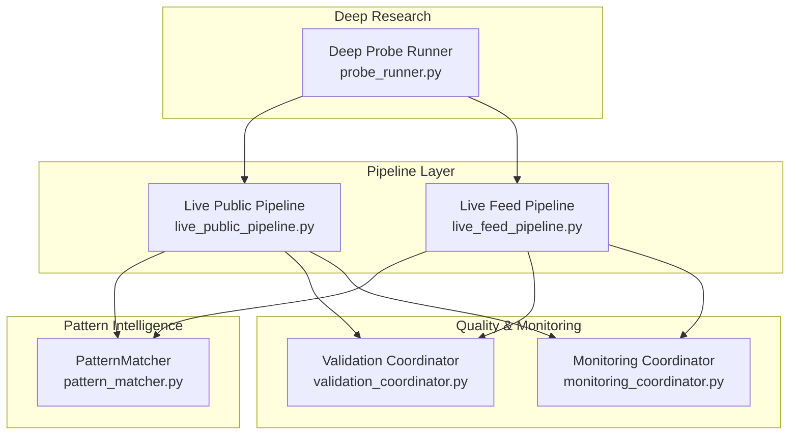
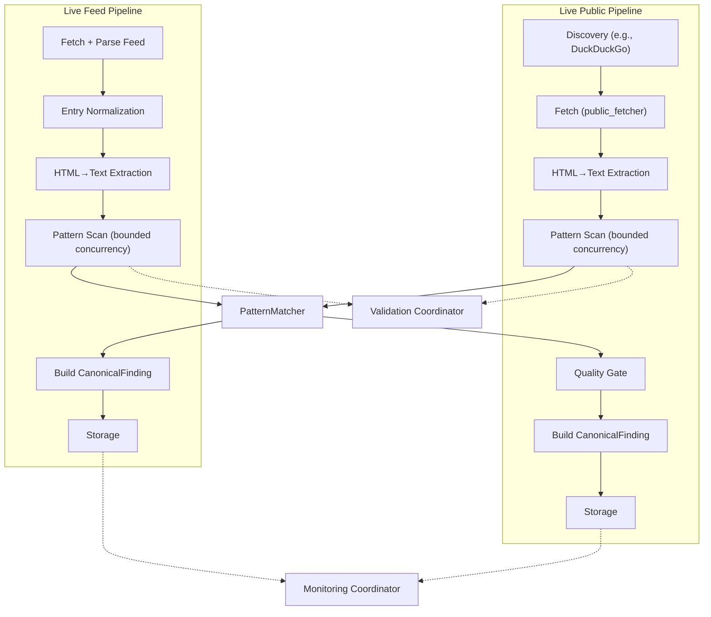
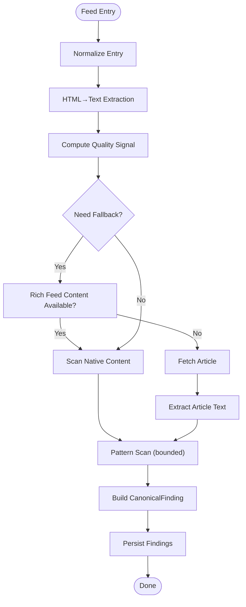
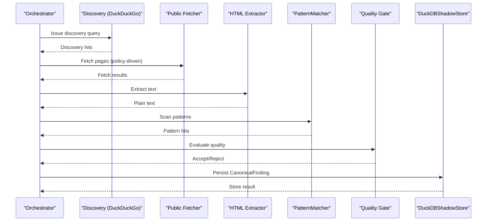
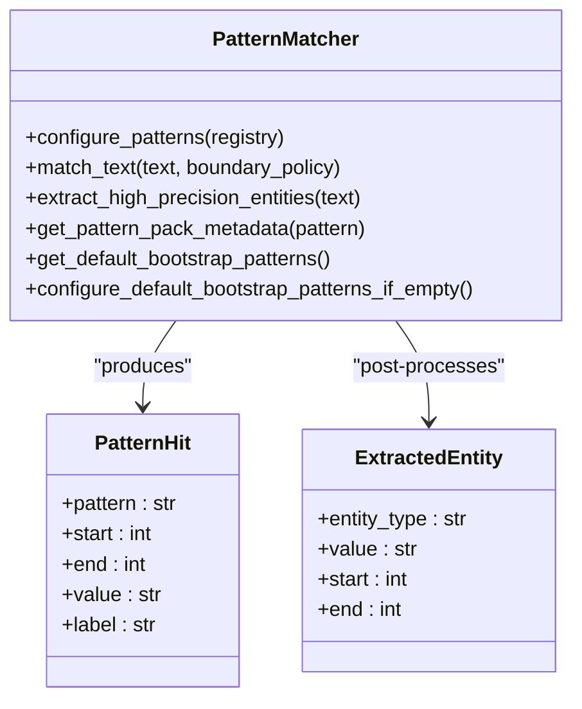
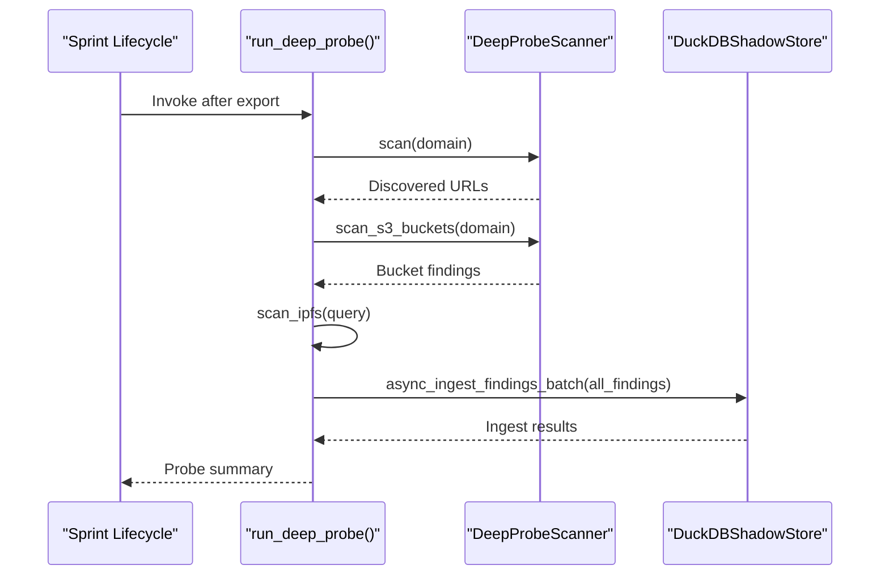
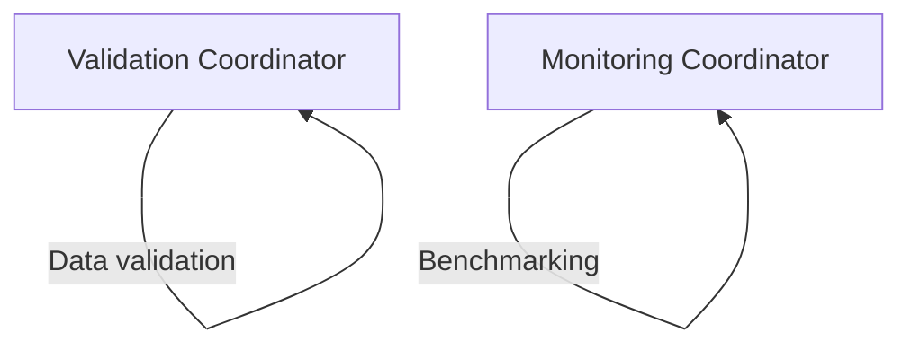
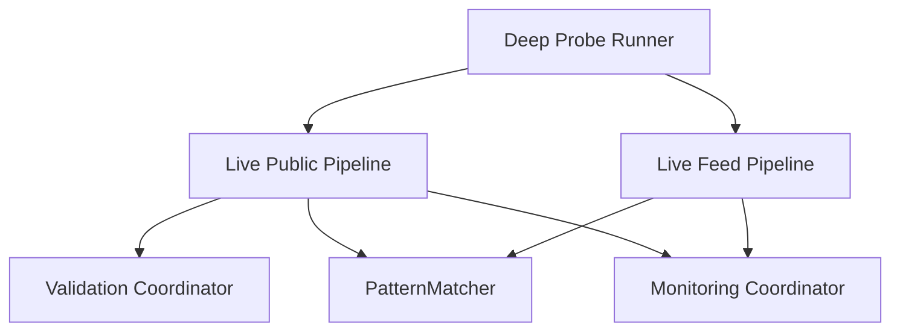

# Pipeline System

<cite>
**Referenced Files in This Document**
- [live_feed_pipeline.py](file://hledac/universal/pipeline/live_feed_pipeline.py)
- [live_public_pipeline.py](file://hledac/universal/pipeline/live_public_pipeline.py)
- [pattern_matcher.py](file://hledac/universal/patterns/pattern_matcher.py)
- [probe_runner.py](file://hledac/universal/deep_research/probe_runner.py)
- [validation_coordinator.py](file://hledac/universal/coordinators/validation_coordinator.py)
- [monitoring_coordinator.py](file://hledac/universal/coordinators/monitoring_coordinator.py)
</cite>

## Table of Contents
1. [Introduction](#introduction)
2. [Project Structure](#project-structure)
3. [Core Components](#core-components)
4. [Architecture Overview](#architecture-overview)
5. [Detailed Component Analysis](#detailed-component-analysis)
6. [Dependency Analysis](#dependency-analysis)
7. [Performance Considerations](#performance-considerations)
8. [Troubleshooting Guide](#troubleshooting-guide)
9. [Conclusion](#conclusion)
10. [Appendices](#appendices)

## Introduction
This document explains the Hledac Universal pipeline system with a focus on two live pipelines: the Live Feed Pipeline (RSS/Atom) and the Live Public Pipeline (open-surface discovery and harvesting). It covers their architectures, differences, and use cases; the pattern matching and analysis capabilities; quality control and validation mechanisms; the deep research probe runner and its integration; configuration options, performance characteristics, and optimization strategies; examples of custom pipeline development; and error handling, retry mechanisms, and monitoring capabilities.

## Project Structure
The pipeline system is organized around dedicated pipeline modules, a robust pattern matcher, and auxiliary coordinators for validation and monitoring. The Live Feed Pipeline focuses on passive, pattern-driven discovery from syndicated feeds. The Live Public Pipeline performs discovery, fetching, extraction, pattern scanning, quality gating, and canonical finding creation for public sources.

**Diagram sources**
- [live_feed_pipeline.py:1-30](file://hledac/universal/pipeline/live_feed_pipeline.py#L1-L30)
- [live_public_pipeline.py:1-11](file://hledac/universal/pipeline/live_public_pipeline.py#L1-L11)
- [pattern_matcher.py:1-31](file://hledac/universal/patterns/pattern_matcher.py#L1-L31)
- [probe_runner.py:1-30](file://hledac/universal/deep_research/probe_runner.py#L1-L30)
- [validation_coordinator.py:1-17](file://hledac/universal/coordinators/validation_coordinator.py#L1-L17)
- [monitoring_coordinator.py:1-19](file://hledac/universal/coordinators/monitoring_coordinator.py#L1-L19)

**Section sources**
- [live_feed_pipeline.py:1-30](file://hledac/universal/pipeline/live_feed_pipeline.py#L1-L30)
- [live_public_pipeline.py:1-11](file://hledac/universal/pipeline/live_public_pipeline.py#L1-L11)

## Core Components
- Live Feed Pipeline: Passive, pattern-driven feed ingestion with quality signals, fallback decision logic, and economic verdicts for feed branches.
- Live Public Pipeline: Discovery, fetch, extraction, pattern scanning, quality gates, and canonical finding creation for public sources.
- PatternMatcher: Singleton Aho-Corasick-based matcher with structured entity extraction and bootstrap pattern packs.
- Deep Probe Runner: Post-sprint deep research that runs fail-soft and persists findings via the canonical path.
- Validation Coordinator: Data validation, content cleaning, and language detection with caching and MLX support.
- Monitoring Coordinator: System metrics, background collection, alerting, and performance benchmarking.

**Section sources**
- [live_feed_pipeline.py:1-30](file://hledac/universal/pipeline/live_feed_pipeline.py#L1-L30)
- [live_public_pipeline.py:1-11](file://hledac/universal/pipeline/live_public_pipeline.py#L1-L11)
- [pattern_matcher.py:1-31](file://hledac/universal/patterns/pattern_matcher.py#L1-L31)
- [probe_runner.py:1-30](file://hledac/universal/deep_research/probe_runner.py#L1-L30)
- [validation_coordinator.py:1-17](file://hledac/universal/coordinators/validation_coordinator.py#L1-L17)
- [monitoring_coordinator.py:1-19](file://hledac/universal/coordinators/monitoring_coordinator.py#L1-L19)

## Architecture Overview
The pipelines share a common pattern scanning backbone and canonical finding model, while differing in data sources and quality controls. The Live Feed Pipeline emphasizes feed-native vs fallback sourcing and economic decision-making. The Live Public Pipeline emphasizes discovery-to-storage with pre-fetch quality gates and fetch accessibility diagnostics.

**Diagram sources**
- [live_feed_pipeline.py:1-30](file://hledac/universal/pipeline/live_feed_pipeline.py#L1-L30)
- [live_public_pipeline.py:1-11](file://hledac/universal/pipeline/live_public_pipeline.py#L1-L11)
- [pattern_matcher.py:1-31](file://hledac/universal/patterns/pattern_matcher.py#L1-L31)
- [validation_coordinator.py:1-17](file://hledac/universal/coordinators/validation_coordinator.py#L1-L17)
- [monitoring_coordinator.py:1-19](file://hledac/universal/coordinators/monitoring_coordinator.py#L1-L19)

## Detailed Component Analysis

### Live Feed Pipeline
- Purpose: Passive, pattern-backed discovery from RSS/Atom feeds.
- Key stages: Fetch + parse → normalize → HTML→text → pattern scan → canonical finding → storage.
- Quality signals: Lightweight per-entry scoring with metadata boosts and language mismatch detection.
- Fallback decision logic: Structured classification of when to attempt article fallback, including forced fallback scenarios and outcomes.
- Economic verdicts: Feed-native vs fallback contribution, yield ratios, and next-action recommendations.
- Concurrency: Pattern scanning offloaded via bounded semaphore to limit threads.
- Determinism: Finding IDs via SHA-256; per-entry and per-run deduplication strategies.

**Diagram sources**
- [live_feed_pipeline.py:318-488](file://hledac/universal/pipeline/live_feed_pipeline.py#L318-L488)

**Section sources**
- [live_feed_pipeline.py:1-30](file://hledac/universal/pipeline/live_feed_pipeline.py#L1-L30)
- [live_feed_pipeline.py:78-194](file://hledac/universal/pipeline/live_feed_pipeline.py#L78-L194)
- [live_feed_pipeline.py:322-488](file://hledac/universal/pipeline/live_feed_pipeline.py#L322-L488)
- [live_feed_pipeline.py:490-723](file://hledac/universal/pipeline/live_feed_pipeline.py#L490-L723)

### Live Public Pipeline
- Purpose: Discovery, fetch, extraction, pattern scanning, quality gating, and canonical finding creation for public sources.
- Key stages: Discovery → Fetch → HTML extraction → Pattern scan → Quality gate → Canonical finding → Storage.
- Discovery policy: Provider selection and telemetry; bootstrap URL generation for domain queries.
- Fetch policy: JS/DoH/stealth driven by signal strength and URL class.
- Quality gates: Pre-fetch skip thresholds, low-entropy detection, and structural quality.
- Telemetry: Comprehensive per-stage counters, zero-hit evidence, and provider surface diagnostics.
- Deterministic finding IDs; payload context windows; structured acceptance/rejection reasons.

**Diagram sources**
- [live_public_pipeline.py:1-11](file://hledac/universal/pipeline/live_public_pipeline.py#L1-L11)
- [live_public_pipeline.py:283-337](file://hledac/universal/pipeline/live_public_pipeline.py#L283-L337)
- [live_public_pipeline.py:451-643](file://hledac/universal/pipeline/live_public_pipeline.py#L451-L643)

**Section sources**
- [live_public_pipeline.py:1-11](file://hledac/universal/pipeline/live_public_pipeline.py#L1-L11)
- [live_public_pipeline.py:131-184](file://hledac/universal/pipeline/live_public_pipeline.py#L131-L184)
- [live_public_pipeline.py:306-337](file://hledac/universal/pipeline/live_public_pipeline.py#L306-L337)
- [live_public_pipeline.py:451-643](file://hledac/universal/pipeline/live_public_pipeline.py#L451-L643)

### Pattern Matching and Analysis
- Backend: Singleton Aho-Corasick automaton with lazy build; case-insensitive, word-boundary support.
- Bootstrap patterns: OSINT-focused literal pack layered by precision and vocabulary.
- Structured entities: Regex post-pass for high-precision identifiers (CVE, GHSA, onion v3, hashes, ETH, crypto, PGP, IPFS, API keys).
- Extraction: Pipeline-friendly list of entities with de-duplication and bounded limits.

**Diagram sources**
- [pattern_matcher.py:52-69](file://hledac/universal/patterns/pattern_matcher.py#L52-L69)
- [pattern_matcher.py:477-483](file://hledac/universal/patterns/pattern_matcher.py#L477-L483)
- [pattern_matcher.py:619-741](file://hledac/universal/patterns/pattern_matcher.py#L619-L741)

**Section sources**
- [pattern_matcher.py:1-31](file://hledac/universal/patterns/pattern_matcher.py#L1-L31)
- [pattern_matcher.py:583-800](file://hledac/universal/patterns/pattern_matcher.py#L583-L800)
- [pattern_matcher.py:485-533](file://hledac/universal/patterns/pattern_matcher.py#L485-L533)

### Deep Research Probe Runner
- Purpose: Post-sprint, bounded deep research that does not block export.
- Scope: Wayback path discovery, S3 bucket scanning, IPFS search; fail-safe execution; canonical batch ingestion.
- Invariants: Source type "deep_probe", bounded runtime and depth, canonical persistence path, DHT findings ephemeral.

**Diagram sources**
- [probe_runner.py:51-196](file://hledac/universal/deep_research/probe_runner.py#L51-L196)

**Section sources**
- [probe_runner.py:1-30](file://hledac/universal/deep_research/probe_runner.py#L1-L30)
- [probe_runner.py:51-196](file://hledac/universal/deep_research/probe_runner.py#L51-L196)

### Validation and Quality Control
- Validation Coordinator: Data validation (email, URL, JSON schema), content cleaning (HTML→Markdown/JSON/Text), language detection, custom validators, and MLX-powered cleaning.
- Monitoring Coordinator: System metrics, background collection, alert thresholds, performance benchmarking, and health checks.

**Diagram sources**
- [validation_coordinator.py:81-493](file://hledac/universal/coordinators/validation_coordinator.py#L81-L493)
- [monitoring_coordinator.py:101-800](file://hledac/universal/coordinators/monitoring_coordinator.py#L101-L800)

**Section sources**
- [validation_coordinator.py:1-17](file://hledac/universal/coordinators/validation_coordinator.py#L1-L17)
- [monitoring_coordinator.py:1-19](file://hledac/universal/coordinators/monitoring_coordinator.py#L1-L19)

## Dependency Analysis
- Live Feed Pipeline depends on:
  - PatternMatcher for pattern scanning.
  - DuckDBShadowStore for canonical finding persistence.
  - UMA state sampling for emergency aborts.
- Live Public Pipeline depends on:
  - Discovery adapters (e.g., DuckDuckGo).
  - Public fetcher transport.
  - PatternMatcher for scanning.
  - DuckDBShadowStore for persistence.
  - Validation Coordinator for content cleaning.
  - Monitoring Coordinator for system telemetry.
- Deep Probe Runner integrates with:
  - DeepProbeScanner for discovery/bucket/IPFS.
  - DuckDBShadowStore for canonical ingestion.

**Diagram sources**
- [live_feed_pipeline.py:1-30](file://hledac/universal/pipeline/live_feed_pipeline.py#L1-L30)
- [live_public_pipeline.py:1-11](file://hledac/universal/pipeline/live_public_pipeline.py#L1-L11)
- [pattern_matcher.py:1-31](file://hledac/universal/patterns/pattern_matcher.py#L1-L31)
- [validation_coordinator.py:1-17](file://hledac/universal/coordinators/validation_coordinator.py#L1-L17)
- [monitoring_coordinator.py:1-19](file://hledac/universal/coordinators/monitoring_coordinator.py#L1-L19)
- [probe_runner.py:1-30](file://hledac/universal/deep_research/probe_runner.py#L1-L30)

**Section sources**
- [live_feed_pipeline.py:1-30](file://hledac/universal/pipeline/live_feed_pipeline.py#L1-L30)
- [live_public_pipeline.py:1-11](file://hledac/universal/pipeline/live_public_pipeline.py#L1-L11)
- [pattern_matcher.py:1-31](file://hledac/universal/patterns/pattern_matcher.py#L1-L31)
- [probe_runner.py:1-30](file://hledac/universal/deep_research/probe_runner.py#L1-L30)

## Performance Considerations
- Concurrency control:
  - Live Feed Pipeline: bounded semaphore for pattern scanning to cap concurrent tasks.
  - Live Public Pipeline: offloading heavy I/O to threads; bounded fetch budgets and adaptive tiers.
- Memory governance:
  - UMA state sampled for emergency aborts; memory-gated fetches and quality gates.
- Extraction and scanning:
  - Lightweight HTML extractor; Aho-Corasick automaton with lazy build; regex post-pass for structured entities.
- Monitoring:
  - Background metrics collection with pressure-aware intervals; alert thresholds; benchmarking.
- Optimization strategies:
  - Pre-fetch quality gates to avoid low-yield fetches.
  - Structured entity extraction with bounded output.
  - MLX-accelerated cleaning and FFT where available.

[No sources needed since this section provides general guidance]

## Troubleshooting Guide
- Error handling and retries:
  - Deep Probe Runner: fail-safe execution with logging and canonical ingestion fallback; bounded runtime and depth.
  - Live Public Pipeline: discovery/fetch error taxonomy helpers; per-stage counters for diagnosing failures; zero-hit evidence surfaces.
  - Live Feed Pipeline: structured zero-hit evidence; upstream blockers; root-cause propagation.
- Diagnostics:
  - Validation Coordinator: HTML extraction fallbacks (selectolax-first, BeautifulSoup, regex); custom validator support.
  - Monitoring Coordinator: background collection, alert thresholds, benchmark history, health checks.
- Remediation tips:
  - Inspect per-stage counters and zero-hit summaries to identify bottlenecks.
  - Review discovery provider telemetry and timeouts.
  - Adjust fetch policies based on signal strength and URL class.
  - Monitor memory pressure and reduce collection frequency under elevated load.

**Section sources**
- [probe_runner.py:51-196](file://hledac/universal/deep_research/probe_runner.py#L51-L196)
- [live_public_pipeline.py:451-643](file://hledac/universal/pipeline/live_public_pipeline.py#L451-L643)
- [live_feed_pipeline.py:290-310](file://hledac/universal/pipeline/live_feed_pipeline.py#L290-L310)
- [validation_coordinator.py:363-442](file://hledac/universal/coordinators/validation_coordinator.py#L363-L442)
- [monitoring_coordinator.py:515-541](file://hledac/universal/coordinators/monitoring_coordinator.py#L515-L541)

## Conclusion
Hledac Universal’s pipeline system provides two complementary live pipelines: a passive feed-centric approach with robust fallback decision-making and economic verdicts, and a discovery-driven public pipeline with pre-fetch quality gates and comprehensive telemetry. Both pipelines leverage a unified PatternMatcher for precise, structured entity detection and canonical finding creation. The Validation and Monitoring Coordinators provide integrated quality control and observability, while the Deep Probe Runner extends post-sprint research safely and efficiently.

[No sources needed since this section summarizes without analyzing specific files]

## Appendices

### Pipeline Configuration Options
- Live Feed Pipeline:
  - Pattern registry: configure via PatternMatcher; bootstrap patterns applied if empty.
  - Concurrency: bounded semaphore for pattern scanning.
  - Quality thresholds: per-entry scoring bands and metadata boosts.
  - Economic verdicts: feed-native vs fallback contribution, next-action recommendations.
- Live Public Pipeline:
  - Discovery policy: provider selection and query variants.
  - Fetch policy: JS/DoH/stealth toggles based on signal strength and URL class.
  - Pre-fetch gates: minimum text length, low-entropy detection, discovery score thresholds.
  - Bootstrap URLs: deterministic domain-sourced candidates for initial fetch.

**Section sources**
- [pattern_matcher.py:627-786](file://hledac/universal/patterns/pattern_matcher.py#L627-L786)
- [live_feed_pipeline.py:209-214](file://hledac/universal/pipeline/live_feed_pipeline.py#L209-L214)
- [live_public_pipeline.py:131-184](file://hledac/universal/pipeline/live_public_pipeline.py#L131-L184)
- [live_public_pipeline.py:306-337](file://hledac/universal/pipeline/live_public_pipeline.py#L306-L337)

### Custom Pipeline Development Examples
- Extend PatternMatcher:
  - Seed registry snapshots and lazy automaton builds enable rapid iteration on pattern sets.
- Integrate Validation:
  - Use Validation Coordinator for HTML cleaning and content normalization before pattern scanning.
- Add Monitoring:
  - Leverage Monitoring Coordinator for background metrics and alert thresholds during pipeline runs.
- Deep Research Extension:
  - Use Deep Probe Runner as a template for bounded, post-sprint research that persists via canonical ingestion.

**Section sources**
- [pattern_matcher.py:619-741](file://hledac/universal/patterns/pattern_matcher.py#L619-L741)
- [validation_coordinator.py:314-442](file://hledac/universal/coordinators/validation_coordinator.py#L314-L442)
- [monitoring_coordinator.py:174-233](file://hledac/universal/coordinators/monitoring_coordinator.py#L174-L233)
- [probe_runner.py:250-277](file://hledac/universal/deep_research/probe_runner.py#L250-L277)