# Architecture Overview

<cite>
**Referenced Files in This Document**
- [__main__.py](file://hledac/universal/__main__.py)
- [core/__main__.py](file://hledac/universal/core/__main__.py)
- [autonomous_orchestrator.py](file://hledac/universal/autonomous_orchestrator.py)
- [brain/__init__.py](file://hledac/universal/brain/__init__.py)
- [knowledge/__init__.py](file://hledac/universal/knowledge/__init__.py)
- [layers/__init__.py](file://hledac/universal/layers/__init__.py)
- [runtime/sprint_scheduler.py](file://hledac/universal/runtime/sprint_scheduler.py)
- [security/__init__.py](file://hledac/universal/security/__init__.py)
- [orchestrator/global_scheduler.py](file://hledac/universal/orchestrator/global_scheduler.py)
- [paths.py](file://hledac/universal/paths.py)
- [knowledge/duckdb_store.py](file://hledac/universal/knowledge/duckdb_store.py)
- [knowledge/lancedb_store.py](file://hledac/universal/knowledge/lancedb_store.py)
</cite>

## Table of Contents
1. [Introduction](#introduction)
2. [Project Structure](#project-structure)
3. [Core Components](#core-components)
4. [Architecture Overview](#architecture-overview)
5. [Detailed Component Analysis](#detailed-component-analysis)
6. [Dependency Analysis](#dependency-analysis)
7. [Performance Considerations](#performance-considerations)
8. [Troubleshooting Guide](#troubleshooting-guide)
9. [Conclusion](#conclusion)
10. [Appendices](#appendices)

## Introduction
This document presents the Hledac Universal system architecture, focusing on the layered design across brain, knowledge, and runtime layers. It explains boot and initialization sequences, the authority model with canonical, shell, alternate, residual, and diagnostic roles, system boundaries, component interactions, and data flows. It also documents technical decisions such as the use of asyncio for concurrency, storage layer choices (DuckDB, LMDB, LanceDB), and layered security. Finally, it covers infrastructure requirements, scalability considerations, deployment topology, and system integration with external intelligence sources and reporting systems.

## Project Structure
The repository is organized around three primary layers:
- Brain layer: reasoning engines, hypothesis engines, and model lifecycle management.
- Knowledge layer: storage, graph, and retrieval systems.
- Runtime layer: scheduling, lifecycle management, and orchestration.

Supporting modules include:
- Layers: security, stealth, privacy, communication, content, and coordination.
- Security: PII detection, encryption, vault management, and steganography detection.
- Orchestrator: global priority scheduling for distributed processing on a single M1.
- Paths: canonical path authority and boot hygiene.

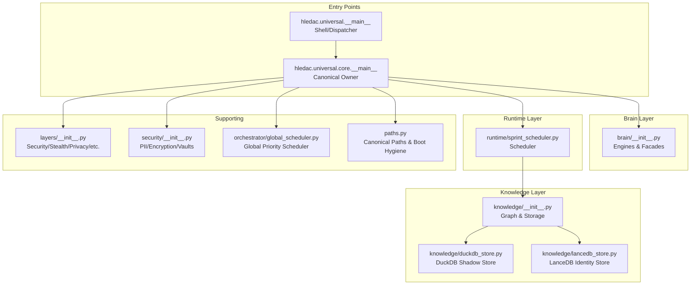

**Diagram sources**
- [__main__.py:1-200](file://hledac/universal/__main__.py#L1-L200)
- [core/__main__.py:1-120](file://hledac/universal/core/__main__.py#L1-L120)
- [brain/__init__.py:1-60](file://hledac/universal/brain/__init__.py#L1-L60)
- [knowledge/__init__.py:1-60](file://hledac/universal/knowledge/__init__.py#L1-L60)
- [runtime/sprint_scheduler.py:1-120](file://hledac/universal/runtime/sprint_scheduler.py#L1-L120)
- [security/__init__.py:1-40](file://hledac/universal/security/__init__.py#L1-L40)
- [orchestrator/global_scheduler.py:1-80](file://hledac/universal/orchestrator/global_scheduler.py#L1-L80)
- [paths.py:1-120](file://hledac/universal/paths.py#L1-L120)

**Section sources**
- [__main__.py:1-200](file://hledac/universal/__main__.py#L1-L200)
- [core/__main__.py:1-120](file://hledac/universal/core/__main__.py#L1-L120)
- [brain/__init__.py:1-60](file://hledac/universal/brain/__init__.py#L1-L60)
- [knowledge/__init__.py:1-60](file://hledac/universal/knowledge/__init__.py#L1-L60)
- [layers/__init__.py:1-60](file://hledac/universal/layers/__init__.py#L1-L60)
- [security/__init__.py:1-40](file://hledac/universal/security/__init__.py#L1-L40)
- [orchestrator/global_scheduler.py:1-80](file://hledac/universal/orchestrator/global_scheduler.py#L1-L80)
- [paths.py:1-120](file://hledac/universal/paths.py#L1-L120)

## Core Components
- Entry points and authority model:
  - Shell/dispatcher: root entry point that delegates to canonical or alternate paths.
  - Canonical owner: sole producer of canonical run truth and lifecycle ownership.
  - Alternate/residual/diagnostic: non-canonical paths for migration, helpers, and probes.
- Brain layer:
  - Engines for reasoning, insight, inference, hypothesis, and model lifecycle management.
  - Facade module exposing available engines with availability guards.
- Knowledge layer:
  - DuckDB-backed canonical facts store (DuckDBShadowStore).
  - LanceDB-based identity store for entity resolution.
  - Legacy compatibility seams for backward-compatibility.
- Runtime layer:
  - SprintScheduler orchestrates bounded sprints with tiered sources and lifecycle enforcement.
- Supporting modules:
  - Layers: security, stealth, privacy, communication, content, and coordination.
  - Security: PII gate, vaults, encryption, steganography detection.
  - Global scheduler: process pool with priority queues and CPU affinity.
  - Paths: canonical path authority, RAM disk selection, boot hygiene.

**Section sources**
- [__main__.py:70-183](file://hledac/universal/__main__.py#L70-L183)
- [core/__main__.py:1-60](file://hledac/universal/core/__main__.py#L1-L60)
- [brain/__init__.py:1-60](file://hledac/universal/brain/__init__.py#L1-L60)
- [knowledge/__init__.py:1-60](file://hledac/universal/knowledge/__init__.py#L1-L60)
- [runtime/sprint_scheduler.py:1-60](file://hledac/universal/runtime/sprint_scheduler.py#L1-L60)
- [security/__init__.py:1-40](file://hledac/universal/security/__init__.py#L1-L40)
- [orchestrator/global_scheduler.py:1-60](file://hledac/universal/orchestrator/global_scheduler.py#L1-L60)
- [paths.py:1-120](file://hledac/universal/paths.py#L1-L120)

## Architecture Overview
Hledac Universal follows a layered architecture:
- Brain layer encapsulates reasoning and model lifecycle.
- Knowledge layer provides durable and efficient storage for facts, identities, and graphs.
- Runtime layer coordinates bounded sprints, enforces lifecycle, and orchestrates pipelines.
- Supporting layers integrate security, stealth, privacy, and communication.

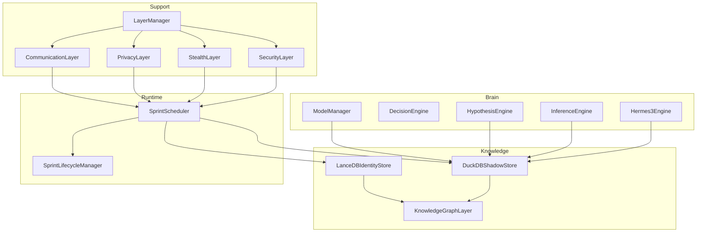

**Diagram sources**
- [brain/__init__.py:30-160](file://hledac/universal/brain/__init__.py#L30-L160)
- [knowledge/duckdb_store.py:533-780](file://hledac/universal/knowledge/duckdb_store.py#L533-L780)
- [knowledge/lancedb_store.py:66-180](file://hledac/universal/knowledge/lancedb_store.py#L66-L180)
- [runtime/sprint_scheduler.py:568-730](file://hledac/universal/runtime/sprint_scheduler.py#L568-L730)
- [layers/__init__.py:18-95](file://hledac/universal/layers/__init__.py#L18-L95)

## Detailed Component Analysis

### Boot Sequence and Initialization
The boot sequence establishes authority, performs pre-flight checks, initializes stores, and wires lifecycle and scheduler components. It enforces a strict authority model and boot hygiene.

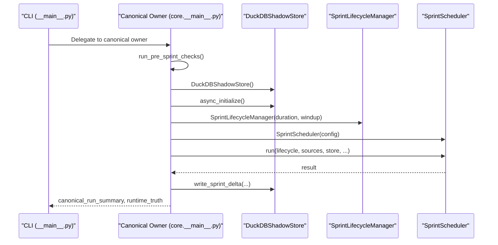

**Diagram sources**
- [__main__.py:349-396](file://hledac/universal/__main__.py#L349-L396)
- [core/__main__.py:220-320](file://hledac/universal/core/__main__.py#L220-L320)
- [runtime/sprint_scheduler.py:568-730](file://hledac/universal/runtime/sprint_scheduler.py#L568-L730)
- [knowledge/duckdb_store.py:533-620](file://hledac/universal/knowledge/duckdb_store.py#L533-L620)

**Section sources**
- [__main__.py:349-396](file://hledac/universal/__main__.py#L349-L396)
- [core/__main__.py:220-320](file://hledac/universal/core/__main__.py#L220-L320)
- [runtime/sprint_scheduler.py:568-730](file://hledac/universal/runtime/sprint_scheduler.py#L568-L730)
- [knowledge/duckdb_store.py:533-620](file://hledac/universal/knowledge/duckdb_store.py#L533-L620)

### Authority Model: Canonical, Shell, Alternate, Residual, Diagnostic
The authority model defines clear ownership and delegation:
- Canonical: sole owner of production truth and lifecycle.
- Shell: dispatcher that reads CLI and delegates to canonical or alternate.
- Alternate: legacy production path, not canonical.
- Residual: shared helpers, not sprint owners.
- Diagnostic: probes/benchmarks, not for production.

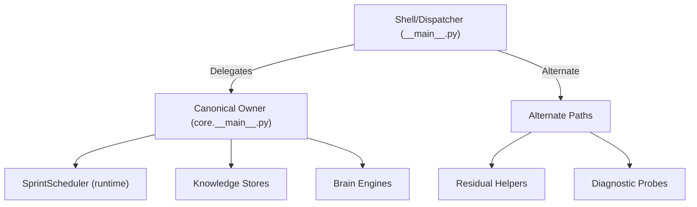

**Diagram sources**
- [__main__.py:70-183](file://hledac/universal/__main__.py#L70-L183)
- [core/__main__.py:1-60](file://hledac/universal/core/__main__.py#L1-L60)

**Section sources**
- [__main__.py:70-183](file://hledac/universal/__main__.py#L70-L183)
- [core/__main__.py:1-60](file://hledac/universal/core/__main__.py#L1-L60)

### Storage Layer Architecture: DuckDB, LMDB, LanceDB
- DuckDBShadowStore: canonical facts store for sprint-level analytics and derived metrics. Uses a single-threaded worker pool and thread-affine connections.
- LanceDBIdentityStore: identity/entity store with hybrid vector/FTS search, embedding caching, and MLX acceleration.
- Legacy compatibility: knowledge module exposes legacy storage types via lazy imports to avoid import-time coupling.

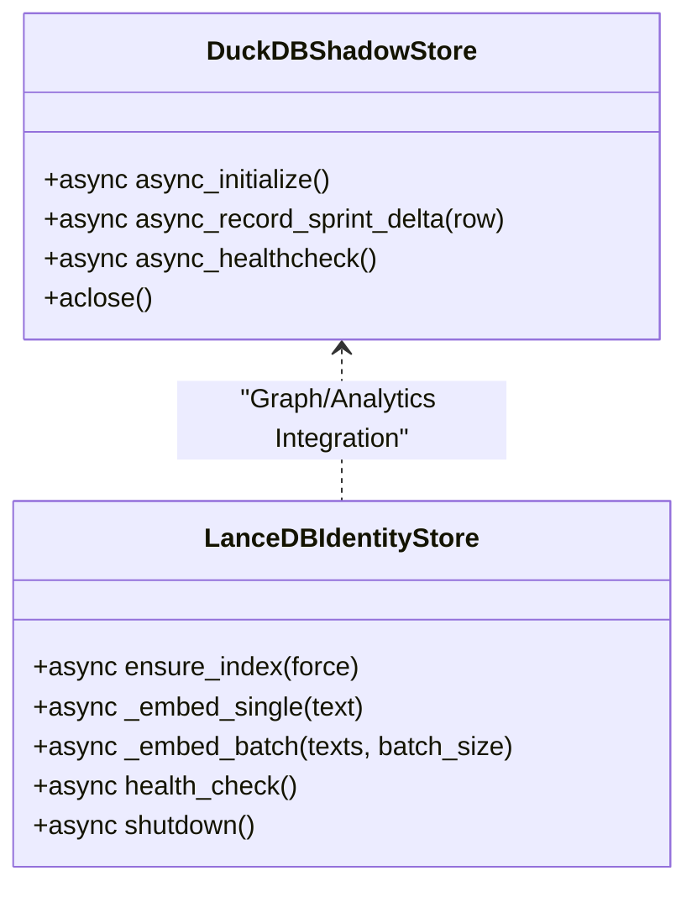

**Diagram sources**
- [knowledge/duckdb_store.py:533-780](file://hledac/universal/knowledge/duckdb_store.py#L533-L780)
- [knowledge/lancedb_store.py:66-180](file://hledac/universal/knowledge/lancedb_store.py#L66-L180)

**Section sources**
- [knowledge/duckdb_store.py:1-200](file://hledac/universal/knowledge/duckdb_store.py#L1-L200)
- [knowledge/lancedb_store.py:1-120](file://hledac/universal/knowledge/lancedb_store.py#L1-L120)
- [knowledge/__init__.py:1-60](file://hledac/universal/knowledge/__init__.py#L1-L60)

### Concurrency and Scheduling: asyncio and Global Scheduler
- asyncio: used extensively for non-blocking I/O, task cancellation, and signal-safe teardown.
- GlobalPriorityScheduler: process pool executor with priority queues, CPU affinity, and work-stealing for distributed processing on a single M1.

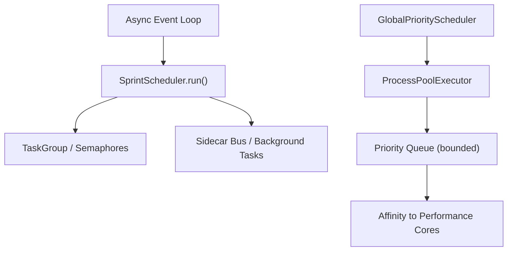

**Diagram sources**
- [runtime/sprint_scheduler.py:568-730](file://hledac/universal/runtime/sprint_scheduler.py#L568-L730)
- [orchestrator/global_scheduler.py:59-120](file://hledac/universal/orchestrator/global_scheduler.py#L59-L120)

**Section sources**
- [runtime/sprint_scheduler.py:568-730](file://hledac/universal/runtime/sprint_scheduler.py#L568-L730)
- [orchestrator/global_scheduler.py:59-120](file://hledac/universal/orchestrator/global_scheduler.py#L59-L120)

### Layered Security Approach
Security is integrated across layers:
- SecurityLayer: cryptography, obfuscation, secure destruction.
- StealthLayer: evasion, CAPTCHA solving, fingerprint randomization.
- PrivacyLayer: VPN/Tor, PGP, audit logging.
- CommunicationLayer: agent messaging, model bridge.
- Security module: PII detection, encryption, vault management, steganography detection.

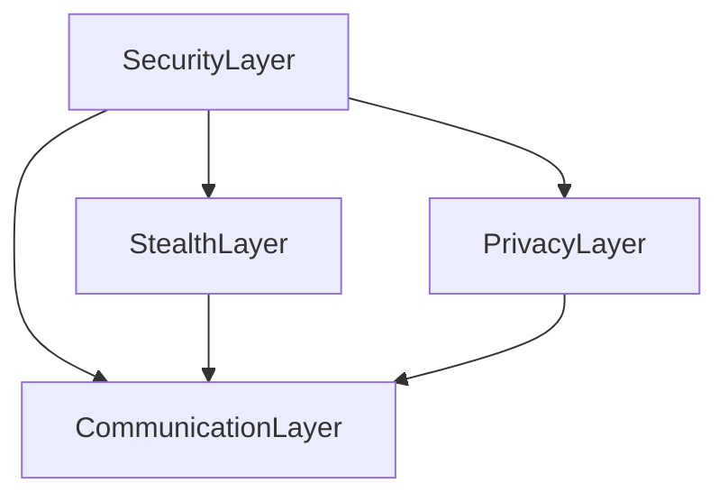

**Diagram sources**
- [layers/__init__.py:18-95](file://hledac/universal/layers/__init__.py#L18-L95)
- [security/__init__.py:1-106](file://hledac/universal/security/__init__.py#L1-L106)

**Section sources**
- [layers/__init__.py:18-95](file://hledac/universal/layers/__init__.py#L18-L95)
- [security/__init__.py:1-106](file://hledac/universal/security/__init__.py#L1-L106)

### System Boundaries and Data Flows
- Canonical boundary: core.__main__.run_sprint is the sole owner of canonical truth surfaces.
- Knowledge boundary: DuckDBShadowStore is the canonical facts authority; LanceDBIdentityStore is the identity authority.
- Runtime boundary: SprintScheduler executes under lifecycle authority and does not own lifecycle transitions.
- External integrations: intelligence sources (RSS/Atom feeds), CT log clients, and export/reporting systems.

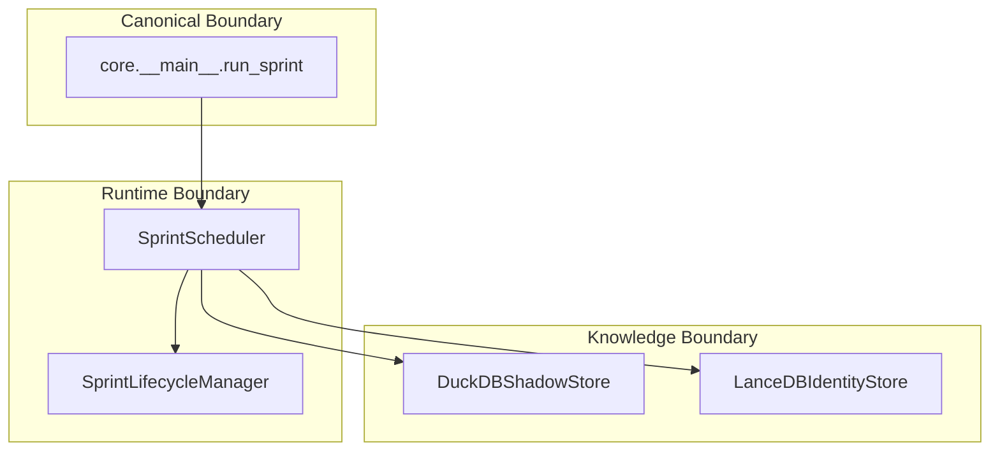

**Diagram sources**
- [core/__main__.py:320-420](file://hledac/universal/core/__main__.py#L320-L420)
- [runtime/sprint_scheduler.py:568-730](file://hledac/universal/runtime/sprint_scheduler.py#L568-L730)
- [knowledge/duckdb_store.py:533-620](file://hledac/universal/knowledge/duckdb_store.py#L533-L620)
- [knowledge/lancedb_store.py:66-120](file://hledac/universal/knowledge/lancedb_store.py#L66-L120)

**Section sources**
- [core/__main__.py:320-420](file://hledac/universal/core/__main__.py#L320-L420)
- [runtime/sprint_scheduler.py:568-730](file://hledac/universal/runtime/sprint_scheduler.py#L568-L730)
- [knowledge/duckdb_store.py:533-620](file://hledac/universal/knowledge/duckdb_store.py#L533-L620)
- [knowledge/lancedb_store.py:66-120](file://hledac/universal/knowledge/lancedb_store.py#L66-L120)

### Relationship Between Main Entry Points and Responsibilities
- Root entry point: shell/dispatcher that reads CLI and delegates to canonical or alternate.
- Canonical entry point: core.__main__.run_sprint is the sole owner of production truth and lifecycle.
- Alternate entry point: legacy production path that calls run_sprint directly but is not canonical.
- Residual/diagnostic: helper and probe-only paths.

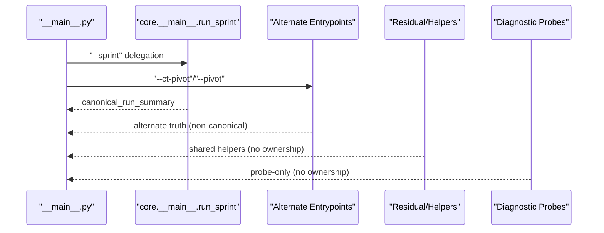

**Diagram sources**
- [__main__.py:70-183](file://hledac/universal/__main__.py#L70-L183)
- [core/__main__.py:1-60](file://hledac/universal/core/__main__.py#L1-L60)

**Section sources**
- [__main__.py:70-183](file://hledac/universal/__main__.py#L70-L183)
- [core/__main__.py:1-60](file://hledac/universal/core/__main__.py#L1-L60)

### Infrastructure Requirements, Scalability, and Deployment Topology
- RAM disk: canonical path authority for runtime paths; fallback to SSD with OPSEC warning.
- Boot hygiene: LMDB lock cleanup, stale socket removal, and path validation.
- Concurrency: uvloop installation, asyncio event loops, and process pool for heavy tasks.
- Scalability: bounded memory usage, adaptive timeouts, mission budget tracking, and sidecar gating under RAM pressure.
- Deployment: single M1 focus with CPU affinity and priority scheduling; distributed via process pools.

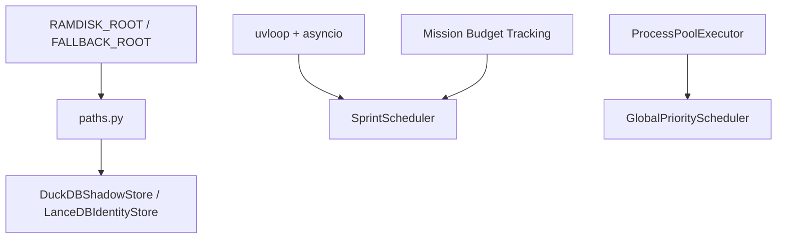

**Diagram sources**
- [paths.py:111-166](file://hledac/universal/paths.py#L111-L166)
- [knowledge/duckdb_store.py:533-620](file://hledac/universal/knowledge/duckdb_store.py#L533-L620)
- [knowledge/lancedb_store.py:66-120](file://hledac/universal/knowledge/lancedb_store.py#L66-L120)
- [runtime/sprint_scheduler.py:650-730](file://hledac/universal/runtime/sprint_scheduler.py#L650-L730)
- [orchestrator/global_scheduler.py:59-120](file://hledac/universal/orchestrator/global_scheduler.py#L59-L120)

**Section sources**
- [paths.py:111-166](file://hledac/universal/paths.py#L111-L166)
- [runtime/sprint_scheduler.py:650-730](file://hledac/universal/runtime/sprint_scheduler.py#L650-L730)
- [orchestrator/global_scheduler.py:59-120](file://hledac/universal/orchestrator/global_scheduler.py#L59-L120)

### System Context: External Intelligence Sources and Reporting
- Intelligence sources: RSS/Atom feeds, CT log client, and public discovery pipelines.
- Reporting: canonical JSON and markdown reports, STIX bundles, and export handoffs.
- Integration: sidecar buses, advisory gates, and correlation engines.

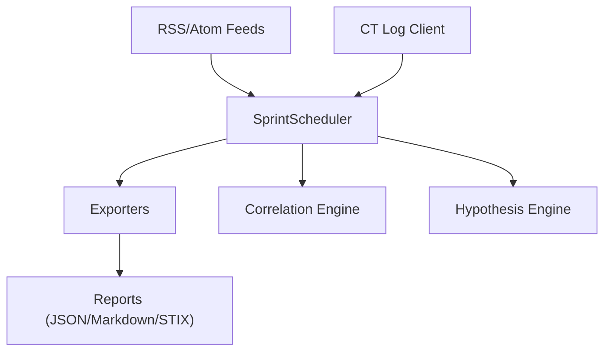

**Diagram sources**
- [core/__main__.py:386-396](file://hledac/universal/core/__main__.py#L386-L396)
- [runtime/sprint_scheduler.py:500-530](file://hledac/universal/runtime/sprint_scheduler.py#L500-L530)

**Section sources**
- [core/__main__.py:386-396](file://hledac/universal/core/__main__.py#L386-L396)
- [runtime/sprint_scheduler.py:500-530](file://hledac/universal/runtime/sprint_scheduler.py#L500-L530)

## Dependency Analysis
The system exhibits clear separation of concerns:
- Entry points depend on canonical owner for truth.
- Runtime depends on knowledge stores and brain engines.
- Supporting layers integrate security, stealth, and privacy.
- Storage layers are decoupled via facades and lazy imports.

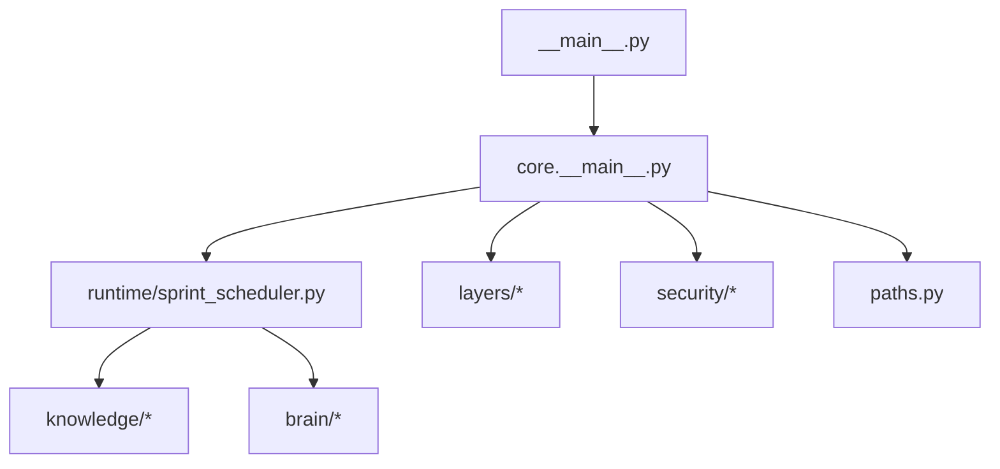

**Diagram sources**
- [__main__.py:1-120](file://hledac/universal/__main__.py#L1-L120)
- [core/__main__.py:1-120](file://hledac/universal/core/__main__.py#L1-L120)
- [runtime/sprint_scheduler.py:1-120](file://hledac/universal/runtime/sprint_scheduler.py#L1-L120)
- [knowledge/__init__.py:1-60](file://hledac/universal/knowledge/__init__.py#L1-L60)
- [brain/__init__.py:1-60](file://hledac/universal/brain/__init__.py#L1-L60)
- [layers/__init__.py:1-60](file://hledac/universal/layers/__init__.py#L1-L60)
- [security/__init__.py:1-40](file://hledac/universal/security/__init__.py#L1-L40)
- [paths.py:1-120](file://hledac/universal/paths.py#L1-L120)

**Section sources**
- [__main__.py:1-120](file://hledac/universal/__main__.py#L1-L120)
- [core/__main__.py:1-120](file://hledac/universal/core/__main__.py#L1-L120)
- [runtime/sprint_scheduler.py:1-120](file://hledac/universal/runtime/sprint_scheduler.py#L1-L120)
- [knowledge/__init__.py:1-60](file://hledac/universal/knowledge/__init__.py#L1-L60)
- [brain/__init__.py:1-60](file://hledac/universal/brain/__init__.py#L1-L60)
- [layers/__init__.py:1-60](file://hledac/universal/layers/__init__.py#L1-L60)
- [security/__init__.py:1-40](file://hledac/universal/security/__init__.py#L1-L40)
- [paths.py:1-120](file://hledac/universal/paths.py#L1-L120)

## Performance Considerations
- Concurrency: uvloop installation, asyncio task cancellation, and signal-safe teardown reduce overhead.
- Memory: bounded caches, adaptive timeouts, and mission budget tracking prevent OOM on M1 8GB.
- Storage: DuckDB single-threaded worker pool and thread-affine connections minimize contention.
- Embeddings: LMDB cache with float16 quantization and binary signatures reduce memory footprint.
- Scheduling: priority queues and CPU affinity improve throughput on single M1.

[No sources needed since this section provides general guidance]

## Troubleshooting Guide
- Boot hygiene: verify RAM disk availability and clean stale LMDB locks and sockets.
- Signal handling: signal handlers set flags and stop the loop; ensure AsyncExitStack unwinds properly.
- Task cancellation: orphan tasks are cancelled before loop close to prevent warnings.
- Health checks: DuckDBShadowStore and LanceDBIdentityStore expose health checks for diagnostics.

**Section sources**
- [paths.py:382-430](file://hledac/universal/paths.py#L382-L430)
- [__main__.py:315-344](file://hledac/universal/__main__.py#L315-L344)
- [__main__.py:502-535](file://hledac/universal/__main__.py#L502-L535)
- [knowledge/duckdb_store.py:432-460](file://hledac/universal/knowledge/duckdb_store.py#L432-L460)
- [knowledge/lancedb_store.py:432-460](file://hledac/universal/knowledge/lancedb_store.py#L432-L460)

## Conclusion
Hledac Universal employs a layered architecture with a strict authority model, robust boot hygiene, and layered security. The canonical owner ensures truth integrity, while the runtime orchestrates bounded sprints over diverse intelligence sources. Storage layers leverage DuckDB, LMDB, and LanceDB for durability, identity, and analytics. Concurrency is handled via asyncio and a global priority scheduler, optimized for a single M1. The system integrates external intelligence sources and reporting systems through well-defined boundaries and sidecar buses.

[No sources needed since this section summarizes without analyzing specific files]

## Appendices
- Canonical ownership: canonical_sprint_owner must be "core.__main__.run_sprint" and no alternate/residual path may claim this field.
- Legacy compatibility: knowledge module exposes legacy types via lazy imports to avoid import-time coupling.
- Facade re-export: autonomous_orchestrator is a root re-export facade and not the canonical orchestrator.

**Section sources**
- [core/__main__.py:1-60](file://hledac/universal/core/__main__.py#L1-L60)
- [knowledge/__init__.py:26-66](file://hledac/universal/knowledge/__init__.py#L26-L66)
- [autonomous_orchestrator.py:1-67](file://hledac/universal/autonomous_orchestrator.py#L1-L67)