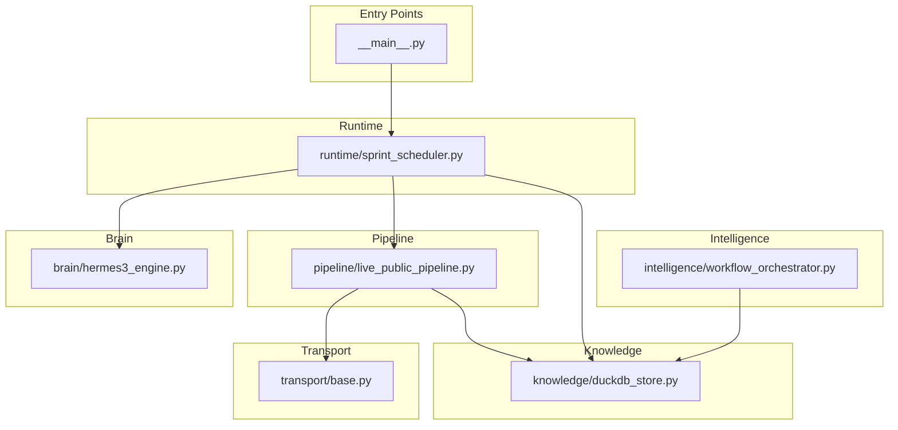
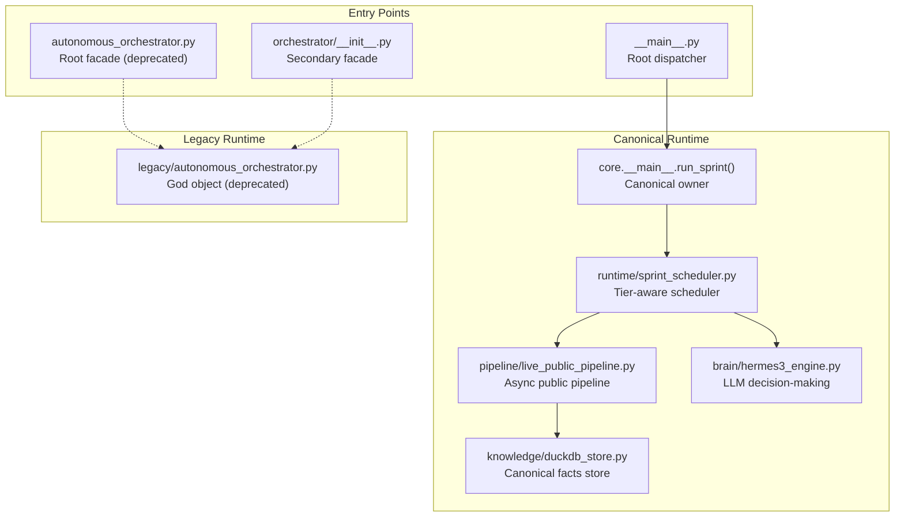
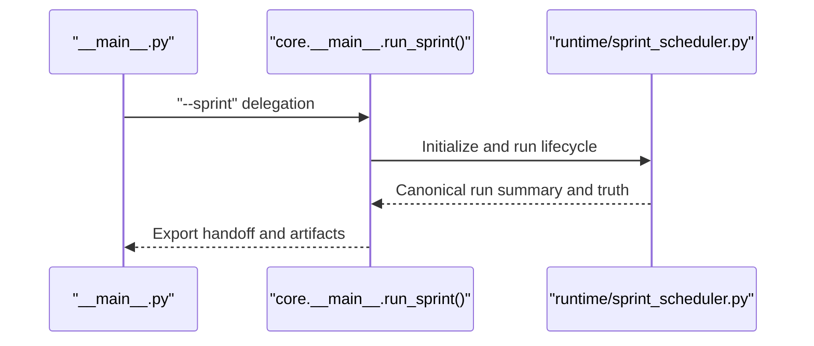
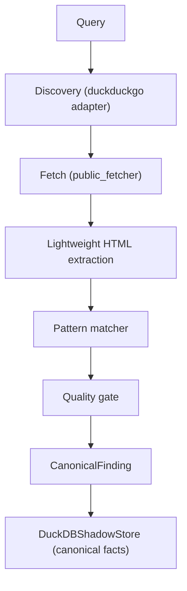
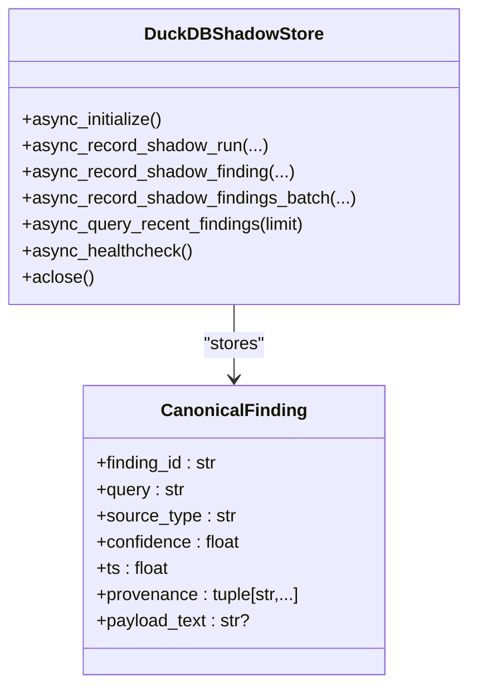
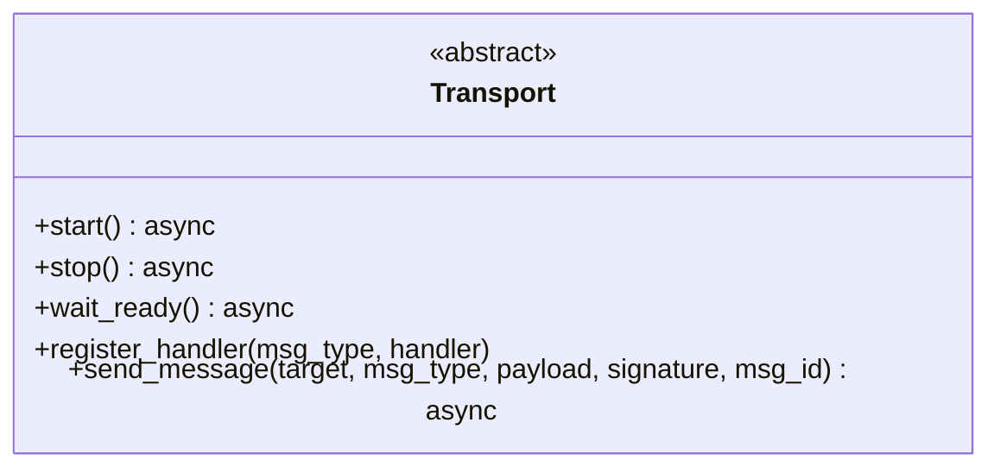
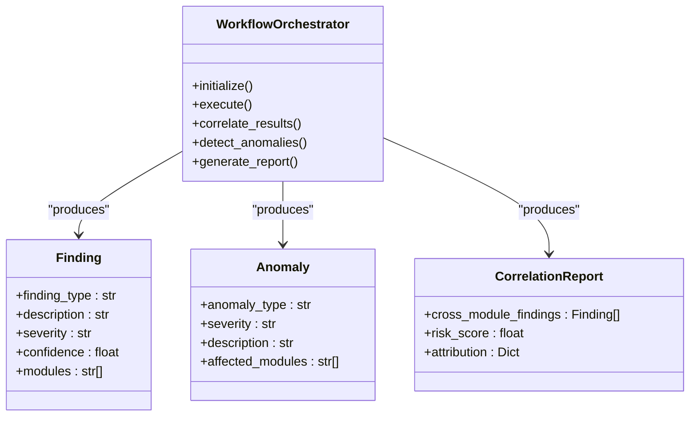
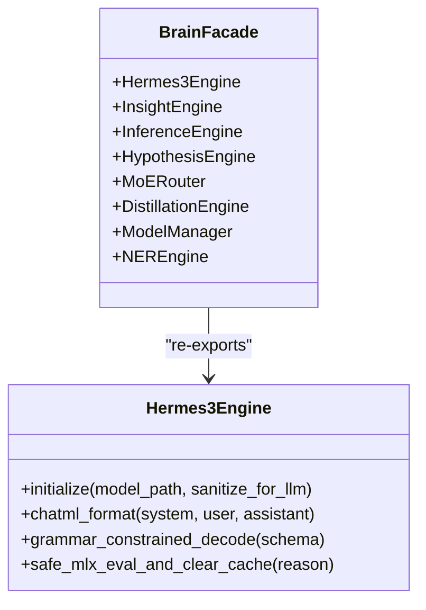
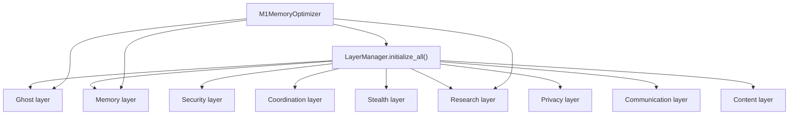
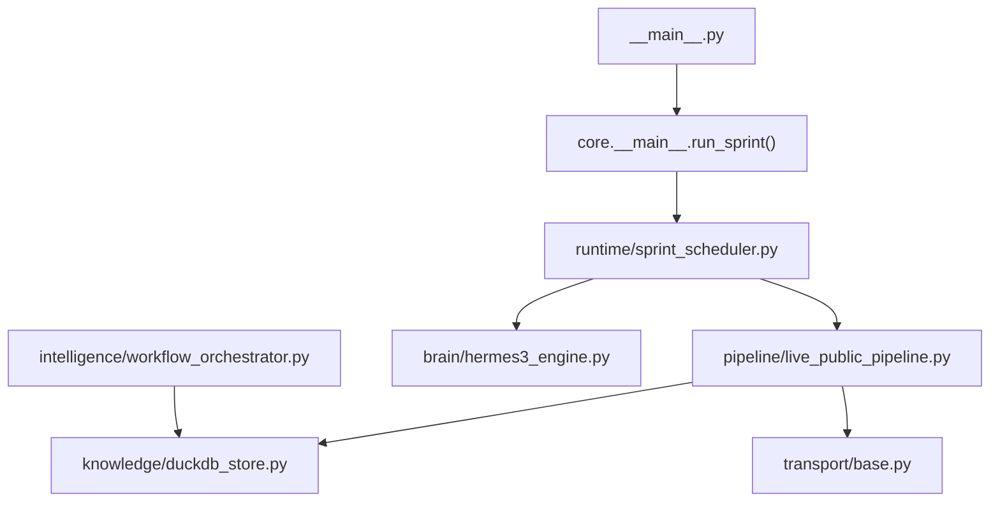

# Architecture Overview

<cite>
**Referenced Files in This Document**
- [REAL_ARCHITECTURE.md](file://REAL_ARCHITECTURE.md)
- [README.md](file://README.md)
- [__main__.py](file://__main__.py)
- [orchestrator/__init__.py](file://orchestrator/__init__.py)
- [autonomous_orchestrator.py](file://autonomous_orchestrator.py)
- [brain/__init__.py](file://brain/__init__.py)
- [hermes3_engine.py](file://brain/hermes3_engine.py)
- [knowledge/__init__.py](file://knowledge/__init__.py)
- [duckdb_store.py](file://knowledge/duckdb_store.py)
- [sprint_scheduler.py](file://runtime/sprint_scheduler.py)
- [live_public_pipeline.py](file://pipeline/live_public_pipeline.py)
- [base.py](file://transport/base.py)
- [base.py](file://coordinators/base.py)
- [layer_manager.py](file://layers/layer_manager.py)
- [workflow_orchestrator.py](file://intelligence/workflow_orchestrator.py)
</cite>

## Table of Contents
1. [Introduction](#introduction)
2. [Project Structure](#project-structure)
3. [Core Components](#core-components)
4. [Architecture Overview](#architecture-overview)
5. [Detailed Component Analysis](#detailed-component-analysis)
6. [Dependency Analysis](#dependency-analysis)
7. [Performance Considerations](#performance-considerations)
8. [Troubleshooting Guide](#troubleshooting-guide)
9. [Conclusion](#conclusion)

## Introduction
This document describes the high-level architecture of Hledac Universal, focusing on the layered design that separates concerns across:
- Core orchestrator layer
- Pipeline system
- Knowledge management layer
- Transport abstraction
- Intelligence modules
- AI/ML brain system

It explains the canonical ownership model that ensures single-source-of-truth data consistency, component interaction patterns, data flow architecture, and integration points between subsystems. It also documents system boundaries, external dependencies, and the design philosophy enabling autonomous operation with minimal human intervention.

## Project Structure
Hledac Universal is organized into clearly separated layers and modules:
- Runtime entry points and lifecycle management
- Pipeline for discovery, fetching, parsing, and canonical storage
- Knowledge layer for analytics, graph, and persistence
- Transport abstraction for network I/O
- Intelligence modules for analysis and synthesis
- AI/ML brain for decision-making and reasoning
- Layer orchestration for M1 memory optimization

**Diagram sources**
- [__main__.py:70-183](file://__main__.py#L70-L183)
- [sprint_scheduler.py:1-26](file://runtime/sprint_scheduler.py#L1-L26)
- [live_public_pipeline.py:1-11](file://pipeline/live_public_pipeline.py#L1-L11)
- [duckdb_store.py:1-57](file://knowledge/duckdb_store.py#L1-L57)
- [base.py:1-24](file://transport/base.py#L1-L24)
- [workflow_orchestrator.py:1-22](file://intelligence/workflow_orchestrator.py#L1-L22)
- [hermes3_engine.py:1-20](file://brain/hermes3_engine.py#L1-L20)

**Section sources**
- [README.md:1-48](file://README.md#L1-L48)
- [REAL_ARCHITECTURE.md:3-96](file://REAL_ARCHITECTURE.md#L3-L96)

## Core Components
- Core orchestrator layer: Managed by the canonical owner that controls lifecycle and ownership of truth. The root entry point delegates to the canonical owner, which is distinct from legacy facades.
- Pipeline system: Asynchronous, bounded batch processing that discovers, fetches, parses, and applies quality gates before writing canonical findings to the DuckDB store.
- Knowledge management layer: DuckDB-backed canonical facts store with analytics hooks and shadow findings; integrates with graph systems for IOC storage and semantic search.
- Transport abstraction: Pluggable transport interface for network I/O, enabling different transport mechanisms (Tor, I2P, in-memory) without changing pipeline logic.
- Intelligence modules: Cross-module analysis, pattern mining, and workflow orchestration that produce findings correlated across modules.
- AI/ML brain system: LLM-based decision-making engine (Hermes3) for synthesis and structured generation, with constrained decoding and memory guards.

**Section sources**
- [REAL_ARCHITECTURE.md:3-96](file://REAL_ARCHITECTURE.md#L3-L96)
- [__main__.py:70-183](file://__main__.py#L70-L183)
- [sprint_scheduler.py:1-26](file://runtime/sprint_scheduler.py#L1-L26)
- [live_public_pipeline.py:1-11](file://pipeline/live_public_pipeline.py#L1-L11)
- [duckdb_store.py:1-57](file://knowledge/duckdb_store.py#L1-L57)
- [base.py:1-24](file://transport/base.py#L1-L24)
- [workflow_orchestrator.py:1-22](file://intelligence/workflow_orchestrator.py#L1-L22)
- [hermes3_engine.py:1-20](file://brain/hermes3_engine.py#L1-L20)

## Architecture Overview
The architecture follows a canonical ownership model:
- Canonical owner: The runtime owner that produces canonical run summaries and owns report truth, export truth, and timing truth.
- Secondary facades: Legacy and root re-export facades that are not canonical owners and should not be used as production entry points.
- Two independent runtimes: A modern pipeline-based runtime and a legacy God-object runtime (deprecated).

**Diagram sources**
- [__main__.py:70-183](file://__main__.py#L70-L183)
- [autonomous_orchestrator.py:25-44](file://autonomous_orchestrator.py#L25-L44)
- [orchestrator/__init__.py:12-31](file://orchestrator/__init__.py#L12-L31)
- [sprint_scheduler.py:1-26](file://runtime/sprint_scheduler.py#L1-L26)
- [live_public_pipeline.py:1-11](file://pipeline/live_public_pipeline.py#L1-L11)
- [duckdb_store.py:1-57](file://knowledge/duckdb_store.py#L1-L57)
- [hermes3_engine.py:1-20](file://brain/hermes3_engine.py#L1-L20)

**Section sources**
- [REAL_ARCHITECTURE.md:3-96](file://REAL_ARCHITECTURE.md#L3-L96)
- [__main__.py:70-183](file://__main__.py#L70-L183)
- [autonomous_orchestrator.py:25-44](file://autonomous_orchestrator.py#L25-L44)
- [orchestrator/__init__.py:12-31](file://orchestrator/__init__.py#L12-L31)

## Detailed Component Analysis

### Core Orchestrator Layer
- Canonical owner: The runtime owner that controls lifecycle and ownership of truth. The root dispatcher delegates to the canonical owner, which is distinct from legacy facades.
- Authority roles: The entry point authority defines roles including canonical, shell/dispatcher, alternate, residual, and diagnostic, ensuring no confusion between canonical and observed paths.

**Diagram sources**
- [__main__.py:70-183](file://__main__.py#L70-L183)
- [sprint_scheduler.py:1-26](file://runtime/sprint_scheduler.py#L1-L26)

**Section sources**
- [__main__.py:70-183](file://__main__.py#L70-L183)

### Pipeline System
- Live public pipeline: Asynchronous, bounded batch processing that discovers, fetches, parses, and applies quality gates before writing canonical findings to the DuckDB store.
- Error taxonomy and adaptive budgets: The pipeline includes discovery and fetch error taxonomies and adaptive fetch budget tiers to reduce waste and improve throughput.

**Diagram sources**
- [live_public_pipeline.py:1-11](file://pipeline/live_public_pipeline.py#L1-L11)
- [live_public_pipeline.py:45-116](file://pipeline/live_public_pipeline.py#L45-L116)
- [duckdb_store.py:148-200](file://knowledge/duckdb_store.py#L148-L200)

**Section sources**
- [live_public_pipeline.py:1-11](file://pipeline/live_public_pipeline.py#L1-L11)
- [live_public_pipeline.py:45-116](file://pipeline/live_public_pipeline.py#L45-L116)
- [duckdb_store.py:148-200](file://knowledge/duckdb_store.py#L148-L200)

### Knowledge Management Layer
- DuckDB canonical facts store: Tiered facts, shadow findings, and graph integrations. The store is the canonical authority for sprint-level facts and analytics.
- Legacy compatibility: The knowledge module provides lazy re-exports for legacy storage types to maintain backward compatibility without import-time coupling.

**Diagram sources**
- [duckdb_store.py:148-200](file://knowledge/duckdb_store.py#L148-L200)
- [duckdb_store.py:1-57](file://knowledge/duckdb_store.py#L1-L57)

**Section sources**
- [duckdb_store.py:1-57](file://knowledge/duckdb_store.py#L1-L57)
- [knowledge/__init__.py:26-66](file://knowledge/__init__.py#L26-L66)

### Transport Abstraction
- Transport interface: Defines a transport abstraction with start, stop, wait_ready, register_handler, and send_message methods, enabling pluggable transport mechanisms.

**Diagram sources**
- [base.py:1-24](file://transport/base.py#L1-L24)

**Section sources**
- [base.py:1-24](file://transport/base.py#L1-L24)

### Intelligence Modules
- Workflow orchestrator: Coordinates multiple analysis modules, correlates results, detects anomalies, and generates comprehensive reports with risk assessment and recommendations.
- Pattern mining and cross-module analysis: Provides structured dataclasses for findings, anomalies, and correlation reports to unify outputs across modules.

**Diagram sources**
- [workflow_orchestrator.py:24-112](file://intelligence/workflow_orchestrator.py#L24-L112)

**Section sources**
- [workflow_orchestrator.py:1-22](file://intelligence/workflow_orchestrator.py#L1-L22)
- [workflow_orchestrator.py:24-112](file://intelligence/workflow_orchestrator.py#L24-L112)

### AI/ML Brain System
- Hermes3 engine: Canonical LLM decision-making engine with ChatML formatting, grammar-constrained decoding, and memory guards for MLX environments.
- Facade module: Brain module is a pure facade that re-exports engines without instantiating heavy models directly.

**Diagram sources**
- [hermes3_engine.py:142-200](file://brain/hermes3_engine.py#L142-L200)
- [brain/__init__.py:14-28](file://brain/__init__.py#L14-L28)

**Section sources**
- [hermes3_engine.py:142-200](file://brain/hermes3_engine.py#L142-L200)
- [brain/__init__.py:14-28](file://brain/__init__.py#L14-L28)

### Layer Orchestration and M1 Memory Optimization
- Layer manager: Centralized initialization, coordination, and lifecycle management for all universal orchestrator layers with M1 8GB memory optimization.
- Memory optimizer: Aggressive garbage collection, MLX cache clearing, memory pressure monitoring, and context swapping between layers.

**Diagram sources**
- [layer_manager.py:336-401](file://layers/layer_manager.py#L336-L401)
- [layer_manager.py:37-142](file://layers/layer_manager.py#L37-L142)

**Section sources**
- [layer_manager.py:336-401](file://layers/layer_manager.py#L336-L401)
- [layer_manager.py:37-142](file://layers/layer_manager.py#L37-L142)

## Dependency Analysis
The system maintains clear boundaries and minimal coupling:
- Entry point authority ensures canonical ownership and prevents confusion between canonical and alternate paths.
- The pipeline depends on DuckDB for canonical storage and on transport for network I/O.
- The scheduler coordinates pipeline execution and integrates with the brain for synthesis and decisions.
- Intelligence modules coordinate findings and reports, feeding into the knowledge layer.

**Diagram sources**
- [__main__.py:70-183](file://__main__.py#L70-L183)
- [sprint_scheduler.py:1-26](file://runtime/sprint_scheduler.py#L1-L26)
- [live_public_pipeline.py:1-11](file://pipeline/live_public_pipeline.py#L1-L11)
- [duckdb_store.py:1-57](file://knowledge/duckdb_store.py#L1-L57)
- [hermes3_engine.py:1-20](file://brain/hermes3_engine.py#L1-L20)
- [workflow_orchestrator.py:1-22](file://intelligence/workflow_orchestrator.py#L1-L22)
- [base.py:1-24](file://transport/base.py#L1-L24)

**Section sources**
- [__main__.py:70-183](file://__main__.py#L70-L183)
- [sprint_scheduler.py:1-26](file://runtime/sprint_scheduler.py#L1-L26)
- [live_public_pipeline.py:1-11](file://pipeline/live_public_pipeline.py#L1-L11)
- [duckdb_store.py:1-57](file://knowledge/duckdb_store.py#L1-L57)
- [hermes3_engine.py:1-20](file://brain/hermes3_engine.py#L1-L20)
- [workflow_orchestrator.py:1-22](file://intelligence/workflow_orchestrator.py#L1-L22)
- [base.py:1-24](file://transport/base.py#L1-L24)

## Performance Considerations
- Async hygiene: The pipeline enforces async hygiene invariants, including gather with return_exceptions and explicit error handling to prevent cascading failures.
- Memory optimization: M1 memory optimization via garbage collection, MLX cache clearing, and context swapping reduces peak memory usage and improves stability on constrained hardware.
- Bounded operations: Limits on batch sizes, timeouts, and concurrent operations ensure predictable performance and resource usage.

[No sources needed since this section provides general guidance]

## Troubleshooting Guide
- Entry point authority: Verify the role of each entry point to ensure canonical ownership and avoid alternate or diagnostic paths when investigating issues.
- Pipeline diagnostics: Use public stage counters and terminal stage reporting to diagnose where in the pipeline failures occur.
- Memory pressure: Monitor memory pressure and use the memory optimizer to force cleanup and context swaps when encountering memory-related issues.

**Section sources**
- [__main__.py:70-183](file://__main__.py#L70-L183)
- [sprint_scheduler.py:191-200](file://runtime/sprint_scheduler.py#L191-L200)
- [layer_manager.py:37-142](file://layers/layer_manager.py#L37-L142)

## Conclusion
Hledac Universal employs a layered architecture with strict canonical ownership and clear separation of concerns. The canonical owner controls lifecycle and truth, while the pipeline, knowledge, transport, intelligence, and brain components collaborate through well-defined interfaces. The design philosophy emphasizes autonomous operation, minimal human intervention, and robust performance on constrained hardware, with explicit diagnostics and memory optimization baked into the runtime.