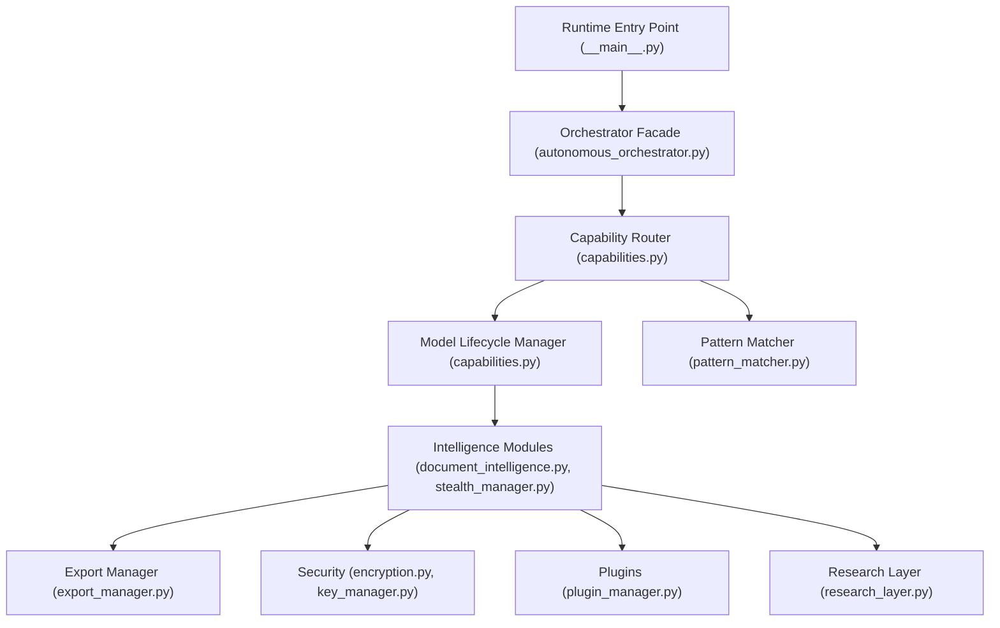
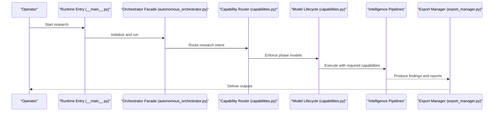
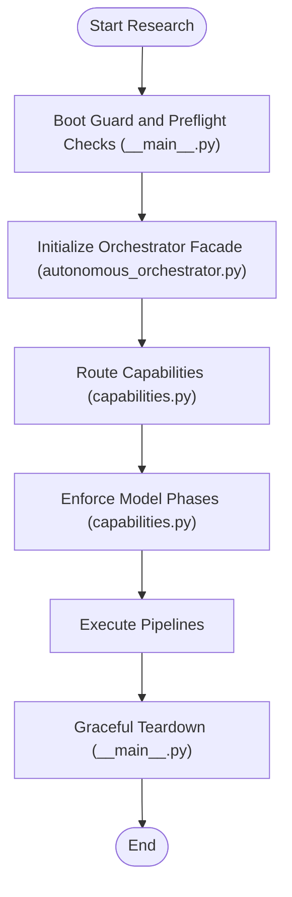
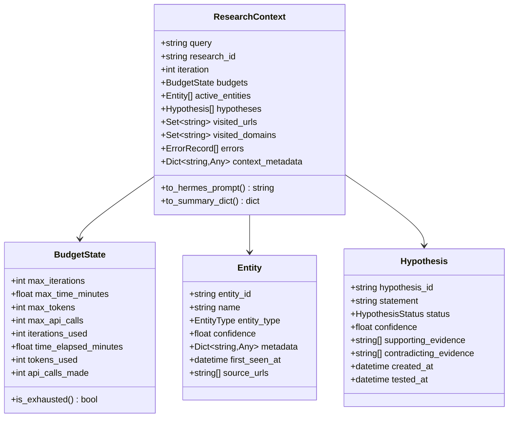
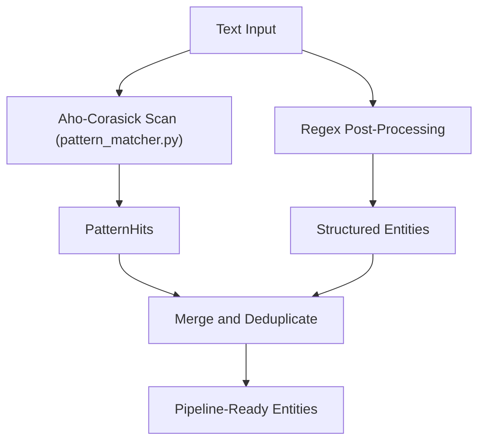
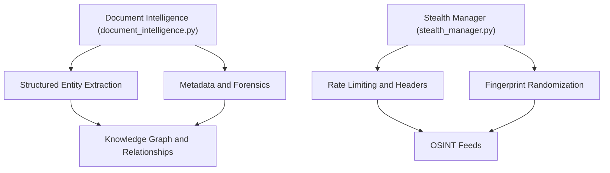
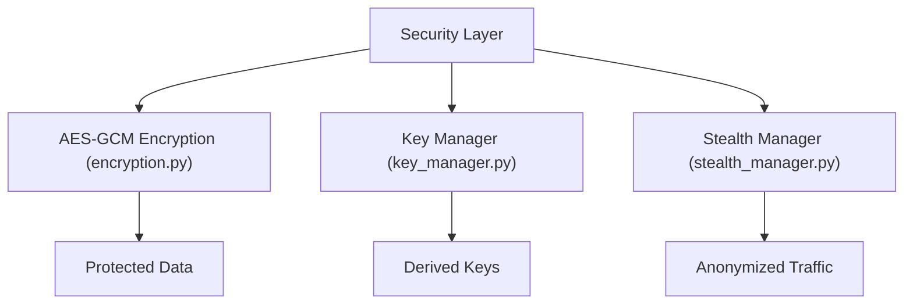
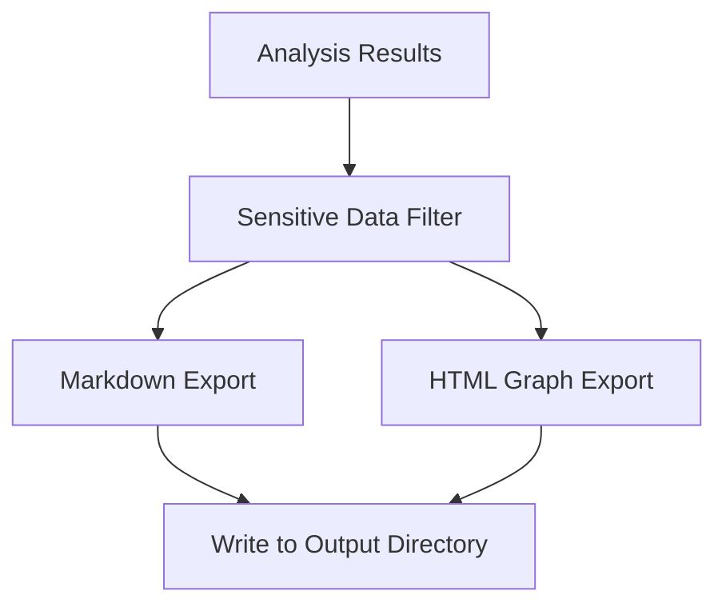
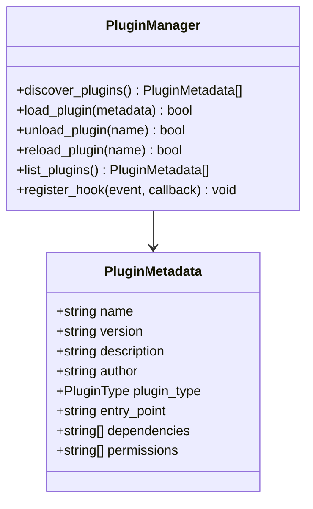

# Core Features

<cite>
**Referenced Files in This Document**
- [autonomous_orchestrator.py](file://autonomous_orchestrator.py)
- [capabilities.py](file://capabilities.py)
- [research_context.py](file://research_context.py)
- [__main__.py](file://__main__.py)
- [document_intelligence.py](file://intelligence/document_intelligence.py)
- [encryption.py](file://security/encryption.py)
- [export_manager.py](file://export/export_manager.py)
- [research_layer.py](file://layers/research_layer.py)
- [pattern_matcher.py](file://patterns/pattern_matcher.py)
- [key_manager.py](file://security/key_manager.py)
- [plugin_manager.py](file://infrastructure/plugin_manager.py)
- [stealth_manager.py](file://stealth/stealth_manager.py)
</cite>

## Table of Contents
1. [Introduction](#introduction)
2. [Project Structure](#project-structure)
3. [Core Components](#core-components)
4. [Architecture Overview](#architecture-overview)
5. [Detailed Component Analysis](#detailed-component-analysis)
6. [Dependency Analysis](#dependency-analysis)
7. [Performance Considerations](#performance-considerations)
8. [Troubleshooting Guide](#troubleshooting-guide)
9. [Conclusion](#conclusion)

## Introduction
This document describes the core features of Hledac Universal, focusing on autonomous research operations, multi-source intelligence gathering, advanced pattern matching, and privacy-preserving analysis. It explains the sprint-based research methodology, continuous monitoring capabilities, natural language processing and entity extraction, relationship discovery, trend analysis, security and privacy controls, export/reporting, integrations, and extensibility via plugins and custom adapters.

## Project Structure
Hledac Universal organizes capabilities across modular layers:
- Orchestrator and runtime entrypoint define the canonical lifecycle and boot sequence.
- Capability routing and model lifecycle management govern feature availability and model usage.
- Intelligence modules provide document analysis, OSINT, and stealth operations.
- Pattern matching powers high-precision identification of IOCs and structured entities.
- Security modules implement encryption, key management, and anonymization.
- Export and reporting produce multi-format outputs and integrate with external systems.
- Plugin infrastructure enables extensibility and custom adapters.

**Diagram sources**
- [__main__.py](file://__main__.py)
- [autonomous_orchestrator.py](file://autonomous_orchestrator.py)
- [capabilities.py](file://capabilities.py)
- [document_intelligence.py](file://intelligence/document_intelligence.py)
- [pattern_matcher.py](file://patterns/pattern_matcher.py)
- [export_manager.py](file://export/export_manager.py)
- [encryption.py](file://security/encryption.py)
- [key_manager.py](file://security/key_manager.py)
- [plugin_manager.py](file://infrastructure/plugin_manager.py)
- [research_layer.py](file://layers/research_layer.py)
- [stealth_manager.py](file://stealth/stealth_manager.py)

**Section sources**
- [__main__.py](file://__main__.py)
- [autonomous_orchestrator.py](file://autonomous_orchestrator.py)
- [capabilities.py](file://capabilities.py)

## Core Components
- Autonomous Research Operations: The orchestrator facade and runtime entrypoint coordinate end-to-end research, enabling fully autonomous operation with minimal human intervention. The canonical owner is the runtime scheduler, while the facade remains for backward compatibility.
- Multi-Source Intelligence Gathering: The capability router maps research intent to required capabilities, enabling selection of surface web, academic, archive, dark web, OSINT, and crypto sources with depth-specific augmentations.
- Advanced Pattern Matching: The pattern matcher integrates a high-performance Aho-Corasick automaton with regex post-processing to detect structured IOCs and OSINT vocabulary with high precision.
- Privacy-Preserving Analysis: Encryption primitives, key management, anonymization, and stealth operations protect sensitive data and reduce detection risk during research.
- Intelligence Analysis: Natural language processing, entity extraction, relationship discovery, and trend analysis are integrated across document and OSINT pipelines.
- Export and Reporting: Obsidian-compatible Markdown and interactive HTML graph exports, with sensitive data filtering and controlled output paths.
- Continuous Monitoring: The runtime and orchestrator support sustained operation with diagnostics, resource tracking, and teardown hygiene.
- Extensibility: Plugins and custom adapters can be loaded dynamically to extend capabilities.

**Section sources**
- [autonomous_orchestrator.py](file://autonomous_orchestrator.py)
- [capabilities.py](file://capabilities.py)
- [research_context.py](file://research_context.py)
- [__main__.py](file://__main__.py)
- [pattern_matcher.py](file://patterns/pattern_matcher.py)
- [encryption.py](file://security/encryption.py)
- [key_manager.py](file://security/key_manager.py)
- [export_manager.py](file://export/export_manager.py)
- [plugin_manager.py](file://infrastructure/plugin_manager.py)
- [stealth_manager.py](file://stealth/stealth_manager.py)

## Architecture Overview
The system follows a capability-driven architecture:
- Capability Registry and Router determine which features are required for a given research task.
- Model Lifecycle Manager enforces coarse-grained model loading phases to conserve resources.
- Intelligence modules implement specialized pipelines for document analysis, OSINT, and stealth.
- Pattern matching augments pipelines with high-precision entity extraction.
- Security and encryption modules protect data at rest and in transit.
- Export and plugin systems provide interoperability and extensibility.

**Diagram sources**
- [__main__.py](file://__main__.py)
- [autonomous_orchestrator.py](file://autonomous_orchestrator.py)
- [capabilities.py](file://capabilities.py)
- [export_manager.py](file://export/export_manager.py)

## Detailed Component Analysis

### Autonomous Research Operations
- Canonical lifecycle ownership is established by the runtime entrypoint and scheduler, ensuring authoritative run summaries and ownership semantics.
- The orchestrator facade provides backward compatibility and re-exports legacy APIs, while directing production traffic to the canonical path.
- The runtime initializes boot hygiene, signal-safe teardown, and resource ownership tracking for diagnostics.

**Diagram sources**
- [__main__.py](file://__main__.py)
- [autonomous_orchestrator.py](file://autonomous_orchestrator.py)
- [capabilities.py](file://capabilities.py)

**Section sources**
- [__main__.py](file://__main__.py)
- [autonomous_orchestrator.py](file://autonomous_orchestrator.py)

### Multi-Source Intelligence Gathering and Research Context
- ResearchContext encapsulates the canonical context carrier for orchestrator-agent communication, including budgets, entities, hypotheses, visited URLs/domains, errors, and typed handoff metadata for ledger correlation.
- The research layer integrates GhostDirector missions, deep exploration, and hunting to maximize discovery depth and citation-following.

**Diagram sources**
- [research_context.py](file://research_context.py)

**Section sources**
- [research_context.py](file://research_context.py)
- [research_layer.py](file://layers/research_layer.py)

### Advanced Pattern Matching and Structured Entity Extraction
- The pattern matcher uses a high-performance Aho-Corasick automaton with a bootstrap OSINT literal pack and regex post-processing to extract structured IOCs and OSINT vocabulary.
- It supports configurable registries, lazy builds, and high-precision extraction with deduplication and memory bounds.

**Diagram sources**
- [pattern_matcher.py](file://patterns/pattern_matcher.py)

**Section sources**
- [pattern_matcher.py](file://patterns/pattern_matcher.py)

### Intelligence Analysis: NLP, Entity Extraction, Relationship Discovery, Trend Analysis
- Document Intelligence analyzes PDFs, Office documents, and images, extracting metadata, hidden content, and forensic artifacts with M1-optimized streaming and optional MLX acceleration.
- OSINT pipelines integrate stealth operations, rate limiting, and fingerprint randomization to reduce detection risk.
- Relationship discovery and trend analysis leverage the knowledge graph and temporal analysis to connect entities and track changes over time.

**Diagram sources**
- [document_intelligence.py](file://intelligence/document_intelligence.py)
- [stealth_manager.py](file://stealth/stealth_manager.py)

**Section sources**
- [document_intelligence.py](file://intelligence/document_intelligence.py)
- [stealth_manager.py](file://stealth/stealth_manager.py)

### Privacy-Preserving Analysis: Encryption, Anonymization, and Stealth
- Encryption primitives provide AES-GCM authenticated encryption for protecting sensitive data.
- Key Management supports master key rotation, HKDF-derived bucket keys, and mlock for memory protection.
- Stealth Manager integrates rate limiting, header spoofing, and fingerprint randomization to minimize detection risk.

**Diagram sources**
- [encryption.py](file://security/encryption.py)
- [key_manager.py](file://security/key_manager.py)
- [stealth_manager.py](file://stealth/stealth_manager.py)

**Section sources**
- [encryption.py](file://security/encryption.py)
- [key_manager.py](file://security/key_manager.py)
- [stealth_manager.py](file://stealth/stealth_manager.py)

### Export and Reporting: Multi-Format Outputs and Integrations
- Export Manager writes Obsidian-compatible Markdown with YAML front matter and includes findings with sensitive data filtering.
- Interactive HTML graph export is supported via GraphManager integration and pyvis.
- Controlled output paths prevent escaping the designated directory and maintain security boundaries.

**Diagram sources**
- [export_manager.py](file://export/export_manager.py)

**Section sources**
- [export_manager.py](file://export/export_manager.py)

### Extensibility: Plugins and Custom Adapters
- Plugin Manager supports dynamic loading of external Python plugins with metadata, dependency resolution, lifecycle hooks, and hot-reload capabilities.
- Plugins can extend agents, drivers, services, utilities, and integrations, enabling custom adapters and workflows.

**Diagram sources**
- [plugin_manager.py](file://infrastructure/plugin_manager.py)

**Section sources**
- [plugin_manager.py](file://infrastructure/plugin_manager.py)

## Dependency Analysis
Capabilities are routed based on research intent and depth, with model lifecycle enforcement to balance performance and resource usage. The capability router maps sources, tools, and privacy requirements to specific capability sets.

**Diagram sources**
- [capabilities.py](file://capabilities.py)

**Section sources**
- [capabilities.py](file://capabilities.py)

## Performance Considerations
- Boot hygiene and signal-safe teardown minimize startup overhead and ensure graceful shutdown.
- Resource governance and UMA sampling provide runtime insights for sustained operations.
- M1-optimized document analysis and streaming I/O reduce memory pressure.
- Pattern matcher uses lazy builds and memory-bounded extraction to maintain responsiveness.
- Stealth Manager employs bounded sessions, HTTP/3 detection, and retry policies tuned for stability.

[No sources needed since this section provides general guidance]

## Troubleshooting Guide
- Runtime status and telemetry help diagnose boot and ownership issues.
- Capability status logging reveals availability and loading outcomes.
- Export manager validates output paths and filters sensitive fields to avoid accidental disclosure.
- Plugin manager statistics and hooks aid in diagnosing plugin lifecycle issues.

**Section sources**
- [__main__.py](file://__main__.py)
- [capabilities.py](file://capabilities.py)
- [export_manager.py](file://export/export_manager.py)
- [plugin_manager.py](file://infrastructure/plugin_manager.py)

## Conclusion
Hledac Universal delivers a comprehensive, privacy-preserving, and extensible intelligence platform. Its sprint-based methodology, autonomous orchestration, multi-source intelligence gathering, advanced pattern matching, and robust security measures enable continuous, scalable research operations. The export and plugin ecosystems further enhance interoperability and customization for diverse operational needs.