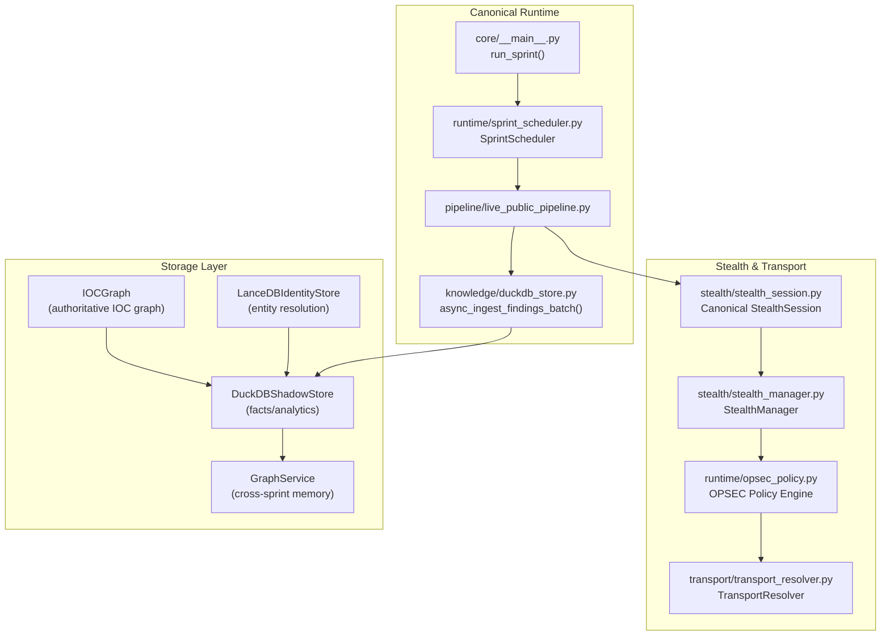
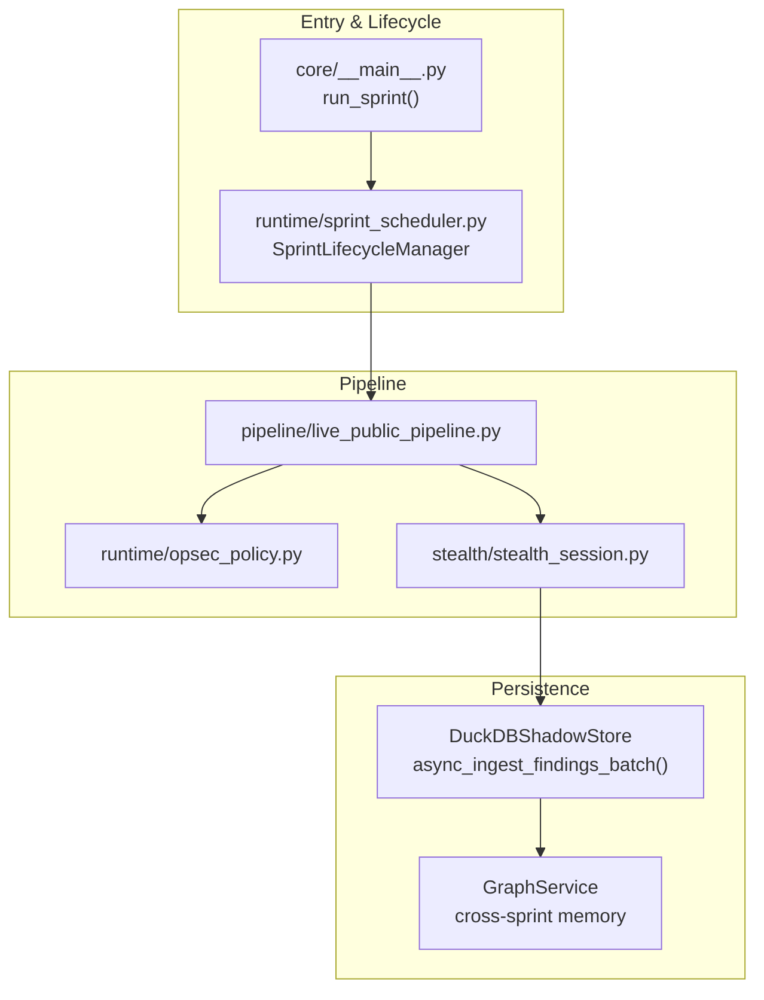
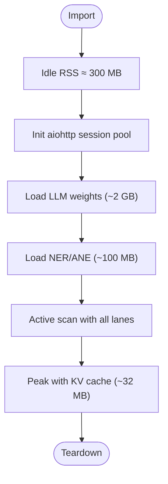
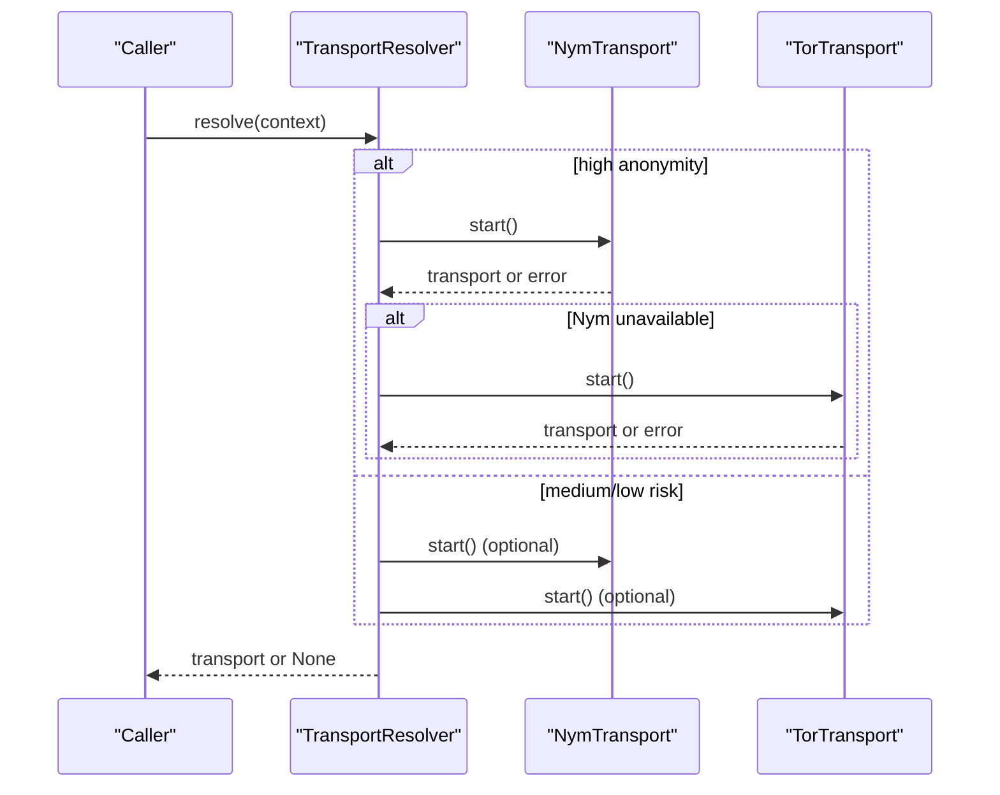
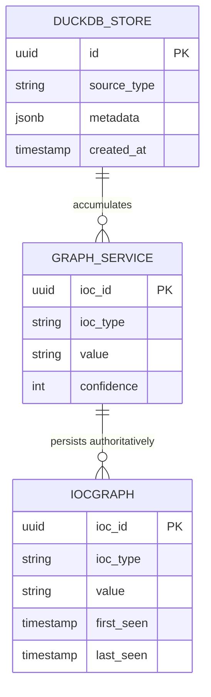
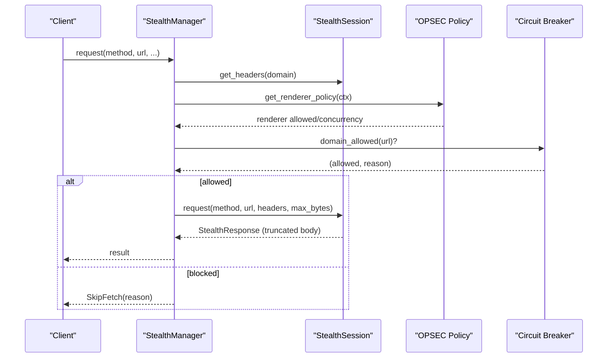
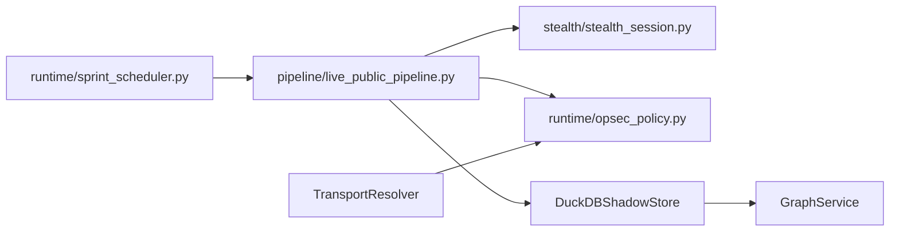

# Design Principles and Philosophy

<cite>
**Referenced Files in This Document**
- [LONGTERM_PLAN.md](file://LONGTERM_PLAN.md)
- [REAL_ARCHITECTURE.md](file://REAL_ARCHITECTURE.md)
- [GHOST_INVARIANTS.md](file://GHOST_INVARIANTS.md)
- [STORAGE_LAYER_DOCUMENTATION.md](file://STORAGE_LAYER_DOCUMENTATION.md)
- [M1_8GB_MEMORY_BUDGET.md](file://M1_8GB_MEMORY_BUDGET.md)
- [opsec_policy.py](file://runtime/opsec_policy.py)
- [stealth_manager.py](file://stealth/stealth_manager.py)
- [stealth_session.py](file://stealth/stealth_session.py)
- [transport_resolver.py](file://transport/transport_resolver.py)
- [autonomous_orchestrator.py](file://autonomous_orchestrator.py)
</cite>

## Table of Contents
1. [Introduction](#introduction)
2. [Project Structure](#project-structure)
3. [Core Components](#core-components)
4. [Architecture Overview](#architecture-overview)
5. [Detailed Component Analysis](#detailed-component-analysis)
6. [Dependency Analysis](#dependency-analysis)
7. [Performance Considerations](#performance-considerations)
8. [Troubleshooting Guide](#troubleshooting-guide)
9. [Conclusion](#conclusion)
10. [Appendices](#appendices)

## Introduction
This document codifies Hledac Universal’s design principles and philosophy. It explains the platform’s guiding tenets—autonomous operation, memory efficiency, multi-protocol anonymity, canonical ownership, and modular extensibility—and the rationale behind key architectural decisions such as Apple Silicon optimization, memory-constrained operations, stealth browsing, and the canonical ownership model. It also outlines the long-term vision for scalability, future roadmap, and the evolution toward more sophisticated autonomous capabilities, while balancing performance, security, and usability in autonomous intelligence-gathering systems.

## Project Structure
Hledac Universal is organized around a canonical runtime and a layered, modular ecosystem:
- Canonical runtime: a focused pipeline and scheduler that own the primary execution and persistence seams.
- Storage layer: multiple specialized stores with clear ownership boundaries.
- Stealth and transport: unified, bounded, and fail-safe components for anonymity and protocol diversity.
- Extensibility: modular “coordinators,” “layers,” and “tools” that integrate via well-defined hooks and sidecars.

**Diagram sources**
- [REAL_ARCHITECTURE.md](file://REAL_ARCHITECTURE.md)
- [GHOST_INVARIANTS.md](file://GHOST_INVARIANTS.md)
- [STORAGE_LAYER_DOCUMENTATION.md](file://STORAGE_LAYER_DOCUMENTATION.md)

**Section sources**
- [REAL_ARCHITECTURE.md](file://REAL_ARCHITECTURE.md)
- [STORAGE_LAYER_DOCUMENTATION.md](file://STORAGE_LAYER_DOCUMENTATION.md)

## Core Components
- Canonical runtime: the canonical entry point and lifecycle controller define the single source of truth for execution and persistence.
- Storage layer: strict ownership boundaries ensure that each store serves a distinct purpose and that all writes funnel through canonical seams.
- Stealth and transport: bounded, fail-safe components enforce operational security and protocol diversity.
- Modular extensibility: sidecars, coordinators, and tools integrate via well-defined hooks and contracts.

Key canonical ownership anchors:
- Canonical write seam: DuckDBShadowStore’s async_ingest_findings_batch() is the only canonical path for persistent findings.
- Cross-sprint memory seam: GraphService accumulates and exposes graph signals across sprints.
- Stealth surface: Canonical StealthSession and StealthManager provide bounded, testable, and fail-safe HTTP operations.

**Section sources**
- [REAL_ARCHITECTURE.md](file://REAL_ARCHITECTURE.md)
- [STORAGE_LAYER_DOCUMENTATION.md](file://STORAGE_LAYER_DOCUMENTATION.md)
- [GHOST_INVARIANTS.md](file://GHOST_INVARIANTS.md)

## Architecture Overview
The platform’s architecture emphasizes:
- Single-source-of-truth execution and persistence
- Strict storage ownership boundaries
- Operational security via stealth and transport policies
- Extensibility through sidecars and modular components

**Diagram sources**
- [REAL_ARCHITECTURE.md](file://REAL_ARCHITECTURE.md)
- [opsec_policy.py](file://runtime/opsec_policy.py)
- [stealth_session.py](file://stealth/stealth_session.py)

## Detailed Component Analysis

### Autonomous Operation
- Philosophy: minimize human intervention by designing systems that operate reliably under bounded constraints, with fail-safe defaults and bounded concurrency.
- Evidence: canonical runtime enforces fail-soft behavior, bounded concurrency, and graceful degradation; async patterns consistently use gather with return_exceptions=True and explicit error partitioning; memory guards prevent model/renderer overlap on M1.
- Implications: autonomous operation is achieved through deterministic contracts, bounded resource usage, and resilient fallbacks.

**Section sources**
- [GHOST_INVARIANTS.md](file://GHOST_INVARIANTS.md)
- [M1_8GB_MEMORY_BUDGET.md](file://M1_8GB_MEMORY_BUDGET.md)

### Memory Efficiency (Apple Silicon Optimization)
- Philosophy: operate within strict UMA memory constraints of M1 Air 8 GB, with explicit guards and quantization to maximize throughput while avoiding macOS compression and OOM conditions.
- Evidence: memory waterfall and bounds are documented; model lifecycle includes explicit unload sequence and metal cache management; KV cache quantization and aggressive mode are implemented; memory authority dashboards track conflicts.
- Implications: memory efficiency is a hard requirement that shapes model loading, concurrency, and I/O patterns.

**Diagram sources**
- [M1_8GB_MEMORY_BUDGET.md](file://M1_8GB_MEMORY_BUDGET.md)

**Section sources**
- [M1_8GB_MEMORY_BUDGET.md](file://M1_8GB_MEMORY_BUDGET.md)

### Multi-Protocol Anonymity
- Philosophy: provide operational security by supporting multiple anonymity protocols (Nym, Tor) and enforcing policy-driven transport selection with fail-safe fallbacks.
- Evidence: TransportResolver selects Nym > Tor for high anonymity, with fail-soft fallbacks; StealthManager integrates rate limiting, header spoofing, and fingerprint randomization; OPSEC Policy Engine prevents model+renderer conflicts and enforces concurrency limits.
- Implications: anonymity is a first-class concern, integrated into transport selection and runtime policy.

**Diagram sources**
- [transport_resolver.py](file://transport/transport_resolver.py)
- [opsec_policy.py](file://runtime/opsec_policy.py)

**Section sources**
- [transport_resolver.py](file://transport/transport_resolver.py)
- [opsec_policy.py](file://runtime/opsec_policy.py)

### Canonical Ownership
- Philosophy: centralize authority and ownership to avoid duplication, confusion, and race conditions. All writes must flow through canonical seams.
- Evidence: DuckDBShadowStore.async_ingest_findings_batch() is the canonical write path; GraphService is the cross-sprint memory seam; sidecars and enrichments must integrate via canonical hooks; storage ownership matrix defines clear roles.
- Implications: canonical ownership ensures auditability, consistency, and maintainability.

**Diagram sources**
- [STORAGE_LAYER_DOCUMENTATION.md](file://STORAGE_LAYER_DOCUMENTATION.md)

**Section sources**
- [STORAGE_LAYER_DOCUMENTATION.md](file://STORAGE_LAYER_DOCUMENTATION.md)

### Modular Extensibility
- Philosophy: enable growth and experimentation without compromising canonical integrity. Sidecars, coordinators, and tools integrate via well-defined hooks and contracts.
- Evidence: sidecar runners register via a default registry; coordinators and layers provide modular capabilities; tools expose typed schemas; canonical hooks ensure sidecars do not bypass canonical writes.
- Implications: modularity accelerates capability development while preserving system stability.

**Section sources**
- [REAL_ARCHITECTURE.md](file://REAL_ARCHITECTURE.md)

### Stealth Browsing Capabilities
- Philosophy: perform HTTP operations with minimal detectability and bounded memory footprint, using jitter, UA rotation, and streaming reads.
- Evidence: StealthSession provides UA rotation and jitter; StealthManager coordinates rate limiting, headers, and fingerprint randomization; HTTP/3 detection and streaming reads limit memory usage; circuit breaker preflights guard domains.
- Implications: stealth is additive and bounded, never blocking canonical flows.

**Diagram sources**
- [stealth_manager.py](file://stealth/stealth_manager.py)
- [stealth_session.py](file://stealth/stealth_session.py)
- [opsec_policy.py](file://runtime/opsec_policy.py)

**Section sources**
- [stealth_manager.py](file://stealth/stealth_manager.py)
- [stealth_session.py](file://stealth/stealth_session.py)
- [opsec_policy.py](file://runtime/opsec_policy.py)

## Dependency Analysis
The platform’s dependency relationships emphasize canonical ownership and bounded integration:
- Canonical runtime depends on pipeline and storage; pipeline depends on stealth and policy; storage is owned by DuckDBShadowStore and GraphService.
- Transport and stealth are orthogonal concerns integrated via policy and resolver.
- Extensibility is achieved through sidecars and tools that respect canonical write paths.

**Diagram sources**
- [REAL_ARCHITECTURE.md](file://REAL_ARCHITECTURE.md)
- [opsec_policy.py](file://runtime/opsec_policy.py)
- [transport_resolver.py](file://transport/transport_resolver.py)

**Section sources**
- [REAL_ARCHITECTURE.md](file://REAL_ARCHITECTURE.md)

## Performance Considerations
- Memory-first design: UMA budget, quantization, and explicit unload sequences ensure predictable performance on M1.
- Asynchronous hygiene: gather with return_exceptions and explicit error partitioning prevent cascading failures.
- Streaming and truncation: HTTP responses are streamed and truncated to limit memory usage.
- Concurrency and timeouts: bounded concurrency and per-transport hints improve throughput and reliability.

[No sources needed since this section provides general guidance]

## Troubleshooting Guide
Common areas to inspect:
- Async hygiene: ensure gather uses return_exceptions=True and results are partitioned via the canonical checker.
- Memory pressure: verify model lifecycle cleanup order and RAM guard checks; check for unbounded appends in storage layers.
- Transport and stealth: confirm policy enforcement and circuit breaker preflights; validate domain allowances and fallback behavior.
- Canonical writes: verify all findings flow through the canonical write seam and that sidecars do not bypass it.

**Section sources**
- [GHOST_INVARIANTS.md](file://GHOST_INVARIANTS.md)
- [M1_8GB_MEMORY_BUDGET.md](file://M1_8GB_MEMORY_BUDGET.md)
- [opsec_policy.py](file://runtime/opsec_policy.py)
- [transport_resolver.py](file://transport/transport_resolver.py)

## Conclusion
Hledac Universal’s design principles center on autonomous operation, memory efficiency, multi-protocol anonymity, canonical ownership, and modular extensibility. These principles are enforced through strict canonical seams, bounded resource usage, operational security policies, and resilient asynchronous patterns. The long-term vision emphasizes continued refinement of the canonical path, cross-sprint memory, and operator-facing insights, while evolving toward more sophisticated autonomous capabilities grounded in performance, security, and usability.

[No sources needed since this section summarizes without analyzing specific files]

## Appendices

### Long-Term Vision and Roadmap
- Phase-based progression: stabilization, integration, capabilities, and performance, with each phase committing to a single change and updating truth docs.
- Canonical focus: persistent findings via DuckDBShadowStore, cross-sprint memory via GraphService, and sidecars that respect canonical write paths.
- Future directions: enhance RL-driven source weighting, operator dashboards, and memory-aware analyst briefings; continue extracting advisory orchestration and lifecycle runners to maintain canonical simplicity.

**Section sources**
- [LONGTERM_PLAN.md](file://LONGTERM_PLAN.md)
- [REAL_ARCHITECTURE.md](file://REAL_ARCHITECTURE.md)