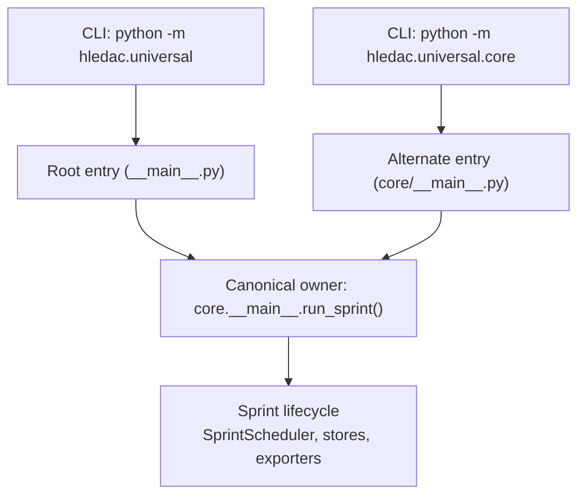
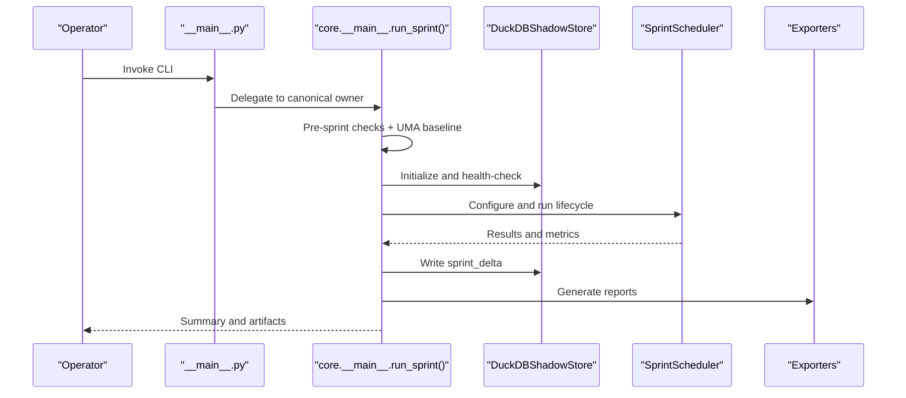
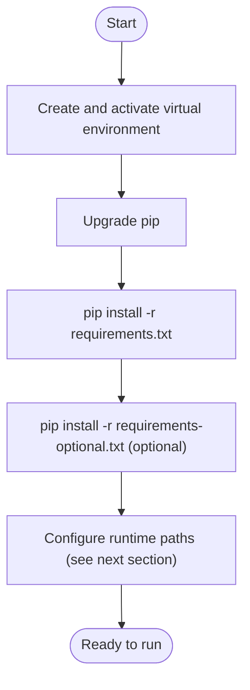
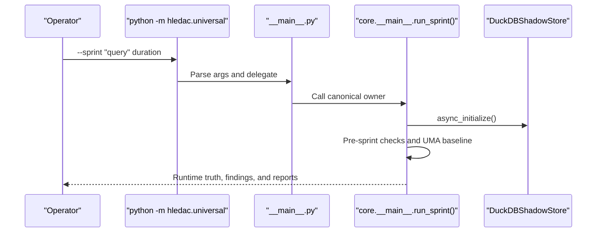
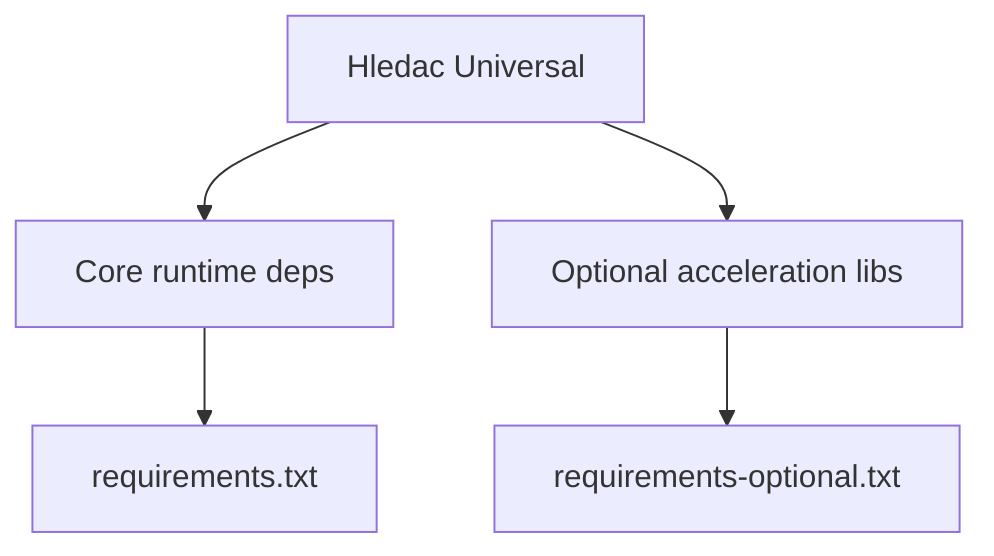

# Getting Started

<cite>
**Referenced Files in This Document**
- [__main__.py](file://__main__.py)
- [core/__main__.py](file://core/__main__.py)
- [config.py](file://config.py)
- [paths.py](file://paths.py)
- [requirements.txt](file://requirements.txt)
- [requirements-optional.txt](file://requirements-optional.txt)
- [project_types.py](file://project_types.py)
</cite>

## Table of Contents
1. [Introduction](#introduction)
2. [Project Structure](#project-structure)
3. [Core Components](#core-components)
4. [Architecture Overview](#architecture-overview)
5. [Detailed Component Analysis](#detailed-component-analysis)
6. [Dependency Analysis](#dependency-analysis)
7. [Performance Considerations](#performance-considerations)
8. [Troubleshooting Guide](#troubleshooting-guide)
9. [Conclusion](#conclusion)
10. [Appendices](#appendices)

## Introduction
This guide helps you install, configure, and run Hledac Universal for the first time. It covers system requirements, Python environment setup, dependency installation, configuration via environment variables and paths, and how to run your first research sprint. It also explains the difference between canonical and alternate entry points, provides usage examples, and includes quick reference and safety guidelines.

## Project Structure
Hledac Universal is organized around two primary entry points:
- Canonical entry point: python -m hledac.universal
- Alternate entry point: python -m hledac.universal.core

Both ultimately call the same canonical sprint owner function that orchestrates the full lifecycle. The canonical path is the recommended operator path; the alternate path exists for migration and legacy compatibility.

**Diagram sources**
- [__main__.py:70-183](file://__main__.py#L70-L183)
- [core/__main__.py:1-120](file://core/__main__.py#L1-L120)

**Section sources**
- [__main__.py:48-183](file://__main__.py#L48-L183)
- [core/__main__.py:1-120](file://core/__main__.py#L1-L120)

## Core Components
- Entry points and authority:
  - Root entry point defines canonical and alternate roles and delegates to the canonical owner.
  - Canonical owner is the sole producer of canonical run summaries and truth.
- Configuration:
  - Centralized configuration supports presets, environment overrides, and validation.
- Paths and storage:
  - Single-source-of-truth for runtime paths, with RAMDISK preference and fallback.
- Dependencies:
  - Core runtime dependencies and optional acceleration libraries.

**Section sources**
- [__main__.py:48-183](file://__main__.py#L48-L183)
- [config.py:36-666](file://config.py#L36-L666)
- [paths.py:111-352](file://paths.py#L111-L352)
- [requirements.txt:1-32](file://requirements.txt#L1-L32)
- [requirements-optional.txt:1-54](file://requirements-optional.txt#L1-L54)

## Architecture Overview
The canonical sprint owner coordinates:
- Pre-sprint checks and UMA baseline capture
- Store initialization and scheduler configuration
- Live feeds and public discovery pipelines
- CT log discovery (when applicable)
- Teardown and delta reporting

**Diagram sources**
- [core/__main__.py:320-520](file://core/__main__.py#L320-L520)
- [core/__main__.py:266-313](file://core/__main__.py#L266-L313)

**Section sources**
- [core/__main__.py:320-520](file://core/__main__.py#L320-L520)

## Detailed Component Analysis

### Installation and Setup
- System requirements
  - Python: supported interpreter (Apple Silicon recommended for MLX acceleration).
  - Disk: RAMDISK preferred for runtime artifacts; fallback to SSD if unavailable.
  - Memory: M1 8GB optimized defaults are applied automatically when enabled.
- Python environment
  - Create a virtual environment and activate it.
  - Upgrade pip and install dependencies.
- Core dependencies
  - Install required packages from requirements.txt.
- Optional acceleration libraries
  - Install optional packages from requirements-optional.txt for enhanced performance and capabilities.

**Section sources**
- [requirements.txt:1-32](file://requirements.txt#L1-L32)
- [requirements-optional.txt:1-54](file://requirements-optional.txt#L1-L54)

### Configuration and Environment
- Environment variables
  - HLEDAC_RESEARCH_MODE: quick, standard, deep, extreme, autonomous
  - HLEDAC_MEMORY_LIMIT_MB: numeric override for memory limit
  - HLEDAC_MAX_STEPS: numeric override for max steps
  - HLEDAC_LOG_LEVEL: logging level
  - HLEDAC_M1_OPTIMIZED: true/false to apply M1 8GB presets
  - HLEDAC_SPRINT_STORE: override for sprint store directory
  - GHOST_RAMDISK: path to active RAMDISK mount
  - GHOST_LMDB_MAX_SIZE_MB: LMDB map size in MB
  - HLEDAC_OFFLINE: set to "1" to enable offline mode
- Path configuration
  - RAMDISK_ROOT and FALLBACK_ROOT are derived from environment and validated.
  - SPRINT_STORE_ROOT controls where sprint artifacts are exported.
- Configuration presets and validation
  - Research presets define budgets for steps, time, concurrency, and features.
  - Validation warns on excessive memory limits and low concurrency.

**Section sources**
- [config.py:466-498](file://config.py#L466-L498)
- [config.py:570-605](file://config.py#L570-L605)
- [paths.py:111-200](file://paths.py#L111-L200)
- [paths.py:268-352](file://paths.py#L268-L352)
- [project_types.py:58-61](file://project_types.py#L58-L61)

### Running Your First Research Sprint
- Canonical operator path
  - Use the canonical CLI to run a sprint with a query and duration.
  - The canonical owner performs pre-sprint checks, initializes stores, runs the scheduler, and writes deltas and reports.
- Alternate path
  - An alternate CLI exists that calls the same canonical owner; prefer the canonical path for production.

**Diagram sources**
- [__main__.py:70-183](file://__main__.py#L70-L183)
- [core/__main__.py:320-520](file://core/__main__.py#L320-L520)

**Section sources**
- [__main__.py:70-183](file://__main__.py#L70-L183)
- [core/__main__.py:320-520](file://core/__main__.py#L320-L520)

### Basic Usage Examples
- Run a quick research sprint:
  - python -m hledac.universal --sprint "threat actor TLP:GREEN" 1800
- Adjust research mode and memory:
  - HLEDAC_RESEARCH_MODE=deep HLEDAC_MEMORY_LIMIT_MB=6000 python -m hledac.universal --sprint "APT campaign" 3600
- Use alternate entry point (migration/compatibility):
  - python -m hledac.universal.core --sprint "query" 1800

Note: Replace the query and duration with your target research scope and time budget.

**Section sources**
- [__main__.py:70-183](file://__main__.py#L70-L183)
- [core/__main__.py:320-520](file://core/__main__.py#L320-L520)

### Canonical vs Alternate Entry Points
- Canonical entry point
  - Operator path: python -m hledac.universal
  - Sole canonical sprint owner; all report truth flows from here.
- Alternate entry point
  - Legacy path: python -m hledac.universal.core
  - Calls the same canonical owner but intended for migration and compatibility.
- Guidance
  - Use the canonical path for production sprints.
  - Use alternate path only for migration or when reproducing legacy behavior.

**Section sources**
- [__main__.py:70-183](file://__main__.py#L70-L183)
- [core/__main__.py:1-120](file://core/__main__.py#L1-L120)

### Quick Reference: Essential Commands and Options
- Install dependencies
  - pip install -r requirements.txt
  - pip install -r requirements-optional.txt
- Run a sprint (canonical path)
  - python -m hledac.universal --sprint "<query>" <duration_seconds>
- Environment variables
  - HLEDAC_RESEARCH_MODE, HLEDAC_MEMORY_LIMIT_MB, HLEDAC_MAX_STEPS, HLEDAC_LOG_LEVEL, HLEDAC_M1_OPTIMIZED, HLEDAC_SPRINT_STORE, GHOST_RAMDISK, GHOST_LMDB_MAX_SIZE_MB, HLEDAC_OFFLINE
- Path configuration
  - RAMDISK_ROOT and FALLBACK_ROOT are derived from environment; SPRINT_STORE_ROOT controls export location.

**Section sources**
- [requirements.txt:1-32](file://requirements.txt#L1-L32)
- [requirements-optional.txt:1-54](file://requirements-optional.txt#L1-L54)
- [__main__.py:70-183](file://__main__.py#L70-L183)
- [paths.py:111-200](file://paths.py#L111-L200)
- [paths.py:268-352](file://paths.py#L268-L352)

## Dependency Analysis
Hledac Universal depends on:
- Core runtime libraries for async IO, HTTP, OSINT, DuckDB, and vector search.
- Optional acceleration libraries for performance and specialized capabilities.

**Diagram sources**
- [requirements.txt:1-32](file://requirements.txt#L1-L32)
- [requirements-optional.txt:1-54](file://requirements-optional.txt#L1-L54)

**Section sources**
- [requirements.txt:1-32](file://requirements.txt#L1-L32)
- [requirements-optional.txt:1-54](file://requirements-optional.txt#L1-L54)

## Performance Considerations
- M1 8GB optimization presets are applied by default when enabled, including memory limits, model stacks, and concurrency caps.
- Use environment variables to tune budgets and features for your workload.
- Prefer RAMDISK for runtime artifacts to reduce SSD wear and improve throughput.

**Section sources**
- [config.py:36-117](file://config.py#L36-L117)
- [config.py:426-464](file://config.py#L426-L464)
- [paths.py:111-200](file://paths.py#L111-L200)

## Troubleshooting Guide
- RAMDISK not available
  - If no active RAMDISK is found, the system falls back to a user-scoped directory and warns about OPSEC degradation. Set GHOST_RAMDISK to a valid RAMDISK mount or mount /Volumes/ghost_tmp.
- LMDB lock errors
  - The system attempts a safe stale-lock recovery before retrying. If persistent, verify the LMDB path and permissions.
- Memory pressure and swap usage
  - Pre-sprint checks capture UMA baseline; warnings indicate high swap usage. Consider lowering concurrency or increasing memory limit.
- Offline mode
  - Set HLEDAC_OFFLINE=1 to disable network-dependent operations.

**Section sources**
- [paths.py:111-200](file://paths.py#L111-L200)
- [paths.py:202-251](file://paths.py#L202-L251)
- [core/__main__.py:221-251](file://core/__main__.py#L221-L251)
- [project_types.py:58-61](file://project_types.py#L58-L61)

## Conclusion
You are now ready to install Hledac Universal, configure it for your environment, and run your first research sprint using the canonical entry point. Use environment variables to tailor behavior to your hardware and workload, and consult the troubleshooting section for common issues. For production use, prefer the canonical operator path and ensure RAMDISK availability for optimal performance and OPSEC.

## Appendices

### Appendix A: Environment Variables Reference
- HLEDAC_RESEARCH_MODE: quick, standard, deep, extreme, autonomous
- HLEDAC_MEMORY_LIMIT_MB: numeric override for memory limit
- HLEDAC_MAX_STEPS: numeric override for max steps
- HLEDAC_LOG_LEVEL: logging level
- HLEDAC_M1_OPTIMIZED: true/false to apply M1 8GB presets
- HLEDAC_SPRINT_STORE: override for sprint store directory
- GHOST_RAMDISK: path to active RAMDISK mount
- GHOST_LMDB_MAX_SIZE_MB: LMDB map size in MB
- HLEDAC_OFFLINE: set to "1" to enable offline mode

**Section sources**
- [config.py:466-498](file://config.py#L466-L498)
- [paths.py:111-200](file://paths.py#L111-L200)
- [project_types.py:58-61](file://project_types.py#L58-L61)