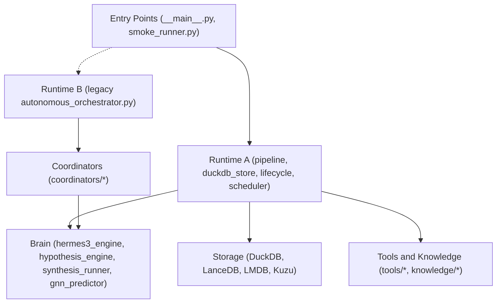
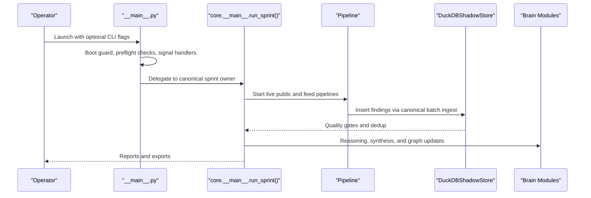
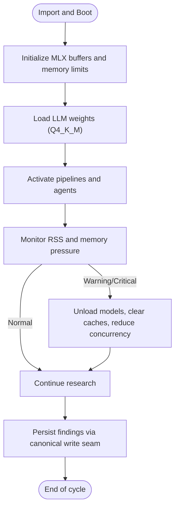
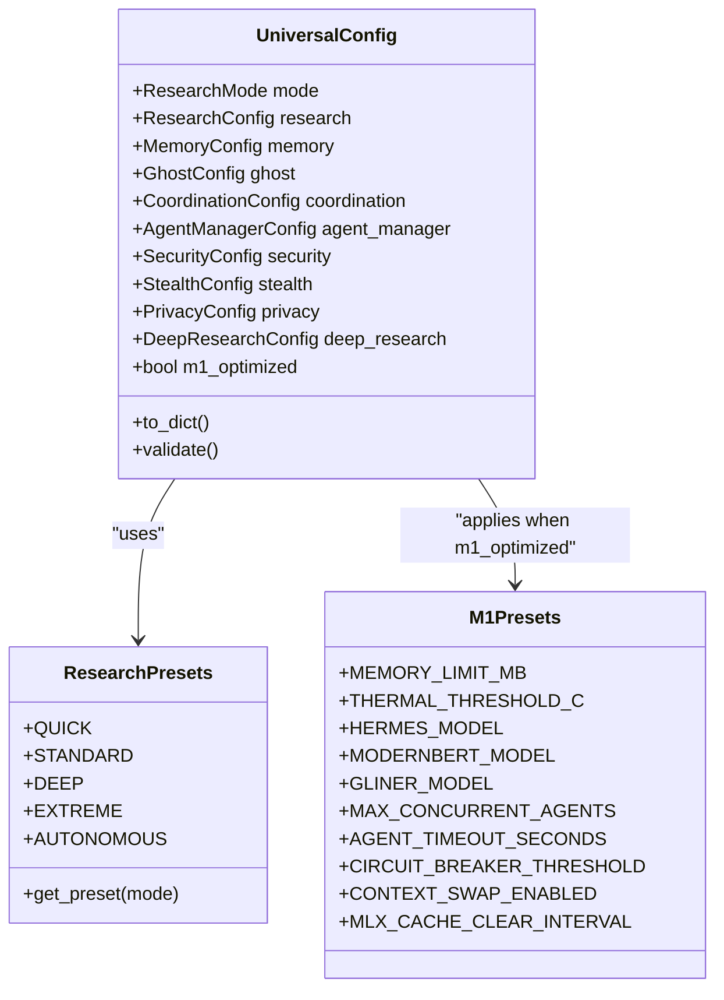
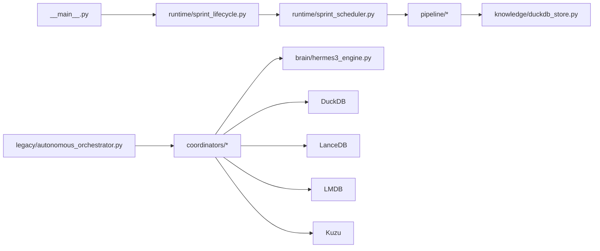

# Introduction and Purpose

<cite>
**Referenced Files in This Document**
- [README.md](file://README.md)
- [__main__.py](file://__main__.py)
- [autonomous_orchestrator.py](file://autonomous_orchestrator.py)
- [config.py](file://config.py)
- [project_types.py](file://project_types.py)
- [REAL_ARCHITECTURE.md](file://REAL_ARCHITECTURE.md)
- [M1_8GB_MEMORY_BUDGET.md](file://M1_8GB_MEMORY_BUDGET.md)
- [LONGTERM_PLAN.md](file://LONGTERM_PLAN.md)
</cite>

## Table of Contents
1. [Introduction](#introduction)
2. [Project Structure](#project-structure)
3. [Core Components](#core-components)
4. [Architecture Overview](#architecture-overview)
5. [Detailed Component Analysis](#detailed-component-analysis)
6. [Dependency Analysis](#dependency-analysis)
7. [Performance Considerations](#performance-considerations)
8. [Troubleshooting Guide](#troubleshooting-guide)
9. [Conclusion](#conclusion)

## Introduction
Hledac Universal is an autonomous Open Source Intelligence (OSINT) orchestrator designed specifically for Apple Silicon MacBooks, with a primary focus on the MacBook Air M1 8GB Unified Memory Architecture (UMA). Its mission is to enable fully autonomous intelligence gathering and analysis with strict memory-constrained operations optimized for M1/M2 processors. The platform is engineered to operate with minimal human intervention, continuously exploring public sources, archives, and specialized feeds to discover, analyze, and synthesize actionable insights.

Key characteristics:
- Autonomous operation: The system runs without continuous human supervision, making decisions and adapting its research strategy dynamically.
- Memory-constrained optimization: Built around M1 8GB UMA constraints, with careful memory budgeting, model swapping, and resource governance.
- Multi-domain applicability: Targets cybersecurity research, threat intelligence, academic investigation, and corporate intelligence gathering.
- Canonical runtime: A single, authoritative runtime path ensures consistent truth, reporting, and persistence across all operations.

By combining a streamlined canonical runtime with modular layers (security, stealth, knowledge, coordination), Hledac Universal integrates diverse intelligence capabilities—web scraping, archival discovery, forensic enrichment, multimodal analysis, and graph-based synthesis—into a cohesive, memory-safe pipeline.

## Project Structure
At a high level, the project is organized around:
- A canonical entrypoint and runtime that orchestrates pipelines and persistence.
- A modular set of layers and tools enabling OSINT operations.
- Centralized configuration tailored for M1 8GB RAM and performance-sensitive workflows.
- Extensive documentation and planning artifacts that define the current architecture and future direction.

```mermaid
graph TB
subgraph "Entry Points"
MAIN["__main__.py"]
SMOKE["smoke_runner.py"]
FACADE["autonomous_orchestrator.py (deprecated facade)"]
end
subgraph "Active Runtime"
PIPE["pipeline/*"]
STORE["knowledge/duckdb_store.py"]
LIFE["runtime/sprint_lifecycle.py"]
SCHED["runtime/sprint_scheduler.py"]
end
subgraph "Legacy Runtime"
LEGACY["legacy/autonomous_orchestrator.py"]
COORDS["coordinators/*"]
end
subgraph "Brain"
HERMES["brain/hermes3_engine.py"]
HYP["brain/hypothesis_engine.py"]
SYNTH["brain/synthesis_runner.py"]
GNN["brain/gnn_predictor.py"]
end
subgraph "Storage"
DUCK["DuckDB"]
LANCE["LanceDB"]
LMDB["LMDB"]
KUZU["Kuzu (STIX)"]
end
MAIN --> PIPE
MAIN --> LIFE
PIPE --> STORE
LIFE --> SCHED
SCHED --> PIPE
SMOKE --> LEGACY
FACADE -. sys.modules patch .-> LEGACY
LEGACY --> COORDS
COORDS --> HERMES
HERMES --> HYP
HYP --> SYNTH
COORDS --> DUCK
COORDS --> LANCE
COORDS --> LMDB
COORDS --> KUZU
```

**Diagram sources**
- [REAL_ARCHITECTURE.md:5-94](file://REAL_ARCHITECTURE.md#L5-L94)
- [__main__.py:70-183](file://__main__.py#L70-L183)

**Section sources**
- [README.md:1-48](file://README.md#L1-L48)
- [REAL_ARCHITECTURE.md:1-94](file://REAL_ARCHITECTURE.md#L1-L94)

## Core Components
- Canonical entrypoint and runtime: The primary execution path is defined in the main entrypoint, which performs boot hygiene, signal handling, and delegates to the canonical sprint owner and pipelines.
- Configuration system: Centralized configuration supports M1 8GB presets, research modes, and layered feature flags for security, stealth, privacy, and deep research.
- Project types and enums: Strongly-typed enums and dataclasses define orchestrator states, agent roles, operation types, and research phases, ensuring consistency across modules.
- Memory and resource governance: Dedicated utilities and documentation enforce M1 8GB UMA constraints, model swapping, and memory pressure handling.

These components collectively enable autonomous operation with minimal human intervention while maintaining robustness and performance on constrained hardware.

**Section sources**
- [__main__.py:1-800](file://__main__.py#L1-L800)
- [config.py:1-666](file://config.py#L1-L666)
- [project_types.py:1-800](file://project_types.py#L1-L800)
- [M1_8GB_MEMORY_BUDGET.md:1-136](file://M1_8GB_MEMORY_BUDGET.md#L1-L136)

## Architecture Overview
Hledac Universal’s architecture centers on a canonical runtime that coordinates pipelines and persistence, while legacy orchestration remains available for compatibility. The brain modules provide LLM inference, hypothesis generation, and synthesis, backed by multiple storage systems. The system emphasizes fail-safe behavior, bounded memory usage, and clear separation of concerns.



**Diagram sources**
- [REAL_ARCHITECTURE.md:1-94](file://REAL_ARCHITECTURE.md#L1-L94)
- [__main__.py:70-183](file://__main__.py#L70-L183)

**Section sources**
- [REAL_ARCHITECTURE.md:1-94](file://REAL_ARCHITECTURE.md#L1-L94)
- [__main__.py:1-800](file://__main__.py#L1-L800)

## Detailed Component Analysis

### Autonomous Operation and Minimal Human Intervention
Hledac Universal is architected to minimize human involvement:
- The canonical entrypoint performs boot hygiene, installs signal handlers, and delegates to the canonical sprint owner and pipelines.
- Public passive and live pipelines run independently, producing findings that are persisted through a canonical write seam.
- The system includes a terminal dashboard for optional live visibility without altering canonical ownership.



**Diagram sources**
- [__main__.py:280-720](file://__main__.py#L280-L720)
- [REAL_ARCHITECTURE.md:63-86](file://REAL_ARCHITECTURE.md#L63-L86)

**Section sources**
- [__main__.py:280-720](file://__main__.py#L280-L720)
- [REAL_ARCHITECTURE.md:63-86](file://REAL_ARCHITECTURE.md#L63-L86)

### Memory-Constrained Operations for M1/M2
The platform is optimized for M1 8GB UMA:
- Memory budgeting and pressure monitoring ensure safe operation under 5GB RSS warning threshold.
- Model lifecycle management includes unload sequences and cache limits to reduce memory footprint.
- KV cache quantization and aggressive memory limits protect against OOM conditions.
- Bounded queues, limits, and fail-open semantics prevent cascading failures.



**Diagram sources**
- [M1_8GB_MEMORY_BUDGET.md:67-96](file://M1_8GB_MEMORY_BUDGET.md#L67-L96)
- [__main__.py:280-304](file://__main__.py#L280-L304)

**Section sources**
- [M1_8GB_MEMORY_BUDGET.md:1-136](file://M1_8GB_MEMORY_BUDGET.md#L1-L136)
- [__main__.py:280-304](file://__main__.py#L280-L304)

### Research Modes and Configuration Presets
The configuration system supports multiple research modes tailored for M1 8GB RAM:
- Quick, Standard, Deep, Extreme, and Autonomous modes define step limits, time budgets, and feature enablement.
- M1 presets adjust model stacks, concurrency, and thermal thresholds to fit within memory constraints.
- Extended configurations cover security, stealth, privacy, and deep research capabilities.



**Diagram sources**
- [config.py:230-498](file://config.py#L230-L498)

**Section sources**
- [config.py:1-666](file://config.py#L1-L666)

### Target Use Cases
Hledac Universal targets:
- Cybersecurity research: Threat assessment, vulnerability analysis, and exposure hunting.
- Threat intelligence: Automated collection, correlation, and synthesis of threat signals.
- Academic investigation: Discovery and analysis of academic publications and datasets.
- Corporate intelligence gathering: Competitive analysis, supply chain risk, and brand monitoring.

These use cases leverage the platform’s autonomous pipelines, archival discovery, forensic enrichment, and multimodal analysis capabilities.

**Section sources**
- [project_types.py:33-181](file://project_types.py#L33-L181)
- [LONGTERM_PLAN.md:1-800](file://LONGTERM_PLAN.md#L1-L800)

### Relationship to the Broader OSINT Ecosystem
Hledac Universal integrates with and extends the OSINT ecosystem by:
- Providing a canonical, memory-safe runtime that can be embedded into larger intelligence workflows.
- Offering standardized export formats (e.g., STIX) and interoperable data structures for downstream systems.
- Maintaining strict operational security and privacy controls suitable for sensitive investigations.
- Supporting operator dashboards and telemetry for transparency without compromising autonomy.

**Section sources**
- [REAL_ARCHITECTURE.md:1-94](file://REAL_ARCHITECTURE.md#L1-L94)
- [LONGTERM_PLAN.md:1-800](file://LONGTERM_PLAN.md#L1-L800)

## Dependency Analysis
The system exhibits clear separation of concerns:
- Entry points depend on runtime orchestration.
- Runtime A depends on pipelines and a canonical store.
- Legacy runtime remains for compatibility testing.
- Brain modules depend on MLX and model lifecycle management.
- Coordinators depend on tools and knowledge layers, and write to multiple storage systems.



**Diagram sources**
- [REAL_ARCHITECTURE.md:63-86](file://REAL_ARCHITECTURE.md#L63-L86)
- [__main__.py:70-183](file://__main__.py#L70-L183)

**Section sources**
- [REAL_ARCHITECTURE.md:1-94](file://REAL_ARCHITECTURE.md#L1-L94)
- [__main__.py:70-183](file://__main__.py#L70-L183)

## Performance Considerations
- Memory pressure monitoring and fail-open behavior ensure resilience under constrained conditions.
- Model lifecycle management and cache limits reduce peak memory usage.
- Bounded concurrency and adaptive throttling prevent overload.
- Quantized KV caches and memory budgets protect against OOM scenarios.

[No sources needed since this section provides general guidance]

## Troubleshooting Guide
Common operational checks:
- Verify boot guard and preflight checks for MLX availability and memory usage.
- Inspect runtime status and owned resources for session/store ownership.
- Monitor memory pressure and adjust concurrency or unload models as needed.
- Use the terminal dashboard for live visibility during sprints.

**Section sources**
- [__main__.py:280-337](file://__main__.py#L280-L337)
- [M1_8GB_MEMORY_BUDGET.md:156-214](file://M1_8GB_MEMORY_BUDGET.md#L156-L214)

## Conclusion
Hledac Universal delivers a focused, autonomous OSINT platform tailored for Apple Silicon MacBooks. By combining a canonical runtime, memory-safe operations, and modular intelligence layers, it enables cybersecurity researchers, threat analysts, academics, and corporate teams to automate discovery and analysis with minimal human intervention. Its architecture and configuration presets ensure reliable operation on M1 8GB UMA while remaining extensible for evolving intelligence workflows.