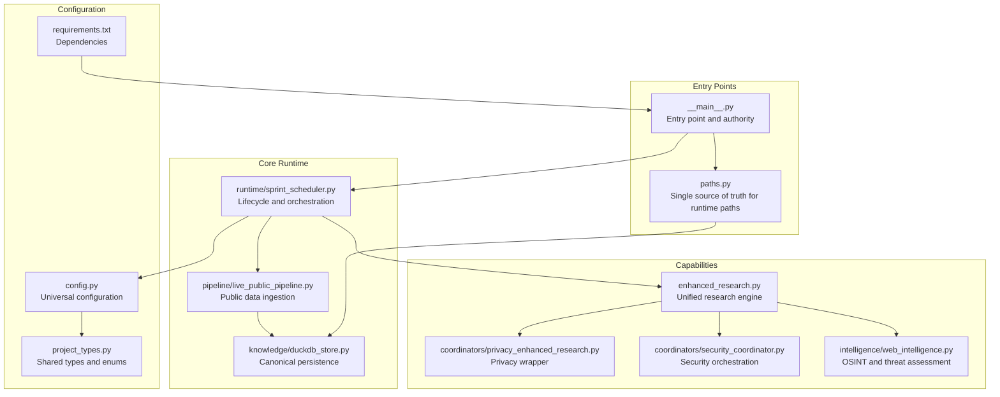
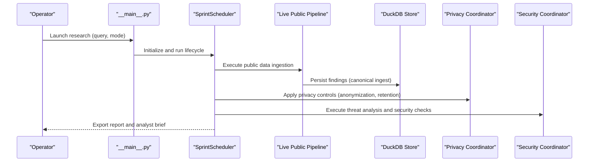
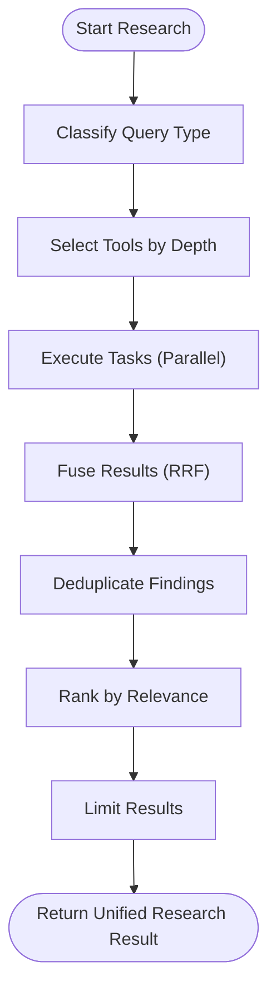
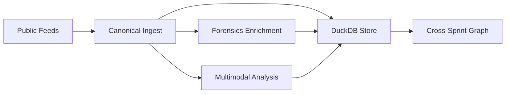
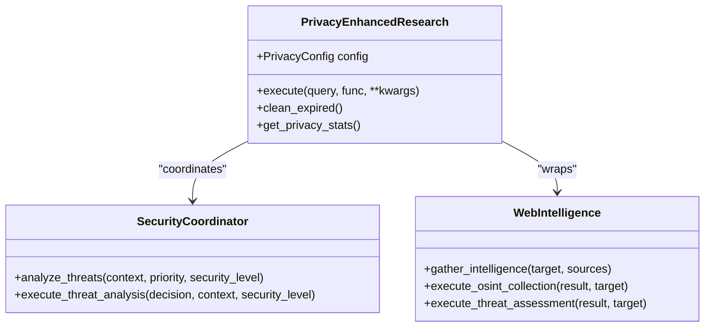
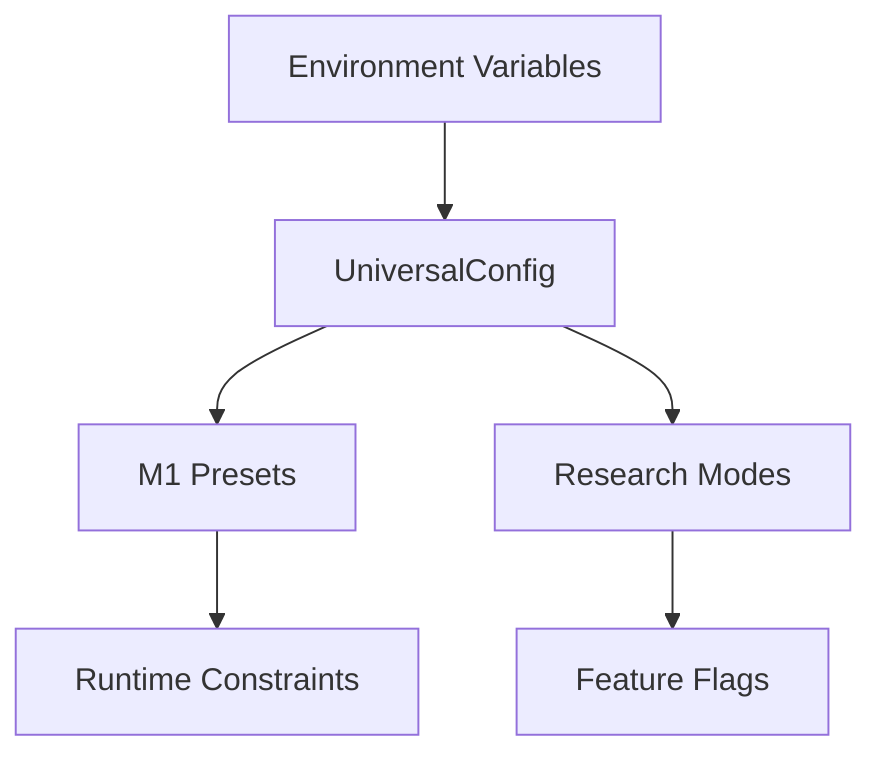
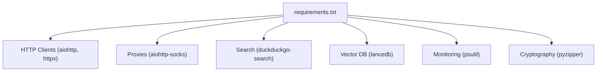

# Introduction

<cite>
**Referenced Files in This Document**
- [__main__.py](file://hledac/universal/__main__.py)
- [REAL_ARCHITECTURE.md](file://hledac/universal/REAL_ARCHITECTURE.md)
- [LONGTERM_PLAN.md](file://hledac/universal/LONGTERM_PLAN.md)
- [paths.py](file://hledac/universal/paths.py)
- [config.py](file://hledac/universal/config.py)
- [project_types.py](file://hledac/universal/project_types.py)
- [privacy_enhanced_research.py](file://hledac/universal/coordinators/privacy_enhanced_research.py)
- [security_coordinator.py](file://hledac/universal/coordinators/security_coordinator.py)
- [web_intelligence.py](file://hledac/universal/intelligence/web_intelligence.py)
- [requirements.txt](file://hledac/universal/requirements.txt)
</cite>

## Table of Contents
1. [Introduction](#introduction)
2. [Project Structure](#project-structure)
3. [Core Components](#core-components)
4. [Architecture Overview](#architecture-overview)
5. [Detailed Component Analysis](#detailed-component-analysis)
6. [Dependency Analysis](#dependency-analysis)
7. [Performance Considerations](#performance-considerations)
8. [Troubleshooting Guide](#troubleshooting-guide)
9. [Conclusion](#conclusion)

## Introduction
Hledac Universal is an autonomous OSINT research framework designed to operate reliably across diverse and evolving threat landscapes. Its mission is to deliver multi-modal intelligence gathering that is privacy-preserving, resource-conscious, and production-ready. The platform positions itself as a foundational layer within the cybersecurity ecosystem, enabling analysts, researchers, and intelligence professionals to conduct scalable, repeatable, and secure investigations.

Key value propositions:
- Autonomous research operations: The platform orchestrates end-to-end research with minimal manual intervention, adapting to query complexity and resource constraints.
- Multi-source integration: It synthesizes findings from heterogeneous sources (web, archives, dark web, forensic metadata, multimodal content) through unified pipelines.
- Privacy-preserving intelligence collection: Built-in privacy and security layers ensure sensitive operations remain auditable and anonymized where required.

Vision statement:
To provide a robust, autonomous, and privacy-first OSINT research framework that scales across modalities and environments, delivering actionable intelligence while maintaining operational security and resource efficiency.

Target audience:
- Cybersecurity analysts investigating incidents, threats, and vulnerabilities
- Researchers conducting academic and investigative studies
- Intelligence professionals requiring secure, repeatable, and scalable data collection

Primary use cases:
- Threat hunting and attribution across web, archive, and dark web sources
- Forensic enrichment of findings with metadata, passive fingerprints, and identity stitching
- Autonomous pivoting and cross-sprint knowledge accumulation
- Privacy-compliant research workflows with configurable retention and sanitization

Context and rationale:
The platform emerges from a continuous integration and deployment philosophy, with each sprint phase adding canonical capabilities while maintaining strict invariants around canonical write paths, memory discipline, and fail-soft behavior. This ensures that as new capabilities are introduced (e.g., multimodal analysis, graph accumulation, privacy layers), the system remains stable, predictable, and suitable for production use.

## Project Structure
Hledac Universal organizes functionality into cohesive layers and modules that support autonomous research, privacy, security, and multi-modal intelligence synthesis. The structure emphasizes:
- Canonical runtime ownership and persistence guarantees
- Layered capabilities (research, privacy, security, stealth, coordination)
- Extensible configuration and environment-driven tuning
- Robust path management and boot hygiene

**Diagram sources**
- [__main__.py](file://hledac/universal/__main__.py)
- [REAL_ARCHITECTURE.md](file://hledac/universal/REAL_ARCHITECTURE.md)
- [paths.py](file://hledac/universal/paths.py)
- [config.py](file://hledac/universal/config.py)
- [project_types.py](file://hledac/universal/project_types.py)
- [privacy_enhanced_research.py](file://hledac/universal/coordinators/privacy_enhanced_research.py)
- [security_coordinator.py](file://hledac/universal/coordinators/security_coordinator.py)
- [web_intelligence.py](file://hledac/universal/intelligence/web_intelligence.py)
- [requirements.txt](file://hledac/universal/requirements.txt)

**Section sources**
- [__main__.py](file://hledac/universal/__main__.py)
- [REAL_ARCHITECTURE.md](file://hledac/universal/REAL_ARCHITECTURE.md)
- [paths.py](file://hledac/universal/paths.py)
- [config.py](file://hledac/universal/config.py)
- [project_types.py](file://hledac/universal/project_types.py)
- [requirements.txt](file://hledac/universal/requirements.txt)

## Core Components
- Entry point and authority: The main entry establishes canonical roles, boot hygiene, and runtime status, ensuring predictable startup and teardown.
- Canonical runtime and persistence: The scheduler owns lifecycle transitions, while DuckDB-backed stores maintain canonical persistence for findings and derived artifacts.
- Unified research engine: Integrates academic, archive, stealth, and web intelligence with depth-aware execution and result fusion.
- Privacy and security orchestration: Provides privacy-enhanced wrappers and security coordination to enforce retention, sanitization, and threat analysis.
- Configuration and types: Centralized configuration supports research modes, M1 memory constraints, and feature flags; shared types define enums and dataclasses across modules.

**Section sources**
- [__main__.py](file://hledac/universal/__main__.py)
- [REAL_ARCHITECTURE.md](file://hledac/universal/REAL_ARCHITECTURE.md)
- [enhanced_research.py](file://hledac/universal/enhanced_research.py)
- [privacy_enhanced_research.py](file://hledac/universal/coordinators/privacy_enhanced_research.py)
- [security_coordinator.py](file://hledac/universal/coordinators/security_coordinator.py)
- [web_intelligence.py](file://hledac/universal/intelligence/web_intelligence.py)
- [config.py](file://hledac/universal/config.py)
- [project_types.py](file://hledac/universal/project_types.py)

## Architecture Overview
Hledac Universal follows a layered architecture with a strong emphasis on canonical ownership and safety invariants:
- Canonical write seam: DuckDB-backed stores own persistence for findings and derived artifacts.
- Lifecycle ownership: The scheduler controls warmup, active execution, windup, and teardown phases.
- Capability routing: An autonomous analyzer determines tool selection, privacy requirements, and reasoning mode based on query characteristics.
- Privacy and security layers: Enforce anonymization, retention, and audit logging; integrate with stealth and secure transport mechanisms.
- Multi-modal synthesis: Documents, images, and text are normalized into canonical findings with source-type tagging and metadata enrichment.

**Diagram sources**
- [__main__.py](file://hledac/universal/__main__.py)
- [REAL_ARCHITECTURE.md](file://hledac/universal/REAL_ARCHITECTURE.md)
- [privacy_enhanced_research.py](file://hledac/universal/coordinators/privacy_enhanced_research.py)
- [security_coordinator.py](file://hledac/universal/coordinators/security_coordinator.py)

**Section sources**
- [__main__.py](file://hledac/universal/__main__.py)
- [REAL_ARCHITECTURE.md](file://hledac/universal/REAL_ARCHITECTURE.md)

## Detailed Component Analysis

### Autonomous Research Operations
Hledac Universal’s autonomous research operations combine intelligent tool selection, depth-aware execution, and result fusion. The unified research engine:
- Classifies queries by type (academic, technical, security, etc.)
- Selects appropriate tools based on depth and query characteristics
- Executes tasks in parallel with bounded concurrency and memory management
- Applies reciprocal rank fusion and deduplication to synthesize high-quality results

**Diagram sources**
- [enhanced_research.py](file://hledac/universal/enhanced_research.py)

**Section sources**
- [enhanced_research.py](file://hledac/universal/enhanced_research.py)

### Multi-Source Integration
The platform integrates multiple data sources through canonical ingestion and sidecar enrichment:
- Public feeds and discovery pipelines produce initial findings
- Forensics enrichment attaches metadata and passive fingerprints
- Multimodal analyzers convert documents and images into canonical findings
- Graph services accumulate cross-sprint relationships and target memory

**Diagram sources**
- [REAL_ARCHITECTURE.md](file://hledac/universal/REAL_ARCHITECTURE.md)

**Section sources**
- [REAL_ARCHITECTURE.md](file://hledac/universal/REAL_ARCHITECTURE.md)

### Privacy-Preserving Intelligence Collection
Privacy and security are embedded across the platform:
- Privacy-enhanced research wraps operations with anonymization, sanitization, and retention policies
- Security coordinator executes threat analysis and maintains security levels
- Web intelligence integrates OSINT collection with threat assessment and confidence scoring

**Diagram sources**
- [privacy_enhanced_research.py](file://hledac/universal/coordinators/privacy_enhanced_research.py)
- [security_coordinator.py](file://hledac/universal/coordinators/security_coordinator.py)
- [web_intelligence.py](file://hledac/universal/intelligence/web_intelligence.py)

**Section sources**
- [privacy_enhanced_research.py](file://hledac/universal/coordinators/privacy_enhanced_research.py)
- [security_coordinator.py](file://hledac/universal/coordinators/security_coordinator.py)
- [web_intelligence.py](file://hledac/universal/intelligence/web_intelligence.py)

### Configuration and Environment
The platform supports environment-driven configuration and M1 memory constraints:
- Research modes (quick, standard, deep, extreme, autonomous) tune concurrency and features
- M1 presets constrain memory and model stacks for reliable operation
- Feature flags enable or disable layers (privacy, stealth, knowledge graph, RAG)

**Diagram sources**
- [config.py](file://hledac/universal/config.py)
- [project_types.py](file://hledac/universal/project_types.py)

**Section sources**
- [config.py](file://hledac/universal/config.py)
- [project_types.py](file://hledac/universal/project_types.py)

## Dependency Analysis
Hledac Universal relies on a curated set of dependencies supporting asynchronous networking, vector search, and privacy-focused operations. The dependency list includes:
- Asynchronous HTTP and SOCKS proxies for resilient fetching
- DuckDuckGo search for public discovery
- Vector database (LanceDB) and memory monitoring (psutil)
- Cryptography and compression utilities for secure vault operations

**Diagram sources**
- [requirements.txt](file://hledac/universal/requirements.txt)

**Section sources**
- [requirements.txt](file://hledac/universal/requirements.txt)

## Performance Considerations
- Memory discipline: M1 presets and runtime governors enforce strict memory and thermal thresholds to prevent throttling and instability.
- Concurrency control: Adaptive semaphores and bounded concurrency protect against resource exhaustion.
- Fail-soft behavior: Pipelines and sidecars continue despite partial failures, preserving progress and minimizing downtime.
- Canonical write paths: Centralized persistence reduces duplication and overhead while ensuring auditability.

[No sources needed since this section provides general guidance]

## Troubleshooting Guide
Common operational issues and remedies:
- Boot hygiene and path validation: Ensure runtime paths are active and boot guards are satisfied before starting the main loop.
- Memory pressure and thermal throttling: Reduce concurrency or switch to lighter research modes when encountering high memory usage.
- External API failures: Verify timeouts and fallbacks; many operations are fail-soft to prevent cascading failures.
- Privacy and security layer conflicts: Confirm privacy settings and security levels align with the target environment and compliance requirements.

**Section sources**
- [__main__.py](file://hledac/universal/__main__.py)
- [paths.py](file://hledac/universal/paths.py)
- [config.py](file://hledac/universal/config.py)

## Conclusion
Hledac Universal delivers a principled, autonomous OSINT research framework that balances multi-modal intelligence gathering with privacy, security, and performance. By enforcing canonical ownership, layered capabilities, and strict operational invariants, it provides a solid foundation for analysts, researchers, and intelligence professionals to investigate threats and collect actionable intelligence responsibly and efficiently.