# Key Features and Capabilities

<cite>
**Referenced Files in This Document**
- [README.md](file://README.md)
- [M1_8GB_MEMORY_BUDGET.md](file://M1_8GB_MEMORY_BUDGET.md)
- [research_coordinator.py](file://coordinators/research_coordinator.py)
- [multimodal_coordinator.py](file://coordinators/multimodal_coordinator.py)
- [transport_resolver.py](file://transport/transport_resolver.py)
- [transport_tor.py](file://federated/transport_tor.py)
- [public_fetcher.py](file://fetching/public_fetcher.py)
- [darknet.py](file://tools/darknet.py)
- [synthesis_runner.py](file://brain/synthesis_runner.py)
- [sprint_scheduler.py](file://runtime/sprint_scheduler.py)
- [stix_exporter.py](file://export/stix_exporter.py)
- [graph_layer.py](file://knowledge/graph_layer.py)
- [graph_rag.py](file://knowledge/graph_rag.py)
- [persistent_layer.py](file://legacy/persistent_layer.py)
- [stealth_layer.py](file://layers/stealth_layer.py)
- [stealth_manager.py](file://stealth/stealth_manager.py)
- [memory_layer.py](file://layers/memory_layer.py)
- [memory_coordinator.py](file://coordinators/memory_coordinator.py)
- [memory_pressure_broker.py](file://orchestrator/memory_pressure_broker.py)
- [identity_stitching_canonical.py](file://intelligence/identity_stitching_canonical.py)
- [REAL_ARCHITECTURE.md](file://REAL_ARCHITECTURE.md)
- [platform_info.py](file://utils/platform_info.py)
- [ane_pipelines.py](file://utils/ane_pipelines.py)
- [export/__init__.py](file://export/__init__.py)
</cite>

## Table of Contents
1. [Introduction](#introduction)
2. [Project Structure](#project-structure)
3. [Core Components](#core-components)
4. [Architecture Overview](#architecture-overview)
5. [Detailed Component Analysis](#detailed-component-analysis)
6. [Dependency Analysis](#dependency-analysis)
7. [Performance Considerations](#performance-considerations)
8. [Troubleshooting Guide](#troubleshooting-guide)
9. [Conclusion](#conclusion)

## Introduction
This document presents Hledac Universal’s key autonomous research capabilities and operational strengths. It covers:
- Pattern-based content discovery and theory generation
- Memory-constrained operations optimized for 8 GB RAM on Apple Silicon
- Multi-protocol transport support (Tor, I2P, direct connections)
- AI/ML inference powered by MLX for Apple Silicon acceleration
- Knowledge graph construction and semantic search
- Multi-modal content processing (text, vision, audio)
- Export capabilities supporting STIX, JSON-LD, Markdown
- Canonical ownership model ensuring single-source-of-truth data consistency
- Memory management optimizations and stealth browsing capabilities

Practical examples illustrate what users can accomplish with each feature.

## Project Structure
Hledac Universal organizes capabilities across coordinated layers and specialized engines:
- Autonomous research orchestration and theory synthesis
- Transport resolution and fetching over Tor/I2P/direct
- Multimodal processing with MLX acceleration
- Knowledge graph construction and retrieval
- Export pipeline for diagnostics and CTI
- Memory governance and stealth browsing

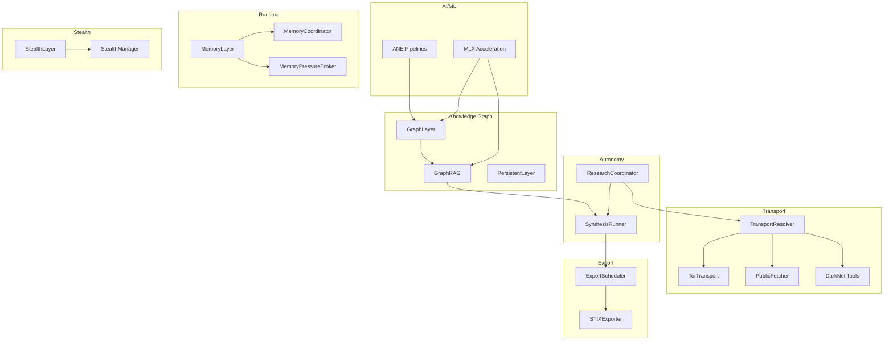

**Diagram sources**
- [research_coordinator.py](file://coordinators/research_coordinator.py)
- [synthesis_runner.py](file://brain/synthesis_runner.py)
- [transport_resolver.py](file://transport/transport_resolver.py)
- [transport_tor.py](file://federated/transport_tor.py)
- [public_fetcher.py](file://fetching/public_fetcher.py)
- [darknet.py](file://tools/darknet.py)
- [graph_layer.py](file://knowledge/graph_layer.py)
- [graph_rag.py](file://knowledge/graph_rag.py)
- [persistent_layer.py](file://legacy/persistent_layer.py)
- [sprint_scheduler.py](file://runtime/sprint_scheduler.py)
- [stix_exporter.py](file://export/stix_exporter.py)
- [memory_layer.py](file://layers/memory_layer.py)
- [memory_coordinator.py](file://coordinators/memory_coordinator.py)
- [memory_pressure_broker.py](file://orchestrator/memory_pressure_broker.py)
- [stealth_layer.py](file://layers/stealth_layer.py)
- [stealth_manager.py](file://stealth/stealth_manager.py)

**Section sources**
- [README.md](file://README.md)

## Core Components
- Pattern-based discovery and theory generation: Detects meta-patterns from diverse sources and generates research theories.
- Multi-protocol transport: Resolves transports by URL suffix (.onion, .i2p) and selects anonymity-grade channels.
- MLX-accelerated AI/ML: Uses MLX and ANE for Apple Silicon–optimized inference and embeddings.
- Knowledge graph and semantic search: Builds and queries graphs with GraphRAG and semantic filters.
- Multi-modal processing: Encodes text, images, audio with MLX-backed encoders and fuses modalities.
- Export pipeline: Produces Markdown, JSON-LD, and STIX bundles for diagnostics and CTI.
- Canonical ownership model: Enforces single-source-of-truth data paths and bounded operations.
- Memory management: Strict memory limits, unload routines, and pressure-aware orchestration.
- Stealth browsing: Anti-detection headers, evasion scripts, and CAPTCHA solving.

**Section sources**
- [research_coordinator.py](file://coordinators/research_coordinator.py)
- [transport_resolver.py](file://transport/transport_resolver.py)
- [transport_tor.py](file://federated/transport_tor.py)
- [public_fetcher.py](file://fetching/public_fetcher.py)
- [darknet.py](file://tools/darknet.py)
- [multimodal_coordinator.py](file://coordinators/multimodal_coordinator.py)
- [graph_layer.py](file://knowledge/graph_layer.py)
- [graph_rag.py](file://knowledge/graph_rag.py)
- [persistent_layer.py](file://legacy/persistent_layer.py)
- [synthesis_runner.py](file://brain/synthesis_runner.py)
- [sprint_scheduler.py](file://runtime/sprint_scheduler.py)
- [stix_exporter.py](file://export/stix_exporter.py)
- [identity_stitching_canonical.py](file://intelligence/identity_stitching_canonical.py)
- [M1_8GB_MEMORY_BUDGET.md](file://M1_8GB_MEMORY_BUDGET.md)
- [memory_layer.py](file://layers/memory_layer.py)
- [memory_coordinator.py](file://coordinators/memory_coordinator.py)
- [memory_pressure_broker.py](file://orchestrator/memory_pressure_broker.py)
- [stealth_layer.py](file://layers/stealth_layer.py)
- [stealth_manager.py](file://stealth/stealth_manager.py)
- [platform_info.py](file://utils/platform_info.py)
- [ane_pipelines.py](file://utils/ane_pipelines.py)

## Architecture Overview
The system integrates autonomous research, transport, AI/ML, knowledge graphs, and export into a cohesive pipeline. Canonical ownership ensures data integrity and deterministic behavior across modules.

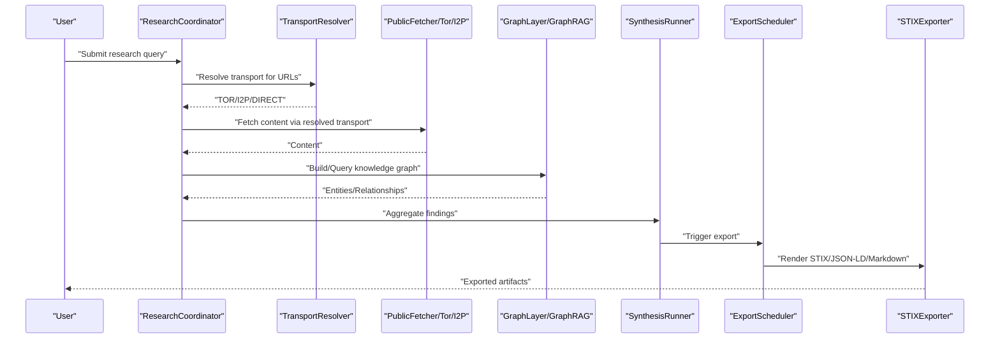

**Diagram sources**
- [research_coordinator.py](file://coordinators/research_coordinator.py)
- [transport_resolver.py](file://transport/transport_resolver.py)
- [public_fetcher.py](file://fetching/public_fetcher.py)
- [graph_layer.py](file://knowledge/graph_layer.py)
- [graph_rag.py](file://knowledge/graph_rag.py)
- [synthesis_runner.py](file://brain/synthesis_runner.py)
- [sprint_scheduler.py](file://runtime/sprint_scheduler.py)
- [stix_exporter.py](file://export/stix_exporter.py)

## Detailed Component Analysis

### Pattern-Based Content Discovery and Theory Generation
- Detects meta-patterns from multiple sources and generates research theories.
- Enables deeper insights by combining pattern detection with theory synthesis.

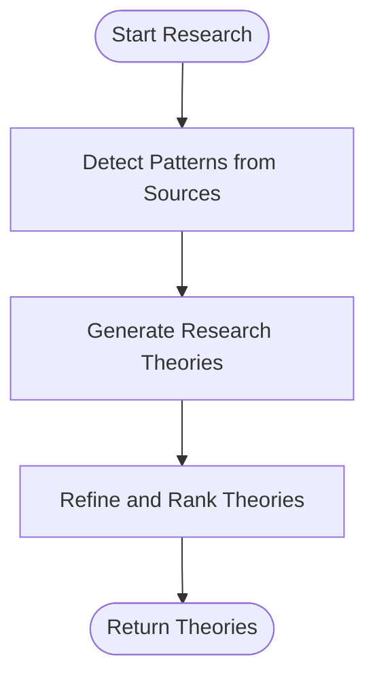

**Diagram sources**
- [research_coordinator.py](file://coordinators/research_coordinator.py)

**Section sources**
- [research_coordinator.py](file://coordinators/research_coordinator.py)

### Multi-Protocol Transport Support (Tor, I2P, Direct)
- TransportResolver classifies URLs by suffix and selects TOR/I2P/DIRECT.
- PublicFetcher manages Tor/I2P sessions and closes them deterministically.
- DarkNet tools provide .onion and .i2p fetch helpers with fallbacks.

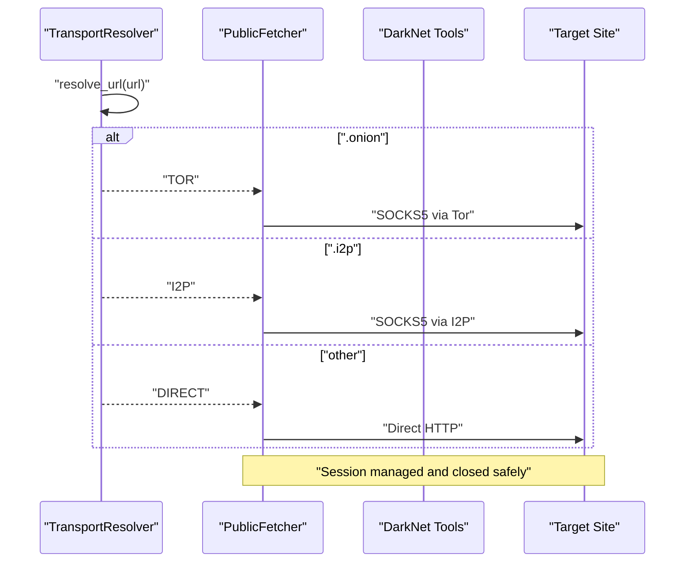

**Diagram sources**
- [transport_resolver.py](file://transport/transport_resolver.py)
- [public_fetcher.py](file://fetching/public_fetcher.py)
- [darknet.py](file://tools/darknet.py)
- [transport_tor.py](file://federated/transport_tor.py)

**Section sources**
- [transport_resolver.py](file://transport/transport_resolver.py)
- [public_fetcher.py](file://fetching/public_fetcher.py)
- [darknet.py](file://tools/darknet.py)
- [transport_tor.py](file://federated/transport_tor.py)

### AI/ML Inference with MLX Acceleration (Apple Silicon)
- MLX availability is probed and used for accelerated operations.
- ANE pipelines compute safe batch sizes and manage SRAM budgets.
- MultimodalCoordinator uses MLX encoders for text, audio, and vision when available.

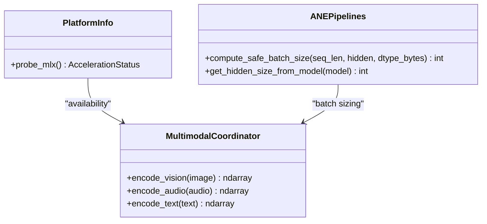

**Diagram sources**
- [platform_info.py](file://utils/platform_info.py)
- [ane_pipelines.py](file://utils/ane_pipelines.py)
- [multimodal_coordinator.py](file://coordinators/multimodal_coordinator.py)

**Section sources**
- [platform_info.py](file://utils/platform_info.py)
- [ane_pipelines.py](file://utils/ane_pipelines.py)
- [multimodal_coordinator.py](file://coordinators/multimodal_coordinator.py)

### Knowledge Graph Construction and Semantic Search
- GraphLayer supports adding nodes and querying via GraphRAG multi-hop search.
- PersistentLayer offers semantic search using Model2Vec with memory-efficient top-K selection.
- GraphRAG orchestrates traversal and yields discovered nodes asynchronously.

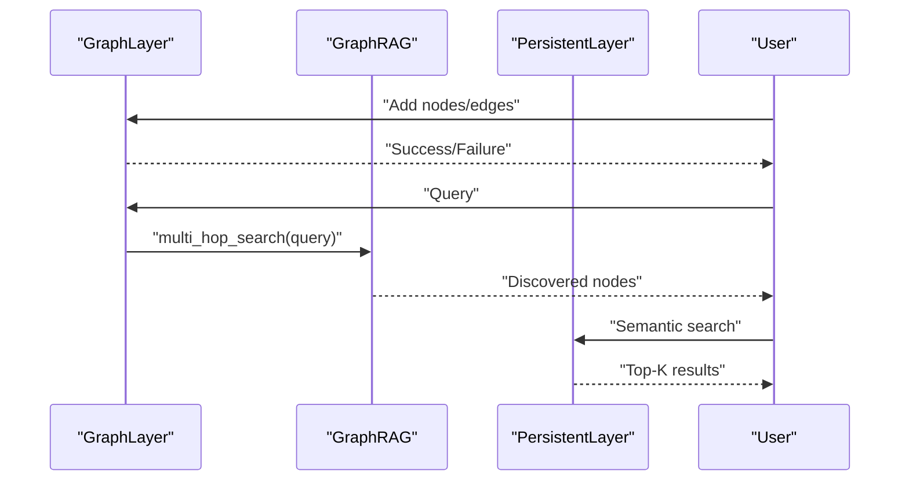

**Diagram sources**
- [graph_layer.py](file://knowledge/graph_layer.py)
- [graph_rag.py](file://knowledge/graph_rag.py)
- [persistent_layer.py](file://legacy/persistent_layer.py)

**Section sources**
- [graph_layer.py](file://knowledge/graph_layer.py)
- [graph_rag.py](file://knowledge/graph_rag.py)
- [persistent_layer.py](file://legacy/persistent_layer.py)

### Multi-Modal Content Processing (Text, Vision, Audio)
- MultimodalCoordinator detects modalities automatically and processes them with MLX-backed encoders when available.
- Supports fusion of multiple modalities into a unified representation.

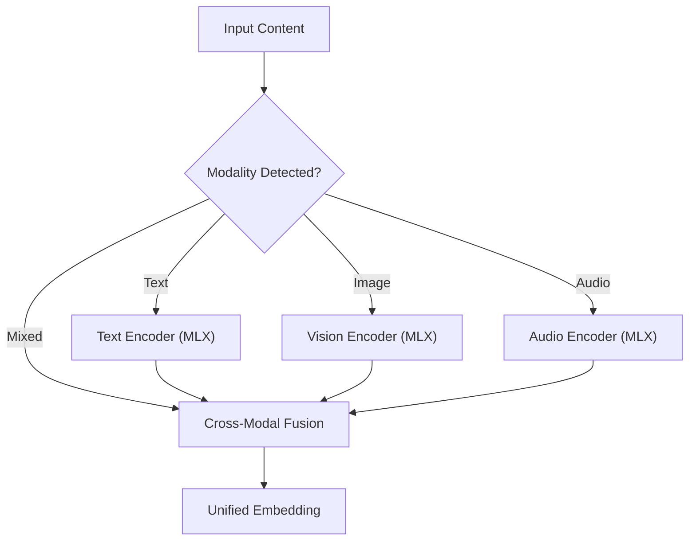

**Diagram sources**
- [multimodal_coordinator.py](file://coordinators/multimodal_coordinator.py)

**Section sources**
- [multimodal_coordinator.py](file://coordinators/multimodal_coordinator.py)

### Export Capabilities (STIX, JSON, Markdown)
- Export pipeline renders Markdown, JSON-LD, and STIX bundles.
- STIX exporter builds deterministic bundles and supports CTI exports.
- Sprint scheduler coordinates export runs and records outcomes.

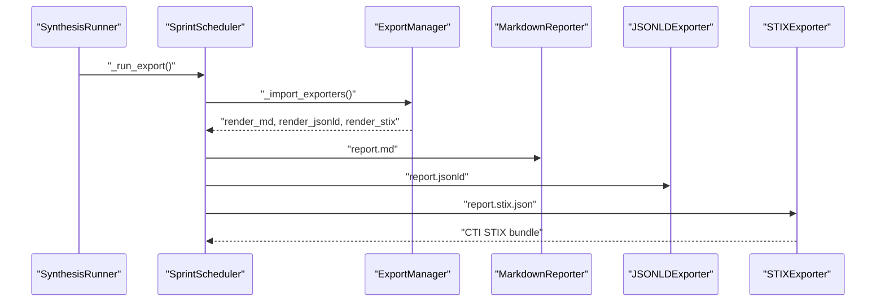

**Diagram sources**
- [sprint_scheduler.py](file://runtime/sprint_scheduler.py)
- [export/__init__.py](file://export/__init__.py)
- [stix_exporter.py](file://export/stix_exporter.py)
- [synthesis_runner.py](file://brain/synthesis_runner.py)

**Section sources**
- [sprint_scheduler.py](file://runtime/sprint_scheduler.py)
- [export/__init__.py](file://export/__init__.py)
- [stix_exporter.py](file://export/stix_exporter.py)
- [synthesis_runner.py](file://brain/synthesis_runner.py)

### Canonical Ownership Model and Single-Source-of-Truth Consistency
- IdentityStitchingCanonical adapter wraps the stitching engine with bounded comparisons and fail-soft behavior.
- Converts derived identities into CanonicalFinding objects and upserts advisory edges via graph_service.
- Ensures deterministic sidecar role and safe memory-bound operations.

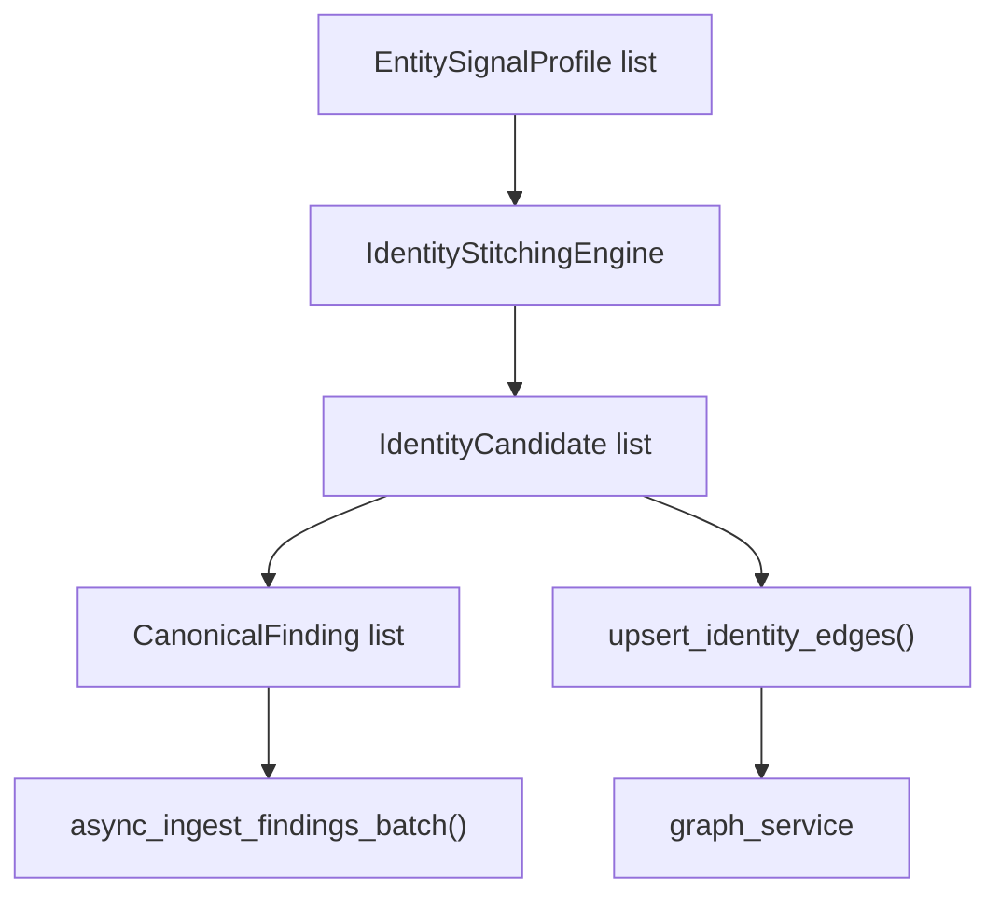

**Diagram sources**
- [identity_stitching_canonical.py](file://intelligence/identity_stitching_canonical.py)
- [REAL_ARCHITECTURE.md](file://REAL_ARCHITECTURE.md)

**Section sources**
- [identity_stitching_canonical.py](file://intelligence/identity_stitching_canonical.py)
- [REAL_ARCHITECTURE.md](file://REAL_ARCHITECTURE.md)

### Memory-Constrained Operations (8 GB RAM on Apple Silicon)
- Memory waterfall and bounds protect against macOS compression thresholds.
- Model lifecycle includes proper unload sequences with garbage collection and Metal cache clearing.
- MemoryLayer, MemoryCoordinator, and MemoryPressureBroker coordinate pressure-aware operations.

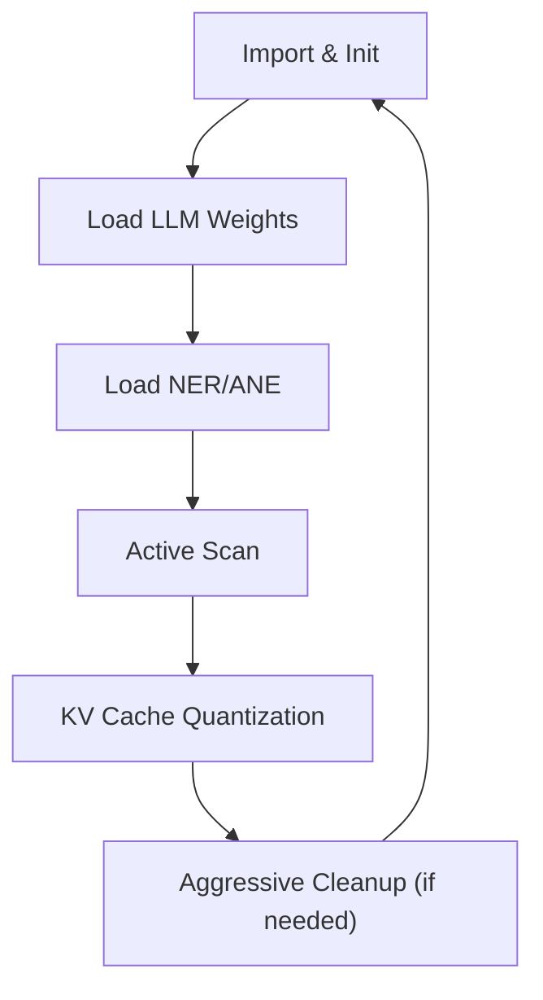

**Diagram sources**
- [M1_8GB_MEMORY_BUDGET.md](file://M1_8GB_MEMORY_BUDGET.md)
- [memory_layer.py](file://layers/memory_layer.py)
- [memory_coordinator.py](file://coordinators/memory_coordinator.py)
- [memory_pressure_broker.py](file://orchestrator/memory_pressure_broker.py)

**Section sources**
- [M1_8GB_MEMORY_BUDGET.md](file://M1_8GB_MEMORY_BUDGET.md)
- [memory_layer.py](file://layers/memory_layer.py)
- [memory_coordinator.py](file://coordinators/memory_coordinator.py)
- [memory_pressure_broker.py](file://orchestrator/memory_pressure_broker.py)

### Stealth Browsing Capabilities
- StealthLayer initializes evasion scripts, CAPTCHA solving, and fingerprint randomization.
- StealthManager generates stealth headers and rotates them to reduce detection risk.

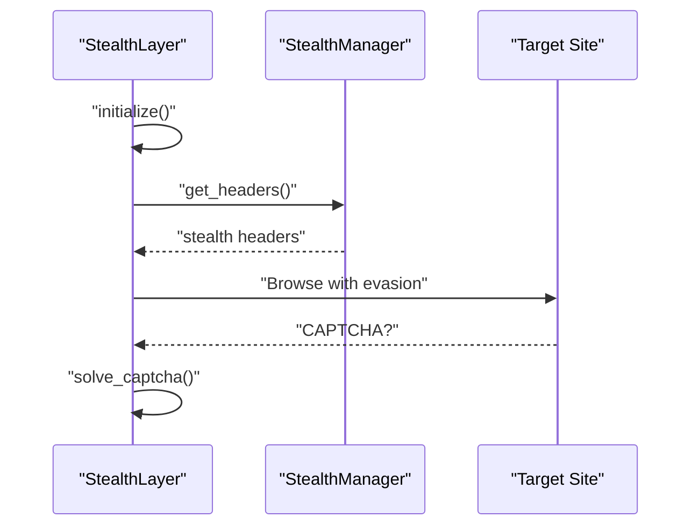

**Diagram sources**
- [stealth_layer.py](file://layers/stealth_layer.py)
- [stealth_manager.py](file://stealth/stealth_manager.py)

**Section sources**
- [stealth_layer.py](file://layers/stealth_layer.py)
- [stealth_manager.py](file://stealth/stealth_manager.py)

## Dependency Analysis
Key dependencies and integration points:
- TransportResolver depends on URL suffixes to choose transports.
- PublicFetcher and DarkNet tools depend on aiohttp_socks and Tor/I2P availability.
- GraphLayer/GraphRAG depend on knowledge graph backends.
- Export pipeline depends on renderers and STIX exporter.
- MemoryLayer and MemoryCoordinator depend on system memory metrics and pressure signals.

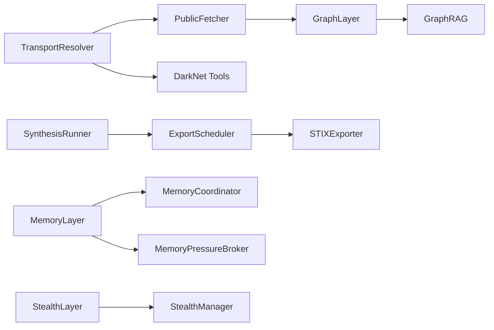

**Diagram sources**
- [transport_resolver.py](file://transport/transport_resolver.py)
- [public_fetcher.py](file://fetching/public_fetcher.py)
- [darknet.py](file://tools/darknet.py)
- [graph_layer.py](file://knowledge/graph_layer.py)
- [graph_rag.py](file://knowledge/graph_rag.py)
- [synthesis_runner.py](file://brain/synthesis_runner.py)
- [sprint_scheduler.py](file://runtime/sprint_scheduler.py)
- [stix_exporter.py](file://export/stix_exporter.py)
- [memory_layer.py](file://layers/memory_layer.py)
- [memory_coordinator.py](file://coordinators/memory_coordinator.py)
- [memory_pressure_broker.py](file://orchestrator/memory_pressure_broker.py)
- [stealth_layer.py](file://layers/stealth_layer.py)
- [stealth_manager.py](file://stealth/stealth_manager.py)

**Section sources**
- [transport_resolver.py](file://transport/transport_resolver.py)
- [public_fetcher.py](file://fetching/public_fetcher.py)
- [darknet.py](file://tools/darknet.py)
- [graph_layer.py](file://knowledge/graph_layer.py)
- [graph_rag.py](file://knowledge/graph_rag.py)
- [synthesis_runner.py](file://brain/synthesis_runner.py)
- [sprint_scheduler.py](file://runtime/sprint_scheduler.py)
- [stix_exporter.py](file://export/stix_exporter.py)
- [memory_layer.py](file://layers/memory_layer.py)
- [memory_coordinator.py](file://coordinators/memory_coordinator.py)
- [memory_pressure_broker.py](file://orchestrator/memory_pressure_broker.py)
- [stealth_layer.py](file://layers/stealth_layer.py)
- [stealth_manager.py](file://stealth/stealth_manager.py)

## Performance Considerations
- MLX and ANE acceleration reduce latency and improve throughput on Apple Silicon.
- Memory bounds and quantized KV caches keep RSS within macOS compression thresholds.
- Async graph traversal and memory-efficient top-K selection minimize memory footprint.
- Deterministic export rendering and fail-soft export scheduling ensure robustness.

[No sources needed since this section provides general guidance]

## Troubleshooting Guide
Common issues and mitigations:
- Tor/I2P sessions failing: Check availability of aiohttp_socks and Tor/I2P processes; fallback to localhost is logged.
- STIX export unavailable: Verify presence of export_stix_bundle on the injected graph; status and reason are recorded.
- Memory pressure warnings: Monitor pressure levels and trigger cleanup; ensure bounded allocations and unload routines are active.
- Stealth detection: Rotate headers, apply evasion scripts, and solve CAPTCHAs when prompted.

**Section sources**
- [public_fetcher.py](file://fetching/public_fetcher.py)
- [transport_tor.py](file://federated/transport_tor.py)
- [synthesis_runner.py](file://brain/synthesis_runner.py)
- [memory_pressure_broker.py](file://orchestrator/memory_pressure_broker.py)
- [stealth_layer.py](file://layers/stealth_layer.py)
- [stealth_manager.py](file://stealth/stealth_manager.py)

## Conclusion
Hledac Universal delivers a comprehensive autonomous research platform tailored for Apple Silicon with strict memory discipline. Its multi-protocol transport stack, MLX-accelerated AI/ML, robust knowledge graph, and multi-modal processing enable powerful discovery workflows. The canonical ownership model and memory governance ensure reliability and single-source-of-truth consistency, while stealth browsing and export capabilities support privacy and interoperability.