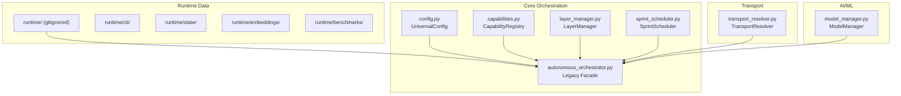
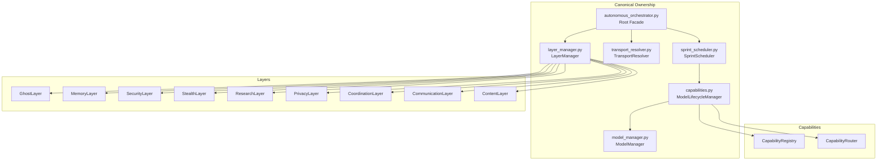
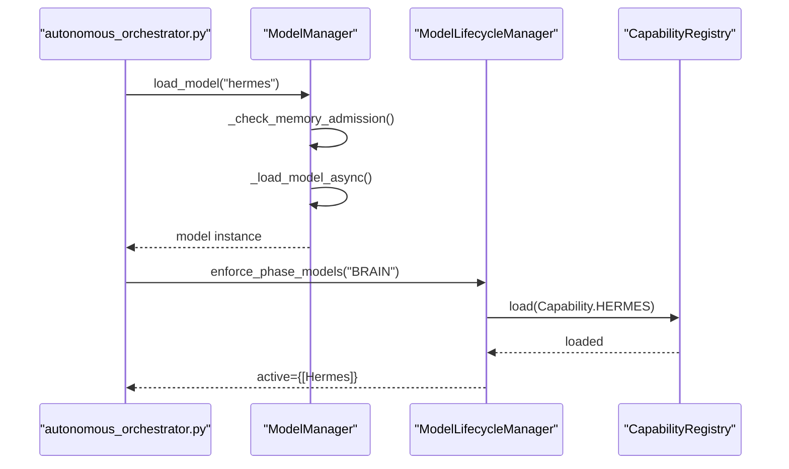
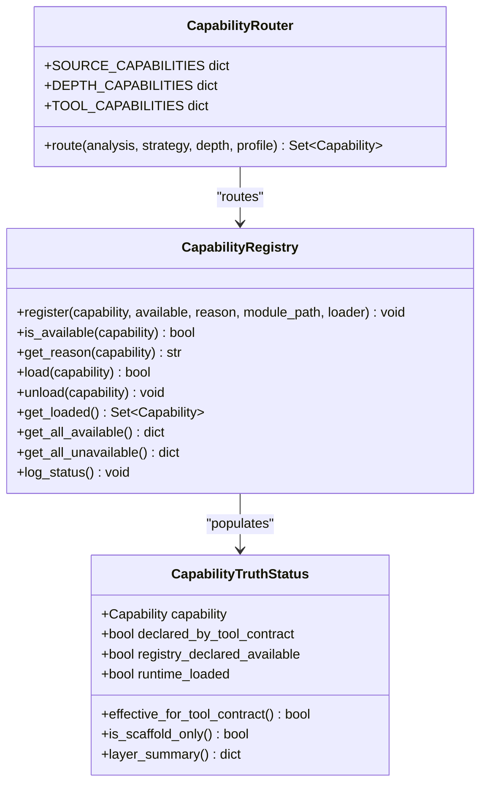
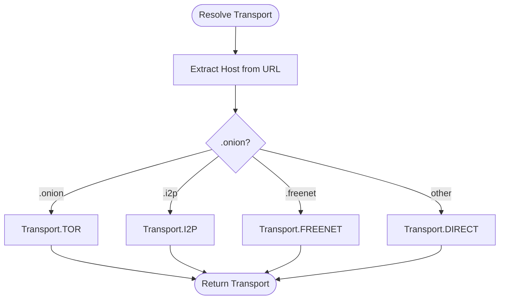
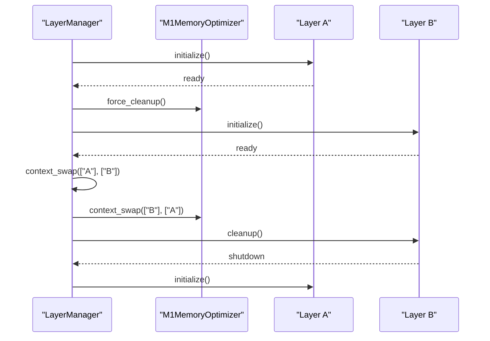
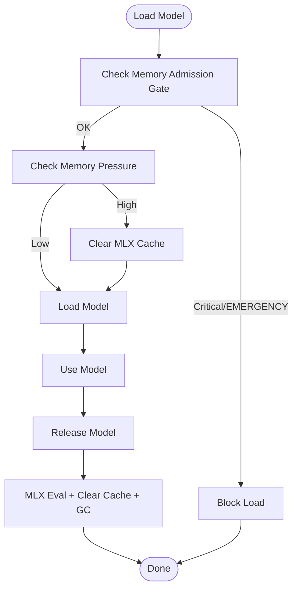
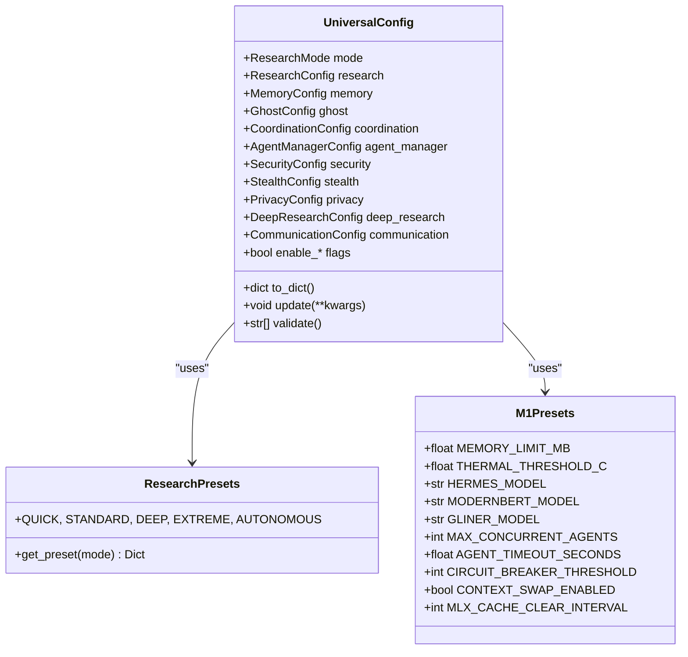
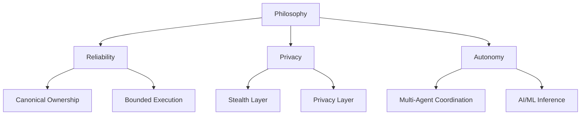
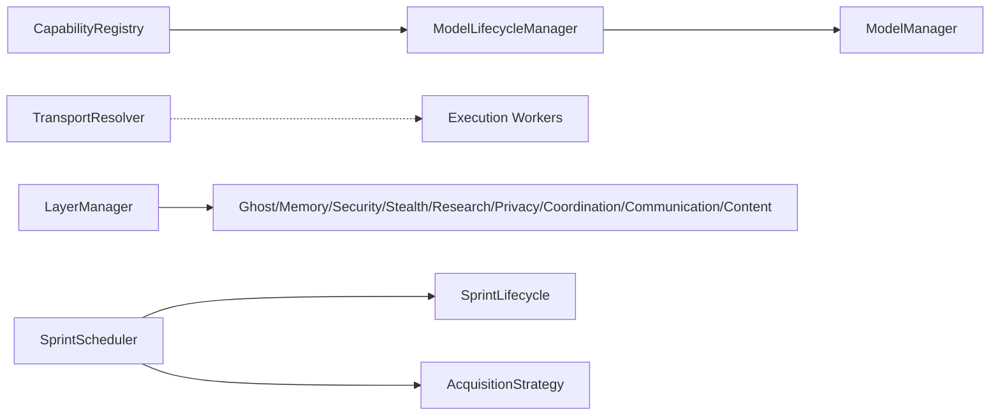

# Project Overview

<cite>
**Referenced Files in This Document**
- [README.md](file://hledac/universal/README.md)
- [autonomous_orchestrator.py](file://hledac/universal/autonomous_orchestrator.py)
- [config.py](file://hledac/universal/config.py)
- [capabilities.py](file://hledac/universal/capabilities.py)
- [orchestrator_integration.py](file://hledac/universal/orchestrator_integration.py)
- [project_types.py](file://hledac/universal/project_types.py)
- [model_manager.py](file://hledac/universal/brain/model_manager.py)
- [transport_resolver.py](file://hledac/universal/transport/transport_resolver.py)
- [layer_manager.py](file://hledac/universal/layers/layer_manager.py)
- [sprint_scheduler.py](file://hledac/universal/runtime/sprint_scheduler.py)
</cite>

## Table of Contents
1. [Introduction](#introduction)
2. [Project Structure](#project-structure)
3. [Core Components](#core-components)
4. [Architecture Overview](#architecture-overview)
5. [Detailed Component Analysis](#detailed-component-analysis)
6. [Dependency Analysis](#dependency-analysis)
7. [Performance Considerations](#performance-considerations)
8. [Troubleshooting Guide](#troubleshooting-guide)
9. [Conclusion](#conclusion)

## Introduction
Hledac Universal is an autonomous Open Source Intelligence (OSINT) orchestrator designed to operate reliably on Apple Silicon MacBooks, particularly constrained systems like the M1 MacBook Air with 8 GB RAM. Its mission is to enable robust, privacy-preserving, and AI/ML-informed research workflows that can autonomously discover, acquire, analyze, and synthesize intelligence across diverse sources while maintaining strict memory and thermal boundaries.

Key capabilities:
- Memory-constrained operations tailored for M1 8GB systems
- Multi-protocol transport support (clearnet, Tor, I2P, Freenet) with autonomous selection
- AI/ML inference with a 3-model stack (Hermes-3, ModernBERT, GLiNER) and runtime model lifecycle management
- Canonical ownership model ensuring single sources of truth and preventing third-model truths
- Layered architecture with coordinated capabilities, steerable research modes, and integrated privacy/security/stealth layers

Target audience:
- Analysts and researchers requiring autonomous, privacy-preserving OSINT on macOS
- Security teams performing threat hunting, attribution, and incident response
- Academics and journalists investigating sensitive topics with strong privacy requirements

Use cases:
- Autonomous discovery of dark/web archives and structured TI feeds
- Entity extraction and knowledge graph building under memory pressure
- Privacy-preserving research with stealth and anonymity layers
- Multi-domain pivoting and hypothesis-driven research with AI assistance

## Project Structure
The project organizes functionality into cohesive layers and subsystems:
- Runtime data locations under a self-contained directory structure
- Configuration presets for research modes and M1 8GB optimization
- Capability registry and routing for on-demand model and tool loading
- Transport resolver for autonomous selection across clearnet, Tor, I2P, and Freenet
- Layer manager coordinating Ghost, Memory, Security, Stealth, Research, Privacy, Coordination, Communication, and Content layers
- Sprint scheduler orchestrating bounded 30-minute research sprints with lifecycle-aware execution

**Diagram sources**
- [README.md:10-17](file://hledac/universal/README.md#L10-L17)
- [config.py:228-328](file://hledac/universal/config.py#L228-L328)
- [capabilities.py:357-478](file://hledac/universal/capabilities.py#L357-L478)
- [layer_manager.py:163-592](file://hledac/universal/layers/layer_manager.py#L163-L592)
- [autonomous_orchestrator.py:69-111](file://hledac/universal/autonomous_orchestrator.py#L69-L111)
- [sprint_scheduler.py:1-50](file://hledac/universal/runtime/sprint_scheduler.py#L1-L50)
- [transport_resolver.py:95-240](file://hledac/universal/transport/transport_resolver.py#L95-L240)
- [model_manager.py:178-280](file://hledac/universal/brain/model_manager.py#L178-L280)

**Section sources**
- [README.md:1-48](file://hledac/universal/README.md#L1-L48)
- [config.py:36-117](file://hledac/universal/config.py#L36-L117)
- [layer_manager.py:163-592](file://hledac/universal/layers/layer_manager.py#L163-L592)

## Core Components
- Universal configuration: centralized configuration with research modes, M1 8GB presets, and layered feature flags for security, stealth, privacy, and advanced capabilities
- Capability registry and router: four-layer truth separation (declared, available, loaded, effective) with on-demand loading and canonical ownership
- Transport resolver: autonomous selection among clearnet, Tor, I2P, and Freenet based on domain suffixes and runtime context
- Layer manager: ordered initialization, health monitoring, graceful shutdown, and M1 memory-aware context swapping
- Model lifecycle manager: strict 1-model-at-a-time policy with memory admission gates, RSS monitoring, and MLX cache management
- Sprint scheduler: bounded 30-minute sprints with tiered source prioritization, lifecycle-aware execution, and canonical ownership

Practical examples:
- Configure a research run with M1-optimized settings and enable stealth and privacy layers
- Route capabilities based on analyzer results and privacy requirements
- Resolve transport for a URL based on domain suffix and risk level
- Initialize layers in boot sequence and perform context swaps to reduce memory pressure
- Load and unload models with memory guards and MLX cache cleanup
- Schedule and execute a sprint with tiered source prioritization and export reporting

**Section sources**
- [config.py:228-606](file://hledac/universal/config.py#L228-L606)
- [capabilities.py:169-346](file://hledac/universal/capabilities.py#L169-L346)
- [transport_resolver.py:95-240](file://hledac/universal/transport/transport_resolver.py#L95-L240)
- [layer_manager.py:163-592](file://hledac/universal/layers/layer_manager.py#L163-L592)
- [model_manager.py:178-280](file://hledac/universal/brain/model_manager.py#L178-L280)
- [sprint_scheduler.py:623-660](file://hledac/universal/runtime/sprint_scheduler.py#L623-L660)

## Architecture Overview
The system follows a canonical ownership model where each capability, transport, and layer has a designated owner responsible for truth and lifecycle. This prevents third-model truths and ensures deterministic behavior under memory pressure.

**Diagram sources**
- [autonomous_orchestrator.py:25-44](file://hledac/universal/autonomous_orchestrator.py#L25-L44)
- [sprint_scheduler.py:1-27](file://hledac/universal/runtime/sprint_scheduler.py#L1-L27)
- [capabilities.py:623-772](file://hledac/universal/capabilities.py#L623-L772)
- [model_manager.py:178-280](file://hledac/universal/brain/model_manager.py#L178-L280)
- [transport_resolver.py:95-123](file://hledac/universal/transport/transport_resolver.py#L95-L123)
- [layer_manager.py:163-350](file://hledac/universal/layers/layer_manager.py#L163-L350)

## Detailed Component Analysis

### Canonical Ownership Model
The canonical ownership model establishes clear authorities to prevent drift and third-model truths:
- Model lifecycle: ModelManager is the canonical owner of model acquisition and cleanup; ModelLifecycleManager is a coarse-grained phase enforcer and capability facade
- Capability registry: CapabilityRegistry and ModelLifecycleManager are owners of capability truth; capability layer must not become a third model truth
- Transport resolver: TransportResolver is a policy candidate; production routing lives elsewhere
- Sprint scheduler: SprintScheduler is a runtime worker; the owner is elsewhere

**Diagram sources**
- [autonomous_orchestrator.py:69-111](file://hledac/universal/autonomous_orchestrator.py#L69-L111)
- [model_manager.py:547-712](file://hledac/universal/brain/model_manager.py#L547-L712)
- [capabilities.py:679-714](file://hledac/universal/capabilities.py#L679-L714)
- [capabilities.py:357-478](file://hledac/universal/capabilities.py#L357-L478)

**Section sources**
- [capabilities.py:623-772](file://hledac/universal/capabilities.py#L623-L772)
- [model_manager.py:178-280](file://hledac/universal/brain/model_manager.py#L178-L280)
- [autonomous_orchestrator.py:25-44](file://hledac/universal/autonomous_orchestrator.py#L25-L44)

### Capability Truth and Routing
CapabilityTruthStatus separates four explicit layers:
- Declared by tool contract
- Registry declared available
- Runtime loaded
- Effective for tool contract

**Diagram sources**
- [capabilities.py:169-346](file://hledac/universal/capabilities.py#L169-L346)
- [capabilities.py:480-621](file://hledac/universal/capabilities.py#L480-L621)
- [capabilities.py:357-478](file://hledac/universal/capabilities.py#L357-L478)

**Section sources**
- [capabilities.py:169-346](file://hledac/universal/capabilities.py#L169-L346)
- [capabilities.py:480-621](file://hledac/universal/capabilities.py#L480-L621)

### Transport Resolution and Multi-Protocol Support
TransportResolver classifies URLs by domain suffix and selects transports without configuration toggles:
- .onion → TOR (mandatory)
- .i2p/.b32.i2p → I2P
- .freenet → Freenet
- others → DIRECT

**Diagram sources**
- [transport_resolver.py:152-175](file://hledac/universal/transport/transport_resolver.py#L152-L175)
- [transport_resolver.py:268-301](file://hledac/universal/transport/transport_resolver.py#L268-L301)

**Section sources**
- [transport_resolver.py:95-240](file://hledac/universal/transport/transport_resolver.py#L95-L240)
- [transport_resolver.py:268-301](file://hledac/universal/transport/transport_resolver.py#L268-L301)

### Layer Management and M1 Memory Optimization
LayerManager coordinates initialization, health monitoring, and graceful shutdown with M1 memory-aware context swapping:
- Boot sequence: Ghost → Memory → Security → Coordination → Stealth → Research → Privacy → Communication → Content
- Context swap: unload inactive layers, force cleanup, load active layers
- Memory optimizer: MLX cache clearing, aggressive GC, memory pressure checks

**Diagram sources**
- [layer_manager.py:336-401](file://hledac/universal/layers/layer_manager.py#L336-L401)
- [layer_manager.py:456-505](file://hledac/universal/layers/layer_manager.py#L456-L505)
- [layer_manager.py:59-142](file://hledac/universal/layers/layer_manager.py#L59-L142)

**Section sources**
- [layer_manager.py:163-592](file://hledac/universal/layers/layer_manager.py#L163-L592)

### AI/ML Inference and Model Lifecycle
ModelManager enforces a strict 1-model-at-a-time policy with memory admission gates and MLX cache management:
- Memory admission gate: fail-fast before heavy model load
- RSS-based memory pressure checks: soft fail with cache clearing
- Model lifecycle: load, use, release with MLX cache cleanup and GC
- M1 8GB presets: Hermes-3, ModernBERT, GLiNER with quantization and context limits

**Diagram sources**
- [model_manager.py:651-712](file://hledac/universal/brain/model_manager.py#L651-L712)
- [model_manager.py:410-426](file://hledac/universal/brain/model_manager.py#L410-L426)
- [model_manager.py:713-774](file://hledac/universal/brain/model_manager.py#L713-L774)

**Section sources**
- [model_manager.py:178-280](file://hledac/universal/brain/model_manager.py#L178-L280)
- [config.py:36-117](file://hledac/universal/config.py#L36-L117)

### Research Modes and Configuration Presets
UniversalConfig consolidates research execution, memory management, and feature flags:
- Research modes: QUICK, STANDARD, DEEP, EXTREME, AUTONOMOUS
- M1 8GB presets: memory limits, thermal thresholds, model stack, concurrency limits
- Extended features: security, stealth, privacy, deep research, communication, quantum pathfinding, federated learning, neuromorphic SNN

**Diagram sources**
- [config.py:228-606](file://hledac/universal/config.py#L228-L606)
- [config.py:36-117](file://hledac/universal/config.py#L36-L117)

**Section sources**
- [config.py:228-606](file://hledac/universal/config.py#L228-L606)

### Conceptual Overview
The platform’s philosophy centers on reliability, privacy, and autonomy:
- Reliability: canonical ownership, deterministic behavior, and bounded execution windows
- Privacy: integrated stealth and privacy layers with configurable risk profiles
- Autonomy: AI-assisted research with steerable depth and multi-agent coordination

[No sources needed since this diagram shows conceptual workflow, not actual code structure]

[No sources needed since this section doesn't analyze specific files]

## Dependency Analysis
The system exhibits clean separation of concerns with explicit ownership:
- CapabilityRegistry and ModelLifecycleManager are tightly coupled for capability gating
- TransportResolver is decoupled from execution; production routing is elsewhere
- LayerManager depends on lazy imports to avoid circular dependencies and supports shared singletons
- SprintScheduler depends on lifecycle and acquisition strategies but delegates execution to workers

**Diagram sources**
- [capabilities.py:357-478](file://hledac/universal/capabilities.py#L357-L478)
- [model_manager.py:178-280](file://hledac/universal/brain/model_manager.py#L178-L280)
- [transport_resolver.py:95-123](file://hledac/universal/transport/transport_resolver.py#L95-L123)
- [layer_manager.py:163-350](file://hledac/universal/layers/layer_manager.py#L163-L350)
- [sprint_scheduler.py:1-50](file://hledac/universal/runtime/sprint_scheduler.py#L1-L50)

**Section sources**
- [capabilities.py:357-478](file://hledac/universal/capabilities.py#L357-L478)
- [transport_resolver.py:95-123](file://hledac/universal/transport/transport_resolver.py#L95-L123)
- [layer_manager.py:163-350](file://hledac/universal/layers/layer_manager.py#L163-L350)
- [sprint_scheduler.py:1-50](file://hledac/universal/runtime/sprint_scheduler.py#L1-L50)

## Performance Considerations
- Memory pressure management: RSS-based admission gates, MLX cache clearing, and forced GC during context swaps
- Concurrency controls: adjustable agent pools and fetch worker limits to prevent OOM on M1 8GB
- Model lifecycle: strict 1-model-at-a-time policy with quantization advisory and memory guards
- Transport classification: fast suffix-based classification with minimal overhead
- Bounded sprints: 30-minute windows with tiered priorities to ensure timely completion

[No sources needed since this section provides general guidance]

## Troubleshooting Guide
Common issues and remedies:
- Memory pressure errors: verify RSS thresholds, enable context swaps, and reduce concurrent agents
- Model load failures: check memory admission gates and ensure MLX runtime is initialized
- Transport resolution failures: confirm domain suffix classification and availability of anonymous transports
- Capability loading issues: inspect capability status logs and ensure modules are available
- Sprint scheduler aborts: review abort reasons and adjust acquisition profiles or tier budgets

**Section sources**
- [model_manager.py:61-107](file://hledac/universal/brain/model_manager.py#L61-L107)
- [model_manager.py:713-774](file://hledac/universal/brain/model_manager.py#L713-L774)
- [transport_resolver.py:129-151](file://hledac/universal/transport/transport_resolver.py#L129-L151)
- [capabilities.py:462-478](file://hledac/universal/capabilities.py#L462-L478)
- [sprint_scheduler.py:1-50](file://hledac/universal/runtime/sprint_scheduler.py#L1-L50)

## Conclusion
Hledac Universal delivers a robust, privacy-preserving, and autonomous OSINT platform tailored for Apple Silicon MacBooks. Its canonical ownership model, capability routing, multi-protocol transport, and M1 memory optimizations enable reliable, scalable research operations. By combining AI/ML inference with layered privacy and stealth capabilities, it supports analysts and researchers in conducting sensitive investigations with strong operational security and deterministic behavior.

[No sources needed since this section summarizes without analyzing specific files]