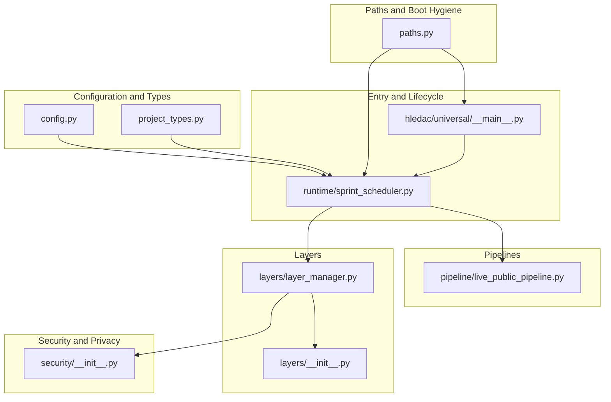
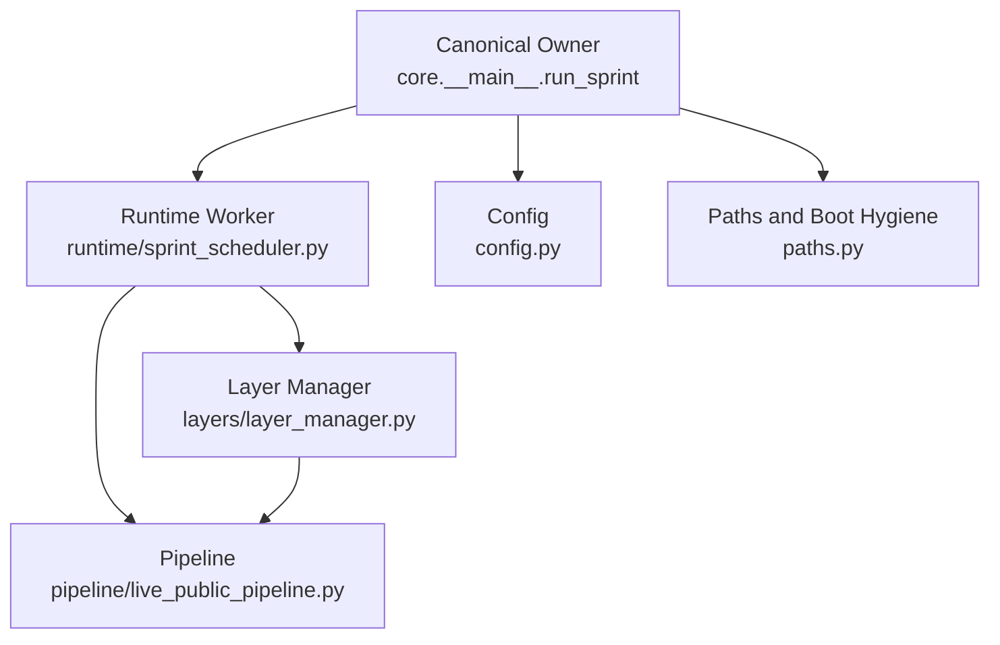
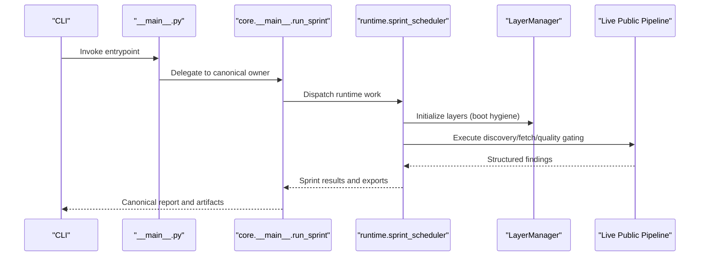
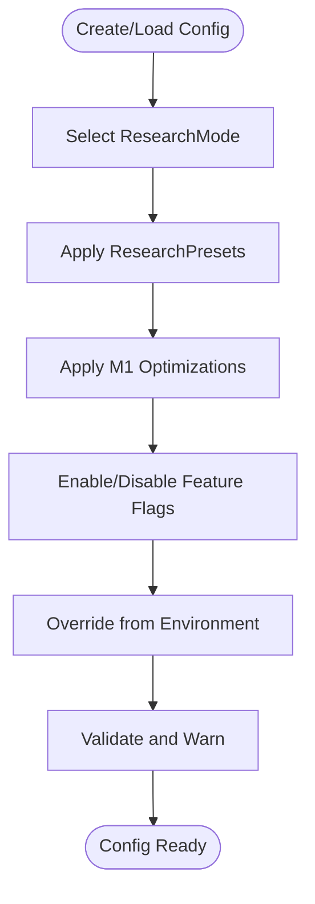
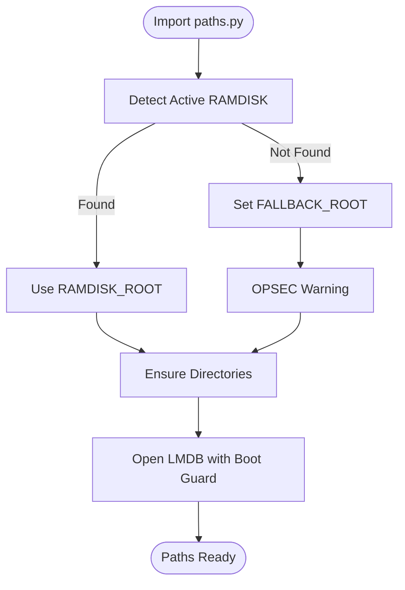
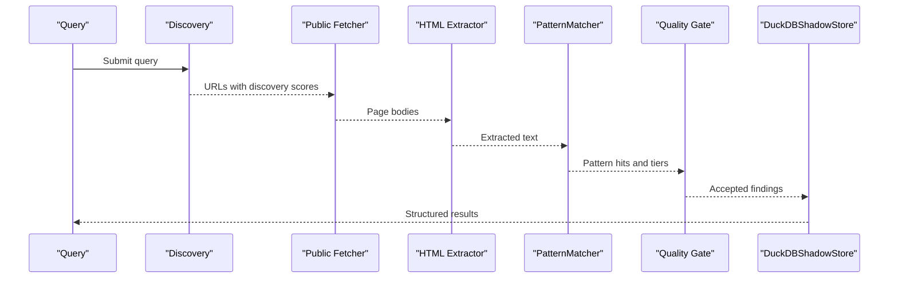
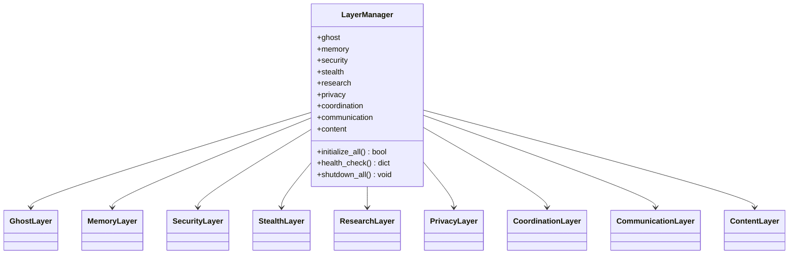
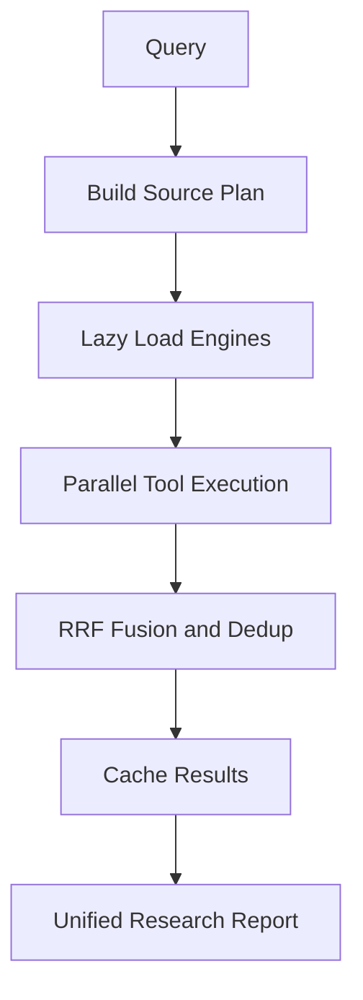
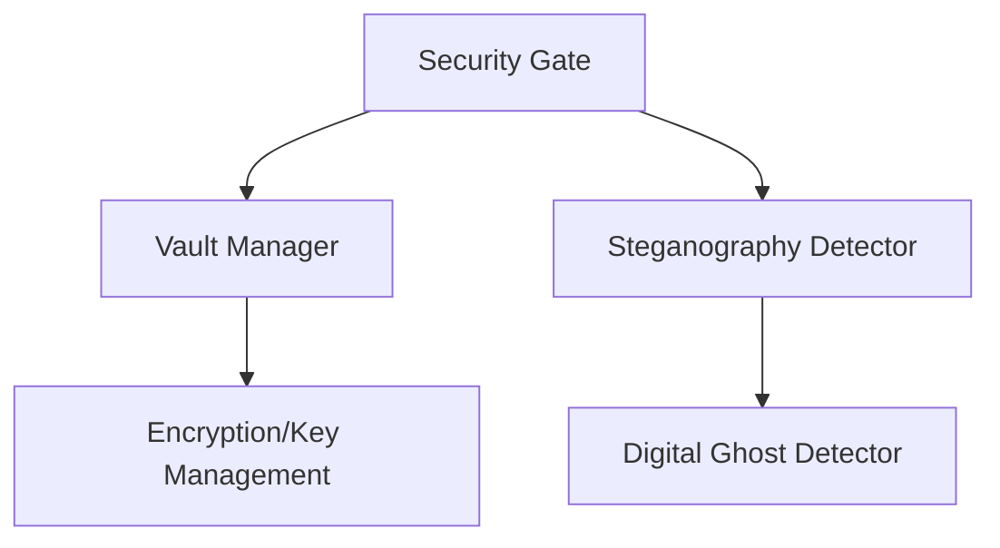
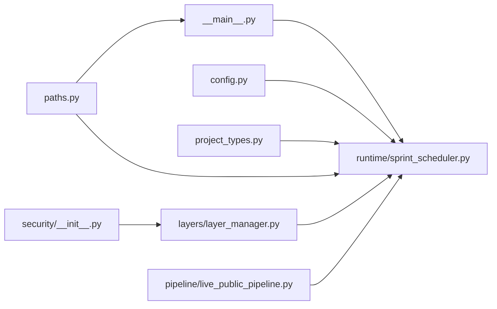

# Project Overview

<cite>
**Referenced Files in This Document**
- [__main__.py](file://hledac/universal/__main__.py)
- [autonomous_orchestrator.py](file://hledac/universal/autonomous_orchestrator.py)
- [config.py](file://hledac/universal/config.py)
- [project_types.py](file://hledac/universal/project_types.py)
- [paths.py](file://hledac/universal/paths.py)
- [layers/__init__.py](file://hledac/universal/layers/__init__.py)
- [layers/layer_manager.py](file://hledac/universal/layers/layer_manager.py)
- [pipeline/live_public_pipeline.py](file://hledac/universal/pipeline/live_public_pipeline.py)
- [enhanced_research.py](file://hledac/universal/enhanced_research.py)
- [runtime/sprint_scheduler.py](file://hledac/universal/runtime/sprint_scheduler.py)
- [security/__init__.py](file://hledac/universal/security/__init__.py)
</cite>

## Table of Contents
1. [Introduction](#introduction)
2. [Project Structure](#project-structure)
3. [Core Components](#core-components)
4. [Architecture Overview](#architecture-overview)
5. [Detailed Component Analysis](#detailed-component-analysis)
6. [Dependency Analysis](#dependency-analysis)
7. [Performance Considerations](#performance-considerations)
8. [Troubleshooting Guide](#troubleshooting-guide)
9. [Conclusion](#conclusion)

## Introduction
Hledac Universal is an autonomous OSINT research framework designed to operate reliably across diverse hardware constraints—particularly optimized for M1 8GB systems—while maintaining strong privacy, stealth, and security guarantees. It provides a modular, layered runtime that coordinates discovery, fetching, analysis, and synthesis across heterogeneous sources and modalities. The platform emphasizes boot hygiene, resource governance, and canonical ownership separation: the entrypoint and lifecycle are strictly defined, and all production “truth” (reports, boundaries, exports) originates from the canonical owner path.

At a high level, Hledac Universal:
- Defines a canonical entrypoint and lifecycle owner
- Exposes a unified configuration model with presets for research modes and M1-optimized defaults
- Implements modular layers (Ghost, Memory, Coordination, Security, Stealth, Privacy, Research, Communication, Content)
- Executes pipelines that discover, fetch, and convert content into structured findings
- Integrates advanced capabilities such as quantum pathfinding, MoE synthesis, and federated OSINT where enabled
- Enforces privacy and security gates, with optional stealth and evasion features

## Project Structure
The repository organizes functionality into cohesive packages:
- Entry and lifecycle: __main__.py, runtime/sprint_scheduler.py
- Configuration and types: config.py, project_types.py
- Paths and boot hygiene: paths.py
- Pipelines: pipeline/live_public_pipeline.py
- Layers and orchestration: layers/*, layers/layer_manager.py
- Enhanced research and provider candidates: enhanced_research.py
- Security and privacy: security/*

**Diagram sources**
- [__main__.py:1-200](file://hledac/universal/__main__.py#L1-L200)
- [runtime/sprint_scheduler.py:1-200](file://hledac/universal/runtime/sprint_scheduler.py#L1-L200)
- [config.py:1-200](file://hledac/universal/config.py#L1-L200)
- [project_types.py:1-200](file://hledac/universal/project_types.py#L1-L200)
- [paths.py:1-200](file://hledac/universal/paths.py#L1-L200)
- [layers/__init__.py:1-173](file://hledac/universal/layers/__init__.py#L1-L173)
- [layers/layer_manager.py:1-200](file://hledac/universal/layers/layer_manager.py#L1-L200)
- [pipeline/live_public_pipeline.py:1-200](file://hledac/universal/pipeline/live_public_pipeline.py#L1-L200)
- [security/__init__.py:1-106](file://hledac/universal/security/__init__.py#L1-L106)

**Section sources**
- [__main__.py:1-200](file://hledac/universal/__main__.py#L1-L200)
- [runtime/sprint_scheduler.py:1-200](file://hledac/universal/runtime/sprint_scheduler.py#L1-L200)
- [config.py:1-200](file://hledac/universal/config.py#L1-L200)
- [project_types.py:1-200](file://hledac/universal/project_types.py#L1-L200)
- [paths.py:1-200](file://hledac/universal/paths.py#L1-L200)
- [layers/__init__.py:1-173](file://hledac/universal/layers/__init__.py#L1-L173)
- [layers/layer_manager.py:1-200](file://hledac/universal/layers/layer_manager.py#L1-L200)
- [pipeline/live_public_pipeline.py:1-200](file://hledac/universal/pipeline/live_public_pipeline.py#L1-L200)
- [security/__init__.py:1-106](file://hledac/universal/security/__init__.py#L1-L106)

## Core Components
- Canonical entrypoint and lifecycle owner: The root entrypoint delegates to a canonical owner that orchestrates the full sprint lifecycle, ensuring all production truths originate from this path. The entrypoint also enforces boot hygiene, signal-safe teardown, and role labeling to avoid ambiguity.
- Configuration and presets: Centralized configuration supports research modes (Quick, Standard, Deep, Extreme, Autonomous), M1-optimized defaults, and granular feature flags for layers and advanced features (e.g., MoE, quantum pathfinding, federated OSINT).
- Paths and boot hygiene: A single-source-of-truth for runtime paths, with LMDB boot guard, stale lock/socket cleanup, and deterministic fallbacks for OPSEC-safe operation.
- Pipelines: The live public pipeline demonstrates a canonical, no-LLM-first approach that discovers, fetches, extracts, matches patterns, gates quality, and stores findings in a DuckDB-backed shadow store.
- Layers: Modular runtime layers (Ghost, Memory, Coordination, Security, Stealth, Privacy, Research, Communication, Content) with a centralized LayerManager for initialization, health, and lifecycle.
- Enhanced research: A provider-candidate seam for deep research, with lazy loading and M1-friendly constraints, awaiting integration into the broader triad and transport planes.
- Security and privacy: Integrated PII gating, vault management, optional encryption/key management, and steganography detection aligned with deep research.

**Section sources**
- [__main__.py:70-183](file://hledac/universal/__main__.py#L70-L183)
- [config.py:36-117](file://hledac/universal/config.py#L36-L117)
- [paths.py:1-200](file://hledac/universal/paths.py#L1-L200)
- [pipeline/live_public_pipeline.py:1-200](file://hledac/universal/pipeline/live_public_pipeline.py#L1-L200)
- [layers/layer_manager.py:336-350](file://hledac/universal/layers/layer_manager.py#L336-L350)
- [enhanced_research.py:1-120](file://hledac/universal/enhanced_research.py#L1-L120)
- [security/__init__.py:1-106](file://hledac/universal/security/__init__.py#L1-L106)

## Architecture Overview
Hledac Universal separates concerns across roles and layers:
- Canonical owner: core.__main__.run_sprint is the sole production sprint owner; all report truth, timing truth, and export truth flow from here.
- Runtime worker: runtime/sprint_scheduler executes work dispatched by the canonical owner; it respects lifecycle phases and performs bounded concurrency with task groups.
- Layer orchestration: layers/layer_manager initializes and coordinates layers in a defined order, optimizing for M1 constraints.
- Pipelines: pipelines transform raw signals into structured findings, gated by quality and privacy policies.
- Security and privacy: integrated gates and vaults protect sensitive data and enforce privacy policies.

**Diagram sources**
- [__main__.py:70-183](file://hledac/universal/__main__.py#L70-L183)
- [runtime/sprint_scheduler.py:1-200](file://hledac/universal/runtime/sprint_scheduler.py#L1-L200)
- [layers/layer_manager.py:336-350](file://hledac/universal/layers/layer_manager.py#L336-L350)
- [pipeline/live_public_pipeline.py:1-200](file://hledac/universal/pipeline/live_public_pipeline.py#L1-L200)
- [config.py:228-328](file://hledac/universal/config.py#L228-L328)
- [paths.py:1-200](file://hledac/universal/paths.py#L1-L200)

## Detailed Component Analysis

### Entry and Lifecycle Ownership
- Role taxonomy and authority: The entrypoint defines canonical, shell, alternate, residual, and diagnostic roles. The canonical owner is the only production truth source; alternate and residual paths are explicitly labeled to avoid confusion.
- Boot hygiene and teardown: LMDB boot guard, signal-safe teardown, AsyncExitStack-based cleanup, and orphan task cancellation ensure robust startup and shutdown.
- Public passive run: An alternate, non-canonical path demonstrates a bounded, observed-run probe for benchmarking and diagnostics.

**Diagram sources**
- [__main__.py:70-183](file://hledac/universal/__main__.py#L70-L183)
- [runtime/sprint_scheduler.py:1-200](file://hledac/universal/runtime/sprint_scheduler.py#L1-L200)
- [layers/layer_manager.py:336-350](file://hledac/universal/layers/layer_manager.py#L336-L350)
- [pipeline/live_public_pipeline.py:1-200](file://hledac/universal/pipeline/live_public_pipeline.py#L1-L200)

**Section sources**
- [__main__.py:70-183](file://hledac/universal/__main__.py#L70-L183)
- [__main__.py:541-678](file://hledac/universal/__main__.py#L541-L678)

### Configuration and Presets
- Research modes: Quick, Standard, Deep, Extreme, Autonomous with tunable budgets, concurrency, and feature flags.
- M1 optimizations: Memory limits, thermal thresholds, reduced model stacks, and conservative agent counts.
- Extended features: MoE, neuromorphic SNN, quantum pathfinding, federated OSINT, and deep research modules.
- Environment-driven configuration: Support for HLEDAC_RESEARCH_MODE, HLEDAC_MEMORY_LIMIT_MB, HLEDAC_MAX_STEPS, HLEDAC_LOG_LEVEL, and HLEDAC_M1_OPTIMIZED.

**Diagram sources**
- [config.py:394-498](file://hledac/universal/config.py#L394-L498)
- [config.py:466-498](file://hledac/universal/config.py#L466-L498)

**Section sources**
- [config.py:36-117](file://hledac/universal/config.py#L36-L117)
- [config.py:228-328](file://hledac/universal/config.py#L228-L328)
- [config.py:466-498](file://hledac/universal/config.py#L466-L498)

### Paths and Boot Hygiene
- Single-source-of-truth paths: RAMDISK_ROOT, FALLBACK_ROOT, DB_ROOT, LMDB_ROOT, SPRINT_LMDB_ROOT, EVIDENCE_ROOT, KEYS_ROOT, TOR_ROOT, NYM_ROOT, I2P_ROOT, RUNS_ROOT, SOCKETS_ROOT, SPRINT_STORE_ROOT.
- Boot guard and lock recovery: LMDB map-size propagation, stale lock cleanup, and socket orphan detection.
- OPSEC-safe fallback: Deterministic fallback directory and cleanup on shutdown.

**Diagram sources**
- [paths.py:111-141](file://hledac/universal/paths.py#L111-L141)
- [paths.py:202-251](file://hledac/universal/paths.py#L202-L251)
- [paths.py:382-429](file://hledac/universal/paths.py#L382-L429)

**Section sources**
- [paths.py:1-200](file://hledac/universal/paths.py#L1-L200)
- [paths.py:202-251](file://hledac/universal/paths.py#L202-L251)
- [paths.py:382-429](file://hledac/universal/paths.py#L382-L429)

### Pipelines: Live Public OSINT
- Discovery and fetch: DuckDuckGo adapter, public fetcher, lightweight HTML extraction.
- Pattern matching and quality gating: PatternMatcher, quality tiers, pre-fetch text-length and entropy gates.
- Storage: DuckDBShadowStore for canonical findings and reports.
- Policy-driven fetching: JS/DoH/stealth toggles based on discovery score and URL class.

**Diagram sources**
- [pipeline/live_public_pipeline.py:1-200](file://hledac/universal/pipeline/live_public_pipeline.py#L1-L200)

**Section sources**
- [pipeline/live_public_pipeline.py:1-200](file://hledac/universal/pipeline/live_public_pipeline.py#L1-L200)

### Layers and Layer Manager
- Layer taxonomy: Ghost, Memory, Coordination, Security, Stealth, Privacy, Research, Communication, Content.
- Initialization order (M1-optimized): Ghost → Memory → Security → Coordination → Stealth → Research → Privacy → Communication → Content.
- Unified capabilities manager and temporal signal runtime support.

**Diagram sources**
- [layers/layer_manager.py:336-350](file://hledac/universal/layers/layer_manager.py#L336-L350)
- [layers/__init__.py:1-173](file://hledac/universal/layers/__init__.py#L1-L173)

**Section sources**
- [layers/layer_manager.py:336-350](file://hledac/universal/layers/layer_manager.py#L336-L350)
- [layers/__init__.py:1-173](file://hledac/universal/layers/__init__.py#L1-L173)

### Enhanced Research Provider Candidate
- UnifiedResearchEngine: A provider-candidate seam for deep research with lazy loading, bounded concurrency, and chunked processing.
- Source families: Web, Academic, Archive, Security, Temporal, OSINT, Local Corpus (consumer seam).
- M1-optimized configuration and result fusion (RRF), deduplication, and caching.

**Diagram sources**
- [enhanced_research.py:114-200](file://hledac/universal/enhanced_research.py#L114-L200)

**Section sources**
- [enhanced_research.py:1-200](file://hledac/universal/enhanced_research.py#L1-L200)

### Security and Privacy Integration
- PII gate: SecurityGate, PIICategory, PIIMatch, SanitizationResult.
- Vault management: LootManager, VaultManager (alias), RamDiskVault.
- Encryption and key management: AES-GCM encrypt/decrypt, KeyManager.
- Steganography detection: StegoDetector, StatisticalStegoDetector, Ghost signal recovery.

**Diagram sources**
- [security/__init__.py:1-106](file://hledac/universal/security/__init__.py#L1-L106)

**Section sources**
- [security/__init__.py:1-106](file://hledac/universal/security/__init__.py#L1-L106)

### Conceptual Overview
Beginner-friendly highlights:
- What it is: A framework that autonomously discovers, fetches, and synthesizes OSINT findings with strong privacy and security controls.
- How it works: Canonical owner orchestrates runtime workers and layers; pipelines transform raw signals into structured findings; configuration presets tune behavior for different devices and use cases.
- Why it matters: Boot hygiene, resource governance, and canonical ownership ensure reliable, auditable, and reproducible research.

Developer-focused details:
- Entry and lifecycle: Canonical owner, role labeling, boot guard, signal-safe teardown.
- Configuration: Research modes, M1 optimizations, environment overrides, validation.
- Paths: Single-source-of-truth, LMDB boot guard, stale lock/socket cleanup.
- Pipelines: Discovery, fetch, extraction, pattern matching, quality gating, storage.
- Layers: Modular initialization order, unified capabilities, temporal signal runtime.
- Security: PII gating, vaults, encryption, steganography detection.

[No sources needed since this section doesn't analyze specific files]

## Dependency Analysis
Key relationships:
- Entry and lifecycle: __main__.py delegates to canonical owner; runtime/sprint_scheduler executes work.
- Configuration: config.py supplies presets and environment-driven tuning; project_types.py defines enums/dataclasses used across modules.
- Paths: paths.py centralizes runtime paths and boot hygiene; consumed by entrypoint and scheduler.
- Pipelines: pipeline/live_public_pipeline.py depends on discovery adapters, fetchers, and storage.
- Layers: layers/layer_manager.py orchestrates layer initialization and lifecycle.
- Security: security/__init__.py exposes PII gate, vaults, encryption, and detectors.

**Diagram sources**
- [__main__.py:70-183](file://hledac/universal/__main__.py#L70-L183)
- [runtime/sprint_scheduler.py:1-200](file://hledac/universal/runtime/sprint_scheduler.py#L1-L200)
- [config.py:228-328](file://hledac/universal/config.py#L228-L328)
- [project_types.py:1-200](file://hledac/universal/project_types.py#L1-L200)
- [paths.py:1-200](file://hledac/universal/paths.py#L1-L200)
- [layers/layer_manager.py:336-350](file://hledac/universal/layers/layer_manager.py#L336-L350)
- [pipeline/live_public_pipeline.py:1-200](file://hledac/universal/pipeline/live_public_pipeline.py#L1-L200)
- [security/__init__.py:1-106](file://hledac/universal/security/__init__.py#L1-L106)

**Section sources**
- [__main__.py:70-183](file://hledac/universal/__main__.py#L70-L183)
- [runtime/sprint_scheduler.py:1-200](file://hledac/universal/runtime/sprint_scheduler.py#L1-L200)
- [config.py:228-328](file://hledac/universal/config.py#L228-L328)
- [project_types.py:1-200](file://hledac/universal/project_types.py#L1-L200)
- [paths.py:1-200](file://hledac/universal/paths.py#L1-L200)
- [layers/layer_manager.py:336-350](file://hledac/universal/layers/layer_manager.py#L336-L350)
- [pipeline/live_public_pipeline.py:1-200](file://hledac/universal/pipeline/live_public_pipeline.py#L1-L200)
- [security/__init__.py:1-106](file://hledac/universal/security/__init__.py#L1-L106)

## Performance Considerations
- M1-optimized defaults: Memory limits, thermal thresholds, reduced model stacks, and conservative concurrency reduce memory pressure on constrained hardware.
- Lazy loading and chunked processing: Enhanced research and pipelines minimize upfront resource usage.
- Bounded concurrency and quality gates: Pre-fetch text-length and entropy gates reduce wasted I/O.
- Boot hygiene and resource governance: LMDB boot guard, stale lock/socket cleanup, and signal-safe teardown improve reliability and reduce overhead.

[No sources needed since this section provides general guidance]

## Troubleshooting Guide
Common issues and remedies:
- Boot guard failures: Investigate stale LMDB locks and sockets; paths.py provides cleanup helpers and LMDB open with retry.
- RAMDISK availability: Ensure active RAMDISK or set GHOST_RAMDISK; assert_ramdisk_alive validates availability.
- Signal teardown: Confirm signal handlers are installed and loop stops cleanly; AsyncExitStack ensures LIFO cleanup.
- Configuration validation: Use config.validate() to catch invalid or unsafe settings (e.g., memory limits, concurrency).
- Layer initialization: Review LayerManager initialization order and health checks for misconfiguration.

**Section sources**
- [paths.py:202-251](file://hledac/universal/paths.py#L202-L251)
- [paths.py:382-429](file://hledac/universal/paths.py#L382-L429)
- [__main__.py:315-344](file://hledac/universal/__main__.py#L315-L344)
- [config.py:570-605](file://hledac/universal/config.py#L570-L605)
- [layers/layer_manager.py:336-350](file://hledac/universal/layers/layer_manager.py#L336-L350)

## Conclusion
Hledac Universal provides a principled, modular, and canonical OSINT research framework. Its design emphasizes reliable boot hygiene, strict ownership separation, M1-optimized configuration, and layered runtime orchestration. The live public pipeline demonstrates a canonical, no-LLM-first approach to discovery and synthesis, while advanced features like quantum pathfinding, MoE, and federated OSINT remain configurable and gated. Security and privacy are integrated from the ground up, with PII gating, vaults, encryption, and steganography detection. Together, these elements enable both beginner-friendly exploration and developer-driven customization across diverse deployment scenarios.

[No sources needed since this section summarizes without analyzing specific files]