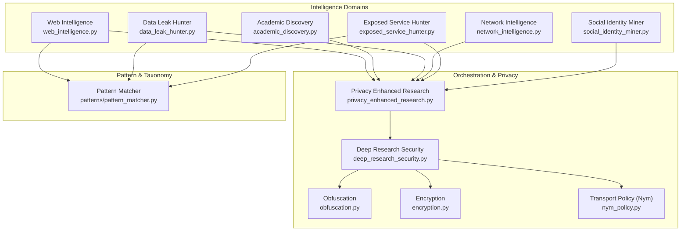
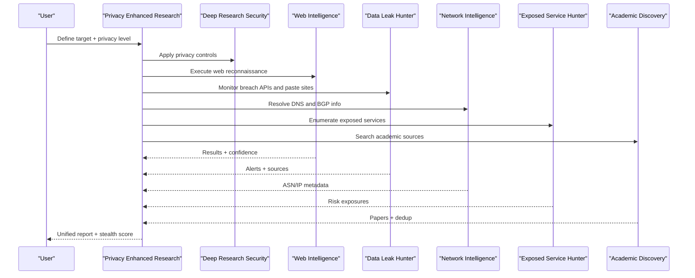
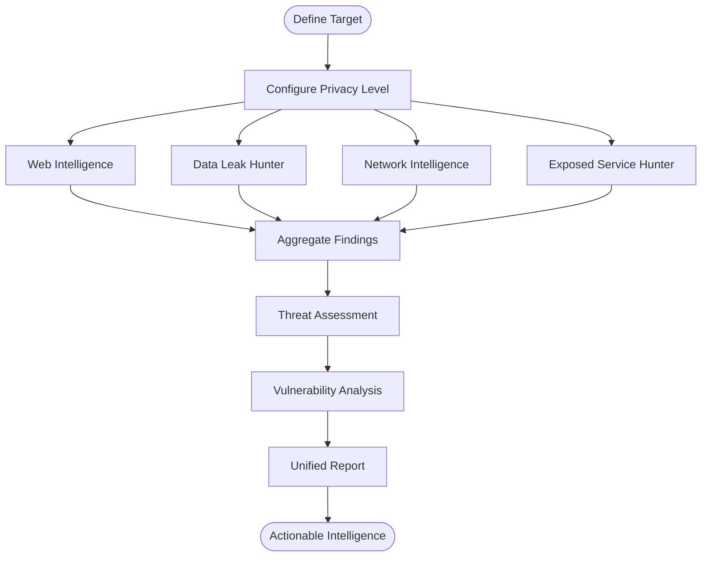
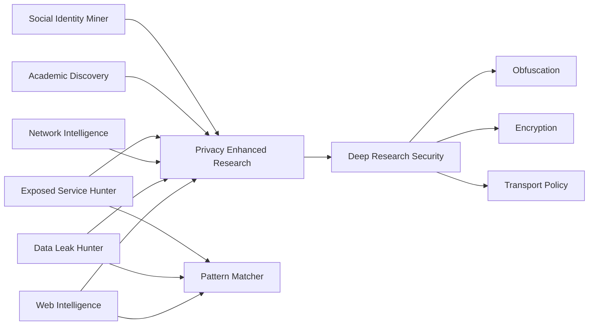

# Target Audience and Use Cases

<cite>
**Referenced Files in This Document**
- [web_intelligence.py](file://intelligence/web_intelligence.py)
- [enhanced_research.py](file://enhanced_research.py)
- [academic_discovery.py](file://intelligence/academic_discovery.py)
- [data_leak_hunter.py](file://intelligence/data_leak_hunter.py)
- [network_intelligence.py](file://intelligence/network_intelligence.py)
- [exposed_service_hunter.py](file://intelligence/exposed_service_hunter.py)
- [social_identity_miner.py](file://intelligence/social_identity_miner.py)
- [deep_research_security.py](file://security/deep_research_security.py)
- [privacy_enhanced_research.py](file://coordinators/privacy_enhanced_research.py)
- [obfuscation.py](file://security/obfuscation.py)
- [encryption.py](file://security/encryption.py)
- [nym_policy.py](file://policy/nym_policy.py)
- [patterns/pattern_matcher.py](file://patterns/pattern_matcher.py)
- [README.md](file://README.md)
- [ONBOARDING.md](file://ONBOARDING.md)
</cite>

## Table of Contents
1. [Introduction](#introduction)
2. [Project Structure](#project-structure)
3. [Core Components](#core-components)
4. [Architecture Overview](#architecture-overview)
5. [Detailed Component Analysis](#detailed-component-analysis)
6. [Dependency Analysis](#dependency-analysis)
7. [Performance Considerations](#performance-considerations)
8. [Troubleshooting Guide](#troubleshooting-guide)
9. [Conclusion](#conclusion)
10. [Appendices](#appendices)

## Introduction
This document defines Hledac Universal’s target audiences and the use cases it enables across cybersecurity, intelligence, and academic domains. It explains how the platform addresses time constraints, resource limitations, and operational security requirements for:
- Cybersecurity researchers
- Threat intelligence analysts
- Academic investigators
- Corporate intelligence professionals
- Privacy researchers

It also outlines concrete use cases such as automated threat hunting, vulnerability research, supply chain analysis, competitive intelligence gathering, academic research projects, and incident response investigations, and demonstrates how platform capabilities map to these scenarios.

## Project Structure
Hledac Universal organizes capabilities around modular intelligence domains and orchestration layers:
- Intelligence domains: Web, Academic, Data Leaks, Network, Exposed Services, Social Identity
- Orchestration and privacy: Research privacy, transport selection, obfuscation, encryption
- Pattern and taxonomy: Attack technique and actor lexicons for contextual analysis

**Diagram sources**
- [web_intelligence.py](file://intelligence/web_intelligence.py)
- [academic_discovery.py](file://intelligence/academic_discovery.py)
- [data_leak_hunter.py](file://intelligence/data_leak_hunter.py)
- [network_intelligence.py](file://intelligence/network_intelligence.py)
- [exposed_service_hunter.py](file://intelligence/exposed_service_hunter.py)
- [social_identity_miner.py](file://intelligence/social_identity_miner.py)
- [privacy_enhanced_research.py](file://coordinators/privacy_enhanced_research.py)
- [deep_research_security.py](file://security/deep_research_security.py)
- [obfuscation.py](file://security/obfuscation.py)
- [encryption.py](file://security/encryption.py)
- [nym_policy.py](file://policy/nym_policy.py)
- [patterns/pattern_matcher.py](file://patterns/pattern_matcher.py)

**Section sources**
- [README.md](file://README.md)
- [ONBOARDING.md](file://ONBOARDING.md)

## Core Components
- Web Intelligence: Unified target configuration, result aggregation, threat assessment, and vulnerability analysis.
- Academic Discovery: Multi-source academic search with rate-limited concurrency and structured output.
- Data Leak Hunter: Breach API monitoring, paste site surveillance, and alerting with temporal anonymization.
- Network Intelligence: BGP and DNS-over-HTTPS lookups with fallbacks and graph integration.
- Exposed Service Hunter: Enumeration of S3 buckets, database ports, GraphQL endpoints, and certificate transparency queries.
- Social Identity Miner: Deterministic extraction of social profiles and linked domains/emails from findings.
- Privacy and Security: Privacy levels, request anonymization, obfuscation, encryption, and transport selection.

**Section sources**
- [web_intelligence.py](file://intelligence/web_intelligence.py)
- [academic_discovery.py](file://intelligence/academic_discovery.py)
- [data_leak_hunter.py](file://intelligence/data_leak_hunter.py)
- [network_intelligence.py](file://intelligence/network_intelligence.py)
- [exposed_service_hunter.py](file://intelligence/exposed_service_hunter.py)
- [social_identity_miner.py](file://intelligence/social_identity_miner.py)
- [privacy_enhanced_research.py](file://coordinators/privacy_enhanced_research.py)
- [deep_research_security.py](file://security/deep_research_security.py)
- [obfuscation.py](file://security/obfuscation.py)
- [encryption.py](file://security/encryption.py)
- [nym_policy.py](file://policy/nym_policy.py)

## Architecture Overview
The platform composes domain-specific intelligence modules behind a privacy-aware orchestration layer. Inputs are transformed into standardized research configurations, executed with privacy controls, and aggregated into unified results with confidence and stealth metrics.

**Diagram sources**
- [privacy_enhanced_research.py](file://coordinators/privacy_enhanced_research.py)
- [deep_research_security.py](file://security/deep_research_security.py)
- [web_intelligence.py](file://intelligence/web_intelligence.py)
- [data_leak_hunter.py](file://intelligence/data_leak_hunter.py)
- [network_intelligence.py](file://intelligence/network_intelligence.py)
- [exposed_service_hunter.py](file://intelligence/exposed_service_hunter.py)
- [academic_discovery.py](file://intelligence/academic_discovery.py)

## Detailed Component Analysis

### Target Audiences and Use Cases

#### Cybersecurity Researchers
- Challenges: Time to triage, noisy signals, stealth requirements.
- Platform capabilities:
  - Web Intelligence for OSINT and threat assessment.
  - Data Leak Hunter for breach monitoring and alerts.
  - Exposed Service Hunter for enumeration of S3, databases, GraphQL, and certificates.
  - Network Intelligence for BGP and DNS metadata.
  - Obfuscation and encryption for operational security.
- Typical use cases:
  - Automated threat hunting: combine leak alerts with exposed service findings and web reconnaissance.
  - Vulnerability research: enumerate exposed services and correlate with academic and web sources.
  - Supply chain analysis: track domains, certs, and exposed assets across vendors.
- Outcomes: reduced manual effort, higher signal-to-noise ratio, and hardened operations.

**Section sources**
- [web_intelligence.py](file://intelligence/web_intelligence.py)
- [data_leak_hunter.py](file://intelligence/data_leak_hunter.py)
- [exposed_service_hunter.py](file://intelligence/exposed_service_hunter.py)
- [network_intelligence.py](file://intelligence/network_intelligence.py)
- [obfuscation.py](file://security/obfuscation.py)
- [encryption.py](file://security/encryption.py)

#### Threat Intelligence Analysts
- Challenges: aggregating multi-source signals, assessing risk, maintaining stealth.
- Platform capabilities:
  - Unified IntelligenceResult with confidence and stealth scores.
  - Pattern matcher for attack techniques and threat actors.
  - Privacy controls and transport selection for sensitive operations.
- Typical use cases:
  - Competitive intelligence gathering: combine academic insights, web data, and leak monitoring.
  - Incident response investigations: rapid correlation of exposed services, certs, and breach data.
- Outcomes: faster correlation, standardized risk scoring, and auditable operations.

**Section sources**
- [web_intelligence.py](file://intelligence/web_intelligence.py)
- [patterns/pattern_matcher.py](file://patterns/pattern_matcher.py)
- [privacy_enhanced_research.py](file://coordinators/privacy_enhanced_research.py)
- [nym_policy.py](file://policy/nym_policy.py)

#### Academic Investigators
- Challenges: accessing heterogeneous academic sources, managing rate limits, reproducibility.
- Platform capabilities:
  - Academic Discovery for ArXiv, Crossref, Semantic Scholar with concurrency and deduplication.
  - Structured output and rate limiting to balance speed and ethics.
- Typical use cases:
  - Literature reviews: multi-source search with deduplication.
  - Research project support: gather background materials and recent publications.
- Outcomes: efficient discovery, consistent results, and responsible scraping.

**Section sources**
- [academic_discovery.py](file://intelligence/academic_discovery.py)

#### Corporate Intelligence Professionals
- Challenges: protecting source attribution, minimizing footprint, and correlating public signals.
- Platform capabilities:
  - Social Identity Miner for surface-level identity extraction.
  - Privacy Enhanced Research and Deep Research Security for anonymization and sanitization.
  - Transport policy for plausible deniability.
- Typical use cases:
  - Competitive intelligence: map identities, domains, and leak events.
  - Vendor risk: enumerate exposed services and certificates.
- Outcomes: actionable insights with reduced operational risk.

**Section sources**
- [social_identity_miner.py](file://intelligence/social_identity_miner.py)
- [privacy_enhanced_research.py](file://coordinators/privacy_enhanced_research.py)
- [deep_research_security.py](file://security/deep_research_security.py)
- [nym_policy.py](file://policy/nym_policy.py)

#### Privacy Researchers
- Challenges: measuring and mitigating privacy leakage, evaluating anonymization.
- Platform capabilities:
  - Privacy levels and retention policies.
  - Obfuscation (query masking, chaff traffic, timing jitter).
  - Encryption for data-in-transit.
- Typical use cases:
  - Evaluating research footprints across different privacy levels.
  - Benchmarking anonymization effectiveness in real-world queries.
- Outcomes: quantifiable privacy posture and actionable hardening guidance.

**Section sources**
- [privacy_enhanced_research.py](file://coordinators/privacy_enhanced_research.py)
- [obfuscation.py](file://security/obfuscation.py)
- [encryption.py](file://security/encryption.py)

### Use Case Mapping and Workflows

#### Automated Threat Hunting
- Inputs: Targets (domains, identities), privacy level.
- Steps:
  - Web Intelligence: collect web and OSINT data.
  - Data Leak Hunter: monitor breach APIs and paste sites.
  - Exposed Service Hunter: enumerate S3, databases, GraphQL, certs.
  - Network Intelligence: enrich with ASN/IP metadata.
  - Threat assessment and vulnerability analysis.
- Outputs: Unified report with confidence and stealth metrics.

**Diagram sources**
- [web_intelligence.py](file://intelligence/web_intelligence.py)
- [data_leak_hunter.py](file://intelligence/data_leak_hunter.py)
- [network_intelligence.py](file://intelligence/network_intelligence.py)
- [exposed_service_hunter.py](file://intelligence/exposed_service_hunter.py)

#### Vulnerability Research
- Inputs: Target domains or organizations.
- Steps:
  - Exposed Service Hunter: enumerate S3, databases, GraphQL.
  - Network Intelligence: BGP and DNS metadata.
  - Academic Discovery: background research.
  - Web Intelligence: OSINT and threat assessment.
- Outputs: Risk exposure matrix and remediation guidance.

**Section sources**
- [exposed_service_hunter.py](file://intelligence/exposed_service_hunter.py)
- [network_intelligence.py](file://intelligence/network_intelligence.py)
- [academic_discovery.py](file://intelligence/academic_discovery.py)
- [web_intelligence.py](file://intelligence/web_intelligence.py)

#### Supply Chain Analysis
- Inputs: Vendor names, domains, certificates.
- Steps:
  - Certificate Transparency queries via exposed service hunter.
  - Domain enumeration and DNS metadata.
  - Leak monitoring for vendor-related breaches.
- Outputs: Supply chain exposure map and risk indicators.

**Section sources**
- [exposed_service_hunter.py](file://intelligence/exposed_service_hunter.py)
- [network_intelligence.py](file://intelligence/network_intelligence.py)
- [data_leak_hunter.py](file://intelligence/data_leak_hunter.py)

#### Competitive Intelligence Gathering
- Inputs: Competitor names, products, domains.
- Steps:
  - Social Identity Miner: extract profiles and linked domains.
  - Academic Discovery: background research.
  - Web Intelligence: OSINT and threat assessment.
  - Data Leak Hunter: monitor leaks and paste sites.
- Outputs: Identity and exposure landscape.

**Section sources**
- [social_identity_miner.py](file://intelligence/social_identity_miner.py)
- [academic_discovery.py](file://intelligence/academic_discovery.py)
- [web_intelligence.py](file://intelligence/web_intelligence.py)
- [data_leak_hunter.py](file://intelligence/data_leak_hunter.py)

#### Academic Research Projects
- Inputs: Research questions, keywords.
- Steps:
  - Academic Discovery: multi-source search with rate limiting.
  - Structured output for synthesis.
- Outputs: Bibliography and synthesis-ready datasets.

**Section sources**
- [academic_discovery.py](file://intelligence/academic_discovery.py)

#### Incident Response Investigations
- Inputs: Alarms, alerts, compromised assets.
- Steps:
  - Data Leak Hunter: confirm breach scope.
  - Exposed Service Hunter: locate misconfigurations.
  - Network Intelligence: map ASN/IP relationships.
  - Web Intelligence: assess threat actor presence.
- Outputs: Forensic timeline and remediation plan.

**Section sources**
- [data_leak_hunter.py](file://intelligence/data_leak_hunter.py)
- [exposed_service_hunter.py](file://intelligence/exposed_service_hunter.py)
- [network_intelligence.py](file://intelligence/network_intelligence.py)
- [web_intelligence.py](file://intelligence/web_intelligence.py)

## Dependency Analysis
Key dependencies and relationships:
- Intelligence modules depend on privacy orchestration for anonymization and sanitization.
- Security components (obfuscation, encryption, transport policy) are applied based on privacy level.
- Pattern matcher supports contextual tagging for attack techniques and threat actors.

**Diagram sources**
- [privacy_enhanced_research.py](file://coordinators/privacy_enhanced_research.py)
- [deep_research_security.py](file://security/deep_research_security.py)
- [obfuscation.py](file://security/obfuscation.py)
- [encryption.py](file://security/encryption.py)
- [nym_policy.py](file://policy/nym_policy.py)
- [web_intelligence.py](file://intelligence/web_intelligence.py)
- [data_leak_hunter.py](file://intelligence/data_leak_hunter.py)
- [network_intelligence.py](file://intelligence/network_intelligence.py)
- [exposed_service_hunter.py](file://intelligence/exposed_service_hunter.py)
- [academic_discovery.py](file://intelligence/academic_discovery.py)
- [social_identity_miner.py](file://intelligence/social_identity_miner.py)
- [patterns/pattern_matcher.py](file://patterns/pattern_matcher.py)

**Section sources**
- [privacy_enhanced_research.py](file://coordinators/privacy_enhanced_research.py)
- [deep_research_security.py](file://security/deep_research_security.py)
- [obfuscation.py](file://security/obfuscation.py)
- [encryption.py](file://security/encryption.py)
- [nym_policy.py](file://policy/nym_policy.py)
- [patterns/pattern_matcher.py](file://patterns/pattern_matcher.py)

## Performance Considerations
- Concurrency and rate limiting: Academic Discovery uses semaphores to balance throughput and provider constraints.
- Memory bounds: Network Intelligence caps BGP data usage; Social Identity Miner enforces upper limits on profiles and text sizes.
- Async I/O: Core modules rely on async HTTP and DNS resolution to minimize blocking.
- Resource governance: Privacy controls and transport selection introduce overhead; tune levels based on time budgets.

[No sources needed since this section provides general guidance]

## Troubleshooting Guide
- Initialization failures: Verify API keys for breach providers and DNS resolver availability.
- Rate limiting: Academic Discovery and leak hunters apply rate limits; reduce concurrency or increase intervals.
- Memory pressure: Social Identity Miner and Network Intelligence include guards; reduce workload or adjust bounds.
- Operational security: Confirm privacy level settings and transport policy alignment with risk tolerance.

**Section sources**
- [academic_discovery.py](file://intelligence/academic_discovery.py)
- [data_leak_hunter.py](file://intelligence/data_leak_hunter.py)
- [social_identity_miner.py](file://intelligence/social_identity_miner.py)
- [network_intelligence.py](file://intelligence/network_intelligence.py)
- [privacy_enhanced_research.py](file://coordinators/privacy_enhanced_research.py)
- [deep_research_security.py](file://security/deep_research_security.py)

## Conclusion
Hledac Universal delivers a privacy-aware, modular intelligence platform tailored to diverse audiences. By combining domain-specific capabilities—web reconnaissance, leak monitoring, network metadata, exposed service enumeration, academic discovery, and identity surfacing—with robust privacy controls, the platform accelerates time-sensitive investigations while preserving operational security and reducing resource overhead.

[No sources needed since this section summarizes without analyzing specific files]

## Appendices

### Appendix A: Privacy Levels and Controls
- Privacy levels drive security features such as quantum-safe settings, steganography, obfuscation, chaff generation, and audit logging.
- Transport policy selects plausible deniability routes based on risk and time budgets.

**Section sources**
- [deep_research_security.py](file://security/deep_research_security.py)
- [privacy_enhanced_research.py](file://coordinators/privacy_enhanced_research.py)
- [nym_policy.py](file://policy/nym_policy.py)