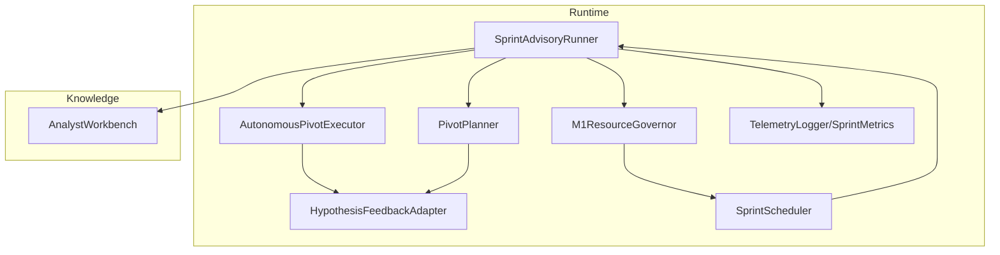
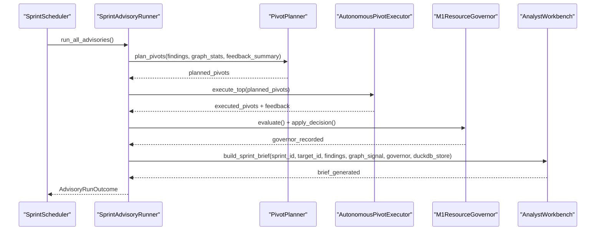
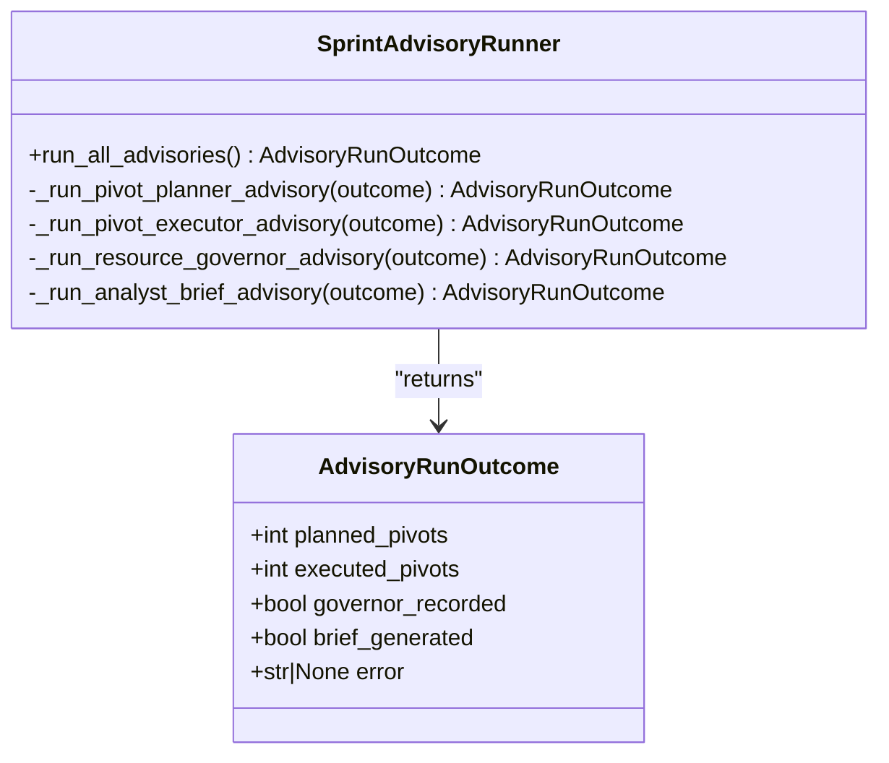
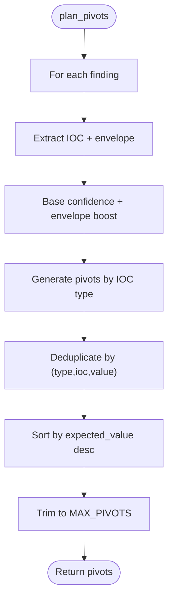
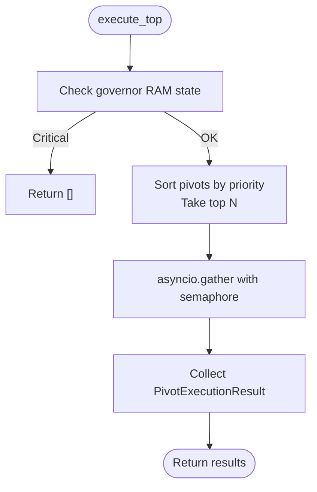
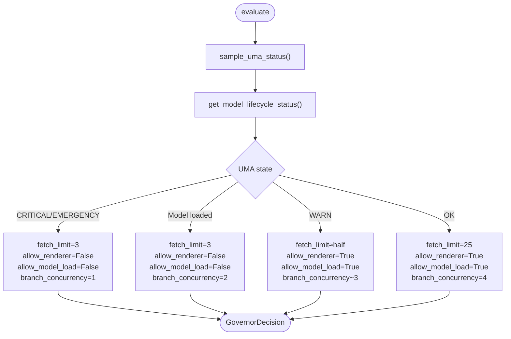
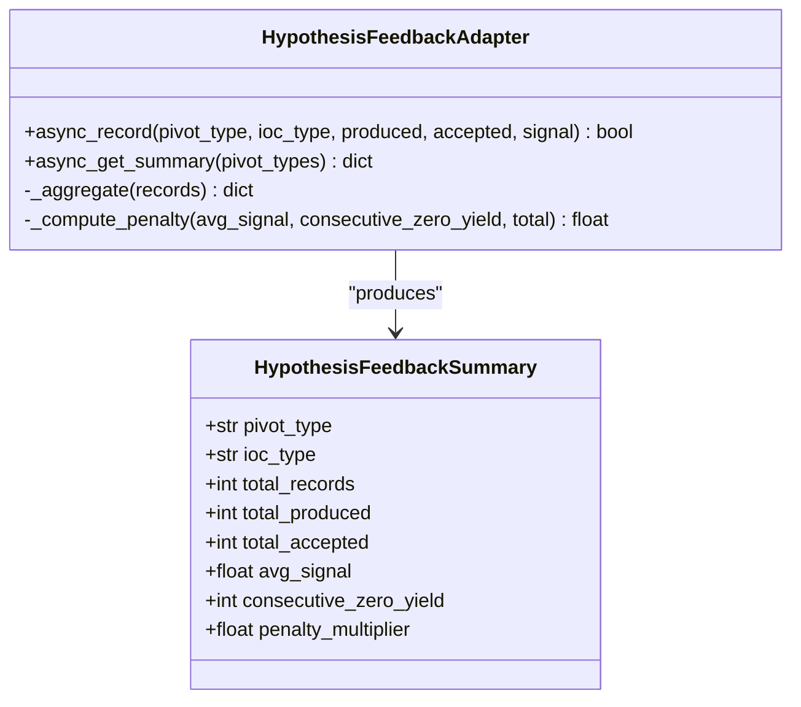
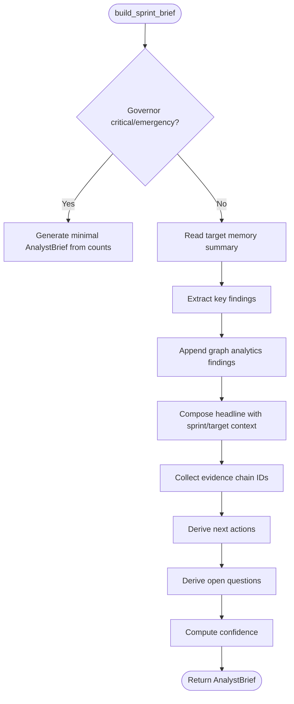
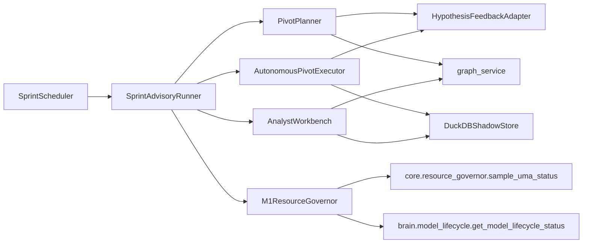

# Advisory Functions

<cite>
**Referenced Files in This Document**
- [sprint_advisory_runner.py](file://runtime/sprint_advisory_runner.py)
- [pivot_planner.py](file://runtime/pivot_planner.py)
- [pivot_executor.py](file://runtime/pivot_executor.py)
- [resource_governor.py](file://runtime/resource_governor.py)
- [hypothesis_feedback.py](file://runtime/hypothesis_feedback.py)
- [analyst_workbench.py](file://knowledge/analyst_workbench.py)
- [sprint_scheduler.py](file://runtime/sprint_scheduler.py)
- [telemetry.py](file://runtime/telemetry.py)
- [windup_engine.py](file://runtime/windup_engine.py)
</cite>

## Table of Contents
1. [Introduction](#introduction)
2. [Project Structure](#project-structure)
3. [Core Components](#core-components)
4. [Architecture Overview](#architecture-overview)
5. [Detailed Component Analysis](#detailed-component-analysis)
6. [Dependency Analysis](#dependency-analysis)
7. [Performance Considerations](#performance-considerations)
8. [Troubleshooting Guide](#troubleshooting-guide)
9. [Conclusion](#conclusion)

## Introduction
This document describes the Sprint Advisory Functions system, which provides strategic guidance during sprint execution through four advisory steps: pivot planning, pivot execution, resource governance, and analyst brief generation. The system is designed to be advisory-only, preserving sprint ownership while offering fail-soft, bounded, and observable recommendations. It integrates with the broader runtime via the SprintAdvisoryRunner orchestrator and the SprintScheduler teardown flow, and it feeds feedback loops to continuously improve pivot quality and operational efficiency.

## Project Structure
The advisory system spans runtime and knowledge modules:
- Runtime orchestrator and advisors: SprintAdvisoryRunner, PivotPlanner, PivotExecutor, M1ResourceGovernor, HypothesisFeedbackAdapter
- Knowledge analyst workbench: AnalystWorkbench for model-free brief generation
- Scheduler integration: SprintScheduler teardown invokes advisory runner
- Telemetry: SprintMetrics and TelemetryLogger for structured logging
- Windup engine: Historical context and alternate path for synthesis/anomaly detection

**Diagram sources**
- [sprint_advisory_runner.py:76-154](file://runtime/sprint_advisory_runner.py#L76-L154)
- [pivot_planner.py:330-440](file://runtime/pivot_planner.py#L330-L440)
- [pivot_executor.py:84-197](file://runtime/pivot_executor.py#L84-L197)
- [resource_governor.py:116-217](file://runtime/resource_governor.py#L116-L217)
- [hypothesis_feedback.py:109-181](file://runtime/hypothesis_feedback.py#L109-L181)
- [analyst_workbench.py:267-310](file://knowledge/analyst_workbench.py#L267-L310)
- [sprint_scheduler.py:3097-3186](file://runtime/sprint_scheduler.py#L3097-L3186)
- [telemetry.py:107-244](file://runtime/telemetry.py#L107-L244)

**Section sources**
- [sprint_advisory_runner.py:1-442](file://runtime/sprint_advisory_runner.py#L1-L442)
- [sprint_scheduler.py:3097-3186](file://runtime/sprint_scheduler.py#L3097-L3186)

## Core Components
- SprintAdvisoryRunner: Orchestrates the four advisory steps in order, capturing outcomes and ensuring fail-soft behavior.
- PivotPlanner: Generates bounded, hypothesis-driven pivots from accepted findings, incorporating graph signals and feedback penalties.
- AutonomousPivotExecutor: Executes top pivots with concurrency and timeout bounds, records outcomes via HypothesisFeedbackAdapter, and ingests findings via canonical store.
- M1ResourceGovernor: Advisory safety layer enforcing mission budget constraints, sidecar admission, and concurrency hints.
- HypothesisFeedbackAdapter: Aggregates pivot outcomes into per-type penalties to prune low-yield branches.
- AnalystWorkbench: Produces model-free analyst briefs summarizing findings, graph analytics, and target memory insights.

**Section sources**
- [sprint_advisory_runner.py:76-154](file://runtime/sprint_advisory_runner.py#L76-L154)
- [pivot_planner.py:330-440](file://runtime/pivot_planner.py#L330-L440)
- [pivot_executor.py:84-197](file://runtime/pivot_executor.py#L84-L197)
- [resource_governor.py:116-217](file://runtime/resource_governor.py#L116-L217)
- [hypothesis_feedback.py:109-181](file://runtime/hypothesis_feedback.py#L109-L181)
- [analyst_workbench.py:267-310](file://knowledge/analyst_workbench.py#L267-L310)

## Architecture Overview
The advisory system is invoked during sprint teardown. The scheduler delegates advisory execution to SprintAdvisoryRunner, which coordinates each advisor and persists outcomes and briefs for export.

**Diagram sources**
- [sprint_scheduler.py:3097-3186](file://runtime/sprint_scheduler.py#L3097-L3186)
- [sprint_advisory_runner.py:120-154](file://runtime/sprint_advisory_runner.py#L120-L154)
- [pivot_planner.py:370-436](file://runtime/pivot_planner.py#L370-L436)
- [pivot_executor.py:127-197](file://runtime/pivot_executor.py#L127-L197)
- [resource_governor.py:137-217](file://runtime/resource_governor.py#L137-L217)
- [analyst_workbench.py:819-1041](file://knowledge/analyst_workbench.py#L819-L1041)

## Detailed Component Analysis

### SprintAdvisoryRunner
Responsibilities:
- Execute advisor steps in strict order: pivot planning, pivot execution, resource governance, analyst brief.
- Capture counts and flags in AdvisoryRunOutcome.
- Fail-soft per step; re-raise CancelledError.
- Access scheduler state for findings, graph signal, and results.

Key behaviors:
- Pivot planner: collects graph stats and feedback summary, plans bounded pivots.
- Pivot executor: respects governor RAM state, executes top pivots concurrently with timeouts, records feedback, and ingests findings.
- Resource governor: evaluates and applies concurrency hints, tracks peak RSS and skipped sidecars.
- Analyst brief: builds model-free brief using findings, graph analytics, and target memory.

**Diagram sources**
- [sprint_advisory_runner.py:76-154](file://runtime/sprint_advisory_runner.py#L76-L154)

**Section sources**
- [sprint_advisory_runner.py:120-441](file://runtime/sprint_advisory_runner.py#L120-L441)

### PivotPlanner
Purpose:
- Generate bounded pivots from accepted findings and envelope facets.
- Scoring includes base confidence, envelope facets, source quality, and graph signals.
- Feedback penalties reduce reuse of low-yield pivot types.

Scoring highlights:
- Base confidence boosted by envelope facets and source quality.
- Domain, identity, leak, archive, and graph pivots each have dedicated scoring rules.
- Deduplication by (pivot_type, ioc_type, ioc_value) keeps highest-scoring variant.
- Optional model-backed scoring via tot_integration.

**Diagram sources**
- [pivot_planner.py:370-436](file://runtime/pivot_planner.py#L370-L436)

**Section sources**
- [pivot_planner.py:330-440](file://runtime/pivot_planner.py#L330-L440)

### AutonomousPivotExecutor
Purpose:
- Execute top pivots with bounded concurrency and per-pivot timeout.
- Canonical ingestion of findings and feedback recording.

Key bounds:
- MAX_ACTIVE_PIVOTS, MAX_PIVOTS_PER_SPRINT, PIVOT_TIMEOUT_S, MAX_PIVOT_FINDINGS.
- RAM guard: skip execution if governor reports critical/emergency.
- Concurrency via asyncio.Semaphore; gather with return_exceptions and explicit checking.

**Diagram sources**
- [pivot_executor.py:127-197](file://runtime/pivot_executor.py#L127-L197)

**Section sources**
- [pivot_executor.py:84-292](file://runtime/pivot_executor.py#L84-L292)

### M1ResourceGovernor
Purpose:
- Advisory safety layer for branch concurrency, model lease, and renderer lease.
- Enforces mission budget: sidecar admission, peak RSS tracking, and fetch worker limits.

Decision logic:
- CRITICAL/EMERGENCY memory: reduced concurrency, deny renderer and model load.
- Model loaded: reduced fetch concurrency, deny renderer and model stacking.
- WARN memory: moderate reduction; OK otherwise.
- Sidecar admission: blocks heavy sidecars under high RAM pressure or RSS thresholds.

**Diagram sources**
- [resource_governor.py:137-217](file://runtime/resource_governor.py#L137-L217)

**Section sources**
- [resource_governor.py:116-353](file://runtime/resource_governor.py#L116-L353)

### HypothesisFeedbackAdapter
Purpose:
- Convert raw pivot outcomes into per-(pivot_type, ioc_type) summaries with penalty multipliers.
- Enable dead-end pruning by reducing expected value for low-yield combinations.

Aggregation:
- Sliding window capped by MAX_FEEDBACK_RECORDS.
- Computes average signal, consecutive zero-yield streak, and penalty multiplier.
- Caching with TTL to reduce DuckDB queries.

**Diagram sources**
- [hypothesis_feedback.py:109-321](file://runtime/hypothesis_feedback.py#L109-L321)

**Section sources**
- [hypothesis_feedback.py:109-321](file://runtime/hypothesis_feedback.py#L109-L321)

### AnalystWorkbench
Purpose:
- Produce model-free analyst briefs at sprint teardown.
- Incorporate findings, graph analytics, and target memory to guide next actions and highlight open questions.

Key features:
- Extractive analysis with bounded context and evidence pointers.
- RAM guard: minimal brief under critical/emergency memory.
- Cross-sprint target memory integration and drift analysis.
- Next actions derived from high-confidence findings and source/ioc patterns.

**Diagram sources**
- [analyst_workbench.py:819-1041](file://knowledge/analyst_workbench.py#L819-L1041)

**Section sources**
- [analyst_workbench.py:819-1041](file://knowledge/analyst_workbench.py#L819-L1041)

## Dependency Analysis
Advisor-to-advisor and runtime integration:
- PivotPlanner depends on graph_service for graph stats and HypothesisFeedbackAdapter for feedback summaries.
- PivotExecutor depends on DuckDBShadowStore for canonical ingestion and HypothesisFeedbackAdapter for outcome recording.
- ResourceGovernor reads UMA memory state and model lifecycle status; applies fetch worker limits.
- AnalystWorkbench reads DuckDBShadowStore for target memory and graph_service for analytics.
- SprintScheduler orchestrates advisory runner and exposes state to advisors.

**Diagram sources**
- [sprint_advisory_runner.py:158-441](file://runtime/sprint_advisory_runner.py#L158-L441)
- [pivot_planner.py:180-210](file://runtime/pivot_planner.py#L180-L210)
- [pivot_executor.py:223-242](file://runtime/pivot_executor.py#L223-L242)
- [resource_governor.py:154-204](file://runtime/resource_governor.py#L154-L204)
- [analyst_workbench.py:893-905](file://knowledge/analyst_workbench.py#L893-L905)
- [sprint_scheduler.py:3097-3186](file://runtime/sprint_scheduler.py#L3097-L3186)

**Section sources**
- [sprint_advisory_runner.py:158-441](file://runtime/sprint_advisory_runner.py#L158-L441)
- [pivot_planner.py:180-210](file://runtime/pivot_planner.py#L180-L210)
- [pivot_executor.py:223-242](file://runtime/pivot_executor.py#L223-L242)
- [resource_governor.py:154-204](file://runtime/resource_governor.py#L154-L204)
- [analyst_workbench.py:893-905](file://knowledge/analyst_workbench.py#L893-L905)
- [sprint_scheduler.py:3097-3186](file://runtime/sprint_scheduler.py#L3097-L3186)

## Performance Considerations
- Concurrency and timeouts: PivotExecutor caps concurrent pivots and per-pivot execution time to prevent resource exhaustion.
- Memory guard: ResourceGovernor reduces concurrency and denies renderer/model when memory is critical/emergency.
- Bounded outputs: MAX_PIVOTS, MAX_ACTIVE_PIVOTS, MAX_PIVOTS_PER_SPRINT, and MAX_PIVOT_FINDINGS cap workload.
- Fail-soft: All advisors and governors are fail-soft to avoid disrupting the sprint.
- Telemetry: Structured logging via TelemetryLogger and SprintMetrics enables observability without external dependencies.

[No sources needed since this section provides general guidance]

## Troubleshooting Guide
Common issues and mitigations:
- Pivot planning failures: Check graph_service availability and feedback adapter initialization. Review last error from PivotPlanner.
- Pivot execution timeouts or failures: Inspect executor bounds and governor RAM state; verify DuckDB ingestion and feedback recording.
- Resource governor denials: Investigate UMA state and model lifecycle status; confirm fetch worker adjustments.
- Analyst brief generation errors: Verify DuckDB availability and governor snapshot; minimal brief is generated under critical memory.
- Telemetry logging problems: Confirm JSON formatter setup and handler registration.

**Section sources**
- [pivot_planner.py:437-439](file://runtime/pivot_planner.py#L437-L439)
- [pivot_executor.py:255-278](file://runtime/pivot_executor.py#L255-L278)
- [resource_governor.py:322-341](file://runtime/resource_governor.py#L322-L341)
- [analyst_workbench.py:1029-1041](file://knowledge/analyst_workbench.py#L1029-L1041)
- [telemetry.py:138-149](file://runtime/telemetry.py#L138-L149)

## Conclusion
The Sprint Advisory Functions system provides robust, advisory-only guidance during sprint teardown. By decoupling decision-making from execution authority, it preserves sprint ownership while continuously improving pivot quality, managing resources under mission constraints, and generating actionable briefs. The system’s fail-soft design, bounded execution, and structured telemetry support reliable operation and ongoing optimization.