# Memory Authority

<cite>
**Referenced Files in This Document**
- [memory_authority.py](file://runtime/memory_authority.py)
- [shadow_inputs.py](file://runtime/shadow_inputs.py)
- [shadow_parity.py](file://runtime/shadow_parity.py)
- [resource_governor.py](file://core/resource_governor.py)
- [uma_budget.py](file://utils/uma_budget.py)
- [memory_layer.py](file://layers/memory_layer.py)
- [memory_coordinator.py](file://coordinators/memory_coordinator.py)
- [sprint_lifecycle.py](file://runtime/sprint_lifecycle.py)
- [project_types.py](file://project_types.py)
- [target_memory.py](file://knowledge/target_memory.py)
- [paths.py](file://paths.py)
- [memory_pressure_broker.py](file://orchestrator/memory_pressure_broker.py)
</cite>

## Table of Contents
1. [Introduction](#introduction)
2. [Project Structure](#project-structure)
3. [Core Components](#core-components)
4. [Architecture Overview](#architecture-overview)
5. [Detailed Component Analysis](#detailed-component-analysis)
6. [Dependency Analysis](#dependency-analysis)
7. [Performance Considerations](#performance-considerations)
8. [Troubleshooting Guide](#troubleshooting-guide)
9. [Conclusion](#conclusion)

## Introduction
This document describes the Memory Authority system that governs memory management, state transitions, and persistence strategies across execution cycles in the universal orchestrator. It explains how cross-sprint memory persistence is achieved, how state is maintained between runs, and how memory authority controls are enforced. It documents the shadow inputs collection system, parity checking mechanisms, and memory consistency guarantees. It also details integration with target memory services, memory budget enforcement, and persistence strategies, along with configuration options for memory retention policies, snapshot intervals, and recovery procedures.

## Project Structure
The Memory Authority system spans several modules:
- Canonical memory governance: core/resource_governor.py
- Raw memory sampling: utils/uma_budget.py
- Memory layer for M1 8GB: layers/memory_layer.py
- Universal memory coordinator: coordinators/memory_coordinator.py
- Shadow inputs and parity: runtime/shadow_inputs.py, runtime/shadow_parity.py
- Sprint lifecycle: runtime/sprint_lifecycle.py
- Types and configuration: project_types.py
- Target memory persistence: knowledge/target_memory.py
- Runtime paths and RAM disk: paths.py
- Memory pressure broker: orchestrator/memory_pressure_broker.py

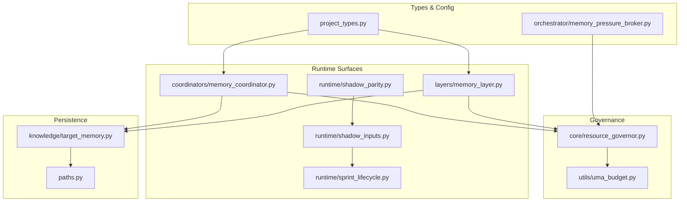

**Diagram sources**
- [resource_governor.py:1-668](file://core/resource_governor.py#L1-L668)
- [uma_budget.py:1-507](file://utils/uma_budget.py#L1-L507)
- [memory_layer.py:1-1527](file://layers/memory_layer.py#L1-L1527)
- [memory_coordinator.py:1-2842](file://coordinators/memory_coordinator.py#L1-L2842)
- [shadow_inputs.py:1-765](file://runtime/shadow_inputs.py#L1-L765)
- [shadow_parity.py:1-472](file://runtime/shadow_parity.py#L1-L472)
- [sprint_lifecycle.py:1-531](file://runtime/sprint_lifecycle.py#L1-L531)
- [target_memory.py:1-500](file://knowledge/target_memory.py#L1-L500)
- [paths.py:430-463](file://paths.py#L430-L463)
- [project_types.py:1-200](file://project_types.py#L1-L200)
- [memory_pressure_broker.py:189-225](file://orchestrator/memory_pressure_broker.py#L189-L225)

**Section sources**
- [memory_authority.py:1-129](file://runtime/memory_authority.py#L1-L129)
- [resource_governor.py:1-668](file://core/resource_governor.py#L1-L668)
- [uma_budget.py:1-507](file://utils/uma_budget.py#L1-L507)
- [memory_layer.py:1-1527](file://layers/memory_layer.py#L1-L1527)
- [memory_coordinator.py:1-2842](file://coordinators/memory_coordinator.py#L1-L2842)
- [shadow_inputs.py:1-765](file://runtime/shadow_inputs.py#L1-L765)
- [shadow_parity.py:1-472](file://runtime/shadow_parity.py#L1-L472)
- [sprint_lifecycle.py:1-531](file://runtime/sprint_lifecycle.py#L1-L531)
- [target_memory.py:1-500](file://knowledge/target_memory.py#L1-L500)
- [paths.py:430-463](file://paths.py#L430-L463)
- [project_types.py:1-200](file://project_types.py#L1-L200)
- [memory_pressure_broker.py:189-225](file://orchestrator/memory_pressure_broker.py#L189-L225)

## Core Components
- Memory Authority Map: Defines canonical roles for memory-related modules and their responsibilities.
- Resource Governor: Central policy owner for UMA thresholds, hysteresis, I/O-only mode, and async alarm dispatch.
- Raw UMA Sampler: Provides raw memory snapshots and pressure levels without policy.
- Memory Layer: M1 8GB-focused layer with state machine, health monitoring, RAM disk, shared memory, and stealth operations.
- Universal Memory Coordinator: Zone-based allocation tracking, eviction callbacks, and neuromorphic memory integration.
- Shadow Inputs and Parity: Read-only collection of lifecycle, graph, model/control, and export facts; parity artifact generation for diagnostics.
- Sprint Lifecycle: Canonical state machine driving phase transitions and wind-down scheduling.
- Target Memory Persistence: In-memory cache and persistence for target-specific memory with size bounds.
- Runtime Paths and RAM Disk: Deterministic runtime directories and RAM disk lifecycle management.
- Memory Pressure Broker: Heuristic-based memory pressure detection for orchestration.

**Section sources**
- [memory_authority.py:35-72](file://runtime/memory_authority.py#L35-L72)
- [resource_governor.py:1-668](file://core/resource_governor.py#L1-L668)
- [uma_budget.py:1-507](file://utils/uma_budget.py#L1-L507)
- [memory_layer.py:1-1527](file://layers/memory_layer.py#L1-L1527)
- [memory_coordinator.py:1-2842](file://coordinators/memory_coordinator.py#L1-L2842)
- [shadow_inputs.py:1-765](file://runtime/shadow_inputs.py#L1-L765)
- [shadow_parity.py:1-472](file://runtime/shadow_parity.py#L1-L472)
- [sprint_lifecycle.py:1-531](file://runtime/sprint_lifecycle.py#L1-L531)
- [target_memory.py:319-345](file://knowledge/target_memory.py#L319-L345)
- [paths.py:430-463](file://paths.py#L430-L463)
- [memory_pressure_broker.py:189-225](file://orchestrator/memory_pressure_broker.py#L189-L225)

## Architecture Overview
The Memory Authority establishes a strict separation of concerns:
- Canonical policy owner: core/resource_governor.py
- Raw sampler: utils/uma_budget.py
- Layer surface: layers/memory_layer.py
- Allocator/coordinator: coordinators/memory_coordinator.py
- Shadow inputs/parity: runtime/shadow_inputs.py, runtime/shadow_parity.py
- Persistence: knowledge/target_memory.py
- Lifecycle: runtime/sprint_lifecycle.py

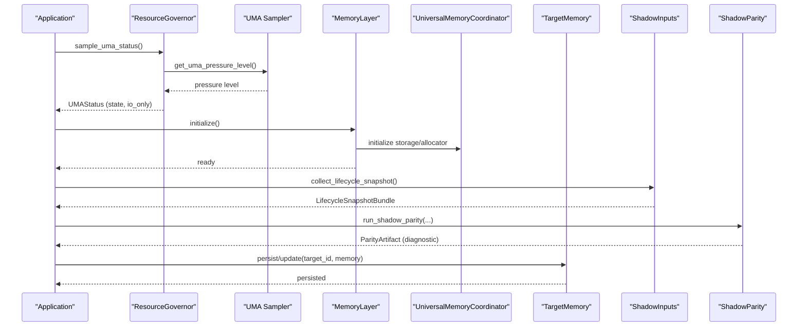

**Diagram sources**
- [resource_governor.py:388-488](file://core/resource_governor.py#L388-L488)
- [uma_budget.py:201-251](file://utils/uma_budget.py#L201-L251)
- [memory_layer.py:510-544](file://layers/memory_layer.py#L510-L544)
- [memory_coordinator.py:694-750](file://coordinators/memory_coordinator.py#L694-L750)
- [shadow_inputs.py:445-495](file://runtime/shadow_inputs.py#L445-L495)
- [shadow_parity.py:322-461](file://runtime/shadow_parity.py#L322-L461)
- [target_memory.py:319-345](file://knowledge/target_memory.py#L319-L345)

## Detailed Component Analysis

### Memory Authority Map and Roles
The Memory Authority Map classifies modules into canonical roles:
- canonical_governor: core/resource_governor.py
- raw_sampler: utils/uma_budget.py
- layer_system: layers/memory_layer.py
- allocator: coordinators/memory_coordinator.py
- registry_only: coordinators/coordinator_registry.py
- legacy_ao: legacy orchestrator classes
- facade_only: compatibility shim

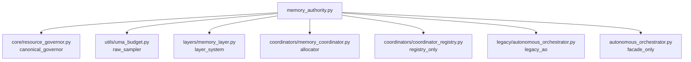

**Diagram sources**
- [memory_authority.py:37-72](file://runtime/memory_authority.py#L37-L72)

**Section sources**
- [memory_authority.py:35-129](file://runtime/memory_authority.py#L35-L129)

### Resource Governor and UMA Policy
The Resource Governor enforces M1 8GB calibrated thresholds and hysteresis:
- Thresholds: warn ≥ 6.0 GiB, critical ≥ 6.5 GiB, emergency ≥ 7.0 GiB
- Hysteresis: exit I/O-only only when system_used_gib ≤ 5.8 GiB
- Swap policy tiers: clean ≤ 2.0 GiB, diagnostic (2.0–4.0], hard_block > 4.0 GiB
- Async alarm dispatcher for CRITICAL/EMERGENCY
- Priority-based resource reservations and thread QoS hints

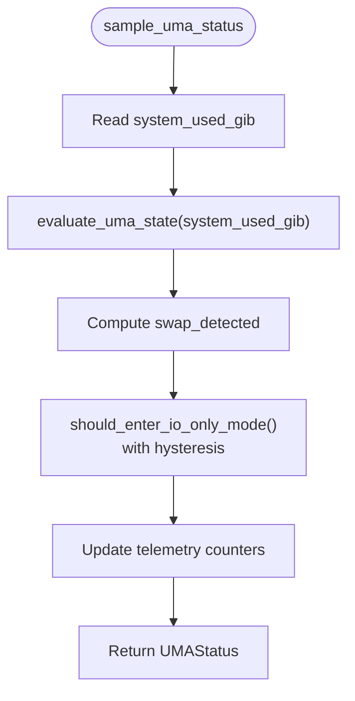

**Diagram sources**
- [resource_governor.py:388-488](file://core/resource_governor.py#L388-L488)
- [resource_governor.py:314-372](file://core/resource_governor.py#L314-L372)
- [resource_governor.py:76-93](file://core/resource_governor.py#L76-L93)

**Section sources**
- [resource_governor.py:55-74](file://core/resource_governor.py#L55-L74)
- [resource_governor.py:314-372](file://core/resource_governor.py#L314-L372)
- [resource_governor.py:388-488](file://core/resource_governor.py#L388-L488)
- [resource_governor.py:503-630](file://core/resource_governor.py#L503-L630)
- [resource_governor.py:642-668](file://core/resource_governor.py#L642-L668)

### Raw UMA Sampling and Watchdog
The UMA Sampler provides raw snapshots and pressure levels:
- System and MLX memory readings
- Pressure level classification
- Async watchdog with debounce and callbacks
- Default auto-actions for warn/critical/emergency

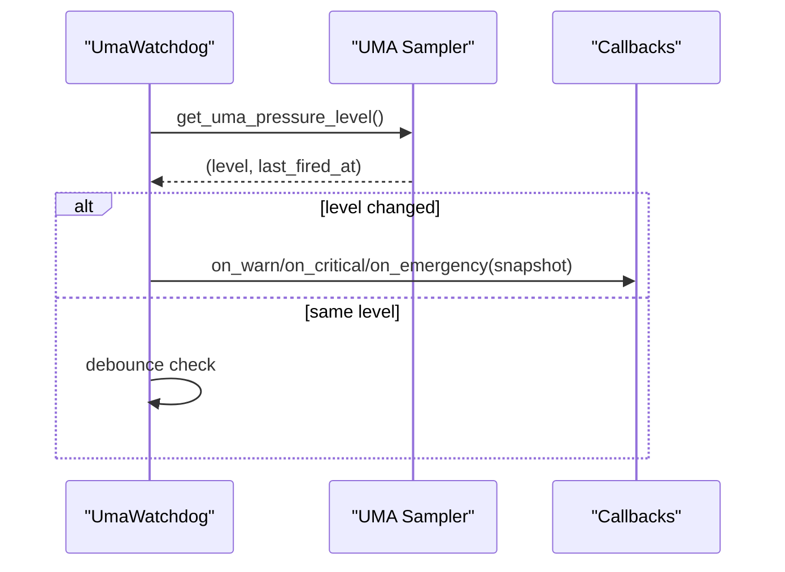

**Diagram sources**
- [uma_budget.py:380-497](file://utils/uma_budget.py#L380-L497)
- [uma_budget.py:318-378](file://utils/uma_budget.py#L318-L378)

**Section sources**
- [uma_budget.py:111-282](file://utils/uma_budget.py#L111-L282)
- [uma_budget.py:380-497](file://utils/uma_budget.py#L380-L497)

### Memory Layer (M1 8GB Optimization)
The Memory Layer coordinates:
- Internal state manager with health monitoring and thermal sampling
- Storage coordinator for RAM disk and shared memory
- Stealth memory manager for entropy masking
- Context swaps between orchestrator states with mitigation actions

Key responsibilities:
- System state transitions (HEALTHY → MEMORY_PRESSURE → ...)
- Background health monitoring (memory, CPU, temperature)
- Automatic mitigation actions (GC, MLX cache clear)
- RAM Disk operations and shared memory for zero-copy IPC
- Entropy masking for stealth operations

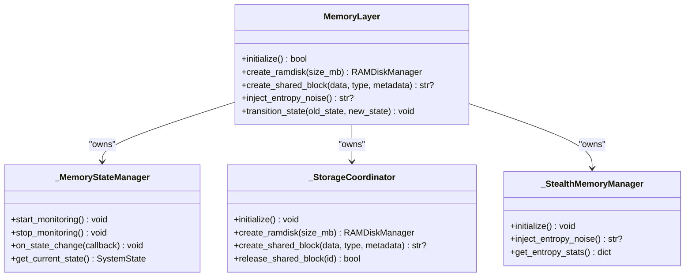

**Diagram sources**
- [memory_layer.py:445-505](file://layers/memory_layer.py#L445-L505)
- [memory_layer.py:147-310](file://layers/memory_layer.py#L147-L310)
- [memory_layer.py:312-387](file://layers/memory_layer.py#L312-L387)
- [memory_layer.py:389-439](file://layers/memory_layer.py#L389-L439)

**Section sources**
- [memory_layer.py:1-800](file://layers/memory_layer.py#L1-L800)

### Universal Memory Coordinator
The Universal Memory Coordinator integrates:
- M1 Master zones (BRAIN, TOOLS, SYNTHESIS, SYSTEM)
- Universal zones (CRITICAL, HIGH, MEDIUM, LOW)
- Allocation tracking with eviction callbacks
- Memory pressure monitoring and async cleanup
- Neuromorphic memory manager with STDP learning and sleep replay

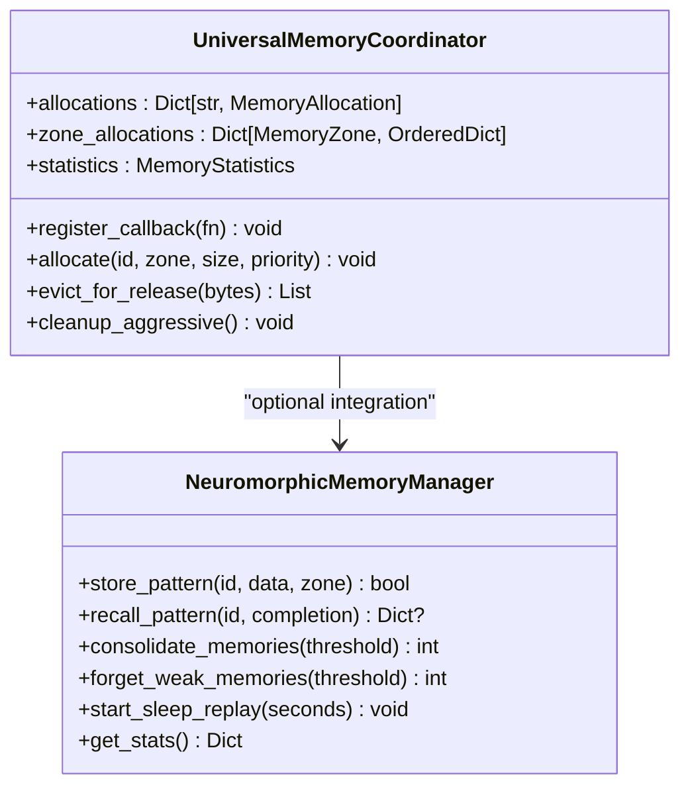

**Diagram sources**
- [memory_coordinator.py:694-750](file://coordinators/memory_coordinator.py#L694-L750)
- [memory_coordinator.py:163-611](file://coordinators/memory_coordinator.py#L163-L611)

**Section sources**
- [memory_coordinator.py:1-800](file://coordinators/memory_coordinator.py#L1-L800)

### Shadow Inputs Collection and Parity Checking
Shadow inputs are read-only bundles collected from canonical sources:
- LifecycleSnapshotBundle: workflow_phase, control_phase, windup_local_phase
- GraphSummaryBundle: node/edge counts, backend, top nodes
- ModelControlFactsBundle: tools, sources, privacy, depth, models_needed
- ProviderRuntimeFactsBundle: current model, is_loaded, initialized
- Export handoff facts: sprint_id, synthesis_engine, ranked parquet presence

Parity artifact compares these inputs and reports mismatches without side effects.

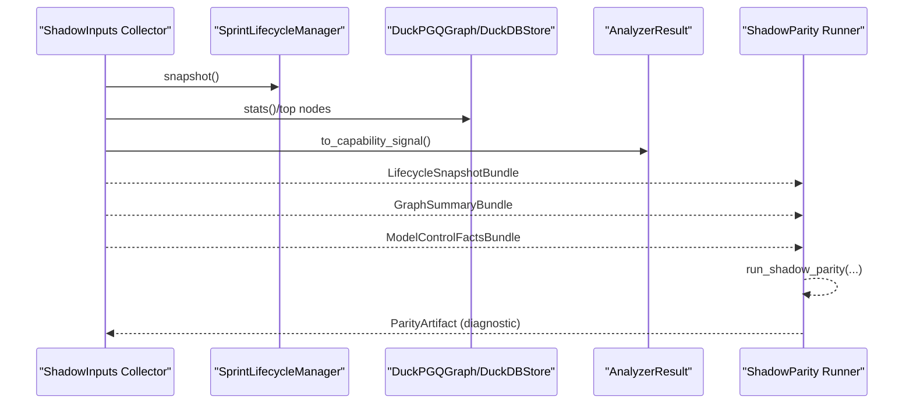

**Diagram sources**
- [shadow_inputs.py:445-577](file://runtime/shadow_inputs.py#L445-L577)
- [shadow_parity.py:322-461](file://runtime/shadow_parity.py#L322-L461)

**Section sources**
- [shadow_inputs.py:1-765](file://runtime/shadow_inputs.py#L1-L765)
- [shadow_parity.py:1-472](file://runtime/shadow_parity.py#L1-L472)

### Sprint Lifecycle and Wind-down
The Sprint Lifecycle manages phase transitions and wind-down:
- Phases: BOOT → WARMUP → ACTIVE → WINDUP → EXPORT → TEARDOWN
- Auto-enter WINDUP when remaining time ≤ windup_lead_s
- Snapshot exposes canonical state for monitoring and shadow inputs

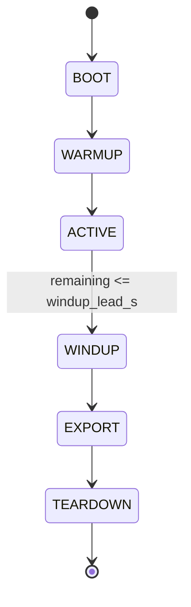

**Diagram sources**
- [sprint_lifecycle.py:21-49](file://runtime/sprint_lifecycle.py#L21-L49)
- [sprint_lifecycle.py:110-146](file://runtime/sprint_lifecycle.py#L110-L146)
- [sprint_lifecycle.py:182-200](file://runtime/sprint_lifecycle.py#L182-L200)

**Section sources**
- [sprint_lifecycle.py:1-200](file://runtime/sprint_lifecycle.py#L1-L200)

### Target Memory Persistence and Integrity
Target memory persistence uses an in-memory cache with size bounds:
- Enforces maximum JSON byte size for confidence drift
- Cache operations: get, set, clear, cache_size
- Thread-safe updates and truncation on size overflow

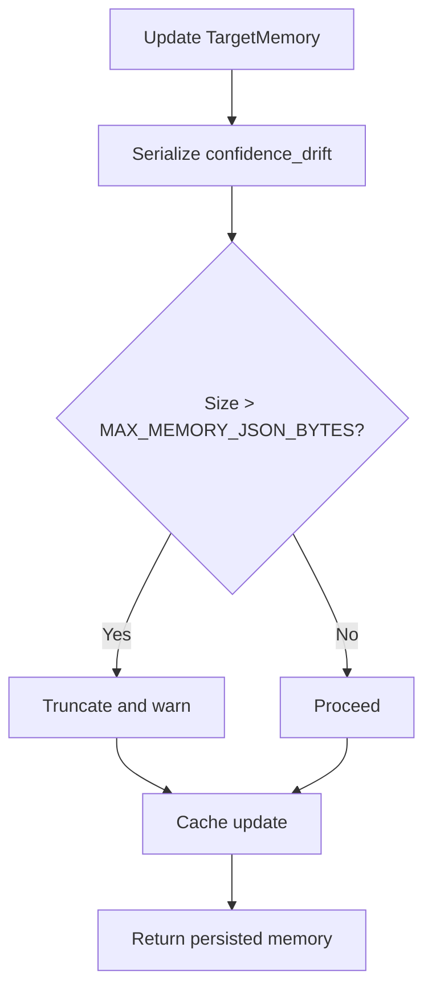

**Diagram sources**
- [target_memory.py:319-345](file://knowledge/target_memory.py#L319-L345)

**Section sources**
- [target_memory.py:319-345](file://knowledge/target_memory.py#L319-L345)

### Runtime Paths and RAM Disk Lifecycle
Runtime directories are initialized at import time, and RAM disk artifacts are cleaned up deterministically on shutdown. The system asserts RAM disk availability and raises on disappearance.

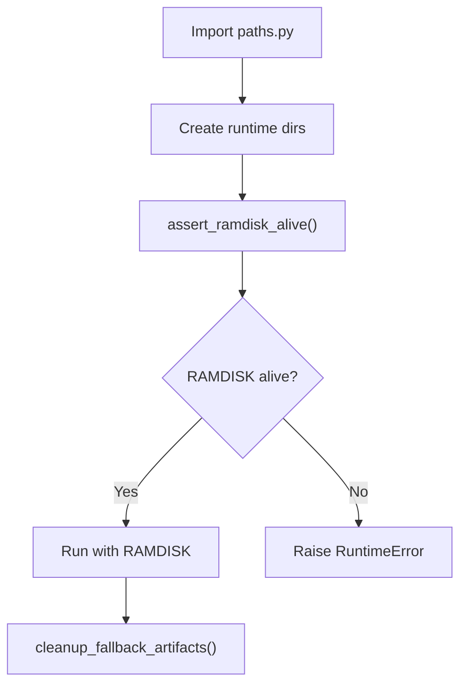

**Diagram sources**
- [paths.py:430-463](file://paths.py#L430-L463)

**Section sources**
- [paths.py:430-463](file://paths.py#L430-L463)

### Memory Pressure Broker
The memory pressure broker estimates pressure using heuristics:
- psutil virtual memory and CPU utilization
- vm_stat parsing on macOS for free pages
- Thresholds: critical < 50000 free pages (~200MB), warn < 150000 (~600MB)

**Section sources**
- [memory_pressure_broker.py:189-225](file://orchestrator/memory_pressure_broker.py#L189-L225)

## Dependency Analysis
The Memory Authority system exhibits clear separation of responsibilities:
- Canonical policy: core/resource_governor.py
- Raw sampling: utils/uma_budget.py
- Layer surface: layers/memory_layer.py
- Coordinator: coordinators/memory_coordinator.py
- Shadow inputs/parity: runtime/shadow_inputs.py, runtime/shadow_parity.py
- Persistence: knowledge/target_memory.py
- Lifecycle: runtime/sprint_lifecycle.py

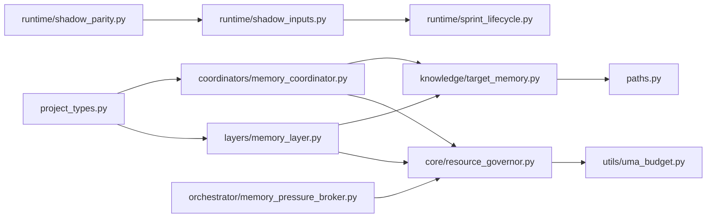

**Diagram sources**
- [memory_authority.py:35-72](file://runtime/memory_authority.py#L35-L72)
- [resource_governor.py:1-668](file://core/resource_governor.py#L1-L668)
- [uma_budget.py:1-507](file://utils/uma_budget.py#L1-L507)
- [memory_layer.py:1-1527](file://layers/memory_layer.py#L1-L1527)
- [memory_coordinator.py:1-2842](file://coordinators/memory_coordinator.py#L1-L2842)
- [shadow_inputs.py:1-765](file://runtime/shadow_inputs.py#L1-L765)
- [shadow_parity.py:1-472](file://runtime/shadow_parity.py#L1-L472)
- [sprint_lifecycle.py:1-531](file://runtime/sprint_lifecycle.py#L1-L531)
- [target_memory.py:1-500](file://knowledge/target_memory.py#L1-L500)
- [paths.py:430-463](file://paths.py#L430-L463)
- [project_types.py:1-200](file://project_types.py#L1-L200)
- [memory_pressure_broker.py:189-225](file://orchestrator/memory_pressure_broker.py#L189-L225)

**Section sources**
- [memory_authority.py:35-72](file://runtime/memory_authority.py#L35-L72)

## Performance Considerations
- Use Resource Governor thresholds and hysteresis to avoid thrashing during memory pressure.
- Prefer async operations and thread-safe designs to minimize blocking.
- Leverage shared memory for zero-copy data sharing between components.
- Apply aggressive cleanup (GC, MLX cache clear) proactively during state transitions.
- Monitor thermal state and adjust processing intensity accordingly.
- Use shadow parity to detect structural mismatches early without side effects.

## Troubleshooting Guide
Common issues and resolutions:
- Memory pressure during state transitions: Trigger mitigation actions (GC, MLX cache clear) and unload non-essential models.
- RAM disk disappearance: Ensure GHOST_RAMDISK environment variable is set or mount /Volumes/ghost_tmp; assert_ramdisk_alive() will raise on absence.
- Emergency memory warnings: Use UmaWatchdog callbacks to trigger MLX cache cleanup and logging.
- Shadow parity mismatches: Review lifecycle phase field merges and graph capability inputs; ensure STABLE vs COMPAT inputs are correctly classified.
- Recovery mode: Enter recovery mode to aggressively clear caches and unload models when memory pressure persists.

**Section sources**
- [memory_layer.py:754-787](file://layers/memory_layer.py#L754-L787)
- [paths.py:442-454](file://paths.py#L442-L454)
- [uma_budget.py:334-378](file://utils/uma_budget.py#L334-L378)
- [shadow_parity.py:217-286](file://runtime/shadow_parity.py#L217-L286)
- [resource_governor.py:503-630](file://core/resource_governor.py#L503-L630)

## Conclusion
The Memory Authority system provides a robust, layered approach to memory governance across execution cycles. By separating canonical policy (Resource Governor), raw sampling (UMA Sampler), and operational surfaces (Memory Layer, Universal Memory Coordinator), it achieves consistency, resilience, and configurability. The shadow inputs and parity mechanisms ensure diagnostic fidelity without introducing side effects. Persistence strategies and runtime path management further strengthen reliability. Adhering to the authority boundaries and leveraging the provided tools enables effective memory usage patterns and recovery procedures.