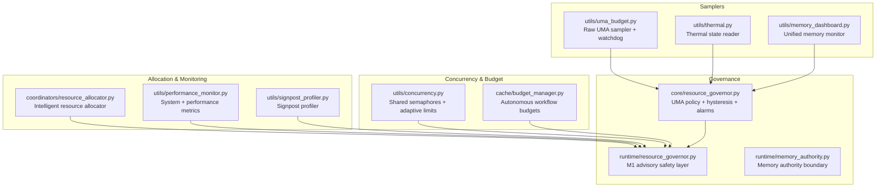
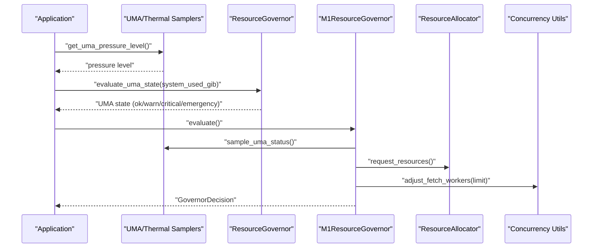
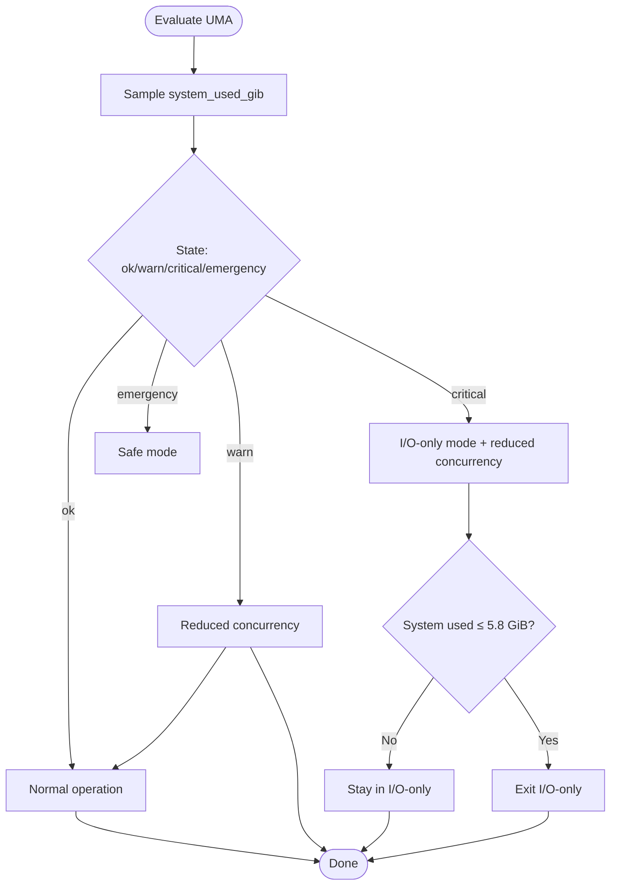
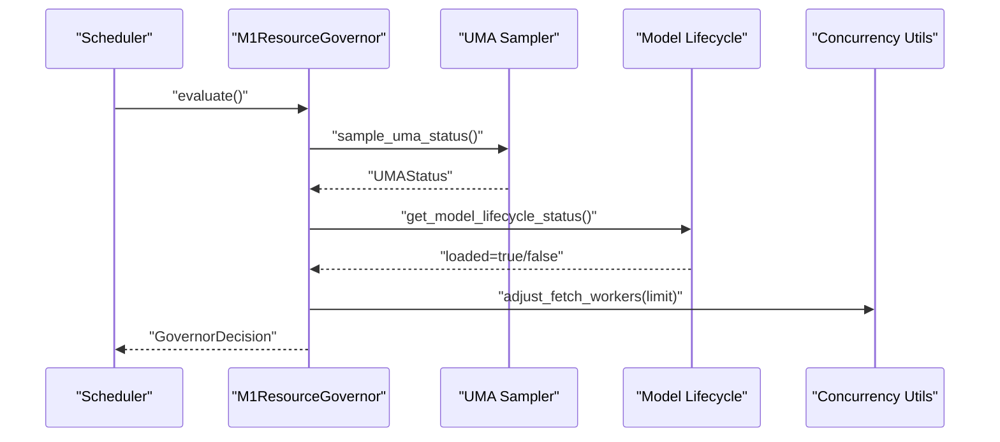
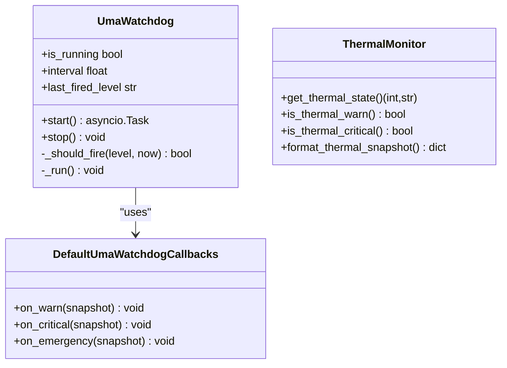
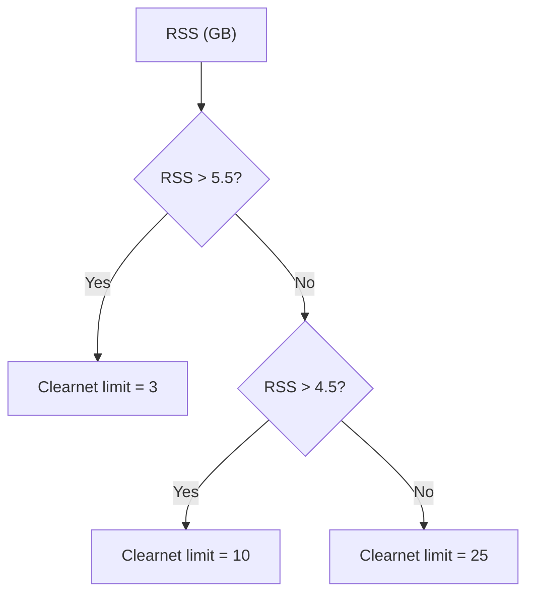
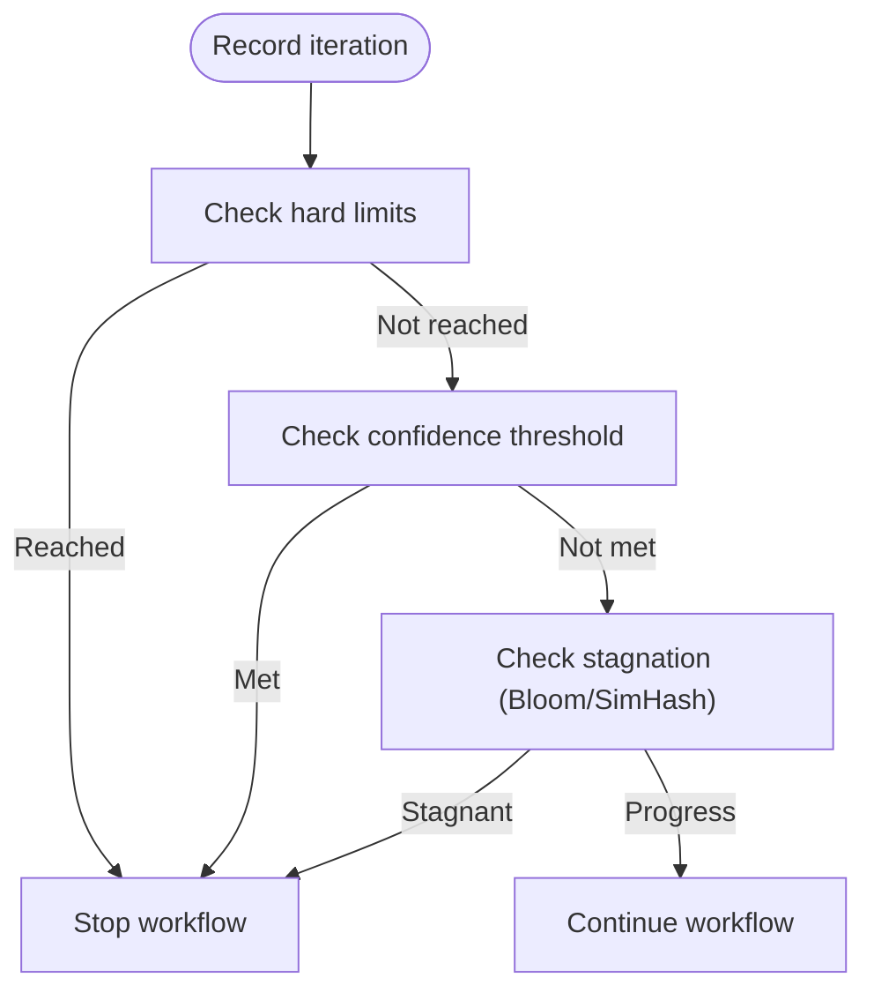
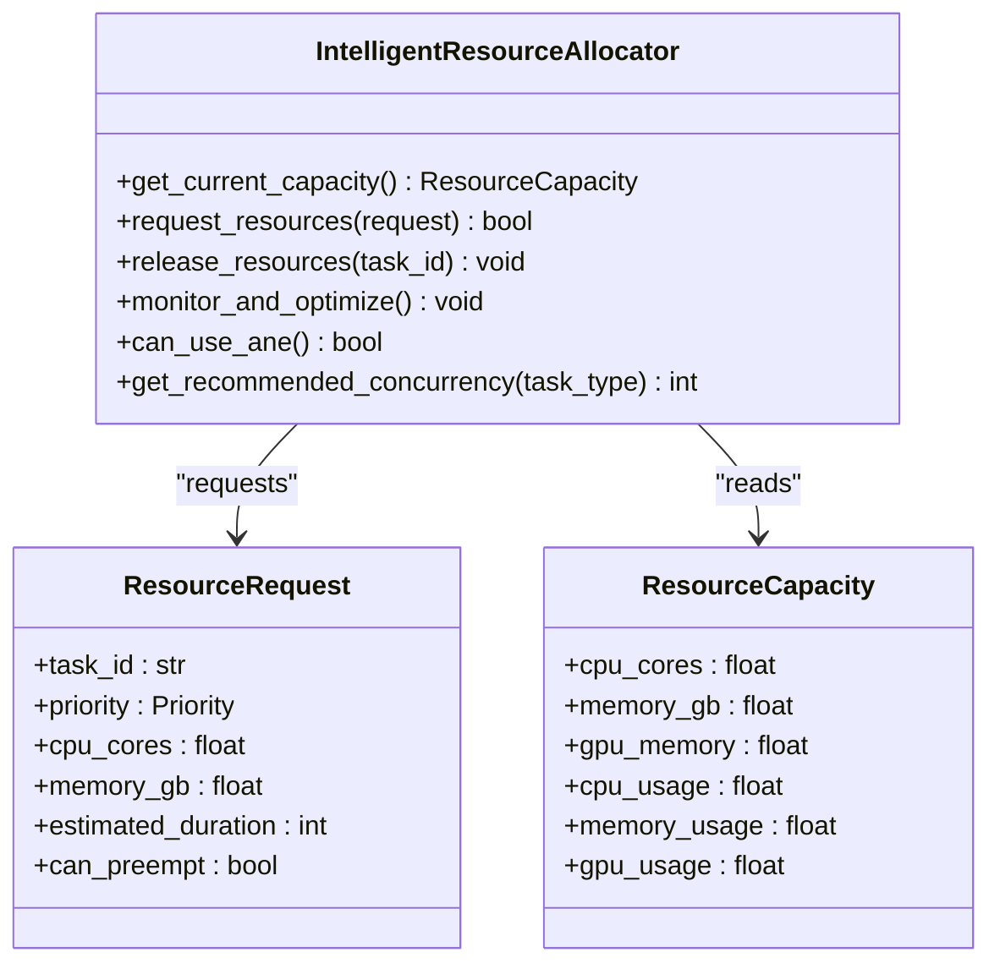
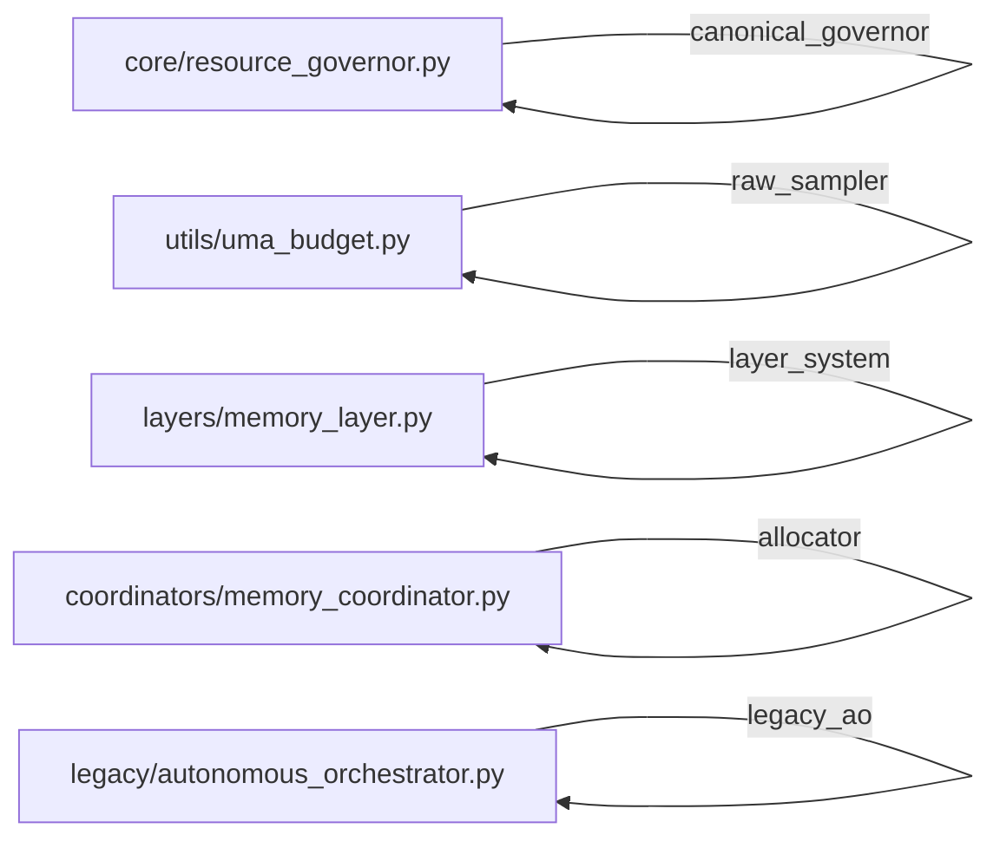
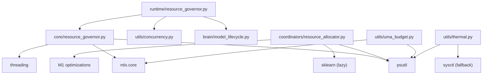

# Resource Governance

<cite>
**Referenced Files in This Document**
- [core/resource_governor.py](file://core/resource_governor.py)
- [runtime/resource_governor.py](file://runtime/resource_governor.py)
- [utils/uma_budget.py](file://utils/uma_budget.py)
- [utils/thermal.py](file://utils/thermal.py)
- [utils/concurrency.py](file://utils/concurrency.py)
- [cache/budget_manager.py](file://cache/budget_manager.py)
- [coordinators/resource_allocator.py](file://coordinators/resource_allocator.py)
- [runtime/memory_authority.py](file://runtime/memory_authority.py)
- [utils/memory_dashboard.py](file://utils/memory_dashboard.py)
- [utils/performance_monitor.py](file://utils/performance_monitor.py)
- [utils/signpost_profiler.py](file://utils/signpost_profiler.py)
- [brain/model_lifecycle.py](file://brain/model_lifecycle.py)
- [tests/probe_f202j/test_m1_resource_governor.py](file://tests/probe_f202j/test_m1_resource_governor.py)
- [tests/probe_memory_authority/test_memory_authority.py](file://tests/probe_memory_authority/test_memory_authority.py)
</cite>

## Table of Contents
1. [Introduction](#introduction)
2. [Project Structure](#project-structure)
3. [Core Components](#core-components)
4. [Architecture Overview](#architecture-overview)
5. [Detailed Component Analysis](#detailed-component-analysis)
6. [Dependency Analysis](#dependency-analysis)
7. [Performance Considerations](#performance-considerations)
8. [Troubleshooting Guide](#troubleshooting-guide)
9. [Conclusion](#conclusion)
10. [Appendices](#appendices)

## Introduction
This document describes the Resource Governance system that monitors and controls system resources (CPU, memory, disk, and network) across the Hledač Universal platform. It focuses on:
- Canonical UMA (Unified Memory Accounting) policy and hysteresis-driven runtime governance
- Memory authority boundaries and separation of concerns
- Budget enforcement and resource allocation strategies
- Integration with Apple Silicon optimization, thermal management, and performance monitoring
- Practical configuration, tuning, and optimization techniques for different deployment scenarios

The system separates responsibilities among three layers:
- Sampler: raw memory and system metrics collection
- Governor: policy, hysteresis, and runtime governance
- Allocator: request-level budgeting and concurrency control

## Project Structure
The Resource Governance system spans several modules:
- Core governance and UMA policy
- Runtime advisory safety layer for Apple Silicon constraints
- Raw samplers for UMA and thermal metrics
- Concurrency control and adaptive limits
- Budget managers for autonomous workflows
- Resource allocation and orchestration
- Memory authority boundary definitions
- Performance monitoring and profiling

**Diagram sources**
- [core/resource_governor.py:1-634](file://core/resource_governor.py#L1-L634)
- [runtime/resource_governor.py:1-353](file://runtime/resource_governor.py#L1-L353)
- [utils/uma_budget.py:1-489](file://utils/uma_budget.py#L1-L489)
- [utils/thermal.py:1-203](file://utils/thermal.py#L1-L203)
- [utils/memory_dashboard.py:1-242](file://utils/memory_dashboard.py#L1-L242)
- [utils/concurrency.py:1-142](file://utils/concurrency.py#L1-L142)
- [cache/budget_manager.py:1-635](file://cache/budget_manager.py#L1-L635)
- [coordinators/resource_allocator.py:1-760](file://coordinators/resource_allocator.py#L1-L760)
- [utils/performance_monitor.py:1-537](file://utils/performance_monitor.py#L1-L537)
- [utils/signpost_profiler.py:1-79](file://utils/signpost_profiler.py#L1-L79)

**Section sources**
- [core/resource_governor.py:1-634](file://core/resource_governor.py#L1-L634)
- [runtime/resource_governor.py:1-353](file://runtime/resource_governor.py#L1-L353)
- [utils/uma_budget.py:1-489](file://utils/uma_budget.py#L1-L489)
- [utils/thermal.py:1-203](file://utils/thermal.py#L1-L203)
- [utils/concurrency.py:1-142](file://utils/concurrency.py#L1-L142)
- [cache/budget_manager.py:1-635](file://cache/budget_manager.py#L1-L635)
- [coordinators/resource_allocator.py:1-760](file://coordinators/resource_allocator.py#L1-L760)
- [runtime/memory_authority.py:1-129](file://runtime/memory_authority.py#L1-L129)
- [utils/memory_dashboard.py:1-242](file://utils/memory_dashboard.py#L1-L242)
- [utils/performance_monitor.py:1-537](file://utils/performance_monitor.py#L1-L537)
- [utils/signpost_profiler.py:1-79](file://utils/signpost_profiler.py#L1-L79)

## Core Components
- UMA Policy and Hysteresis (core/resource_governor.py)
  - Central policy owner for unified memory accounting
  - Hysteresis-based I/O-only mode to prevent thrashing
  - Async alarm dispatcher for CRITICAL/EMERGENCY callbacks
  - Apple Silicon QoS thread priority hints
  - Priority-based resource reservations with async context manager

- M1 Advisory Safety Layer (runtime/resource_governor.py)
  - Advisory-only governance for branch concurrency, model lease, and renderer lease
  - Mission budget enforcement for M1 8GB constraints
  - Sidecar admission checks with RSS and UMA state gating
  - Integration with model lifecycle and fetch concurrency

- Raw Samplers (utils/uma_budget.py, utils/thermal.py)
  - Raw UMA sampling with pressure level classification and watchdog
  - Thermal state reader for macOS with fail-open behavior

- Concurrency and Adaptive Limits (utils/concurrency.py)
  - Shared semaphores for fetch concurrency
  - Adaptive clearnet/Tor concurrency based on memory pressure
  - Dynamic adjustment of worker limits

- Budget Enforcement (cache/budget_manager.py)
  - Iteration, document, time, and tool-call budgets
  - Stagnation detection and confidence thresholds
  - Frequency tracking and drift alerts

- Resource Allocation (coordinators/resource_allocator.py)
  - Intelligent resource allocator with M1-specific optimizations
  - Dynamic concurrency recommendations and preemption
  - Auto-scaling and anomaly detection

- Memory Authority Boundaries (runtime/memory_authority.py)
  - Canonical classification of memory-related modules
  - Guards against importing legacy or non-canonical memory systems

**Section sources**
- [core/resource_governor.py:168-276](file://core/resource_governor.py#L168-L276)
- [runtime/resource_governor.py:116-353](file://runtime/resource_governor.py#L116-L353)
- [utils/uma_budget.py:1-489](file://utils/uma_budget.py#L1-L489)
- [utils/thermal.py:1-203](file://utils/thermal.py#L1-L203)
- [utils/concurrency.py:1-142](file://utils/concurrency.py#L1-L142)
- [cache/budget_manager.py:1-635](file://cache/budget_manager.py#L1-L635)
- [coordinators/resource_allocator.py:1-760](file://coordinators/resource_allocator.py#L1-L760)
- [runtime/memory_authority.py:1-129](file://runtime/memory_authority.py#L1-L129)

## Architecture Overview
The governance architecture separates responsibilities across three layers:
- Sampler layer: raw metrics collection (UMA, thermal, memory)
- Governor layer: policy decisions, hysteresis, and runtime controls
- Allocator layer: request-level budgeting and concurrency

**Diagram sources**
- [core/resource_governor.py:282-304](file://core/resource_governor.py#L282-L304)
- [runtime/resource_governor.py:137-217](file://runtime/resource_governor.py#L137-L217)
- [utils/uma_budget.py:183-233](file://utils/uma_budget.py#L183-L233)
- [utils/concurrency.py:63-78](file://utils/concurrency.py#L63-L78)
- [coordinators/resource_allocator.py:291-322](file://coordinators/resource_allocator.py#L291-L322)

## Detailed Component Analysis

### UMA Policy and Hysteresis
- Thresholds calibrated for M1 8GB UMA:
  - Warn: ≥6.0 GiB used
  - Critical: ≥6.5 GiB used
  - Emergency: ≥7.0 GiB used
- Hysteresis-based I/O-only mode:
  - Prevents thrashing around critical boundaries
  - Accelerated entry when active swap is detected
- Async alarm dispatcher:
  - Push-based callbacks for CRITICAL/EMERGENCY
  - Cooldown to avoid callback storms
- Priority-based resource reservations:
  - Async context manager with per-priority budget factors

**Diagram sources**
- [core/resource_governor.py:282-340](file://core/resource_governor.py#L282-L340)
- [core/resource_governor.py:75-101](file://core/resource_governor.py#L75-L101)

**Section sources**
- [core/resource_governor.py:55-101](file://core/resource_governor.py#L55-L101)
- [core/resource_governor.py:282-340](file://core/resource_governor.py#L282-L340)
- [core/resource_governor.py:469-596](file://core/resource_governor.py#L469-L596)

### M1 Advisory Safety Layer
- Advisory-only governance:
  - Never blocks the sprint; only advises
  - Fail-soft fallback to safe defaults
- Mission budget enforcement:
  - Peak RSS hard ceiling (5.5 GiB)
  - Sidecar admission checks with RSS and UMA state gating
  - Heavy sidecar blocking in CRITICAL/EMERGENCY
- Fetch concurrency control:
  - Model-loaded path: fetch limit = 3
  - Normal path: fetch limit = 25
  - WARN path: reduced concurrency
- Integration points:
  - Reads model lifecycle status
  - Adjusts fetch workers dynamically

**Diagram sources**
- [runtime/resource_governor.py:137-217](file://runtime/resource_governor.py#L137-L217)
- [runtime/resource_governor.py:219-290](file://runtime/resource_governor.py#L219-L290)
- [utils/concurrency.py:63-78](file://utils/concurrency.py#L63-L78)
- [brain/model_lifecycle.py:288-308](file://brain/model_lifecycle.py#L288-L308)

**Section sources**
- [runtime/resource_governor.py:116-353](file://runtime/resource_governor.py#L116-L353)
- [tests/probe_f202j/test_m1_resource_governor.py:1-196](file://tests/probe_f202j/test_m1_resource_governor.py#L1-L196)

### Raw Samplers and Alarms
- UnifiedMemoryBudgetAccountant:
  - Raw UMA sampling (system RAM + MLX active/peak/cache)
  - Pressure level classification with fail-open behavior
  - Async watchdog with state-change callbacks and debounce
- Thermal Monitor:
  - macOS thermal state reader with fail-open
  - Nominal/fair/serious/critical levels

**Diagram sources**
- [utils/uma_budget.py:362-489](file://utils/uma_budget.py#L362-L489)
- [utils/thermal.py:118-203](file://utils/thermal.py#L118-L203)

**Section sources**
- [utils/uma_budget.py:1-489](file://utils/uma_budget.py#L1-L489)
- [utils/thermal.py:1-203](file://utils/thermal.py#L1-L203)

### Concurrency Control and Adaptive Limits
- Shared semaphores:
  - FETCH_SEMAPHORE for fetch concurrency
  - Separate clearnet/Tor semaphores to avoid head-of-line blocking
- Adaptive limits:
  - Clearnet concurrency adapts to RSS thresholds (M1 8GB constraints)
  - Dynamic adjustment of worker limits

**Diagram sources**
- [utils/concurrency.py:116-134](file://utils/concurrency.py#L116-L134)

**Section sources**
- [utils/concurrency.py:1-142](file://utils/concurrency.py#L1-L142)

### Budget Enforcement for Autonomous Workflows
- Iteration, document, time, and tool-call budgets
- Stagnation detection using Bloom filters and SimHash
- Confidence thresholds and drift alerts

**Diagram sources**
- [cache/budget_manager.py:191-344](file://cache/budget_manager.py#L191-L344)

**Section sources**
- [cache/budget_manager.py:1-635](file://cache/budget_manager.py#L1-L635)

### Intelligent Resource Allocator
- Dynamic resource allocation with M1-specific optimizations
- Predictive models (lazy sklearn) and anomaly detection
- Preemption of low-efficiency tasks and auto-scaling

**Diagram sources**
- [coordinators/resource_allocator.py:81-188](file://coordinators/resource_allocator.py#L81-L188)
- [coordinators/resource_allocator.py:291-364](file://coordinators/resource_allocator.py#L291-L364)

**Section sources**
- [coordinators/resource_allocator.py:1-760](file://coordinators/resource_allocator.py#L1-L760)

### Memory Authority Boundaries
- Canonical classification of memory-related modules
- Guards against importing legacy or non-canonical memory systems
- Static source and sys.modules tests ensure canonical import paths

**Diagram sources**
- [runtime/memory_authority.py:37-72](file://runtime/memory_authority.py#L37-L72)

**Section sources**
- [runtime/memory_authority.py:1-129](file://runtime/memory_authority.py#L1-L129)
- [tests/probe_memory_authority/test_memory_authority.py:1-214](file://tests/probe_memory_authority/test_memory_authority.py#L1-L214)

## Dependency Analysis
Key dependencies and coupling:
- Runtime governor depends on:
  - UMA sampler for state evaluation
  - Model lifecycle for model-loaded status
  - Concurrency utilities for fetch limits
- Core governor depends on:
  - psutil for system metrics
  - MLX for device metrics (when available)
  - Threading lock for I/O-only latch
- Resource allocator depends on:
  - psutil for system metrics
  - sklearn for predictive models (lazy)
  - M1-specific optimizations

**Diagram sources**
- [core/resource_governor.py:30-51](file://core/resource_governor.py#L30-L51)
- [runtime/resource_governor.py:42-47](file://runtime/resource_governor.py#L42-L47)
- [coordinators/resource_allocator.py:9-24](file://coordinators/resource_allocator.py#L9-L24)
- [utils/uma_budget.py:68-91](file://utils/uma_budget.py#L68-L91)
- [utils/thermal.py:139-163](file://utils/thermal.py#L139-L163)

**Section sources**
- [core/resource_governor.py:1-634](file://core/resource_governor.py#L1-L634)
- [runtime/resource_governor.py:1-353](file://runtime/resource_governor.py#L1-L353)
- [coordinators/resource_allocator.py:1-760](file://coordinators/resource_allocator.py#L1-L760)
- [utils/uma_budget.py:1-489](file://utils/uma_budget.py#L1-L489)
- [utils/thermal.py:1-203](file://utils/thermal.py#L1-L203)

## Performance Considerations
- Apple Silicon optimizations:
  - MLX acceleration and Metal optimization environment variables
  - Unified memory architecture awareness
  - QoS thread priority hints for latency/throughput tradeoffs
- Adaptive concurrency:
  - Clearnet/Tor separation to avoid head-of-line blocking
  - RSS-based adaptive limits for M1 8GB constraints
- Predictive allocation:
  - Lazy sklearn models for resource usage prediction
  - Anomaly detection and auto-scaling
- Profiling and tracing:
  - Signpost profiler for Instruments integration
  - System monitor snapshots for flow tracing

[No sources needed since this section provides general guidance]

## Troubleshooting Guide
Common issues and resolutions:
- UMA pressure spikes:
  - Use UMA watchdog to trigger automatic cleanup actions
  - Monitor with UnifiedMemoryMonitor for pressure levels
- Thermal throttling:
  - Check thermal state and reduce processing load
  - Use SystemMonitor recommendations for mitigation
- Concurrency bottlenecks:
  - Verify fetch semaphore limits and adaptive adjustments
  - Separate clearnet/Tor pools to prevent starvation
- Budget exhaustion:
  - Review BudgetManager status and utilization
  - Tune stagnation thresholds and confidence targets
- Memory authority violations:
  - Ensure canonical import paths and authority boundaries
  - Use memory authority classifier to validate module roles

**Section sources**
- [utils/uma_budget.py:299-489](file://utils/uma_budget.py#L299-L489)
- [utils/memory_dashboard.py:160-200](file://utils/memory_dashboard.py#L160-L200)
- [utils/performance_monitor.py:385-420](file://utils/performance_monitor.py#L385-L420)
- [utils/concurrency.py:116-142](file://utils/concurrency.py#L116-L142)
- [cache/budget_manager.py:404-446](file://cache/budget_manager.py#L404-L446)
- [runtime/memory_authority.py:1-129](file://runtime/memory_authority.py#L1-L129)

## Conclusion
The Resource Governance system provides a robust, layered approach to monitoring and controlling system resources:
- Canonical UMA policy with hysteresis prevents thrashing and ensures stable operation
- Advisory safety layer enforces M1 constraints without blocking the sprint
- Raw samplers and alarms provide timely visibility into resource pressure
- Concurrency control and adaptive limits maintain responsiveness under varying loads
- Intelligent allocation and budget enforcement support autonomous workflows
- Memory authority boundaries ensure clean separation of concerns

These mechanisms collectively prevent resource exhaustion, manage concurrent operations, and maintain system stability across diverse deployment scenarios.

[No sources needed since this section summarizes without analyzing specific files]

## Appendices

### Practical Configuration Examples
- ResourceGovernor (core):
  - Configure high-water mark and thermal thresholds
  - Use priority-based budget factors for risk tolerance
  - Integrate cost model predictions for overrun risk

- M1ResourceGovernor (runtime):
  - Set mission budget ceilings (RSS and UMA)
  - Define sidecar admission rules for heavy workloads
  - Adjust fetch limits based on model lifecycle and UMA state

- BudgetManager (cache):
  - Tune iteration, document, time, and tool-call limits
  - Set stagnation thresholds and confidence targets
  - Monitor utilization and approaching limits

- ResourceAllocator (coordinators):
  - Enable M1 optimizations and MLX/Metal settings
  - Configure scaling thresholds and auto-scaling
  - Use anomaly detection to preemptively handle resource spikes

**Section sources**
- [core/resource_governor.py:172-276](file://core/resource_governor.py#L172-L276)
- [runtime/resource_governor.py:55-99](file://runtime/resource_governor.py#L55-L99)
- [cache/budget_manager.py:79-130](file://cache/budget_manager.py#L79-L130)
- [coordinators/resource_allocator.py:108-144](file://coordinators/resource_allocator.py#L108-L144)

### Performance Optimization Techniques
- Apple Silicon-specific:
  - Enable MLX acceleration and Metal optimization
  - Use unified memory optimizations
  - Apply QoS hints for latency-sensitive tasks

- Monitoring and profiling:
  - Use signpost profiler for Instruments integration
  - Leverage SystemMonitor snapshots for flow tracing
  - Track thermal and memory pressure trends

- Concurrency tuning:
  - Separate clearnet/Tor pools
  - Adapt limits based on RSS thresholds
  - Use preemption for low-efficiency tasks

**Section sources**
- [coordinators/resource_allocator.py:365-377](file://coordinators/resource_allocator.py#L365-L377)
- [utils/signpost_profiler.py:1-79](file://utils/signpost_profiler.py#L1-L79)
- [utils/performance_monitor.py:459-522](file://utils/performance_monitor.py#L459-L522)
- [utils/concurrency.py:116-142](file://utils/concurrency.py#L116-L142)