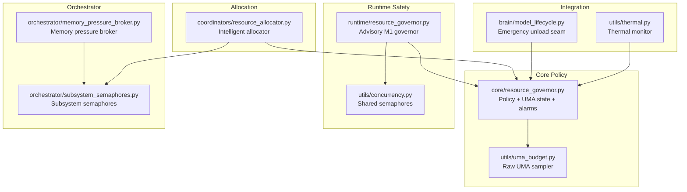
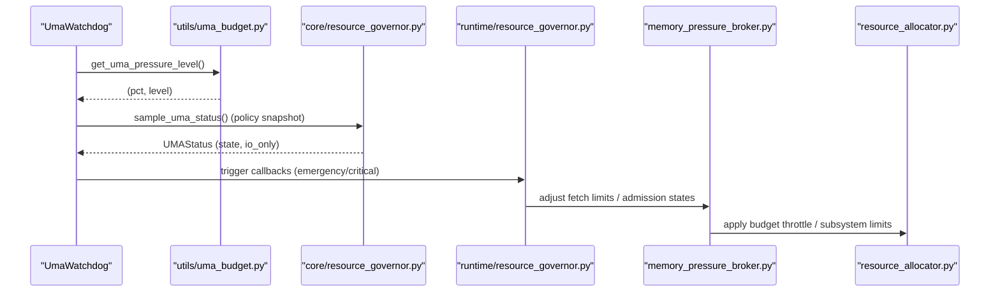
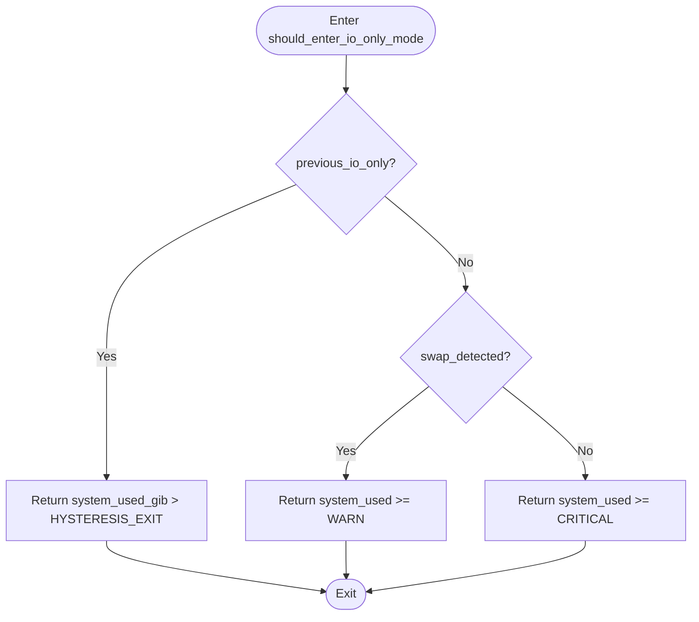
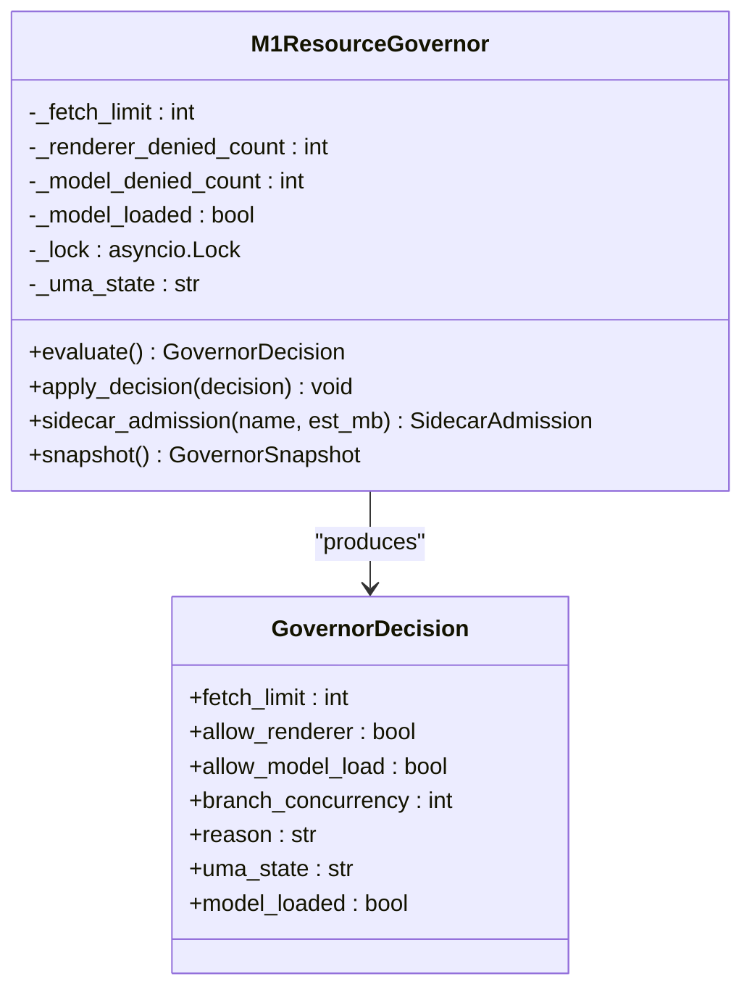
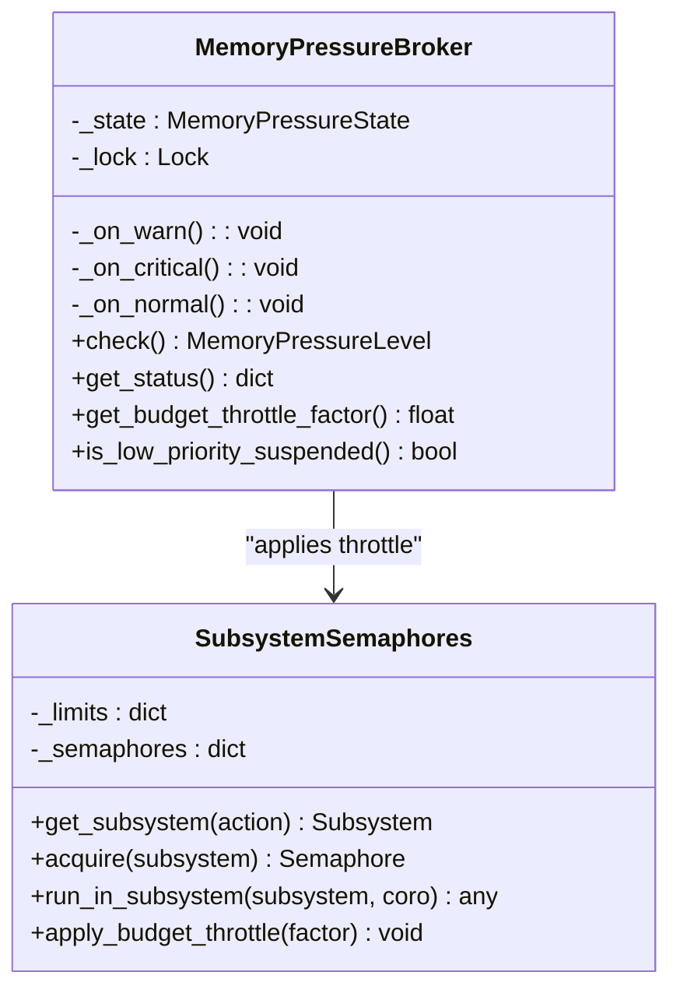
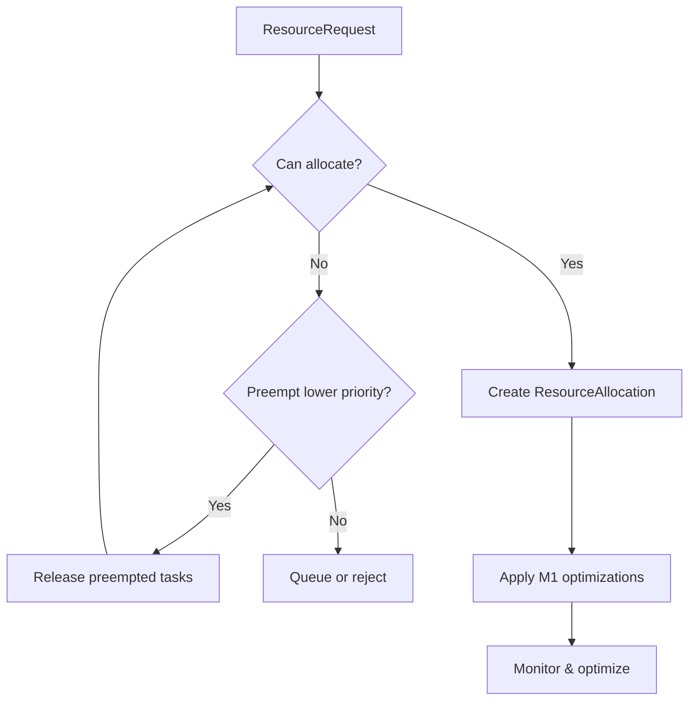
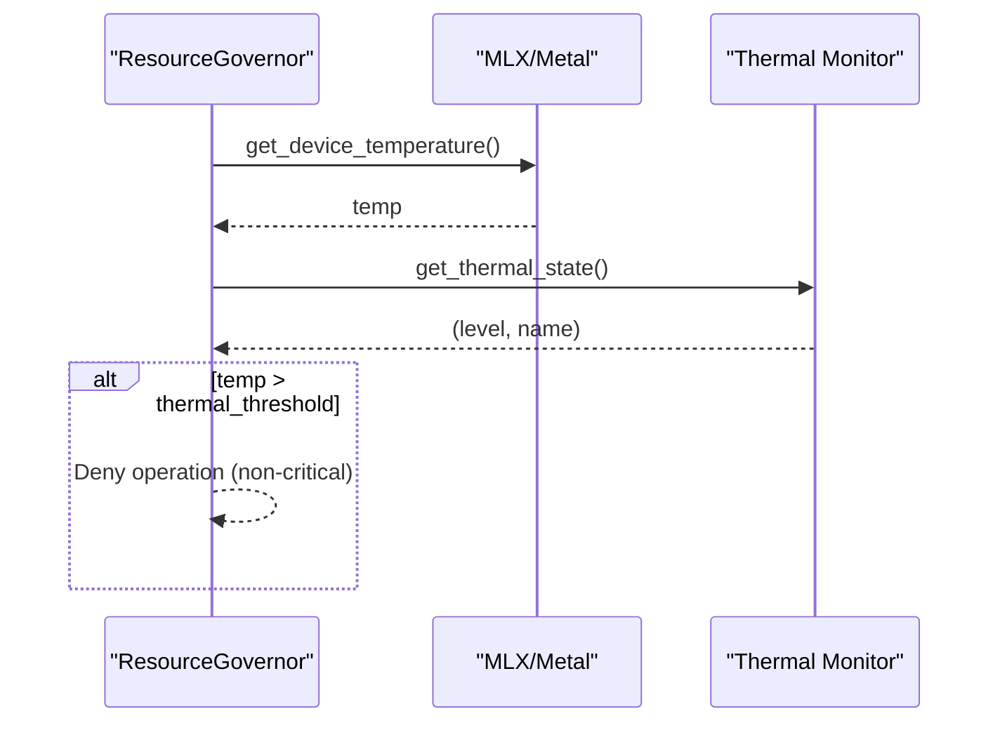
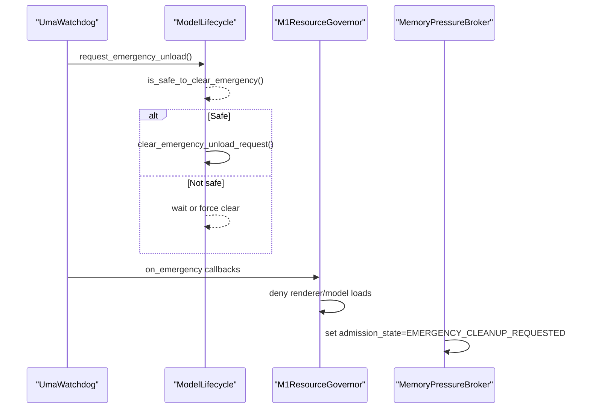
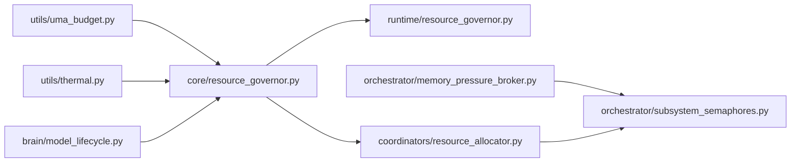

# Resource Governor

<cite>
**Referenced Files in This Document**
- [core/resource_governor.py](file://core/resource_governor.py)
- [runtime/resource_governor.py](file://runtime/resource_governor.py)
- [orchestrator/memory_pressure_broker.py](file://orchestrator/memory_pressure_broker.py)
- [orchestrator/subsystem_semaphores.py](file://orchestrator/subsystem_semaphores.py)
- [coordinators/resource_allocator.py](file://coordinators/resource_allocator.py)
- [utils/uma_budget.py](file://utils/uma_budget.py)
- [utils/thermal.py](file://utils/thermal.py)
- [utils/concurrency.py](file://utils/concurrency.py)
- [brain/model_lifecycle.py](file://brain/model_lifecycle.py)
- [tests/probe_f202j/test_m1_resource_governor.py](file://tests/probe_f202j/test_m1_resource_governor.py)
</cite>

## Table of Contents
1. [Introduction](#introduction)
2. [Project Structure](#project-structure)
3. [Core Components](#core-components)
4. [Architecture Overview](#architecture-overview)
5. [Detailed Component Analysis](#detailed-component-analysis)
6. [Dependency Analysis](#dependency-analysis)
7. [Performance Considerations](#performance-considerations)
8. [Troubleshooting Guide](#troubleshooting-guide)
9. [Conclusion](#conclusion)

## Introduction
This document describes the Resource Governor system that manages Apple Silicon (M1/M2) memory pressure, CPU utilization, and resource allocation across subsystems. It covers:
- Memory pressure detection and hysteresis-based I/O-only mode
- CPU utilization monitoring and thermal guards
- Resource allocation algorithms and semaphore-based concurrency control
- Integration with Apple Silicon unified memory architecture (UMA)
- Emergency shutdown and graceful degradation strategies
- Configuration parameters and operational guidance

## Project Structure
The Resource Governor spans several modules:
- Core policy and UMA sampling
- Runtime advisory governor for M1 constraints
- Orchestrator-level memory pressure broker and subsystem semaphores
- Intelligent resource allocator for request-level budgeting
- Utilities for UMA sampling, thermal monitoring, and concurrency control
- Model lifecycle integration for emergency unload



**Diagram sources**
- [core/resource_governor.py:314-488](file://core/resource_governor.py#L314-L488)
- [runtime/resource_governor.py:116-217](file://runtime/resource_governor.py#L116-L217)
- [orchestrator/memory_pressure_broker.py:79-116](file://orchestrator/memory_pressure_broker.py#L79-L116)
- [orchestrator/subsystem_semaphores.py:32-62](file://orchestrator/subsystem_semaphores.py#L32-L62)
- [coordinators/resource_allocator.py:200-224](file://coordinators/resource_allocator.py#L200-L224)
- [utils/uma_budget.py:253-282](file://utils/uma_budget.py#L253-L282)
- [utils/concurrency.py:22-78](file://utils/concurrency.py#L22-L78)
- [brain/model_lifecycle.py:108-131](file://brain/model_lifecycle.py#L108-L131)
- [utils/thermal.py:118-163](file://utils/thermal.py#L118-L163)

**Section sources**
- [core/resource_governor.py:1-668](file://core/resource_governor.py#L1-L668)
- [runtime/resource_governor.py:1-353](file://runtime/resource_governor.py#L1-L353)
- [orchestrator/memory_pressure_broker.py:1-323](file://orchestrator/memory_pressure_broker.py#L1-L323)
- [orchestrator/subsystem_semaphores.py:1-196](file://orchestrator/subsystem_semaphores.py#L1-L196)
- [coordinators/resource_allocator.py:1-932](file://coordinators/resource_allocator.py#L1-L932)
- [utils/uma_budget.py:1-507](file://utils/uma_budget.py#L1-L507)
- [utils/concurrency.py:1-142](file://utils/concurrency.py#L1-L142)
- [brain/model_lifecycle.py:1-929](file://brain/model_lifecycle.py#L1-L929)
- [utils/thermal.py:1-203](file://utils/thermal.py#L1-L203)

## Core Components
- Unified Memory Accounting (UMA) state machine with hysteresis and I/O-only mode
- Push-based UMA alarm dispatcher for CRITICAL/EMERGENCY events
- M1ResourceGovernor advisory layer enforcing mission budget and concurrency caps
- Orchestrator memory pressure broker with budget throttling and admission states
- Subsystem semaphores for Apple Silicon routing (GPU, ANE, CPU-heavy, I/O)
- Intelligent resource allocator with capacity sampling and auto-scaling
- Thermal guard and MLX device temperature checks
- Emergency unload seam integrated with watchdog

**Section sources**
- [core/resource_governor.py:314-488](file://core/resource_governor.py#L314-L488)
- [runtime/resource_governor.py:116-217](file://runtime/resource_governor.py#L116-L217)
- [orchestrator/memory_pressure_broker.py:79-116](file://orchestrator/memory_pressure_broker.py#L79-L116)
- [orchestrator/subsystem_semaphores.py:32-62](file://orchestrator/subsystem_semaphores.py#L32-L62)
- [coordinators/resource_allocator.py:200-224](file://coordinators/resource_allocator.py#L200-L224)
- [utils/thermal.py:118-163](file://utils/thermal.py#L118-L163)
- [brain/model_lifecycle.py:108-131](file://brain/model_lifecycle.py#L108-L131)

## Architecture Overview
The Resource Governor system separates responsibilities:
- Sampler: raw UMA metrics (utils/uma_budget.py)
- Governor: policy/state/hysteresis (core/resource_governor.py)
- Runtime advisor: M1 mission constraints (runtime/resource_governor.py)
- Orchestrator: memory pressure and subsystem control (memory_pressure_broker.py, subsystem_semaphores.py)
- Allocator: request-level budgeting and scaling (coordinators/resource_allocator.py)
- Integration: thermal, model lifecycle, and concurrency controls



**Diagram sources**
- [utils/uma_budget.py:409-471](file://utils/uma_budget.py#L409-L471)
- [core/resource_governor.py:388-488](file://core/resource_governor.py#L388-L488)
- [runtime/resource_governor.py:137-217](file://runtime/resource_governor.py#L137-L217)
- [orchestrator/memory_pressure_broker.py:223-291](file://orchestrator/memory_pressure_broker.py#L223-L291)
- [coordinators/resource_allocator.py:528-561](file://coordinators/resource_allocator.py#L528-L561)

## Detailed Component Analysis

### Unified Memory Accounting and Hysteresis
- UMA state evaluation: maps system-used memory to ok/warn/critical/emergency
- Hysteresis latch prevents thrashing around critical thresholds
- I/O-only mode gate: accelerates entry on active swap; exits when system_used_gib drops below hysteresis floor
- Telemetry: transition counts and io_only enter/exit counters
- Swap policy tiering: clean/diagnostic/hard_block based on swap usage



**Diagram sources**
- [core/resource_governor.py:339-371](file://core/resource_governor.py#L339-L371)

**Section sources**
- [core/resource_governor.py:314-371](file://core/resource_governor.py#L314-L371)
- [core/resource_governor.py:388-488](file://core/resource_governor.py#L388-L488)
- [core/resource_governor.py:491-494](file://core/resource_governor.py#L491-L494)

### Push-Based UMA Alarm Dispatcher
- Dispatches async callbacks on CRITICAL/EMERGENCY transitions
- Hysteresis cooldown prevents callback storms
- Fail-safe: gather with return_exceptions=True

```mermaid
sequenceDiagram
participant Loop as "UMAAlarmDispatcher._monitor_loop"
participant Sampler as "sample_uma_status()"
participant Dispatch as "Dispatch callbacks"
Loop->>Sampler : Sample UMA
Sampler-->>Loop : UMAStatus
alt CRITICAL/EMERGENCY
Loop->>Loop : Check cooldown
Loop->>Dispatch : Gather callbacks
Dispatch-->>Loop : return_exceptions=True
else Normal
Loop-->>Loop : No dispatch
end
```

**Diagram sources**
- [core/resource_governor.py:580-630](file://core/resource_governor.py#L580-L630)

**Section sources**
- [core/resource_governor.py:503-630](file://core/resource_governor.py#L503-L630)

### M1ResourceGovernor Advisory Safety Layer
- Reads canonical UMA state and model lifecycle status
- Enforces mission budget (RSS ceilings), fetch concurrency limits, and renderer/model load restrictions
- Advisory-only, fail-soft fallbacks
- Sidecar admission checks with heavy-sidecar gating and RSS headroom



**Diagram sources**
- [runtime/resource_governor.py:116-217](file://runtime/resource_governor.py#L116-L217)
- [runtime/resource_governor.py:86-99](file://runtime/resource_governor.py#L86-L99)

**Section sources**
- [runtime/resource_governor.py:116-217](file://runtime/resource_governor.py#L116-L217)
- [runtime/resource_governor.py:219-290](file://runtime/resource_governor.py#L219-L290)
- [runtime/resource_governor.py:301-320](file://runtime/resource_governor.py#L301-L320)

### Orchestrator Memory Pressure Broker and Subsystem Semaphores
- Memory pressure broker polls system memory and updates admission states
- Budget throttle factors applied to subsystem semaphores
- Admission states: NORMAL, THROTTLED, SUSPEND_LOW_PRIORITY, EMERGENCY_CLEANUP_REQUESTED
- Subsystem semaphores: GPU, ANE, CPU-heavy, I/O with explicit routing



**Diagram sources**
- [orchestrator/memory_pressure_broker.py:79-116](file://orchestrator/memory_pressure_broker.py#L79-L116)
- [orchestrator/subsystem_semaphores.py:32-62](file://orchestrator/subsystem_semaphores.py#L32-L62)

**Section sources**
- [orchestrator/memory_pressure_broker.py:79-116](file://orchestrator/memory_pressure_broker.py#L79-L116)
- [orchestrator/memory_pressure_broker.py:223-291](file://orchestrator/memory_pressure_broker.py#L223-L291)
- [orchestrator/subsystem_semaphores.py:32-62](file://orchestrator/subsystem_semaphores.py#L32-L62)
- [orchestrator/subsystem_semaphores.py:177-196](file://orchestrator/subsystem_semaphores.py#L177-L196)

### Intelligent Resource Allocator
- Asynchronous capacity sampling with TTL caching for CPU and Metal availability
- Resource request modeling with priorities and preemption
- Auto-scaling based on utilization thresholds
- M1-specific optimizations (MLX/Metal tuning, unified memory awareness)
- Exportable allocation reports



**Diagram sources**
- [coordinators/resource_allocator.py:398-435](file://coordinators/resource_allocator.py#L398-L435)
- [coordinators/resource_allocator.py:492-510](file://coordinators/resource_allocator.py#L492-L510)

**Section sources**
- [coordinators/resource_allocator.py:49-143](file://coordinators/resource_allocator.py#L49-L143)
- [coordinators/resource_allocator.py:311-340](file://coordinators/resource_allocator.py#L311-L340)
- [coordinators/resource_allocator.py:528-642](file://coordinators/resource_allocator.py#L528-L642)

### Thermal Management and Power Consumption
- Thermal monitor provides level/name and critical/warn checks
- ResourceGovernor integrates thermal guard for GPU temperature
- QoS hints for latency vs throughput tradeoffs on Apple Silicon



**Diagram sources**
- [core/resource_governor.py:260-277](file://core/resource_governor.py#L260-L277)
- [utils/thermal.py:118-163](file://utils/thermal.py#L118-L163)

**Section sources**
- [core/resource_governor.py:260-277](file://core/resource_governor.py#L260-L277)
- [utils/thermal.py:118-163](file://utils/thermal.py#L118-L163)
- [core/resource_governor.py:642-668](file://core/resource_governor.py#L642-L668)

### Emergency Shutdown and Graceful Degradation
- UMA watchdog triggers emergency actions (MLX cache cleanup)
- Model lifecycle emergency unload seam with safe preconditions
- Runtime governor denies renderer/model loads under CRITICAL/EMERGENCY
- Memory pressure broker suspends low-priority work and applies aggressive throttle



**Diagram sources**
- [utils/uma_budget.py:380-497](file://utils/uma_budget.py#L380-L497)
- [brain/model_lifecycle.py:108-131](file://brain/model_lifecycle.py#L108-L131)
- [runtime/resource_governor.py:178-184](file://runtime/resource_governor.py#L178-L184)
- [orchestrator/memory_pressure_broker.py:247-258](file://orchestrator/memory_pressure_broker.py#L247-L258)

**Section sources**
- [utils/uma_budget.py:380-497](file://utils/uma_budget.py#L380-L497)
- [brain/model_lifecycle.py:108-131](file://brain/model_lifecycle.py#L108-L131)
- [runtime/resource_governor.py:178-184](file://runtime/resource_governor.py#L178-L184)
- [orchestrator/memory_pressure_broker.py:247-258](file://orchestrator/memory_pressure_broker.py#L247-L258)

## Dependency Analysis
- Authority boundaries:
  - Sampler (utils/uma_budget.py): raw memory sampling
  - Governor (core/resource_governor.py): policy/hysteresis/runtime governance
  - Allocator (coordinators/resource_allocator.py): request-level budgeting/concurrency
- Runtime governor depends on canonical UMA sampling and model lifecycle status
- Orchestrator memory broker coordinates subsystem semaphores and budget throttle
- Thermal and MLX integration is guarded and optional



**Diagram sources**
- [utils/uma_budget.py:253-282](file://utils/uma_budget.py#L253-L282)
- [core/resource_governor.py:388-488](file://core/resource_governor.py#L388-L488)
- [runtime/resource_governor.py:137-217](file://runtime/resource_governor.py#L137-L217)
- [coordinators/resource_allocator.py:200-224](file://coordinators/resource_allocator.py#L200-L224)
- [orchestrator/memory_pressure_broker.py:79-116](file://orchestrator/memory_pressure_broker.py#L79-L116)
- [orchestrator/subsystem_semaphores.py:32-62](file://orchestrator/subsystem_semaphores.py#L32-L62)
- [utils/thermal.py:118-163](file://utils/thermal.py#L118-L163)
- [brain/model_lifecycle.py:108-131](file://brain/model_lifecycle.py#L108-L131)

**Section sources**
- [core/resource_governor.py:13-20](file://core/resource_governor.py#L13-L20)
- [runtime/resource_governor.py:42-47](file://runtime/resource_governor.py#L42-L47)
- [coordinators/resource_allocator.py:230-265](file://coordinators/resource_allocator.py#L230-L265)

## Performance Considerations
- Hysteresis prevents oscillation near critical thresholds
- TTL caching for capacity sampling reduces blocking I/O overhead
- Async watchdog with debounce avoids callback storms
- M1 optimizations tune MLX/Metal and unified memory usage
- Adaptive fetch concurrency based on RSS thresholds

[No sources needed since this section provides general guidance]

## Troubleshooting Guide
Common issues and resolutions:
- UMA watchdog not triggering:
  - Verify polling path and debounce intervals
  - Check callback registration and fail-safe behavior
- CRITICAL/EMERGENCY not causing adequate throttling:
  - Confirm runtime governor decisions and fetch semaphore adjustments
  - Validate subsystem throttle application
- Thermal throttling too aggressive:
  - Review thermal guard thresholds and QoS hints
- Model unload stuck:
  - Inspect emergency unload seam preconditions and wait attempts
- Sidecar admission failures:
  - Check heavy-sidecar gating and RSS headroom

**Section sources**
- [utils/uma_budget.py:380-497](file://utils/uma_budget.py#L380-L497)
- [runtime/resource_governor.py:178-217](file://runtime/resource_governor.py#L178-L217)
- [orchestrator/memory_pressure_broker.py:247-258](file://orchestrator/memory_pressure_broker.py#L247-L258)
- [brain/model_lifecycle.py:147-189](file://brain/model_lifecycle.py#L147-L189)
- [utils/concurrency.py:116-133](file://utils/concurrency.py#L116-L133)

## Configuration Parameters
- UMA thresholds (M1 8GB):
  - Warn: ≥6.0 GiB
  - Critical: ≥6.5 GiB
  - Emergency: ≥7.0 GiB
- Hysteresis:
  - Exit I/O-only mode when system_used_gib ≤ 5.8 GiB
- Swap policy tiers:
  - Clean: swap ≤ 2.0 GiB
  - Diagnostic: 2.0 < swap ≤ 4.0 GiB
  - Hard block: swap > 4.0 GiB
- Runtime governor:
  - Memory high-water mark (MB) and thermal threshold (°C)
  - Fetch limits: default 25, model-loaded 3
  - Mission peak RSS GiB: 5.5
- Orchestrator memory broker:
  - Budget throttle factors: 0.5 (WARN), 0.25 (CRITICAL)
- Resource allocator:
  - Scaling thresholds: up 0.8, down 0.3
  - M1 optimizations: MLX acceleration, Metal optimization, unified memory optimization

**Section sources**
- [core/resource_governor.py:55-74](file://core/resource_governor.py#L55-L74)
- [core/resource_governor.py:59-66](file://core/resource_governor.py#L59-L66)
- [core/resource_governor.py:58-66](file://core/resource_governor.py#L58-L66)
- [runtime/resource_governor.py:55-60](file://runtime/resource_governor.py#L55-L60)
- [orchestrator/memory_pressure_broker.py:105-110](file://orchestrator/memory_pressure_broker.py#L105-L110)
- [coordinators/resource_allocator.py:226-228](file://coordinators/resource_allocator.py#L226-L228)
- [coordinators/resource_allocator.py:246-250](file://coordinators/resource_allocator.py#L246-L250)

## Examples and Operational Guidance
- Resource governor configuration:
  - Tune memory high-water and thermal thresholds in ResourceGovernor constructor
  - Adjust mission budget constants in runtime/resource_governor.py
- Performance monitoring setup:
  - Start UmaWatchdog with appropriate callbacks
  - Use runtime governor snapshots for dashboards
- Troubleshooting:
  - Validate UMA state transitions and io_only latch behavior
  - Confirm subsystem throttle application during CRITICAL pressure
  - Check emergency unload seam preconditions and callback logs

**Section sources**
- [core/resource_governor.py:204-217](file://core/resource_governor.py#L204-L217)
- [runtime/resource_governor.py:301-320](file://runtime/resource_governor.py#L301-L320)
- [utils/uma_budget.py:472-497](file://utils/uma_budget.py#L472-L497)
- [orchestrator/memory_pressure_broker.py:247-258](file://orchestrator/memory_pressure_broker.py#L247-L258)
- [brain/model_lifecycle.py:147-189](file://brain/model_lifecycle.py#L147-L189)

## Conclusion
The Resource Governor system provides a layered approach to managing Apple Silicon resources:
- Robust UMA accounting with hysteresis and I/O-only mode
- Advisory runtime governance aligned to mission constraints
- Orchestrator-level memory pressure control and subsystem routing
- Intelligent request-level allocation with auto-scaling
- Integrated thermal and emergency controls for graceful degradation