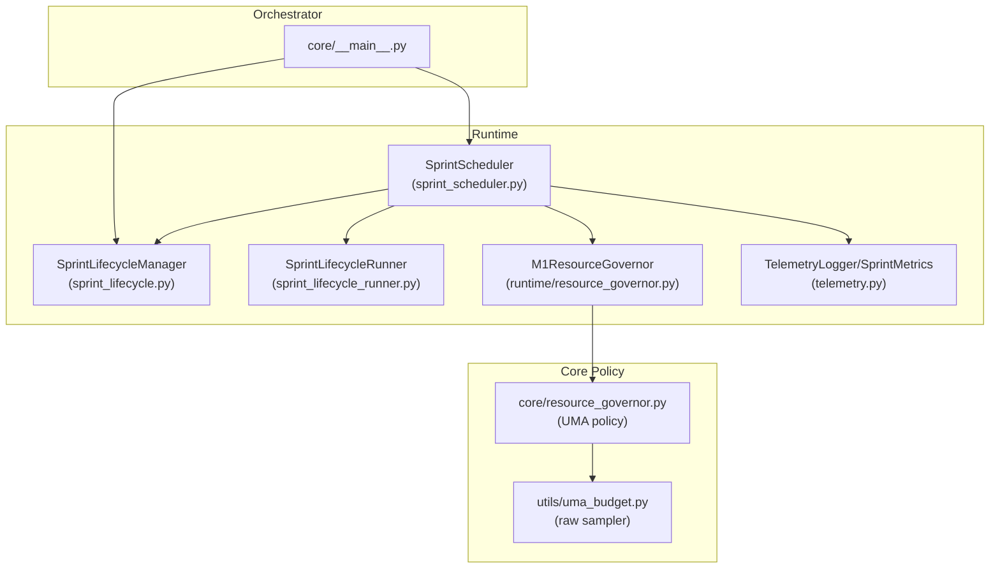
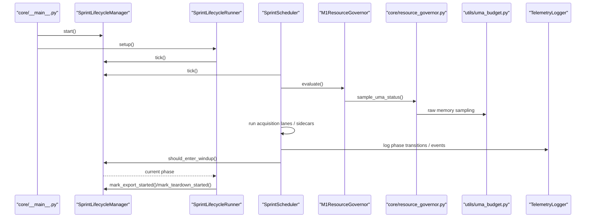
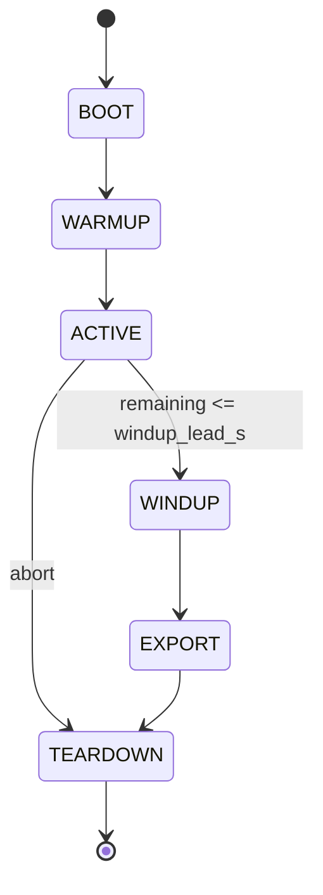
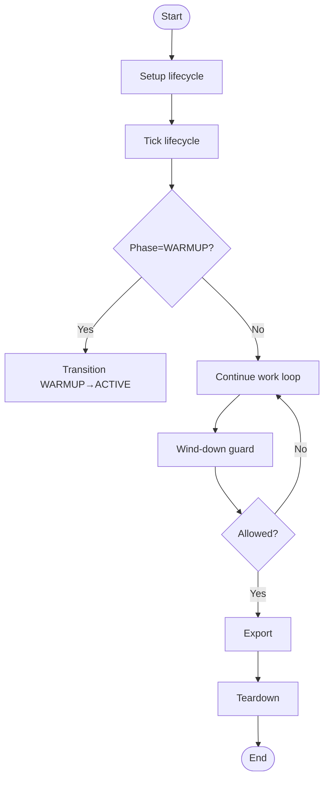
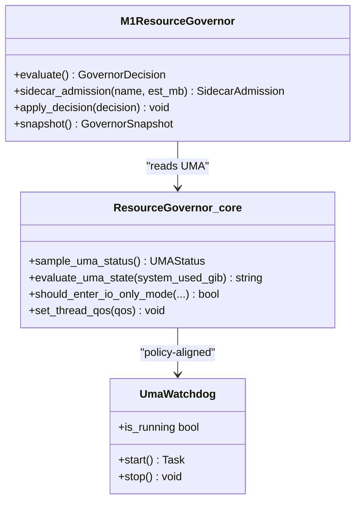
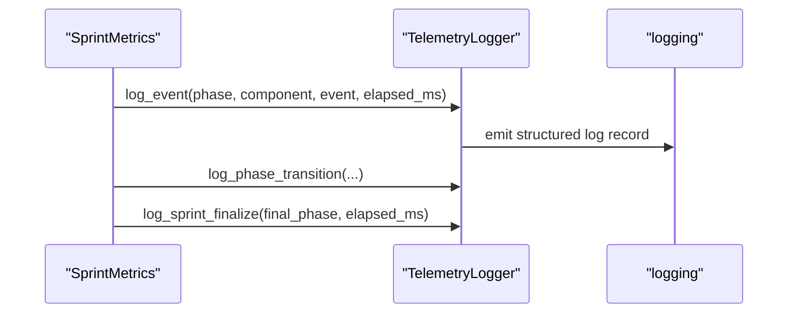
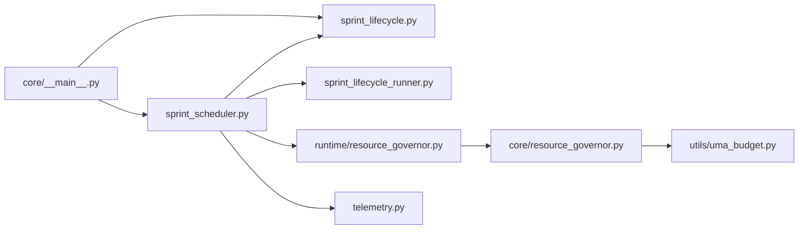

# Runtime Management

<cite>
**Referenced Files in This Document**
- [sprint_scheduler.py](file://hledac/universal/runtime/sprint_scheduler.py)
- [sprint_lifecycle.py](file://hledac/universal/runtime/sprint_lifecycle.py)
- [sprint_lifecycle_runner.py](file://hledac/universal/runtime/sprint_lifecycle_runner.py)
- [resource_governor.py](file://hledac/universal/runtime/resource_governor.py)
- [memory_authority.py](file://hledac/universal/runtime/memory_authority.py)
- [telemetry.py](file://hledac/universal/runtime/telemetry.py)
- [core_resource_governor.py](file://hledac/universal/core/resource_governor.py)
- [utils_uma_budget.py](file://hledac/universal/utils/uma_budget.py)
- [__main__.py](file://hledac/universal/core/__main__.py)
</cite>

## Table of Contents
1. [Introduction](#introduction)
2. [Project Structure](#project-structure)
3. [Core Components](#core-components)
4. [Architecture Overview](#architecture-overview)
5. [Detailed Component Analysis](#detailed-component-analysis)
6. [Dependency Analysis](#dependency-analysis)
7. [Performance Considerations](#performance-considerations)
8. [Troubleshooting Guide](#troubleshooting-guide)
9. [Conclusion](#conclusion)
10. [Appendices](#appendices)

## Introduction
This document describes the runtime management system of Hledac Universal with a focus on the sprint scheduler, resource governance, memory authority controls, telemetry collection, sprint lifecycle management, and state persistence strategies. It explains how the system coordinates bounded 30-minute sprints, manages memory and concurrency under pressure, and provides structured telemetry for observability. It also covers configuration options, performance tuning, debugging techniques, and production deployment considerations.

## Project Structure
The runtime management system spans several modules:
- Runtime orchestrators: sprint lifecycle manager and scheduler runner
- Resource governance: runtime advisor and canonical memory policy
- Telemetry: structured logging and event collection
- Utilities: raw memory sampling and watchdog services
- Orchestration entry point: core main that wires lifecycle and scheduler

**Diagram sources**
- [sprint_scheduler.py:1-120](file://hledac/universal/runtime/sprint_scheduler.py#L1-L120)
- [sprint_lifecycle.py:1-120](file://hledac/universal/runtime/sprint_lifecycle.py#L1-L120)
- [sprint_lifecycle_runner.py:1-120](file://hledac/universal/runtime/sprint_lifecycle_runner.py#L1-L120)
- [resource_governor.py:1-120](file://hledac/universal/runtime/resource_governor.py#L1-L120)
- [core_resource_governor.py:1-120](file://hledac/universal/core/resource_governor.py#L1-L120)
- [utils_uma_budget.py:1-120](file://hledac/universal/utils/uma_budget.py#L1-L120)
- [__main__.py:1000-1150](file://hledac/universal/core/__main__.py#L1000-L1150)

**Section sources**
- [sprint_scheduler.py:1-120](file://hledac/universal/runtime/sprint_scheduler.py#L1-L120)
- [sprint_lifecycle.py:1-120](file://hledac/universal/runtime/sprint_lifecycle.py#L1-L120)
- [sprint_lifecycle_runner.py:1-120](file://hledac/universal/runtime/sprint_lifecycle_runner.py#L1-L120)
- [resource_governor.py:1-120](file://hledac/universal/runtime/resource_governor.py#L1-L120)
- [core_resource_governor.py:1-120](file://hledac/universal/core/resource_governor.py#L1-L120)
- [utils_uma_budget.py:1-120](file://hledac/universal/utils/uma_budget.py#L1-L120)
- [__main__.py:1000-1150](file://hledac/universal/core/__main__.py#L1000-L1150)

## Core Components
- SprintLifecycleManager: state machine controlling BOOT→WARMUP→ACTIVE→WINDUP→EXPORT→TEARDOWN with hard invariants and time-based transitions.
- SprintLifecycleRunner: lifecycle orchestration helper that starts lifecycle, advances tick, guards wind-down, sleeps with lifecycle ticks, and performs teardown.
- SprintScheduler: runtime worker that executes acquisition lanes, sidecars, advisory gates, and exports according to lifecycle and governor advice.
- M1ResourceGovernor: advisory safety layer that evaluates UMA state, model lifecycle, and fetch concurrency to decide safe operating modes.
- TelemetryLogger/SprintMetrics: structured logging and event collection for phase transitions, events, and finalization.
- UMA policy and raw sampler: canonical policy in core/resource_governor.py and raw sampling in utils/uma_budget.py.

**Section sources**
- [sprint_lifecycle.py:54-240](file://hledac/universal/runtime/sprint_lifecycle.py#L54-L240)
- [sprint_lifecycle_runner.py:38-120](file://hledac/universal/runtime/sprint_lifecycle_runner.py#L38-L120)
- [sprint_scheduler.py:620-800](file://hledac/universal/runtime/sprint_scheduler.py#L620-L800)
- [resource_governor.py:116-220](file://hledac/universal/runtime/resource_governor.py#L116-L220)
- [telemetry.py:107-245](file://hledac/universal/runtime/telemetry.py#L107-L245)
- [core_resource_governor.py:388-490](file://hledac/universal/core/resource_governor.py#L388-L490)
- [utils_uma_budget.py:253-311](file://hledac/universal/utils/uma_budget.py#L253-L311)

## Architecture Overview
The runtime architecture centers on a bounded sprint with a strict lifecycle and advisory resource governance. The scheduler runs acquisition lanes and sidecars, guided by the lifecycle manager and the resource governor. Telemetry records structured events for observability. The canonical UMA policy resides in core/resource_governor.py, while utils/uma_budget.py provides raw sampling.

**Diagram sources**
- [__main__.py:1090-1150](file://hledac/universal/core/__main__.py#L1090-L1150)
- [sprint_lifecycle.py:82-178](file://hledac/universal/runtime/sprint_lifecycle.py#L82-L178)
- [sprint_lifecycle_runner.py:62-120](file://hledac/universal/runtime/sprint_lifecycle_runner.py#L62-L120)
- [sprint_scheduler.py:1-120](file://hledac/universal/runtime/sprint_scheduler.py#L1-L120)
- [resource_governor.py:137-217](file://hledac/universal/runtime/resource_governor.py#L137-L217)
- [core_resource_governor.py:388-488](file://hledac/universal/core/resource_governor.py#L388-L488)
- [utils_uma_budget.py:182-282](file://hledac/universal/utils/uma_budget.py#L182-L282)
- [telemetry.py:153-215](file://hledac/universal/runtime/telemetry.py#L153-L215)

## Detailed Component Analysis

### Sprint Lifecycle Management
- Phases: BOOT, WARMUP, ACTIVE, WINDUP, EXPORT, TEARDOWN.
- Hard invariants: T-3 minute wind-down, monotonic phase progression, abort shortcut to TEARDOWN.
- Timekeeping: uses time.monotonic(); tick() automatically enters WINDUP when remaining time ≤ windup_lead_s.
- Tool mode recommendation: based on remaining time and thermal state.
- Snapshot and compatibility aliases for migration from legacy APIs.

**Diagram sources**
- [sprint_lifecycle.py:21-49](file://hledac/universal/runtime/sprint_lifecycle.py#L21-L49)
- [sprint_lifecycle.py:110-146](file://hledac/universal/runtime/sprint_lifecycle.py#L110-L146)
- [sprint_lifecycle.py:210-231](file://hledac/universal/runtime/sprint_lifecycle.py#L210-L231)

**Section sources**
- [sprint_lifecycle.py:54-240](file://hledac/universal/runtime/sprint_lifecycle.py#L54-L240)
- [sprint_lifecycle.py:208-231](file://hledac/universal/runtime/sprint_lifecycle.py#L208-L231)

### Sprint Scheduler and Lifecycle Runner
- Scheduler responsibilities: lifecycle adapter, acquisition lanes, sidecars, advisory evaluation, export, dedup/forensics flush, result bookkeeping.
- LifecycleRunner responsibilities: lifecycle start, WARMUP→ACTIVE transition, periodic tick, wind-down guard, sleep with lifecycle tick, teardown, partial export trigger.
- Wind-down guard supports a pre-windup barrier callback to ensure required lanes reach terminality before wind-down.

**Diagram sources**
- [sprint_lifecycle_runner.py:62-120](file://hledac/universal/runtime/sprint_lifecycle_runner.py#L62-L120)
- [sprint_lifecycle_runner.py:101-206](file://hledac/universal/runtime/sprint_lifecycle_runner.py#L101-L206)
- [sprint_scheduler.py:1-120](file://hledac/universal/runtime/sprint_scheduler.py#L1-L120)

**Section sources**
- [sprint_lifecycle_runner.py:38-120](file://hledac/universal/runtime/sprint_lifecycle_runner.py#L38-L120)
- [sprint_lifecycle_runner.py:101-206](file://hledac/universal/runtime/sprint_lifecycle_runner.py#L101-L206)
- [sprint_scheduler.py:1-120](file://hledac/universal/runtime/sprint_scheduler.py#L1-L120)

### Resource Governance and Memory Authority Controls
- M1ResourceGovernor: advisory layer evaluating UMA state, model lifecycle, and fetch concurrency; provides sidecar admission decisions.
- Canonical UMA policy: core/resource_governor.py computes state from system_used_gib, hysteresis-based I/O-only mode, and thread QoS hints.
- Raw sampler: utils/uma_budget.py provides system RAM and MLX memory sampling, pressure levels, and watchdog with callbacks.
- Memory authority classification: canonical governor vs raw sampler vs layer/allocator/legacy roles.

**Diagram sources**
- [resource_governor.py:116-220](file://hledac/universal/runtime/resource_governor.py#L116-L220)
- [core_resource_governor.py:388-488](file://hledac/universal/core/resource_governor.py#L388-L488)
- [utils_uma_budget.py:380-496](file://hledac/universal/utils/uma_budget.py#L380-L496)

**Section sources**
- [resource_governor.py:116-220](file://hledac/universal/runtime/resource_governor.py#L116-L220)
- [core_resource_governor.py:314-372](file://hledac/universal/core/resource_governor.py#L314-L372)
- [utils_uma_budget.py:182-282](file://hledac/universal/utils/uma_budget.py#L182-L282)
- [memory_authority.py:37-79](file://hledac/universal/runtime/memory_authority.py#L37-L79)

### Telemetry Collection System
- TelemetryLogger: fail-soft structured logging with JSON formatter; records phase transitions, events, and finalization.
- SprintMetrics: wraps TelemetryLogger to record phase_entered, phase transitions, and sprint finalize.
- Event history bounded by a ring buffer; all methods are void and swallow errors.

**Diagram sources**
- [telemetry.py:107-245](file://hledac/universal/runtime/telemetry.py#L107-L245)
- [telemetry.py:248-370](file://hledac/universal/runtime/telemetry.py#L248-L370)

**Section sources**
- [telemetry.py:107-245](file://hledac/universal/runtime/telemetry.py#L107-L245)
- [telemetry.py:248-370](file://hledac/universal/runtime/telemetry.py#L248-L370)

### State Persistence Strategies
- Lifecycle snapshot: JSON-serializable dict capturing current state, phase history, and flags for diagnostics.
- Telemetry events: bounded ring buffer persisted via structured logs; can be aggregated externally.
- No explicit persistence hooks in the scheduler; persistence is achieved through lifecycle snapshots and telemetry logs.

**Section sources**
- [sprint_lifecycle.py:182-206](file://hledac/universal/runtime/sprint_lifecycle.py#L182-L206)
- [telemetry.py:123-150](file://hledac/universal/runtime/telemetry.py#L123-L150)

## Dependency Analysis
- Scheduler depends on lifecycle manager, lifecycle runner, governor, telemetry, and acquisition/bridge modules.
- Governor depends on canonical UMA policy and raw sampler.
- Lifecycle runner depends on lifecycle adapter and optional pre-windup barrier callback.
- Orchestration entry point wires lifecycle and scheduler.

**Diagram sources**
- [sprint_scheduler.py:1-120](file://hledac/universal/runtime/sprint_scheduler.py#L1-L120)
- [sprint_lifecycle.py:1-120](file://hledac/universal/runtime/sprint_lifecycle.py#L1-L120)
- [sprint_lifecycle_runner.py:1-120](file://hledac/universal/runtime/sprint_lifecycle_runner.py#L1-L120)
- [resource_governor.py:1-120](file://hledac/universal/runtime/resource_governor.py#L1-L120)
- [core_resource_governor.py:1-120](file://hledac/universal/core/resource_governor.py#L1-L120)
- [utils_uma_budget.py:1-120](file://hledac/universal/utils/uma_budget.py#L1-L120)
- [telemetry.py:1-120](file://hledac/universal/runtime/telemetry.py#L1-L120)
- [__main__.py:1000-1150](file://hledac/universal/core/__main__.py#L1000-L1150)

**Section sources**
- [sprint_scheduler.py:1-120](file://hledac/universal/runtime/sprint_scheduler.py#L1-L120)
- [sprint_lifecycle.py:1-120](file://hledac/universal/runtime/sprint_lifecycle.py#L1-L120)
- [sprint_lifecycle_runner.py:1-120](file://hledac/universal/runtime/sprint_lifecycle_runner.py#L1-L120)
- [resource_governor.py:1-120](file://hledac/universal/runtime/resource_governor.py#L1-L120)
- [core_resource_governor.py:1-120](file://hledac/universal/core/resource_governor.py#L1-L120)
- [utils_uma_budget.py:1-120](file://hledac/universal/utils/uma_budget.py#L1-L120)
- [telemetry.py:1-120](file://hledac/universal/runtime/telemetry.py#L1-L120)
- [__main__.py:1000-1150](file://hledac/universal/core/__main__.py#L1000-L1150)

## Performance Considerations
- Concurrency and fetch limits: governor adjusts fetch concurrency based on UMA state and model load; defaults and reduced limits are defined for M1 8GB.
- I/O-only mode hysteresis: prevents thrashing near critical boundaries; accelerates entry under systemic pressure (swap).
- Thermal and device temperature guards: optional GPU thermal and ANE utilization checks in resource governor.
- Mission budget: hard ceiling for peak RSS in M1 missions; sidecar admission considers estimated memory footprint.
- Telemetry overhead: bounded event history and fail-soft logging minimize performance impact.

[No sources needed since this section provides general guidance]

## Troubleshooting Guide
Common issues and remedies:
- Memory pressure and governor denials:
  - Symptoms: renderer denied, model load denied, reduced concurrency.
  - Actions: inspect governor snapshot, review UMA state, reduce sidecar memory estimates, or wait for hysteresis exit.
- Wind-down guard blocking:
  - Symptoms: scheduler continues work despite wind-down threshold.
  - Actions: ensure pre-windup barrier callback completes required lanes; verify callback execution and reasons.
- Telemetry failures:
  - Symptoms: missing events or formatting errors.
  - Actions: confirm JSON formatter handler setup; note that failures are swallowed by design.
- Lifecycle errors:
  - Symptoms: invalid phase transitions or abort not reaching TEARDOWN.
  - Actions: verify lifecycle transitions and abort requests; ensure proper teardown sequencing.

**Section sources**
- [resource_governor.py:301-320](file://hledac/universal/runtime/resource_governor.py#L301-L320)
- [sprint_lifecycle_runner.py:101-206](file://hledac/universal/runtime/sprint_lifecycle_runner.py#L101-L206)
- [telemetry.py:138-150](file://hledac/universal/runtime/telemetry.py#L138-L150)
- [sprint_lifecycle.py:92-106](file://hledac/universal/runtime/sprint_lifecycle.py#L92-L106)
- [sprint_lifecycle.py:149-158](file://hledac/universal/runtime/sprint_lifecycle.py#L149-L158)

## Conclusion
Hledac Universal’s runtime management system provides a robust, bounded sprint execution model with strict lifecycle guarantees, advisory resource governance, and structured telemetry. The separation of canonical UMA policy, raw sampling, and runtime scheduler enables predictable performance on constrained platforms like M1 8GB, while maintaining observability and recoverability.

[No sources needed since this section summarizes without analyzing specific files]

## Appendices

### Configuration Options and Tuning Parameters
- SprintSchedulerConfig:
  - sprint_duration_s, windup_lead_s, cycle_sleep_s, max_cycles, max_parallel_sources, stop_on_first_accepted, export_enabled, export_dir, max_entries_per_cycle, max_hypothesis_depth, max_hypothesis_queries, aggressive_mode, aggressive_branch_timeout_s, branch_timeout_budget_s, tier_of(), sorted_tiers().
- M1ResourceGovernor:
  - DEFAULT_FETCH_LIMIT, MODEL_LOADED_FETCH_LIMIT, MISSION_PEAK_RSS_GIB, SIDECAR_DEFAULT_ESTIMATE_MB, HEAVY_SIDECARS, MAX_BUDGET_EVENTS.
- UMA policy thresholds (M1 8GB):
  - WARN: 6.0 GiB, CRITICAL: 6.5 GiB, EMERGENCY: 7.0 GiB; IO-only hysteresis exit at 5.8 GiB.
- Tool mode recommendations:
  - normal/prune/panic based on remaining time and thermal state.

**Section sources**
- [sprint_scheduler.py:623-660](file://hledac/universal/runtime/sprint_scheduler.py#L623-L660)
- [resource_governor.py:52-60](file://hledac/universal/runtime/resource_governor.py#L52-L60)
- [core_resource_governor.py:56-66](file://hledac/universal/core/resource_governor.py#L56-L66)
- [sprint_lifecycle.py:210-231](file://hledac/universal/runtime/sprint_lifecycle.py#L210-L231)

### Monitoring Setup
- TelemetryLogger: structured JSON logs with session_id, phase, component, event, elapsed_ms.
- SprintMetrics: records phase_entered, phase transitions, and finalize events.
- UMA watchdog: debounced callbacks for warn/critical/emergency states.

**Section sources**
- [telemetry.py:107-245](file://hledac/universal/runtime/telemetry.py#L107-L245)
- [utils_uma_budget.py:380-496](file://hledac/universal/utils/uma_budget.py#L380-L496)

### Examples and Debugging Techniques
- Runtime customization:
  - Adjust fetch concurrency via governor decisions; tune aggressive_mode and branch timeouts for throughput vs stability.
  - Modify source tier mapping and acquisition profile for targeted runs.
- Debugging:
  - Inspect governor snapshot and UMA status; review telemetry events and lifecycle snapshots.
  - Use wind-down guard observations to diagnose pre-windup barrier callback outcomes.

**Section sources**
- [resource_governor.py:301-320](file://hledac/universal/runtime/resource_governor.py#L301-L320)
- [core_resource_governor.py:388-488](file://hledac/universal/core/resource_governor.py#L388-L488)
- [sprint_lifecycle_runner.py:101-206](file://hledac/universal/runtime/sprint_lifecycle_runner.py#L101-L206)
- [telemetry.py:217-244](file://hledac/universal/runtime/telemetry.py#L217-L244)

### Fault Tolerance and Recovery
- Abort path: lifecycle can transition directly to TEARDOWN upon abort request; teardown sequences ensure orderly shutdown.
- Fail-soft telemetry and governor: errors are swallowed to maintain runtime continuity.
- I/O-only mode hysteresis: prevents oscillation near critical thresholds.

**Section sources**
- [sprint_lifecycle.py:98-100](file://hledac/universal/runtime/sprint_lifecycle.py#L98-L100)
- [sprint_lifecycle.py:234-240](file://hledac/universal/runtime/sprint_lifecycle.py#L234-L240)
- [resource_governor.py:178-204](file://hledac/universal/runtime/resource_governor.py#L178-L204)
- [core_resource_governor.py:339-372](file://hledac/universal/core/resource_governor.py#L339-L372)

### Production Deployment Considerations
- Mission budget: enforce peak RSS ceilings; monitor sidecar admission decisions.
- Platform specifics: QoS hints and swap-based acceleration for I/O-only mode.
- Observability: rely on telemetry and lifecycle snapshots; ensure logging handler is attached.

**Section sources**
- [resource_governor.py:56-60](file://hledac/universal/runtime/resource_governor.py#L56-L60)
- [core_resource_governor.py:636-668](file://hledac/universal/core/resource_governor.py#L636-L668)
- [telemetry.py:138-150](file://hledac/universal/runtime/telemetry.py#L138-L150)