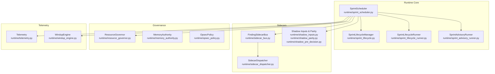
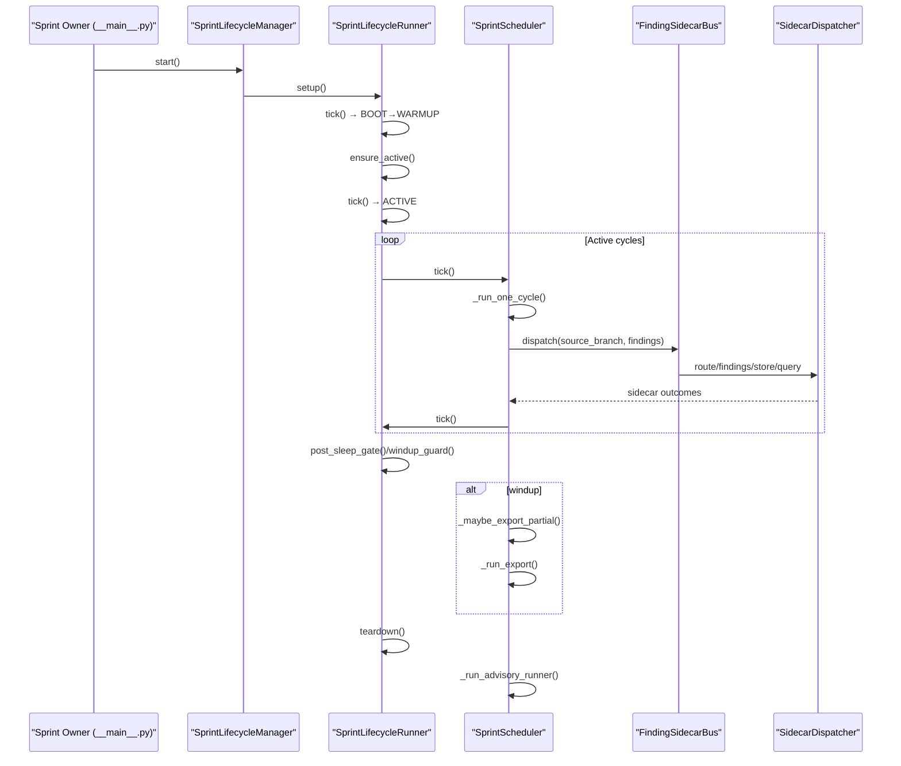
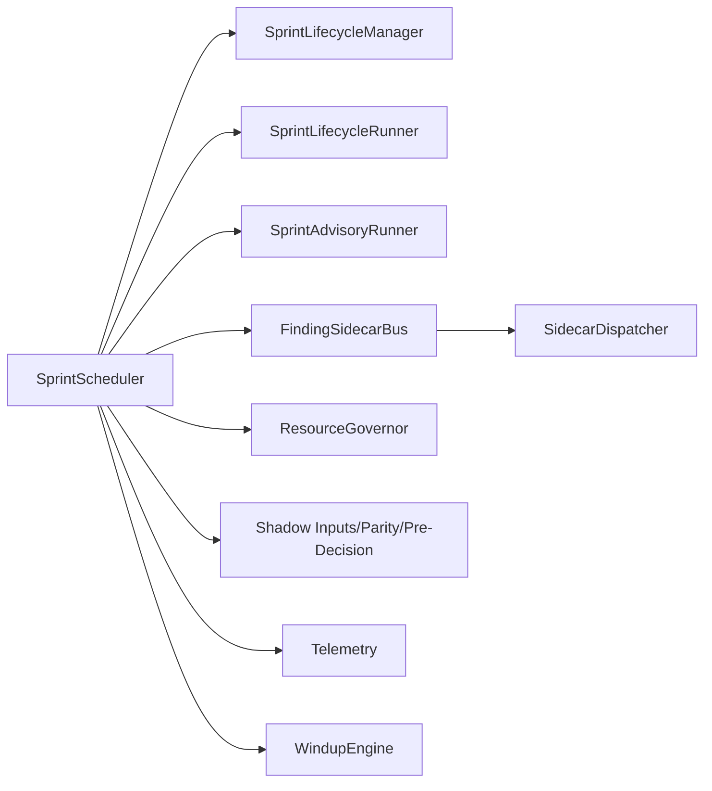

# Runtime Management

<cite>
**Referenced Files in This Document**
- [sprint_scheduler.py](file://runtime/sprint_scheduler.py)
- [sprint_lifecycle.py](file://runtime/sprint_lifecycle.py)
- [sprint_lifecycle_runner.py](file://runtime/sprint_lifecycle_runner.py)
- [sprint_advisory_runner.py](file://runtime/sprint_advisory_runner.py)
- [resource_governor.py](file://runtime/resource_governor.py)
- [sidecar_bus.py](file://runtime/sidecar_bus.py)
- [sidecar_dispatcher.py](file://runtime/sidecar_dispatcher.py)
- [shadow_inputs.py](file://runtime/shadow_inputs.py)
- [shadow_parity.py](file://runtime/shadow_parity.py)
- [shadow_pre_decision.py](file://runtime/shadow_pre_decision.py)
- [telemetry.py](file://runtime/telemetry.py)
- [windup_engine.py](file://runtime/windup_engine.py)
- [opsec_policy.py](file://runtime/opsec_policy.py)
- [memory_authority.py](file://runtime/memory_authority.py)
- [hypothesis_feedback.py](file://runtime/hypothesis_feedback.py)
- [__main__.py](file://core/__main__.py)
</cite>

## Table of Contents
1. [Introduction](#introduction)
2. [Project Structure](#project-structure)
3. [Core Components](#core-components)
4. [Architecture Overview](#architecture-overview)
5. [Detailed Component Analysis](#detailed-component-analysis)
6. [Dependency Analysis](#dependency-analysis)
7. [Performance Considerations](#performance-considerations)
8. [Troubleshooting Guide](#troubleshooting-guide)
9. [Conclusion](#conclusion)

## Introduction
This document explains the runtime management subsystem responsible for orchestrating bounded, lifecycle-aware research sprints. It covers the sprint scheduler, lifecycle management, advisory functions, resource governance, and sidecar-based enrichment. The goal is to help both newcomers and experienced engineers understand how the system coordinates data ingestion, quality gates, sidecar processing, and export, while respecting memory and time budgets.

## Project Structure
The runtime management subsystem centers around the sprint scheduler and its collaborators:
- Sprint scheduler: orchestrates feed/public/CT discovery cycles, applies tiered priorities, and manages lifecycle transitions.
- Lifecycle manager and runner: define phases, enforce timing, and coordinate wind-down and teardown.
- Advisory runner: performs pivot planning, execution, resource governance advisory, and analyst brief generation.
- Sidecar bus and dispatcher: route accepted findings to specialized enrichment adapters.
- Resource governor: provides advisory decisions for concurrency and budgeting.
- Shadow inputs and parity: enable diagnostic-only evaluation of pre-decision and advisory gates.
- Telemetry and metrics: capture runtime telemetry and diagnostics.

**Diagram sources**
- [sprint_scheduler.py](file://runtime/sprint_scheduler.py)
- [sprint_lifecycle.py](file://runtime/sprint_lifecycle.py)
- [sprint_lifecycle_runner.py](file://runtime/sprint_lifecycle_runner.py)
- [sprint_advisory_runner.py](file://runtime/sprint_advisory_runner.py)
- [sidecar_bus.py](file://runtime/sidecar_bus.py)
- [sidecar_dispatcher.py](file://runtime/sidecar_dispatcher.py)
- [shadow_inputs.py](file://runtime/shadow_inputs.py)
- [shadow_parity.py](file://runtime/shadow_parity.py)
- [shadow_pre_decision.py](file://runtime/shadow_pre_decision.py)
- [resource_governor.py](file://runtime/resource_governor.py)
- [memory_authority.py](file://runtime/memory_authority.py)
- [opsec_policy.py](file://runtime/opsec_policy.py)
- [telemetry.py](file://runtime/telemetry.py)
- [windup_engine.py](file://runtime/windup_engine.py)

**Section sources**
- [sprint_scheduler.py](file://runtime/sprint_scheduler.py)
- [sprint_lifecycle.py](file://runtime/sprint_lifecycle.py)
- [sprint_lifecycle_runner.py](file://runtime/sprint_lifecycle_runner.py)
- [sprint_advisory_runner.py](file://runtime/sprint_advisory_runner.py)
- [sidecar_bus.py](file://runtime/sidecar_bus.py)
- [sidecar_dispatcher.py](file://runtime/sidecar_dispatcher.py)
- [shadow_inputs.py](file://runtime/shadow_inputs.py)
- [shadow_parity.py](file://runtime/shadow_parity.py)
- [shadow_pre_decision.py](file://runtime/shadow_pre_decision.py)
- [resource_governor.py](file://runtime/resource_governor.py)
- [memory_authority.py](file://runtime/memory_authority.py)
- [opsec_policy.py](file://runtime/opsec_policy.py)
- [telemetry.py](file://runtime/telemetry.py)
- [windup_engine.py](file://runtime/windup_engine.py)

## Core Components
- SprintScheduler: tier-aware scheduler that runs bounded cycles under a lifecycle, supports stable and aggressive modes, and coordinates sidecars and exports.
- SprintLifecycleManager and SprintLifecycleRunner: define phases (BOOT, WARMUP, ACTIVE, JUDGMENT, EXPORT, TEARDOWN), enforce timing, and manage transitions.
- SprintAdvisoryRunner: executes pivot planning, pivot execution, resource governor advisory, and analyst brief generation.
- FindingSidecarBus and SidecarDispatcher: canonical bus for accepted findings and dispatcher for sidecar execution.
- ResourceGovernor: provides advisory concurrency and budget decisions.
- Shadow inputs/parity/pre-decision: diagnostic-only evaluation of advisory gates and pre-decision composition.
- Telemetry and metrics: runtime telemetry capture and windup scorecard extraction.

**Section sources**
- [sprint_scheduler.py](file://runtime/sprint_scheduler.py)
- [sprint_lifecycle.py](file://runtime/sprint_lifecycle.py)
- [sprint_lifecycle_runner.py](file://runtime/sprint_lifecycle_runner.py)
- [sprint_advisory_runner.py](file://runtime/sprint_advisory_runner.py)
- [sidecar_bus.py](file://runtime/sidecar_bus.py)
- [sidecar_dispatcher.py](file://runtime/sidecar_dispatcher.py)
- [resource_governor.py](file://runtime/resource_governor.py)
- [shadow_inputs.py](file://runtime/shadow_inputs.py)
- [shadow_parity.py](file://runtime/shadow_parity.py)
- [shadow_pre_decision.py](file://runtime/shadow_pre_decision.py)
- [telemetry.py](file://runtime/telemetry.py)
- [windup_engine.py](file://runtime/windup_engine.py)

## Architecture Overview
The runtime subsystem is a bounded, lifecycle-driven pipeline:
- Lifecycle controls phases and timing; scheduler runs cycles within ACTIVE and reacts to wind-down.
- Scheduler builds tiered work items, sorts by source economics, and runs feed/public/CT branches.
- Results are aggregated, deduplicated, and routed to sidecars via the sidecar bus.
- Advisory runner evaluates pivot plans and governs resources at teardown.
- Telemetry and windup engine produce diagnostics and scorecards.

**Diagram sources**
- [sprint_scheduler.py](file://runtime/sprint_scheduler.py)
- [sprint_lifecycle.py](file://runtime/sprint_lifecycle.py)
- [sprint_lifecycle_runner.py](file://runtime/sprint_lifecycle_runner.py)
- [sidecar_bus.py](file://runtime/sidecar_bus.py)
- [sidecar_dispatcher.py](file://runtime/sidecar_dispatcher.py)
- [__main__.py](file://core/__main__.py)

## Detailed Component Analysis

### Sprint Scheduler
The sprint scheduler is the runtime worker that executes bounded cycles under a lifecycle. It:
- Normalizes lifecycle APIs via a lifecycle adapter.
- Builds tiered work items and sorts them by source economics and advisory prefetch oracle.
- Runs feed/public/CT branches in stable or aggressive mode with per-branch timeouts.
- Manages deduplication (LMDB), sidecar dispatch, and export.
- Tracks metrics and telemetry, and supports early wind-up and abort triggers.

Key configuration options:
- sprint_duration_s: total sprint duration (default 1800s)
- windup_lead_s: lead time to enter wind-down (default 180s)
- cycle_sleep_s: sleep between cycles (default 5s)
- max_cycles: safety cap (default 100)
- max_parallel_sources: concurrent source fetches (default 4)
- stop_on_first_accepted: early exit when first finding accepted (default False)
- export_enabled/export_dir: export control and path
- max_entries_per_cycle: per-source cap (default 50)
- aggressive_mode/aggressive_branch_timeout_s/branch_timeout_budget_s: aggressive mode controls
- partial_export_findings_interval: partial export cadence
- source_tier_map: tier assignment for sources

Result fields include cycle counts, dedup stats, pattern hits, accepted findings, per-source breakdowns, final phase, export paths, abort flags, and sidecar-derived metrics.

Operational semantics:
- Legacy runtime mode is default; shadow modes are diagnostic-only.
- Advisory gate and shadow pre-decision are evaluated at wind-down entry.
- Hermes engine prewarm/unload respects M1 8GB memory invariants.

Usage patterns:
- run(lifecycle, sources, now_monotonic, query, duckdb_store, ct_log_client, policy_manager, progress_callback)
- _run_one_cycle(_stable/_aggressive)
- _dispatch_accepted_findings_sidecars
- request_early_windup/request_immediate_abort

**Section sources**
- [sprint_scheduler.py](file://runtime/sprint_scheduler.py)

#### Source Economics and Prioritization
- Per-source state includes silent streak, cooldown, and recent health posture.
- Sorting considers tier, posture, cooldown, and advisory prefetch oracle scores.
- Deprioritization pushes cold/silent sources to the end of their tier band.

**Section sources**
- [sprint_scheduler.py](file://runtime/sprint_scheduler.py)

#### Aggressive vs Stable Modes
- Stable mode: feed sources first, then public discovery in the same cycle.
- Aggressive mode: feed/public/CT branches run concurrently with per-branch timeouts; slow branches are cancelled without affecting others.

**Section sources**
- [sprint_scheduler.py](file://runtime/sprint_scheduler.py)

#### Sidecar Dispatch and Canonical Bus
- Accepted findings are routed through FindingSidecarBus and SidecarDispatcher.
- Dispatcher aggregates batches, tracks skipped heavy sidecars, and handles failures fail-soft.
- Sidecars include identity stitching, exposure correlation, leak sentinel, temporal archaeology, evidence triage, sprint diff, kill chain tagging, streaming embedding, Wayback diff, RIR/ASN/WHOIS correlation, and social identity surface mining.

**Section sources**
- [sprint_scheduler.py](file://runtime/sprint_scheduler.py)
- [sidecar_bus.py](file://runtime/sidecar_bus.py)
- [sidecar_dispatcher.py](file://runtime/sidecar_dispatcher.py)

#### Deduplication and Persistence
- Cross-sprint dedup via LMDB with periodic trimming to prevent unbounded growth.
- In-sprint dedup uses an in-memory set keyed by entry hash.
- Dedup flush occurs at wind-down; close operations occur at teardown.

**Section sources**
- [sprint_scheduler.py](file://runtime/sprint_scheduler.py)

#### Hypothesis Feedback and RL Adaptivity
- Records pivot outcomes as reward signals and adapts pivot ordering via exponential moving average.
- Records hypothesis feedback to DuckDB for future pivot planning.

**Section sources**
- [sprint_scheduler.py](file://runtime/sprint_scheduler.py)
- [hypothesis_feedback.py](file://runtime/hypothesis_feedback.py)

### Lifecycle Management
Lifecycle phases and transitions:
- BOOT → WARMUP → ACTIVE → JUDGMENT → EXPORT → TEARDOWN
- Runner enforces timing, wind-down, sleep-or-abort, and terminal checks.
- Adapter normalizes lifecycle APIs between old utils and runtime versions.

Key methods:
- start(), tick(), remaining_time(), is_terminal(), should_enter_windup(), _current_phase
- recommended_tool_mode(), request_abort(), _abort_requested, _abort_reason
- mark_warmup_done()

**Section sources**
- [sprint_lifecycle.py](file://runtime/sprint_lifecycle.py)
- [sprint_lifecycle_runner.py](file://runtime/sprint_lifecycle_runner.py)
- [sprint_scheduler.py](file://runtime/sprint_scheduler.py)

### Advisory Functions
Advisory runner orchestrates:
- Pivot planner: advisory ordering input for pivots.
- Pivot executor: executes top pivots via autonomous pivot executor.
- Resource governor advisory: applies resource governor decision at teardown.
- Analyst brief: generates analyst brief at teardown.

**Section sources**
- [sprint_advisory_runner.py](file://runtime/sprint_advisory_runner.py)
- [sprint_scheduler.py](file://runtime/sprint_scheduler.py)

### Resource Governance
- ResourceGovernor provides advisory concurrency and branch concurrency decisions.
- Hermes prewarm respects M1 8GB memory invariants and quantization budget.
- MemoryAuthority and OpsecPolicy integrate with runtime for memory and policy controls.

**Section sources**
- [resource_governor.py](file://runtime/resource_governor.py)
- [sprint_scheduler.py](file://runtime/sprint_scheduler.py)
- [memory_authority.py](file://runtime/memory_authority.py)
- [opsec_policy.py](file://runtime/opsec_policy.py)

### Shadow Inputs, Parity, and Pre-Decision
- Diagnostic-only evaluation of advisory gate at wind-down entry.
- Shadow pre-decision composition and parity checks for read-only diagnostics.
- Shadow inputs collect lifecycle snapshot, graph summary, model control facts, provider runtime facts.

**Section sources**
- [shadow_inputs.py](file://runtime/shadow_inputs.py)
- [shadow_parity.py](file://runtime/shadow_parity.py)
- [shadow_pre_decision.py](file://runtime/shadow_pre_decision.py)
- [sprint_scheduler.py](file://runtime/sprint_scheduler.py)

### Telemetry and Windup Engine
- Telemetry captures runtime telemetry and diagnostics.
- Windup engine provides windup scorecard extraction for export teardown.
- Metrics registry records counters/gauges and persists telemetry.

**Section sources**
- [telemetry.py](file://runtime/telemetry.py)
- [windup_engine.py](file://runtime/windup_engine.py)
- [sprint_scheduler.py](file://runtime/sprint_scheduler.py)

## Dependency Analysis
High-level dependencies:
- SprintScheduler depends on lifecycle manager/runner, sidecar bus/dispatcher, resource governor, shadow inputs/parity/pre-decision, telemetry, and windup engine.
- Sidecar bus/dispatcher depends on DuckDB store and various intelligence adapters.
- Resource governor integrates with UMA sampling and quantization selection.
- Lifecycle adapter bridges runtime/utils lifecycle APIs.

**Diagram sources**
- [sprint_scheduler.py](file://runtime/sprint_scheduler.py)
- [sprint_lifecycle.py](file://runtime/sprint_lifecycle.py)
- [sprint_lifecycle_runner.py](file://runtime/sprint_lifecycle_runner.py)
- [sprint_advisory_runner.py](file://runtime/sprint_advisory_runner.py)
- [sidecar_bus.py](file://runtime/sidecar_bus.py)
- [sidecar_dispatcher.py](file://runtime/sidecar_dispatcher.py)
- [resource_governor.py](file://runtime/resource_governor.py)
- [shadow_inputs.py](file://runtime/shadow_inputs.py)
- [shadow_parity.py](file://runtime/shadow_parity.py)
- [shadow_pre_decision.py](file://runtime/shadow_pre_decision.py)
- [telemetry.py](file://runtime/telemetry.py)
- [windup_engine.py](file://runtime/windup_engine.py)

**Section sources**
- [sprint_scheduler.py](file://runtime/sprint_scheduler.py)
- [sprint_lifecycle.py](file://runtime/sprint_lifecycle.py)
- [sprint_lifecycle_runner.py](file://runtime/sprint_lifecycle_runner.py)
- [sprint_advisory_runner.py](file://runtime/sprint_advisory_runner.py)
- [sidecar_bus.py](file://runtime/sidecar_bus.py)
- [sidecar_dispatcher.py](file://runtime/sidecar_dispatcher.py)
- [resource_governor.py](file://runtime/resource_governor.py)
- [shadow_inputs.py](file://runtime/shadow_inputs.py)
- [shadow_parity.py](file://runtime/shadow_parity.py)
- [shadow_pre_decision.py](file://runtime/shadow_pre_decision.py)
- [telemetry.py](file://runtime/telemetry.py)
- [windup_engine.py](file://runtime/windup_engine.py)

## Performance Considerations
- Concurrency control: max_parallel_sources and branch concurrency limits protect memory and CPU.
- Adaptive timeouts: per-branch timeouts in aggressive mode prevent tail-latency spikes.
- Memory pressure safeguards: Hermes prewarm headroom check, sidecar RAM guards, and metrics-based budget tracking.
- Dedup and persistence: LMDB-based cross-sprint dedup with trimming to cap growth.
- Metrics and telemetry: lightweight telemetry capture avoids overhead on hot path.

[No sources needed since this section provides general guidance]

## Troubleshooting Guide
Common issues and resolutions:
- Excessive branch timeouts in aggressive mode: reduce aggressive_branch_timeout_s or branch_timeout_budget_s; monitor branch_timeout_count and dominant blockers.
- Memory pressure leading to skipped sidecars or Hermes prewarm: check peak_rss_gib and budget_violations; consider disabling heavy sidecars or lowering concurrency.
- Zero-signal sources: review feed_zero_yield_detected, feed_inaccessible_detected, feed_content_empty_detected, and feed_no_pattern_with_content; adjust source tier or prune mode.
- Public backend degraded: investigate public_backend_degraded and public_error; verify public pipeline health.
- Aborted sprints: inspect aborted/abort_reason; check lifecycle abort flags and UMA emergency callbacks.
- Export failures: ensure export_enabled/export_dir are set; verify partial export cadence and wind-down export path.

**Section sources**
- [sprint_scheduler.py](file://runtime/sprint_scheduler.py)

## Conclusion
The runtime management subsystem provides a robust, lifecycle-aware framework for bounded research sprints. It balances throughput with safety via tiered prioritization, source economics, and resource governance. The sidecar bus enables modular enrichment, while telemetry and windup scoring support observability and diagnostics. By understanding the scheduler’s configuration, lifecycle transitions, and advisory flows, teams can operate reliably under strict time and memory constraints.