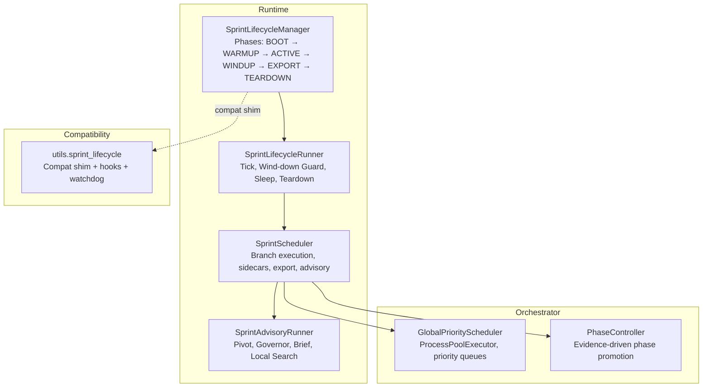
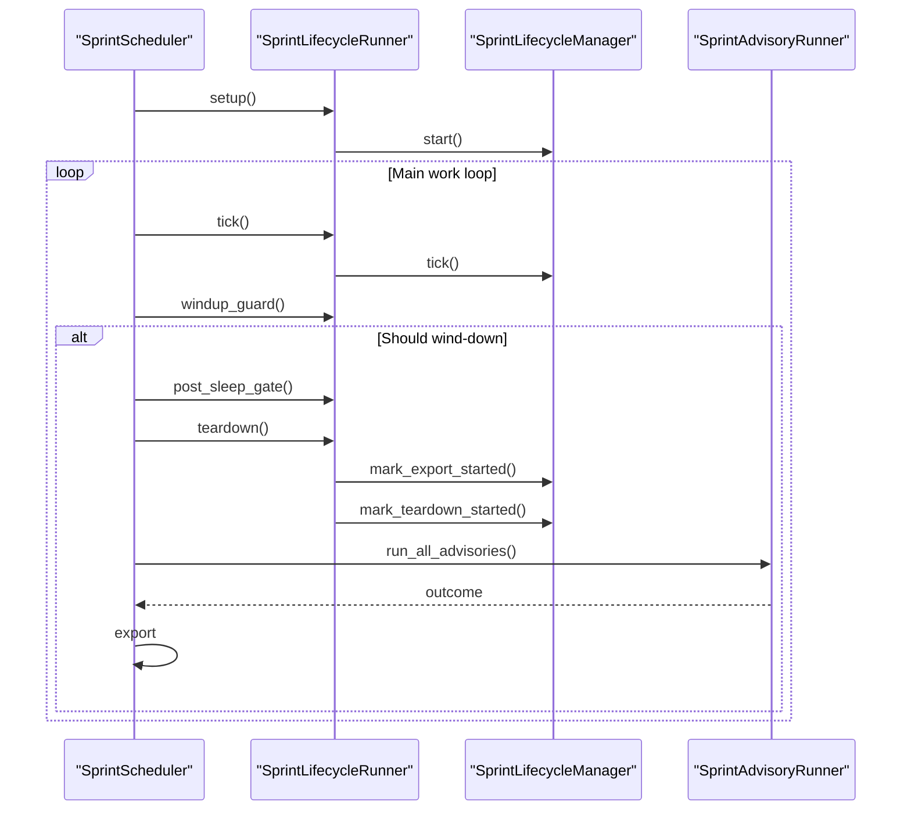
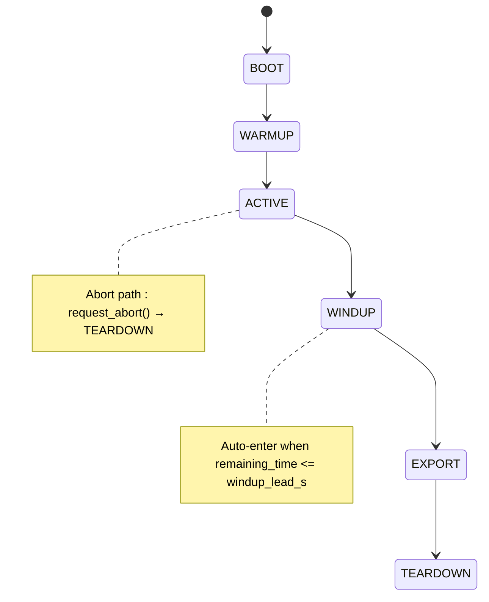
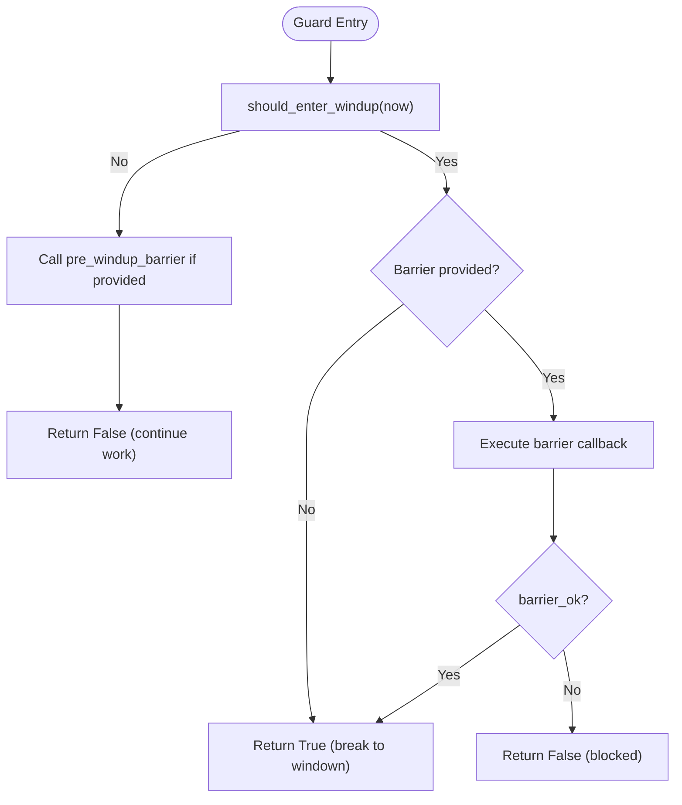
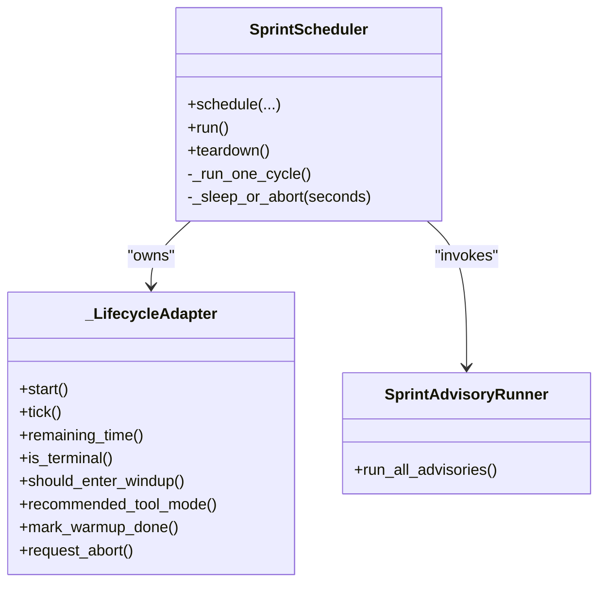
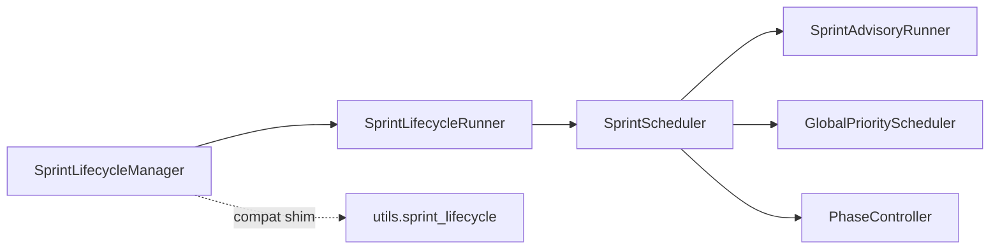

# Sprint Lifecycle Management

<cite>
**Referenced Files in This Document**
- [sprint_lifecycle.py](file://runtime/sprint_lifecycle.py)
- [sprint_lifecycle_runner.py](file://runtime/sprint_lifecycle_runner.py)
- [sprint_scheduler.py](file://runtime/sprint_scheduler.py)
- [sprint_advisory_runner.py](file://runtime/sprint_advisory_runner.py)
- [global_scheduler.py](file://orchestrator/global_scheduler.py)
- [phase_controller.py](file://orchestrator/phase_controller.py)
- [test_sprint_mode_lifecycle_states.py](file://tests/probe_8pc/test_sprint_mode_lifecycle_states.py)
- [test_sprint_lifecycle_remaining_time.py](file://tests/probe_8pc/test_sprint_lifecycle_remaining_time.py)
- [test_sprint_lifecycle_has_warmup.py](file://tests/probe_8vi/test_sprint_lifecycle_has_warmup.py)
- [sprint_lifecycle.py (compat shim)](file://utils/sprint_lifecycle.py)
</cite>

## Table of Contents
1. [Introduction](#introduction)
2. [Project Structure](#project-structure)
3. [Core Components](#core-components)
4. [Architecture Overview](#architecture-overview)
5. [Detailed Component Analysis](#detailed-component-analysis)
6. [Dependency Analysis](#dependency-analysis)
7. [Performance Considerations](#performance-considerations)
8. [Troubleshooting Guide](#troubleshooting-guide)
9. [Conclusion](#conclusion)
10. [Appendices](#appendices)

## Introduction
This document describes the Sprint Lifecycle Management system that governs bounded research cycles. It explains the lifecycle state machine, phase transitions, timing controls, and the coordination between the lifecycle runner, scheduler, and advisory systems. It also covers integration with external schedulers, lifecycle hooks, state persistence mechanisms, configuration parameters, customization examples, debugging approaches, and emergency transitions.

## Project Structure
The lifecycle system spans several modules:
- Runtime lifecycle state machine and runner
- Scheduler orchestration and advisory execution
- Compatibility shim for legacy integrations
- Phase controller for research phases
- Tests validating lifecycle behavior

**Diagram sources**
- [sprint_lifecycle.py:54-531](file://runtime/sprint_lifecycle.py#L54-L531)
- [sprint_lifecycle_runner.py:38-295](file://runtime/sprint_lifecycle_runner.py#L38-L295)
- [sprint_scheduler.py:1-120](file://runtime/sprint_scheduler.py#L1-L120)
- [sprint_advisory_runner.py:130-644](file://runtime/sprint_advisory_runner.py#L130-L644)
- [global_scheduler.py:83-569](file://orchestrator/global_scheduler.py#L83-L569)
- [phase_controller.py:74-407](file://orchestrator/phase_controller.py#L74-L407)
- [sprint_lifecycle.py (compat shim):85-572](file://utils/sprint_lifecycle.py#L85-L572)

**Section sources**
- [sprint_lifecycle.py:1-531](file://runtime/sprint_lifecycle.py#L1-L531)
- [sprint_lifecycle_runner.py:1-295](file://runtime/sprint_lifecycle_runner.py#L1-L295)
- [sprint_scheduler.py:1-120](file://runtime/sprint_scheduler.py#L1-L120)
- [sprint_advisory_runner.py:1-644](file://runtime/sprint_advisory_runner.py#L1-L644)
- [global_scheduler.py:1-569](file://orchestrator/global_scheduler.py#L1-L569)
- [phase_controller.py:1-407](file://orchestrator/phase_controller.py#L1-L407)
- [sprint_lifecycle.py (compat shim):1-572](file://utils/sprint_lifecycle.py#L1-L572)

## Core Components
- SprintLifecycleManager: Canonical state machine with monotonic phase transitions, timing controls, and tool-mode recommendations.
- SprintLifecycleRunner: Lifecycle orchestration helper coordinating ticks, wind-down guard, sleep, and teardown.
- SprintScheduler: Runtime worker that executes branches, sidecars, advisory, and export; coordinates with lifecycle.
- SprintAdvisoryRunner: Executes advisory steps (pivot planning, execution, resource governor, analyst brief, local search).
- GlobalPriorityScheduler: External scheduler integration for distributed processing.
- PhaseController: Evidence-driven phase promotion for research phases (discovery, contradiction, deepen, synthesis).
- Compat shim: Legacy compatibility layer with hooks, watchdog, and checkpoint seam.

**Section sources**
- [sprint_lifecycle.py:54-531](file://runtime/sprint_lifecycle.py#L54-L531)
- [sprint_lifecycle_runner.py:38-295](file://runtime/sprint_lifecycle_runner.py#L38-L295)
- [sprint_scheduler.py:1-120](file://runtime/sprint_scheduler.py#L1-L120)
- [sprint_advisory_runner.py:130-644](file://runtime/sprint_advisory_runner.py#L130-L644)
- [global_scheduler.py:83-569](file://orchestrator/global_scheduler.py#L83-L569)
- [phase_controller.py:74-407](file://orchestrator/phase_controller.py#L74-L407)
- [sprint_lifecycle.py (compat shim):85-572](file://utils/sprint_lifecycle.py#L85-L572)

## Architecture Overview
The lifecycle system centers on a deterministic, monotonic state machine with strict timing controls and observable telemetry. The scheduler delegates lifecycle authority to the lifecycle manager while retaining ownership of branch execution, sidecars, and export. The lifecycle runner encapsulates lifecycle-specific orchestration, including wind-down guards and sleep-with-tick semantics. Advisory execution occurs during teardown, and the compat shim maintains backward compatibility with legacy integrations.

**Diagram sources**
- [sprint_scheduler.py:1-120](file://runtime/sprint_scheduler.py#L1-L120)
- [sprint_lifecycle_runner.py:62-206](file://runtime/sprint_lifecycle_runner.py#L62-L206)
- [sprint_lifecycle.py:82-126](file://runtime/sprint_lifecycle.py#L82-L126)
- [sprint_advisory_runner.py:174-211](file://runtime/sprint_advisory_runner.py#L174-L211)

## Detailed Component Analysis

### SprintLifecycleManager (State Machine)
- Phases: BOOT → WARMUP → ACTIVE → WINDUP → EXPORT → TEARDOWN
- Timing: Uses monotonic time; hard invariant enforces T-3min wind-down window
- Transitions: Monotonic ordering enforced; TEARDOWN is reachable from any phase when abort is requested
- Tool mode: Recommends 'normal'/'prune'/'panic' based on remaining time and thermal state
- Observability: Snapshot exposes configuration, timestamps, and abort flags
- Compatibility aliases: Maintains begin_sprint/mark_warmup_done/request_windup/request_export/request_teardown/is_windup_phase/is_active/is_winding_down for legacy callers

**Diagram sources**
- [sprint_lifecycle.py:21-49](file://runtime/sprint_lifecycle.py#L21-L49)
- [sprint_lifecycle.py:92-126](file://runtime/sprint_lifecycle.py#L92-L126)
- [sprint_lifecycle.py:149-178](file://runtime/sprint_lifecycle.py#L149-L178)

**Section sources**
- [sprint_lifecycle.py:54-531](file://runtime/sprint_lifecycle.py#L54-L531)

### SprintLifecycleRunner (Orchestration Helper)
- Responsibilities: Lifecycle adapter creation, WARMUP→ACTIVE transition, periodic tick, wind-down guard, post-sleep windup gate, sleep-or-abort loop, teardown transitions, partial export trigger
- Wind-down guard: Evaluates should_enter_windup and optional pre-windup barrier callback; records telemetry in last_guard_observation
- Sleep-or-abort: Short-chunked sleep with lifecycle tick; exits early on abort or terminal
- Teardown: Ensures proper WINDUP→EXPORT→TEARDOWN progression or abort-to-TEARDOWN

**Diagram sources**
- [sprint_lifecycle_runner.py:101-206](file://runtime/sprint_lifecycle_runner.py#L101-L206)

**Section sources**
- [sprint_lifecycle_runner.py:38-295](file://runtime/sprint_lifecycle_runner.py#L38-L295)

### SprintScheduler (Runtime Worker)
- Role: Runtime worker; not lifecycle owner; executes branches, sidecars, advisory, and export
- Lifecycle integration: Uses _LifecycleAdapter to normalize runtime vs compat APIs; calls lifecycle.start(), tick(), should_enter_windup(), recommended_tool_mode()
- Teardown: Runs advisory runner, export, and final bookkeeping
- Configuration: SprintSchedulerConfig defines timing, cycle sleep, parallelism, timeouts, and tier budgets

**Diagram sources**
- [sprint_scheduler.py:421-560](file://runtime/sprint_scheduler.py#L421-L560)
- [sprint_scheduler.py:1-120](file://runtime/sprint_scheduler.py#L1-L120)
- [sprint_advisory_runner.py:130-211](file://runtime/sprint_advisory_runner.py#L130-L211)

**Section sources**
- [sprint_scheduler.py:1-120](file://runtime/sprint_scheduler.py#L1-L120)
- [sprint_scheduler.py:421-560](file://runtime/sprint_scheduler.py#L421-L560)

### SprintAdvisoryRunner (Teardown Advisory)
- Steps: Pivot planner → Pivot executor → Resource governor → Analyst brief → Local search
- Fail-soft execution; preserves CancelledError propagation
- Records outcomes and telemetry for reporting

**Section sources**
- [sprint_advisory_runner.py:130-644](file://runtime/sprint_advisory_runner.py#L130-L644)

### GlobalPriorityScheduler (External Scheduler Integration)
- ProcessPoolExecutor-based scheduler with priority queues, CPU affinity, and bounded registries
- Bridges lifecycle timing with distributed execution; lifecycle remains authoritative for phase transitions

**Section sources**
- [global_scheduler.py:83-569](file://orchestrator/global_scheduler.py#L83-L569)

### PhaseController (Research Phase Promotion)
- Evidence-driven promotion across discovery, contradiction, deepen, synthesis
- Time-based hard ceilings per phase; weighted score promotion thresholds
- Thermal-aware beam width adjustments

**Section sources**
- [phase_controller.py:74-407](file://orchestrator/phase_controller.py#L74-L407)

### Compatibility Shim (Legacy Integration)
- Maintains legacy APIs and hooks: begin_sprint, is_active, remaining_time, state, is_windup_phase
- Wind-down monitor and UMA watchdog integration
- Checkpoint seam for resuming unfinished sprints

**Section sources**
- [sprint_lifecycle.py (compat shim):85-572](file://utils/sprint_lifecycle.py#L85-L572)

## Dependency Analysis
- Lifecycle manager is the authority for timing and phase transitions; scheduler and runner depend on it for state decisions
- Lifecycle runner depends on lifecycle manager for tick, wind-down decisions, and abort signals
- Scheduler depends on lifecycle runner for lifecycle orchestration and wind-down guard
- Advisory runner is invoked by scheduler during teardown
- External schedulers (GlobalPriorityScheduler) integrate via branch execution and sidecar dispatch

**Diagram sources**
- [sprint_lifecycle.py:54-531](file://runtime/sprint_lifecycle.py#L54-L531)
- [sprint_lifecycle_runner.py:38-295](file://runtime/sprint_lifecycle_runner.py#L38-L295)
- [sprint_scheduler.py:1-120](file://runtime/sprint_scheduler.py#L1-L120)
- [sprint_advisory_runner.py:130-211](file://runtime/sprint_advisory_runner.py#L130-L211)
- [global_scheduler.py:83-569](file://orchestrator/global_scheduler.py#L83-L569)
- [phase_controller.py:74-407](file://orchestrator/phase_controller.py#L74-L407)
- [sprint_lifecycle.py (compat shim):85-572](file://utils/sprint_lifecycle.py#L85-L572)

**Section sources**
- [sprint_lifecycle.py:54-531](file://runtime/sprint_lifecycle.py#L54-L531)
- [sprint_lifecycle_runner.py:38-295](file://runtime/sprint_lifecycle_runner.py#L38-L295)
- [sprint_scheduler.py:1-120](file://runtime/sprint_scheduler.py#L1-L120)
- [sprint_advisory_runner.py:130-211](file://runtime/sprint_advisory_runner.py#L130-L211)
- [global_scheduler.py:83-569](file://orchestrator/global_scheduler.py#L83-L569)
- [phase_controller.py:74-407](file://orchestrator/phase_controller.py#L74-L407)
- [sprint_lifecycle.py (compat shim):85-572](file://utils/sprint_lifecycle.py#L85-L572)

## Performance Considerations
- Lifecycle tick uses monotonic time and lightweight checkpoints; avoid heavy operations in lifecycle methods
- Wind-down guard and sleep-or-abort use short sleep chunks to detect abort/terminal promptly
- Tool mode recommendations ('prune'/'panic') help reduce load under thermal pressure or near deadlines
- Scheduler enforces per-branch timeouts and cycle limits to prevent runaway execution

[No sources needed since this section provides general guidance]

## Troubleshooting Guide
Common issues and remedies:
- Unexpected phase transitions: Verify monotonic ordering and abort conditions; check lifecycle snapshot telemetry
- Wind-down not triggering: Confirm remaining_time and windup_lead_s; ensure should_enter_windup is evaluated
- Teardown stalls: Inspect abort_requested and is_terminal; verify lifecycle transitions to TEARDOWN
- Advisory failures: Advisory runner is fail-soft; check outcome telemetry and logs
- Legacy integration problems: Use compat shim APIs; migrate to runtime APIs when possible

Validation references:
- Test verifying full lifecycle transitions and no unhandled exceptions during teardown
- Test verifying remaining_time behavior and wind-down heuristic
- Test ensuring run_warmup is in orchestrator, not lifecycle module

**Section sources**
- [test_sprint_mode_lifecycle_states.py:12-117](file://tests/probe_8pc/test_sprint_mode_lifecycle_states.py#L12-L117)
- [test_sprint_lifecycle_remaining_time.py:22-79](file://tests/probe_8pc/test_sprint_lifecycle_remaining_time.py#L22-L79)
- [test_sprint_lifecycle_has_warmup.py:9-45](file://tests/probe_8vi/test_sprint_lifecycle_has_warmup.py#L9-L45)

## Conclusion
The Sprint Lifecycle Management system provides a robust, deterministic framework for bounded research cycles. The lifecycle state machine, coordinated by the lifecycle runner and integrated with the scheduler and advisory subsystems, ensures timely wind-down, orderly teardown, and actionable diagnostics. Compatibility shims enable gradual migration, while configuration parameters and tool-mode recommendations support adaptive execution under varying conditions.

[No sources needed since this section summarizes without analyzing specific files]

## Appendices

### Configuration Parameters
- Lifecycle timing
  - sprint_duration_s: Total sprint duration (default 1800.0 seconds)
  - windup_lead_s: Wind-down lead threshold (default 180.0 seconds)
  - checkpoint_interval_s: Lightweight checkpoint hint interval
  - checkpoint_path: Metadata-only checkpoint path
- Scheduler configuration (SprintSchedulerConfig)
  - cycle_sleep_s: Sleep between cycles
  - max_cycles: Safety cap on cycles
  - max_parallel_sources: Concurrent source fetches
  - stop_on_first_accepted: Early exit on first accepted finding
  - export_enabled/export_dir: Export control and location
  - max_entries_per_cycle: Per-source cap
  - max_hypothesis_depth/queries: Hypothesis-driven pivot caps
  - aggressive_mode/aggressive_branch_timeout_s: Parallel mode and per-branch timeout
  - branch_timeout_budget_s: Per-run budget for branch timeouts
  - partial_export_findings_interval: Partial export cadence
  - source_tier_map: Tier assignments for sources

**Section sources**
- [sprint_lifecycle.py:64-68](file://runtime/sprint_lifecycle.py#L64-L68)
- [sprint_scheduler.py:623-660](file://runtime/sprint_scheduler.py#L623-L660)

### Emergency Transitions and Recovery
- Abort path: request_abort() followed by immediate transition to TEARDOWN
- Panic mode: Tool mode recommendation triggers 'panic' when abort requested, remaining ≤ 30s, or thermal critical
- Prune mode: Tool mode recommendation triggers 'prune' when remaining ≤ windup_lead_s or thermal throttled/fair
- Recovery: Lifecycle snapshot and compat checkpoint seam enable resuming unfinished sprints

**Section sources**
- [sprint_lifecycle.py:149-178](file://runtime/sprint_lifecycle.py#L149-L178)
- [sprint_lifecycle.py:208-231](file://runtime/sprint_lifecycle.py#L208-L231)
- [sprint_lifecycle.py (compat shim):534-565](file://utils/sprint_lifecycle.py#L534-L565)

### Lifecycle Customization Examples
- Adjust timing: Modify sprint_duration_s and windup_lead_s to fit research cadence
- Control tool mode: Use recommended_tool_mode() to adapt concurrency and resource usage
- Integrate external schedulers: Use GlobalPriorityScheduler for distributed execution; lifecycle remains authoritative
- Add wind-down barriers: Provide pre-windup barrier callback to gate wind-down until required lanes terminate
- Teardown advisory: Extend SprintAdvisoryRunner steps for domain-specific insights

**Section sources**
- [sprint_lifecycle.py:64-68](file://runtime/sprint_lifecycle.py#L64-L68)
- [sprint_lifecycle_runner.py:101-206](file://runtime/sprint_lifecycle_runner.py#L101-L206)
- [global_scheduler.py:83-569](file://orchestrator/global_scheduler.py#L83-L569)
- [sprint_advisory_runner.py:174-211](file://runtime/sprint_advisory_runner.py#L174-L211)