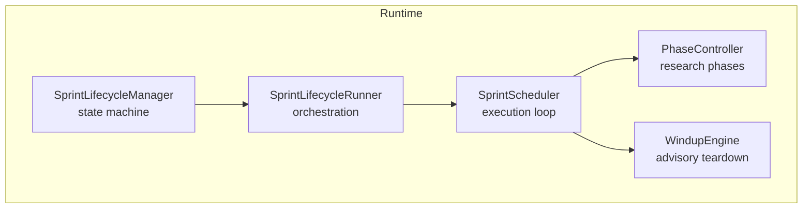
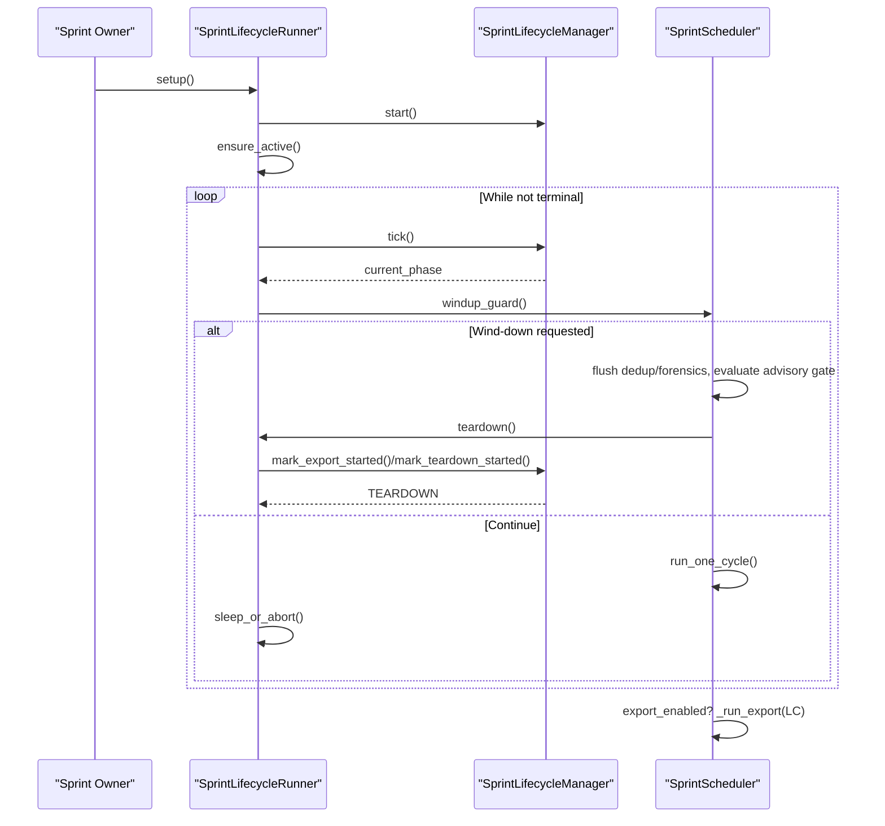
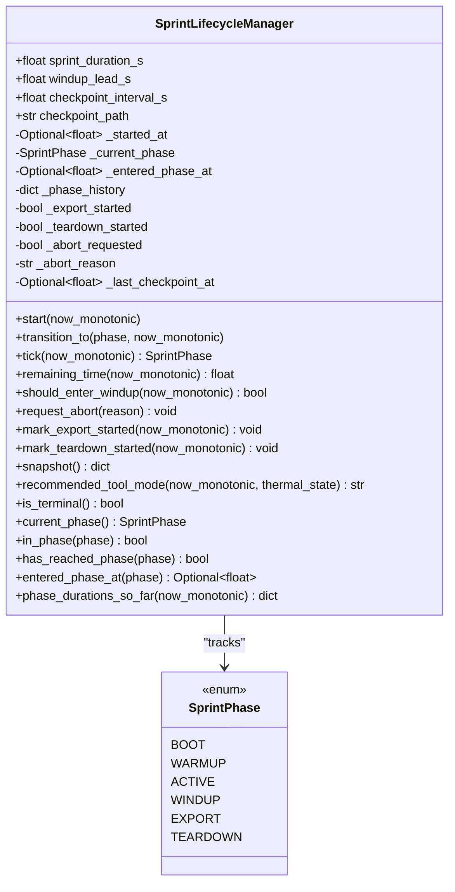
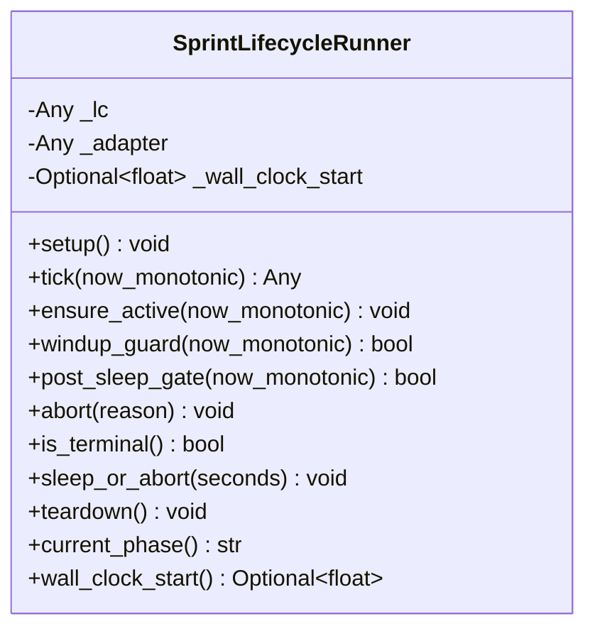
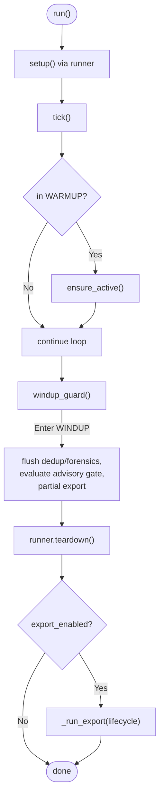
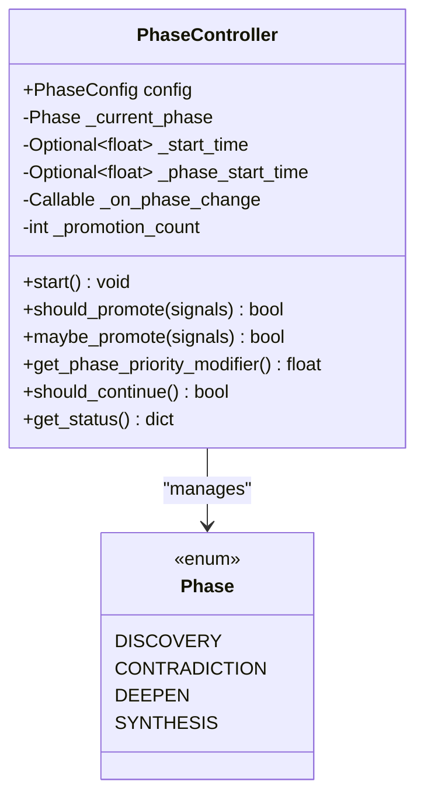
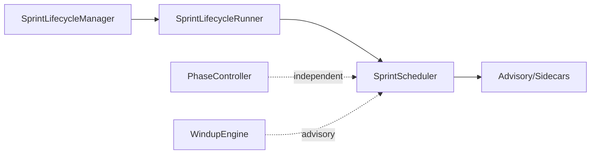

# Sprint Lifecycle Management

<cite>
**Referenced Files in This Document**
- [sprint_lifecycle.py](file://runtime/sprint_lifecycle.py)
- [sprint_lifecycle_runner.py](file://runtime/sprint_lifecycle_runner.py)
- [sprint_scheduler.py](file://runtime/sprint_scheduler.py)
- [phase_controller.py](file://orchestrator/phase_controller.py)
- [windup_engine.py](file://runtime/windup_engine.py)
</cite>

## Table of Contents
1. [Introduction](#introduction)
2. [Project Structure](#project-structure)
3. [Core Components](#core-components)
4. [Architecture Overview](#architecture-overview)
5. [Detailed Component Analysis](#detailed-component-analysis)
6. [Dependency Analysis](#dependency-analysis)
7. [Performance Considerations](#performance-considerations)
8. [Troubleshooting Guide](#troubleshooting-guide)
9. [Conclusion](#conclusion)

## Introduction
This document explains the Sprint Lifecycle Management system that governs bounded, phase-based execution of OSINT research sprints. It covers the lifecycle state machine, timing controls, phase transitions, integration with schedulers and advisory systems, authority delegation, safety mechanisms, and practical guidance for configuration, debugging, and optimization.

## Project Structure
The lifecycle system spans runtime and orchestrator modules:
- Runtime lifecycle state machine and runner
- Scheduler integration and lifecycle orchestration
- Phase controller for internal research phases
- Wind-down advisory engine

**Diagram sources**
- [sprint_lifecycle.py:54-531](file://runtime/sprint_lifecycle.py#L54-L531)
- [sprint_lifecycle_runner.py:38-193](file://runtime/sprint_lifecycle_runner.py#L38-L193)
- [sprint_scheduler.py:568-1350](file://runtime/sprint_scheduler.py#L568-L1350)
- [phase_controller.py:74-407](file://orchestrator/phase_controller.py#L74-L407)
- [windup_engine.py:41-257](file://runtime/windup_engine.py#L41-L257)

**Section sources**
- [sprint_lifecycle.py:1-531](file://runtime/sprint_lifecycle.py#L1-L531)
- [sprint_lifecycle_runner.py:1-193](file://runtime/sprint_lifecycle_runner.py#L1-L193)
- [sprint_scheduler.py:1-3199](file://runtime/sprint_scheduler.py#L1-L3199)
- [phase_controller.py:1-407](file://orchestrator/phase_controller.py#L1-L407)
- [windup_engine.py:1-257](file://runtime/windup_engine.py#L1-L257)

## Core Components
- SprintLifecycleManager: Canonical state machine controlling BOOT, WARMUP, ACTIVE, WINDUP, EXPORT, TEARDOWN with monotonic transitions, timing guards, and abort capability.
- SprintLifecycleRunner: Orchestrates lifecycle ticks, WARMUP→ACTIVE promotion, wind-down gates, sleep-with-tick, and teardown transitions.
- SprintScheduler: Runtime executor that delegates lifecycle control to the manager, coordinates work cycles, and triggers advisory and export at teardown.
- PhaseController: Internal phase management for research phases (Discovery, Contradiction, Deepen, Synthesis) with time windows and evidence-driven promotion.
- WindupEngine: Advisory wind-down pipeline (currently dormant in active runtime path).

**Section sources**
- [sprint_lifecycle.py:54-531](file://runtime/sprint_lifecycle.py#L54-L531)
- [sprint_lifecycle_runner.py:38-193](file://runtime/sprint_lifecycle_runner.py#L38-L193)
- [sprint_scheduler.py:991-1350](file://runtime/sprint_scheduler.py#L991-L1350)
- [phase_controller.py:74-407](file://orchestrator/phase_controller.py#L74-L407)
- [windup_engine.py:41-257](file://runtime/windup_engine.py#L41-L257)

## Architecture Overview
The lifecycle is a bounded, monotonic state machine with strict authority separation:
- Lifecycle authority: SprintLifecycleManager controls timing, transitions, and terminal states.
- Scheduler authority: SprintScheduler runs work cycles, applies pruning, and invokes lifecycle gates.
- Advisory authority: SprintAdvisoryRunner and sidecars operate at teardown.
- Research-phase authority: PhaseController manages internal research phases independently of lifecycle phases.

**Diagram sources**
- [sprint_scheduler.py:1014-1270](file://runtime/sprint_scheduler.py#L1014-L1270)
- [sprint_lifecycle_runner.py:55-187](file://runtime/sprint_lifecycle_runner.py#L55-L187)
- [sprint_lifecycle.py:82-178](file://runtime/sprint_lifecycle.py#L82-L178)

## Detailed Component Analysis

### SprintLifecycleManager
- Phases: BOOT → WARMUP → ACTIVE → WINDUP → EXPORT → TEARDOWN
- Timing: Total sprint duration and wind-down lead are configurable; remaining time computed from monotonic clock.
- Transitions: Strictly monotonic except TEARDOWN, which is reachable from any phase upon abort.
- Safety: Abort flag triggers immediate TEARDOWN; export and teardown gates enforce ordering.
- Tool-mode recommendation: Provides 'normal'/'prune'/'panic' modes based on remaining time and thermal state.

**Diagram sources**
- [sprint_lifecycle.py:21-27](file://runtime/sprint_lifecycle.py#L21-L27)
- [sprint_lifecycle.py:54-531](file://runtime/sprint_lifecycle.py#L54-L531)

**Section sources**
- [sprint_lifecycle.py:54-531](file://runtime/sprint_lifecycle.py#L54-L531)

### SprintLifecycleRunner
- Responsibilities: Lifecycle adapter creation, BOOT→WARMUP start, WARMUP→ACTIVE promotion, periodic tick, wind-down guard, post-sleep wind-up gate, sleep-or-abort loop, teardown transitions, partial export signaling.
- Integration: Wraps lifecycle object and delegates lifecycle calls; maintains wall-clock start for diagnostics.

**Diagram sources**
- [sprint_lifecycle_runner.py:38-193](file://runtime/sprint_lifecycle_runner.py#L38-L193)

**Section sources**
- [sprint_lifecycle_runner.py:38-193](file://runtime/sprint_lifecycle_runner.py#L38-L193)

### SprintScheduler Integration
- Lifecycle adapter bridges runtime and legacy APIs.
- Lifecycle runner drives lifecycle ticks and wind-down gates.
- Scheduler applies pruning based on lifecycle recommended_tool_mode.
- Teardown triggers export and closes resources.

**Diagram sources**
- [sprint_scheduler.py:1014-1270](file://runtime/sprint_scheduler.py#L1014-L1270)
- [sprint_lifecycle_runner.py:89-187](file://runtime/sprint_lifecycle_runner.py#L89-L187)

**Section sources**
- [sprint_scheduler.py:991-1350](file://runtime/sprint_scheduler.py#L991-L1350)

### PhaseController (Research Phases)
- Manages internal research phases: Discovery, Contradiction, Deepen, Synthesis.
- Uses time windows and weighted signals to decide promotions.
- Provides thermal-aware beam width and priority modifiers.

**Diagram sources**
- [phase_controller.py:32-38](file://orchestrator/phase_controller.py#L32-L38)
- [phase_controller.py:74-407](file://orchestrator/phase_controller.py#L74-L407)

**Section sources**
- [phase_controller.py:74-407](file://orchestrator/phase_controller.py#L74-L407)

### WindupEngine (Advisory)
- Dedicated wind-down pipeline with dedup, GNN inference, graph stats, synthesis, hypothesis enqueue, checkpoints, and scorecard.
- Currently marked dormant in active runtime path; alternate path for future use.

**Section sources**
- [windup_engine.py:41-257](file://runtime/windup_engine.py#L41-L257)

## Dependency Analysis
- Lifecycle authority: SprintLifecycleManager is the single source of truth for phase transitions and timing.
- Scheduler dependency: SprintScheduler depends on lifecycle for wind-down, pruning, and teardown sequencing.
- PhaseController independence: Research phases are orthogonal to lifecycle phases and controlled by time windows and signals.
- Advisory integration: Teardown integrates advisory runners and sidecars; wind-down guard triggers pre-teardown operations.

**Diagram sources**
- [sprint_lifecycle.py:54-531](file://runtime/sprint_lifecycle.py#L54-L531)
- [sprint_lifecycle_runner.py:38-193](file://runtime/sprint_lifecycle_runner.py#L38-L193)
- [sprint_scheduler.py:568-1350](file://runtime/sprint_scheduler.py#L568-L1350)
- [phase_controller.py:74-407](file://orchestrator/phase_controller.py#L74-L407)
- [windup_engine.py:41-257](file://runtime/windup_engine.py#L41-L257)

**Section sources**
- [sprint_scheduler.py:1014-1270](file://runtime/sprint_scheduler.py#L1014-L1270)
- [sprint_lifecycle.py:54-531](file://runtime/sprint_lifecycle.py#L54-L531)

## Performance Considerations
- Timing controls: Configure sprint_duration_s and windup_lead_s to balance throughput and safety. The manager automatically enters WINDUP when remaining time drops to windup_lead_s or less.
- Pruning and panic modes: Use recommended_tool_mode to reduce workload under time pressure or thermal stress. In 'panic' mode, only highest-priority tier is retained.
- Cycle sleep: Short sleeps with periodic tick enable responsive wind-down detection.
- Memory pressure: Teardown-sidecars and target memory updates include RAM guards to avoid exacerbating memory pressure.
- Asynchronous orchestration: The scheduler uses TaskGroup and semaphores to bound concurrency and timeouts.

[No sources needed since this section provides general guidance]

## Troubleshooting Guide
Common issues and remedies:
- Unexpected termination: Verify lifecycle.is_terminal() and abort flags. Check abort reason and whether teardown was invoked.
- Wind-down not triggering: Confirm remaining_time() decreases consistently and should_enter_windup() returns True near end. Review wall-clock budget guard logic.
- WARMUP→ACTIVE stuck: Ensure ensure_active() is called after setup and that lifecycle.tick() is invoked regularly.
- Export not running: Confirm export_enabled and that mark_export_started() is reached before TEARDOWN.
- Thermal-induced pruning: Adjust thermal thresholds or reduce workload; verify recommended_tool_mode behavior.
- Teardown resource cleanup: Ensure dedup, forensics, and multimodal enrichers are closed at TEARDOWN.

**Section sources**
- [sprint_lifecycle.py:110-178](file://runtime/sprint_lifecycle.py#L110-L178)
- [sprint_lifecycle_runner.py:89-187](file://runtime/sprint_lifecycle_runner.py#L89-L187)
- [sprint_scheduler.py:1262-1292](file://runtime/sprint_scheduler.py#L1262-L1292)

## Conclusion
The Sprint Lifecycle Management system enforces a strict, monotonic lifecycle with robust timing and safety controls. The scheduler delegates lifecycle authority to the manager while applying pruning and resource governance. Advisory and sidecars integrate at teardown for comprehensive analysis. Proper configuration of timing parameters, understanding of tool-mode recommendations, and adherence to wind-down gates ensure reliable, high-performance execution.