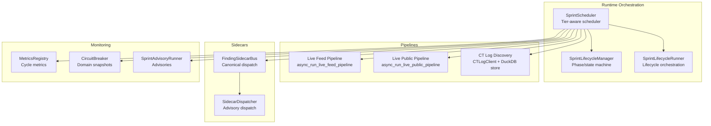
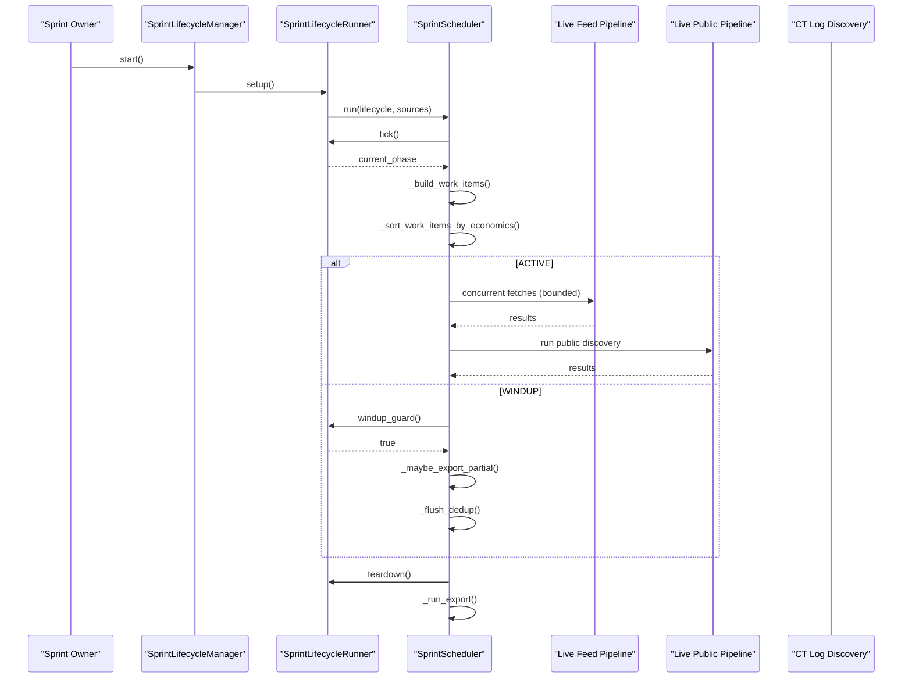
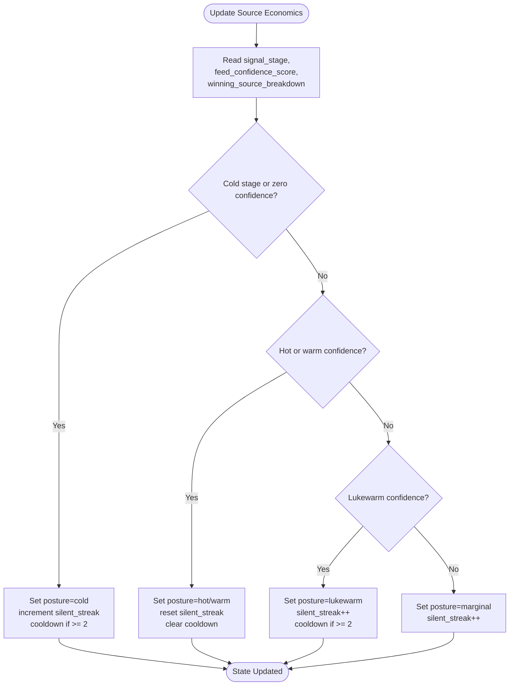
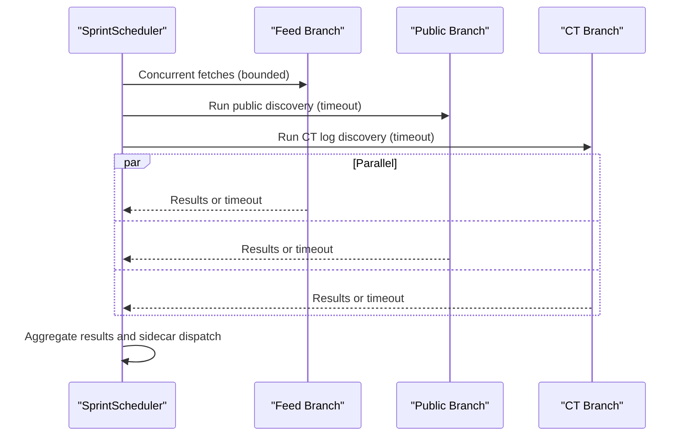
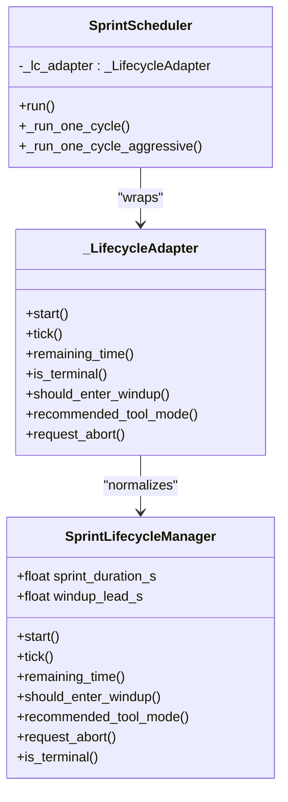
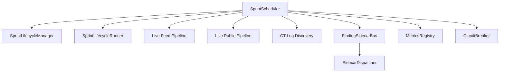

# Sprint Scheduler

<cite>
**Referenced Files in This Document**
- [sprint_scheduler.py](file://runtime/sprint_scheduler.py)
- [sprint_lifecycle.py](file://runtime/sprint_lifecycle.py)
- [sprint_lifecycle_runner.py](file://runtime/sprint_lifecycle_runner.py)
- [live_feed_pipeline.py](file://pipeline/live_feed_pipeline.py)
- [live_public_pipeline.py](file://pipeline/live_public_pipeline.py)
- [sprint_advisory_runner.py](file://runtime/sprint_advisory_runner.py)
- [sidecar_bus.py](file://runtime/sidecar_bus.py)
- [sidecar_dispatcher.py](file://runtime/sidecar_dispatcher.py)
- [sprint_dashboard.py](file://monitoring/sprint_dashboard.py)
- [test_sprint_8bk.py](file://tests/probe_8bk/test_sprint_8bk.py)
</cite>

## Table of Contents
1. [Introduction](#introduction)
2. [Project Structure](#project-structure)
3. [Core Components](#core-components)
4. [Architecture Overview](#architecture-overview)
5. [Detailed Component Analysis](#detailed-component-analysis)
6. [Dependency Analysis](#dependency-analysis)
7. [Performance Considerations](#performance-considerations)
8. [Troubleshooting Guide](#troubleshooting-guide)
9. [Conclusion](#conclusion)

## Introduction
The Sprint Scheduler is the operational backbone for 30-minute bounded sprint runs. It coordinates tier-aware feed scheduling, source prioritization, and work distribution across feed, public discovery, and CT log pipelines. Built as a runtime worker, it executes work dispatched by the SprintLifecycleManager without owning lifecycle transitions or performing direct tool execution. The scheduler integrates advanced mechanisms for source economics, adaptive timeout management, parallel execution, and comprehensive performance monitoring.

## Project Structure
The Sprint Scheduler resides in the runtime layer and orchestrates pipelines and sidecars while respecting lifecycle boundaries. Key modules include:
- Runtime orchestration: SprintScheduler, SprintLifecycleManager, SprintLifecycleRunner
- Pipeline integration: live feed and public discovery pipelines
- Sidecar coordination: FindingSidecarBus and SidecarDispatcher
- Monitoring and diagnostics: metrics registry, circuit breaker snapshots, and advisory runners

**Diagram sources**
- [sprint_scheduler.py:568-1350](file://runtime/sprint_scheduler.py#L568-L1350)
- [sprint_lifecycle.py:54-531](file://runtime/sprint_lifecycle.py#L54-L531)
- [sprint_lifecycle_runner.py](file://runtime/sprint_lifecycle_runner.py)
- [live_feed_pipeline.py](file://pipeline/live_feed_pipeline.py)
- [live_public_pipeline.py](file://pipeline/live_public_pipeline.py)
- [sidecar_bus.py](file://runtime/sidecar_bus.py)
- [sidecar_dispatcher.py](file://runtime/sidecar_dispatcher.py)
- [sprint_advisory_runner.py](file://runtime/sprint_advisory_runner.py)

**Section sources**
- [sprint_scheduler.py:1-120](file://runtime/sprint_scheduler.py#L1-L120)
- [sprint_lifecycle.py:1-100](file://runtime/sprint_lifecycle.py#L1-L100)

## Core Components
- SprintScheduler: Central orchestrator for tier-aware scheduling, parallel execution, and sidecar dispatch. Implements source economics, adaptive timeouts, and mission budget tracking.
- SprintLifecycleManager: State machine governing BOOT → WARMUP → ACTIVE → WINDUP → EXPORT → TEARDOWN phases with strict timing and authority boundaries.
- SprintLifecycleRunner: Encapsulates lifecycle orchestration, including tick, windup guard, sleep-or-abort, and teardown.
- Pipeline integrations: Live feed and public discovery pipelines execute under bounded concurrency and timeouts.
- Sidecar coordination: FindingSidecarBus and SidecarDispatcher route accepted findings through canonical sidecars with advisory-only dispatch.

**Section sources**
- [sprint_scheduler.py:568-1350](file://runtime/sprint_scheduler.py#L568-L1350)
- [sprint_lifecycle.py:54-531](file://runtime/sprint_lifecycle.py#L54-L531)
- [sprint_lifecycle_runner.py](file://runtime/sprint_lifecycle_runner.py)

## Architecture Overview
The scheduler operates as a sidecar to the lifecycle manager, receiving authority-bound work and enforcing strict invariants:
- Wind-down respect: no new work after lifecycle indicates WINDUP
- In-sprint dedup: same entry_hash never processed twice
- Lifecycle authority: time and phase transitions controlled by lifecycle
- Export always runs on teardown
- No background threads: uses TaskGroup for owned concurrency

**Diagram sources**
- [sprint_scheduler.py:991-1350](file://runtime/sprint_scheduler.py#L991-L1350)
- [sprint_lifecycle.py:82-178](file://runtime/sprint_lifecycle.py#L82-L178)
- [sprint_lifecycle_runner.py](file://runtime/sprint_lifecycle_runner.py)

## Detailed Component Analysis

### Configuration System
The scheduler exposes a comprehensive configuration interface:
- Duration and wind-down controls: 30-minute sprint with configurable wind-down lead
- Concurrency and cycle parameters: max parallel sources, cycle sleep intervals, cycle caps
- Aggressive mode: fan-out feed/public/CT branches with per-branch timeouts
- Source tier mapping: maps feed URLs to priority tiers (SURFACE, STRUCTURED_TI, DEEP, ARCHIVE, OTHER)
- Budget controls: per-branch timeout budget, mission budget tracking, sidecar skipping indicators
- Performance parameters: cycle sleep, max entries per cycle, partial export intervals

Concrete configuration examples:
- Basic tier mapping: map specific feeds to SURFACE/STRUCTURED_TI tiers for priority
- Aggressive mode tuning: adjust aggressive_branch_timeout_s and branch_timeout_budget_s
- Budget enforcement: monitor sidecars_skipped and budget_violations in results

**Section sources**
- [sprint_scheduler.py:267-298](file://runtime/sprint_scheduler.py#L267-L298)

### Source Economics Tracking
Per-source economics maintains bounded in-memory state for each feed:
- Silent streak: consecutive cycles without hot/warm signals
- Cooldown tracking: bounded cooldown window after prolonged silence
- Recent health posture: hot/warm/lukewarm/marginal/cold/unknown
- Economic sorting: tier-first, posture boosting, cooldown handling, silent streak penalties

**Diagram sources**
- [sprint_scheduler.py:732-836](file://runtime/sprint_scheduler.py#L732-L836)

**Section sources**
- [sprint_scheduler.py:439-457](file://runtime/sprint_scheduler.py#L439-L457)
- [sprint_scheduler.py:732-836](file://runtime/sprint_scheduler.py#L732-L836)

### Work Distribution and Parallel Execution
The scheduler builds tiered work items and distributes them across pipelines:
- Tier ordering: SURFACE → STRUCTURED_TI → DEEP → ARCHIVE → OTHER
- Pruning modes: prune mode drops lower tiers; panic mode restricts to SURFACE only
- Concurrency control: semaphore-based bounded concurrency for feed fetches
- Aggressive mode: concurrent fan-out of feed, public, and CT branches with per-branch timeouts
- Adaptive timeouts: EMA-based latency tracking per domain with bounded growth

**Diagram sources**
- [sprint_scheduler.py:1472-1620](file://runtime/sprint_scheduler.py#L1472-L1620)

**Section sources**
- [sprint_scheduler.py:1354-1470](file://runtime/sprint_scheduler.py#L1354-L1470)
- [sprint_scheduler.py:1472-1620](file://runtime/sprint_scheduler.py#L1472-L1620)

### Lifecycle Integration and Authority Boundaries
The scheduler delegates lifecycle authority to SprintLifecycleManager:
- Authority boundaries: does not execute tools, activate providers, or create persistent state
- Lifecycle adapter: normalizes runtime vs utils API differences
- Wind-down guard: triggers early wind-down when lifecycle indicates WINDUP
- Terminal handling: respects TEARDOWN and abort conditions

**Diagram sources**
- [sprint_lifecycle.py:54-531](file://runtime/sprint_lifecycle.py#L54-L531)
- [sprint_scheduler.py:102-240](file://runtime/sprint_scheduler.py#L102-L240)

**Section sources**
- [sprint_scheduler.py:568-590](file://runtime/sprint_scheduler.py#L568-L590)
- [sprint_scheduler.py:1013-1076](file://runtime/sprint_scheduler.py#L1013-L1076)
- [sprint_lifecycle.py:82-178](file://runtime/sprint_lifecycle.py#L82-L178)

### Performance Monitoring and Diagnostics
The scheduler integrates multiple monitoring layers:
- Metrics registry: cycle-level metrics capture RSS, open FDs, and counters
- Circuit breaker snapshots: domain-level state for diagnostics
- Wind-up scorecard: read-only extraction of key performance indicators
- Memory pressure monitoring: background loop tracking RSS and triggering advisories
- Mission budget tracking: sidecar skipping and budget violations

**Section sources**
- [sprint_scheduler.py:3770-3861](file://runtime/sprint_scheduler.py#L3770-L3861)
- [sprint_scheduler.py:3288-3392](file://runtime/sprint_scheduler.py#L3288-L3392)
- [sprint_scheduler.py:1125-1128](file://runtime/sprint_scheduler.py#L1125-L1128)

### Sidecar Coordination and Canonical Dispatch
Accepted findings are routed through a canonical sidecar bus:
- FindingSidecarBus: unified dispatch for all accepted findings
- SidecarDispatcher: advisory-only dispatch with fail-soft handling
- Branch-specific sidecars: identity stitching, exposure correlation, leak detection, temporal archaeology, and more
- Target memory integration: cross-sprint target state updates

**Section sources**
- [sprint_scheduler.py:1719-1751](file://runtime/sprint_scheduler.py#L1719-L1751)
- [sprint_scheduler.py:1864-1992](file://runtime/sprint_scheduler.py#L1864-L1992)
- [sprint_scheduler.py:2268-2408](file://runtime/sprint_scheduler.py#L2268-L2408)
- [sidecar_bus.py](file://runtime/sidecar_bus.py)
- [sidecar_dispatcher.py](file://runtime/sidecar_dispatcher.py)

## Dependency Analysis
The scheduler exhibits strong cohesion around lifecycle orchestration and pipeline execution, with clear separation of concerns:
- Low coupling to external systems: uses lazy imports for heavy components
- Clear authority boundaries: lifecycle ownership remains with SprintLifecycleManager
- Fail-soft design: sidecars and optional components never crash the sprint
- Bounded memory usage: extensive use of bounds and trimming to prevent OOM

**Diagram sources**
- [sprint_scheduler.py:568-1350](file://runtime/sprint_scheduler.py#L568-L1350)
- [sprint_lifecycle.py:54-531](file://runtime/sprint_lifecycle.py#L54-L531)
- [sidecar_bus.py](file://runtime/sidecar_bus.py)
- [sidecar_dispatcher.py](file://runtime/sidecar_dispatcher.py)

**Section sources**
- [sprint_scheduler.py:568-1350](file://runtime/sprint_scheduler.py#L568-L1350)
- [sprint_lifecycle.py:54-531](file://runtime/sprint_lifecycle.py#L54-L531)

## Performance Considerations
- Concurrency tuning: adjust max_parallel_sources and aggressive_branch_timeout_s based on workload characteristics
- Memory governance: monitor peak_rss_gib and budget_violations; consider sidecar skipping under memory pressure
- Timeout adaptation: leverage EMA-based adaptive timeouts for variable network conditions
- Dedup efficiency: persistent LMDB dedup reduces repeated processing across sprints
- Pipeline batching: optimize max_entries_per_cycle and fetch concurrency for target throughput

## Troubleshooting Guide
Common scheduling issues and resolutions:
- Timeout handling: aggressive mode tracks branch_timeout_count; investigate network connectivity and adjust timeouts
- Blocker detection: feed_zero_yield_detected, feed_inaccessible_detected, and similar flags indicate pipeline issues
- Memory pressure: budget_violations and sidecars_skipped indicate mission budget exceeded; reduce sidecar load
- Lifecycle stalls: check pre_active_starved and pre_loop_elapsed_s for startup delays
- Export failures: verify export_enabled and export_dir configuration; ensure proper permissions

Diagnostic utilities:
- Source health summary: inspect recent health posture and cooldown states
- Circuit breaker coverage: review open/half_open domains impacting performance
- Metrics registry: examine cycle-level RSS and counter trends

**Section sources**
- [sprint_scheduler.py:1294-1336](file://runtime/sprint_scheduler.py#L1294-L1336)
- [sprint_scheduler.py:3198-3244](file://runtime/sprint_scheduler.py#L3198-L3244)
- [sprint_scheduler.py:3396-3440](file://runtime/sprint_scheduler.py#L3396-L3440)

## Conclusion
The Sprint Scheduler provides a robust, lifecycle-authoritative framework for 30-minute bounded sprint operations. Its tier-aware scheduling, adaptive timeout management, and comprehensive monitoring enable efficient coordination of feed pipelines while maintaining strict authority boundaries. The modular design with fail-soft components and mission budget tracking ensures reliable operation across diverse workload patterns.