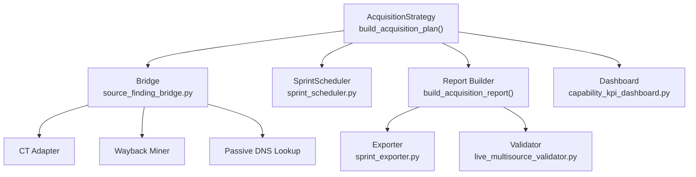
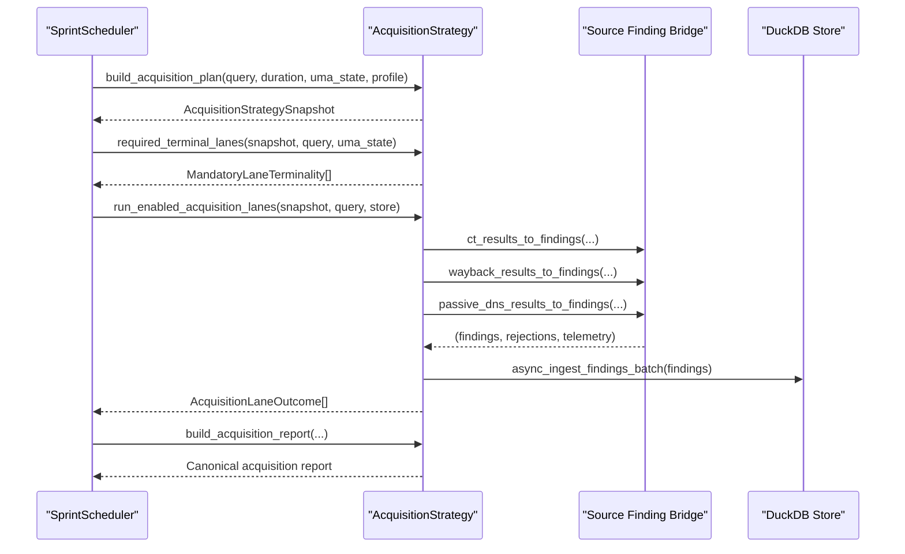
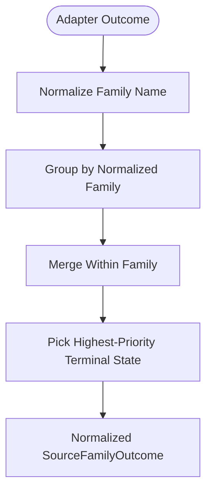
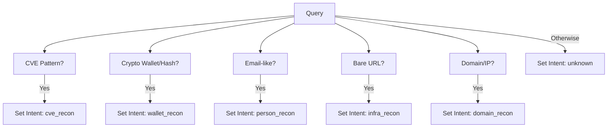
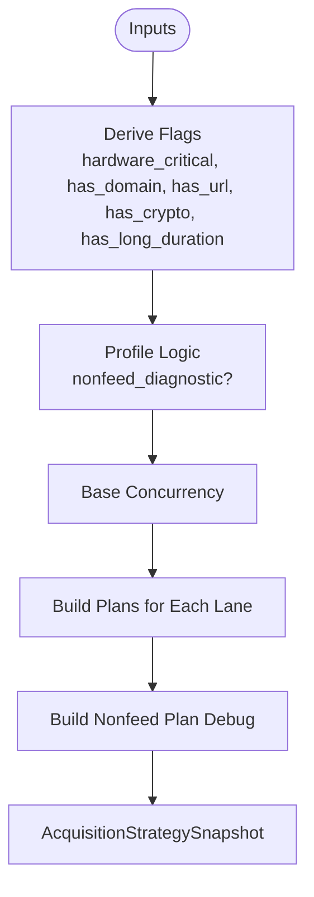
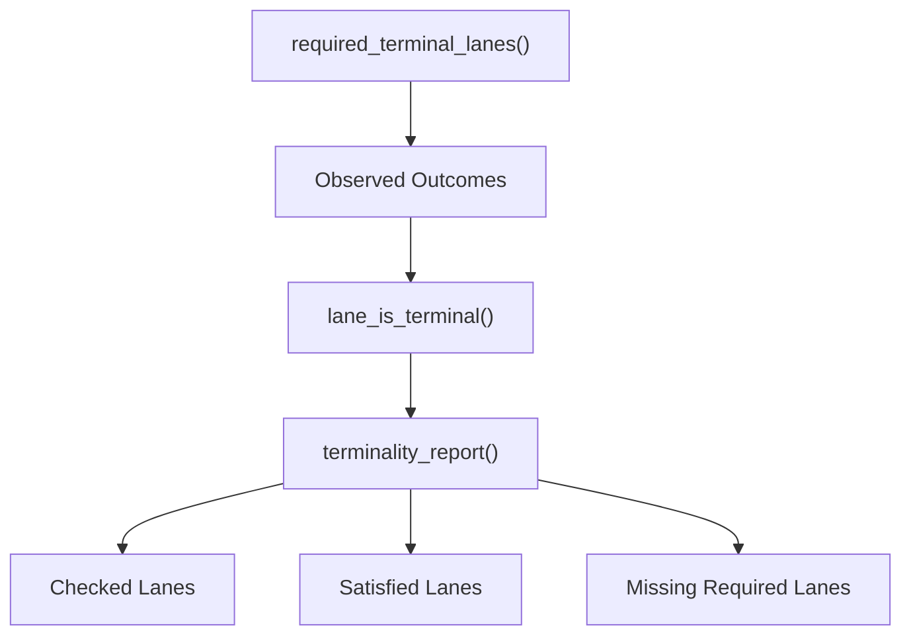
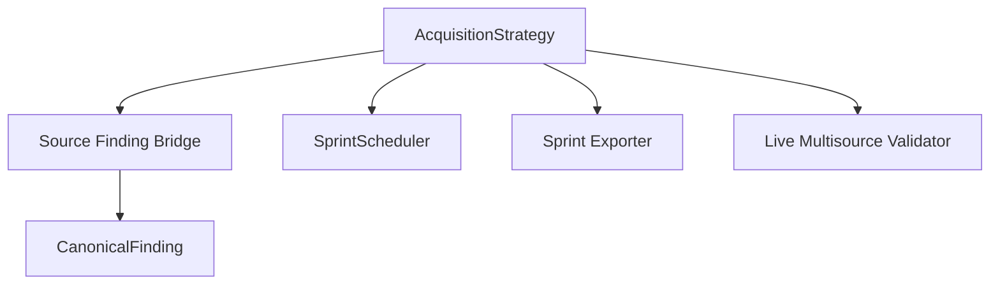

# Acquisition Strategy

<cite>
**Referenced Files in This Document**
- [acquisition_strategy.py](file://runtime/acquisition_strategy.py)
- [source_finding_bridge.py](file://runtime/source_finding_bridge.py)
- [sprint_scheduler.py](file://runtime/sprint_scheduler.py)
- [sprint_exporter.py](file://export/sprint_exporter.py)
- [live_multisource_validator.py](file://tools/live_multisource_validator.py)
- [capability_kpi_dashboard.py](file://tools/capability_kpi_dashboard.py)
</cite>

## Table of Contents
1. [Introduction](#introduction)
2. [Project Structure](#project-structure)
3. [Core Components](#core-components)
4. [Architecture Overview](#architecture-overview)
5. [Detailed Component Analysis](#detailed-component-analysis)
6. [Dependency Analysis](#dependency-analysis)
7. [Performance Considerations](#performance-considerations)
8. [Troubleshooting Guide](#troubleshooting-guide)
9. [Conclusion](#conclusion)

## Introduction
This document describes the Acquisition Strategy system that governs which acquisition lanes are permitted per sprint/cycle under M1 constraints. The system is a model-free planner/admission layer responsible for deciding lane enablement, capacity, timing, and risk controls without performing network I/O or model inference. It produces a canonical acquisition report and supports mission intent inference, source family outcomes normalization, and terminality validation for sprint completion guarantees.

## Project Structure
The Acquisition Strategy system is centered in the runtime module with supporting components in the scheduler, exporters, validators, and bridge utilities:

- Core planner and lane admission logic: runtime/acquisition_strategy.py
- Non-feed adapter-to-finding bridge: runtime/source_finding_bridge.py
- Sprint orchestration integration: runtime/sprint_scheduler.py
- Canonical report schema and validation: export/sprint_exporter.py and tools/live_multisource_validator.py
- Capability dashboard integration: tools/capability_kpi_dashboard.py

**Diagram sources**
- [acquisition_strategy.py:2197-2607](file://runtime/acquisition_strategy.py#L2197-L2607)
- [source_finding_bridge.py:460-800](file://runtime/source_finding_bridge.py#L460-L800)
- [sprint_scheduler.py:3850-3884](file://runtime/sprint_scheduler.py#L3850-L3884)
- [sprint_exporter.py:1808-1833](file://export/sprint_exporter.py#L1808-L1833)
- [live_multisource_validator.py:334-352](file://tools/live_multisource_validator.py#L334-L352)
- [capability_kpi_dashboard.py:241-278](file://tools/capability_kpi_dashboard.py#L241-L278)

**Section sources**
- [acquisition_strategy.py:1-100](file://runtime/acquisition_strategy.py#L1-L100)
- [source_finding_bridge.py:1-66](file://runtime/source_finding_bridge.py#L1-L66)
- [sprint_scheduler.py:3850-3884](file://runtime/sprint_scheduler.py#L3850-L3884)

## Core Components
- AcquisitionLane: Canonical enumeration of acquisition lanes (FEED, PUBLIC, CT, WAYBACK, PASSIVE_DNS, BLOCKCHAIN, STEALTH, PIVOT_EXECUTOR, ACADEMIC, IPFS, DOH).
- AcquisitionProfile: Runtime profiles controlling lane caps and priorities (default, nonfeed_diagnostic).
- AcquisitionLanePlan: Per-lane plan fields (enabled, reason, max_items, timeout_s, concurrency, risk_level).
- AcquisitionStrategySnapshot: Full snapshot of the acquisition plan for a sprint, including nonfeed diagnostics and feed dominance budget.
- FeedDominanceBudget: Policy for limiting feed acceptance before nonfeed lanes become terminal.
- NonfeedMissionController: Mission contract for nonfeed_diagnostic profile coordinating required/optional families and exit conditions.
- SourceFamilyOutcome: Canonical per-family outcome shape for diagnostics and reporting.
- MandatoryLaneTerminality: Contract specifying which lanes must reach terminal states for sprint completion.
- MissionIntent/MissionTargetKind: Lightweight intent classification for lane prioritization and telemetry.

**Section sources**
- [acquisition_strategy.py:155-100](file://runtime/acquisition_strategy.py#L155-L100)
- [acquisition_strategy.py:215-220](file://runtime/acquisition_strategy.py#L215-L220)
- [acquisition_strategy.py:423-434](file://runtime/acquisition_strategy.py#L423-L434)
- [acquisition_strategy.py:483-501](file://runtime/acquisition_strategy.py#L483-L501)
- [acquisition_strategy.py:251-290](file://runtime/acquisition_strategy.py#L251-L290)
- [acquisition_strategy.py:1693-1984](file://runtime/acquisition_strategy.py#L1693-L1984)
- [acquisition_strategy.py:1252-1291](file://runtime/acquisition_strategy.py#L1252-L1291)
- [acquisition_strategy.py:503-517](file://runtime/acquisition_strategy.py#L503-L517)
- [acquisition_strategy.py:2023-2106](file://runtime/acquisition_strategy.py#L2023-L2106)

## Architecture Overview
The Acquisition Strategy system operates as a bounded, deterministic admission layer that:
- Builds a canonical acquisition plan from query, duration, UMA state, and profile.
- Enforces hardware/memory safety gates and profile-specific caps.
- Produces per-lane plans and a nonfeed mission snapshot for diagnostics.
- Provides terminality contracts for required lanes and normalization utilities for outcomes.
- Generates a canonical acquisition report consumed by exporters and validators.

**Diagram sources**
- [acquisition_strategy.py:2197-2607](file://runtime/acquisition_strategy.py#L2197-L2607)
- [acquisition_strategy.py:2629-3323](file://runtime/acquisition_strategy.py#L2629-L3323)
- [acquisition_strategy.py:894-1200](file://runtime/acquisition_strategy.py#L894-L1200)
- [sprint_scheduler.py:3850-3884](file://runtime/sprint_scheduler.py#L3850-L3884)
- [source_finding_bridge.py:460-800](file://runtime/source_finding_bridge.py#L460-L800)

## Detailed Component Analysis

### Canonical Acquisition Strategy Layer
- Role: Model-free planner/admission layer deciding which lanes are allowed per sprint under M1 constraints.
- Invariants: No network I/O, no model/MLX load, bounded max 8 lanes, fail-soft on error, deterministic output.
- Lane plan fields: lane, enabled, reason, max_items, timeout_s, concurrency, risk_level.

Key behaviors:
- Hardware/memory safety gates disable heavy optional lanes under critical/emergency states.
- Profile-driven caps: nonfeed_diagnostic caps FEED at 25 and enables nonfeed lanes for domain queries.
- Transport authority degrades PUBLIC/CT under degraded transport.
- Stealth requires explicit readiness and breaker seam phase.

**Section sources**
- [acquisition_strategy.py:1-43](file://runtime/acquisition_strategy.py#L1-L43)
- [acquisition_strategy.py:2197-2607](file://runtime/acquisition_strategy.py#L2197-L2607)

### Source Family Outcomes and Normalization
- SourceFamilyOutcome: Canonical per-family shape capturing attempted/skipped/error/timeout and counts.
- normalize_source_family_name: Canonicalizes family names to prevent duplicates (e.g., "CT"/"ct" → "ct").
- canonicalize_source_family_outcomes: Deduplicates and merges outcomes by normalized family.
- normalize_source_family_outcome: Converts adapter outcomes to SourceFamilyOutcome fields with derived terminal_state.

**Diagram sources**
- [acquisition_strategy.py:1295-1433](file://runtime/acquisition_strategy.py#L1295-L1433)
- [acquisition_strategy.py:1436-1557](file://runtime/acquisition_strategy.py#L1436-L1557)

**Section sources**
- [acquisition_strategy.py:1252-1291](file://runtime/acquisition_strategy.py#L1252-L1291)
- [acquisition_strategy.py:1295-1433](file://runtime/acquisition_strategy.py#L1295-L1433)
- [acquisition_strategy.py:1436-1557](file://runtime/acquisition_strategy.py#L1436-L1557)

### Mission Intent Inference
- MissionIntent: Classifies intent as domain_recon, org_recon, person_recon, wallet_recon, cve_recon, infra_recon, unknown.
- MissionTargetKind: Maps intent to target kinds (domain, url, email, wallet, cve, ip, org, unknown).
- infer_mission_intent: Deterministic classifier based on regex patterns in the query.
- _mission_lanes: Derives required and optional lanes per intent; telemetry-only (does not bypass safety gates).

**Diagram sources**
- [acquisition_strategy.py:2065-2141](file://runtime/acquisition_strategy.py#L2065-L2141)

**Section sources**
- [acquisition_strategy.py:2023-2106](file://runtime/acquisition_strategy.py#L2023-L2106)
- [acquisition_strategy.py:2065-2141](file://runtime/acquisition_strategy.py#L2065-L2141)

### Acquisition Plan Building Process
- Inputs: query, duration_s, aggressive_mode, uma_state, swap_detected, transport_authority_status, stealth_phase, acquisition_profile.
- Outputs: AcquisitionStrategySnapshot with per-lane AcquisitionLanePlan entries.
- Safety gates: hardware_critical disables heavy optional lanes; transport_degraded affects PUBLIC/CT; stealth_ready toggles STEALTH.
- Profile logic: nonfeed_diagnostic caps FEED at 25 and enables nonfeed lanes for domain queries.

**Diagram sources**
- [acquisition_strategy.py:2291-2607](file://runtime/acquisition_strategy.py#L2291-L2607)

**Section sources**
- [acquisition_strategy.py:2197-2607](file://runtime/acquisition_strategy.py#L2197-L2607)

### Mandatory Terminal Lanes and Terminality Reporting
- required_terminal_lanes: Defines which lanes must reach terminal states based on query type and UMA state.
- Terminality contract: FEED not required; PUBLIC/CT required for domain queries under ok/warn; CT required under critical; STEALTH never mandatory.
- terminality_report: Compares required vs observed outcomes and produces a structured report with checked/satisfied/missing lanes.

**Diagram sources**
- [acquisition_strategy.py:519-696](file://runtime/acquisition_strategy.py#L519-L696)
- [acquisition_strategy.py:699-821](file://runtime/acquisition_strategy.py#L699-L821)
- [acquisition_strategy.py:824-888](file://runtime/acquisition_strategy.py#L824-L888)

**Section sources**
- [acquisition_strategy.py:519-696](file://runtime/acquisition_strategy.py#L519-L696)
- [acquisition_strategy.py:699-821](file://runtime/acquisition_strategy.py#L699-L821)
- [acquisition_strategy.py:824-888](file://runtime/acquisition_strategy.py#L824-L888)

### Lane Query Construction
- build_lane_query: Shapes source-specific queries per lane:
  - CT: extract domains only.
  - WAYBACK: use domain/URL if present; bounded exposure terms.
  - PASSIVE_DNS: domain/IP only.
  - BLOCKCHAIN: wallet/hash only; returns {"_disabled": True} if none present.
  - PUBLIC: original query plus bounded variants.
  - FEED: unchanged.

**Section sources**
- [acquisition_strategy.py:3438-3501](file://runtime/acquisition_strategy.py#L3438-L3501)

### Source Tier Mapping and Bridge Conversion
- Non-feed adapters (CT, Wayback, PassiveDNS) convert raw results to CanonicalFinding candidates via bridge helpers.
- Rejection tracking: missing_domain, missing_value, low_information, duplicate_candidate, unsupported_shape, wildcard_domain, private_or_reserved_domain, storage_unavailable, quality_gate, candidate_built_not_stored.
- Telemetry: raw_entries, candidate_domains, accepted_candidates, quarantine entries, expansion clues.

**Section sources**
- [source_finding_bridge.py:460-800](file://runtime/source_finding_bridge.py#L460-L800)
- [source_finding_bridge.py:1-98](file://runtime/source_finding_bridge.py#L1-L98)

### Budget Allocation and Lane Enablement Logic
- Base concurrency: adjusted by UMA state and swap detection.
- Lane-specific concurrency: heavy lanes halved under critical/emergency; reduced under warn.
- Profile caps: nonfeed_diagnostic caps FEED at 25; enables nonfeed lanes for domain queries.
- Hardware/memory safety: heavy optional lanes disabled under critical/emergency; transport degradation affects PUBLIC/CT.

**Section sources**
- [acquisition_strategy.py:2171-2191](file://runtime/acquisition_strategy.py#L2171-L2191)
- [acquisition_strategy.py:2335-2607](file://runtime/acquisition_strategy.py#L2335-L2607)

### Nonfeed Mission Controller
- Mission contract for nonfeed_diagnostic profile:
  - Required families: PUBLIC, CT, PIVOT_EXECUTOR.
  - Optional families: WAYBACK, PASSIVE_DNS.
  - Mission completes when each required family reaches terminal or accepted state.
- Status evaluation: accepted, terminal, provider_failure, memory_skip, pending, missing.
- Exit reasons: diagnostic_complete_nonfeed_accepted, diagnostic_complete_no_nonfeed_accepted, diagnostic_blocked_by_memory, mission_incomplete.

**Section sources**
- [acquisition_strategy.py:1693-1984](file://runtime/acquisition_strategy.py#L1693-L1984)

### Acquisition Plan Validation and Terminality Reporting
- SprintScheduler integrates with AcquisitionStrategy to derive required lanes even when no acquisition plan exists.
- Canonical acquisition report includes plan, terminality, nonfeed diagnostics, source family outcomes, and telemetry.
- Exporter and validator consume the canonical schema for verification and KPI computation.

**Section sources**
- [sprint_scheduler.py:3850-3884](file://runtime/sprint_scheduler.py#L3850-L3884)
- [acquisition_strategy.py:894-1200](file://runtime/acquisition_strategy.py#L894-L1200)
- [sprint_exporter.py:1808-1833](file://export/sprint_exporter.py#L1808-L1833)
- [live_multisource_validator.py:334-352](file://tools/live_multisource_validator.py#L334-L352)
- [live_multisource_validator.py:609-708](file://tools/live_multisource_validator.py#L609-L708)

## Dependency Analysis
- AcquisitionStrategy depends on:
  - source_finding_bridge for adapter-to-finding conversions and rejection tracking.
  - SprintScheduler for terminality derivation and plan integration.
  - Exporter and Validator for canonical schema consumption.
- Bridge utilities depend on DuckDB CanonicalFinding and bounded output constraints.

**Diagram sources**
- [acquisition_strategy.py:2629-3323](file://runtime/acquisition_strategy.py#L2629-L3323)
- [source_finding_bridge.py:130-166](file://runtime/source_finding_bridge.py#L130-L166)
- [sprint_scheduler.py:3850-3884](file://runtime/sprint_scheduler.py#L3850-L3884)
- [sprint_exporter.py:1808-1833](file://export/sprint_exporter.py#L1808-L1833)
- [live_multisource_validator.py:334-352](file://tools/live_multisource_validator.py#L334-L352)

**Section sources**
- [acquisition_strategy.py:2629-3323](file://runtime/acquisition_strategy.py#L2629-L3323)
- [source_finding_bridge.py:130-166](file://runtime/source_finding_bridge.py#L130-L166)

## Performance Considerations
- Concurrency scaling: base concurrency tuned by UMA state; heavy optional lanes scaled down under pressure.
- Bounded outputs: MAX_BRIDGE_OUTPUT and per-lane max_items cap resource usage.
- Fail-soft behavior: minimal snapshot on error prevents cascading failures.
- Deterministic planning: same inputs produce identical plans for reproducibility.

[No sources needed since this section provides general guidance]

## Troubleshooting Guide
Common issues and diagnostics:
- Lane unexpectedly disabled:
  - Check hardware_critical flags and UMA state.
  - Verify acquisition_profile and stealth readiness.
  - Review nonfeed_plan_debug for reasons and scheduled lanes.
- Terminality regressions:
  - Use terminality_report to compare required vs observed outcomes.
  - Validate acquisition_terminality_missing_lanes and acquisition_terminality_satisfied.
- Report validation failures:
  - Confirm canonical schema version and presence of required fields.
  - Inspect source_family_outcomes and quality/duplicate/low-information rejection summaries.

**Section sources**
- [acquisition_strategy.py:1205-1246](file://runtime/acquisition_strategy.py#L1205-L1246)
- [acquisition_strategy.py:824-888](file://runtime/acquisition_strategy.py#L824-L888)
- [sprint_exporter.py:1808-1833](file://export/sprint_exporter.py#L1808-L1833)
- [live_multisource_validator.py:609-708](file://tools/live_multisource_validator.py#L609-L708)

## Conclusion
The Acquisition Strategy system provides a robust, deterministic admission layer that safely balances acquisition lanes under M1 constraints. It supports mission intent inference, canonical reporting, and terminality validation while maintaining bounded resource usage and fail-soft guarantees. The system’s modular design enables profile-driven behavior, nonfeed mission contracts, and comprehensive diagnostics for operational excellence.