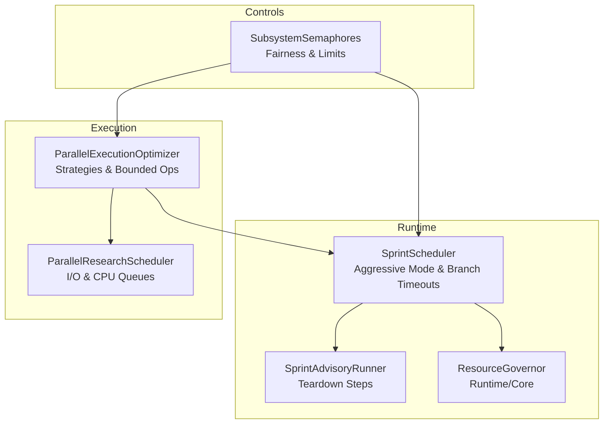
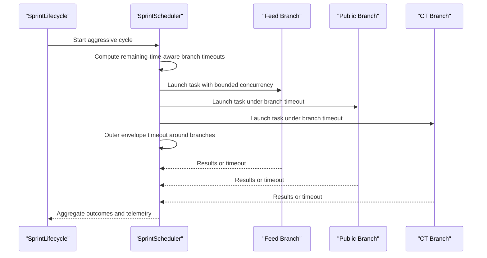
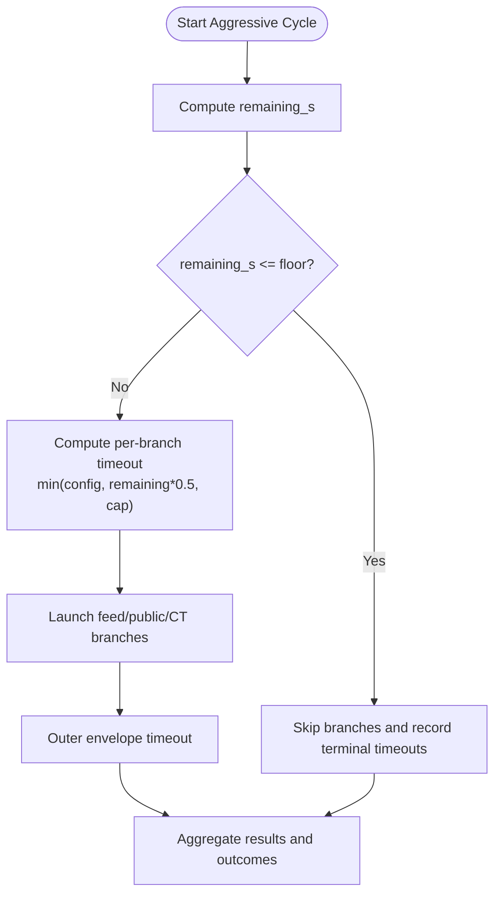
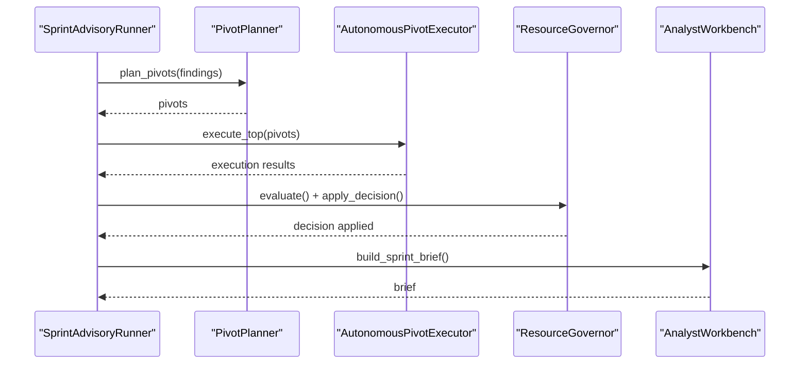
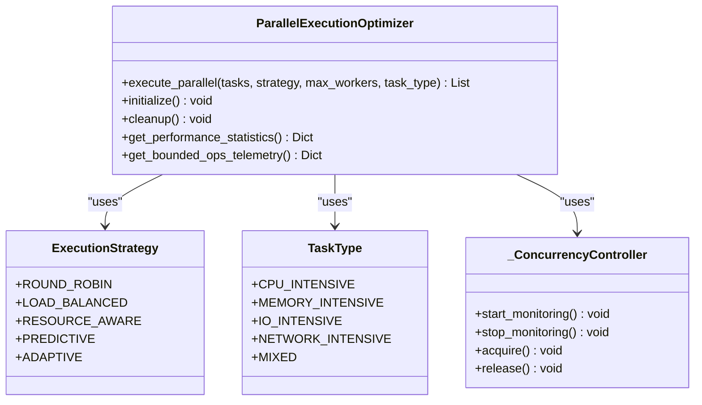
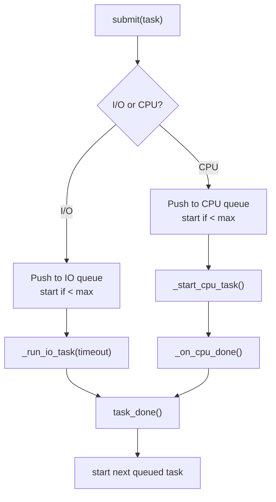
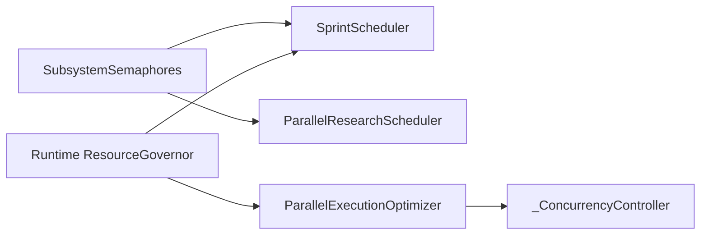
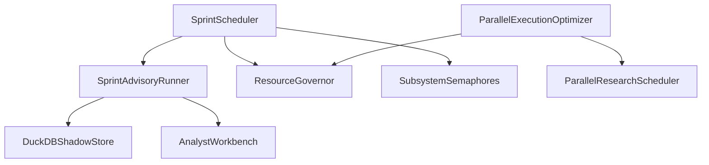

# Concurrent Execution

<cite>
**Referenced Files in This Document**
- [sprint_scheduler.py](file://runtime/sprint_scheduler.py)
- [sprint_advisory_runner.py](file://runtime/sprint_advisory_runner.py)
- [execution_optimizer.py](file://utils/execution_optimizer.py)
- [parallel_scheduler.py](file://research/parallel_scheduler.py)
- [subsystem_semaphores.py](file://orchestrator/subsystem_semaphores.py)
- [resource_governor.py](file://runtime/resource_governor.py)
- [resource_governor.py](file://core/resource_governor.py)
- [probe_f214m_execution_optimizer_backpressure.py](file://tools/probe_f214m_execution_optimizer_backpressure.py)
- [test_execution_optimizer_strategies.py](file://tests/probe_f214x_execution_optimizer_correctness/test_execution_optimizer_strategies.py)
- [test_execution_optimizer_bounded.py](file://tests/probe_f214opt_bounded_memory/test_execution_optimizer_bounded.py)
</cite>

## Table of Contents
1. [Introduction](#introduction)
2. [Project Structure](#project-structure)
3. [Core Components](#core-components)
4. [Architecture Overview](#architecture-overview)
5. [Detailed Component Analysis](#detailed-component-analysis)
6. [Dependency Analysis](#dependency-analysis)
7. [Performance Considerations](#performance-considerations)
8. [Troubleshooting Guide](#troubleshooting-guide)
9. [Conclusion](#conclusion)

## Introduction
This document explains the Concurrent Execution system that powers parallel research, branching execution, and advisory workflows. It covers:
- Parallel execution strategies and task grouping
- Branch timeout management and aggressive mode controls
- Concurrency controls and resource governance
- Advisory runner orchestration
- Execution optimization techniques and bounded pending operations
- Examples, performance tuning, debugging, thread safety, and monitoring

## Project Structure
The concurrent execution system spans several modules:
- Runtime schedulers and lifecycle management for research cycles
- Advisory runner for teardown orchestration
- Execution optimizer for parallel task strategies and bounded concurrency
- Resource governor for memory and system-aware controls
- Subsystem semaphores for fair, bounded access to shared resources

**Diagram sources**
- [sprint_scheduler.py](file://runtime/sprint_scheduler.py)
- [sprint_advisory_runner.py](file://runtime/sprint_advisory_runner.py)
- [execution_optimizer.py](file://utils/execution_optimizer.py)
- [parallel_scheduler.py](file://research/parallel_scheduler.py)
- [subsystem_semaphores.py](file://orchestrator/subsystem_semaphores.py)
- [resource_governor.py](file://runtime/resource_governor.py)
- [resource_governor.py](file://core/resource_governor.py)

**Section sources**
- [sprint_scheduler.py](file://runtime/sprint_scheduler.py)
- [sprint_advisory_runner.py](file://runtime/sprint_advisory_runner.py)
- [execution_optimizer.py](file://utils/execution_optimizer.py)
- [parallel_scheduler.py](file://research/parallel_scheduler.py)
- [subsystem_semaphores.py](file://orchestrator/subsystem_semaphores.py)
- [resource_governor.py](file://runtime/resource_governor.py)
- [resource_governor.py](file://core/resource_governor.py)

## Core Components
- SprintScheduler aggressive mode executes multiple branches concurrently with remaining-time-aware timeouts and per-branch budgets.
- SprintAdvisoryRunner orchestrates teardown steps (planner, executor, governor, brief) in a fail-soft manner.
- ParallelExecutionOptimizer provides multiple execution strategies with bounded pending operations and resource-aware worker allocation.
- ParallelResearchScheduler manages I/O and CPU tasks with priority queues, adaptive concurrency, and work-stealing hooks.
- SubsystemSemaphores enforce fairness and subsystem-specific concurrency limits.
- ResourceGovernor monitors memory and system health to apply concurrency hints and track mission budget violations.

**Section sources**
- [sprint_scheduler.py](file://runtime/sprint_scheduler.py)
- [sprint_advisory_runner.py](file://runtime/sprint_advisory_runner.py)
- [execution_optimizer.py](file://utils/execution_optimizer.py)
- [parallel_scheduler.py](file://research/parallel_scheduler.py)
- [subsystem_semaphores.py](file://orchestrator/subsystem_semaphores.py)
- [resource_governor.py](file://runtime/resource_governor.py)
- [resource_governor.py](file://core/resource_governor.py)

## Architecture Overview
The system separates concerns across lifecycle control, advisory orchestration, and execution optimization. Branches are launched concurrently with strict timeout envelopes, while execution strategies adapt to system resources and workload characteristics.

**Diagram sources**
- [sprint_scheduler.py](file://runtime/sprint_scheduler.py)

**Section sources**
- [sprint_scheduler.py](file://runtime/sprint_scheduler.py)

## Detailed Component Analysis

### Branch Timeout Management and Aggressive Mode
- Remaining-time-aware branch timeout formula caps each branch to a fraction of remaining cycle time and enforces a maximum cap and safety floor.
- Aggressive mode launches feed, public discovery, and CT branches concurrently. Each branch has its own timeout budget; slow branches cancel without affecting others.
- Outer envelope timeout ensures the entire set of branches completes within a bounded window.

**Diagram sources**
- [sprint_scheduler.py](file://runtime/sprint_scheduler.py)

**Section sources**
- [sprint_scheduler.py](file://runtime/sprint_scheduler.py)

### Advisory Runner Implementation
- Sequential teardown orchestration: planner → executor → governor → brief.
- Fail-soft per step; CancelledError is re-raised to preserve structured concurrency.
- Resource governor step records peak RSS and sidecars skipped for budget tracking.

**Diagram sources**
- [sprint_advisory_runner.py](file://runtime/sprint_advisory_runner.py)

**Section sources**
- [sprint_advisory_runner.py](file://runtime/sprint_advisory_runner.py)

### Parallel Execution Strategies and Task Grouping
- Strategies include round-robin, load-balanced, resource-aware, predictive, and adaptive.
- Bounded pending operations prevent unbounded task creation; semaphore gating protects against memory pressure.
- Worker pools are initialized with thread/process executors; M1-specific defaults mitigate Metal memory pressure.

**Diagram sources**
- [execution_optimizer.py](file://utils/execution_optimizer.py)

**Section sources**
- [execution_optimizer.py](file://utils/execution_optimizer.py)

### ParallelResearchScheduler (I/O and CPU)
- Maintains separate I/O and CPU queues with priority heaps.
- Dynamically adapts concurrency using resource allocator hints.
- Supports timeout-based I/O tasks and CPU tasks via ThreadPoolExecutor.
- Provides wait_all with event-based signaling and status reporting.

**Diagram sources**
- [parallel_scheduler.py](file://research/parallel_scheduler.py)

**Section sources**
- [parallel_scheduler.py](file://research/parallel_scheduler.py)

### Concurrency Controls and Resource Governance
- SubsystemSemaphores enforce fairness and subsystem-specific concurrency limits (e.g., IO, CPU_HEAVY, ANE).
- ResourceGovernor monitors system health and applies concurrency hints; tracks peak RSS and mission budget violations.
- Execution optimizer’s bounded pending ops and memory-based concurrency controller protect against memory pressure.

**Diagram sources**
- [subsystem_semaphores.py](file://orchestrator/subsystem_semaphores.py)
- [resource_governor.py](file://runtime/resource_governor.py)
- [execution_optimizer.py](file://utils/execution_optimizer.py)

**Section sources**
- [subsystem_semaphores.py](file://orchestrator/subsystem_semaphores.py)
- [resource_governor.py](file://runtime/resource_governor.py)
- [resource_governor.py](file://core/resource_governor.py)
- [execution_optimizer.py](file://utils/execution_optimizer.py)

## Dependency Analysis
- SprintScheduler depends on lifecycle remaining_time(), resource governor decisions, and subsystem concurrency limits.
- Advisory runner depends on duckdb store, governor, and analyst workbench for teardown steps.
- Execution optimizer integrates with resource monitors, load balancers, and bounded pending operations.
- ParallelResearchScheduler integrates with resource allocator and ThreadPoolExecutor.

**Diagram sources**
- [sprint_scheduler.py](file://runtime/sprint_scheduler.py)
- [sprint_advisory_runner.py](file://runtime/sprint_advisory_runner.py)
- [execution_optimizer.py](file://utils/execution_optimizer.py)
- [parallel_scheduler.py](file://research/parallel_scheduler.py)
- [subsystem_semaphores.py](file://orchestrator/subsystem_semaphores.py)
- [resource_governor.py](file://runtime/resource_governor.py)

**Section sources**
- [sprint_scheduler.py](file://runtime/sprint_scheduler.py)
- [sprint_advisory_runner.py](file://runtime/sprint_advisory_runner.py)
- [execution_optimizer.py](file://utils/execution_optimizer.py)
- [parallel_scheduler.py](file://research/parallel_scheduler.py)
- [subsystem_semaphores.py](file://orchestrator/subsystem_semaphores.py)
- [resource_governor.py](file://runtime/resource_governor.py)

## Performance Considerations
- Strategy selection:
  - Round-robin: balanced distribution across workers.
  - Load-balanced: distributes based on current worker loads.
  - Resource-aware: adjusts worker count and task classification by resource intensity.
  - Predictive: trains on historical data to predict and reorder tasks.
  - Adaptive: starts conservatively and increases workers based on performance samples.
- Bounded pending operations:
  - Default M1-safe limit reduces Metal memory pressure; telemetry exposes throttling metrics.
- Memory-based concurrency:
  - Background monitor adjusts CPU-bound concurrency based on available memory.
- I/O vs CPU:
  - I/O-bound tasks benefit from higher concurrency; CPU-bound tasks align with core count.
- Telemetry and reporting:
  - Performance statistics, parallel group metrics, and recent execution logs enable tuning.

[No sources needed since this section provides general guidance]

## Troubleshooting Guide
- Branch timeouts:
  - Verify remaining-time-aware computation and outer envelope timeout behavior.
  - Inspect terminal outcomes and emitted events for PUBLIC/CT timeouts.
- Advisory runner failures:
  - Fail-soft per step; check error fields and partial outcomes.
  - Confirm duckdb store availability and governor presence.
- Execution optimizer backpressure:
  - Probe confirms bounded caller scales; no patch needed at current caller patterns.
  - Review throttling telemetry for pending operations.
- Strategy correctness:
  - Tests validate strategy implementations; check for latent bugs in loop constructs.
- Resource governance:
  - Monitor peak RSS and mission budget violations; ensure governor is evaluating and applying decisions.

**Section sources**
- [sprint_scheduler.py](file://runtime/sprint_scheduler.py)
- [sprint_advisory_runner.py](file://runtime/sprint_advisory_runner.py)
- [probe_f214m_execution_optimizer_backpressure.py](file://tools/probe_f214m_execution_optimizer_backpressure.py)
- [test_execution_optimizer_strategies.py](file://tests/probe_f214x_execution_optimizer_correctness/test_execution_optimizer_strategies.py)
- [test_execution_optimizer_bounded.py](file://tests/probe_f214opt_bounded_memory/test_execution_optimizer_bounded.py)

## Conclusion
The Concurrent Execution system combines structured concurrency, adaptive strategies, and resource-aware controls to achieve robust, high-throughput research cycles. Branch timeout management, bounded pending operations, and subsystem semaphores ensure stability under varying workloads. The advisory runner provides a fail-soft teardown pipeline, while execution optimization continuously adapts to system conditions for improved performance.