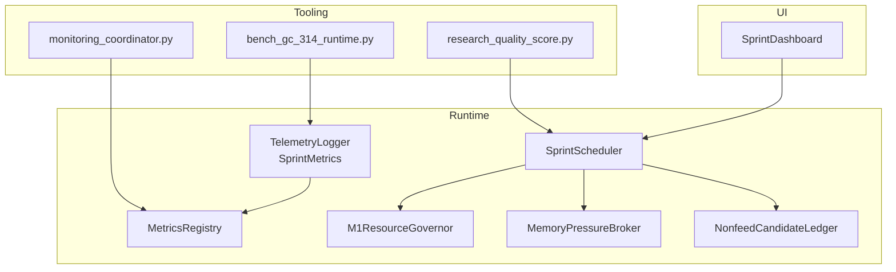
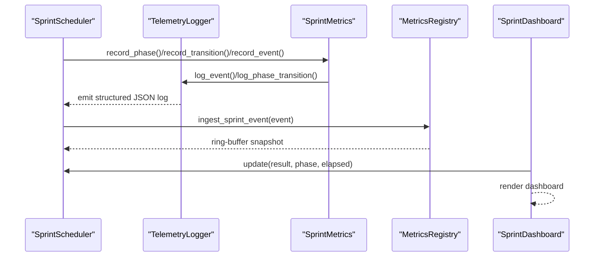
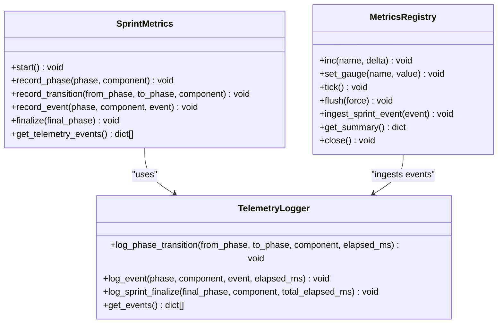
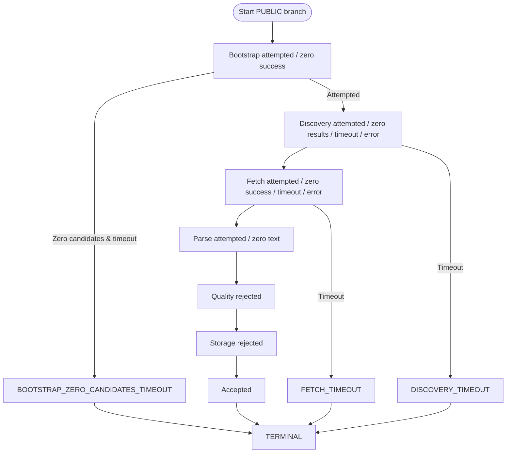
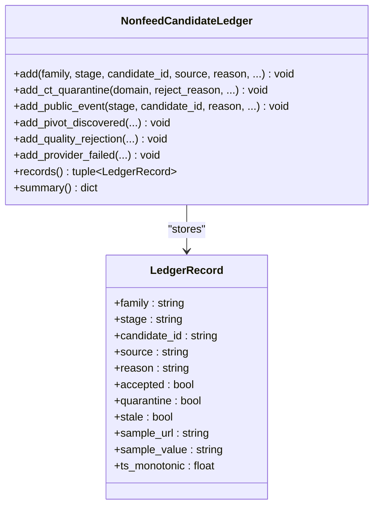
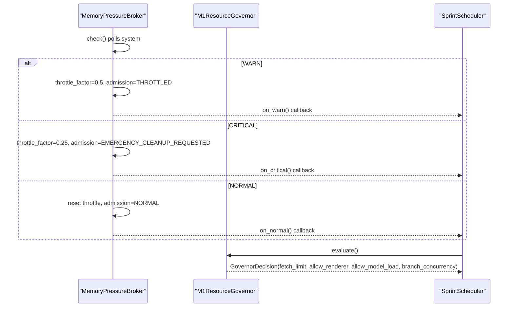
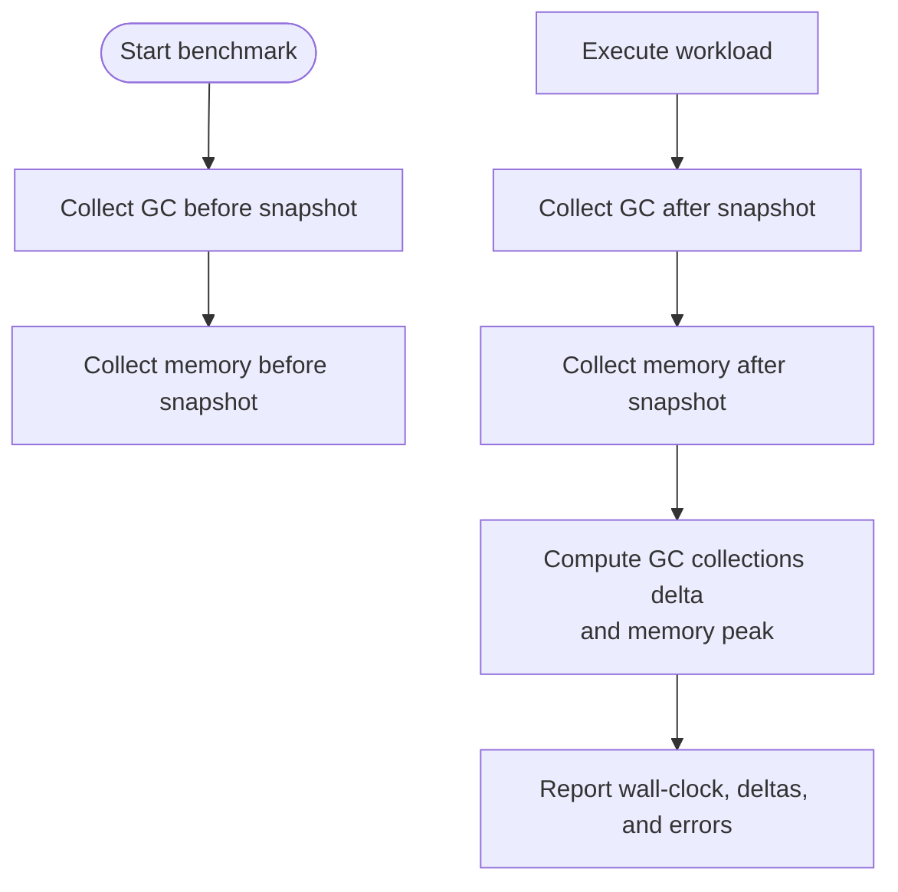
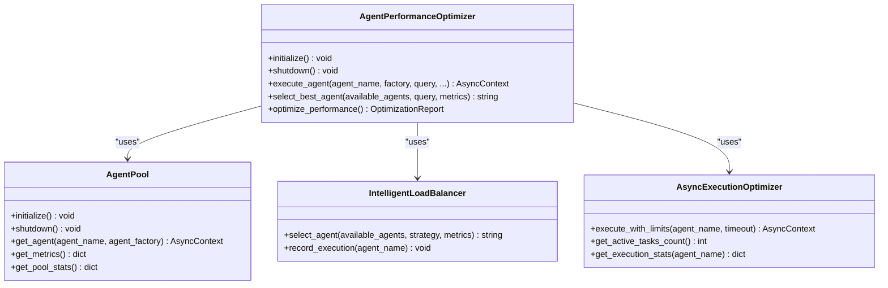
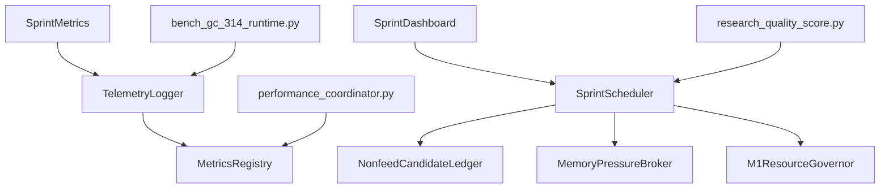

# Performance Monitoring

<cite>
**Referenced Files in This Document**
- [telemetry.py](file://runtime/telemetry.py)
- [metrics_registry.py](file://metrics_registry.py)
- [sprint_dashboard.py](file://monitoring/sprint_dashboard.py)
- [sprint_scheduler.py](file://runtime/sprint_scheduler.py)
- [nonfeed_candidate_ledger.py](file://runtime/nonfeed_candidate_ledger.py)
- [memory_pressure_broker.py](file://orchestrator/memory_pressure_broker.py)
- [resource_governor.py](file://runtime/resource_governor.py)
- [performance_coordinator.py](file://coordinators/performance_coordinator.py)
- [bench_gc_314_runtime.py](file://tools/bench_gc_314_runtime.py)
- [research_quality_score.py](file://tools/research_quality_score.py)
- [monitoring_coordinator.py](file://coordinators/monitoring_coordinator.py)
</cite>

## Table of Contents
1. [Introduction](#introduction)
2. [Project Structure](#project-structure)
3. [Core Components](#core-components)
4. [Architecture Overview](#architecture-overview)
5. [Detailed Component Analysis](#detailed-component-analysis)
6. [Dependency Analysis](#dependency-analysis)
7. [Performance Considerations](#performance-considerations)
8. [Troubleshooting Guide](#troubleshooting-guide)
9. [Conclusion](#conclusion)
10. [Appendices](#appendices)

## Introduction
This document describes the Performance Monitoring system that powers observability, diagnostics, and optimization across the Hledac agent ecosystem. It covers:
- GC telemetry collection and memory statistics tracking
- Performance metrics gathering and reporting
- Public stage computation and terminal stage derivation
- Diagnostic reporting, stage counters, rejection ledgers, and quality tracking
- Examples of setup, metric interpretation, troubleshooting, memory pressure detection, timeout handling, and optimization strategies

## Project Structure
The Performance Monitoring system spans runtime telemetry, metrics registries, dashboards, schedulers, ledgers, and governors. The following diagram maps major components and their relationships.

**Diagram sources**
- [telemetry.py:107-370](file://runtime/telemetry.py#L107-L370)
- [metrics_registry.py:86-388](file://metrics_registry.py#L86-L388)
- [sprint_scheduler.py:163-4873](file://runtime/sprint_scheduler.py#L163-L4873)
- [nonfeed_candidate_ledger.py:130-398](file://runtime/nonfeed_candidate_ledger.py#L130-L398)
- [memory_pressure_broker.py:79-323](file://orchestrator/memory_pressure_broker.py#L79-L323)
- [resource_governor.py:116-353](file://runtime/resource_governor.py#L116-L353)
- [sprint_dashboard.py:66-269](file://monitoring/sprint_dashboard.py#L66-L269)
- [bench_gc_314_runtime.py:38-158](file://tools/bench_gc_314_runtime.py#L38-L158)
- [research_quality_score.py:318-469](file://tools/research_quality_score.py#L318-L469)
- [monitoring_coordinator.py:468-509](file://coordinators/monitoring_coordinator.py#L468-L509)

**Section sources**
- [telemetry.py:1-370](file://runtime/telemetry.py#L1-L370)
- [metrics_registry.py:1-388](file://metrics_registry.py#L1-L388)
- [sprint_scheduler.py:163-4873](file://runtime/sprint_scheduler.py#L163-L4873)
- [nonfeed_candidate_ledger.py:1-398](file://runtime/nonfeed_candidate_ledger.py#L1-L398)
- [memory_pressure_broker.py:1-323](file://orchestrator/memory_pressure_broker.py#L1-L323)
- [resource_governor.py:1-353](file://runtime/resource_governor.py#L1-L353)
- [sprint_dashboard.py:1-269](file://monitoring/sprint_dashboard.py#L1-L269)
- [bench_gc_314_runtime.py:38-158](file://tools/bench_gc_314_runtime.py#L38-L158)
- [research_quality_score.py:318-469](file://tools/research_quality_score.py#L318-L469)
- [monitoring_coordinator.py:468-509](file://coordinators/monitoring_coordinator.py#L468-L509)

## Core Components
- Runtime Telemetry: Structured, fail-soft logging of phase transitions and events with JSON emission and bounded history.
- Metrics Registry: Lightweight, bounded counters/gauges with periodic flush to disk and ring-buffer snapshots.
- Sprint Scheduler: Orchestrates public and CT pipelines, computes public stage and terminal stage, aggregates counters and rejections.
- Nonfeed Candidate Ledger: Bounded in-memory ledger for candidate lifecycle events across families (PUBLIC, CT, PIVOT, etc.).
- Resource Governor: Advisory safety layer enforcing concurrency and admission rules under memory pressure.
- Memory Pressure Broker: Polling-based memory pressure detection with callback hooks and admission states.
- Dashboard: Live terminal view of phases, findings, cycle progress, branch health, and governor state.
- Tooling: Benchmarks for GC and memory snapshots, quality scoring, and monitoring coordinator for performance benchmarks.

**Section sources**
- [telemetry.py:107-370](file://runtime/telemetry.py#L107-L370)
- [metrics_registry.py:86-388](file://metrics_registry.py#L86-L388)
- [sprint_scheduler.py:163-4873](file://runtime/sprint_scheduler.py#L163-L4873)
- [nonfeed_candidate_ledger.py:130-398](file://runtime/nonfeed_candidate_ledger.py#L130-L398)
- [resource_governor.py:116-353](file://runtime/resource_governor.py#L116-L353)
- [memory_pressure_broker.py:79-323](file://orchestrator/memory_pressure_broker.py#L79-L323)
- [sprint_dashboard.py:66-269](file://monitoring/sprint_dashboard.py#L66-L269)
- [bench_gc_314_runtime.py:38-158](file://tools/bench_gc_314_runtime.py#L38-L158)
- [research_quality_score.py:318-469](file://tools/research_quality_score.py#L318-L469)
- [monitoring_coordinator.py:468-509](file://coordinators/monitoring_coordinator.py#L468-L509)

## Architecture Overview
The system integrates telemetry and metrics with scheduler-driven pipelines and diagnostic ledgers. The sequence below shows how telemetry and metrics are emitted and consumed.

**Diagram sources**
- [telemetry.py:153-370](file://runtime/telemetry.py#L153-L370)
- [metrics_registry.py:337-357](file://metrics_registry.py#L337-L357)
- [sprint_scheduler.py:163-4873](file://runtime/sprint_scheduler.py#L163-L4873)
- [sprint_dashboard.py:109-137](file://monitoring/sprint_dashboard.py#L109-L137)

## Detailed Component Analysis

### Runtime Telemetry and Metrics Collection
- TelemetryLogger: Fail-soft JSON formatter emitting structured logs with session_id, phase, component, event, elapsed_ms, and timestamp. Maintains bounded event history.
- SprintMetrics: Wrapper around TelemetryLogger to record phase enter/transition, named events, start, and finalize with total elapsed time.
- MetricsRegistry: Bounded counters/gauges with periodic flush to disk JSONL, ring-buffer snapshots, and ingestion of sprint events from TelemetryLogger.

**Diagram sources**
- [telemetry.py:107-370](file://runtime/telemetry.py#L107-L370)
- [metrics_registry.py:86-388](file://metrics_registry.py#L86-L388)

**Section sources**
- [telemetry.py:107-370](file://runtime/telemetry.py#L107-L370)
- [metrics_registry.py:86-388](file://metrics_registry.py#L86-L388)

### Public Stage Computation and Terminal Stage Derivation
- Public stage machine defines deterministic stages from bootstrap to terminal, including timeouts and zero-success conditions.
- Terminal stage is derived from the public outcome, emitting timeouts and outcomes for diagnostics.

**Diagram sources**
- [sprint_scheduler.py:163-189](file://runtime/sprint_scheduler.py#L163-L189)
- [sprint_scheduler.py:191-4873](file://runtime/sprint_scheduler.py#L191-L4873)

**Section sources**
- [sprint_scheduler.py:163-189](file://runtime/sprint_scheduler.py#L163-L189)
- [sprint_scheduler.py:191-4873](file://runtime/sprint_scheduler.py#L191-L4873)

### Diagnostic Reporting, Stage Counters, and Rejection Ledgers
- Stage counters: Public acceptance attempted/accepted/rejected, cycle counts, dedup counts, and source telemetry.
- Rejection ledgers: Quality, duplicate, and low-information rejections summarized by family.
- Nonfeed Candidate Ledger: Bounded evidence ledger capturing lifecycle events across families with bounded samples.

**Diagram sources**
- [nonfeed_candidate_ledger.py:130-398](file://runtime/nonfeed_candidate_ledger.py#L130-L398)

**Section sources**
- [sprint_scheduler.py:4123-11087](file://runtime/sprint_scheduler.py#L4123-L11087)
- [nonfeed_candidate_ledger.py:130-398](file://runtime/nonfeed_candidate_ledger.py#L130-L398)
- [research_quality_score.py:318-469](file://tools/research_quality_score.py#L318-L469)

### Memory Pressure Detection and Timeout Handling
- MemoryPressureBroker: Polling-based detection using psutil and vm_stat; triggers callbacks for WARN/CRITICAL/NORMAL with admission states and budget throttle factors.
- ResourceGovernor: Advisory safety layer evaluating UMA state, model load status, and fetch limits; sidecar admission checks with mission budget constraints.

**Diagram sources**
- [memory_pressure_broker.py:223-291](file://orchestrator/memory_pressure_broker.py#L223-L291)
- [resource_governor.py:137-217](file://runtime/resource_governor.py#L137-L217)
- [sprint_scheduler.py:4848-4873](file://runtime/sprint_scheduler.py#L4848-L4873)

**Section sources**
- [memory_pressure_broker.py:79-323](file://orchestrator/memory_pressure_broker.py#L79-L323)
- [resource_governor.py:116-353](file://runtime/resource_governor.py#L116-L353)
- [sprint_scheduler.py:4848-4873](file://runtime/sprint_scheduler.py#L4848-L4873)

### GC Telemetry and Memory Statistics Tracking
- Benchmarks collect GC snapshots (thresholds, counts, stats), memory snapshots (RSS, swap, virtual memory), and compute deltas for collections and peaks.
- These measurements support performance profiling and memory pressure diagnostics.

**Diagram sources**
- [bench_gc_314_runtime.py:61-158](file://tools/bench_gc_314_runtime.py#L61-L158)

**Section sources**
- [bench_gc_314_runtime.py:61-158](file://tools/bench_gc_314_runtime.py#L61-L158)

### Performance Optimization Coordinator
- Agent pooling, load balancing, and async execution optimization with memory-awareness and circuit-breaker logic.
- Periodic optimization cycles identify bottlenecks (high memory, slow agents, circuit breakers) and apply targeted fixes.

**Diagram sources**
- [performance_coordinator.py:116-800](file://coordinators/performance_coordinator.py#L116-L800)

**Section sources**
- [performance_coordinator.py:116-800](file://coordinators/performance_coordinator.py#L116-L800)

### Live Dashboard and Quality Scoring
- SprintDashboard provides a live terminal view of phases, findings, cycle progress, branch status, and governor state.
- research_quality_score extracts normalized metrics including acceptance counts, branch mix, and swap indicators for scoring.

**Section sources**
- [sprint_dashboard.py:66-269](file://monitoring/sprint_dashboard.py#L66-L269)
- [research_quality_score.py:318-469](file://tools/research_quality_score.py#L318-L469)

## Dependency Analysis
The following diagram highlights key dependencies among components.

**Diagram sources**
- [telemetry.py:107-370](file://runtime/telemetry.py#L107-L370)
- [metrics_registry.py:86-388](file://metrics_registry.py#L86-L388)
- [sprint_scheduler.py:163-4873](file://runtime/sprint_scheduler.py#L163-L4873)
- [nonfeed_candidate_ledger.py:130-398](file://runtime/nonfeed_candidate_ledger.py#L130-L398)
- [memory_pressure_broker.py:79-323](file://orchestrator/memory_pressure_broker.py#L79-L323)
- [resource_governor.py:116-353](file://runtime/resource_governor.py#L116-L353)
- [sprint_dashboard.py:66-269](file://monitoring/sprint_dashboard.py#L66-L269)
- [bench_gc_314_runtime.py:38-158](file://tools/bench_gc_314_runtime.py#L38-L158)
- [research_quality_score.py:318-469](file://tools/research_quality_score.py#L318-L469)
- [performance_coordinator.py:116-800](file://coordinators/performance_coordinator.py#L116-L800)

**Section sources**
- [telemetry.py:107-370](file://runtime/telemetry.py#L107-L370)
- [metrics_registry.py:86-388](file://metrics_registry.py#L86-L388)
- [sprint_scheduler.py:163-4873](file://runtime/sprint_scheduler.py#L163-L4873)
- [nonfeed_candidate_ledger.py:130-398](file://runtime/nonfeed_candidate_ledger.py#L130-L398)
- [memory_pressure_broker.py:79-323](file://orchestrator/memory_pressure_broker.py#L79-L323)
- [resource_governor.py:116-353](file://runtime/resource_governor.py#L116-L353)
- [sprint_dashboard.py:66-269](file://monitoring/sprint_dashboard.py#L66-L269)
- [bench_gc_314_runtime.py:38-158](file://tools/bench_gc_314_runtime.py#L38-L158)
- [research_quality_score.py:318-469](file://tools/research_quality_score.py#L318-L469)
- [performance_coordinator.py:116-800](file://coordinators/performance_coordinator.py#L116-L800)

## Performance Considerations
- Telemetry and metrics are fail-soft and bounded to avoid overhead and preserve runtime stability.
- Memory pressure detection uses polling to remain portable and robust; callbacks must avoid heavy work.
- Resource Governor applies advisory limits to fetch concurrency and renderer/model admission under UMA warnings/emergency states.
- Benchmarks provide controlled GC and memory sampling for profiling without disrupting production.

[No sources needed since this section provides general guidance]

## Troubleshooting Guide
Common issues and remedies:
- High memory usage: Trigger emergency cleanup in agent pools; reduce concurrency; monitor swap and governor snapshots.
- Memory pressure callbacks failing: Ensure callbacks are lightweight; heavy work should be scheduled asynchronously.
- Circuit breaker open: Inspect recent execution stats; consider resetting after cooldown; avoid stacking model loads.
- PUBLIC branch timeouts: Review timeouts and zero-candidate conditions; check dominant branch blockers and error messages.
- Metrics flush failures: Degraded mode is indicated by registry summary; investigate filesystem permissions and disk availability.

**Section sources**
- [performance_coordinator.py:303-321](file://coordinators/performance_coordinator.py#L303-L321)
- [memory_pressure_broker.py:269-291](file://orchestrator/memory_pressure_broker.py#L269-L291)
- [resource_governor.py:137-217](file://runtime/resource_governor.py#L137-L217)
- [metrics_registry.py:312-336](file://metrics_registry.py#L312-L336)
- [sprint_scheduler.py:4848-4873](file://runtime/sprint_scheduler.py#L4848-L4873)

## Conclusion
The Performance Monitoring system combines structured telemetry, bounded metrics, scheduler-driven diagnostics, and adaptive resource governance to sustain performance under memory constraints. Together with ledgers and dashboards, it enables actionable insights, timely interventions, and continuous optimization across the agent ecosystem.

[No sources needed since this section summarizes without analyzing specific files]

## Appendices

### Setup Examples
- Enable telemetry and metrics:
  - Initialize TelemetryLogger and SprintMetrics for a session.
  - Use MetricsRegistry to periodically flush counters/gauges to disk.
- Monitor live sprints:
  - Instantiate SprintDashboard and call start/update/finish during scheduling.
- Track GC and memory:
  - Use bench_gc_314_runtime.py to collect GC snapshots and memory deltas.
- Benchmark performance:
  - Use monitoring_coordinator.py to run CPU/memory/general benchmarks and inspect throughput.

**Section sources**
- [telemetry.py:107-370](file://runtime/telemetry.py#L107-L370)
- [metrics_registry.py:251-311](file://metrics_registry.py#L251-L311)
- [sprint_dashboard.py:96-137](file://monitoring/sprint_dashboard.py#L96-L137)
- [bench_gc_314_runtime.py:139-158](file://tools/bench_gc_314_runtime.py#L139-L158)
- [monitoring_coordinator.py:468-509](file://coordinators/monitoring_coordinator.py#L468-L509)

### Metric Interpretation
- Telemetry events: Use session_id, phase, component, event, elapsed_ms to trace timing and ownership.
- MetricsRegistry: Inspect counters and gauges for RAM/VMS/FDS; confirm flush cadence and persistence status.
- Public stage counters: Track acceptance attempts, accepted, and rejected counts; timeouts and blockers.
- Rejection summaries: Group by family to identify dominant reasons (quality, duplicates, low information).
- Nonfeed ledger: Review stage and family distributions; examine bounded samples for diagnosis.

**Section sources**
- [telemetry.py:37-70](file://runtime/telemetry.py#L37-L70)
- [metrics_registry.py:312-336](file://metrics_registry.py#L312-L336)
- [sprint_scheduler.py:4123-11087](file://runtime/sprint_scheduler.py#L4123-L11087)
- [nonfeed_candidate_ledger.py:335-378](file://runtime/nonfeed_candidate_ledger.py#L335-L378)

### Optimization Strategies
- Reduce concurrency under memory pressure; throttle budgets; suspend low-priority work.
- Apply governor decisions to fetch limits and admission controls; monitor denied counts.
- Use agent pooling and load balancing to stabilize latency and utilization.
- Periodically optimize memory by clearing pools and forcing garbage collection.
- Benchmark and profile to identify hotspots; adjust timeouts and circuit breaker thresholds.

**Section sources**
- [memory_pressure_broker.py:242-267](file://orchestrator/memory_pressure_broker.py#L242-L267)
- [resource_governor.py:137-217](file://runtime/resource_governor.py#L137-L217)
- [performance_coordinator.py:674-722](file://coordinators/performance_coordinator.py#L674-L722)
- [bench_gc_314_runtime.py:154-158](file://tools/bench_gc_314_runtime.py#L154-L158)