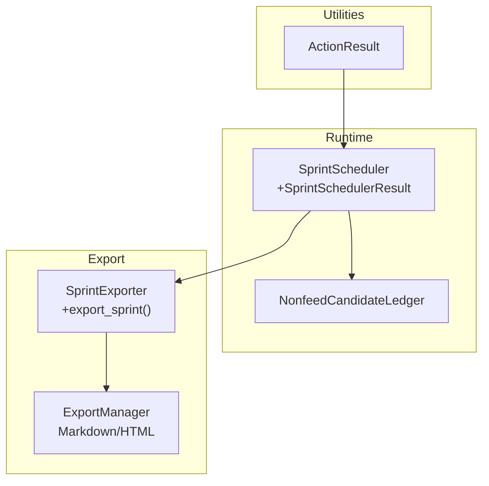
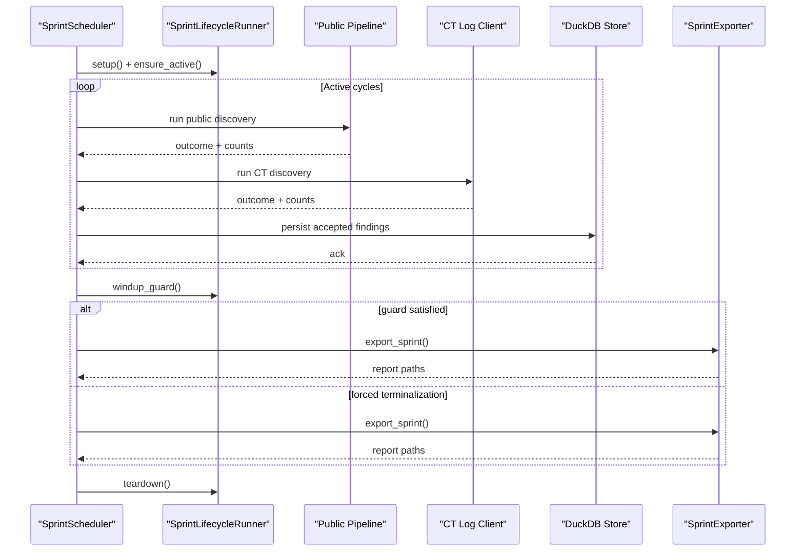
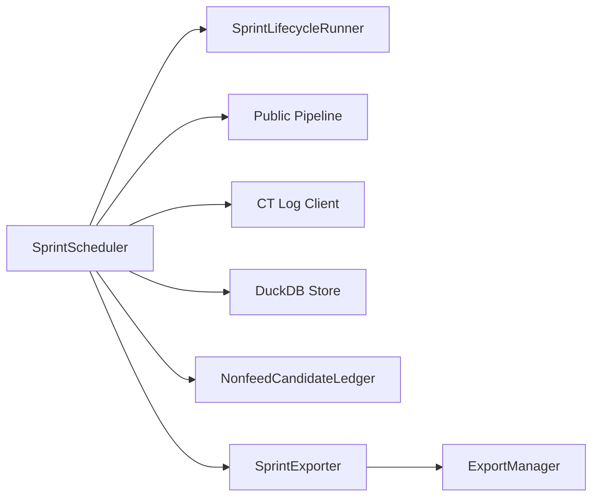

# Result Tracking

<cite>
**Referenced Files in This Document**
- [sprint_scheduler.py](file://runtime/sprint_scheduler.py)
- [sprint_exporter.py](file://export/sprint_exporter.py)
- [nonfeed_candidate_ledger.py](file://runtime/nonfeed_candidate_ledger.py)
- [action_result.py](file://utils/action_result.py)
- [export_manager.py](file://export/export_manager.py)
</cite>

## Table of Contents
1. [Introduction](#introduction)
2. [Project Structure](#project-structure)
3. [Core Components](#core-components)
4. [Architecture Overview](#architecture-overview)
5. [Detailed Component Analysis](#detailed-component-analysis)
6. [Dependency Analysis](#dependency-analysis)
7. [Performance Considerations](#performance-considerations)
8. [Troubleshooting Guide](#troubleshooting-guide)
9. [Conclusion](#conclusion)
10. [Appendices](#appendices)

## Introduction
This document explains the Result Tracking system for the Result Tracking system. It focuses on the sprint scheduler result data structure, early exit classification, and outcome reporting. It documents acceptance tracking, duplicate detection, and pattern matching metrics. It also covers public pipeline results, CT log tracking, and quality rejection ledgers. Finally, it provides examples of result interpretation, performance analysis, debugging techniques, result aggregation, export functionality, and comprehensive reporting mechanisms.

## Project Structure
The Result Tracking system spans several modules:
- Runtime scheduler and result accumulation
- Export pipeline and artifacts
- Evidence ledgers and quality tracking
- Utility result containers

**Diagram sources**
- [sprint_scheduler.py](file://runtime/sprint_scheduler.py)
- [sprint_exporter.py](file://export/sprint_exporter.py)
- [nonfeed_candidate_ledger.py](file://runtime/nonfeed_candidate_ledger.py)
- [export_manager.py](file://export/export_manager.py)
- [action_result.py](file://utils/action_result.py)

**Section sources**
- [sprint_scheduler.py](file://runtime/sprint_scheduler.py)
- [sprint_exporter.py](file://export/sprint_exporter.py)
- [nonfeed_candidate_ledger.py](file://runtime/nonfeed_candidate_ledger.py)
- [export_manager.py](file://export/export_manager.py)
- [action_result.py](file://utils/action_result.py)

## Core Components
- SprintSchedulerResult: Centralized, comprehensive result container capturing counts, metrics, and telemetry across public and CT pipelines, quality gates, and sidecars.
- EarlyExitClass: Canonical classification of why a sprint ended early, ensuring consistent reporting for durations shorter than planned.
- Public pipeline stage machine: Computes terminal stage and bounded diagnostics for PUBLIC=0 cases.
- CT log tracking: End-to-end CT loss-stage telemetry and provider status.
- Quality rejection ledger: Bounded, privacy-preserving ledger of rejections and quarantines.
- Export pipeline: Generates JSON reports, next-sprint seeds, and optional enrichment artifacts.

**Section sources**
- [sprint_scheduler.py](file://runtime/sprint_scheduler.py)
- [sprint_exporter.py](file://export/sprint_exporter.py)
- [nonfeed_candidate_ledger.py](file://runtime/nonfeed_candidate_ledger.py)

## Architecture Overview
The scheduler orchestrates bounded cycles, aggregates results, and finalizes truth at windup/teardown. The export pipeline consumes canonical truth surfaces to produce reports and seeds.

**Diagram sources**
- [sprint_scheduler.py](file://runtime/sprint_scheduler.py)
- [sprint_exporter.py](file://export/sprint_exporter.py)

## Detailed Component Analysis

### SprintSchedulerResult: Data Structure and Semantics
SprintSchedulerResult captures:
- Cycle-level counters: cycles_started, cycles_completed, unique_entry_hashes_seen, duplicate_entry_hashes_skipped
- Pattern and acceptance metrics: total_pattern_hits, accepted_findings, entries_per_source, hits_per_source
- Public pipeline canonical metrics: public_discovered, public_fetched, public_matched_patterns, public_accepted_findings, public_stored_findings, public_error
- CT log canonical metrics: ct_log_discovered, ct_log_stored, ct_log_accepted_findings, ct_log_error
- CT bridge loss-stage telemetry: ct_loss_stage, ct_bridge_invoked, ct_raw_sample_keys/count, ct_raw_count, ct_candidates_built, ct_bridge_rejections_count/reason, ct_candidates_accumulated, ct_candidates_stored, ct_storage_rejected
- CT acceptance diagnostics: ct_candidate_count, ct_valid_domain_count, ct_bridge_build_success_count, ct_bridge_quality_rejected_count
- CT expansion clues: ct_raw_domains_seen, ct_unique_domains_seen, ct_valid_public_domains, ct_wildcard_domains, ct_private_reserved_domains, ct_duplicate_candidates, ct_expansion_clues_count, ct_candidate_examples
- Quality rejection ledger: quality_rejection_ledger (tuple), quality_rejection_summary_by_family, duplicate_rejection_summary_by_family, low_information_by_family
- CT quarantine evidence: ct_quarantine_count, ct_quarantine_samples
- CT provider resilience: ct_provider_status, ct_cache_used, ct_cache_stale, ct_cache_age_s
- CT loss-stage pipeline telemetry: ct_planned, ct_scheduled, ct_provider_selected, ct_request_attempted, ct_request_timeout, ct_raw_count
- Timing and lifecycle: entered_active_at_monotonic, pre_loop_elapsed_s, first_cycle_started_at_monotonic, pre_active_starved
- Early exit classification: early_exit_class, early_exit_reason
- Public stage machine: public_terminal_stage, public_stage_counters
- Additional telemetry: branch timeouts, sidecars, budgets, acquisition outcomes, and more

EarlyExitClass defines canonical early exit reasons:
- completed_full_duration
- early_complete_no_work_remaining
- early_complete_return_guard_satisfied
- early_complete_feed_only
- aborted_by_memory
- aborted_by_deadline
- aborted_by_error

Public stage machine computes terminal stage and bounded diagnostics for PUBLIC=0 cases, including bootstrap-specific stages and discovery/fetch/parse/storage rejection reasons.

CT loss-stage tracking enumerates where raw CT evidence is lost in the live bridge path, enabling precise auditing of provider failures, bridging issues, and storage rejections.

Quality rejection ledger maintains bounded samples and summaries by family for downstream analysis.

**Section sources**
- [sprint_scheduler.py](file://runtime/sprint_scheduler.py)

### Public Pipeline Stage Machine and Outcome Reporting
The public stage machine derives a terminal stage and bounded counters from either:
- PipelineRunResult (when available), or
- _public_outcome dictionary fields

It distinguishes bootstrap-only, mixed, and discovery-only contributions to discovered URLs and maps outcomes to deterministic bootstrap and standard stages.

Key terminal stages include:
- NOT_SCHEDULED, SCHEDULED, BOOTSTRAP_ATTEMPTED, BOOTSTRAP_ZERO_SUCCESS, BOOTSTRAP_ACCEPTED, BOOTSTRAP_ATTEMPTED_TIMEOUT, BOOTSTRAP_ZERO_CANDIDATES_TIMEOUT
- DISCOVERY_ZERO_RESULTS, DISCOVERY_TIMEOUT, DISCOVERY_ERROR
- FETCH_ZERO_SUCCESS, FETCH_TIMEOUT, FETCH_ERROR
- PARSE_ZERO_TEXT
- QUALITY_REJECTED, STORAGE_REJECTED
- ACCEPTED, TERMINAL

Bounded counters include discovered_urls, fetch_attempted/success, parse_attempted/success, quality_rejected, storage_rejected, accepted_findings, rejection_reasons (top 5), error_samples (top 5), rejected_url_samples (top 5), and bootstrap-specific counters.

**Section sources**
- [sprint_scheduler.py](file://runtime/sprint_scheduler.py)

### CT Log Tracking and Loss-Stage Auditing
CT tracking includes:
- Raw counts, bridge invocation, candidate building, storage attempts, and acceptance
- Terminal stage enumeration across prelude, provider selection, request, bridging, accumulation, and storage
- Provider status and cache usage telemetry
- Expansion clues and duplicate detection for domains

Loss-stage classification enumerates where raw CT evidence is lost, including provider failure, unsupported shapes, bridge rejections, and storage rejections.

**Section sources**
- [sprint_scheduler.py](file://runtime/sprint_scheduler.py)

### Quality Rejection Ledger and Duplicate Detection
The NonfeedCandidateLedger maintains bounded, privacy-preserving records of:
- Candidate lifecycle events (discovered, fetched, parsed, quarantined, rejected, stored, accepted, provider_failed)
- Family and stage tracking
- Quarantine and accepted flags
- Sampled URLs and values (bounded)
- Stale superseding indicators

Summaries include counts per family and stage, accepted and quarantine totals, and bounded sample URLs by family.

Duplicate detection integrates with in-sprint deduplication and cross-sprint LMDB-backed dedup to avoid counting duplicates.

**Section sources**
- [nonfeed_candidate_ledger.py](file://runtime/nonfeed_candidate_ledger.py)
- [sprint_scheduler.py](file://runtime/sprint_scheduler.py)

### Export Pipeline and Reporting Mechanisms
The export pipeline produces:
- JSON report with product_value_summary, runtime_truth, canonical_run_summary, analyst brief, and capability synthesis
- Next-sprint seeds with bounded, prioritized tasks
- Optional enrichment: graph context annotations, envelope findings, sprint diffs, kill chain tags, and evidence chains (in full mode)
- Partial exports during aggressive mode and on early windup/abort for recovery

ExportManager supports Markdown and HTML export with sensitive-field filtering and output path validation.

**Section sources**
- [sprint_exporter.py](file://export/sprint_exporter.py)
- [export_manager.py](file://export/export_manager.py)

### Example Interpretation Scenarios
- PUBLIC=0 with bootstrap-only: Indicates discovery was bypassed by bootstrap candidates; terminal stage may be BOOTSTRAP_ACCEPTED or BOOTSTRAP_ZERO_SUCCESS depending on acceptance.
- PUBLIC=0 with discovery_empty: Terminal stage DISCOVERY_ZERO_RESULTS; bounded counters show discovered_urls=0 and discovery-related reasons.
- PUBLIC=0 with fetch_zero: Terminal stage FETCH_ZERO_SUCCESS; indicates discovery succeeded but fetch produced no findings.
- PUBLIC=0 with quality_rejected: Terminal stage QUALITY_REJECTED; bounded counters show parse_attempted>0 and quality_rejected>0.
- CT loss-stage analysis: If ct_loss_stage is PROVIDER_FAILURE, inspect ct_provider_status and ct_cache_used to determine fallback behavior.

**Section sources**
- [sprint_scheduler.py](file://runtime/sprint_scheduler.py)

### Performance Analysis and Debugging Techniques
- Early exit classification helps identify whether a sprint completed within planned duration or was terminated early due to work exhaustion, deadlines, or errors.
- Dominant blocker aggregation identifies whether public or feed branches dominated degradation.
- Branch timeout tracking and hard deadline enforcement help diagnose aggressive-mode timeouts and wall-clock budget violations.
- Memory telemetry (RSS, budget violations) and sidecars skipped flags aid in resource-constrained environments.
- Partial exports during aggressive mode preserve latest state for recovery.

**Section sources**
- [sprint_scheduler.py](file://runtime/sprint_scheduler.py)

## Dependency Analysis
The scheduler depends on:
- Lifecycle runner for phase transitions and windup gating
- Public and CT pipelines for canonical metrics
- DuckDB store for persistence and enrichment
- Export pipeline for artifacts and seeds
- Nonfeed candidate ledger for bounded evidence tracking

**Diagram sources**
- [sprint_scheduler.py](file://runtime/sprint_scheduler.py)
- [sprint_exporter.py](file://export/sprint_exporter.py)
- [nonfeed_candidate_ledger.py](file://runtime/nonfeed_candidate_ledger.py)
- [export_manager.py](file://export/export_manager.py)

**Section sources**
- [sprint_scheduler.py](file://runtime/sprint_scheduler.py)
- [sprint_exporter.py](file://export/sprint_exporter.py)
- [nonfeed_candidate_ledger.py](file://runtime/nonfeed_candidate_ledger.py)
- [export_manager.py](file://export/export_manager.py)

## Performance Considerations
- Aggressive mode introduces per-branch timeouts and partial exports to improve responsiveness.
- Hard deadline enforcement prevents unbounded runtime and ensures timely windup.
- Arrow batch hard cap and flush failure telemetry mitigate memory growth.
- Source economics and prefetch oracle advisory scoring influence work prioritization.
- M1 resource governor advisory and sidecar skipping protect memory-constrained environments.

[No sources needed since this section provides general guidance]

## Troubleshooting Guide
Common issues and diagnostics:
- PUBLIC=0 investigation: Use public_terminal_stage and public_stage_counters to pinpoint failure location (discovery, fetch, parse, quality, storage).
- CT provider failures: Inspect ct_provider_status, ct_cache_used, and ct_cache_age_s; evaluate ct_loss_stage for provider failure or unsupported shapes.
- Early exits: Review early_exit_class and early_exit_reason to determine cause (work exhaustion, return guard satisfaction, feed-only runs, memory, deadline, or error).
- Branch timeouts: Check branch_timeout_count and branch-level flags (public_branch_timed_out, ct_branch_timed_out).
- Memory pressure: Monitor peak_rss_gib, budget_violations, and sidecars_skipped.

**Section sources**
- [sprint_scheduler.py](file://runtime/sprint_scheduler.py)

## Conclusion
The Result Tracking system provides a comprehensive, canonical view of sprint outcomes across public and CT pipelines, quality gates, and sidecars. It offers deterministic early exit classification, precise CT loss-stage auditing, bounded quality rejection tracking, and robust export/reporting capabilities. Together, these components enable actionable insights, reliable recovery, and consistent reporting.

[No sources needed since this section summarizes without analyzing specific files]

## Appendices

### Result Aggregation and Export Functionality
- Product value summary and capability synthesis are computed and attached to JSON reports.
- Next-sprint seeds are generated from top nodes and enriched with derived signals.
- Optional full-mode exports include graph context annotations, envelope findings, sprint diffs, kill chain tags, and evidence chains.

**Section sources**
- [sprint_exporter.py](file://export/sprint_exporter.py)

### Utility Result Container
- ActionResult provides a unified container for research actions with findings, sources, hypotheses, contradictions, and metadata.

**Section sources**
- [action_result.py](file://utils/action_result.py)