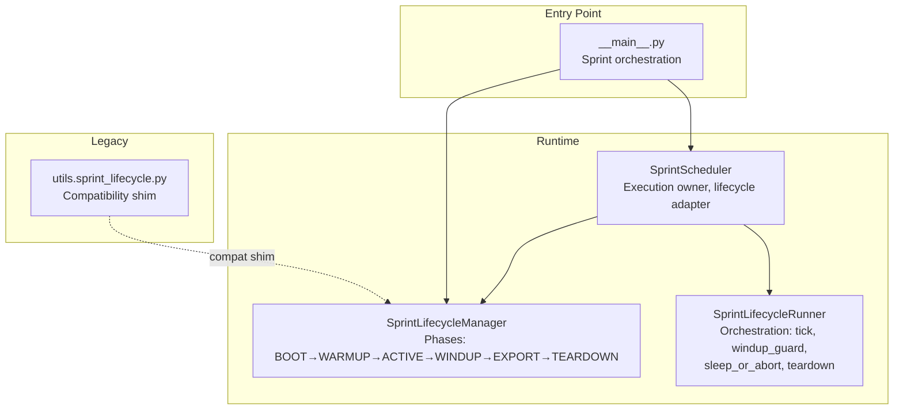
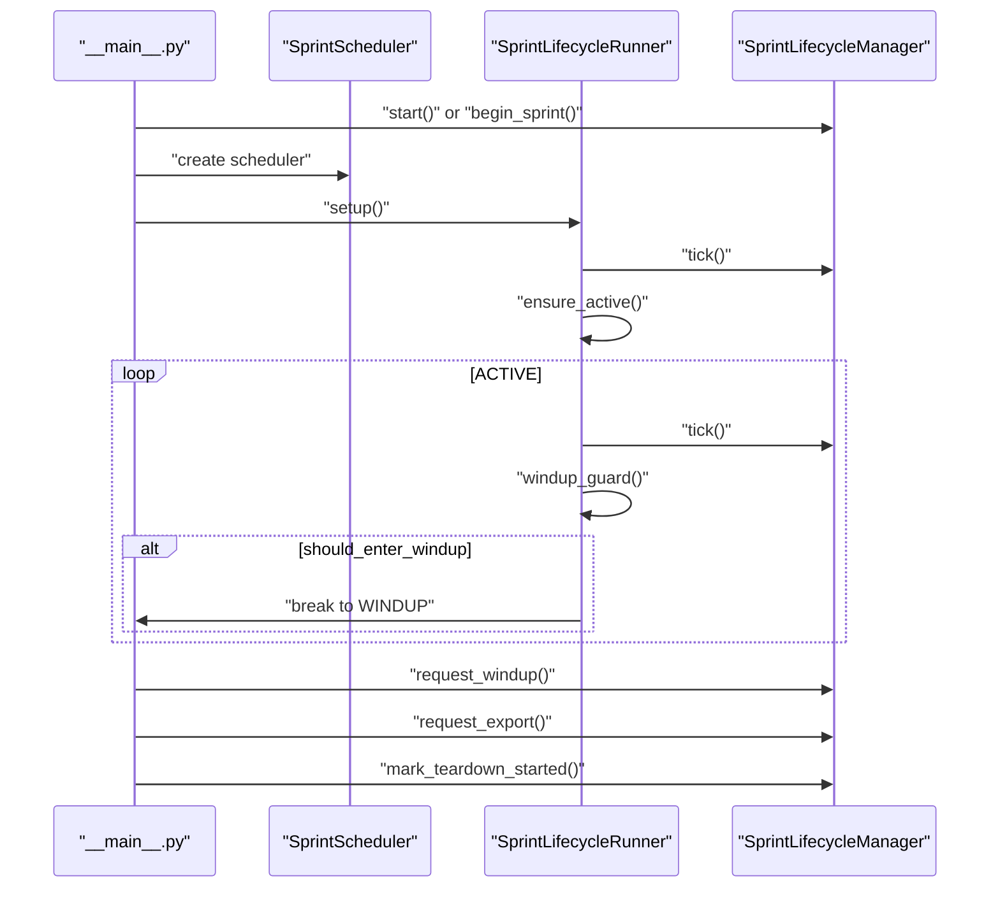
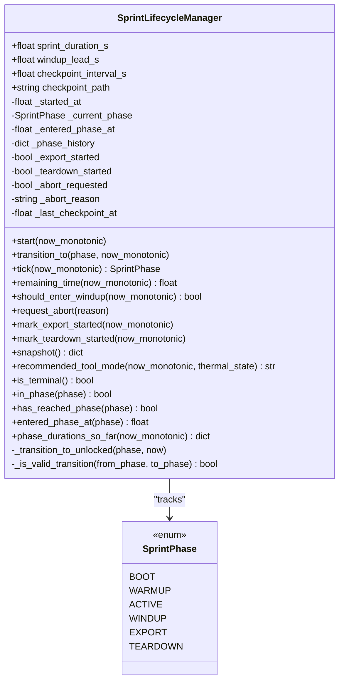
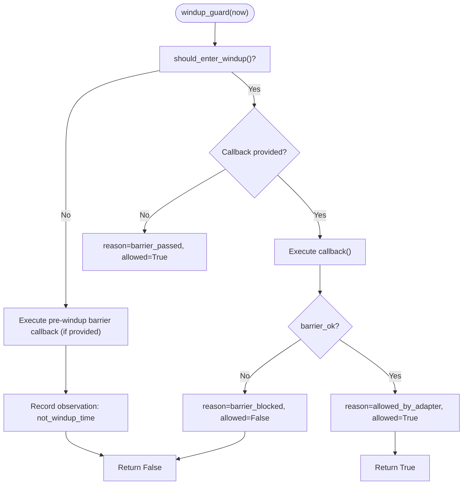
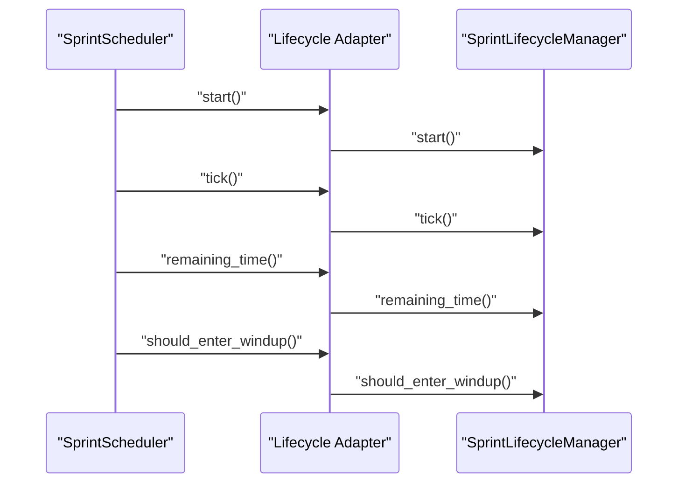
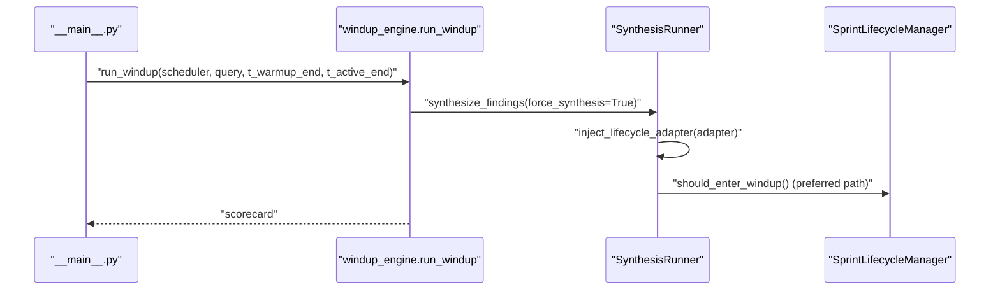
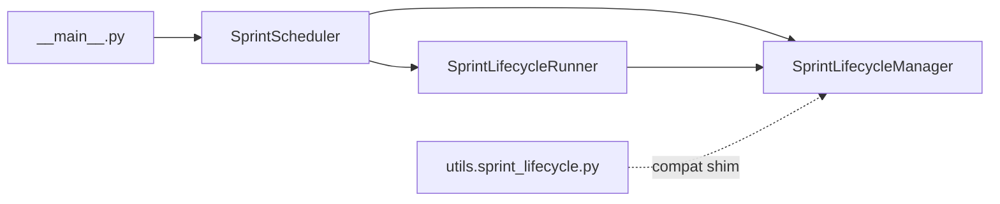

# Sprint Lifecycle Management

<cite>
**Referenced Files in This Document**
- [sprint_lifecycle.py](file://runtime/sprint_lifecycle.py)
- [sprint_lifecycle_runner.py](file://runtime/sprint_lifecycle_runner.py)
- [sprint_scheduler.py](file://runtime/sprint_scheduler.py)
- [__main__.py](file://__main__.py)
- [windup_engine.py](file://runtime/windup_engine.py)
- [synthesis_runner.py](file://brain/synthesis_runner.py)
- [sprint_lifecycle.py (compat shim)](file://utils/sprint_lifecycle.py)
- [test_sprint_mode_lifecycle_states.py](file://tests/probe_8pc/test_sprint_mode_lifecycle_states.py)
- [test_sprint_lifecycle_remaining_time.py](file://tests/probe_8pc/test_sprint_lifecycle_remaining_time.py)
- [test_sprint_lifecycle_has_warmup.py](file://tests/probe_8vi/test_sprint_lifecycle_has_warmup.py)
</cite>

## Table of Contents
1. [Introduction](#introduction)
2. [Project Structure](#project-structure)
3. [Core Components](#core-components)
4. [Architecture Overview](#architecture-overview)
5. [Detailed Component Analysis](#detailed-component-analysis)
6. [Dependency Analysis](#dependency-analysis)
7. [Performance Considerations](#performance-considerations)
8. [Troubleshooting Guide](#troubleshooting-guide)
9. [Conclusion](#conclusion)
10. [Appendices](#appendices)

## Introduction
This document describes the Sprint Lifecycle Management system that governs a bounded, time-driven execution of research and synthesis activities. The lifecycle defines six phases: BOOT, WARMUP, ACTIVE, WINDUP, EXPORT, and TEARDOWN. It enforces strict monotonic transitions, hard wind-down invariants, and deterministic timing using a monotonic clock. The system integrates a lifecycle manager, a lifecycle runner, and scheduler orchestration, with compatibility shims for legacy usage.

## Project Structure
The lifecycle is implemented in the runtime layer and integrated into the main execution flow and scheduler. Key modules:
- Canonical lifecycle manager and runner in runtime
- Scheduler that owns execution and delegates lifecycle decisions to the manager
- Legacy compatibility shim in utils
- Tests validating lifecycle behavior and timing

**Diagram sources**
- [sprint_lifecycle.py:1-531](file://runtime/sprint_lifecycle.py#L1-L531)
- [sprint_lifecycle_runner.py:1-295](file://runtime/sprint_lifecycle_runner.py#L1-L295)
- [sprint_scheduler.py:1-200](file://runtime/sprint_scheduler.py#L1-L200)
- [__main__.py:2700-2950](file://__main__.py#L2700-L2950)
- [sprint_lifecycle.py (compat shim):1-572](file://utils/sprint_lifecycle.py#L1-L572)

**Section sources**
- [sprint_lifecycle.py:1-531](file://runtime/sprint_lifecycle.py#L1-L531)
- [sprint_lifecycle_runner.py:1-295](file://runtime/sprint_lifecycle_runner.py#L1-L295)
- [sprint_scheduler.py:1-200](file://runtime/sprint_scheduler.py#L1-L200)
- [__main__.py:2700-2950](file://__main__.py#L2700-L2950)
- [sprint_lifecycle.py (compat shim):1-572](file://utils/sprint_lifecycle.py#L1-L572)

## Core Components
- SprintLifecycleManager: Canonical state machine with immutable phase ordering, monotonic transitions, and time-based guards. Supports snapshotting, diagnostics, and compatibility aliases.
- SprintLifecycleRunner: Orchestration helper that ticks the lifecycle, evaluates wind-down conditions, coordinates sleep cycles, and triggers teardown.
- SprintScheduler: Execution owner that delegates lifecycle decisions to the manager and coordinates pipeline runs, sidecars, and exports.
- Compatibility shim: Legacy utils module with compatibility aliases and orchestration helpers, superseded by the runtime manager.

Key capabilities:
- Hard wind-down invariant: automatic transition to WINDUP when remaining time drops to windup_lead_s or less.
- Abort path: TEARDOWN is reachable from any phase when abort is requested.
- Read-only diagnostics: snapshots, phase history, and duration tracking for observability.
- Thermal-aware tool mode recommendation for pruning or panic modes.

**Section sources**
- [sprint_lifecycle.py:54-531](file://runtime/sprint_lifecycle.py#L54-L531)
- [sprint_lifecycle_runner.py:38-295](file://runtime/sprint_lifecycle_runner.py#L38-L295)
- [sprint_scheduler.py:433-459](file://runtime/sprint_scheduler.py#L433-L459)
- [sprint_lifecycle.py (compat shim):85-572](file://utils/sprint_lifecycle.py#L85-L572)

## Architecture Overview
The lifecycle is the authority for time and phase transitions. The scheduler orchestrates work and consults the lifecycle for wind-down decisions. The main entry point initializes the lifecycle and drives the phases.

**Diagram sources**
- [__main__.py:2725-2950](file://__main__.py#L2725-L2950)
- [sprint_scheduler.py:440-457](file://runtime/sprint_scheduler.py#L440-L457)
- [sprint_lifecycle_runner.py:62-206](file://runtime/sprint_lifecycle_runner.py#L62-L206)
- [sprint_lifecycle.py:82-125](file://runtime/sprint_lifecycle.py#L82-L125)

## Detailed Component Analysis

### SprintLifecycleManager
The canonical lifecycle manager encapsulates:
- Phase enumeration and monotonic ordering
- Start and transition logic with validation
- Automatic wind-down guard during ACTIVE
- Abort signaling and terminal state detection
- Snapshot and diagnostic APIs
- Thermal-aware tool mode recommendation

**Diagram sources**
- [sprint_lifecycle.py:21-531](file://runtime/sprint_lifecycle.py#L21-L531)

**Section sources**
- [sprint_lifecycle.py:54-531](file://runtime/sprint_lifecycle.py#L54-L531)

### SprintLifecycleRunner
The runner encapsulates lifecycle orchestration:
- Setup: starts lifecycle via adapter
- Tick: advances phase machine
- ensure_active: transitions WARMUP→ACTIVE
- windup_guard: evaluates wind-down with optional pre-windup barrier
- post_sleep_gate: checks wind-down after sleep
- sleep_or_abort: sleeps with periodic tick and abort detection
- teardown: final transitions to EXPORT/TEARDOWN
- Abort and terminal state queries

**Diagram sources**
- [sprint_lifecycle_runner.py:101-206](file://runtime/sprint_lifecycle_runner.py#L101-L206)

**Section sources**
- [sprint_lifecycle_runner.py:38-295](file://runtime/sprint_lifecycle_runner.py#L38-L295)

### Integration in SprintScheduler
The scheduler acts as the operational executor and delegates lifecycle decisions to the manager:
- start/tick: adapts to either runtime or compat manager
- remaining_time and phase checks: authority for timing and state
- Wind-down respected: no new work after WINDUP
- Export always runs on teardown

**Diagram sources**
- [sprint_scheduler.py:440-457](file://runtime/sprint_scheduler.py#L440-L457)
- [sprint_lifecycle.py:110-132](file://runtime/sprint_lifecycle.py#L110-L132)

**Section sources**
- [sprint_scheduler.py:433-459](file://runtime/sprint_scheduler.py#L433-L459)

### Windup Engine and Synthesis Integration
The windup engine performs synthesis and preparation during WINDUP. The synthesis runner can inject a lifecycle adapter to use the canonical lifecycle gate truth.

**Diagram sources**
- [windup_engine.py:41-257](file://runtime/windup_engine.py#L41-L257)
- [synthesis_runner.py:1022-1053](file://brain/synthesis_runner.py#L1022-L1053)

**Section sources**
- [windup_engine.py:1-257](file://runtime/windup_engine.py#L1-L257)
- [synthesis_runner.py:1022-1053](file://brain/synthesis_runner.py#L1022-L1053)

## Dependency Analysis
- Runtime manager is the canonical authority; scheduler and runner depend on it for timing and transitions.
- Compatibility shim provides aliases for legacy consumers but is superseded by the runtime manager.
- Main orchestrates lifecycle transitions and delegates execution to the scheduler.

**Diagram sources**
- [__main__.py:2700-2950](file://__main__.py#L2700-L2950)
- [sprint_scheduler.py:1-200](file://runtime/sprint_scheduler.py#L1-L200)
- [sprint_lifecycle_runner.py:1-295](file://runtime/sprint_lifecycle_runner.py#L1-L295)
- [sprint_lifecycle.py:1-531](file://runtime/sprint_lifecycle.py#L1-L531)
- [sprint_lifecycle.py (compat shim):1-572](file://utils/sprint_lifecycle.py#L1-L572)

**Section sources**
- [__main__.py:2700-2950](file://__main__.py#L2700-L2950)
- [sprint_scheduler.py:1-200](file://runtime/sprint_scheduler.py#L1-L200)
- [sprint_lifecycle_runner.py:1-295](file://runtime/sprint_lifecycle_runner.py#L1-L295)
- [sprint_lifecycle.py:1-531](file://runtime/sprint_lifecycle.py#L1-L531)
- [sprint_lifecycle.py (compat shim):1-572](file://utils/sprint_lifecycle.py#L1-L572)

## Performance Considerations
- Timing uses monotonic clock to avoid wall-clock adjustments.
- Lightweight checkpoints and snapshots avoid I/O overhead.
- Thermal-aware tool mode reduces concurrency under pressure to preserve lifecycle integrity.
- Wind-down guard prevents new work after WINDUP to maintain bounded teardown.

## Troubleshooting Guide
Common issues and strategies:
- Invalid phase transitions: The manager raises a dedicated error for non-monotonic transitions. Validate configuration and ensure transitions follow the canonical order.
- Abort path: Use request_abort to signal immediate teardown; TEARDOWN becomes reachable from any phase when abort is requested.
- Wind-down timing: Verify windup_lead_s aligns with desired lead time; the manager automatically transitions during ACTIVE when remaining time drops to or below windup_lead_s.
- Teardown safety: The runner’s teardown method ensures proper progression to EXPORT/TEARDOWN; failures are handled gracefully.
- Diagnostics: Use snapshot() and phase_durations_so_far() for observability; last_guard_observation provides insights into windup_guard decisions.

**Section sources**
- [sprint_lifecycle.py:92-106](file://runtime/sprint_lifecycle.py#L92-L106)
- [sprint_lifecycle_runner.py:264-282](file://runtime/sprint_lifecycle_runner.py#L264-L282)

## Conclusion
The Sprint Lifecycle Management system provides a robust, deterministic framework for bounded research sprints. The canonical lifecycle manager enforces monotonic phases and hard wind-down invariants, while the runner and scheduler coordinate execution and transitions. Compatibility shims support legacy integrations, and comprehensive diagnostics enable monitoring and recovery.

## Appendices

### Lifecycle Phases and Transitions
- BOOT → WARMUP → ACTIVE → WINDUP → EXPORT → TEARDOWN
- Monotonic transitions enforced except TEARDOWN, which is reachable from any phase when abort is requested.
- Automatic WINDUP when remaining time ≤ windup_lead_s during ACTIVE.

**Section sources**
- [sprint_lifecycle.py:21-49](file://runtime/sprint_lifecycle.py#L21-L49)
- [sprint_lifecycle.py:110-125](file://runtime/sprint_lifecycle.py#L110-L125)

### Configuration Examples
- Duration and wind-down lead: Configure sprint_duration_s and windup_lead_s on the manager instance.
- Thermal-aware mode: recommended_tool_mode considers abort requests, remaining time thresholds, and thermal state.

**Section sources**
- [sprint_lifecycle.py:64-67](file://runtime/sprint_lifecycle.py#L64-L67)
- [sprint_lifecycle.py:210-230](file://runtime/sprint_lifecycle.py#L210-L230)

### Phase Monitoring and Debugging
- Snapshot diagnostics: snapshot() returns a JSON-serializable state representation for monitoring.
- Guard observations: last_guard_observation captures windup_guard decision-making for debugging.
- Tests: lifecycle state transitions and remaining time behavior validated by unit tests.

**Section sources**
- [sprint_lifecycle.py:182-206](file://runtime/sprint_lifecycle.py#L182-L206)
- [sprint_lifecycle_runner.py:80-82](file://runtime/sprint_lifecycle_runner.py#L80-L82)
- [test_sprint_mode_lifecycle_states.py:12-68](file://tests/probe_8pc/test_sprint_mode_lifecycle_states.py#L12-L68)
- [test_sprint_lifecycle_remaining_time.py:22-71](file://tests/probe_8pc/test_sprint_lifecycle_remaining_time.py#L22-L71)

### Windup/Wind-down Mechanisms
- Pre-windup barrier: Optional callback to gate wind-down until required lanes reach terminality.
- Post-sleep windup gate: Ensures wind-down is observed after sleep intervals.
- Sleep with lifecycle tick: sleep_or_abort periodically ticks the manager and detects abort/terminal conditions.

**Section sources**
- [sprint_lifecycle_runner.py:101-206](file://runtime/sprint_lifecycle_runner.py#L101-L206)
- [sprint_lifecycle_runner.py:248-261](file://runtime/sprint_lifecycle_runner.py#L248-L261)

### Lifecycle Boundaries, Persistence, and Recovery
- Boundaries: Hard wind-down invariant and abort path define lifecycle boundaries.
- Persistence: Snapshot and compatibility shim checkpoint seam prepare for recovery; recovery-safe snapshot excludes I/O and handles errors gracefully.
- Recovery: maybe_resume() checks checkpoint state to decide if a sprint can be resumed.

**Section sources**
- [sprint_lifecycle.py:182-206](file://runtime/sprint_lifecycle.py#L182-L206)
- [sprint_lifecycle.py (compat shim):534-564](file://utils/sprint_lifecycle.py#L534-L564)