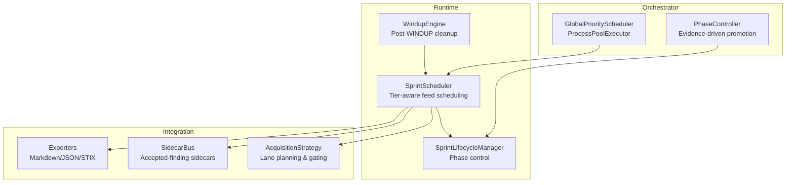
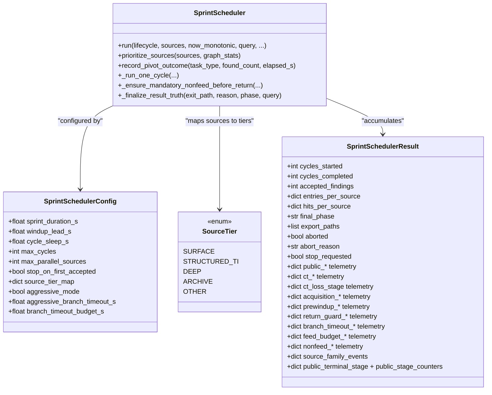
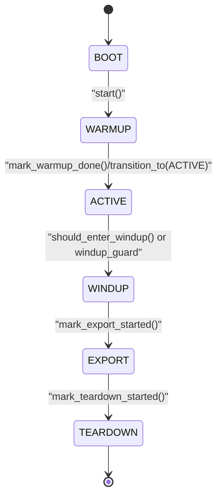
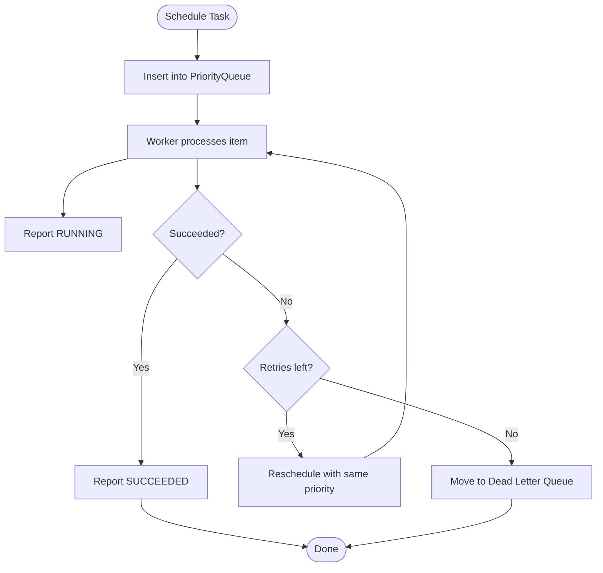
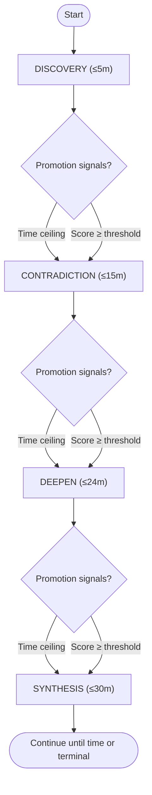
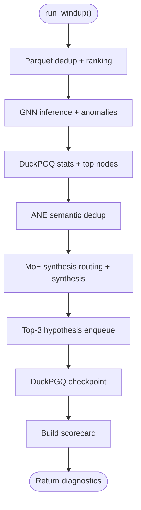
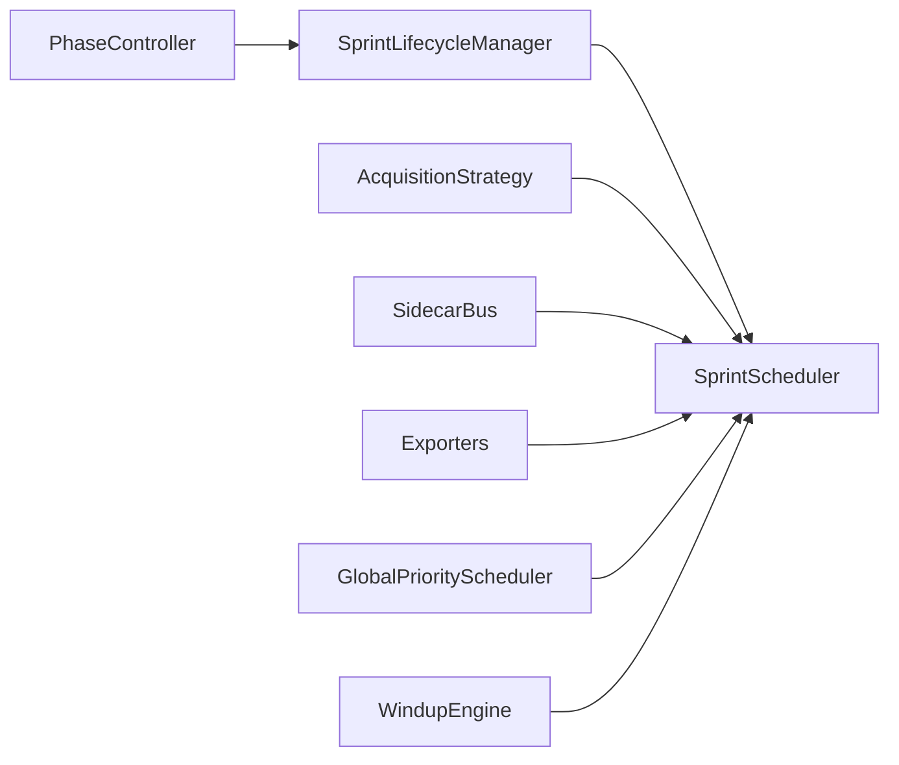

# Sprint Scheduler

<cite>
**Referenced Files in This Document**
- [sprint_scheduler.py](file://runtime/sprint_scheduler.py)
- [sprint_lifecycle.py](file://runtime/sprint_lifecycle.py)
- [global_scheduler.py](file://orchestrator/global_scheduler.py)
- [phase_controller.py](file://orchestrator/phase_controller.py)
- [windup_engine.py](file://runtime/windup_engine.py)
</cite>

## Table of Contents
1. [Introduction](#introduction)
2. [Project Structure](#project-structure)
3. [Core Components](#core-components)
4. [Architecture Overview](#architecture-overview)
5. [Detailed Component Analysis](#detailed-component-analysis)
6. [Dependency Analysis](#dependency-analysis)
7. [Performance Considerations](#performance-considerations)
8. [Troubleshooting Guide](#troubleshooting-guide)
9. [Conclusion](#conclusion)

## Introduction
This document describes the Sprint Scheduler system, a tier-aware feed scheduling mechanism that orchestrates bounded, concurrent acquisition across multiple data sources and branches (public, CT logs, nonfeed). It documents the sprint lifecycle phases (BOOT, WARMUP, ACTIVE, WINDUP, EXPORT, TEARDOWN), phase transitions, and timing controls. It also covers source priority management, concurrent execution strategies, acquisition strategy implementation, source tier mapping, budget allocation algorithms, configuration options, performance tuning, debugging techniques, and recovery mechanisms.

## Project Structure
The Sprint Scheduler resides in the runtime layer and coordinates with lifecycle managers, acquisition strategies, exporters, and sidecar systems. Supporting components include:
- Runtime lifecycle manager controlling phase transitions and timing
- Global scheduler for distributed, priority-based task execution
- Phase controller for orchestration windows and promotion gates
- Windup engine for post-WINDUP cleanup and diagnostics



**Diagram sources**
- [sprint_scheduler.py](file://runtime/sprint_scheduler.py)
- [sprint_lifecycle.py](file://runtime/sprint_lifecycle.py)
- [global_scheduler.py](file://orchestrator/global_scheduler.py)
- [phase_controller.py](file://orchestrator/phase_controller.py)
- [windup_engine.py](file://runtime/windup_engine.py)

**Section sources**
- [sprint_scheduler.py](file://runtime/sprint_scheduler.py)
- [sprint_lifecycle.py](file://runtime/sprint_lifecycle.py)
- [global_scheduler.py](file://orchestrator/global_scheduler.py)
- [phase_controller.py](file://orchestrator/phase_controller.py)
- [windup_engine.py](file://runtime/windup_engine.py)

## Core Components
- SprintScheduler: Tier-aware scheduler that manages feed acquisition, concurrency, and lifecycle integration. It builds acquisition plans, enforces budgets, and coordinates exports.
- SprintLifecycleManager: Canonical state machine governing phases, timing, and transitions.
- GlobalPriorityScheduler: Distributed task execution with priority queues and CPU affinity.
- PhaseController: Evidence-driven phase windows and promotion logic.
- WindupEngine: Post-WINDUP diagnostics and cleanup (currently dormant in production path).

**Section sources**
- [sprint_scheduler.py](file://runtime/sprint_scheduler.py)
- [sprint_lifecycle.py](file://runtime/sprint_lifecycle.py)
- [global_scheduler.py](file://orchestrator/global_scheduler.py)
- [phase_controller.py](file://orchestrator/phase_controller.py)
- [windup_engine.py](file://runtime/windup_engine.py)

## Architecture Overview
The Sprint Scheduler operates as a sidecar to the lifecycle manager. It:
- Builds an acquisition plan at start
- Executes bounded feed cycles under ACTIVE phase
- Enforces hard deadlines and per-branch timeouts
- Coordinates nonfeed pre-dispatch and return guards
- Exports results and tears down resources

```mermaid
sequenceDiagram
participant Owner as "SprintOwner"
participant Runner as "SprintLifecycleRunner"
participant Scheduler as "SprintScheduler"
participant Plan as "AcquisitionStrategy"
participant Branch as "Branches (Public/CT/Nonfeed)"
participant Export as "Exporters"
Owner->>Runner : start()
Runner->>Runner : tick() → ACTIVE
Scheduler->>Plan : build_acquisition_plan()
loop ACTIVE cycles
Scheduler->>Runner : tick()
Scheduler->>Branch : dispatch per-lane with budgets
Branch-->>Scheduler : outcomes
Scheduler->>Scheduler : enforce budgets & timeouts
alt windup guard satisfied
Runner->>Runner : tick() → WINDUP
Scheduler->>Export : partial export
break
end
end
Runner->>Runner : tick() → EXPORT → TEARDOWN
Scheduler->>Export : finalize export
```

**Diagram sources**
- [sprint_scheduler.py](file://runtime/sprint_scheduler.py)
- [sprint_lifecycle.py](file://runtime/sprint_lifecycle.py)

## Detailed Component Analysis

### Sprint Scheduler
The Sprint Scheduler is the operational backbone for 30-minute bounded sprints. It:
- Maintains in-sprint deduplication and per-source counters
- Implements source economics and optional prefetch oracle advice
- Enforces hard deadlines and per-branch timeout budgets
- Coordinates acquisition prelude, nonfeed pre-dispatch, and return guards
- Manages sidecars, metrics, and partial exports

Key responsibilities:
- Tier-aware source prioritization and per-source budgeting
- Concurrent execution with controlled parallelism and timeouts
- Early exit conditions and canonical exit classification
- Integration with acquisition strategy and export pipeline



**Diagram sources**
- [sprint_scheduler.py](file://runtime/sprint_scheduler.py)

**Section sources**
- [sprint_scheduler.py](file://runtime/sprint_scheduler.py)

### Sprint Lifecycle Manager
The lifecycle manager defines the canonical phases and timing:
- Phases: BOOT → WARMUP → ACTIVE → WINDUP → EXPORT → TEARDOWN
- Hard invariant: T-3 minute wind-down
- Timing uses monotonic time; supports recommended tool modes (normal/prune/panic)
- Provides tick-based automatic wind-up when remaining time drops below windup lead



**Diagram sources**
- [sprint_lifecycle.py](file://runtime/sprint_lifecycle.py)

**Section sources**
- [sprint_lifecycle.py](file://runtime/sprint_lifecycle.py)

### Global Priority Scheduler
A ProcessPoolExecutor-based scheduler with:
- Priority queue for ordered insertion
- CPU affinity to performance cores
- Work stealing with bounded affinity tracking
- Dead-letter queue and idempotency keys
- Timeout checker and result collector threads



**Diagram sources**
- [global_scheduler.py](file://orchestrator/global_scheduler.py)

**Section sources**
- [global_scheduler.py](file://orchestrator/global_scheduler.py)

### Phase Controller
Provides evidence-driven phase windows and promotion:
- Four-phase orchestration with max time windows
- Weighted score promotion based on signals (winner margin, beam convergence, contradiction frontier, etc.)
- Thermal-aware beam width and priority modifiers
- Time-pressure thresholds and plateau detection via novelty EMA



**Diagram sources**
- [phase_controller.py](file://orchestrator/phase_controller.py)

**Section sources**
- [phase_controller.py](file://orchestrator/phase_controller.py)

### Windup Engine
A post-WINDUP cleanup and diagnostics module (currently dormant in production). It performs:
- Deduplication and ranking
- Graph statistics and anomaly detection
- Semantic deduplication and synthesis routing
- Hypothesis enqueue and checkpointing



**Diagram sources**
- [windup_engine.py](file://runtime/windup_engine.py)

**Section sources**
- [windup_engine.py](file://runtime/windup_engine.py)

## Dependency Analysis
- SprintScheduler depends on:
  - SprintLifecycleManager for phase control and timing
  - AcquisitionStrategy for lane planning and terminality enforcement
  - SidecarBus for accepted-finding sidecars
  - Exporters for markdown/json/stix outputs
  - ResourceGovernor for advisory memory management
- GlobalPriorityScheduler is used by higher-level orchestration for distributed task execution
- PhaseController informs lifecycle timing and promotion gates



**Diagram sources**
- [sprint_scheduler.py](file://runtime/sprint_scheduler.py)
- [sprint_lifecycle.py](file://runtime/sprint_lifecycle.py)
- [global_scheduler.py](file://orchestrator/global_scheduler.py)
- [phase_controller.py](file://orchestrator/phase_controller.py)
- [windup_engine.py](file://runtime/windup_engine.py)

**Section sources**
- [sprint_scheduler.py](file://runtime/sprint_scheduler.py)
- [sprint_lifecycle.py](file://runtime/sprint_lifecycle.py)
- [global_scheduler.py](file://orchestrator/global_scheduler.py)
- [phase_controller.py](file://orchestrator/phase_controller.py)
- [windup_engine.py](file://runtime/windup_engine.py)

## Performance Considerations
- Concurrency limits:
  - max_parallel_sources controls concurrent source fetches
  - aggressive_mode enables concurrent branch execution with per-branch timeouts
  - branch_timeout_budget_s and aggressive_branch_timeout_s bound per-branch costs
- Memory governance:
  - Resource governor advisory for thermal and memory states
  - Peak RSS tracking and mission budget violations
- Budget enforcement:
  - Feed dominance budget per source to prevent over-reliance on single sources
  - Nonfeed budget telemetry for diagnostics
- Prefetch and adaptive timeouts:
  - Speculative prefetch every 15s
  - Adaptive timeout EMA per source with bounds
- Export cadence:
  - Partial exports every N findings in aggressive mode

[No sources needed since this section provides general guidance]

## Troubleshooting Guide
Common issues and remedies:
- Early exits:
  - stop_on_first_accepted triggers immediate return after first accepted finding
  - hard_deadline_exceeded forces termination when wall-clock exceeds sprint duration
  - max_cycles reached triggers finalization with mandatory nonfeed terminalization
- Windup gating:
  - pre-windup barrier ensures required nonfeed lanes reach terminal state before windup
  - windup_guard telemetry helps diagnose callback execution and reasons
- Branch timeouts:
  - branch_timeout_count increments when public/CT branches exceed timeout budget
  - aggressive_mode uses shorter per-branch timeouts to maintain responsiveness
- Memory pressure:
  - peak_rss_gib and budget_violations indicate mission budget breaches
  - sidecars_skipped indicates heavy sidecars disabled under RAM pressure
- CT pipeline losses:
  - ct_loss_stage and ct_bridge_invocation telemetry help locate where raw CT evidence is lost
- Dedup and preload:
  - dedup_preload_count and dedup_preload_elapsed_s show cross-sprint dedup initialization cost

**Section sources**
- [sprint_scheduler.py](file://runtime/sprint_scheduler.py)

## Conclusion
The Sprint Scheduler integrates tier-aware feed scheduling, acquisition strategy enforcement, and lifecycle-driven timing to deliver robust, bounded research sprints. Its design emphasizes deterministic phase transitions, strict budgeting, and comprehensive diagnostics for performance tuning and recovery. By leveraging priority-based distribution, adaptive timeouts, and nonfeed gating, it maintains reliability under varying resource conditions while supporting export-driven closure and teardown.